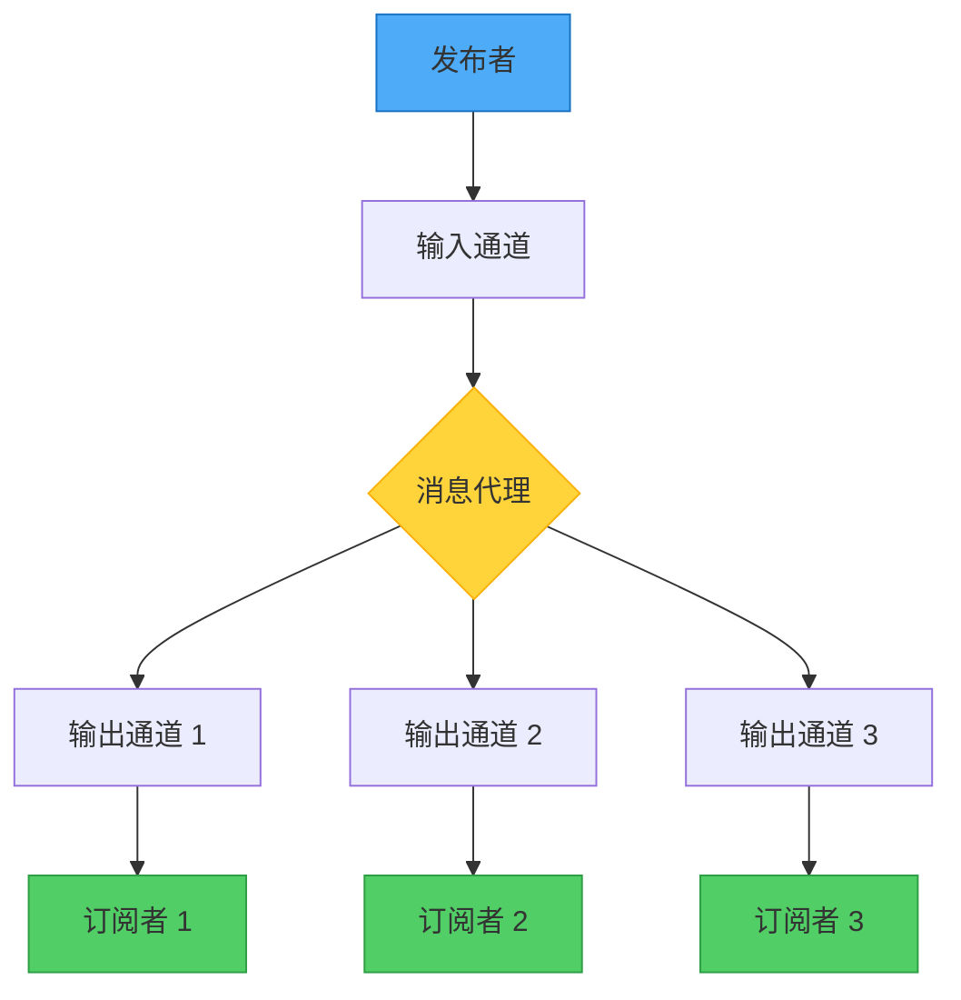
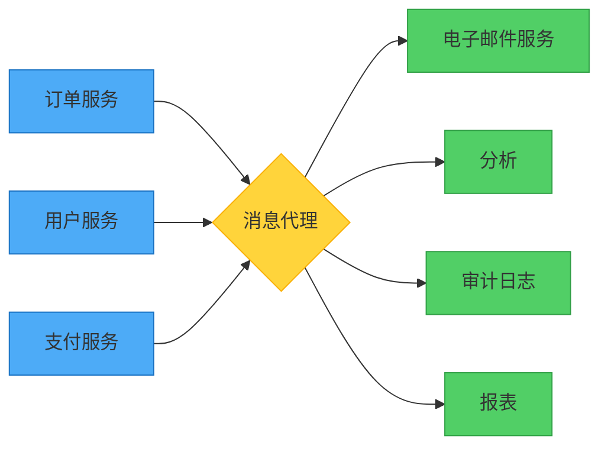

想象一家报社。他们印刷一次新闻，成千上万的订阅者就能收到，而报社不需要知道他们是谁或住在哪里。报社不会等待每个订阅者读完报纸才印刷下一期。这就是发布者-订阅者模式的本质——一种在分布式系统中解耦通信的强大方法。

## 报纸类比

就像报纸的运作方式：
- 发布者创建一次内容
- 多个订阅者接收相同内容
- 发布者不知道个别订阅者
- 传递是异步的
- 订阅者可以自由来去

在软件中，发布-订阅模式：
- 发送者发布一次消息
- 多个消费者接收消息
- 发送者不知道消费者身份
- 通信是异步的
- 消费者可以动态订阅/取消订阅



## 问题：事件分发中的紧密耦合

在分布式应用程序中，组件经常需要在事件发生时通知其他组件。传统方法会造成紧密耦合和可扩展性问题。

### 传统方法：直接通信

```javascript
class OrderService {
  async createOrder(orderData) {
    const order = await this.saveOrder(orderData);
    
    // 直接调用每个依赖服务
    await this.inventoryService.reserveItems(order.items);
    await this.paymentService.processPayment(order.payment);
    await this.shippingService.scheduleDelivery(order.address);
    await this.notificationService.sendConfirmation(order.email);
    await this.analyticsService.trackOrder(order.id);
    
    return order;
  }
}
```

!!!warning "⚠️ 直接通信的问题"
    **紧密耦合**：OrderService 必须知道所有依赖服务
    
    **阻塞**：发送者等待每个服务响应
    
    **脆弱性**：如果任何服务停机，订单创建就会失败
    
    **可扩展性**：添加消费者需要修改发送者
    
    **性能**：顺序调用增加响应时间

### 专用队列方法

```javascript
class OrderService {
  async createOrder(orderData) {
    const order = await this.saveOrder(orderData);
    
    // 发送到各个队列
    await this.inventoryQueue.send(order);
    await this.paymentQueue.send(order);
    await this.shippingQueue.send(order);
    await this.notificationQueue.send(order);
    await this.analyticsQueue.send(order);
    
    return order;
  }
}
```

!!!warning "⚠️ 专用队列的问题"
    **队列激增**：每个消费者一个队列无法扩展
    
    **仍然耦合**：发送者必须知道所有队列名称
    
    **维护负担**：添加消费者需要修改代码
    
    **重复消息**：相同消息发送多次

## 解决方案：发布者-订阅者模式

引入一个消息子系统，将发布者与订阅者解耦：

```javascript
class OrderService {
  constructor(messageBroker) {
    this.broker = messageBroker;
  }
  
  async createOrder(orderData) {
    const order = await this.saveOrder(orderData);
    
    // 发布一次 - 代理处理分发
    await this.broker.publish('orders', {
      type: 'OrderCreated',
      data: order,
      timestamp: new Date().toISOString()
    });
    
    return order;
  }
}
```

订阅者独立注册他们的兴趣：

```javascript
// 库存服务
class InventoryService {
  constructor(messageBroker) {
    this.broker = messageBroker;
  }
  
  async start() {
    await this.broker.subscribe('orders', async (message) => {
      if (message.type === 'OrderCreated') {
        await this.reserveItems(message.data.items);
      }
    });
  }
}

// 支付服务
class PaymentService {
  async start() {
    await this.broker.subscribe('orders', async (message) => {
      if (message.type === 'OrderCreated') {
        await this.processPayment(message.data.payment);
      }
    });
  }
}

// 分析服务（稍后添加，无需更改 OrderService）
class AnalyticsService {
  async start() {
    await this.broker.subscribe('orders', async (message) => {
      if (message.type === 'OrderCreated') {
        await this.trackOrder(message.data.id);
      }
    });
  }
}
```

## 关键组件

### 1. 发布者

发送消息的组件：

```javascript
class Publisher {
  constructor(broker) {
    this.broker = broker;
  }
  
  async publishEvent(topic, eventType, data) {
    const message = {
      id: this.generateMessageId(),
      type: eventType,
      data: data,
      timestamp: new Date().toISOString(),
      source: 'order-service'
    };
    
    await this.broker.publish(topic, message);
    console.log(`已发布 ${eventType} 到 ${topic}`);
  }
}
```

### 2. 消息代理

路由消息的中介者：

```javascript
class MessageBroker {
  constructor() {
    this.topics = new Map();
  }
  
  async publish(topic, message) {
    const subscribers = this.topics.get(topic) || [];
    
    // 复制消息到所有订阅者
    const deliveryPromises = subscribers.map(subscriber =>
      this.deliverMessage(subscriber, message)
    );
    
    await Promise.all(deliveryPromises);
  }
  
  async subscribe(topic, handler) {
    if (!this.topics.has(topic)) {
      this.topics.set(topic, []);
    }
    
    this.topics.get(topic).push({
      id: this.generateSubscriberId(),
      handler: handler
    });
  }
  
  async deliverMessage(subscriber, message) {
    try {
      await subscriber.handler(message);
    } catch (error) {
      console.error(`传递失败到 ${subscriber.id}:`, error);
      // 处理重试逻辑、死信队列等
    }
  }
}
```

### 3. 订阅者

接收消息的组件：

```javascript
class Subscriber {
  constructor(broker, subscriptionConfig) {
    this.broker = broker;
    this.config = subscriptionConfig;
  }
  
  async start() {
    await this.broker.subscribe(
      this.config.topic,
      this.handleMessage.bind(this)
    );
  }
  
  async handleMessage(message) {
    // 按类型过滤消息
    if (this.config.messageTypes.includes(message.type)) {
      await this.processMessage(message);
    }
  }
  
  async processMessage(message) {
    // 实现业务逻辑
  }
}
```

## 主要优势

### 1. 解耦

发布者和订阅者独立运作：



```javascript
// 发布者不知道订阅者
class OrderService {
  async createOrder(order) {
    await this.saveOrder(order);
    await this.broker.publish('orders', { type: 'OrderCreated', data: order });
    // 完成！不需要知道谁在监听
  }
}

// 添加订阅者无需更改发布者
class FraudDetectionService {
  async start() {
    // 订阅现有主题
    await this.broker.subscribe('orders', async (message) => {
      if (message.type === 'OrderCreated') {
        await this.checkForFraud(message.data);
      }
    });
  }
}
```

### 2. 可扩展性

通过独立扩展订阅者来处理增加的负载：

```javascript
// 根据负载扩展特定订阅者
class MessageBroker {
  async subscribe(topic, handler, options = {}) {
    const subscription = {
      id: this.generateSubscriberId(),
      handler: handler,
      concurrency: options.concurrency || 1
    };
    
    // 多个实例可以订阅相同主题
    this.topics.get(topic).push(subscription);
  }
}

// 部署多个慢速服务实例
for (let i = 0; i < 5; i++) {
  const emailService = new EmailService(broker);
  await emailService.start(); // 5 个实例处理电子邮件
}
```

### 3. 可靠性

即使组件失败，系统仍继续运作：

```javascript
class ResilientSubscriber {
  async handleMessage(message) {
    try {
      await this.processMessage(message);
      await this.acknowledgeMessage(message.id);
    } catch (error) {
      console.error('处理失败:', error);
      
      // 消息保留在队列中以便重试
      if (message.retryCount < 3) {
        await this.requeueMessage(message);
      } else {
        // 移至死信队列以供调查
        await this.moveToDeadLetter(message);
      }
    }
  }
}
```

### 4. 异步处理

发布者立即返回而不等待：

```javascript
class OrderService {
  async createOrder(orderData) {
    const order = await this.saveOrder(orderData);
    
    // 发布并立即返回
    await this.broker.publish('orders', {
      type: 'OrderCreated',
      data: order
    });
    
    // 返回给用户而不等待处理
    return { orderId: order.id, status: 'processing' };
  }
}

// 订阅者按自己的步调处理
class SlowEmailService {
  async handleMessage(message) {
    // 可能需要几分钟发送电子邮件
    await this.sendEmail(message.data.email);
    // 发布者已经返回给用户
  }
}
```

## 高级模式

### 基于主题的路由

按主题组织消息：

```javascript
class TopicBasedBroker {
  // 发布者发送到特定主题
  async publishToTopic(topic, message) {
    await this.broker.publish(topic, message);
  }
}

// 订阅者选择主题
await broker.subscribe('orders.created', handleOrderCreated);
await broker.subscribe('orders.cancelled', handleOrderCancelled);
await broker.subscribe('payments.processed', handlePaymentProcessed);
```

### 基于内容的过滤

订阅者按消息内容过滤：

```javascript
class FilteringSubscriber {
  async start() {
    await this.broker.subscribe('orders', async (message) => {
      // 只处理高价值订单
      if (message.data.total > 1000) {
        await this.processHighValueOrder(message.data);
      }
    });
  }
}

// 另一个具有不同过滤器的订阅者
class RegionalSubscriber {
  async start() {
    await this.broker.subscribe('orders', async (message) => {
      // 只处理特定区域的订单
      if (message.data.region === 'US-WEST') {
        await this.processRegionalOrder(message.data);
      }
    });
  }
}
```

### 通配符订阅

订阅多个相关主题：

```javascript
// 订阅所有订单相关事件
await broker.subscribe('orders.*', handleOrderEvent);

// 订阅来自服务的所有事件
await broker.subscribe('payment-service.*', handlePaymentEvent);

// 订阅所有内容（监控/日志记录）
await broker.subscribe('*', logAllEvents);
```

## 重要考量

### 消息顺序

消息可能不按顺序到达：

```javascript
class OrderAwareSubscriber {
  constructor() {
    this.processedMessages = new Set();
  }
  
  async handleMessage(message) {
    // 使处理具有幂等性
    if (this.processedMessages.has(message.id)) {
      console.log('已处理:', message.id);
      return;
    }
    
    await this.processMessage(message);
    this.processedMessages.add(message.id);
  }
}
```

### 重复消息

处理多次到达的消息：

```javascript
class IdempotentSubscriber {
  async handleMessage(message) {
    // 检查是否已处理
    const exists = await this.db.findOne({ messageId: message.id });
    if (exists) {
      return; // 跳过重复
    }
    
    // 处理并记录
    await this.processMessage(message);
    await this.db.insert({ messageId: message.id, processedAt: new Date() });
  }
}
```

### 毒消息

处理格式错误或有问题的消息：

```javascript
class SafeSubscriber {
  async handleMessage(message) {
    try {
      await this.validateMessage(message);
      await this.processMessage(message);
    } catch (error) {
      if (this.isUnrecoverable(error)) {
        // 移至死信队列
        await this.deadLetterQueue.send(message);
        console.error('检测到毒消息:', message.id);
      } else {
        // 稍后重试
        throw error;
      }
    }
  }
}
```

### 消息过期

处理时效性消息：

```javascript
class ExpirationAwareSubscriber {
  async handleMessage(message) {
    const expiresAt = new Date(message.expiresAt);
    
    if (Date.now() > expiresAt) {
      console.log('消息已过期:', message.id);
      return; // 丢弃过期消息
    }
    
    await this.processMessage(message);
  }
}
```

## 何时使用此模式

!!!tip "✅ 使用发布者-订阅者的时机"
    **广播**：需要向多个消费者发送信息
    
    **解耦**：想要独立开发服务
    
    **可扩展性**：需要处理不同组件的不同负载
    
    **异步**：不需要消费者的即时响应
    
    **可扩展性**：想要添加消费者而不更改发布者
    
    **事件驱动**：构建事件驱动架构

!!!warning "❌ 避免使用发布者-订阅者的时机"
    **少数消费者**：只有 1-2 个需求非常不同的消费者
    
    **需要实时**：需要即时、同步响应
    
    **简单通信**：直接调用会更简单且足够
    
    **保证顺序**：严格的消息顺序至关重要
    
    **事务性**：需要跨发布者和订阅者的原子操作

## 真实世界示例：电子商务订单处理

```javascript
// 订单服务发布事件
class OrderService {
  async createOrder(orderData) {
    const order = await this.db.orders.create(orderData);
    
    await this.broker.publish('orders', {
      type: 'OrderCreated',
      orderId: order.id,
      customerId: order.customerId,
      items: order.items,
      total: order.total,
      timestamp: new Date().toISOString()
    });
    
    return order;
  }
}

// 多个订阅者处理不同方面
class InventoryService {
  async start() {
    await this.broker.subscribe('orders', async (msg) => {
      if (msg.type === 'OrderCreated') {
        await this.reserveInventory(msg.items);
      }
    });
  }
}

class PaymentService {
  async start() {
    await this.broker.subscribe('orders', async (msg) => {
      if (msg.type === 'OrderCreated') {
        await this.chargeCustomer(msg.customerId, msg.total);
      }
    });
  }
}

class NotificationService {
  async start() {
    await this.broker.subscribe('orders', async (msg) => {
      if (msg.type === 'OrderCreated') {
        await this.sendConfirmationEmail(msg.customerId, msg.orderId);
      }
    });
  }
}

class AnalyticsService {
  async start() {
    await this.broker.subscribe('orders', async (msg) => {
      if (msg.type === 'OrderCreated') {
        await this.trackSale(msg.total, msg.items);
      }
    });
  }
}

// 稍后添加的服务，无需更改 OrderService
class LoyaltyService {
  async start() {
    await this.broker.subscribe('orders', async (msg) => {
      if (msg.type === 'OrderCreated') {
        await this.awardPoints(msg.customerId, msg.total);
      }
    });
  }
}
```

## 与相关模式的比较

### 发布者-订阅者 vs 观察者模式

发布-订阅模式建立在观察者模式之上，但增加了异步消息传递和代理中介者，提供更好的解耦和可扩展性。

### 发布者-订阅者 vs 消息队列

消息队列通常将每个消息传递给一个消费者（竞争消费者），而发布-订阅将每个消息传递给所有感兴趣的订阅者。

## 结论

发布者-订阅者模式对于构建可扩展、松散耦合的分布式系统至关重要。通过在发布者和订阅者之间引入消息代理，您可以获得：

- 开发和部署的独立性
- 单独扩展组件的能力
- 对组件失败的弹性
- 在不更改现有代码的情况下添加功能的灵活性

在构建需要向多个消费者广播事件的系统时，特别是在分布式环境中，发布者-订阅者模式为异步、事件驱动的通信提供了坚实的基础。

## 参考资料

- [异步消息入门](https://learn.microsoft.com/en-us/azure/architecture/patterns/async-request-reply)
- [事件驱动架构风格](https://learn.microsoft.com/en-us/azure/architecture/guide/architecture-styles/event-driven)
- [使用消息队列和事件的企业集成](https://learn.microsoft.com/en-us/azure/architecture/reference-architectures/enterprise-integration/queues-events)
