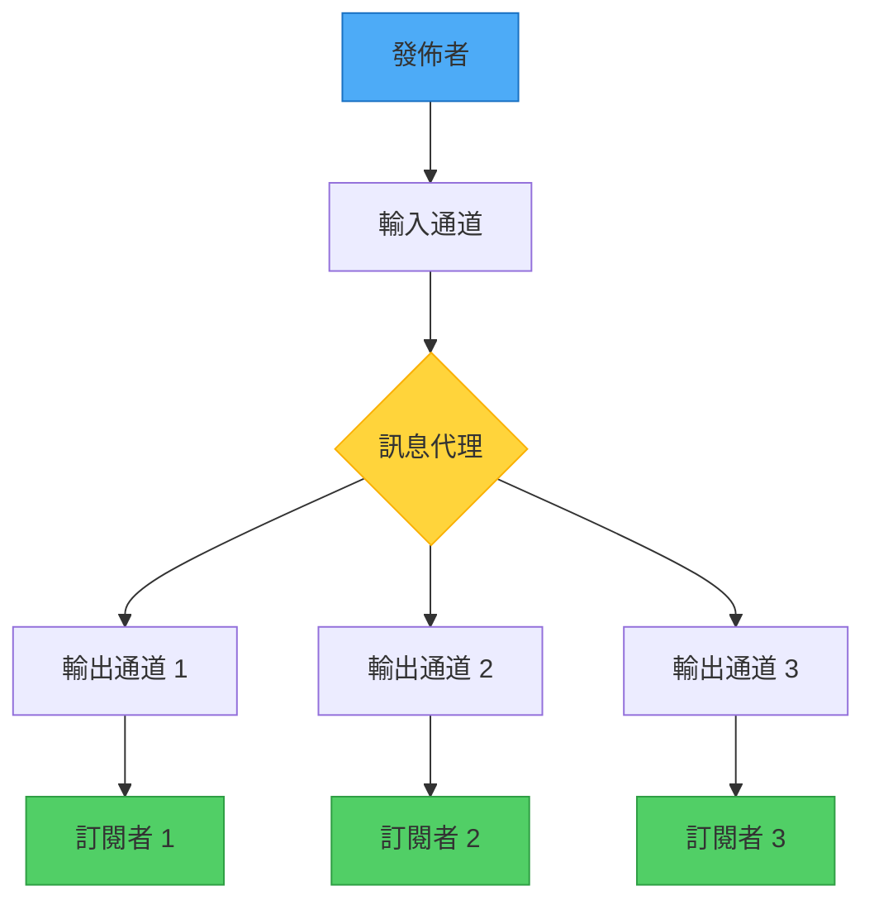
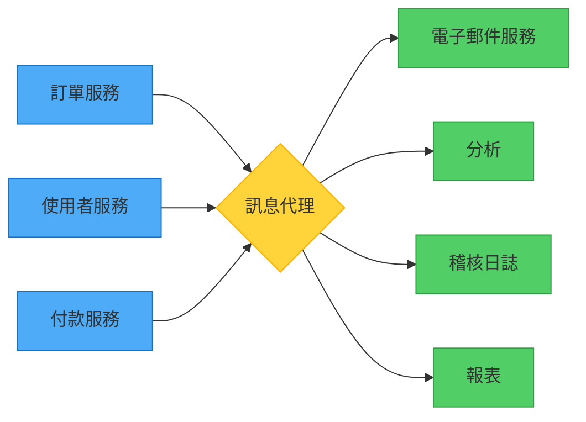

想像一家報社。他們印刷一次新聞，成千上萬的訂閱者就能收到，而報社不需要知道他們是誰或住在哪裡。報社不會等待每個訂閱者讀完報紙才印刷下一期。這就是發佈者-訂閱者模式的本質——一種在分散式系統中解耦通訊的強大方法。

## 報紙類比

就像報紙的運作方式：
- 發佈者創建一次內容
- 多個訂閱者接收相同內容
- 發佈者不知道個別訂閱者
- 傳遞是非同步的
- 訂閱者可以自由來去

在軟體中，發佈-訂閱模式：
- 發送者發佈一次訊息
- 多個消費者接收訊息
- 發送者不知道消費者身份
- 通訊是非同步的
- 消費者可以動態訂閱/取消訂閱



## 問題：事件分發中的緊密耦合

在分散式應用程式中，元件經常需要在事件發生時通知其他元件。傳統方法會造成緊密耦合和可擴展性問題。

### 傳統方法：直接通訊

```javascript
class OrderService {
  async createOrder(orderData) {
    const order = await this.saveOrder(orderData);
    
    // 直接呼叫每個相依服務
    await this.inventoryService.reserveItems(order.items);
    await this.paymentService.processPayment(order.payment);
    await this.shippingService.scheduleDelivery(order.address);
    await this.notificationService.sendConfirmation(order.email);
    await this.analyticsService.trackOrder(order.id);
    
    return order;
  }
}
```

!!!warning "⚠️ 直接通訊的問題"
    **緊密耦合**：OrderService 必須知道所有相依服務
    
    **阻塞**：發送者等待每個服務回應
    
    **脆弱性**：如果任何服務停機，訂單建立就會失敗
    
    **可擴展性**：新增消費者需要修改發送者
    
    **效能**：循序呼叫增加回應時間

### 專用佇列方法

```javascript
class OrderService {
  async createOrder(orderData) {
    const order = await this.saveOrder(orderData);
    
    // 發送到個別佇列
    await this.inventoryQueue.send(order);
    await this.paymentQueue.send(order);
    await this.shippingQueue.send(order);
    await this.notificationQueue.send(order);
    await this.analyticsQueue.send(order);
    
    return order;
  }
}
```

!!!warning "⚠️ 專用佇列的問題"
    **佇列激增**：每個消費者一個佇列無法擴展
    
    **仍然耦合**：發送者必須知道所有佇列名稱
    
    **維護負擔**：新增消費者需要修改程式碼
    
    **重複訊息**：相同訊息發送多次

## 解決方案：發佈者-訂閱者模式

引入一個訊息子系統，將發佈者與訂閱者解耦：

```javascript
class OrderService {
  constructor(messageBroker) {
    this.broker = messageBroker;
  }
  
  async createOrder(orderData) {
    const order = await this.saveOrder(orderData);
    
    // 發佈一次 - 代理處理分發
    await this.broker.publish('orders', {
      type: 'OrderCreated',
      data: order,
      timestamp: new Date().toISOString()
    });
    
    return order;
  }
}
```

訂閱者獨立註冊他們的興趣：

```javascript
// 庫存服務
class InventoryService {
  constructor(messageBroker) {
    this.broker = messageBroker;
  }
  
  async start() {
    await this.broker.subscribe('orders', async (message) => {
      if (message.type === 'OrderCreated') {
        await this.reserveItems(message.data.items);
      }
    });
  }
}

// 付款服務
class PaymentService {
  async start() {
    await this.broker.subscribe('orders', async (message) => {
      if (message.type === 'OrderCreated') {
        await this.processPayment(message.data.payment);
      }
    });
  }
}

// 分析服務（稍後新增，無需更改 OrderService）
class AnalyticsService {
  async start() {
    await this.broker.subscribe('orders', async (message) => {
      if (message.type === 'OrderCreated') {
        await this.trackOrder(message.data.id);
      }
    });
  }
}
```

## 關鍵元件

### 1. 發佈者

發送訊息的元件：

```javascript
class Publisher {
  constructor(broker) {
    this.broker = broker;
  }
  
  async publishEvent(topic, eventType, data) {
    const message = {
      id: this.generateMessageId(),
      type: eventType,
      data: data,
      timestamp: new Date().toISOString(),
      source: 'order-service'
    };
    
    await this.broker.publish(topic, message);
    console.log(`已發佈 ${eventType} 到 ${topic}`);
  }
}
```

### 2. 訊息代理

路由訊息的中介者：

```javascript
class MessageBroker {
  constructor() {
    this.topics = new Map();
  }
  
  async publish(topic, message) {
    const subscribers = this.topics.get(topic) || [];
    
    // 複製訊息到所有訂閱者
    const deliveryPromises = subscribers.map(subscriber =>
      this.deliverMessage(subscriber, message)
    );
    
    await Promise.all(deliveryPromises);
  }
  
  async subscribe(topic, handler) {
    if (!this.topics.has(topic)) {
      this.topics.set(topic, []);
    }
    
    this.topics.get(topic).push({
      id: this.generateSubscriberId(),
      handler: handler
    });
  }
  
  async deliverMessage(subscriber, message) {
    try {
      await subscriber.handler(message);
    } catch (error) {
      console.error(`傳遞失敗到 ${subscriber.id}:`, error);
      // 處理重試邏輯、死信佇列等
    }
  }
}
```

### 3. 訂閱者

接收訊息的元件：

```javascript
class Subscriber {
  constructor(broker, subscriptionConfig) {
    this.broker = broker;
    this.config = subscriptionConfig;
  }
  
  async start() {
    await this.broker.subscribe(
      this.config.topic,
      this.handleMessage.bind(this)
    );
  }
  
  async handleMessage(message) {
    // 依類型過濾訊息
    if (this.config.messageTypes.includes(message.type)) {
      await this.processMessage(message);
    }
  }
  
  async processMessage(message) {
    // 實作業務邏輯
  }
}
```

## 主要優勢

### 1. 解耦

發佈者和訂閱者獨立運作：



```javascript
// 發佈者不知道訂閱者
class OrderService {
  async createOrder(order) {
    await this.saveOrder(order);
    await this.broker.publish('orders', { type: 'OrderCreated', data: order });
    // 完成！不需要知道誰在監聽
  }
}

// 新增訂閱者無需更改發佈者
class FraudDetectionService {
  async start() {
    // 訂閱現有主題
    await this.broker.subscribe('orders', async (message) => {
      if (message.type === 'OrderCreated') {
        await this.checkForFraud(message.data);
      }
    });
  }
}
```

### 2. 可擴展性

透過獨立擴展訂閱者來處理增加的負載：

```javascript
// 根據負載擴展特定訂閱者
class MessageBroker {
  async subscribe(topic, handler, options = {}) {
    const subscription = {
      id: this.generateSubscriberId(),
      handler: handler,
      concurrency: options.concurrency || 1
    };
    
    // 多個實例可以訂閱相同主題
    this.topics.get(topic).push(subscription);
  }
}

// 部署多個慢速服務實例
for (let i = 0; i < 5; i++) {
  const emailService = new EmailService(broker);
  await emailService.start(); // 5 個實例處理電子郵件
}
```

### 3. 可靠性

即使元件失敗，系統仍繼續運作：

```javascript
class ResilientSubscriber {
  async handleMessage(message) {
    try {
      await this.processMessage(message);
      await this.acknowledgeMessage(message.id);
    } catch (error) {
      console.error('處理失敗:', error);
      
      // 訊息保留在佇列中以便重試
      if (message.retryCount < 3) {
        await this.requeueMessage(message);
      } else {
        // 移至死信佇列以供調查
        await this.moveToDeadLetter(message);
      }
    }
  }
}
```

### 4. 非同步處理

發佈者立即返回而不等待：

```javascript
class OrderService {
  async createOrder(orderData) {
    const order = await this.saveOrder(orderData);
    
    // 發佈並立即返回
    await this.broker.publish('orders', {
      type: 'OrderCreated',
      data: order
    });
    
    // 返回給使用者而不等待處理
    return { orderId: order.id, status: 'processing' };
  }
}

// 訂閱者按自己的步調處理
class SlowEmailService {
  async handleMessage(message) {
    // 可能需要幾分鐘發送電子郵件
    await this.sendEmail(message.data.email);
    // 發佈者已經返回給使用者
  }
}
```

## 進階模式

### 基於主題的路由

依主題組織訊息：

```javascript
class TopicBasedBroker {
  // 發佈者發送到特定主題
  async publishToTopic(topic, message) {
    await this.broker.publish(topic, message);
  }
}

// 訂閱者選擇主題
await broker.subscribe('orders.created', handleOrderCreated);
await broker.subscribe('orders.cancelled', handleOrderCancelled);
await broker.subscribe('payments.processed', handlePaymentProcessed);
```

### 基於內容的過濾

訂閱者依訊息內容過濾：

```javascript
class FilteringSubscriber {
  async start() {
    await this.broker.subscribe('orders', async (message) => {
      // 只處理高價值訂單
      if (message.data.total > 1000) {
        await this.processHighValueOrder(message.data);
      }
    });
  }
}

// 另一個具有不同過濾器的訂閱者
class RegionalSubscriber {
  async start() {
    await this.broker.subscribe('orders', async (message) => {
      // 只處理特定區域的訂單
      if (message.data.region === 'US-WEST') {
        await this.processRegionalOrder(message.data);
      }
    });
  }
}
```

### 萬用字元訂閱

訂閱多個相關主題：

```javascript
// 訂閱所有訂單相關事件
await broker.subscribe('orders.*', handleOrderEvent);

// 訂閱來自服務的所有事件
await broker.subscribe('payment-service.*', handlePaymentEvent);

// 訂閱所有內容（監控/日誌記錄）
await broker.subscribe('*', logAllEvents);
```

## 重要考量

### 訊息順序

訊息可能不按順序到達：

```javascript
class OrderAwareSubscriber {
  constructor() {
    this.processedMessages = new Set();
  }
  
  async handleMessage(message) {
    // 使處理具有冪等性
    if (this.processedMessages.has(message.id)) {
      console.log('已處理:', message.id);
      return;
    }
    
    await this.processMessage(message);
    this.processedMessages.add(message.id);
  }
}
```

### 重複訊息

處理多次到達的訊息：

```javascript
class IdempotentSubscriber {
  async handleMessage(message) {
    // 檢查是否已處理
    const exists = await this.db.findOne({ messageId: message.id });
    if (exists) {
      return; // 跳過重複
    }
    
    // 處理並記錄
    await this.processMessage(message);
    await this.db.insert({ messageId: message.id, processedAt: new Date() });
  }
}
```

### 毒訊息

處理格式錯誤或有問題的訊息：

```javascript
class SafeSubscriber {
  async handleMessage(message) {
    try {
      await this.validateMessage(message);
      await this.processMessage(message);
    } catch (error) {
      if (this.isUnrecoverable(error)) {
        // 移至死信佇列
        await this.deadLetterQueue.send(message);
        console.error('偵測到毒訊息:', message.id);
      } else {
        // 稍後重試
        throw error;
      }
    }
  }
}
```

### 訊息過期

處理時效性訊息：

```javascript
class ExpirationAwareSubscriber {
  async handleMessage(message) {
    const expiresAt = new Date(message.expiresAt);
    
    if (Date.now() > expiresAt) {
      console.log('訊息已過期:', message.id);
      return; // 丟棄過期訊息
    }
    
    await this.processMessage(message);
  }
}
```

## 何時使用此模式

!!!tip "✅ 使用發佈者-訂閱者的時機"
    **廣播**：需要向多個消費者發送資訊
    
    **解耦**：想要獨立開發服務
    
    **可擴展性**：需要處理不同元件的不同負載
    
    **非同步**：不需要消費者的即時回應
    
    **可擴展性**：想要新增消費者而不更改發佈者
    
    **事件驅動**：建構事件驅動架構

!!!warning "❌ 避免使用發佈者-訂閱者的時機"
    **少數消費者**：只有 1-2 個需求非常不同的消費者
    
    **需要即時**：需要即時、同步回應
    
    **簡單通訊**：直接呼叫會更簡單且足夠
    
    **保證順序**：嚴格的訊息順序至關重要
    
    **交易性**：需要跨發佈者和訂閱者的原子操作

## 真實世界範例：電子商務訂單處理

```javascript
// 訂單服務發佈事件
class OrderService {
  async createOrder(orderData) {
    const order = await this.db.orders.create(orderData);
    
    await this.broker.publish('orders', {
      type: 'OrderCreated',
      orderId: order.id,
      customerId: order.customerId,
      items: order.items,
      total: order.total,
      timestamp: new Date().toISOString()
    });
    
    return order;
  }
}

// 多個訂閱者處理不同方面
class InventoryService {
  async start() {
    await this.broker.subscribe('orders', async (msg) => {
      if (msg.type === 'OrderCreated') {
        await this.reserveInventory(msg.items);
      }
    });
  }
}

class PaymentService {
  async start() {
    await this.broker.subscribe('orders', async (msg) => {
      if (msg.type === 'OrderCreated') {
        await this.chargeCustomer(msg.customerId, msg.total);
      }
    });
  }
}

class NotificationService {
  async start() {
    await this.broker.subscribe('orders', async (msg) => {
      if (msg.type === 'OrderCreated') {
        await this.sendConfirmationEmail(msg.customerId, msg.orderId);
      }
    });
  }
}

class AnalyticsService {
  async start() {
    await this.broker.subscribe('orders', async (msg) => {
      if (msg.type === 'OrderCreated') {
        await this.trackSale(msg.total, msg.items);
      }
    });
  }
}

// 稍後新增的服務，無需更改 OrderService
class LoyaltyService {
  async start() {
    await this.broker.subscribe('orders', async (msg) => {
      if (msg.type === 'OrderCreated') {
        await this.awardPoints(msg.customerId, msg.total);
      }
    });
  }
}
```

## 與相關模式的比較

### 發佈者-訂閱者 vs 觀察者模式

發佈-訂閱模式建立在觀察者模式之上，但增加了非同步訊息傳遞和代理中介者，提供更好的解耦和可擴展性。

### 發佈者-訂閱者 vs 訊息佇列

訊息佇列通常將每個訊息傳遞給一個消費者（競爭消費者），而發佈-訂閱將每個訊息傳遞給所有感興趣的訂閱者。

## 結論

發佈者-訂閱者模式對於建構可擴展、鬆散耦合的分散式系統至關重要。透過在發佈者和訂閱者之間引入訊息代理，您可以獲得：

- 開發和部署的獨立性
- 單獨擴展元件的能力
- 對元件失敗的彈性
- 在不更改現有程式碼的情況下新增功能的靈活性

在建構需要向多個消費者廣播事件的系統時，特別是在分散式環境中，發佈者-訂閱者模式為非同步、事件驅動的通訊提供了堅實的基礎。

## 參考資料

- [非同步訊息入門](https://learn.microsoft.com/en-us/azure/architecture/patterns/async-request-reply)
- [事件驅動架構風格](https://learn.microsoft.com/en-us/azure/architecture/guide/architecture-styles/event-driven)
- [使用訊息佇列和事件的企業整合](https://learn.microsoft.com/en-us/azure/architecture/reference-architectures/enterprise-integration/queues-events)
