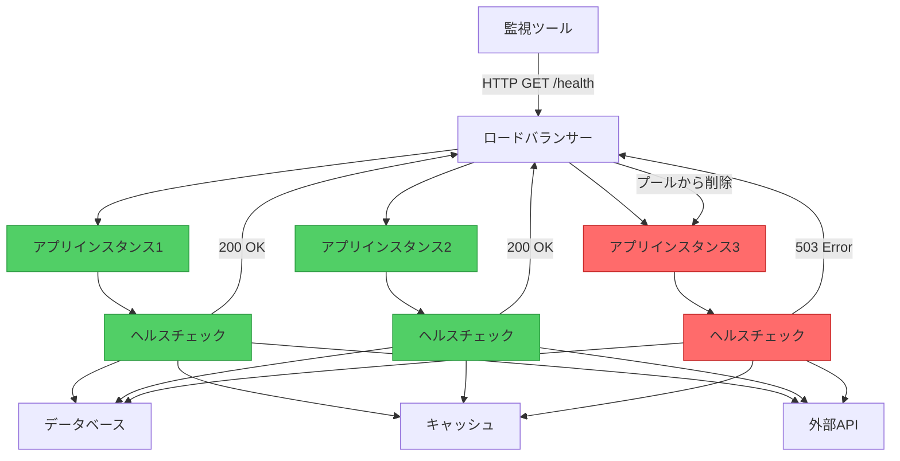

医師のオフィスで、患者がいつでも簡単なヘルスチェック——体温、血圧、心拍数——を受けられることを想像してください。医師は何かが間違っているかを知るために手術を行う必要はありません。これらのシンプルなバイタルサインが患者の健康状態を明らかにします。これがHealth Endpoint Monitoringパターンがアプリケーションに対して行うことです：サービスが健康かどうかをチェックする迅速で非侵襲的な方法を提供します。

## 課題：問題が発生したときに知る

モダンな分散システムでは、アプリケーションは複数のコンポーネントに依存します：
- データベースとストレージシステム
- 外部APIとサービス
- メッセージキュー
- キャッシュ層
- ネットワークインフラストラクチャ

これらのいずれかが失敗する可能性があり、失敗したときは、ユーザーが気づく前に即座に知る必要があります。

### 従来のアプローチ：苦情を待つ

```javascript
// アプリケーションは盲目的に実行
class PaymentService {
  async processPayment(order) {
    try {
      // データベースが利用可能であることを期待
      await this.database.save(order);
      
      // 支払いゲートウェイが機能することを期待
      await this.paymentGateway.charge(order.amount);
      
      return { success: true };
    } catch (error) {
      // ユーザーが最初に問題を発見
      console.error('Payment failed:', error);
      return { success: false, error: error.message };
    }
  }
}
```

!!!warning "⚠️ リアクティブ監視の問題"
    **遅い検出**：ユーザーが苦情を言ったときに障害について学ぶ
    
    **悪いユーザー体験**：ユーザーが重要な操作中にエラーに遭遇
    
    **診断が困難**：何が失敗し、いつ失敗したかを判断するのが難しい
    
    **プロアクティブなアクションなし**：問題を防いだり、トラフィックを再ルーティングできない

## 解決策：Health Endpoint Monitoring

外部監視ツールが定期的にチェックしてアプリケーションの健康状態を確認できる専用エンドポイントを公開します。



### 基本的な実装

```javascript
// シンプルなヘルスエンドポイント
class HealthCheckController {
  async checkHealth(req, res) {
    try {
      // アプリケーションが実行中であることを確認
      const status = {
        status: 'healthy',
        timestamp: new Date().toISOString(),
        uptime: process.uptime()
      };
      
      res.status(200).json(status);
    } catch (error) {
      res.status(503).json({
        status: 'unhealthy',
        error: error.message
      });
    }
  }
}

// エンドポイントを登録
app.get('/health', (req, res) => {
  healthCheck.checkHealth(req, res);
});
```

### 包括的なヘルスチェック

堅牢なヘルスエンドポイントは重要な依存関係を確認します：

```javascript
class ComprehensiveHealthCheck {
  constructor(database, cache, externalService) {
    this.database = database;
    this.cache = cache;
    this.externalService = externalService;
  }
  
  async checkHealth(req, res) {
    const checks = {
      status: 'healthy',
      timestamp: new Date().toISOString(),
      checks: {}
    };
    
    // データベース接続をチェック
    try {
      await this.database.ping();
      checks.checks.database = {
        status: 'healthy',
        responseTime: await this.measureResponseTime(
          () => this.database.ping()
        )
      };
    } catch (error) {
      checks.status = 'unhealthy';
      checks.checks.database = {
        status: 'unhealthy',
        error: error.message
      };
    }
    
    // キャッシュの可用性をチェック
    try {
      await this.cache.set('health_check', 'ok', 10);
      const value = await this.cache.get('health_check');
      
      checks.checks.cache = {
        status: value === 'ok' ? 'healthy' : 'degraded',
        responseTime: await this.measureResponseTime(
          () => this.cache.get('health_check')
        )
      };
    } catch (error) {
      checks.status = 'degraded';
      checks.checks.cache = {
        status: 'unhealthy',
        error: error.message
      };
    }
    
    // 外部サービスをチェック
    try {
      const response = await this.externalService.healthCheck();
      checks.checks.externalService = {
        status: response.ok ? 'healthy' : 'degraded',
        responseTime: response.time
      };
    } catch (error) {
      checks.status = 'degraded';
      checks.checks.externalService = {
        status: 'unhealthy',
        error: error.message
      };
    }
    
    // 適切なステータスコードを返す
    const statusCode = checks.status === 'healthy' ? 200 : 503;
    res.status(statusCode).json(checks);
  }
  
  async measureResponseTime(operation) {
    const start = Date.now();
    await operation();
    return Date.now() - start;
  }
}
```

## ヘルスチェックレベル

異なる目的のための異なるエンドポイント：

### 1. Liveness Probe

「アプリケーションは実行中か？」に答える

```javascript
// 最小限のチェック - プロセスが生きていることを確認するだけ
app.get('/health/live', (req, res) => {
  res.status(200).json({ status: 'alive' });
});
```

### 2. Readiness Probe

「アプリケーションはリクエストを処理する準備ができているか？」に答える

```javascript
// 依存関係が利用可能かチェック
app.get('/health/ready', async (req, res) => {
  try {
    // 重要な依存関係を確認
    await database.ping();
    await cache.ping();
    
    res.status(200).json({ status: 'ready' });
  } catch (error) {
    // トラフィックを処理する準備ができていない
    res.status(503).json({ 
      status: 'not_ready',
      reason: error.message 
    });
  }
});
```

### 3. 詳細なヘルスチェック

「各コンポーネントのステータスは？」に答える

```javascript
app.get('/health/detailed', async (req, res) => {
  const health = await comprehensiveHealthCheck.checkAll();
  
  res.status(health.status === 'healthy' ? 200 : 503).json({
    status: health.status,
    components: {
      database: health.database,
      cache: health.cache,
      messageQueue: health.messageQueue,
      externalAPIs: health.externalAPIs
    },
    metrics: {
      requestsPerSecond: metrics.getRequestRate(),
      averageResponseTime: metrics.getAverageResponseTime(),
      errorRate: metrics.getErrorRate()
    }
  });
});
```

## ベストプラクティス

!!!tip "💡 ヘルスチェックガイドライン"
    **高速に保つ**：ヘルスチェックは1秒未満で完了すべき
    
    **依存関係をチェック**：データベースなどの重要なコンポーネントを確認
    
    **適切なタイムアウトを使用**：ヘルスチェックを無期限にハングさせない
    
    **意味のあるステータスを返す**：適切なHTTPステータスコードを使用
    
    **結果をキャッシュ**：チェックでシステムを圧倒しないように
    
    **機密エンドポイントを保護**：詳細なヘルス情報を保護
    
    **モニターを監視**：監視システムが機能していることを確認

## このパターンを使用するタイミング

このパターンは次の場合に不可欠です：

✅ **Webアプリケーション**：可用性と正しい動作を確認

✅ **マイクロサービス**：分散システムで個々のサービスの健康状態を監視

✅ **ロードバランスされたアプリケーション**：健康なインスタンスへの自動トラフィックルーティングを有効化

✅ **オートスケーリングシステム**：インスタンスを追加または削除するタイミングを決定

✅ **高可用性システム**：フェイルオーバーのために障害を迅速に検出

## 結論

Health Endpoint Monitoringパターンは、アプリケーションのバイタルサインモニターです。医師がシンプルなチェックを使用して患者の健康を評価するように、監視ツールはヘルスエンドポイントを使用してアプリケーションが正しく機能していることを確認します。適切なヘルスチェックを実装することで、次のことができます：

- ユーザーが遭遇する前に障害を検出
- 健康なインスタンスへの自動トラフィックルーティングを有効化
- システムの健康状態への可視性を提供
- オートスケーリングと自己修復システムをサポート

シンプルなlivenessチェックから始めて、システムが成長するにつれて徐々により包括的なヘルス検証を追加してください。覚えておいてください：健康なアプリケーションとは、自分が病気であることを知っているアプリケーションです。

## 参考文献

- [Health Endpoint Monitoring Pattern - Microsoft Learn](https://learn.microsoft.com/en-us/azure/architecture/patterns/health-endpoint-monitoring)
