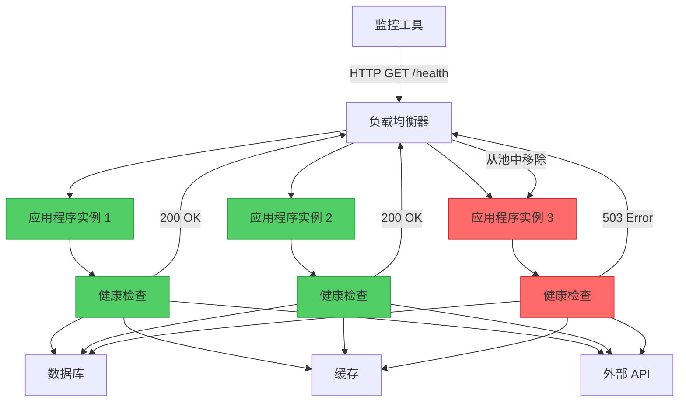
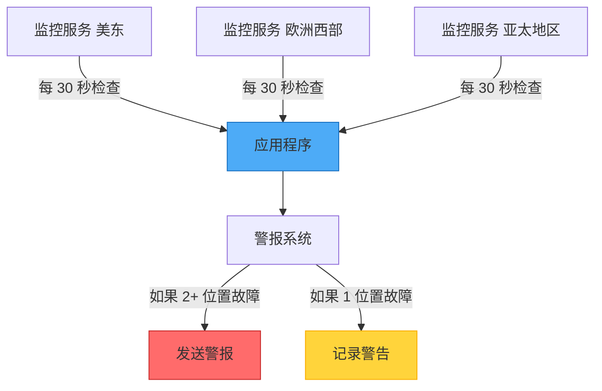

想象一间诊所，病人可以随时走进去做快速健康检查——量体温、血压、心跳——几分钟内就能测量完毕。医生不需要进行手术就能知道是否有问题；这些简单的生命体征就能揭示病人的健康状态。这正是健康端点监控模式为应用程序所做的事：它提供一种快速、非侵入式的方法来检查服务是否健康。

## 挑战：在问题发生时及时发现

在现代分布式系统中，应用程序依赖多个组件：
- 数据库和存储系统
- 外部 API 和服务
- 消息队列
- 缓存层
- 网络基础设施

这些组件都可能故障，当它们故障时，你需要立即知道——在用户发现之前。

### 传统方法：等待抱怨

```javascript
// 应用程序盲目运行
class PaymentService {
  async processPayment(order) {
    try {
      // 希望数据库可用
      await this.database.save(order);
      
      // 希望支付网关正常
      await this.paymentGateway.charge(order.amount);
      
      return { success: true };
    } catch (error) {
      // 用户首先发现问题
      console.error('Payment failed:', error);
      return { success: false, error: error.message };
    }
  }
}
```

!!!warning "⚠️ 被动监控的问题"
    **延迟检测**：当用户抱怨时才知道故障
    
    **糟糕的用户体验**：用户在关键操作时遇到错误
    
    **难以诊断**：很难确定什么故障以及何时故障
    
    **无法主动行动**：无法预防问题或重新路由流量

## 解决方案：健康端点监控

公开专用端点，让外部监控工具可以定期检查以验证应用程序的健康状态。



### 基本实现

```javascript
// 简单的健康端点
class HealthCheckController {
  async checkHealth(req, res) {
    try {
      // 验证应用程序正在运行
      const status = {
        status: 'healthy',
        timestamp: new Date().toISOString(),
        uptime: process.uptime()
      };
      
      res.status(200).json(status);
    } catch (error) {
      res.status(503).json({
        status: 'unhealthy',
        error: error.message
      });
    }
  }
}

// 注册端点
app.get('/health', (req, res) => {
  healthCheck.checkHealth(req, res);
});
```

### 全面的健康检查

强健的健康端点会验证关键依赖项：

```javascript
class ComprehensiveHealthCheck {
  constructor(database, cache, externalService) {
    this.database = database;
    this.cache = cache;
    this.externalService = externalService;
  }
  
  async checkHealth(req, res) {
    const checks = {
      status: 'healthy',
      timestamp: new Date().toISOString(),
      checks: {}
    };
    
    // 检查数据库连接
    try {
      await this.database.ping();
      checks.checks.database = {
        status: 'healthy',
        responseTime: await this.measureResponseTime(
          () => this.database.ping()
        )
      };
    } catch (error) {
      checks.status = 'unhealthy';
      checks.checks.database = {
        status: 'unhealthy',
        error: error.message
      };
    }
    
    // 检查缓存可用性
    try {
      await this.cache.set('health_check', 'ok', 10);
      const value = await this.cache.get('health_check');
      
      checks.checks.cache = {
        status: value === 'ok' ? 'healthy' : 'degraded',
        responseTime: await this.measureResponseTime(
          () => this.cache.get('health_check')
        )
      };
    } catch (error) {
      checks.status = 'degraded';
      checks.checks.cache = {
        status: 'unhealthy',
        error: error.message
      };
    }
    
    // 检查外部服务
    try {
      const response = await this.externalService.healthCheck();
      checks.checks.externalService = {
        status: response.ok ? 'healthy' : 'degraded',
        responseTime: response.time
      };
    } catch (error) {
      checks.status = 'degraded';
      checks.checks.externalService = {
        status: 'unhealthy',
        error: error.message
      };
    }
    
    // 返回适当的状态码
    const statusCode = checks.status === 'healthy' ? 200 : 503;
    res.status(statusCode).json(checks);
  }
  
  async measureResponseTime(operation) {
    const start = Date.now();
    await operation();
    return Date.now() - start;
  }
}
```

## 健康检查层级

不同目的使用不同端点：

### 1. 存活探测

回答：「应用程序是否正在运行？」

```javascript
// 最小检查 - 只验证进程是否存活
app.get('/health/live', (req, res) => {
  res.status(200).json({ status: 'alive' });
});
```

### 2. 就绪探测

回答：「应用程序是否准备好处理请求？」

```javascript
// 检查依赖项是否可用
app.get('/health/ready', async (req, res) => {
  try {
    // 验证关键依赖项
    await database.ping();
    await cache.ping();
    
    res.status(200).json({ status: 'ready' });
  } catch (error) {
    // 尚未准备好服务流量
    res.status(503).json({ 
      status: 'not_ready',
      reason: error.message 
    });
  }
});
```

### 3. 详细健康检查

回答：「每个组件的状态如何？」

```javascript
app.get('/health/detailed', async (req, res) => {
  const health = await comprehensiveHealthCheck.checkAll();
  
  res.status(health.status === 'healthy' ? 200 : 503).json({
    status: health.status,
    components: {
      database: health.database,
      cache: health.cache,
      messageQueue: health.messageQueue,
      externalAPIs: health.externalAPIs
    },
    metrics: {
      requestsPerSecond: metrics.getRequestRate(),
      averageResponseTime: metrics.getAverageResponseTime(),
      errorRate: metrics.getErrorRate()
    }
  });
});
```

## 响应码及其含义

使用 HTTP 状态码来传达健康状态：

```javascript
class HealthStatusCodes {
  static OK = 200;              // 一切健康
  static DEGRADED = 200;        // 运作中但有问题
  static SERVICE_UNAVAILABLE = 503;  // 关键故障
  static TIMEOUT = 504;         // 健康检查耗时过长
  
  static determineStatusCode(checks) {
    const hasCriticalFailure = checks.some(
      check => check.critical && check.status === 'unhealthy'
    );
    
    if (hasCriticalFailure) {
      return this.SERVICE_UNAVAILABLE;
    }
    
    const hasNonCriticalFailure = checks.some(
      check => !check.critical && check.status === 'unhealthy'
    );
    
    if (hasNonCriticalFailure) {
      return this.DEGRADED;
    }
    
    return this.OK;
  }
}
```

## 安全性考量

健康端点可能会暴露敏感信息。适当地保护它们：

### 1. 对详细检查使用身份验证

```javascript
// 公开端点 - 最少信息
app.get('/health', (req, res) => {
  res.status(200).json({ status: 'ok' });
});

// 受保护端点 - 详细信息
app.get('/health/detailed', authenticateMonitoring, async (req, res) => {
  const health = await detailedHealthCheck();
  res.json(health);
});

function authenticateMonitoring(req, res, next) {
  const token = req.headers['x-monitoring-token'];
  
  if (token !== process.env.MONITORING_TOKEN) {
    return res.status(401).json({ error: 'Unauthorized' });
  }
  
  next();
}
```

### 2. 使用隐晦的路径

```javascript
// 不使用 /health，使用较不明显的路径
const healthPath = process.env.HEALTH_CHECK_PATH || '/health';
app.get(healthPath, healthCheckHandler);
```

### 3. 速率限制

```javascript
const rateLimit = require('express-rate-limit');

const healthCheckLimiter = rateLimit({
  windowMs: 60 * 1000, // 1 分钟
  max: 60, // 每分钟 60 个请求
  message: 'Too many health check requests'
});

app.get('/health', healthCheckLimiter, healthCheckHandler);
```

## 缓存健康状态

避免健康检查压垮系统：

```javascript
class CachedHealthCheck {
  constructor(ttlSeconds = 10) {
    this.ttl = ttlSeconds * 1000;
    this.cache = null;
    this.lastCheck = 0;
  }
  
  async getHealth() {
    const now = Date.now();
    
    // 如果仍然有效，返回缓存结果
    if (this.cache && (now - this.lastCheck) < this.ttl) {
      return this.cache;
    }
    
    // 执行实际的健康检查
    this.cache = await this.performHealthCheck();
    this.lastCheck = now;
    
    return this.cache;
  }
  
  async performHealthCheck() {
    // 实际的健康检查逻辑
    return {
      status: 'healthy',
      timestamp: new Date().toISOString(),
      checks: await this.runAllChecks()
    };
  }
}

// 使用缓存的健康检查
const cachedHealth = new CachedHealthCheck(10);

app.get('/health', async (req, res) => {
  const health = await cachedHealth.getHealth();
  res.status(health.status === 'healthy' ? 200 : 503).json(health);
});
```

## 与负载均衡器集成

负载均衡器使用健康检查将流量仅路由到健康的实例：

```nginx
# Nginx 配置
upstream backend {
    server app1.neo01.com:8080;
    server app2.neo01.com:8080;
    server app3.neo01.com:8080;
}

server {
    location / {
        proxy_pass http://backend;
        
        # 健康检查配置
        health_check interval=10s
                     fails=3
                     passes=2
                     uri=/health/ready
                     match=health_ok;
    }
}

# 定义「健康」的含义
match health_ok {
    status 200;
    body ~ "\"status\":\"ready\"";
}
```

## 从多个位置监控

从不同地理位置检查应用程序：



```javascript
class MultiLocationMonitor {
  constructor(locations) {
    this.locations = locations;
    this.results = new Map();
  }
  
  async checkAllLocations(endpoint) {
    const checks = this.locations.map(location => 
      this.checkFromLocation(location, endpoint)
    );
    
    const results = await Promise.allSettled(checks);
    
    // 分析结果
    const failures = results.filter(r => 
      r.status === 'rejected' || r.value.status !== 200
    );
    
    if (failures.length >= 2) {
      // 多个位置故障 - 关键问题
      await this.sendAlert('critical', endpoint, failures);
    } else if (failures.length === 1) {
      // 单一位置故障 - 可能的网络问题
      await this.sendAlert('warning', endpoint, failures);
    }
    
    return results;
  }
  
  async checkFromLocation(location, endpoint) {
    const start = Date.now();
    const response = await fetch(`${location.url}${endpoint}`);
    const duration = Date.now() - start;
    
    return {
      location: location.name,
      status: response.status,
      duration,
      timestamp: new Date().toISOString()
    };
  }
}
```

## 最佳实践

!!!tip "💡 健康检查指南"
    **保持快速**：健康检查应在 1 秒内完成
    
    **检查依赖项**：验证关键组件如数据库
    
    **使用适当的超时**：不要让健康检查无限期挂起
    
    **返回有意义的状态**：使用适当的 HTTP 状态码
    
    **缓存结果**：避免检查压垮系统
    
    **保护敏感端点**：保护详细的健康信息
    
    **监控监控器**：确保监控系统正常运作

## 要避免的常见陷阱

!!!warning "⚠️ 不该做的事"
    **不要让健康检查太复杂**：它们应该快速且简单
    
    **不要暴露敏感数据**：避免揭示内部架构细节
    
    **不要跳过关键依赖项**：如果数据库故障，要报告
    
    **不要忽略响应时间**：缓慢的响应表示有问题
    
    **不要对所有事情使用相同端点**：将存活与就绪分开

## 何时使用此模式

此模式对以下情况至关重要：

✅ **Web 应用程序**：验证可用性和正确操作

✅ **微服务**：监控分布式系统中个别服务的健康状态

✅ **负载均衡应用程序**：启用自动流量路由到健康实例

✅ **自动扩展系统**：决定何时添加或移除实例

✅ **高可用性系统**：快速检测故障以进行容错转移

## 实际范例：电子商务平台

```javascript
class ECommerceHealthCheck {
  constructor(dependencies) {
    this.database = dependencies.database;
    this.cache = dependencies.cache;
    this.paymentGateway = dependencies.paymentGateway;
    this.inventoryService = dependencies.inventoryService;
  }
  
  async checkHealth() {
    const checks = await Promise.allSettled([
      this.checkDatabase(),
      this.checkCache(),
      this.checkPaymentGateway(),
      this.checkInventoryService()
    ]);
    
    const [database, cache, payment, inventory] = checks;
    
    // 决定整体健康状态
    const criticalFailures = [database, payment].filter(
      check => check.status === 'rejected'
    );
    
    const status = criticalFailures.length > 0 ? 'unhealthy' : 'healthy';
    
    return {
      status,
      timestamp: new Date().toISOString(),
      components: {
        database: this.formatCheck(database, true),
        cache: this.formatCheck(cache, false),
        paymentGateway: this.formatCheck(payment, true),
        inventoryService: this.formatCheck(inventory, false)
      }
    };
  }
  
  async checkDatabase() {
    const start = Date.now();
    await this.database.query('SELECT 1');
    return { responseTime: Date.now() - start };
  }
  
  async checkCache() {
    const start = Date.now();
    await this.cache.ping();
    return { responseTime: Date.now() - start };
  }
  
  async checkPaymentGateway() {
    const start = Date.now();
    const response = await this.paymentGateway.healthCheck();
    return { 
      responseTime: Date.now() - start,
      available: response.status === 'operational'
    };
  }
  
  async checkInventoryService() {
    const start = Date.now();
    const response = await fetch('http://inventory-service/health');
    return {
      responseTime: Date.now() - start,
      status: response.status
    };
  }
  
  formatCheck(check, critical) {
    if (check.status === 'fulfilled') {
      return {
        status: 'healthy',
        critical,
        ...check.value
      };
    } else {
      return {
        status: 'unhealthy',
        critical,
        error: check.reason.message
      };
    }
  }
}
```

## 结论

健康端点监控模式是应用程序的生命体征监测器。就像医生使用简单的检查来评估病人健康一样，监控工具使用健康端点来验证应用程序是否正常运作。通过实现适当的健康检查，你可以：

- 在用户遇到故障之前检测到它们
- 启用自动流量路由到健康实例
- 提供系统健康状态的可见性
- 支持自动扩展和自我修复系统

从简单的存活检查开始，然后随着系统成长逐渐添加更全面的健康验证。记住：健康的应用程序是知道自己何时生病的应用程序。

## 参考资料

- [健康端点监控模式 - Microsoft Learn](https://learn.microsoft.com/en-us/azure/architecture/patterns/health-endpoint-monitoring)
- 相关模式：[断路器模式](/zh-CN/2020/01/Circuit-Breaker-Pattern/)、[Sidecar 模式](/zh-CN/2019/07/Sidecar-Pattern/)
