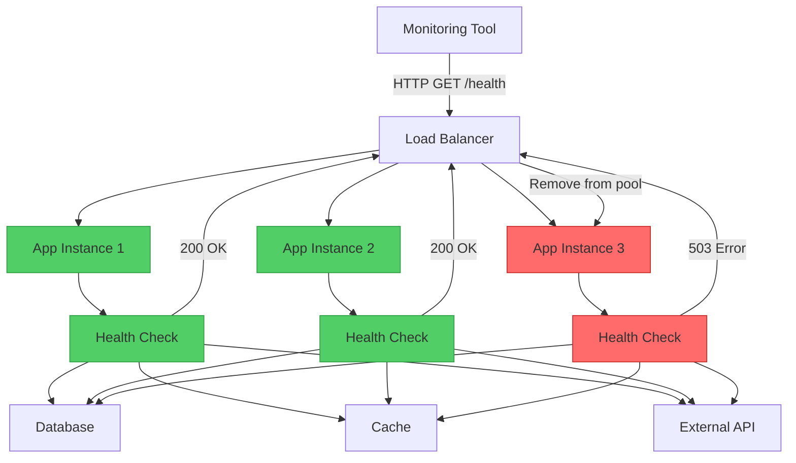
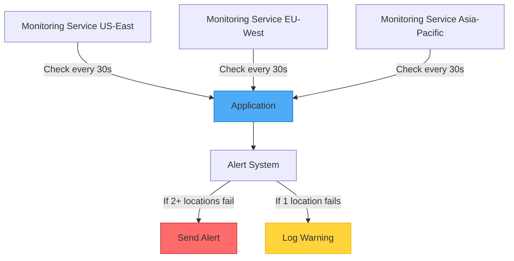

Imagine a doctor's office where patients can walk in anytime for a quick health check—temperature, blood pressure, heart rate—all measured in minutes. The doctor doesn't need to perform surgery to know if something's wrong; these simple vital signs reveal the patient's health status. This is exactly what the Health Endpoint Monitoring pattern does for your applications: it provides a quick, non-invasive way to check if your services are healthy.

## The Challenge: Knowing When Things Go Wrong

In modern distributed systems, applications depend on multiple components:
- Databases and storage systems
- External APIs and services
- Message queues
- Cache layers
- Network infrastructure

Any of these can fail, and when they do, you need to know immediately—before your users do.

### The Traditional Approach: Wait for Complaints

```javascript
// Application runs blindly
class PaymentService {
  async processPayment(order) {
    try {
      // Hope the database is available
      await this.database.save(order);
      
      // Hope the payment gateway works
      await this.paymentGateway.charge(order.amount);
      
      return { success: true };
    } catch (error) {
      // User discovers the problem first
      console.error('Payment failed:', error);
      return { success: false, error: error.message };
    }
  }
}
```

!!!warning "⚠️ Problems with Reactive Monitoring"
    **Late Detection**: You learn about failures when users complain
    
    **Poor User Experience**: Users encounter errors during critical operations
    
    **Difficult Diagnosis**: Hard to determine what failed and when
    
    **No Proactive Action**: Can't prevent issues or reroute traffic

## The Solution: Health Endpoint Monitoring

Expose dedicated endpoints that external monitoring tools can check regularly to verify your application's health.



### Basic Implementation

```javascript
// Simple health endpoint
class HealthCheckController {
  async checkHealth(req, res) {
    try {
      // Verify application is running
      const status = {
        status: 'healthy',
        timestamp: new Date().toISOString(),
        uptime: process.uptime()
      };
      
      res.status(200).json(status);
    } catch (error) {
      res.status(503).json({
        status: 'unhealthy',
        error: error.message
      });
    }
  }
}

// Register the endpoint
app.get('/health', (req, res) => {
  healthCheck.checkHealth(req, res);
});
```

### Comprehensive Health Checks

A robust health endpoint verifies critical dependencies:

```javascript
class ComprehensiveHealthCheck {
  constructor(database, cache, externalService) {
    this.database = database;
    this.cache = cache;
    this.externalService = externalService;
  }
  
  async checkHealth(req, res) {
    const checks = {
      status: 'healthy',
      timestamp: new Date().toISOString(),
      checks: {}
    };
    
    // Check database connectivity
    try {
      await this.database.ping();
      checks.checks.database = {
        status: 'healthy',
        responseTime: await this.measureResponseTime(
          () => this.database.ping()
        )
      };
    } catch (error) {
      checks.status = 'unhealthy';
      checks.checks.database = {
        status: 'unhealthy',
        error: error.message
      };
    }
    
    // Check cache availability
    try {
      await this.cache.set('health_check', 'ok', 10);
      const value = await this.cache.get('health_check');
      
      checks.checks.cache = {
        status: value === 'ok' ? 'healthy' : 'degraded',
        responseTime: await this.measureResponseTime(
          () => this.cache.get('health_check')
        )
      };
    } catch (error) {
      checks.status = 'degraded';
      checks.checks.cache = {
        status: 'unhealthy',
        error: error.message
      };
    }
    
    // Check external service
    try {
      const response = await this.externalService.healthCheck();
      checks.checks.externalService = {
        status: response.ok ? 'healthy' : 'degraded',
        responseTime: response.time
      };
    } catch (error) {
      checks.status = 'degraded';
      checks.checks.externalService = {
        status: 'unhealthy',
        error: error.message
      };
    }
    
    // Return appropriate status code
    const statusCode = checks.status === 'healthy' ? 200 : 503;
    res.status(statusCode).json(checks);
  }
  
  async measureResponseTime(operation) {
    const start = Date.now();
    await operation();
    return Date.now() - start;
  }
}
```

## Health Check Levels

Different endpoints for different purposes:

### 1. Liveness Probe

Answers: "Is the application running?"

```javascript
// Minimal check - just verify the process is alive
app.get('/health/live', (req, res) => {
  res.status(200).json({ status: 'alive' });
});
```

### 2. Readiness Probe

Answers: "Is the application ready to handle requests?"

```javascript
// Check if dependencies are available
app.get('/health/ready', async (req, res) => {
  try {
    // Verify critical dependencies
    await database.ping();
    await cache.ping();
    
    res.status(200).json({ status: 'ready' });
  } catch (error) {
    // Not ready to serve traffic
    res.status(503).json({ 
      status: 'not_ready',
      reason: error.message 
    });
  }
});
```

### 3. Detailed Health Check

Answers: "What's the status of each component?"

```javascript
app.get('/health/detailed', async (req, res) => {
  const health = await comprehensiveHealthCheck.checkAll();
  
  res.status(health.status === 'healthy' ? 200 : 503).json({
    status: health.status,
    components: {
      database: health.database,
      cache: health.cache,
      messageQueue: health.messageQueue,
      externalAPIs: health.externalAPIs
    },
    metrics: {
      requestsPerSecond: metrics.getRequestRate(),
      averageResponseTime: metrics.getAverageResponseTime(),
      errorRate: metrics.getErrorRate()
    }
  });
});
```

## Response Codes and Their Meanings

Use HTTP status codes to communicate health status:

```javascript
class HealthStatusCodes {
  static OK = 200;              // Everything is healthy
  static DEGRADED = 200;        // Working but with issues
  static SERVICE_UNAVAILABLE = 503;  // Critical failure
  static TIMEOUT = 504;         // Health check took too long
  
  static determineStatusCode(checks) {
    const hasCriticalFailure = checks.some(
      check => check.critical && check.status === 'unhealthy'
    );
    
    if (hasCriticalFailure) {
      return this.SERVICE_UNAVAILABLE;
    }
    
    const hasNonCriticalFailure = checks.some(
      check => !check.critical && check.status === 'unhealthy'
    );
    
    if (hasNonCriticalFailure) {
      return this.DEGRADED;
    }
    
    return this.OK;
  }
}
```

## Security Considerations

Health endpoints can expose sensitive information. Protect them appropriately:

### 1. Use Authentication for Detailed Checks

```javascript
// Public endpoint - minimal information
app.get('/health', (req, res) => {
  res.status(200).json({ status: 'ok' });
});

// Protected endpoint - detailed information
app.get('/health/detailed', authenticateMonitoring, async (req, res) => {
  const health = await detailedHealthCheck();
  res.json(health);
});

function authenticateMonitoring(req, res, next) {
  const token = req.headers['x-monitoring-token'];
  
  if (token !== process.env.MONITORING_TOKEN) {
    return res.status(401).json({ error: 'Unauthorized' });
  }
  
  next();
}
```

### 2. Use Obscure Paths

```javascript
// Instead of /health, use a less obvious path
const healthPath = process.env.HEALTH_CHECK_PATH || '/health';
app.get(healthPath, healthCheckHandler);
```

### 3. Rate Limiting

```javascript
const rateLimit = require('express-rate-limit');

const healthCheckLimiter = rateLimit({
  windowMs: 60 * 1000, // 1 minute
  max: 60, // 60 requests per minute
  message: 'Too many health check requests'
});

app.get('/health', healthCheckLimiter, healthCheckHandler);
```

## Caching Health Status

Avoid overwhelming your system with health checks:

```javascript
class CachedHealthCheck {
  constructor(ttlSeconds = 10) {
    this.ttl = ttlSeconds * 1000;
    this.cache = null;
    this.lastCheck = 0;
  }
  
  async getHealth() {
    const now = Date.now();
    
    // Return cached result if still valid
    if (this.cache && (now - this.lastCheck) < this.ttl) {
      return this.cache;
    }
    
    // Perform actual health check
    this.cache = await this.performHealthCheck();
    this.lastCheck = now;
    
    return this.cache;
  }
  
  async performHealthCheck() {
    // Actual health check logic
    return {
      status: 'healthy',
      timestamp: new Date().toISOString(),
      checks: await this.runAllChecks()
    };
  }
}

// Use cached health check
const cachedHealth = new CachedHealthCheck(10);

app.get('/health', async (req, res) => {
  const health = await cachedHealth.getHealth();
  res.status(health.status === 'healthy' ? 200 : 503).json(health);
});
```

## Integration with Load Balancers

Load balancers use health checks to route traffic only to healthy instances:

```nginx
# Nginx configuration
upstream backend {
    server app1.neo01.com:8080;
    server app2.neo01.com:8080;
    server app3.neo01.com:8080;
}

server {
    location / {
        proxy_pass http://backend;
        
        # Health check configuration
        health_check interval=10s
                     fails=3
                     passes=2
                     uri=/health/ready
                     match=health_ok;
    }
}

# Define what "healthy" means
match health_ok {
    status 200;
    body ~ "\"status\":\"ready\"";
}
```

## Monitoring from Multiple Locations

Check your application from different geographic locations:



```javascript
class MultiLocationMonitor {
  constructor(locations) {
    this.locations = locations;
    this.results = new Map();
  }
  
  async checkAllLocations(endpoint) {
    const checks = this.locations.map(location => 
      this.checkFromLocation(location, endpoint)
    );
    
    const results = await Promise.allSettled(checks);
    
    // Analyze results
    const failures = results.filter(r => 
      r.status === 'rejected' || r.value.status !== 200
    );
    
    if (failures.length >= 2) {
      // Multiple locations failing - critical issue
      await this.sendAlert('critical', endpoint, failures);
    } else if (failures.length === 1) {
      // Single location failing - possible network issue
      await this.sendAlert('warning', endpoint, failures);
    }
    
    return results;
  }
  
  async checkFromLocation(location, endpoint) {
    const start = Date.now();
    const response = await fetch(`${location.url}${endpoint}`);
    const duration = Date.now() - start;
    
    return {
      location: location.name,
      status: response.status,
      duration,
      timestamp: new Date().toISOString()
    };
  }
}
```

## Best Practices

!!!tip "💡 Health Check Guidelines"
    **Keep It Fast**: Health checks should complete in under 1 second
    
    **Check Dependencies**: Verify critical components like databases
    
    **Use Appropriate Timeouts**: Don't let health checks hang indefinitely
    
    **Return Meaningful Status**: Use proper HTTP status codes
    
    **Cache Results**: Avoid overwhelming your system with checks
    
    **Secure Sensitive Endpoints**: Protect detailed health information
    
    **Monitor the Monitors**: Ensure your monitoring system is working

## Common Pitfalls to Avoid

!!!warning "⚠️ What Not to Do"
    **Don't Make Health Checks Too Complex**: They should be fast and simple
    
    **Don't Expose Sensitive Data**: Avoid revealing internal architecture details
    
    **Don't Skip Critical Dependencies**: If the database is down, report it
    
    **Don't Ignore Response Times**: Slow responses indicate problems
    
    **Don't Use the Same Endpoint for Everything**: Separate liveness from readiness

## When to Use This Pattern

This pattern is essential for:

✅ **Web Applications**: Verify availability and correct operation

✅ **Microservices**: Monitor individual service health in distributed systems

✅ **Load-Balanced Applications**: Enable automatic traffic routing to healthy instances

✅ **Auto-Scaling Systems**: Determine when to add or remove instances

✅ **High-Availability Systems**: Detect failures quickly for failover

## Real-World Example: E-Commerce Platform

```javascript
class ECommerceHealthCheck {
  constructor(dependencies) {
    this.database = dependencies.database;
    this.cache = dependencies.cache;
    this.paymentGateway = dependencies.paymentGateway;
    this.inventoryService = dependencies.inventoryService;
  }
  
  async checkHealth() {
    const checks = await Promise.allSettled([
      this.checkDatabase(),
      this.checkCache(),
      this.checkPaymentGateway(),
      this.checkInventoryService()
    ]);
    
    const [database, cache, payment, inventory] = checks;
    
    // Determine overall health
    const criticalFailures = [database, payment].filter(
      check => check.status === 'rejected'
    );
    
    const status = criticalFailures.length > 0 ? 'unhealthy' : 'healthy';
    
    return {
      status,
      timestamp: new Date().toISOString(),
      components: {
        database: this.formatCheck(database, true),
        cache: this.formatCheck(cache, false),
        paymentGateway: this.formatCheck(payment, true),
        inventoryService: this.formatCheck(inventory, false)
      }
    };
  }
  
  async checkDatabase() {
    const start = Date.now();
    await this.database.query('SELECT 1');
    return { responseTime: Date.now() - start };
  }
  
  async checkCache() {
    const start = Date.now();
    await this.cache.ping();
    return { responseTime: Date.now() - start };
  }
  
  async checkPaymentGateway() {
    const start = Date.now();
    const response = await this.paymentGateway.healthCheck();
    return { 
      responseTime: Date.now() - start,
      available: response.status === 'operational'
    };
  }
  
  async checkInventoryService() {
    const start = Date.now();
    const response = await fetch('http://inventory-service/health');
    return {
      responseTime: Date.now() - start,
      status: response.status
    };
  }
  
  formatCheck(check, critical) {
    if (check.status === 'fulfilled') {
      return {
        status: 'healthy',
        critical,
        ...check.value
      };
    } else {
      return {
        status: 'unhealthy',
        critical,
        error: check.reason.message
      };
    }
  }
}
```

## Conclusion

The Health Endpoint Monitoring pattern is your application's vital signs monitor. Just as doctors use simple checks to assess patient health, monitoring tools use health endpoints to verify your application is functioning correctly. By implementing proper health checks, you can:

- Detect failures before users encounter them
- Enable automatic traffic routing to healthy instances
- Provide visibility into system health
- Support auto-scaling and self-healing systems

Start with simple liveness checks, then gradually add more comprehensive health verification as your system grows. Remember: a healthy application is one that knows when it's sick.

## References

- [Health Endpoint Monitoring Pattern - Microsoft Learn](https://learn.microsoft.com/en-us/azure/architecture/patterns/health-endpoint-monitoring)
- Related Patterns: [Circuit Breaker Pattern](/2020/01/Circuit-Breaker-Pattern/), [Sidecar Pattern](/2019/07/Sidecar-Pattern/)
