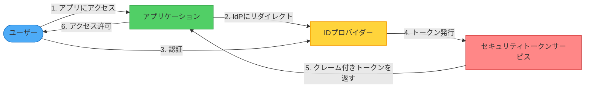
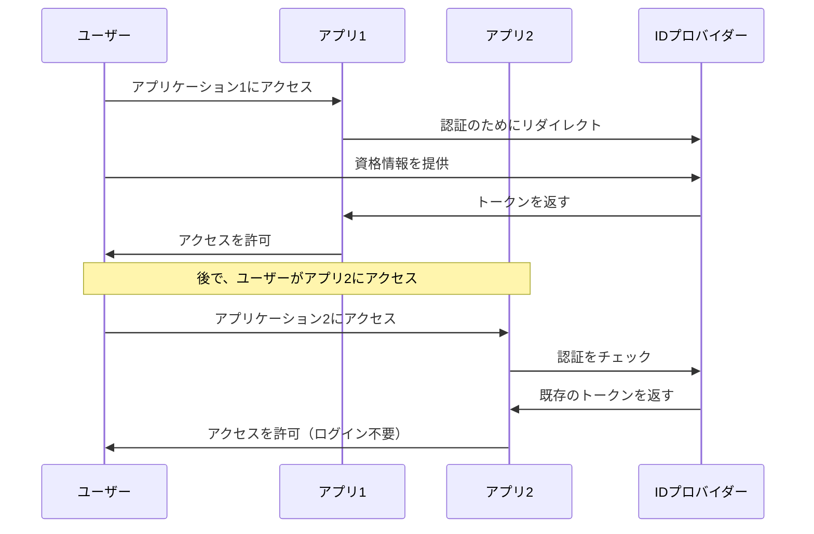

入る必要があるすべての建物——オフィス、ジム、図書館、アパート——のために異なる鍵を持ち歩くことを想像してください。今度は、どこでも機能する1つのマスターキーを持っているが、各建物は誰がアクセスできるかを制御していることを想像してください。これがフェデレーテッドアイデンティティの本質です：1セットの資格情報が複数のシステムで信頼され、各システムは何ができるかを制御します。

## 課題：パスワードが多すぎる、問題が多すぎる

今日の相互接続された世界では、ユーザーは複数の組織——雇用主、ビジネスパートナー、クラウドサービスプロバイダー、サードパーティツール——からのアプリケーションを使用します。各アプリケーションは従来、独自の認証システムを必要とします。

### 従来のアプローチ：どこでも別々の資格情報

```javascript
// 各アプリケーションが独自のユーザーを管理
class TraditionalAuthSystem {
  constructor() {
    this.users = new Map();
  }
  
  async register(username, password, email) {
    // アプリケーションデータベースに資格情報を保存
    const hashedPassword = await this.hashPassword(password);
    this.users.set(username, {
      password: hashedPassword,
      email: email,
      createdAt: new Date()
    });
  }
  
  async login(username, password) {
    const user = this.users.get(username);
    if (!user) {
      throw new Error('User not found');
    }
    
    const isValid = await this.verifyPassword(password, user.password);
    if (!isValid) {
      throw new Error('Invalid password');
    }
    
    return this.createSession(username);
  }
}
```

!!!warning "⚠️ 従来の認証の問題"
    **断片的なユーザー体験**：複数のアカウントを管理する際にユーザーが資格情報を忘れる
    
    **セキュリティの脆弱性**：退職した従業員のアカウントが迅速にプロビジョニング解除されない可能性
    
    **管理負担**：システム全体でユーザー、パスワード、権限を管理
    
    **開発オーバーヘッド**：認証インフラストラクチャの構築と保守

## 解決策：Federated Identity

信頼できる外部IDプロバイダーに認証を委任します。ユーザーはIDプロバイダーで一度認証し、資格情報を再入力せずに複数のアプリケーションにアクセスします。



### 動作の仕組み

1. **ユーザーがアプリケーションにアクセスを試みる**：アプリケーションはユーザーが認証されていないことを検出
2. **IDプロバイダーにリダイレクト**：アプリケーションはユーザーを信頼できるIDプロバイダーにリダイレクト
3. **ユーザーが認証**：ユーザーがIDプロバイダーに資格情報を提供
4. **トークン発行**：IDプロバイダーがユーザーに関するクレームを含むセキュリティトークンを発行
5. **トークン検証**：アプリケーションがトークンを検証し、ユーザー情報を抽出
6. **アクセス許可**：ユーザーが新しい資格情報を作成せずにアプリケーションにアクセス

## 主要コンポーネント

### 1. IDプロバイダー（IdP）

ユーザーを認証し、トークンを発行する信頼できる機関：

```javascript
class IdentityProvider {
  constructor(userDirectory) {
    this.userDirectory = userDirectory;
    this.trustedApplications = new Set();
  }
  
  async authenticate(username, password, applicationId) {
    // アプリケーションが信頼されているか確認
    if (!this.trustedApplications.has(applicationId)) {
      throw new Error('Untrusted application');
    }
    
    // ディレクトリに対してユーザーを認証
    const user = await this.userDirectory.validateCredentials(
      username, 
      password
    );
    
    if (!user) {
      throw new Error('Authentication failed');
    }
    
    // クレーム付きトークンを発行
    return this.issueToken(user, applicationId);
  }
  
  issueToken(user, applicationId) {
    const claims = {
      userId: user.id,
      username: user.username,
      email: user.email,
      roles: user.roles,
      department: user.department,
      issuer: 'corporate-idp',
      audience: applicationId,
      issuedAt: Date.now(),
      expiresAt: Date.now() + (3600 * 1000) // 1時間
    };
    
    // トークンに署名
    return this.signToken(claims);
  }
}
```

### 2. クレームベースのアクセス制御

アプリケーションはトークン内のクレームに基づいてアクセスを承認：

```javascript
class ClaimsBasedAuthorization {
  constructor() {
    this.policies = new Map();
  }
  
  definePolicy(resource, requiredClaims) {
    this.policies.set(resource, requiredClaims);
  }
  
  async authorize(token, resource) {
    // トークンからクレームを抽出
    const claims = await this.extractClaims(token);
    
    // リソースに必要なクレームを取得
    const required = this.policies.get(resource);
    
    if (!required) {
      return true; // ポリシーが定義されていない、アクセスを許可
    }
    
    // ユーザーが必要なクレームを持っているかチェック
    return this.evaluateClaims(claims, required);
  }
}

// 使用例
const authz = new ClaimsBasedAuthorization();

// アクセスポリシーを定義
authz.definePolicy('/admin', {
  role: ['admin', 'superuser']
});

authz.definePolicy('/reports/financial', {
  role: 'manager',
  department: 'finance'
});

// 承認をチェック
const canAccess = await authz.authorize(userToken, '/admin');
```

## Federated Identityの利点

### 1. シングルサインオン（SSO）

ユーザーは一度認証し、複数のアプリケーションにアクセス：



### 2. 集中化されたID管理

IDプロバイダーがすべてのユーザーアカウントを管理：

```javascript
class CentralizedIdentityManagement {
  async onboardEmployee(employee) {
    // IDプロバイダーにアカウントを作成
    await this.identityProvider.createUser({
      username: employee.email,
      name: employee.name,
      department: employee.department,
      roles: employee.roles
    });
    
    // 従業員は自動的にすべてのアプリケーションにアクセス可能
    // 各アプリケーションでアカウントを作成する必要なし
  }
  
  async offboardEmployee(employeeId) {
    // IDプロバイダーでアカウントを無効化
    await this.identityProvider.disableUser(employeeId);
    
    // 従業員は即座にすべてのアプリケーションへのアクセスを失う
    // 各アプリケーションでアカウントを無効化する必要なし
  }
}
```

### 3. 開発オーバーヘッドの削減

アプリケーションは認証を実装する必要がない：

```javascript
// 前：複雑な認証ロジック
class ApplicationWithAuth {
  async register(user) { /* ... */ }
  async login(credentials) { /* ... */ }
  async resetPassword(email) { /* ... */ }
  // ... 何百行もの認証コード
}

// 後：IDプロバイダーに委任
class ApplicationWithFederation {
  constructor(identityProvider) {
    this.identityProvider = identityProvider;
  }
  
  async authenticate(token) {
    // 単にトークンを検証
    return await this.identityProvider.validateToken(token);
  }
}
```

## このパターンを使用するタイミング

!!!tip "✅ 理想的なシナリオ"
    **エンタープライズシングルサインオン**：従業員が複数の企業アプリケーションにアクセス
    
    **マルチパートナーコラボレーション**：ビジネスパートナーが企業アカウントなしでアクセスが必要
    
    **SaaSアプリケーション**：各テナントが独自のIDプロバイダーを使用するマルチテナントアプリケーション
    
    **コンシューマーアプリケーション**：ユーザーがソーシャルIDプロバイダーでサインインできるようにする

!!!warning "❌ 適さない場合"
    **単一IDプロバイダー**：すべてのユーザーがアプリケーションにアクセス可能な1つのシステムで認証
    
    **レガシーシステム**：アプリケーションがモダンな認証プロトコルを処理できない
    
    **高度に分離されたシステム**：セキュリティ要件が外部認証を禁止

## まとめ

フェデレーテッドアイデンティティは、認証を負担からイネーブラーに変換します。信頼できるIDプロバイダーに認証を委任することで、次のことができます：

- シングルサインオンでユーザー体験を向上
- 集中化されたID管理でセキュリティを強化
- カスタム認証を回避して開発努力を削減
- 組織の境界を越えたコラボレーションを可能化

このパターンは、ユーザーがセキュリティと制御を維持しながら複数のアプリケーションへのシームレスなアクセスを必要とするエンタープライズおよびマルチテナントシナリオで特に強力です。

## 参考文献

- [Federated Identity Pattern - Microsoft Learn](https://learn.microsoft.com/en-us/azure/architecture/patterns/federated-identity)
