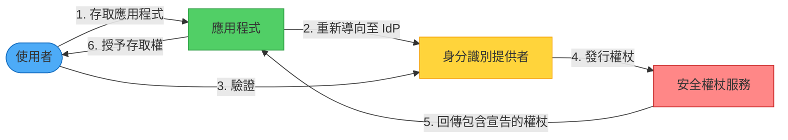
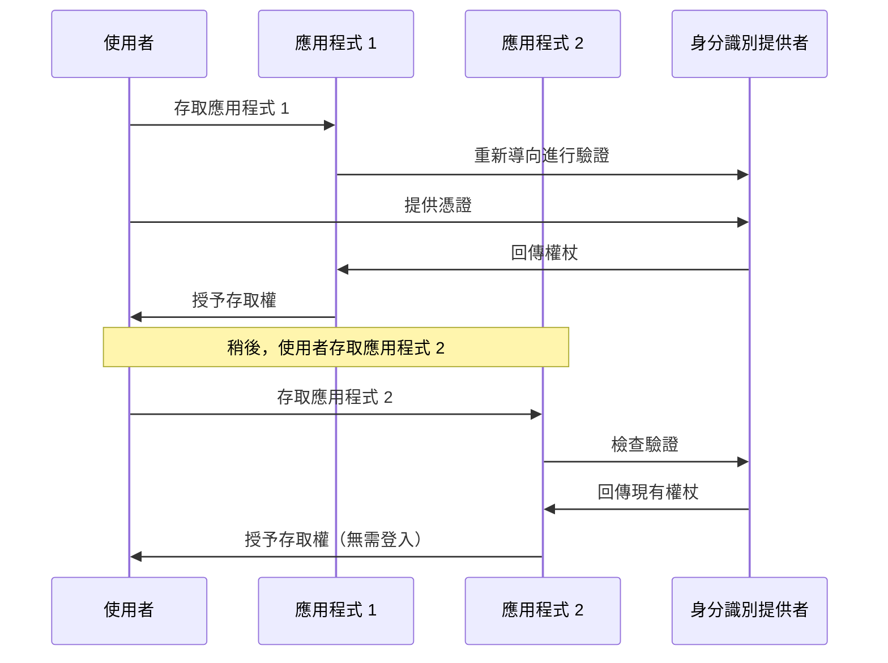

想像一下，你需要為每棟建築物攜帶不同的鑰匙——辦公室、健身房、圖書館、公寓。現在想像你有一把萬能鑰匙可以通行所有地方，但每棟建築物仍然控制誰可以進入。這就是聯合身分識別的本質：一組憑證，在多個系統間受信任，而每個系統仍保有控制權限的能力。

## 挑戰：太多密碼，太多問題

在當今互聯的世界中，使用者需要使用來自多個組織的應用程式——他們的雇主、業務合作夥伴、雲端服務提供者和第三方工具。傳統上，每個應用程式都需要自己的身分驗證系統。

### 傳統做法：到處都是獨立憑證

```javascript
// 每個應用程式管理自己的使用者
class TraditionalAuthSystem {
  constructor() {
    this.users = new Map();
  }
  
  async register(username, password, email) {
    // 將憑證儲存在應用程式資料庫中
    const hashedPassword = await this.hashPassword(password);
    this.users.set(username, {
      password: hashedPassword,
      email: email,
      createdAt: new Date()
    });
  }
  
  async login(username, password) {
    const user = this.users.get(username);
    if (!user) {
      throw new Error('找不到使用者');
    }
    
    const isValid = await this.verifyPassword(password, user.password);
    if (!isValid) {
      throw new Error('密碼無效');
    }
    
    return this.createSession(username);
  }
}
```

!!!warning "⚠️ 傳統身分驗證的問題"
    **使用者體驗不連貫**：管理多個帳號時，使用者容易忘記憑證
    
    **安全漏洞**：離職員工的帳號可能無法及時停用
    
    **管理負擔**：需要跨系統管理使用者、密碼和權限
    
    **開發負擔**：建置和維護身分驗證基礎設施

## 解決方案：聯合身分識別

將身分驗證委託給受信任的外部身分識別提供者。使用者只需在身分識別提供者進行一次驗證，即可存取多個應用程式，無需重新輸入憑證。



### 運作方式

1. **使用者嘗試存取應用程式**：應用程式偵測到使用者未經驗證
2. **重新導向至身分識別提供者**：應用程式將使用者重新導向至受信任的身分識別提供者
3. **使用者驗證**：使用者向身分識別提供者提供憑證
4. **發行權杖**：身分識別提供者發行包含使用者宣告的安全權杖
5. **權杖驗證**：應用程式驗證權杖並提取使用者資訊
6. **授予存取權**：使用者無需建立新憑證即可存取應用程式

## 核心元件

### 1. 身分識別提供者 (IdP)

驗證使用者並發行權杖的受信任機構：

```javascript
class IdentityProvider {
  constructor(userDirectory) {
    this.userDirectory = userDirectory;
    this.trustedApplications = new Set();
  }
  
  async authenticate(username, password, applicationId) {
    // 驗證應用程式是否受信任
    if (!this.trustedApplications.has(applicationId)) {
      throw new Error('不受信任的應用程式');
    }
    
    // 對目錄驗證使用者
    const user = await this.userDirectory.validateCredentials(
      username, 
      password
    );
    
    if (!user) {
      throw new Error('驗證失敗');
    }
    
    // 發行包含宣告的權杖
    return this.issueToken(user, applicationId);
  }
  
  issueToken(user, applicationId) {
    const claims = {
      userId: user.id,
      username: user.username,
      email: user.email,
      roles: user.roles,
      department: user.department,
      issuer: 'corporate-idp',
      audience: applicationId,
      issuedAt: Date.now(),
      expiresAt: Date.now() + (3600 * 1000) // 1 小時
    };
    
    // 簽署權杖
    return this.signToken(claims);
  }
}
```

### 2. 安全權杖服務 (STS)

轉換和增強權杖，在身分識別提供者和應用程式之間建立信任：

```javascript
class SecurityTokenService {
  constructor(trustedIdPs) {
    this.trustedIdPs = trustedIdPs;
    this.claimMappings = new Map();
  }
  
  async transformToken(incomingToken, targetApplication) {
    // 驗證權杖來自受信任的 IdP
    const tokenInfo = await this.validateToken(incomingToken);
    
    if (!this.trustedIdPs.has(tokenInfo.issuer)) {
      throw new Error('來自不受信任發行者的權杖');
    }
    
    // 為目標應用程式轉換宣告
    const transformedClaims = this.transformClaims(
      tokenInfo.claims,
      targetApplication
    );
    
    // 為目標應用程式發行新權杖
    return this.issueToken(transformedClaims, targetApplication);
  }
  
  transformClaims(claims, targetApplication) {
    const mapping = this.claimMappings.get(targetApplication);
    
    if (!mapping) {
      return claims; // 不需要轉換
    }
    
    const transformed = {};
    
    for (const [sourceClaim, targetClaim] of mapping.entries()) {
      if (claims[sourceClaim]) {
        transformed[targetClaim] = claims[sourceClaim];
      }
    }
    
    // 新增應用程式特定的宣告
    transformed.applicationId = targetApplication;
    transformed.transformedAt = Date.now();
    
    return transformed;
  }
}
```

### 3. 基於宣告的存取控制

應用程式根據權杖中的宣告授權存取：

```javascript
class ClaimsBasedAuthorization {
  constructor() {
    this.policies = new Map();
  }
  
  definePolicy(resource, requiredClaims) {
    this.policies.set(resource, requiredClaims);
  }
  
  async authorize(token, resource) {
    // 從權杖提取宣告
    const claims = await this.extractClaims(token);
    
    // 取得資源所需的宣告
    const required = this.policies.get(resource);
    
    if (!required) {
      return true; // 未定義政策，允許存取
    }
    
    // 檢查使用者是否具有所需的宣告
    return this.evaluateClaims(claims, required);
  }
  
  evaluateClaims(userClaims, requiredClaims) {
    for (const [claimType, requiredValue] of Object.entries(requiredClaims)) {
      const userValue = userClaims[claimType];
      
      if (!userValue) {
        return false; // 缺少必要的宣告
      }
      
      if (Array.isArray(requiredValue)) {
        // 檢查使用者是否具有任何所需的值
        if (!requiredValue.includes(userValue)) {
          return false;
        }
      } else if (userValue !== requiredValue) {
        return false;
      }
    }
    
    return true;
  }
}

// 使用範例
const authz = new ClaimsBasedAuthorization();

// 定義存取政策
authz.definePolicy('/admin', {
  role: ['admin', 'superuser']
});

authz.definePolicy('/reports/financial', {
  role: 'manager',
  department: 'finance'
});

// 檢查授權
const canAccess = await authz.authorize(userToken, '/admin');
```

## 實作範例

完整的聯合身分驗證流程：

```javascript
class FederatedApplication {
  constructor(identityProviderUrl, applicationId, secretKey) {
    this.identityProviderUrl = identityProviderUrl;
    this.applicationId = applicationId;
    this.secretKey = secretKey;
    this.authorization = new ClaimsBasedAuthorization();
  }
  
  // 保護路由的中介軟體
  requireAuthentication() {
    return async (req, res, next) => {
      const token = req.headers.authorization?.replace('Bearer ', '');
      
      if (!token) {
        // 重新導向至身分識別提供者
        const redirectUrl = this.buildAuthenticationUrl(req.originalUrl);
        return res.redirect(redirectUrl);
      }
      
      try {
        // 驗證權杖
        const claims = await this.validateToken(token);
        
        // 將使用者資訊附加到請求
        req.user = claims;
        next();
      } catch (error) {
        res.status(401).json({ error: '無效的權杖' });
      }
    };
  }
  
  buildAuthenticationUrl(returnUrl) {
    const params = new URLSearchParams({
      client_id: this.applicationId,
      return_url: returnUrl,
      response_type: 'token'
    });
    
    return `${this.identityProviderUrl}/authenticate?${params}`;
  }
  
  async handleCallback(req, res) {
    const { token } = req.query;
    
    try {
      // 驗證來自 IdP 的權杖
      const claims = await this.validateToken(token);
      
      // 建立應用程式工作階段
      const sessionToken = await this.createSession(claims);
      
      // 重新導向至原始目的地
      const returnUrl = req.query.return_url || '/';
      res.redirect(`${returnUrl}?token=${sessionToken}`);
    } catch (error) {
      res.status(401).json({ error: '驗證失敗' });
    }
  }
  
  async validateToken(token) {
    // 驗證權杖簽章
    const payload = await this.verifySignature(token, this.secretKey);
    
    // 檢查過期時間
    if (payload.expiresAt < Date.now()) {
      throw new Error('權杖已過期');
    }
    
    // 驗證對象
    if (payload.audience !== this.applicationId) {
      throw new Error('權杖不適用於此應用程式');
    }
    
    return payload;
  }
}

// 設定應用程式
const app = express();
const federatedApp = new FederatedApplication(
  'https://idp.company.com',
  'my-application-id',
  process.env.SECRET_KEY
);

// IdP 的回呼端點
app.get('/auth/callback', (req, res) => {
  federatedApp.handleCallback(req, res);
});

// 受保護的路由
app.get('/dashboard', 
  federatedApp.requireAuthentication(),
  (req, res) => {
    res.json({
      message: '歡迎來到儀表板',
      user: req.user
    });
  }
);
```

## 主領域探索

當有多個身分識別提供者可用時，系統必須決定使用哪一個：

```javascript
class HomeRealmDiscovery {
  constructor() {
    this.providerMappings = new Map();
    this.defaultProvider = null;
  }
  
  registerProvider(identifier, providerUrl) {
    this.providerMappings.set(identifier, providerUrl);
  }
  
  setDefaultProvider(providerUrl) {
    this.defaultProvider = providerUrl;
  }
  
  discoverProvider(userIdentifier) {
    // 從電子郵件提取網域
    if (userIdentifier.includes('@')) {
      const domain = userIdentifier.split('@')[1];
      
      // 檢查網域是否有對應的提供者
      if (this.providerMappings.has(domain)) {
        return this.providerMappings.get(domain);
      }
    }
    
    // 檢查基於子網域的探索
    const subdomain = this.extractSubdomain(userIdentifier);
    if (subdomain && this.providerMappings.has(subdomain)) {
      return this.providerMappings.get(subdomain);
    }
    
    // 回傳預設提供者
    return this.defaultProvider;
  }
  
  async promptUserSelection(availableProviders) {
    // 向使用者呈現身分識別提供者清單
    return {
      providers: Array.from(this.providerMappings.entries()).map(
        ([name, url]) => ({ name, url })
      )
    };
  }
}

// 使用方式
const discovery = new HomeRealmDiscovery();

// 將網域對應到身分識別提供者
discovery.registerProvider('company.com', 'https://idp.company.com');
discovery.registerProvider('partner.com', 'https://sso.partner.com');
discovery.registerProvider('social', 'https://social-idp.com');

// 為使用者探索提供者
const provider = discovery.discoverProvider('user@company.com');
// 回傳：https://idp.company.com
```

## 聯合身分識別的優勢

### 1. 單一登入 (SSO)

使用者驗證一次即可存取多個應用程式：



### 2. 集中式身分管理

身分識別提供者管理所有使用者帳號：

```javascript
class CentralizedIdentityManagement {
  async onboardEmployee(employee) {
    // 在身分識別提供者中建立帳號
    await this.identityProvider.createUser({
      username: employee.email,
      name: employee.name,
      department: employee.department,
      roles: employee.roles
    });
    
    // 員工自動擁有所有應用程式的存取權
    // 無需在每個應用程式中建立帳號
  }
  
  async offboardEmployee(employeeId) {
    // 在身分識別提供者中停用帳號
    await this.identityProvider.disableUser(employeeId);
    
    // 員工立即失去所有應用程式的存取權
    // 無需在每個應用程式中停用帳號
  }
  
  async updateEmployeeRole(employeeId, newRole) {
    // 在身分識別提供者中更新角色
    await this.identityProvider.updateUser(employeeId, {
      roles: [newRole]
    });
    
    // 角色變更傳播到所有應用程式
  }
}
```

### 3. 降低開發負擔

應用程式無需實作身分驗證：

```javascript
// 之前：複雜的身分驗證邏輯
class ApplicationWithAuth {
  async register(user) { /* ... */ }
  async login(credentials) { /* ... */ }
  async resetPassword(email) { /* ... */ }
  async verifyEmail(token) { /* ... */ }
  async enable2FA(userId) { /* ... */ }
  // ... 數百行驗證程式碼
}

// 之後：委託給身分識別提供者
class ApplicationWithFederation {
  constructor(identityProvider) {
    this.identityProvider = identityProvider;
  }
  
  async authenticate(token) {
    // 只需驗證權杖
    return await this.identityProvider.validateToken(token);
  }
}
```

## 設計考量

### 1. 單點故障

身分識別提供者的可用性至關重要：

!!!warning "🔒 可靠性考量"
    **跨多個資料中心部署**：確保身分識別提供者具有高可用性
    
    **實作快取**：快取權杖和驗證結果以處理暫時性中斷
    
    **優雅降級**：當 IdP 無法使用時允許有限的功能
    
    **監控健康狀態**：持續監控身分識別提供者的可用性

```javascript
class ResilientTokenValidation {
  constructor(identityProvider, cache) {
    this.identityProvider = identityProvider;
    this.cache = cache;
  }
  
  async validateToken(token) {
    // 先檢查快取
    const cached = await this.cache.get(`token:${token}`);
    if (cached) {
      return cached;
    }
    
    try {
      // 使用身分識別提供者驗證
      const claims = await this.identityProvider.validate(token);
      
      // 快取成功的驗證
      await this.cache.set(`token:${token}`, claims, 300); // 5 分鐘
      
      return claims;
    } catch (error) {
      // 如果 IdP 無法使用，檢查是否有快取的驗證
      const fallback = await this.cache.get(`token:fallback:${token}`);
      if (fallback) {
        console.warn('由於 IdP 無法使用，使用快取的權杖驗證');
        return fallback;
      }
      
      throw error;
    }
  }
}
```

### 2. 社交身分識別提供者

社交提供者提供的使用者資訊有限：

```javascript
class SocialIdentityIntegration {
  async handleSocialLogin(socialToken, provider) {
    // 從社交提供者提取宣告
    const socialClaims = await this.validateSocialToken(socialToken, provider);
    
    // 社交提供者通常只提供：
    // - 唯一識別碼
    // - 電子郵件（有時）
    // - 名稱（有時）
    
    // 檢查使用者是否存在於應用程式中
    let user = await this.findUserBySocialId(
      provider,
      socialClaims.id
    );
    
    if (!user) {
      // 首次登入 - 需要註冊
      user = await this.registerSocialUser({
        socialProvider: provider,
        socialId: socialClaims.id,
        email: socialClaims.email,
        name: socialClaims.name
      });
    }
    
    // 使用應用程式特定的資訊增強宣告
    return {
      ...socialClaims,
      userId: user.id,
      roles: user.roles,
      preferences: user.preferences
    };
  }
}
```

### 3. 權杖生命週期和更新

管理權杖過期和更新：

```javascript
class TokenLifecycleManager {
  constructor(identityProvider) {
    this.identityProvider = identityProvider;
  }
  
  async issueTokenPair(user) {
    // 短期存取權杖
    const accessToken = await this.createToken(user, {
      type: 'access',
      expiresIn: 900 // 15 分鐘
    });
    
    // 長期更新權杖
    const refreshToken = await this.createToken(user, {
      type: 'refresh',
      expiresIn: 2592000 // 30 天
    });
    
    return { accessToken, refreshToken };
  }
  
  async refreshAccessToken(refreshToken) {
    // 驗證更新權杖
    const claims = await this.validateToken(refreshToken);
    
    if (claims.type !== 'refresh') {
      throw new Error('無效的權杖類型');
    }
    
    // 發行新的存取權杖
    return await this.createToken(claims, {
      type: 'access',
      expiresIn: 900
    });
  }
}
```

## 何時使用此模式

!!!tip "✅ 理想情境"
    **企業單一登入**：員工存取多個企業應用程式
    
    **多合作夥伴協作**：業務合作夥伴需要存取但沒有企業帳號
    
    **SaaS 應用程式**：多租戶應用程式，每個租戶使用自己的身分識別提供者
    
    **消費者應用程式**：允許使用者使用社交身分識別提供者登入

!!!warning "❌ 不適用的情況"
    **單一身分識別提供者**：所有使用者使用應用程式可存取的一個系統進行驗證
    
    **舊系統**：應用程式無法處理現代身分驗證協定
    
    **高度隔離的系統**：安全要求禁止外部身分驗證

## 實際範例：多租戶 SaaS

```javascript
class MultiTenantSaaS {
  constructor() {
    this.tenants = new Map();
    this.sts = new SecurityTokenService();
  }
  
  async registerTenant(tenantId, identityProviderConfig) {
    // 註冊租戶的身分識別提供者
    this.tenants.set(tenantId, {
      id: tenantId,
      identityProvider: identityProviderConfig,
      users: new Set()
    });
    
    // 設定 STS 信任租戶的 IdP
    await this.sts.addTrustedProvider(
      identityProviderConfig.issuer,
      identityProviderConfig.publicKey
    );
  }
  
  async authenticateUser(token) {
    // 使用 STS 驗證權杖
    const claims = await this.sts.validateToken(token);
    
    // 從權杖確定租戶
    const tenantId = claims.tenantId;
    const tenant = this.tenants.get(tenantId);
    
    if (!tenant) {
      throw new Error('未知的租戶');
    }
    
    // 驗證使用者屬於租戶
    if (!tenant.users.has(claims.userId)) {
      // 首次使用者 - 新增到租戶
      tenant.users.add(claims.userId);
    }
    
    return {
      user: claims,
      tenant: tenant
    };
  }
}
```

## 總結

聯合身分識別將身分驗證從負擔轉變為助力。透過將身分驗證委託給受信任的身分識別提供者，您可以：

- **改善使用者體驗**，提供單一登入
- **增強安全性**，實現集中式身分管理
- **降低開發工作量**，避免自訂身分驗證
- **促進協作**，跨越組織界限

此模式在企業和多租戶情境中特別強大，使用者需要無縫存取多個應用程式，同時保持安全性和控制。

## 參考資料

- [聯合身分識別模式 - Microsoft Learn](https://learn.microsoft.com/en-us/azure/architecture/patterns/federated-identity)
