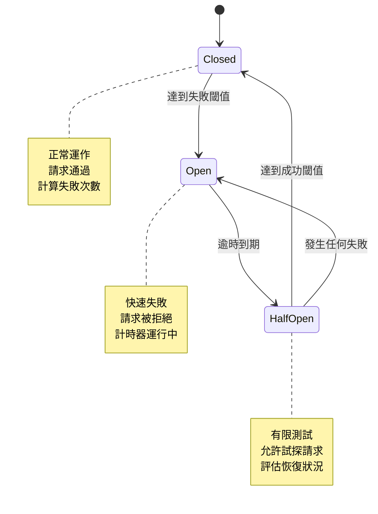
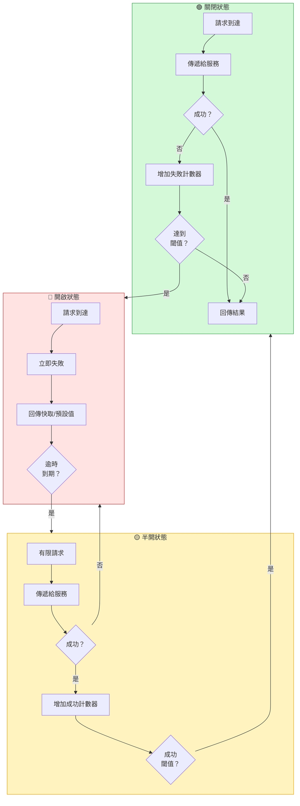

想像你家中的電路系統。當過多電流流經電線時——可能是短路或插座過載——斷路器會跳脫，切斷電源以防止損壞或火災。斷路器不會持續嘗試將電力強制通過危險的情況。相反地，它會快速失敗，保護整個系統。問題修復後，你可以重置斷路器並恢復供電。

同樣的原理適用於分散式系統。當遠端服務故障時，斷路器模式可防止應用程式重複嘗試注定失敗的操作，保護系統資源並實現優雅降級。

## 電路斷路器類比

就像電路斷路器：
- 監控電流（請求失敗）
- 超過閾值時跳脫（過多失敗）
- 開啟時阻擋進一步嘗試（防止連鎖故障）
- 冷卻後允許測試（半開狀態）
- 服務恢復時重置（關閉狀態）

軟體斷路器：
- 監控服務呼叫失敗
- 達到失敗閾值時開啟
- 開啟時立即拒絕請求
- 逾時後允許有限的測試請求
- 服務展現恢復時關閉



## 問題：分散式系統中的連鎖故障

在分散式環境中，遠端服務呼叫可能因各種原因失敗：

### 暫時性故障

```javascript
// 會自行解決的臨時問題
class PaymentService {
  async processPayment(orderId, amount) {
    try {
      // 網路短暫中斷 - 重試可能成功
      return await this.paymentGateway.charge(amount);
    } catch (error) {
      if (error.code === 'NETWORK_TIMEOUT') {
        // 暫時性 - 重試可能有效
        return await this.retry(() => 
          this.paymentGateway.charge(amount)
        );
      }
    }
  }
}
```

### 持續性故障

```javascript
// 服務完全當機 - 重試無濟於事
class InventoryService {
  async checkStock(productId) {
    try {
      return await this.inventoryApi.getStock(productId);
    } catch (error) {
      if (error.code === 'SERVICE_UNAVAILABLE') {
        // 服務崩潰 - 重試浪費資源
        // 每次重試都會佔用執行緒、記憶體、連線
        // 逾時期間會阻擋其他操作
        throw new Error('Inventory service unavailable');
      }
    }
  }
}
```

### 資源耗盡

```javascript
// 失敗的服務消耗關鍵資源
class OrderProcessor {
  async processOrder(order) {
    // 每次失敗的呼叫都會佔用資源直到逾時
    const promises = [
      this.inventoryService.reserve(order.items),    // 30秒逾時
      this.paymentService.charge(order.total),       // 30秒逾時
      this.shippingService.schedule(order.address)   // 30秒逾時
    ];
    
    try {
      await Promise.all(promises);
    } catch (error) {
      // 如果庫存服務當機：
      // - 100個並發訂單 = 100個執行緒被阻擋
      // - 每個等待30秒逾時
      // - 資料庫連線被佔用
      // - 待處理請求消耗記憶體
      // - 其他服務無法取得資源
    }
  }
}
```

!!!warning "⚠️ 連鎖故障問題"
    **初始故障**：一個服務變慢或無法使用
    
    **資源阻塞**：呼叫者等待逾時，佔用執行緒和連線
    
    **資源耗盡**：系統耗盡執行緒、記憶體或連線
    
    **連鎖影響**：其他不相關的操作因資源匱乏而失敗
    
    **全系統中斷**：整個應用程式變得無回應

## 解決方案：斷路器模式

斷路器作為代理監控失敗並防止呼叫故障服務：

```javascript
class CircuitBreaker {
  constructor(options = {}) {
    this.failureThreshold = options.failureThreshold || 5;
    this.successThreshold = options.successThreshold || 2;
    this.timeout = options.timeout || 60000; // 60秒
    this.monitoringPeriod = options.monitoringPeriod || 10000; // 10秒
    
    this.state = 'CLOSED';
    this.failureCount = 0;
    this.successCount = 0;
    this.nextAttempt = Date.now();
  }
  
  async execute(operation) {
    if (this.state === 'OPEN') {
      if (Date.now() < this.nextAttempt) {
        throw new Error('Circuit breaker is OPEN');
      }
      // 逾時到期，嘗試半開
      this.state = 'HALF_OPEN';
      this.successCount = 0;
    }
    
    try {
      const result = await operation();
      this.onSuccess();
      return result;
    } catch (error) {
      this.onFailure();
      throw error;
    }
  }
  
  onSuccess() {
    this.failureCount = 0;
    
    if (this.state === 'HALF_OPEN') {
      this.successCount++;
      if (this.successCount >= this.successThreshold) {
        this.state = 'CLOSED';
        console.log('斷路器關閉 - 服務已恢復');
      }
    }
  }
  
  onFailure() {
    this.failureCount++;
    this.successCount = 0;
    
    if (this.state === 'HALF_OPEN') {
      this.state = 'OPEN';
      this.nextAttempt = Date.now() + this.timeout;
      console.log('斷路器開啟 - 服務仍在故障中');
    }
    
    if (this.state === 'CLOSED' && 
        this.failureCount >= this.failureThreshold) {
      this.state = 'OPEN';
      this.nextAttempt = Date.now() + this.timeout;
      console.log('斷路器開啟 - 達到閾值');
    }
  }
  
  getState() {
    return this.state;
  }
}
```

## 斷路器狀態



### 關閉狀態：正常運作

```javascript
class InventoryServiceClient {
  constructor() {
    this.circuitBreaker = new CircuitBreaker({
      failureThreshold: 5,
      timeout: 60000
    });
  }
  
  async checkStock(productId) {
    return await this.circuitBreaker.execute(async () => {
      // 正常運作 - 請求通過
      const response = await fetch(
        `https://inventory-api.neo01.com/stock/${productId}`
      );
      
      if (!response.ok) {
        throw new Error(`HTTP ${response.status}`);
      }
      
      return await response.json();
    });
  }
}

// 使用方式
const client = new InventoryServiceClient();

// 前4次失敗 - 斷路器保持關閉
for (let i = 0; i < 4; i++) {
  try {
    await client.checkStock('product-123');
  } catch (error) {
    console.log(`嘗試 ${i + 1} 失敗`);
  }
}

// 第5次失敗 - 斷路器開啟
try {
  await client.checkStock('product-123');
} catch (error) {
  console.log('斷路器開啟');
}
```

### 開啟狀態：快速失敗

```javascript
class OrderService {
  constructor() {
    this.inventoryClient = new InventoryServiceClient();
    this.defaultStock = { available: false, quantity: 0 };
  }
  
  async processOrder(order) {
    try {
      // 斷路器開啟 - 立即失敗
      const stock = await this.inventoryClient.checkStock(order.productId);
      return this.completeOrder(order, stock);
    } catch (error) {
      if (error.message === 'Circuit breaker is OPEN') {
        // 優雅降級
        console.log('庫存服務無法使用，使用預設值');
        return this.completeOrder(order, this.defaultStock);
      }
      throw error;
    }
  }
  
  completeOrder(order, stock) {
    if (!stock.available) {
      return {
        status: 'PENDING',
        message: '庫存檢查無法使用。訂單將很快被驗證。'
      };
    }
    
    return {
      status: 'CONFIRMED',
      message: '訂單已確認'
    };
  }
}
```

### 半開狀態：測試恢復

```javascript
class CircuitBreakerWithHalfOpen extends CircuitBreaker {
  async execute(operation) {
    if (this.state === 'OPEN') {
      if (Date.now() < this.nextAttempt) {
        throw new Error('Circuit breaker is OPEN');
      }
      
      // 進入半開狀態
      this.state = 'HALF_OPEN';
      this.successCount = 0;
      console.log('斷路器半開 - 測試服務');
    }
    
    if (this.state === 'HALF_OPEN') {
      // 在半開狀態限制並發請求
      if (this.pendingRequests >= 3) {
        throw new Error('Circuit breaker is HALF_OPEN - limiting requests');
      }
    }
    
    try {
      this.pendingRequests++;
      const result = await operation();
      this.onSuccess();
      return result;
    } catch (error) {
      this.onFailure();
      throw error;
    } finally {
      this.pendingRequests--;
    }
  }
}
```

## 實際實作

這是一個生產就緒的斷路器，具有監控功能：

```javascript
class ProductionCircuitBreaker {
  constructor(serviceName, options = {}) {
    this.serviceName = serviceName;
    this.failureThreshold = options.failureThreshold || 5;
    this.successThreshold = options.successThreshold || 2;
    this.timeout = options.timeout || 60000;
    this.monitoringPeriod = options.monitoringPeriod || 10000;
    
    this.state = 'CLOSED';
    this.failureCount = 0;
    this.successCount = 0;
    this.nextAttempt = Date.now();
    this.lastStateChange = Date.now();
    
    // 指標
    this.metrics = {
      totalRequests: 0,
      successfulRequests: 0,
      failedRequests: 0,
      rejectedRequests: 0
    };
    
    // 定期重置失敗計數
    this.resetInterval = setInterval(() => {
      if (this.state === 'CLOSED') {
        this.failureCount = 0;
      }
    }, this.monitoringPeriod);
  }
  
  async execute(operation, fallback = null) {
    this.metrics.totalRequests++;
    
    if (this.state === 'OPEN') {
      if (Date.now() < this.nextAttempt) {
        this.metrics.rejectedRequests++;
        
        if (fallback) {
          return await fallback();
        }
        
        throw new CircuitBreakerOpenError(
          `Circuit breaker is OPEN for ${this.serviceName}`
        );
      }
      
      this.transitionTo('HALF_OPEN');
    }
    
    try {
      const result = await operation();
      this.onSuccess();
      this.metrics.successfulRequests++;
      return result;
    } catch (error) {
      this.onFailure(error);
      this.metrics.failedRequests++;
      
      if (fallback && this.state === 'OPEN') {
        return await fallback();
      }
      
      throw error;
    }
  }
  
  onSuccess() {
    this.failureCount = 0;
    
    if (this.state === 'HALF_OPEN') {
      this.successCount++;
      if (this.successCount >= this.successThreshold) {
        this.transitionTo('CLOSED');
      }
    }
  }
  
  onFailure(error) {
    this.failureCount++;
    this.successCount = 0;
    
    if (this.state === 'HALF_OPEN') {
      this.transitionTo('OPEN');
    } else if (this.state === 'CLOSED' && 
               this.failureCount >= this.failureThreshold) {
      this.transitionTo('OPEN');
    }
    
    this.logError(error);
  }
  
  transitionTo(newState) {
    const oldState = this.state;
    this.state = newState;
    this.lastStateChange = Date.now();
    
    if (newState === 'OPEN') {
      this.nextAttempt = Date.now() + this.timeout;
    }
    
    this.emitStateChange(oldState, newState);
  }
  
  emitStateChange(oldState, newState) {
    console.log(
      `[${this.serviceName}] 斷路器：${oldState} → ${newState}`
    );
    
    // 發送指標供監控
    this.publishMetrics({
      service: this.serviceName,
      state: newState,
      timestamp: Date.now(),
      metrics: this.metrics
    });
  }
  
  logError(error) {
    console.error(
      `[${this.serviceName}] 請求失敗：`,
      error.message
    );
  }
  
  publishMetrics(data) {
    // 發送到監控系統
    // 範例：CloudWatch、Prometheus、Datadog
  }
  
  getMetrics() {
    return {
      ...this.metrics,
      state: this.state,
      failureCount: this.failureCount,
      successCount: this.successCount
    };
  }
  
  destroy() {
    clearInterval(this.resetInterval);
  }
}

class CircuitBreakerOpenError extends Error {
  constructor(message) {
    super(message);
    this.name = 'CircuitBreakerOpenError';
  }
}
```

## 真實世界範例：電子商務平台

```javascript
class RecommendationService {
  constructor() {
    this.circuitBreaker = new ProductionCircuitBreaker(
      'recommendation-service',
      {
        failureThreshold: 5,
        successThreshold: 3,
        timeout: 30000
      }
    );
    
    this.cache = new Map();
  }
  
  async getRecommendations(userId) {
    const fallback = async () => {
      // 回傳快取的推薦
      if (this.cache.has(userId)) {
        return {
          recommendations: this.cache.get(userId),
          source: 'cache'
        };
      }
      
      // 回傳熱門商品作為備援
      return {
        recommendations: await this.getPopularItems(),
        source: 'fallback'
      };
    };
    
    return await this.circuitBreaker.execute(
      async () => {
        const response = await fetch(
          `https://recommendations-api.neo01.com/users/${userId}`
        );
        
        if (!response.ok) {
          throw new Error(`HTTP ${response.status}`);
        }
        
        const data = await response.json();
        
        // 成功時更新快取
        this.cache.set(userId, data.recommendations);
        
        return {
          recommendations: data.recommendations,
          source: 'live'
        };
      },
      fallback
    );
  }
  
  async getPopularItems() {
    // 回傳靜態熱門商品
    return [
      { id: 'item-1', name: '熱門商品 1' },
      { id: 'item-2', name: '熱門商品 2' },
      { id: 'item-3', name: '熱門商品 3' }
    ];
  }
}

// 使用方式
const recommendationService = new RecommendationService();

async function displayRecommendations(userId) {
  try {
    const result = await recommendationService.getRecommendations(userId);
    
    if (result.source === 'cache') {
      console.log('顯示快取的推薦');
    } else if (result.source === 'fallback') {
      console.log('顯示熱門商品（服務無法使用）');
    } else {
      console.log('顯示個人化推薦');
    }
    
    return result.recommendations;
  } catch (error) {
    console.error('無法取得推薦：', error);
    return [];
  }
}
```

## 斷路器與重試模式結合

結合斷路器與重試以處理暫時性故障：

```javascript
class ResilientServiceClient {
  constructor(serviceName) {
    this.circuitBreaker = new ProductionCircuitBreaker(serviceName, {
      failureThreshold: 3,
      timeout: 60000
    });
  }
  
  async callWithRetry(operation, maxRetries = 3) {
    return await this.circuitBreaker.execute(async () => {
      let lastError;
      
      for (let attempt = 1; attempt <= maxRetries; attempt++) {
        try {
          return await operation();
        } catch (error) {
          lastError = error;
          
          // 某些錯誤不重試
          if (this.isNonRetryableError(error)) {
            throw error;
          }
          
          if (attempt < maxRetries) {
            // 指數退避
            const delay = Math.min(1000 * Math.pow(2, attempt - 1), 10000);
            await this.sleep(delay);
          }
        }
      }
      
      throw lastError;
    });
  }
  
  isNonRetryableError(error) {
    // 不重試客戶端錯誤（4xx）
    return error.status >= 400 && error.status < 500;
  }
  
  sleep(ms) {
    return new Promise(resolve => setTimeout(resolve, ms));
  }
}
```

## 監控與指標


{
  "title": {
    "text": "斷路器狀態隨時間變化"
  },
  "tooltip": {
    "trigger": "axis"
  },
  "legend": {
    "data": ["請求", "失敗", "斷路器狀態"]
  },
  "xAxis": {
    "type": "category",
    "data": ["10:00", "10:05", "10:10", "10:15", "10:20", "10:25", "10:30"]
  },
  "yAxis": [
    {
      "type": "value",
      "name": "請求數"
    },
    {
      "type": "value",
      "name": "狀態",
      "max": 2,
      "axisLabel": {
        "formatter": function(value) {
          return ["關閉", "半開", "開啟"][value] || "";
        }
      }
    }
  ],
  "series": [
    {
      "name": "請求",
      "type": "line",
      "data": [100, 95, 90, 20, 25, 80, 100]
    },
    {
      "name": "失敗",
      "type": "line",
      "data": [2, 5, 15, 18, 10, 3, 1]
    },
    {
      "name": "斷路器狀態",
      "type": "line",
      "yAxisIndex": 1,
      "data": [0, 0, 2, 2, 1, 0, 0],
      "itemStyle": {
        "color": "#f59f00"
      }
    }
  ]
}


## 關鍵考量

!!!anote "💡 例外處理"
    應用程式必須優雅地處理斷路器例外：
    - 提供備援回應
    - 顯示使用者友善的訊息
    - 記錄以供監控和警示

!!!anote "💡 逾時設定"
    平衡逾時時間與恢復模式：
    - 太短：服務恢復前斷路器重新開啟
    - 太長：使用者不必要地等待
    - 根據歷史資料使用自適應逾時

!!!warning "⚠️ 監控至關重要"
    追蹤斷路器指標：
    - 狀態轉換（關閉 → 開啟 → 半開）
    - 請求成功/失敗率
    - 在每個狀態花費的時間
    - 斷路器頻繁開啟時發出警示

!!!tip "💡 備援策略"
    斷路器開啟時提供有意義的備援：
    - 快取資料
    - 預設值
    - 降級功能
    - 使用者通知

## 何時使用斷路器

使用此模式當：

✅ **防止連鎖故障**：阻止故障在服務間擴散

✅ **保護共享資源**：防止故障相依性造成資源耗盡

✅ **優雅降級**：服務故障時維持部分功能

✅ **快速失敗**：避免在已知故障上等待逾時

不要使用此模式當：

❌ **本地資源**：記憶體內操作不需要斷路器

❌ **業務邏輯例外**：用於基礎設施故障，而非業務規則

❌ **簡單重試就足夠**：快速恢復的暫時性故障

❌ **訊息佇列**：死信佇列能更好地處理故障

## 與重試模式比較

| 面向 | 斷路器 | 重試模式 |
|--------|----------------|---------------|
| **目的** | 防止呼叫故障服務 | 從暫時性故障恢復 |
| **何時使用** | 持續性故障 | 臨時故障 |
| **行為** | 達到閾值後快速失敗 | 持續嘗試並延遲 |
| **資源使用** | 最小（立即拒絕） | 較高（等待重試） |
| **恢復偵測** | 主動（半開測試） | 被動（重試成功） |

!!!tip "💡 最佳實踐：結合兩種模式"
    在斷路器內使用重試模式：
    1. 斷路器包裝操作
    2. 重試處理暫時性故障
    3. 斷路器防止過度重試
    4. 系統獲得兩種方法的優點

## 總結

斷路器模式對於建構彈性分散式系統至關重要：

- **防止連鎖故障**透過停止對故障服務的呼叫
- **保護系統資源**免於在中斷期間耗盡
- **實現優雅降級**透過備援回應
- **提供快速失敗**而非等待逾時
- **監控服務健康**並自動偵測恢復

就像電路斷路器保護你的家一樣，這個模式保護你的分散式系統免受故障相依性造成的損害。它不是為了防止故障——而是為了優雅地失敗並快速恢復。

## 參考資料

- [Microsoft Azure Architecture Patterns - Circuit Breaker](https://learn.microsoft.com/en-us/azure/architecture/patterns/circuit-breaker)
- [Martin Fowler - CircuitBreaker](https://martinfowler.com/bliki/CircuitBreaker.html)
- [Release It! by Michael Nygard](https://pragprog.com/titles/mnee2/release-it-second-edition/)
