Imagine an electrical circuit in your home. When too much current flows through a wire—perhaps from a short circuit or overloaded outlet—the circuit breaker trips, cutting power to prevent damage or fire. The breaker doesn't keep trying to force electricity through a dangerous situation. Instead, it fails fast, protecting the entire system. After the problem is fixed, you can reset the breaker and restore power.

This same principle applies to distributed systems. When a remote service fails, the Circuit Breaker pattern prevents your application from repeatedly attempting doomed operations, protecting system resources and enabling graceful degradation.

## The Electrical Circuit Analogy

Just like an electrical circuit breaker:
- Monitors current flow (request failures)
- Trips when threshold is exceeded (too many failures)
- Blocks further attempts while open (prevents cascading failures)
- Allows testing after cooldown (half-open state)
- Resets when service recovers (closed state)

A software circuit breaker:
- Monitors service call failures
- Opens when failure threshold is reached
- Rejects requests immediately while open
- Permits limited test requests after timeout
- Closes when service demonstrates recovery


## Problem: Cascading Failures in Distributed Systems

In distributed environments, remote service calls can fail for various reasons:

### Transient Faults

```javascript
// Temporary issues that resolve themselves
class PaymentService {
  async processPayment(orderId, amount) {
    try {
      // Network hiccup - retry might succeed
      return await this.paymentGateway.charge(amount);
    } catch (error) {
      if (error.code === 'NETWORK_TIMEOUT') {
        // Transient - might work on retry
        return await this.retry(() => 
          this.paymentGateway.charge(amount)
        );
      }
    }
  }
}
```

### Persistent Failures

```javascript
// Service completely down - retries won't help
class InventoryService {
  async checkStock(productId) {
    try {
      return await this.inventoryApi.getStock(productId);
    } catch (error) {
      if (error.code === 'SERVICE_UNAVAILABLE') {
        // Service crashed - retrying wastes resources
        // Each retry holds threads, memory, connections
        // Timeout period blocks other operations
        throw new Error('Inventory service unavailable');
      }
    }
  }
}
```

### Resource Exhaustion

```javascript
// Failing service consumes critical resources
class OrderProcessor {
  async processOrder(order) {
    // Each failed call holds resources until timeout
    const promises = [
      this.inventoryService.reserve(order.items),    // 30s timeout
      this.paymentService.charge(order.total),       // 30s timeout
      this.shippingService.schedule(order.address)   // 30s timeout
    ];
    
    try {
      await Promise.all(promises);
    } catch (error) {
      // If inventory service is down:
      // - 100 concurrent orders = 100 threads blocked
      // - Each waiting 30 seconds for timeout
      // - Database connections held
      // - Memory consumed by pending requests
      // - Other services can't get resources
    }
  }
}
```

!!!warning "⚠️ The Cascading Failure Problem"
    **Initial failure**: One service becomes slow or unavailable
    
    **Resource blocking**: Callers wait for timeouts, holding threads and connections
    
    **Resource exhaustion**: System runs out of threads, memory, or connections
    
    **Cascading impact**: Other unrelated operations fail due to resource starvation
    
    **System-wide outage**: Entire application becomes unresponsive

## Solution: Circuit Breaker Pattern

The Circuit Breaker acts as a proxy that monitors failures and prevents calls to failing services:

```javascript
class CircuitBreaker {
  constructor(options = {}) {
    this.failureThreshold = options.failureThreshold || 5;
    this.successThreshold = options.successThreshold || 2;
    this.timeout = options.timeout || 60000; // 60 seconds
    this.monitoringPeriod = options.monitoringPeriod || 10000; // 10 seconds
    
    this.state = 'CLOSED';
    this.failureCount = 0;
    this.successCount = 0;
    this.nextAttempt = Date.now();
  }
  
  async execute(operation) {
    if (this.state === 'OPEN') {
      if (Date.now() < this.nextAttempt) {
        throw new Error('Circuit breaker is OPEN');
      }
      // Timeout expired, try half-open
      this.state = 'HALF_OPEN';
      this.successCount = 0;
    }
    
    try {
      const result = await operation();
      this.onSuccess();
      return result;
    } catch (error) {
      this.onFailure();
      throw error;
    }
  }
  
  onSuccess() {
    this.failureCount = 0;
    
    if (this.state === 'HALF_OPEN') {
      this.successCount++;
      if (this.successCount >= this.successThreshold) {
        this.state = 'CLOSED';
        console.log('Circuit breaker CLOSED - service recovered');
      }
    }
  }
  
  onFailure() {
    this.failureCount++;
    this.successCount = 0;
    
    if (this.state === 'HALF_OPEN') {
      this.state = 'OPEN';
      this.nextAttempt = Date.now() + this.timeout;
      console.log('Circuit breaker OPEN - service still failing');
    }
    
    if (this.state === 'CLOSED' && 
        this.failureCount >= this.failureThreshold) {
      this.state = 'OPEN';
      this.nextAttempt = Date.now() + this.timeout;
      console.log('Circuit breaker OPEN - threshold reached');
    }
  }
  
  getState() {
    return this.state;
  }
}
```

## Circuit Breaker States

```mermaid
graph TB
    subgraph Closed["🟢 CLOSED State"]
        C1[Request arrives]
        C2[Pass to service]
        C3{Success?}
        C4[Increment failure counter]
        C5{Threshold<br/>reached?}
        C6[Return result]
        
        C1 --> C2
        C2 --> C3
        C3 -->|Yes| C6
        C3 -->|No| C4
        C4 --> C5
        C5 -->|No| C6
    end
    
    subgraph Open["🔴 OPEN State"]
        O1[Request arrives]
        O2[Fail immediately]
        O3[Return cached/default]
        O4{Timeout<br/>expired?}
        
        O1 --> O2
        O2 --> O3
        O3 --> O4
    end
    
    subgraph HalfOpen["🟡 HALF-OPEN State"]
        H1[Limited requests]
        H2[Pass to service]
        H3{Success?}
        H4[Increment success counter]
        H5{Success<br/>threshold?}
        
        H1 --> H2
        H2 --> H3
        H3 -->|Yes| H4
        H4 --> H5
    end
    
    C5 -->|Yes| Open
    O4 -->|Yes| HalfOpen
    H5 -->|Yes| Closed
    H3 -->|No| Open
    
    style Closed fill:#d3f9d8,stroke:#2f9e44
    style Open fill:#ffe3e3,stroke:#c92a2a
    style HalfOpen fill:#fff3bf,stroke:#f59f00
```



### Closed State: Normal Operation

```javascript
class InventoryServiceClient {
  constructor() {
    this.circuitBreaker = new CircuitBreaker({
      failureThreshold: 5,
      timeout: 60000
    });
  }
  
  async checkStock(productId) {
    return await this.circuitBreaker.execute(async () => {
      // Normal operation - requests pass through
      const response = await fetch(
        `https://inventory-api.neo01.com/stock/${productId}`
      );
      
      if (!response.ok) {
        throw new Error(`HTTP ${response.status}`);
      }
      
      return await response.json();
    });
  }
}

// Usage
const client = new InventoryServiceClient();

// First 4 failures - circuit stays closed
for (let i = 0; i < 4; i++) {
  try {
    await client.checkStock('product-123');
  } catch (error) {
    console.log(`Attempt ${i + 1} failed`);
  }
}

// 5th failure - circuit opens
try {
  await client.checkStock('product-123');
} catch (error) {
  console.log('Circuit breaker OPEN');
}
```

### Open State: Fast Failure

```javascript
class OrderService {
  constructor() {
    this.inventoryClient = new InventoryServiceClient();
    this.defaultStock = { available: false, quantity: 0 };
  }
  
  async processOrder(order) {
    try {
      // Circuit is open - fails immediately
      const stock = await this.inventoryClient.checkStock(order.productId);
      return this.completeOrder(order, stock);
    } catch (error) {
      if (error.message === 'Circuit breaker is OPEN') {
        // Graceful degradation
        console.log('Inventory service unavailable, using default');
        return this.completeOrder(order, this.defaultStock);
      }
      throw error;
    }
  }
  
  completeOrder(order, stock) {
    if (!stock.available) {
      return {
        status: 'PENDING',
        message: 'Inventory check unavailable. Order will be verified shortly.'
      };
    }
    
    return {
      status: 'CONFIRMED',
      message: 'Order confirmed'
    };
  }
}
```

### Half-Open State: Testing Recovery

```javascript
class CircuitBreakerWithHalfOpen extends CircuitBreaker {
  async execute(operation) {
    if (this.state === 'OPEN') {
      if (Date.now() < this.nextAttempt) {
        throw new Error('Circuit breaker is OPEN');
      }
      
      // Enter half-open state
      this.state = 'HALF_OPEN';
      this.successCount = 0;
      console.log('Circuit breaker HALF-OPEN - testing service');
    }
    
    if (this.state === 'HALF_OPEN') {
      // Limit concurrent requests in half-open state
      if (this.pendingRequests >= 3) {
        throw new Error('Circuit breaker is HALF_OPEN - limiting requests');
      }
    }
    
    try {
      this.pendingRequests++;
      const result = await operation();
      this.onSuccess();
      return result;
    } catch (error) {
      this.onFailure();
      throw error;
    } finally {
      this.pendingRequests--;
    }
  }
}
```

## Practical Implementation

Here's a production-ready circuit breaker with monitoring:

```javascript
class ProductionCircuitBreaker {
  constructor(serviceName, options = {}) {
    this.serviceName = serviceName;
    this.failureThreshold = options.failureThreshold || 5;
    this.successThreshold = options.successThreshold || 2;
    this.timeout = options.timeout || 60000;
    this.monitoringPeriod = options.monitoringPeriod || 10000;
    
    this.state = 'CLOSED';
    this.failureCount = 0;
    this.successCount = 0;
    this.nextAttempt = Date.now();
    this.lastStateChange = Date.now();
    
    // Metrics
    this.metrics = {
      totalRequests: 0,
      successfulRequests: 0,
      failedRequests: 0,
      rejectedRequests: 0
    };
    
    // Reset failure count periodically
    this.resetInterval = setInterval(() => {
      if (this.state === 'CLOSED') {
        this.failureCount = 0;
      }
    }, this.monitoringPeriod);
  }
  
  async execute(operation, fallback = null) {
    this.metrics.totalRequests++;
    
    if (this.state === 'OPEN') {
      if (Date.now() < this.nextAttempt) {
        this.metrics.rejectedRequests++;
        
        if (fallback) {
          return await fallback();
        }
        
        throw new CircuitBreakerOpenError(
          `Circuit breaker is OPEN for ${this.serviceName}`
        );
      }
      
      this.transitionTo('HALF_OPEN');
    }
    
    try {
      const result = await operation();
      this.onSuccess();
      this.metrics.successfulRequests++;
      return result;
    } catch (error) {
      this.onFailure(error);
      this.metrics.failedRequests++;
      
      if (fallback && this.state === 'OPEN') {
        return await fallback();
      }
      
      throw error;
    }
  }
  
  onSuccess() {
    this.failureCount = 0;
    
    if (this.state === 'HALF_OPEN') {
      this.successCount++;
      if (this.successCount >= this.successThreshold) {
        this.transitionTo('CLOSED');
      }
    }
  }
  
  onFailure(error) {
    this.failureCount++;
    this.successCount = 0;
    
    if (this.state === 'HALF_OPEN') {
      this.transitionTo('OPEN');
    } else if (this.state === 'CLOSED' && 
               this.failureCount >= this.failureThreshold) {
      this.transitionTo('OPEN');
    }
    
    this.logError(error);
  }
  
  transitionTo(newState) {
    const oldState = this.state;
    this.state = newState;
    this.lastStateChange = Date.now();
    
    if (newState === 'OPEN') {
      this.nextAttempt = Date.now() + this.timeout;
    }
    
    this.emitStateChange(oldState, newState);
  }
  
  emitStateChange(oldState, newState) {
    console.log(
      `[${this.serviceName}] Circuit breaker: ${oldState} → ${newState}`
    );
    
    // Emit metrics for monitoring
    this.publishMetrics({
      service: this.serviceName,
      state: newState,
      timestamp: Date.now(),
      metrics: this.metrics
    });
  }
  
  logError(error) {
    console.error(
      `[${this.serviceName}] Request failed:`,
      error.message
    );
  }
  
  publishMetrics(data) {
    // Send to monitoring system
    // Example: CloudWatch, Prometheus, Datadog
  }
  
  getMetrics() {
    return {
      ...this.metrics,
      state: this.state,
      failureCount: this.failureCount,
      successCount: this.successCount
    };
  }
  
  destroy() {
    clearInterval(this.resetInterval);
  }
}

class CircuitBreakerOpenError extends Error {
  constructor(message) {
    super(message);
    this.name = 'CircuitBreakerOpenError';
  }
}
```

## Real-World Example: E-Commerce Platform

```javascript
class RecommendationService {
  constructor() {
    this.circuitBreaker = new ProductionCircuitBreaker(
      'recommendation-service',
      {
        failureThreshold: 5,
        successThreshold: 3,
        timeout: 30000
      }
    );
    
    this.cache = new Map();
  }
  
  async getRecommendations(userId) {
    const fallback = async () => {
      // Return cached recommendations
      if (this.cache.has(userId)) {
        return {
          recommendations: this.cache.get(userId),
          source: 'cache'
        };
      }
      
      // Return popular items as fallback
      return {
        recommendations: await this.getPopularItems(),
        source: 'fallback'
      };
    };
    
    return await this.circuitBreaker.execute(
      async () => {
        const response = await fetch(
          `https://recommendations-api.neo01.com/users/${userId}`
        );
        
        if (!response.ok) {
          throw new Error(`HTTP ${response.status}`);
        }
        
        const data = await response.json();
        
        // Update cache on success
        this.cache.set(userId, data.recommendations);
        
        return {
          recommendations: data.recommendations,
          source: 'live'
        };
      },
      fallback
    );
  }
  
  async getPopularItems() {
    // Return static popular items
    return [
      { id: 'item-1', name: 'Popular Item 1' },
      { id: 'item-2', name: 'Popular Item 2' },
      { id: 'item-3', name: 'Popular Item 3' }
    ];
  }
}

// Usage
const recommendationService = new RecommendationService();

async function displayRecommendations(userId) {
  try {
    const result = await recommendationService.getRecommendations(userId);
    
    if (result.source === 'cache') {
      console.log('Showing cached recommendations');
    } else if (result.source === 'fallback') {
      console.log('Showing popular items (service unavailable)');
    } else {
      console.log('Showing personalized recommendations');
    }
    
    return result.recommendations;
  } catch (error) {
    console.error('Failed to get recommendations:', error);
    return [];
  }
}
```

## Circuit Breaker with Retry Pattern

Combining circuit breaker with retry for transient faults:

```javascript
class ResilientServiceClient {
  constructor(serviceName) {
    this.circuitBreaker = new ProductionCircuitBreaker(serviceName, {
      failureThreshold: 3,
      timeout: 60000
    });
  }
  
  async callWithRetry(operation, maxRetries = 3) {
    return await this.circuitBreaker.execute(async () => {
      let lastError;
      
      for (let attempt = 1; attempt <= maxRetries; attempt++) {
        try {
          return await operation();
        } catch (error) {
          lastError = error;
          
          // Don't retry on certain errors
          if (this.isNonRetryableError(error)) {
            throw error;
          }
          
          if (attempt < maxRetries) {
            // Exponential backoff
            const delay = Math.min(1000 * Math.pow(2, attempt - 1), 10000);
            await this.sleep(delay);
          }
        }
      }
      
      throw lastError;
    });
  }
  
  isNonRetryableError(error) {
    // Don't retry client errors (4xx)
    return error.status >= 400 && error.status < 500;
  }
  
  sleep(ms) {
    return new Promise(resolve => setTimeout(resolve, ms));
  }
}
```

## Monitoring and Metrics


{
  "title": {
    "text": "Circuit Breaker State Over Time"
  },
  "tooltip": {
    "trigger": "axis"
  },
  "legend": {
    "data": ["Requests", "Failures", "Circuit State"]
  },
  "xAxis": {
    "type": "category",
    "data": ["10:00", "10:05", "10:10", "10:15", "10:20", "10:25", "10:30"]
  },
  "yAxis": [
    {
      "type": "value",
      "name": "Requests"
    },
    {
      "type": "value",
      "name": "State",
      "max": 2,
      "axisLabel": {
        "formatter": function(value) {
          return ["Closed", "Half-Open", "Open"][value] || "";
        }
      }
    }
  ],
  "series": [
    {
      "name": "Requests",
      "type": "line",
      "data": [100, 95, 90, 20, 25, 80, 100]
    },
    {
      "name": "Failures",
      "type": "line",
      "data": [2, 5, 15, 18, 10, 3, 1]
    },
    {
      "name": "Circuit State",
      "type": "line",
      "yAxisIndex": 1,
      "data": [0, 0, 2, 2, 1, 0, 0],
      "itemStyle": {
        "color": "#f59f00"
      }
    }
  ]
}


## Key Considerations

!!!anote "💡 Exception Handling"
    Applications must handle circuit breaker exceptions gracefully:
    - Provide fallback responses
    - Display user-friendly messages
    - Log for monitoring and alerting

!!!anote "💡 Timeout Configuration"
    Balance timeout duration with recovery patterns:
    - Too short: Circuit reopens before service recovers
    - Too long: Users wait unnecessarily
    - Use adaptive timeouts based on historical data

!!!warning "⚠️ Monitoring is Critical"
    Track circuit breaker metrics:
    - State transitions (closed → open → half-open)
    - Request success/failure rates
    - Time spent in each state
    - Alert when circuits open frequently

!!!tip "💡 Fallback Strategies"
    Provide meaningful fallbacks when circuit is open:
    - Cached data
    - Default values
    - Degraded functionality
    - User notification

## When to Use Circuit Breaker

Use this pattern when:

✅ **Preventing cascading failures**: Stop failures from spreading across services

✅ **Protecting shared resources**: Prevent resource exhaustion from failing dependencies

✅ **Graceful degradation**: Maintain partial functionality when services fail

✅ **Fast failure**: Avoid waiting for timeouts on known failures

Don't use this pattern when:

❌ **Local resources**: In-memory operations don't need circuit breakers

❌ **Business logic exceptions**: Use for infrastructure failures, not business rules

❌ **Simple retry is sufficient**: Transient faults with quick recovery

❌ **Message queues**: Dead letter queues handle failures better

## Comparison with Retry Pattern

| Aspect | Circuit Breaker | Retry Pattern |
|--------|----------------|---------------|
| **Purpose** | Prevent calls to failing services | Recover from transient faults |
| **When to use** | Persistent failures | Temporary failures |
| **Behavior** | Fails fast after threshold | Keeps trying with delays |
| **Resource usage** | Minimal (immediate rejection) | Higher (waits for retries) |
| **Recovery detection** | Active (half-open testing) | Passive (retry succeeds) |

!!!tip "💡 Best Practice: Combine Both Patterns"
    Use retry pattern inside circuit breaker:
    1. Circuit breaker wraps the operation
    2. Retry handles transient faults
    3. Circuit breaker prevents excessive retries
    4. System gets best of both approaches

## Summary

The Circuit Breaker pattern is essential for building resilient distributed systems:

- **Prevents cascading failures** by stopping calls to failing services
- **Protects system resources** from exhaustion during outages
- **Enables graceful degradation** with fallback responses
- **Provides fast failure** instead of waiting for timeouts
- **Monitors service health** and detects recovery automatically

Like an electrical circuit breaker protecting your home, this pattern protects your distributed system from damage caused by failing dependencies. It's not about preventing failures—it's about failing gracefully and recovering quickly.

## References

- [Microsoft Azure Architecture Patterns - Circuit Breaker](https://learn.microsoft.com/en-us/azure/architecture/patterns/circuit-breaker)
- [Martin Fowler - CircuitBreaker](https://martinfowler.com/bliki/CircuitBreaker.html)
- [Release It! by Michael Nygard](https://pragprog.com/titles/mnee2/release-it-second-edition/)
