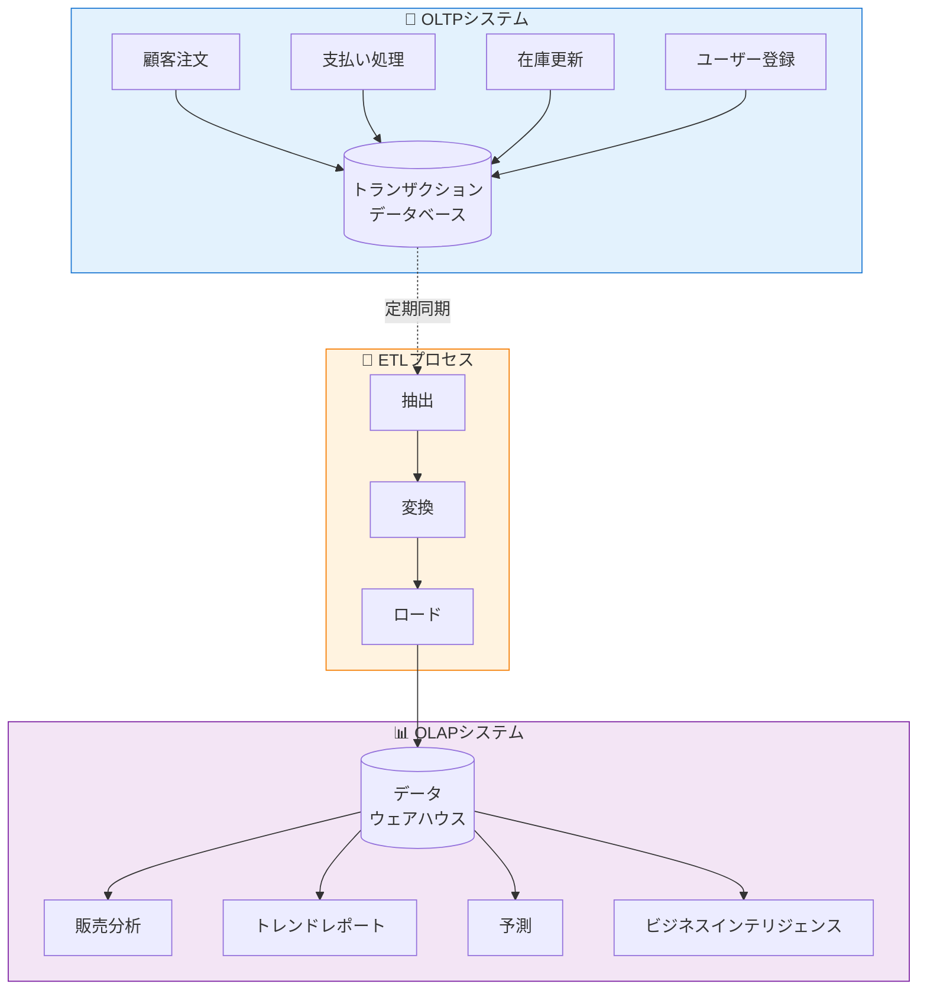
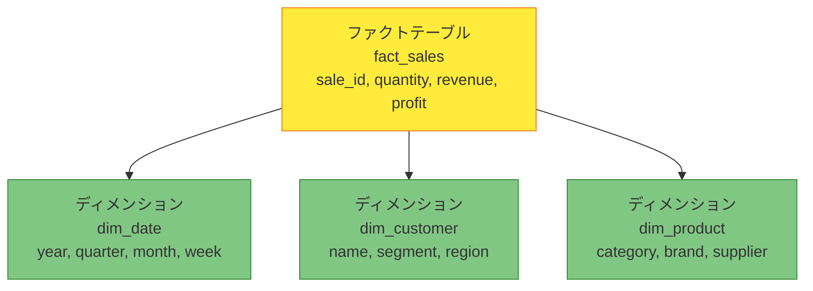

2つの異なるタイプの店を想像してください。1つ目は、顧客が素早くアイテムを手に取り、支払いをして去る忙しいコンビニエンスストアです——毎時間何百もの小さく速いトランザクション。2つ目は、アナリストが購買パターン、在庫トレンド、季節的需要を研究する倉庫です——操作は少ないですが、それぞれが膨大な量のデータを調査します。これらは、データベースシステムへの2つの基本的なアプローチを表しています：OLTPとOLAP。

## データ処理の2つの世界

モダンなビジネスは、2つの異なる目的のためにデータベースを必要とします：

**OLTP（Online Transaction Processing）**：日常業務を処理
- 顧客注文を処理
- 在庫を更新
- 支払いを記録
- ユーザーアカウントを管理

**OLAP（Online Analytical Processing）**：ビジネスインテリジェンスをサポート
- 販売トレンドを分析
- レポートを生成
- 需要を予測
- パターンを特定



## OLTP：運用の主力

OLTPシステムは、高速で信頼性の高いトランザクションで日常業務を支えます。

### 特徴

```javascript
// OLTP：高速で焦点を絞った操作
class OrderService {
  async createOrder(customerId, items) {
    // 少数の行に影響する単一トランザクション
    const connection = await db.getConnection();
    
    try {
      await connection.beginTransaction();
      
      // 注文を挿入（1行）
      const order = await connection.query(
        'INSERT INTO orders (customer_id, total, status) VALUES (?, ?, ?)',
        [customerId, this.calculateTotal(items), 'PENDING']
      );
      
      // 注文アイテムを挿入（数行）
      for (const item of items) {
        await connection.query(
          'INSERT INTO order_items (order_id, product_id, quantity, price) VALUES (?, ?, ?, ?)',
          [order.id, item.productId, item.quantity, item.price]
        );
        
        // 在庫を更新（アイテムごとに1行）
        await connection.query(
          'UPDATE products SET stock = stock - ? WHERE id = ?',
          [item.quantity, item.productId]
        );
      }
      
      await connection.commit();
      return order;
    } catch (error) {
      await connection.rollback();
      throw error;
    }
  }
}
```

### OLTPデータベース設計：正規化スキーマ

```sql
-- 正規化設計は冗長性を最小化
-- INSERT、UPDATE、DELETEに最適化

CREATE TABLE customers (
  id INT PRIMARY KEY,
  name VARCHAR(100),
  email VARCHAR(100),
  created_at TIMESTAMP
);

CREATE TABLE orders (
  id INT PRIMARY KEY,
  customer_id INT,
  total DECIMAL(10,2),
  status VARCHAR(20),
  created_at TIMESTAMP,
  FOREIGN KEY (customer_id) REFERENCES customers(id)
);

CREATE TABLE order_items (
  id INT PRIMARY KEY,
  order_id INT,
  product_id INT,
  quantity INT,
  price DECIMAL(10,2),
  FOREIGN KEY (order_id) REFERENCES orders(id),
  FOREIGN KEY (product_id) REFERENCES products(id)
);
```

!!!anote "💡 OLTPの主要機能"
    **高速応答時間**：トランザクションあたりミリ秒
    
    **高い同時実行性**：数千の同時ユーザー
    
    **ACID準拠**：データ整合性の保証
    
    **正規化スキーマ**：最小限のデータ冗長性
    
    **現在のデータ**：リアルタイムで最新の情報

## OLAP：分析の強力なツール

OLAPシステムは、ビジネス上の意思決定をサポートするために履歴データを分析します。

### 特徴

```javascript
// OLAP：大規模データセット全体の複雑な分析
class SalesAnalytics {
  async getMonthlySalesTrend(year) {
    // クエリは数百万行をスキャン
    // 複数の次元でデータを集約
    const query = `
      SELECT 
        DATE_FORMAT(o.created_at, '%Y-%m') as month,
        c.region,
        p.category,
        COUNT(DISTINCT o.id) as order_count,
        SUM(oi.quantity) as units_sold,
        SUM(oi.quantity * oi.price) as revenue,
        AVG(o.total) as avg_order_value
      FROM orders o
      JOIN customers c ON o.customer_id = c.id
      JOIN order_items oi ON o.id = oi.order_id
      JOIN products p ON oi.product_id = p.id
      WHERE YEAR(o.created_at) = ?
      GROUP BY 
        DATE_FORMAT(o.created_at, '%Y-%m'),
        c.region,
        p.category
      ORDER BY month, region, category
    `;
    
    return await dataWarehouse.query(query, [year]);
  }
}
```

### OLAPデータベース設計：スタースキーマ

```sql
-- クエリ用に最適化された非正規化設計
-- ファクトテーブルとディメンションテーブルを持つスタースキーマ

-- ファクトテーブル：メトリクスを含む
CREATE TABLE fact_sales (
  sale_id BIGINT PRIMARY KEY,
  date_key INT,
  customer_key INT,
  product_key INT,
  store_key INT,
  quantity INT,
  unit_price DECIMAL(10,2),
  revenue DECIMAL(10,2),
  profit DECIMAL(10,2),
  FOREIGN KEY (date_key) REFERENCES dim_date(date_key),
  FOREIGN KEY (customer_key) REFERENCES dim_customer(customer_key),
  FOREIGN KEY (product_key) REFERENCES dim_product(product_key)
);

-- ディメンションテーブル：記述属性を含む
CREATE TABLE dim_date (
  date_key INT PRIMARY KEY,
  full_date DATE,
  year INT,
  quarter INT,
  month INT,
  month_name VARCHAR(20),
  week INT,
  day_of_week INT
);

CREATE TABLE dim_customer (
  customer_key INT PRIMARY KEY,
  customer_id INT,
  name VARCHAR(100),
  segment VARCHAR(50),
  region VARCHAR(50),
  country VARCHAR(50)
);
```



!!!anote "💡 OLAPの主要機能"
    **複雑なクエリ**：多次元分析
    
    **大量のデータボリューム**：数百万から数十億行
    
    **履歴データ**：時系列分析
    
    **非正規化スキーマ**：読み取りパフォーマンスに最適化
    
    **バッチ更新**：定期的なデータロード（ETL）

## 並列比較

| 側面 | OLTP | OLAP |
|------|------|------|
| **目的** | 日常業務 | ビジネスインテリジェンス |
| **ユーザー** | 数千の同時ユーザー | 数十人のアナリスト |
| **操作** | INSERT、UPDATE、DELETE、SELECT | 複雑な集約を伴うSELECT |
| **クエリの複雑さ** | シンプル、事前定義 | 複雑、アドホック |
| **応答時間** | ミリ秒 | 秒から分 |
| **クエリあたりのデータ量** | 数行 | 数百万行 |
| **データベース設計** | 正規化（3NF） | 非正規化（スター/スノーフレーク） |
| **データの鮮度** | リアルタイム | 定期更新 |
| **トランザクションサポート** | ACID必須 | 重要ではない |
| **システム例** | MySQL、PostgreSQL、Oracle | Redshift、BigQuery、Snowflake |

## 実世界の例：eコマースプラットフォーム

### OLTP：注文処理

```javascript
class OrderProcessingService {
  async processCheckout(cart, customerId) {
    // OLTP：高速トランザクション処理
    const connection = await this.db.getConnection();
    
    try {
      await connection.beginTransaction();
      
      // 注文を作成（1行に影響）
      const order = await connection.query(
        'INSERT INTO orders (customer_id, total, status) VALUES (?, ?, ?)',
        [customerId, cart.total, 'PROCESSING']
      );
      
      // 注文アイテムを追加（数行に影響）
      for (const item of cart.items) {
        await connection.query(
          'INSERT INTO order_items (order_id, product_id, quantity, price) VALUES (?, ?, ?, ?)',
          [order.id, item.id, item.quantity, item.price]
        );
        
        // 在庫を更新（1行に影響）
        await connection.query(
          'UPDATE products SET stock = stock - ? WHERE id = ?',
          [item.quantity, item.id]
        );
      }
      
      await connection.commit();
      
      // ミリ秒で応答
      return { orderId: order.id, status: 'SUCCESS' };
    } catch (error) {
      await connection.rollback();
      throw error;
    }
  }
}
```

### OLAP：販売パフォーマンスの分析

```javascript
class SalesReportingService {
  async generateQuarterlyReport(year, quarter) {
    // OLAP：複雑な分析クエリ
    const query = `
      SELECT 
        d.month_name,
        p.category,
        s.region,
        COUNT(DISTINCT f.sale_id) as transaction_count,
        SUM(f.quantity) as units_sold,
        SUM(f.revenue) as total_revenue,
        SUM(f.profit) as total_profit,
        AVG(f.revenue) as avg_transaction_value
      FROM fact_sales f
      JOIN dim_date d ON f.date_key = d.date_key
      JOIN dim_product p ON f.product_key = p.product_key
      JOIN dim_store s ON f.store_key = s.store_key
      WHERE d.year = ? AND d.quarter = ?
      GROUP BY d.month_name, p.category, s.region
      ORDER BY d.month_name, total_revenue DESC
    `;
    
    // クエリは数百万行をスキャン
    // 秒単位で応答
    const results = await this.dataWarehouse.query(query, [year, quarter]);
    
    return this.formatReport(results);
  }
}
```

## 適切なシステムの選択

### OLTPを使用する場合：

✅ **高トランザクション量**：数千の同時ユーザー

✅ **データ整合性が重要**：金融トランザクション、在庫管理

✅ **リアルタイム更新**：現在のデータが即座に利用可能である必要がある

✅ **シンプルなクエリ**：IDによる検索、挿入、更新、削除

✅ **ACID準拠が必要**：銀行、eコマース、予約システム

### OLAPを使用する場合：

✅ **複雑な分析**：多次元分析、集約

✅ **履歴分析**：トレンド分析、予測

✅ **大量のデータボリューム**：数百万または数十億行の分析

✅ **ビジネスインテリジェンス**：レポート、ダッシュボード、データマイニング

✅ **読み取り重視のワークロード**：書き込みは少なく、複雑な読み取りが多い

## まとめ

OLTPとOLAPを理解することは、効果的なデータシステムを設計するための基本です：

**OLTPシステム**：
- 高速で信頼性の高いトランザクションで日常業務を支える
- 書き込みとシンプルな読み取りに最適化
- 正規化スキーマがデータ整合性を保証
- リアルタイムで現在のデータ

**OLAPシステム**：
- ビジネスインテリジェンスと分析を可能にする
- 大規模データセットでの複雑なクエリに最適化
- 非正規化スキーマがクエリパフォーマンスを向上
- トレンド分析のための履歴データ

**重要なポイント**：ほとんどの組織は両方を必要とします——業務のためのOLTPと分析のためのOLAP。ETLプロセスが2つを橋渡しし、トランザクションシステムから分析ウェアハウスにデータを移動し、運用パフォーマンスに影響を与えることなく分析できるようにします。

!!!tip "💡 ベストプラクティス"
    OLTPデータベースで直接複雑な分析クエリを実行しないでください。ETLを使用してデータを専用のOLAPシステムに移動し、運用データベースをパフォーマンス低下から保護します。

## 参考文献

- [The Data Warehouse Toolkit by Ralph Kimball](https://www.kimballgroup.com/)
- [AWS: OLTP vs OLAP](https://aws.amazon.com/compare/the-difference-between-olap-and-oltp/)
- [Google Cloud: Data Warehouse Concepts](https://cloud.google.com/learn/what-is-a-data-warehouse)
