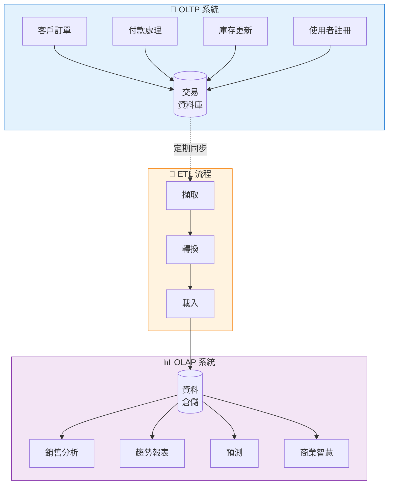
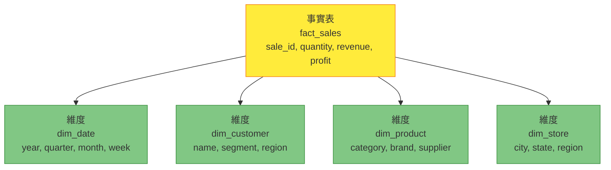

想像兩種不同類型的商店。第一種是繁忙的便利商店，顧客快速拿取商品、付款、離開——每小時數百筆小型快速交易。第二種是倉庫，分析師研究購買模式、庫存趨勢和季節性需求——較少的操作，但每次都檢查大量資料。這代表了資料庫系統的兩種基本方法：OLTP 和 OLAP。

## 資料處理的兩個世界

現代企業需要資料庫來滿足兩種不同的目的：

**OLTP (Online Transaction Processing，線上交易處理)**：處理日常營運
- 處理客戶訂單
- 更新庫存
- 記錄付款
- 管理使用者帳戶

**OLAP (Online Analytical Processing，線上分析處理)**：支援商業智慧
- 分析銷售趨勢
- 產生報表
- 預測需求
- 識別模式



## OLTP：營運主力

OLTP 系統透過快速、可靠的交易為您的日常業務營運提供動力。

### 特性

```javascript
// OLTP：快速、專注的操作
class OrderService {
  async createOrder(customerId, items) {
    // 單一交易影響少數資料列
    const connection = await db.getConnection();
    
    try {
      await connection.beginTransaction();
      
      // 插入訂單（1 列）
      const order = await connection.query(
        'INSERT INTO orders (customer_id, total, status) VALUES (?, ?, ?)',
        [customerId, this.calculateTotal(items), 'PENDING']
      );
      
      // 插入訂單項目（少數列）
      for (const item of items) {
        await connection.query(
          'INSERT INTO order_items (order_id, product_id, quantity, price) VALUES (?, ?, ?, ?)',
          [order.id, item.productId, item.quantity, item.price]
        );
        
        // 更新庫存（每個項目 1 列）
        await connection.query(
          'UPDATE products SET stock = stock - ? WHERE id = ?',
          [item.quantity, item.productId]
        );
      }
      
      await connection.commit();
      return order;
    } catch (error) {
      await connection.rollback();
      throw error;
    }
  }
}
```

### OLTP 資料庫設計：正規化架構

```sql
-- 正規化設計最小化冗餘
-- 針對 INSERT、UPDATE、DELETE 最佳化

CREATE TABLE customers (
  id INT PRIMARY KEY,
  name VARCHAR(100),
  email VARCHAR(100),
  created_at TIMESTAMP
);

CREATE TABLE orders (
  id INT PRIMARY KEY,
  customer_id INT,
  total DECIMAL(10,2),
  status VARCHAR(20),
  created_at TIMESTAMP,
  FOREIGN KEY (customer_id) REFERENCES customers(id)
);

CREATE TABLE order_items (
  id INT PRIMARY KEY,
  order_id INT,
  product_id INT,
  quantity INT,
  price DECIMAL(10,2),
  FOREIGN KEY (order_id) REFERENCES orders(id),
  FOREIGN KEY (product_id) REFERENCES products(id)
);

CREATE TABLE products (
  id INT PRIMARY KEY,
  name VARCHAR(200),
  category_id INT,
  stock INT,
  price DECIMAL(10,2)
);
```

### OLTP 查詢模式

```sql
-- 典型的 OLTP 查詢：快速、特定、小結果集

-- 取得客戶詳細資料
SELECT * FROM customers WHERE id = 12345;

-- 建立新訂單
INSERT INTO orders (customer_id, total, status, created_at)
VALUES (12345, 299.99, 'PENDING', NOW());

-- 更新庫存
UPDATE products 
SET stock = stock - 2 
WHERE id = 789;

-- 檢查訂單狀態
SELECT o.id, o.status, o.total, c.name
FROM orders o
JOIN customers c ON o.customer_id = c.id
WHERE o.id = 54321;
```

!!!anote "💡 OLTP 關鍵特性"
    **快速回應時間**：每筆交易毫秒級
    
    **高並發性**：數千個同時使用者
    
    **ACID 合規性**：保證資料一致性
    
    **正規化架構**：最小資料冗餘
    
    **即時資料**：即時、最新的資訊

## OLAP：分析強力引擎

OLAP 系統分析歷史資料以支援業務決策。

### 特性

```javascript
// OLAP：跨大型資料集的複雜分析
class SalesAnalytics {
  async getMonthlySalesTrend(year) {
    // 查詢掃描數百萬列
    // 跨多個維度聚合資料
    const query = `
      SELECT 
        DATE_FORMAT(o.created_at, '%Y-%m') as month,
        c.region,
        p.category,
        COUNT(DISTINCT o.id) as order_count,
        SUM(oi.quantity) as units_sold,
        SUM(oi.quantity * oi.price) as revenue,
        AVG(o.total) as avg_order_value
      FROM orders o
      JOIN customers c ON o.customer_id = c.id
      JOIN order_items oi ON o.id = oi.order_id
      JOIN products p ON oi.product_id = p.id
      WHERE YEAR(o.created_at) = ?
      GROUP BY 
        DATE_FORMAT(o.created_at, '%Y-%m'),
        c.region,
        p.category
      ORDER BY month, region, category
    `;
    
    return await dataWarehouse.query(query, [year]);
  }
  
  async getCustomerSegmentation() {
    // 複雜的分析查詢
    const query = `
      SELECT 
        CASE 
          WHEN total_spent > 10000 THEN 'VIP'
          WHEN total_spent > 5000 THEN 'Premium'
          WHEN total_spent > 1000 THEN 'Regular'
          ELSE 'Occasional'
        END as segment,
        COUNT(*) as customer_count,
        AVG(total_spent) as avg_lifetime_value,
        AVG(order_count) as avg_orders,
        AVG(days_since_first_order) as avg_customer_age
      FROM (
        SELECT 
          c.id,
          SUM(o.total) as total_spent,
          COUNT(o.id) as order_count,
          DATEDIFF(NOW(), MIN(o.created_at)) as days_since_first_order
        FROM customers c
        LEFT JOIN orders o ON c.id = o.customer_id
        GROUP BY c.id
      ) customer_stats
      GROUP BY segment
      ORDER BY avg_lifetime_value DESC
    `;
    
    return await dataWarehouse.query(query);
  }
}
```

### OLAP 資料庫設計：星型架構

```sql
-- 反正規化設計針對查詢最佳化
-- 星型架構包含事實表和維度表

-- 事實表：包含度量值
CREATE TABLE fact_sales (
  sale_id BIGINT PRIMARY KEY,
  date_key INT,
  customer_key INT,
  product_key INT,
  store_key INT,
  quantity INT,
  unit_price DECIMAL(10,2),
  discount DECIMAL(10,2),
  revenue DECIMAL(10,2),
  cost DECIMAL(10,2),
  profit DECIMAL(10,2),
  FOREIGN KEY (date_key) REFERENCES dim_date(date_key),
  FOREIGN KEY (customer_key) REFERENCES dim_customer(customer_key),
  FOREIGN KEY (product_key) REFERENCES dim_product(product_key),
  FOREIGN KEY (store_key) REFERENCES dim_store(store_key)
);

-- 維度表：包含描述性屬性
CREATE TABLE dim_date (
  date_key INT PRIMARY KEY,
  full_date DATE,
  year INT,
  quarter INT,
  month INT,
  month_name VARCHAR(20),
  week INT,
  day_of_week INT,
  day_name VARCHAR(20),
  is_weekend BOOLEAN,
  is_holiday BOOLEAN
);

CREATE TABLE dim_customer (
  customer_key INT PRIMARY KEY,
  customer_id INT,
  name VARCHAR(100),
  email VARCHAR(100),
  segment VARCHAR(50),
  region VARCHAR(50),
  country VARCHAR(50),
  registration_date DATE
);

CREATE TABLE dim_product (
  product_key INT PRIMARY KEY,
  product_id INT,
  name VARCHAR(200),
  category VARCHAR(100),
  subcategory VARCHAR(100),
  brand VARCHAR(100),
  supplier VARCHAR(100)
);

CREATE TABLE dim_store (
  store_key INT PRIMARY KEY,
  store_id INT,
  name VARCHAR(100),
  city VARCHAR(100),
  state VARCHAR(100),
  country VARCHAR(100),
  region VARCHAR(50),
  size_category VARCHAR(20)
);
```



### OLAP 查詢模式

```sql
-- 典型的 OLAP 查詢：複雜、分析性、大結果集

-- 銷售趨勢分析
SELECT 
  d.year,
  d.quarter,
  p.category,
  SUM(f.revenue) as total_revenue,
  SUM(f.profit) as total_profit,
  COUNT(DISTINCT f.customer_key) as unique_customers
FROM fact_sales f
JOIN dim_date d ON f.date_key = d.date_key
JOIN dim_product p ON f.product_key = p.product_key
WHERE d.year BETWEEN 2018 AND 2020
GROUP BY d.year, d.quarter, p.category
ORDER BY d.year, d.quarter, total_revenue DESC;

-- 依地區的客戶分群
SELECT 
  c.region,
  c.segment,
  COUNT(DISTINCT f.customer_key) as customer_count,
  SUM(f.revenue) as total_revenue,
  AVG(f.revenue) as avg_transaction_value
FROM fact_sales f
JOIN dim_customer c ON f.customer_key = c.customer_key
JOIN dim_date d ON f.date_key = d.date_key
WHERE d.year = 2020
GROUP BY c.region, c.segment
ORDER BY total_revenue DESC;

-- 產品效能比較
SELECT 
  p.category,
  p.brand,
  SUM(f.quantity) as units_sold,
  SUM(f.revenue) as revenue,
  SUM(f.profit) as profit,
  SUM(f.profit) / SUM(f.revenue) * 100 as profit_margin
FROM fact_sales f
JOIN dim_product p ON f.product_key = p.product_key
JOIN dim_date d ON f.date_key = d.date_key
WHERE d.year = 2020
GROUP BY p.category, p.brand
HAVING SUM(f.revenue) > 100000
ORDER BY profit_margin DESC;
```

!!!anote "💡 OLAP 關鍵特性"
    **複雜查詢**：多維度分析
    
    **大資料量**：數百萬到數十億列
    
    **歷史資料**：時間序列分析
    
    **反正規化架構**：針對讀取效能最佳化
    
    **批次更新**：定期資料載入（ETL）

## 並排比較


{
  "title": {
    "text": "OLTP vs OLAP：查詢回應時間"
  },
  "tooltip": {
    "trigger": "axis",
    "axisPointer": {
      "type": "shadow"
    }
  },
  "legend": {
    "data": ["OLTP", "OLAP"]
  },
  "xAxis": {
    "type": "category",
    "data": ["簡單查詢", "聯結查詢", "聚合", "複雜分析"]
  },
  "yAxis": {
    "type": "value",
    "name": "回應時間 (ms)",
    "axisLabel": {
      "formatter": "{value}"
    }
  },
  "series": [
    {
      "name": "OLTP",
      "type": "bar",
      "data": [5, 20, 50, 200],
      "itemStyle": {
        "color": "#1976d2"
      }
    },
    {
      "name": "OLAP",
      "type": "bar",
      "data": [100, 500, 2000, 10000],
      "itemStyle": {
        "color": "#7b1fa2"
      }
    }
  ]
}


| 面向 | OLTP | OLAP |
|--------|------|------|
| **目的** | 日常營運 | 商業智慧 |
| **使用者** | 數千個並發使用者 | 數十個分析師 |
| **操作** | INSERT、UPDATE、DELETE、SELECT | SELECT 搭配複雜聚合 |
| **查詢複雜度** | 簡單、預定義 | 複雜、臨時 |
| **回應時間** | 毫秒 | 秒到分鐘 |
| **每次查詢的資料量** | 少數列 | 數百萬列 |
| **資料庫設計** | 正規化（3NF） | 反正規化（星型/雪花） |
| **資料新鮮度** | 即時 | 定期更新 |
| **交易支援** | 需要 ACID | 不重要 |
| **索引** | 多個欄位上的多個索引 | 關鍵欄位上的少數索引 |
| **範例系統** | MySQL、PostgreSQL、Oracle | Redshift、BigQuery、Snowflake |

## 真實世界範例：電子商務平台

### OLTP：處理訂單

```javascript
class OrderProcessingService {
  async processCheckout(cart, customerId) {
    // OLTP：快速交易處理
    const connection = await this.db.getConnection();
    
    try {
      await connection.beginTransaction();
      
      // 建立訂單（影響 1 列）
      const order = await connection.query(
        'INSERT INTO orders (customer_id, total, status) VALUES (?, ?, ?)',
        [customerId, cart.total, 'PROCESSING']
      );
      
      // 新增訂單項目（影響少數列）
      for (const item of cart.items) {
        await connection.query(
          'INSERT INTO order_items (order_id, product_id, quantity, price) VALUES (?, ?, ?, ?)',
          [order.id, item.id, item.quantity, item.price]
        );
        
        // 更新庫存（影響 1 列）
        await connection.query(
          'UPDATE products SET stock = stock - ? WHERE id = ?',
          [item.quantity, item.id]
        );
      }
      
      // 記錄付款（影響 1 列）
      await connection.query(
        'INSERT INTO payments (order_id, amount, method, status) VALUES (?, ?, ?, ?)',
        [order.id, cart.total, cart.paymentMethod, 'COMPLETED']
      );
      
      await connection.commit();
      
      // 毫秒級回應
      return { orderId: order.id, status: 'SUCCESS' };
    } catch (error) {
      await connection.rollback();
      throw error;
    }
  }
}
```

### OLAP：分析銷售績效

```javascript
class SalesReportingService {
  async generateQuarterlyReport(year, quarter) {
    // OLAP：複雜的分析查詢
    const query = `
      SELECT 
        d.month_name,
        p.category,
        s.region,
        COUNT(DISTINCT f.sale_id) as transaction_count,
        COUNT(DISTINCT f.customer_key) as unique_customers,
        SUM(f.quantity) as units_sold,
        SUM(f.revenue) as total_revenue,
        SUM(f.profit) as total_profit,
        AVG(f.revenue) as avg_transaction_value,
        SUM(f.profit) / SUM(f.revenue) * 100 as profit_margin
      FROM fact_sales f
      JOIN dim_date d ON f.date_key = d.date_key
      JOIN dim_product p ON f.product_key = p.product_key
      JOIN dim_store s ON f.store_key = s.store_key
      WHERE d.year = ? AND d.quarter = ?
      GROUP BY d.month_name, p.category, s.region
      WITH ROLLUP
      ORDER BY d.month_name, total_revenue DESC
    `;
    
    // 查詢掃描數百萬列
    // 秒級回應
    const results = await this.dataWarehouse.query(query, [year, quarter]);
    
    return this.formatReport(results);
  }
  
  async getCustomerLifetimeValue() {
    // OLAP：客戶分析
    const query = `
      SELECT 
        c.segment,
        c.region,
        COUNT(DISTINCT c.customer_key) as customer_count,
        AVG(customer_metrics.total_revenue) as avg_lifetime_value,
        AVG(customer_metrics.order_count) as avg_orders,
        AVG(customer_metrics.avg_order_value) as avg_order_size,
        AVG(customer_metrics.customer_age_days) as avg_customer_age_days
      FROM dim_customer c
      JOIN (
        SELECT 
          f.customer_key,
          SUM(f.revenue) as total_revenue,
          COUNT(DISTINCT f.sale_id) as order_count,
          AVG(f.revenue) as avg_order_value,
          DATEDIFF(CURRENT_DATE, MIN(d.full_date)) as customer_age_days
        FROM fact_sales f
        JOIN dim_date d ON f.date_key = d.date_key
        GROUP BY f.customer_key
      ) customer_metrics ON c.customer_key = customer_metrics.customer_key
      GROUP BY c.segment, c.region
      ORDER BY avg_lifetime_value DESC
    `;
    
    return await this.dataWarehouse.query(query);
  }
}
```

## ETL：連接 OLTP 和 OLAP

擷取、轉換、載入（ETL）流程將資料從 OLTP 系統移動到 OLAP 系統：

```javascript
class ETLPipeline {
  async runDailySalesETL() {
    console.log('開始 ETL 流程...');
    
    // 擷取：從 OLTP 資料庫取得資料
    const salesData = await this.extractSalesData();
    
    // 轉換：清理和重塑資料
    const transformedData = await this.transformSalesData(salesData);
    
    // 載入：插入到資料倉儲
    await this.loadToDataWarehouse(transformedData);
    
    console.log('ETL 流程完成');
  }
  
  async extractSalesData() {
    // 從 OLTP 資料庫擷取
    const query = `
      SELECT 
        o.id as order_id,
        o.created_at,
        o.customer_id,
        c.name as customer_name,
        c.region,
        oi.product_id,
        p.name as product_name,
        p.category,
        oi.quantity,
        oi.price,
        oi.quantity * oi.price as revenue
      FROM orders o
      JOIN customers c ON o.customer_id = c.id
      JOIN order_items oi ON o.id = oi.order_id
      JOIN products p ON oi.product_id = p.id
      WHERE DATE(o.created_at) = CURRENT_DATE - INTERVAL 1 DAY
    `;
    
    return await this.oltpDb.query(query);
  }
  
  async transformSalesData(salesData) {
    // 轉換資料以供分析
    return salesData.map(row => ({
      sale_id: row.order_id,
      date_key: this.getDateKey(row.created_at),
      customer_key: this.getCustomerKey(row.customer_id),
      product_key: this.getProductKey(row.product_id),
      quantity: row.quantity,
      unit_price: row.price,
      revenue: row.revenue,
      cost: row.revenue * 0.6, // 簡化的成本計算
      profit: row.revenue * 0.4
    }));
  }
  
  async loadToDataWarehouse(data) {
    // 批次插入到 OLAP 資料庫
    const batchSize = 1000;
    
    for (let i = 0; i < data.length; i += batchSize) {
      const batch = data.slice(i, i + batchSize);
      await this.dataWarehouse.batchInsert('fact_sales', batch);
    }
  }
  
  getDateKey(date) {
    // 將日期轉換為整數鍵：YYYYMMDD
    return parseInt(date.toISOString().slice(0, 10).replace(/-/g, ''));
  }
  
  getCustomerKey(customerId) {
    // 將 OLTP 客戶 ID 對應到 OLAP 客戶鍵
    return this.customerKeyMap.get(customerId);
  }
  
  getProductKey(productId) {
    // 將 OLTP 產品 ID 對應到 OLAP 產品鍵
    return this.productKeyMap.get(productId);
  }
}
```

## 選擇正確的系統

### 使用 OLTP 的時機：

✅ **高交易量**：數千個並發使用者

✅ **資料完整性至關重要**：金融交易、庫存管理

✅ **即時更新**：當前資料必須立即可用

✅ **簡單查詢**：依 ID 查詢、插入、更新、刪除

✅ **需要 ACID 合規性**：銀行、電子商務、訂位系統

### 使用 OLAP 的時機：

✅ **複雜分析**：多維度分析、聚合

✅ **歷史分析**：趨勢分析、預測

✅ **大資料量**：分析數百萬或數十億列

✅ **商業智慧**：報表、儀表板、資料探勘

✅ **讀取密集工作負載**：少量寫入、大量複雜讀取

### 混合方法：HTAP

某些現代資料庫支援混合交易/分析處理（HTAP）：

```javascript
// 範例：使用讀取副本進行分析
class HybridDataAccess {
  constructor() {
    this.primaryDb = new Database('primary'); // OLTP
    this.replicaDb = new Database('replica'); // OLAP 查詢
  }
  
  // 寫入操作到主資料庫
  async createOrder(orderData) {
    return await this.primaryDb.insert('orders', orderData);
  }
  
  // 簡單讀取從主資料庫
  async getOrder(orderId) {
    return await this.primaryDb.query(
      'SELECT * FROM orders WHERE id = ?',
      [orderId]
    );
  }
  
  // 複雜分析從副本
  async getSalesReport(startDate, endDate) {
    return await this.replicaDb.query(`
      SELECT 
        DATE(created_at) as date,
        COUNT(*) as order_count,
        SUM(total) as revenue
      FROM orders
      WHERE created_at BETWEEN ? AND ?
      GROUP BY DATE(created_at)
    `, [startDate, endDate]);
  }
}
```

## 現代 OLAP 技術

### 雲端資料倉儲

```javascript
// 範例：使用 Amazon Redshift
class RedshiftAnalytics {
  async runAnalysis() {
    const query = `
      SELECT 
        date_trunc('month', sale_date) as month,
        product_category,
        SUM(revenue) as total_revenue,
        COUNT(DISTINCT customer_id) as unique_customers
      FROM sales_fact
      WHERE sale_date >= '2020-01-01'
      GROUP BY 1, 2
      ORDER BY 1, 3 DESC
    `;
    
    return await this.redshift.query(query);
  }
}

// 範例：使用 Google BigQuery
class BigQueryAnalytics {
  async runAnalysis() {
    const query = `
      SELECT 
        FORMAT_DATE('%Y-%m', sale_date) as month,
        product_category,
        SUM(revenue) as total_revenue,
        COUNT(DISTINCT customer_id) as unique_customers
      FROM \`project.dataset.sales_fact\`
      WHERE sale_date >= '2020-01-01'
      GROUP BY month, product_category
      ORDER BY month, total_revenue DESC
    `;
    
    return await this.bigquery.query(query);
  }
}
```

## 效能最佳化

### OLTP 最佳化

```sql
-- 快速查詢的索引
CREATE INDEX idx_orders_customer ON orders(customer_id);
CREATE INDEX idx_orders_status ON orders(status);
CREATE INDEX idx_orders_created ON orders(created_at);

-- 大型資料表的分割
CREATE TABLE orders (
  id INT,
  customer_id INT,
  created_at TIMESTAMP,
  ...
) PARTITION BY RANGE (YEAR(created_at)) (
  PARTITION p2019 VALUES LESS THAN (2020),
  PARTITION p2020 VALUES LESS THAN (2021),
  PARTITION p2021 VALUES LESS THAN (2022)
);
```

### OLAP 最佳化

```sql
-- 分析用的列式儲存
CREATE TABLE fact_sales (
  sale_id BIGINT,
  date_key INT,
  customer_key INT,
  revenue DECIMAL(10,2),
  ...
) STORED AS PARQUET;

-- 常見查詢的實體化視圖
CREATE MATERIALIZED VIEW monthly_sales_summary AS
SELECT 
  DATE_TRUNC('month', sale_date) as month,
  product_category,
  SUM(revenue) as total_revenue,
  COUNT(*) as transaction_count
FROM fact_sales
GROUP BY 1, 2;

-- 定期重新整理
REFRESH MATERIALIZED VIEW monthly_sales_summary;
```

## 總結

理解 OLTP 和 OLAP 是設計有效資料系統的基礎：

**OLTP 系統**：
- 透過快速、可靠的交易為日常營運提供動力
- 針對寫入和簡單讀取最佳化
- 正規化架構確保資料完整性
- 即時、當前資料

**OLAP 系統**：
- 啟用商業智慧和分析
- 針對大型資料集上的複雜查詢最佳化
- 反正規化架構改善查詢效能
- 用於趨勢分析的歷史資料

**關鍵要點**：大多數組織兩者都需要——OLTP 用於營運，OLAP 用於分析。ETL 流程連接兩者，將資料從交易系統移動到分析倉儲，在那裡可以進行分析而不影響營運效能。

!!!tip "💡 最佳實踐"
    永遠不要直接在 OLTP 資料庫上執行複雜的分析查詢。使用 ETL 將資料移動到專用的 OLAP 系統，保護您的營運資料庫免受效能下降的影響。

## 參考資料

- [The Data Warehouse Toolkit by Ralph Kimball](https://www.kimballgroup.com/)
- [AWS: OLTP vs OLAP](https://aws.amazon.com/compare/the-difference-between-olap-and-oltp/)
- [Google Cloud: Data Warehouse Concepts](https://cloud.google.com/learn/what-is-a-data-warehouse)
