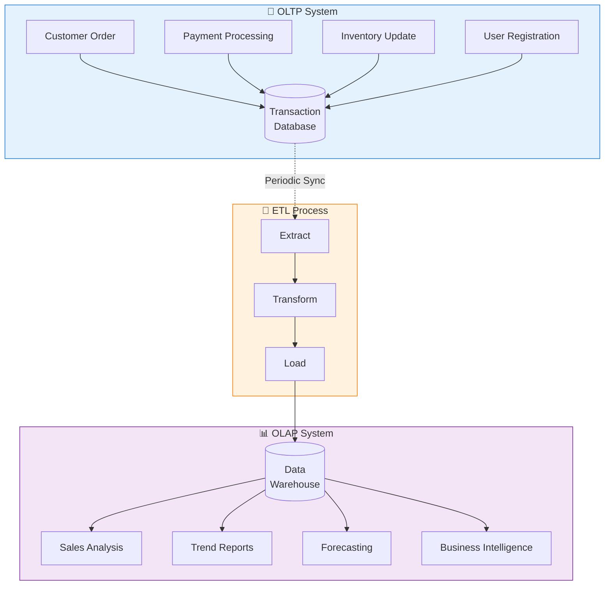
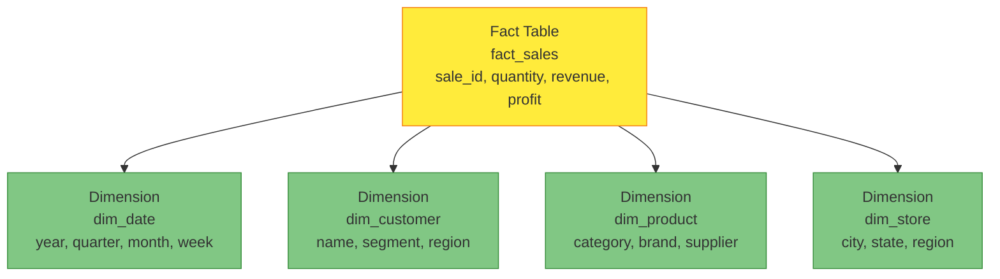

Imagine two different types of stores. The first is a busy convenience store where customers quickly grab items, pay, and leave—hundreds of small, fast transactions every hour. The second is a warehouse where analysts study purchasing patterns, inventory trends, and seasonal demands—fewer operations, but each one examines massive amounts of data. These represent the two fundamental approaches to database systems: OLTP and OLAP.

## The Two Worlds of Data Processing

Modern businesses need databases for two distinct purposes:

**OLTP (Online Transaction Processing)**: Handles day-to-day operations
- Process customer orders
- Update inventory
- Record payments
- Manage user accounts

**OLAP (Online Analytical Processing)**: Supports business intelligence
- Analyze sales trends
- Generate reports
- Forecast demand
- Identify patterns



## OLTP: The Operational Workhorse

OLTP systems power your daily business operations with fast, reliable transactions.

### Characteristics

```javascript
// OLTP: Fast, focused operations
class OrderService {
  async createOrder(customerId, items) {
    // Single transaction affecting few rows
    const connection = await db.getConnection();
    
    try {
      await connection.beginTransaction();
      
      // Insert order (1 row)
      const order = await connection.query(
        'INSERT INTO orders (customer_id, total, status) VALUES (?, ?, ?)',
        [customerId, this.calculateTotal(items), 'PENDING']
      );
      
      // Insert order items (few rows)
      for (const item of items) {
        await connection.query(
          'INSERT INTO order_items (order_id, product_id, quantity, price) VALUES (?, ?, ?, ?)',
          [order.id, item.productId, item.quantity, item.price]
        );
        
        // Update inventory (1 row per item)
        await connection.query(
          'UPDATE products SET stock = stock - ? WHERE id = ?',
          [item.quantity, item.productId]
        );
      }
      
      await connection.commit();
      return order;
    } catch (error) {
      await connection.rollback();
      throw error;
    }
  }
}
```

### OLTP Database Design: Normalized Schema

```sql
-- Normalized design minimizes redundancy
-- Optimized for INSERT, UPDATE, DELETE

CREATE TABLE customers (
  id INT PRIMARY KEY,
  name VARCHAR(100),
  email VARCHAR(100),
  created_at TIMESTAMP
);

CREATE TABLE orders (
  id INT PRIMARY KEY,
  customer_id INT,
  total DECIMAL(10,2),
  status VARCHAR(20),
  created_at TIMESTAMP,
  FOREIGN KEY (customer_id) REFERENCES customers(id)
);

CREATE TABLE order_items (
  id INT PRIMARY KEY,
  order_id INT,
  product_id INT,
  quantity INT,
  price DECIMAL(10,2),
  FOREIGN KEY (order_id) REFERENCES orders(id),
  FOREIGN KEY (product_id) REFERENCES products(id)
);

CREATE TABLE products (
  id INT PRIMARY KEY,
  name VARCHAR(200),
  category_id INT,
  stock INT,
  price DECIMAL(10,2)
);
```

### OLTP Query Patterns

```sql
-- Typical OLTP queries: Fast, specific, small result sets

-- Get customer details
SELECT * FROM customers WHERE id = 12345;

-- Create new order
INSERT INTO orders (customer_id, total, status, created_at)
VALUES (12345, 299.99, 'PENDING', NOW());

-- Update inventory
UPDATE products 
SET stock = stock - 2 
WHERE id = 789;

-- Check order status
SELECT o.id, o.status, o.total, c.name
FROM orders o
JOIN customers c ON o.customer_id = c.id
WHERE o.id = 54321;
```

!!!anote "💡 OLTP Key Features"
    **Fast response time**: Milliseconds per transaction
    
    **High concurrency**: Thousands of simultaneous users
    
    **ACID compliance**: Guaranteed data consistency
    
    **Normalized schema**: Minimal data redundancy
    
    **Current data**: Real-time, up-to-date information

## OLAP: The Analytics Powerhouse

OLAP systems analyze historical data to support business decisions.

### Characteristics

```javascript
// OLAP: Complex analysis across large datasets
class SalesAnalytics {
  async getMonthlySalesTrend(year) {
    // Query scans millions of rows
    // Aggregates data across multiple dimensions
    const query = `
      SELECT 
        DATE_FORMAT(o.created_at, '%Y-%m') as month,
        c.region,
        p.category,
        COUNT(DISTINCT o.id) as order_count,
        SUM(oi.quantity) as units_sold,
        SUM(oi.quantity * oi.price) as revenue,
        AVG(o.total) as avg_order_value
      FROM orders o
      JOIN customers c ON o.customer_id = c.id
      JOIN order_items oi ON o.id = oi.order_id
      JOIN products p ON oi.product_id = p.id
      WHERE YEAR(o.created_at) = ?
      GROUP BY 
        DATE_FORMAT(o.created_at, '%Y-%m'),
        c.region,
        p.category
      ORDER BY month, region, category
    `;
    
    return await dataWarehouse.query(query, [year]);
  }
  
  async getCustomerSegmentation() {
    // Complex analytical query
    const query = `
      SELECT 
        CASE 
          WHEN total_spent > 10000 THEN 'VIP'
          WHEN total_spent > 5000 THEN 'Premium'
          WHEN total_spent > 1000 THEN 'Regular'
          ELSE 'Occasional'
        END as segment,
        COUNT(*) as customer_count,
        AVG(total_spent) as avg_lifetime_value,
        AVG(order_count) as avg_orders,
        AVG(days_since_first_order) as avg_customer_age
      FROM (
        SELECT 
          c.id,
          SUM(o.total) as total_spent,
          COUNT(o.id) as order_count,
          DATEDIFF(NOW(), MIN(o.created_at)) as days_since_first_order
        FROM customers c
        LEFT JOIN orders o ON c.id = o.customer_id
        GROUP BY c.id
      ) customer_stats
      GROUP BY segment
      ORDER BY avg_lifetime_value DESC
    `;
    
    return await dataWarehouse.query(query);
  }
}
```

### OLAP Database Design: Star Schema

```sql
-- Denormalized design optimized for queries
-- Star schema with fact and dimension tables

-- Fact table: Contains metrics
CREATE TABLE fact_sales (
  sale_id BIGINT PRIMARY KEY,
  date_key INT,
  customer_key INT,
  product_key INT,
  store_key INT,
  quantity INT,
  unit_price DECIMAL(10,2),
  discount DECIMAL(10,2),
  revenue DECIMAL(10,2),
  cost DECIMAL(10,2),
  profit DECIMAL(10,2),
  FOREIGN KEY (date_key) REFERENCES dim_date(date_key),
  FOREIGN KEY (customer_key) REFERENCES dim_customer(customer_key),
  FOREIGN KEY (product_key) REFERENCES dim_product(product_key),
  FOREIGN KEY (store_key) REFERENCES dim_store(store_key)
);

-- Dimension tables: Contain descriptive attributes
CREATE TABLE dim_date (
  date_key INT PRIMARY KEY,
  full_date DATE,
  year INT,
  quarter INT,
  month INT,
  month_name VARCHAR(20),
  week INT,
  day_of_week INT,
  day_name VARCHAR(20),
  is_weekend BOOLEAN,
  is_holiday BOOLEAN
);

CREATE TABLE dim_customer (
  customer_key INT PRIMARY KEY,
  customer_id INT,
  name VARCHAR(100),
  email VARCHAR(100),
  segment VARCHAR(50),
  region VARCHAR(50),
  country VARCHAR(50),
  registration_date DATE
);

CREATE TABLE dim_product (
  product_key INT PRIMARY KEY,
  product_id INT,
  name VARCHAR(200),
  category VARCHAR(100),
  subcategory VARCHAR(100),
  brand VARCHAR(100),
  supplier VARCHAR(100)
);

CREATE TABLE dim_store (
  store_key INT PRIMARY KEY,
  store_id INT,
  name VARCHAR(100),
  city VARCHAR(100),
  state VARCHAR(100),
  country VARCHAR(100),
  region VARCHAR(50),
  size_category VARCHAR(20)
);
```



### OLAP Query Patterns

```sql
-- Typical OLAP queries: Complex, analytical, large result sets

-- Sales trend analysis
SELECT 
  d.year,
  d.quarter,
  p.category,
  SUM(f.revenue) as total_revenue,
  SUM(f.profit) as total_profit,
  COUNT(DISTINCT f.customer_key) as unique_customers
FROM fact_sales f
JOIN dim_date d ON f.date_key = d.date_key
JOIN dim_product p ON f.product_key = p.product_key
WHERE d.year BETWEEN 2018 AND 2020
GROUP BY d.year, d.quarter, p.category
ORDER BY d.year, d.quarter, total_revenue DESC;

-- Customer segmentation by region
SELECT 
  c.region,
  c.segment,
  COUNT(DISTINCT f.customer_key) as customer_count,
  SUM(f.revenue) as total_revenue,
  AVG(f.revenue) as avg_transaction_value
FROM fact_sales f
JOIN dim_customer c ON f.customer_key = c.customer_key
JOIN dim_date d ON f.date_key = d.date_key
WHERE d.year = 2020
GROUP BY c.region, c.segment
ORDER BY total_revenue DESC;

-- Product performance comparison
SELECT 
  p.category,
  p.brand,
  SUM(f.quantity) as units_sold,
  SUM(f.revenue) as revenue,
  SUM(f.profit) as profit,
  SUM(f.profit) / SUM(f.revenue) * 100 as profit_margin
FROM fact_sales f
JOIN dim_product p ON f.product_key = p.product_key
JOIN dim_date d ON f.date_key = d.date_key
WHERE d.year = 2020
GROUP BY p.category, p.brand
HAVING SUM(f.revenue) > 100000
ORDER BY profit_margin DESC;
```

!!!anote "💡 OLAP Key Features"
    **Complex queries**: Multi-dimensional analysis
    
    **Large data volumes**: Millions to billions of rows
    
    **Historical data**: Time-series analysis
    
    **Denormalized schema**: Optimized for read performance
    
    **Batch updates**: Periodic data loads (ETL)

## Side-by-Side Comparison


{
  "title": {
    "text": "OLTP vs OLAP: Query Response Time"
  },
  "tooltip": {
    "trigger": "axis",
    "axisPointer": {
      "type": "shadow"
    }
  },
  "legend": {
    "data": ["OLTP", "OLAP"]
  },
  "xAxis": {
    "type": "category",
    "data": ["Simple Query", "Join Query", "Aggregation", "Complex Analysis"]
  },
  "yAxis": {
    "type": "value",
    "name": "Response Time (ms)",
    "axisLabel": {
      "formatter": "{value}"
    }
  },
  "series": [
    {
      "name": "OLTP",
      "type": "bar",
      "data": [5, 20, 50, 200],
      "itemStyle": {
        "color": "#1976d2"
      }
    },
    {
      "name": "OLAP",
      "type": "bar",
      "data": [100, 500, 2000, 10000],
      "itemStyle": {
        "color": "#7b1fa2"
      }
    }
  ]
}


| Aspect | OLTP | OLAP |
|--------|------|------|
| **Purpose** | Daily operations | Business intelligence |
| **Users** | Thousands of concurrent users | Dozens of analysts |
| **Operations** | INSERT, UPDATE, DELETE, SELECT | SELECT with complex aggregations |
| **Query complexity** | Simple, predefined | Complex, ad-hoc |
| **Response time** | Milliseconds | Seconds to minutes |
| **Data volume per query** | Few rows | Millions of rows |
| **Database design** | Normalized (3NF) | Denormalized (star/snowflake) |
| **Data freshness** | Real-time | Periodic updates |
| **Transaction support** | ACID required | Not critical |
| **Indexing** | Many indexes on various columns | Few indexes on key columns |
| **Example systems** | MySQL, PostgreSQL, Oracle | Redshift, BigQuery, Snowflake |

## Real-World Example: E-Commerce Platform

### OLTP: Processing Orders

```javascript
class OrderProcessingService {
  async processCheckout(cart, customerId) {
    // OLTP: Fast transaction processing
    const connection = await this.db.getConnection();
    
    try {
      await connection.beginTransaction();
      
      // Create order (affects 1 row)
      const order = await connection.query(
        'INSERT INTO orders (customer_id, total, status) VALUES (?, ?, ?)',
        [customerId, cart.total, 'PROCESSING']
      );
      
      // Add order items (affects few rows)
      for (const item of cart.items) {
        await connection.query(
          'INSERT INTO order_items (order_id, product_id, quantity, price) VALUES (?, ?, ?, ?)',
          [order.id, item.id, item.quantity, item.price]
        );
        
        // Update inventory (affects 1 row)
        await connection.query(
          'UPDATE products SET stock = stock - ? WHERE id = ?',
          [item.quantity, item.id]
        );
      }
      
      // Record payment (affects 1 row)
      await connection.query(
        'INSERT INTO payments (order_id, amount, method, status) VALUES (?, ?, ?, ?)',
        [order.id, cart.total, cart.paymentMethod, 'COMPLETED']
      );
      
      await connection.commit();
      
      // Response in milliseconds
      return { orderId: order.id, status: 'SUCCESS' };
    } catch (error) {
      await connection.rollback();
      throw error;
    }
  }
}
```

### OLAP: Analyzing Sales Performance

```javascript
class SalesReportingService {
  async generateQuarterlyReport(year, quarter) {
    // OLAP: Complex analytical query
    const query = `
      SELECT 
        d.month_name,
        p.category,
        s.region,
        COUNT(DISTINCT f.sale_id) as transaction_count,
        COUNT(DISTINCT f.customer_key) as unique_customers,
        SUM(f.quantity) as units_sold,
        SUM(f.revenue) as total_revenue,
        SUM(f.profit) as total_profit,
        AVG(f.revenue) as avg_transaction_value,
        SUM(f.profit) / SUM(f.revenue) * 100 as profit_margin
      FROM fact_sales f
      JOIN dim_date d ON f.date_key = d.date_key
      JOIN dim_product p ON f.product_key = p.product_key
      JOIN dim_store s ON f.store_key = s.store_key
      WHERE d.year = ? AND d.quarter = ?
      GROUP BY d.month_name, p.category, s.region
      WITH ROLLUP
      ORDER BY d.month_name, total_revenue DESC
    `;
    
    // Query scans millions of rows
    // Response in seconds
    const results = await this.dataWarehouse.query(query, [year, quarter]);
    
    return this.formatReport(results);
  }
  
  async getCustomerLifetimeValue() {
    // OLAP: Customer analytics
    const query = `
      SELECT 
        c.segment,
        c.region,
        COUNT(DISTINCT c.customer_key) as customer_count,
        AVG(customer_metrics.total_revenue) as avg_lifetime_value,
        AVG(customer_metrics.order_count) as avg_orders,
        AVG(customer_metrics.avg_order_value) as avg_order_size,
        AVG(customer_metrics.customer_age_days) as avg_customer_age_days
      FROM dim_customer c
      JOIN (
        SELECT 
          f.customer_key,
          SUM(f.revenue) as total_revenue,
          COUNT(DISTINCT f.sale_id) as order_count,
          AVG(f.revenue) as avg_order_value,
          DATEDIFF(CURRENT_DATE, MIN(d.full_date)) as customer_age_days
        FROM fact_sales f
        JOIN dim_date d ON f.date_key = d.date_key
        GROUP BY f.customer_key
      ) customer_metrics ON c.customer_key = customer_metrics.customer_key
      GROUP BY c.segment, c.region
      ORDER BY avg_lifetime_value DESC
    `;
    
    return await this.dataWarehouse.query(query);
  }
}
```

## ETL: Bridging OLTP and OLAP

Extract, Transform, Load (ETL) processes move data from OLTP to OLAP systems:

```javascript
class ETLPipeline {
  async runDailySalesETL() {
    console.log('Starting ETL process...');
    
    // Extract: Get data from OLTP database
    const salesData = await this.extractSalesData();
    
    // Transform: Clean and reshape data
    const transformedData = await this.transformSalesData(salesData);
    
    // Load: Insert into data warehouse
    await this.loadToDataWarehouse(transformedData);
    
    console.log('ETL process completed');
  }
  
  async extractSalesData() {
    // Extract from OLTP database
    const query = `
      SELECT 
        o.id as order_id,
        o.created_at,
        o.customer_id,
        c.name as customer_name,
        c.region,
        oi.product_id,
        p.name as product_name,
        p.category,
        oi.quantity,
        oi.price,
        oi.quantity * oi.price as revenue
      FROM orders o
      JOIN customers c ON o.customer_id = c.id
      JOIN order_items oi ON o.id = oi.order_id
      JOIN products p ON oi.product_id = p.id
      WHERE DATE(o.created_at) = CURRENT_DATE - INTERVAL 1 DAY
    `;
    
    return await this.oltpDb.query(query);
  }
  
  async transformSalesData(salesData) {
    // Transform data for analytics
    return salesData.map(row => ({
      sale_id: row.order_id,
      date_key: this.getDateKey(row.created_at),
      customer_key: this.getCustomerKey(row.customer_id),
      product_key: this.getProductKey(row.product_id),
      quantity: row.quantity,
      unit_price: row.price,
      revenue: row.revenue,
      cost: row.revenue * 0.6, // Simplified cost calculation
      profit: row.revenue * 0.4
    }));
  }
  
  async loadToDataWarehouse(data) {
    // Batch insert into OLAP database
    const batchSize = 1000;
    
    for (let i = 0; i < data.length; i += batchSize) {
      const batch = data.slice(i, i + batchSize);
      await this.dataWarehouse.batchInsert('fact_sales', batch);
    }
  }
  
  getDateKey(date) {
    // Convert date to integer key: YYYYMMDD
    return parseInt(date.toISOString().slice(0, 10).replace(/-/g, ''));
  }
  
  getCustomerKey(customerId) {
    // Map OLTP customer ID to OLAP customer key
    return this.customerKeyMap.get(customerId);
  }
  
  getProductKey(productId) {
    // Map OLTP product ID to OLAP product key
    return this.productKeyMap.get(productId);
  }
}
```

## Choosing the Right System

### Use OLTP When:

✅ **High transaction volume**: Thousands of concurrent users

✅ **Data integrity critical**: Financial transactions, inventory management

✅ **Real-time updates**: Current data must be immediately available

✅ **Simple queries**: Lookup by ID, insert, update, delete

✅ **ACID compliance required**: Banking, e-commerce, booking systems

### Use OLAP When:

✅ **Complex analytics**: Multi-dimensional analysis, aggregations

✅ **Historical analysis**: Trend analysis, forecasting

✅ **Large data volumes**: Analyzing millions or billions of rows

✅ **Business intelligence**: Reports, dashboards, data mining

✅ **Read-heavy workload**: Few writes, many complex reads

### Hybrid Approach: HTAP

Some modern databases support Hybrid Transaction/Analytical Processing (HTAP):

```javascript
// Example: Using read replicas for analytics
class HybridDataAccess {
  constructor() {
    this.primaryDb = new Database('primary'); // OLTP
    this.replicaDb = new Database('replica'); // OLAP queries
  }
  
  // Write operations go to primary
  async createOrder(orderData) {
    return await this.primaryDb.insert('orders', orderData);
  }
  
  // Simple reads from primary
  async getOrder(orderId) {
    return await this.primaryDb.query(
      'SELECT * FROM orders WHERE id = ?',
      [orderId]
    );
  }
  
  // Complex analytics from replica
  async getSalesReport(startDate, endDate) {
    return await this.replicaDb.query(`
      SELECT 
        DATE(created_at) as date,
        COUNT(*) as order_count,
        SUM(total) as revenue
      FROM orders
      WHERE created_at BETWEEN ? AND ?
      GROUP BY DATE(created_at)
    `, [startDate, endDate]);
  }
}
```

## Modern OLAP Technologies

### Cloud Data Warehouses

```javascript
// Example: Using Amazon Redshift
class RedshiftAnalytics {
  async runAnalysis() {
    const query = `
      SELECT 
        date_trunc('month', sale_date) as month,
        product_category,
        SUM(revenue) as total_revenue,
        COUNT(DISTINCT customer_id) as unique_customers
      FROM sales_fact
      WHERE sale_date >= '2020-01-01'
      GROUP BY 1, 2
      ORDER BY 1, 3 DESC
    `;
    
    return await this.redshift.query(query);
  }
}

// Example: Using Google BigQuery
class BigQueryAnalytics {
  async runAnalysis() {
    const query = `
      SELECT 
        FORMAT_DATE('%Y-%m', sale_date) as month,
        product_category,
        SUM(revenue) as total_revenue,
        COUNT(DISTINCT customer_id) as unique_customers
      FROM \`project.dataset.sales_fact\`
      WHERE sale_date >= '2020-01-01'
      GROUP BY month, product_category
      ORDER BY month, total_revenue DESC
    `;
    
    return await this.bigquery.query(query);
  }
}
```

## Performance Optimization

### OLTP Optimization

```sql
-- Indexes for fast lookups
CREATE INDEX idx_orders_customer ON orders(customer_id);
CREATE INDEX idx_orders_status ON orders(status);
CREATE INDEX idx_orders_created ON orders(created_at);

-- Partitioning for large tables
CREATE TABLE orders (
  id INT,
  customer_id INT,
  created_at TIMESTAMP,
  ...
) PARTITION BY RANGE (YEAR(created_at)) (
  PARTITION p2019 VALUES LESS THAN (2020),
  PARTITION p2020 VALUES LESS THAN (2021),
  PARTITION p2021 VALUES LESS THAN (2022)
);
```

### OLAP Optimization

```sql
-- Columnar storage for analytics
CREATE TABLE fact_sales (
  sale_id BIGINT,
  date_key INT,
  customer_key INT,
  revenue DECIMAL(10,2),
  ...
) STORED AS PARQUET;

-- Materialized views for common queries
CREATE MATERIALIZED VIEW monthly_sales_summary AS
SELECT 
  DATE_TRUNC('month', sale_date) as month,
  product_category,
  SUM(revenue) as total_revenue,
  COUNT(*) as transaction_count
FROM fact_sales
GROUP BY 1, 2;

-- Refresh periodically
REFRESH MATERIALIZED VIEW monthly_sales_summary;
```

## Summary

Understanding OLTP and OLAP is fundamental to designing effective data systems:

**OLTP Systems**:
- Power daily operations with fast, reliable transactions
- Optimized for writes and simple reads
- Normalized schema ensures data integrity
- Real-time, current data

**OLAP Systems**:
- Enable business intelligence and analytics
- Optimized for complex queries on large datasets
- Denormalized schema improves query performance
- Historical data for trend analysis

**Key Takeaway**: Most organizations need both—OLTP for operations and OLAP for analytics. ETL processes bridge the two, moving data from transactional systems to analytical warehouses where it can be analyzed without impacting operational performance.

!!!tip "💡 Best Practice"
    Never run complex analytical queries directly on your OLTP database. Use ETL to move data to a dedicated OLAP system, protecting your operational database from performance degradation.

## References

- [The Data Warehouse Toolkit by Ralph Kimball](https://www.kimballgroup.com/)
- [AWS: OLTP vs OLAP](https://aws.amazon.com/compare/the-difference-between-olap-and-oltp/)
- [Google Cloud: Data Warehouse Concepts](https://cloud.google.com/learn/what-is-a-data-warehouse)
