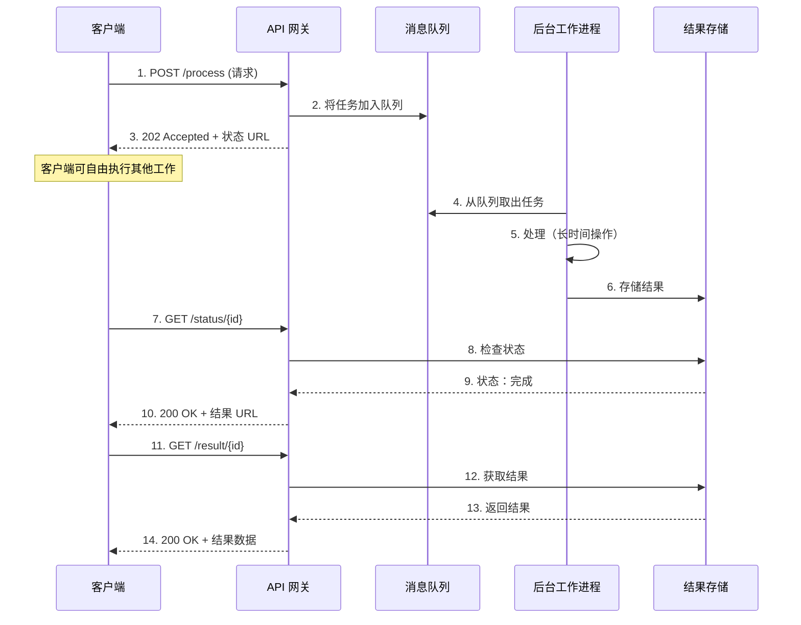

现代应用程序经常需要执行需要大量时间完成的操作——处理大型文件、生成复杂报表，或调用缓慢的外部 API。当这些操作阻塞请求线程时，会造成糟糕的用户体验，并可能耗尽服务器资源。异步请求-回复模式通过将请求与响应解耦来解决这个问题，让应用程序在后台处理工作时保持响应。

## 问题：当操作耗时过长

传统的同步请求-响应模型适用于快速操作。客户端发送请求，等待处理，然后接收响应——全部在几秒内完成。然而，当操作耗时较长时，这个模型就会失效：

- **超时失败**：HTTP 连接在处理完成前超时
- **资源耗尽**：线程保持阻塞状态，限制并发请求数量
- **糟糕的用户体验**：用户盯着加载动画或冻结的界面
- **连锁故障**：缓慢的操作可能导致整个系统崩溃

!!!warning "⚠️ 同步陷阱"
    单一耗时 30 秒的缓慢操作可能在整个期间占用一个线程。在线程数量有限的情况下，仅仅几个缓慢的请求就能让整个应用程序对新请求无响应。

考虑这些常见场景：

- **视频处理**：将上传的视频转换为多种格式
- **报表生成**：从大型数据集创建复杂的分析报表
- **批处理操作**：在单一请求中处理数千条记录
- **外部 API 调用**：等待缓慢的第三方服务
- **机器学习**：在大型模型上执行推理

## 解决方案：将请求与响应解耦

异步请求-回复模式将请求提交与结果获取分离：

1. **客户端提交请求**并立即收到确认消息及状态端点
2. **服务器在后台异步处理**
3. **客户端轮询状态端点**或在完成时接收回调
4. **客户端在处理完成时获取结果**



## 运作方式：模式实战

让我们逐步了解如何为视频转码服务实现此模式：

### 步骤 1：提交请求

客户端启动处理并立即收到确认：

```javascript
// 客户端提交视频进行处理
const response = await fetch('/api/videos/transcode', {
  method: 'POST',
  body: JSON.stringify({
    videoUrl: 'https://neo01.com/video.mp4',
    formats: ['720p', '1080p', '4k']
  })
});

// 服务器立即响应 202 Accepted
// {
//   "jobId": "job-12345",
//   "status": "pending",
//   "statusUrl": "/api/videos/status/job-12345"
// }

const { jobId, statusUrl } = await response.json();
```

### 步骤 2：异步处理

服务器将工作加入队列并在后台处理：

```javascript
// API 端点处理器
app.post('/api/videos/transcode', async (req, res) => {
  const jobId = generateJobId();
  
  // 存储作业元数据
  await jobStore.create({
    id: jobId,
    status: 'pending',
    request: req.body,
    createdAt: Date.now()
  });
  
  // 加入队列进行后台处理
  await messageQueue.send({
    jobId,
    videoUrl: req.body.videoUrl,
    formats: req.body.formats
  });
  
  // 立即响应
  res.status(202).json({
    jobId,
    status: 'pending',
    statusUrl: `/api/videos/status/${jobId}`
  });
});

// 后台工作进程
messageQueue.subscribe(async (message) => {
  await jobStore.update(message.jobId, { status: 'processing' });
  
  try {
    const results = await transcodeVideo(
      message.videoUrl,
      message.formats
    );
    
    await jobStore.update(message.jobId, {
      status: 'completed',
      results,
      completedAt: Date.now()
    });
  } catch (error) {
    await jobStore.update(message.jobId, {
      status: 'failed',
      error: error.message
    });
  }
});
```

### 步骤 3：检查状态

客户端轮询状态端点以跟踪进度：

```javascript
// 客户端轮询完成状态
async function waitForCompletion(statusUrl) {
  while (true) {
    const response = await fetch(statusUrl);
    const status = await response.json();
    
    if (status.status === 'completed') {
      return status.results;
    }
    
    if (status.status === 'failed') {
      throw new Error(status.error);
    }
    
    // 再次轮询前等待
    await sleep(2000);
  }
}

// 状态端点
app.get('/api/videos/status/:jobId', async (req, res) => {
  const job = await jobStore.get(req.params.jobId);
  
  if (!job) {
    return res.status(404).json({ error: 'Job not found' });
  }
  
  res.json({
    jobId: job.id,
    status: job.status,
    results: job.results,
    createdAt: job.createdAt,
    completedAt: job.completedAt
  });
});
```

## 实现策略

### 策略 1：轮询

客户端定期检查状态端点：

**优点：**
- 实现简单
- 适用于任何 HTTP 客户端
- 不需要服务器端回调基础设施

**缺点：**
- 增加网络流量
- 延迟通知（轮询间隔）
- 当没有变化时浪费请求

```javascript
// 指数退避轮询
async function pollWithBackoff(statusUrl, maxAttempts = 30) {
  let delay = 1000; // 从 1 秒开始
  
  for (let i = 0; i < maxAttempts; i++) {
    const status = await checkStatus(statusUrl);
    
    if (status.status !== 'pending' && status.status !== 'processing') {
      return status;
    }
    
    await sleep(delay);
    delay = Math.min(delay * 1.5, 30000); // 最多 30 秒
  }
  
  throw new Error('Polling timeout');
}
```

### 策略 2：Webhooks

服务器在处理完成时回调客户端：

**优点：**
- 立即通知
- 不浪费轮询请求
- 有效利用资源

**缺点：**
- 需要可公开访问的回调 URL
- 更复杂的错误处理
- 安全性考量（验证、确认）

```javascript
// 客户端提供回调 URL
await fetch('/api/videos/transcode', {
  method: 'POST',
  body: JSON.stringify({
    videoUrl: 'https://neo01.com/video.mp4',
    formats: ['720p', '1080p'],
    callbackUrl: 'https://client.com/webhook/video-complete'
  })
});

// 服务器在完成时调用 webhook
async function notifyCompletion(job) {
  if (job.callbackUrl) {
    await fetch(job.callbackUrl, {
      method: 'POST',
      headers: {
        'X-Signature': generateSignature(job),
        'Content-Type': 'application/json'
      },
      body: JSON.stringify({
        jobId: job.id,
        status: job.status,
        results: job.results
      })
    });
  }
}
```

### 策略 3：WebSockets

维护持久连接以进行实时更新：

**优点：**
- 实时双向通信
- 对多次更新有效率
- 适合进度跟踪

**缺点：**
- 更复杂的基础设施
- 连接管理开销
- 不适用于所有环境

```javascript
// 客户端建立 WebSocket 连接
const ws = new WebSocket(`wss://api.neo01.com/jobs/${jobId}`);

ws.onmessage = (event) => {
  const update = JSON.parse(event.data);
  
  if (update.status === 'processing') {
    console.log(`进度：${update.progress}%`);
  } else if (update.status === 'completed') {
    console.log('作业完成：', update.results);
    ws.close();
  }
};
```

## 关键实现考量

### 1. 状态端点设计

设计清晰、信息丰富的状态响应：

```javascript
// 设计良好的状态响应
{
  "jobId": "job-12345",
  "status": "processing",
  "progress": 65,
  "message": "正在转码为 1080p 格式",
  "createdAt": "2020-04-15T10:30:00Z",
  "estimatedCompletion": "2020-04-15T10:35:00Z",
  "_links": {
    "self": "/api/videos/status/job-12345",
    "cancel": "/api/videos/cancel/job-12345"
  }
}
```

### 2. HTTP 状态码

使用适当的状态码来传达状态：

- **202 Accepted**：请求已接受处理
- **200 OK**：状态检查成功
- **303 See Other**：处理完成，重定向至结果
- **404 Not Found**：作业 ID 不存在
- **410 Gone**：作业已过期或清理

### 3. 结果存储与过期

实现结果的生命周期管理：

```javascript
// 存储具有 TTL 的结果
await resultStore.set(jobId, result, {
  expiresIn: 24 * 60 * 60 // 24 小时
});

// 清理过期的作业
setInterval(async () => {
  const expiredJobs = await jobStore.findExpired();
  
  for (const job of expiredJobs) {
    await resultStore.delete(job.id);
    await jobStore.delete(job.id);
  }
}, 60 * 60 * 1000); // 每小时
```

### 4. 幂等性

确保请求可以安全地重试：

```javascript
// 使用幂等性密钥
app.post('/api/videos/transcode', async (req, res) => {
  const idempotencyKey = req.headers['idempotency-key'];
  
  // 检查是否已处理
  const existing = await jobStore.findByIdempotencyKey(idempotencyKey);
  if (existing) {
    return res.status(202).json({
      jobId: existing.id,
      status: existing.status,
      statusUrl: `/api/videos/status/${existing.id}`
    });
  }
  
  // 处理新请求
  const jobId = await createJob(req.body, idempotencyKey);
  // ...
});
```

## 何时使用此模式

### 理想场景

!!!success "✅ 完美使用案例"
    **长时间运行的操作**：需要超过几秒才能完成的任务
    
    **资源密集型处理**：消耗大量 CPU、内存或 I/O 的操作
    
    **外部依赖**：调用缓慢或不可靠的第三方服务
    
    **批处理**：对大型数据集或多个项目的操作

### 考虑替代方案的情况

!!!info "🤔 请三思如果..."
    **快速操作**：亚秒级操作不会从异步复杂性中受益
    
    **简单用例**：直接的 CRUD 操作同步运作良好
    
    **实时需求**：当绝对需要立即结果时

## 架构质量属性

### 可扩展性

此模式实现水平扩展：

- **工作进程扩展**：添加更多后台工作进程以处理增加的负载
- **队列缓冲**：消息队列吸收流量高峰
- **资源优化**：API 和处理层独立扩展

### 韧性

通过以下方式增强容错能力：

- **重试逻辑**：失败的作业可以自动重试
- **断路器**：防止连锁故障
- **优雅降级**：即使工作进程过载，API 仍保持响应

### 用户体验

改善响应性：

- **即时反馈**：用户获得即时确认
- **进度更新**：显示处理状态和预估完成时间
- **非阻塞**：用户可以在等待时继续其他活动

## 常见陷阱与解决方案

!!!warning "⚠️ 注意"
    **轮询风暴**：太多客户端过于频繁地轮询
    
    **解决方案**：实现指数退避和速率限制

!!!warning "⚠️ 注意"
    **丢失结果**：结果在客户端获取前过期
    
    **解决方案**：设置适当的 TTL 并在过期前通知客户端

!!!warning "⚠️ 注意"
    **孤立作业**：作业永远卡在处理状态
    
    **解决方案**：实现作业超时和死信队列

## 实际示例：文档处理服务

这是一个完整的文档处理服务示例：

```javascript
// API 层
class DocumentProcessingAPI {
  async submitDocument(file, options) {
    const jobId = uuidv4();
    
    // 上传文件至存储
    const fileUrl = await storage.upload(file);
    
    // 创建作业记录
    await db.jobs.create({
      id: jobId,
      status: 'pending',
      fileUrl,
      options,
      createdAt: new Date()
    });
    
    // 加入队列进行处理
    await queue.publish('document-processing', {
      jobId,
      fileUrl,
      options
    });
    
    return {
      jobId,
      statusUrl: `/api/documents/status/${jobId}`
    };
  }
  
  async getStatus(jobId) {
    const job = await db.jobs.findById(jobId);
    
    if (!job) {
      throw new NotFoundError('Job not found');
    }
    
    return {
      jobId: job.id,
      status: job.status,
      progress: job.progress,
      result: job.result,
      error: job.error
    };
  }
}

// 工作进程层
class DocumentProcessor {
  async processJob(message) {
    const { jobId, fileUrl, options } = message;
    
    try {
      await this.updateStatus(jobId, 'processing', 0);
      
      // 下载文档
      const document = await storage.download(fileUrl);
      await this.updateStatus(jobId, 'processing', 25);
      
      // 提取文本
      const text = await this.extractText(document);
      await this.updateStatus(jobId, 'processing', 50);
      
      // 分析内容
      const analysis = await this.analyzeContent(text, options);
      await this.updateStatus(jobId, 'processing', 75);
      
      // 生成报表
      const report = await this.generateReport(analysis);
      await this.updateStatus(jobId, 'processing', 90);
      
      // 存储结果
      const resultUrl = await storage.upload(report);
      await this.updateStatus(jobId, 'completed', 100, { resultUrl });
      
    } catch (error) {
      await this.updateStatus(jobId, 'failed', null, null, error.message);
      throw error;
    }
  }
  
  async updateStatus(jobId, status, progress, result = null, error = null) {
    await db.jobs.update(jobId, {
      status,
      progress,
      result,
      error,
      updatedAt: new Date()
    });
  }
}
```

## 结论

异步请求-回复模式对于构建响应式、可扩展的分布式系统至关重要。通过将长时间运行的操作与即时响应解耦，它实现了：

- **更好的用户体验**：即时反馈和非阻塞操作
- **改善的可扩展性**：API 和处理层独立扩展
- **增强的韧性**：优雅地处理故障和重试
- **资源效率**：最佳利用线程和连接

虽然它通过状态跟踪和结果管理引入了复杂性，但对于需要超过几秒的操作，其好处远远超过成本。当您需要执行耗时的工作而不阻塞客户端时，请考虑使用此模式。

## 相关模式

- **Claim-Check 模式**：补充异步处理以处理大型负载
- **基于队列的负载均衡**：使用消息队列平滑流量高峰
- **竞争消费者**：实现队列作业的并行处理
- **优先队列**：在其他作业之前处理高优先级作业

## 参考资料

- [Microsoft Azure 架构模式：异步请求-回复](https://learn.microsoft.com/en-us/azure/architecture/patterns/async-request-reply)
- [企业集成模式：请求-回复](https://www.enterpriseintegrationpatterns.com/patterns/messaging/RequestReply.html)
