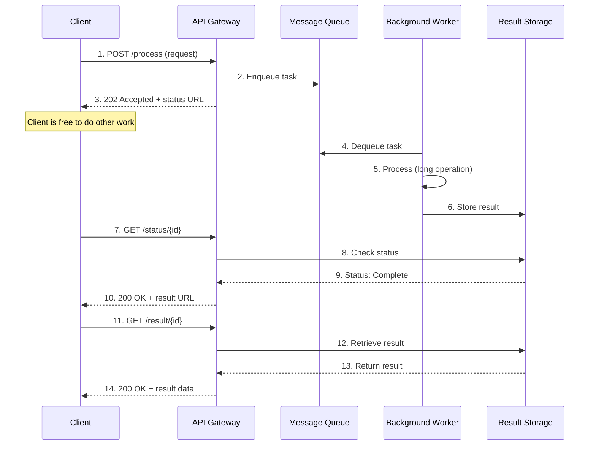

Modern applications often need to perform operations that take significant time to complete—processing large files, generating complex reports, or calling slow external APIs. When these operations block the request thread, they create poor user experiences and can exhaust server resources. The Asynchronous Request-Reply pattern solves this by decoupling the request from the response, allowing applications to remain responsive while work happens in the background.

## The Problem: When Operations Take Too Long

Traditional synchronous request-response models work well for fast operations. A client sends a request, waits for processing, and receives a response—all within seconds. However, this model breaks down when operations take longer:

- **Timeout Failures**: HTTP connections timeout before processing completes
- **Resource Exhaustion**: Threads remain blocked, limiting concurrent requests
- **Poor User Experience**: Users stare at loading spinners or frozen interfaces
- **Cascading Failures**: Slow operations can bring down entire systems

!!!warning "⚠️ The Synchronous Trap"
    A single slow operation that takes 30 seconds can tie up a thread for that entire duration. With limited threads available, just a few slow requests can make your entire application unresponsive to new requests.

Consider these common scenarios:

- **Video Processing**: Converting uploaded videos to multiple formats
- **Report Generation**: Creating complex analytics reports from large datasets
- **Batch Operations**: Processing thousands of records in a single request
- **External API Calls**: Waiting for slow third-party services
- **Machine Learning**: Running inference on large models

## The Solution: Decouple Request from Response

The Asynchronous Request-Reply pattern separates the request submission from result retrieval:

1. **Client submits request** and immediately receives an acknowledgment with a status endpoint
2. **Server processes asynchronously** in the background
3. **Client polls status endpoint** or receives a callback when complete
4. **Client retrieves results** when processing finishes



## How It Works: The Pattern in Action

Let's walk through implementing this pattern for a video transcoding service:

### Step 1: Submit the Request

The client initiates processing and receives immediate acknowledgment:

```javascript
// Client submits video for processing
const response = await fetch('/api/videos/transcode', {
  method: 'POST',
  body: JSON.stringify({
    videoUrl: 'https://neo01.com/video.mp4',
    formats: ['720p', '1080p', '4k']
  })
});

// Server responds immediately with 202 Accepted
// {
//   "jobId": "job-12345",
//   "status": "pending",
//   "statusUrl": "/api/videos/status/job-12345"
// }

const { jobId, statusUrl } = await response.json();
```

### Step 2: Process Asynchronously

The server queues the work and processes it in the background:

```javascript
// API endpoint handler
app.post('/api/videos/transcode', async (req, res) => {
  const jobId = generateJobId();
  
  // Store job metadata
  await jobStore.create({
    id: jobId,
    status: 'pending',
    request: req.body,
    createdAt: Date.now()
  });
  
  // Queue for background processing
  await messageQueue.send({
    jobId,
    videoUrl: req.body.videoUrl,
    formats: req.body.formats
  });
  
  // Respond immediately
  res.status(202).json({
    jobId,
    status: 'pending',
    statusUrl: `/api/videos/status/${jobId}`
  });
});

// Background worker
messageQueue.subscribe(async (message) => {
  await jobStore.update(message.jobId, { status: 'processing' });
  
  try {
    const results = await transcodeVideo(
      message.videoUrl,
      message.formats
    );
    
    await jobStore.update(message.jobId, {
      status: 'completed',
      results,
      completedAt: Date.now()
    });
  } catch (error) {
    await jobStore.update(message.jobId, {
      status: 'failed',
      error: error.message
    });
  }
});
```

### Step 3: Check Status

The client polls the status endpoint to track progress:

```javascript
// Client polls for completion
async function waitForCompletion(statusUrl) {
  while (true) {
    const response = await fetch(statusUrl);
    const status = await response.json();
    
    if (status.status === 'completed') {
      return status.results;
    }
    
    if (status.status === 'failed') {
      throw new Error(status.error);
    }
    
    // Wait before polling again
    await sleep(2000);
  }
}

// Status endpoint
app.get('/api/videos/status/:jobId', async (req, res) => {
  const job = await jobStore.get(req.params.jobId);
  
  if (!job) {
    return res.status(404).json({ error: 'Job not found' });
  }
  
  res.json({
    jobId: job.id,
    status: job.status,
    results: job.results,
    createdAt: job.createdAt,
    completedAt: job.completedAt
  });
});
```

## Implementation Strategies

### Strategy 1: Polling

The client periodically checks the status endpoint:

**Advantages:**
- Simple to implement
- Works with any HTTP client
- No server-side callback infrastructure needed

**Disadvantages:**
- Increased network traffic
- Delayed notification (polling interval)
- Wasted requests when nothing changes

```javascript
// Exponential backoff polling
async function pollWithBackoff(statusUrl, maxAttempts = 30) {
  let delay = 1000; // Start with 1 second
  
  for (let i = 0; i < maxAttempts; i++) {
    const status = await checkStatus(statusUrl);
    
    if (status.status !== 'pending' && status.status !== 'processing') {
      return status;
    }
    
    await sleep(delay);
    delay = Math.min(delay * 1.5, 30000); // Max 30 seconds
  }
  
  throw new Error('Polling timeout');
}
```

### Strategy 2: Webhooks

The server calls back to the client when processing completes:

**Advantages:**
- Immediate notification
- No wasted polling requests
- Efficient use of resources

**Disadvantages:**
- Requires publicly accessible callback URL
- More complex error handling
- Security considerations (authentication, validation)

```javascript
// Client provides callback URL
await fetch('/api/videos/transcode', {
  method: 'POST',
  body: JSON.stringify({
    videoUrl: 'https://neo01.com/video.mp4',
    formats: ['720p', '1080p'],
    callbackUrl: 'https://client.com/webhook/video-complete'
  })
});

// Server calls webhook when complete
async function notifyCompletion(job) {
  if (job.callbackUrl) {
    await fetch(job.callbackUrl, {
      method: 'POST',
      headers: {
        'X-Signature': generateSignature(job),
        'Content-Type': 'application/json'
      },
      body: JSON.stringify({
        jobId: job.id,
        status: job.status,
        results: job.results
      })
    });
  }
}
```

### Strategy 3: WebSockets

Maintain a persistent connection for real-time updates:

**Advantages:**
- Real-time bidirectional communication
- Efficient for multiple updates
- Great for progress tracking

**Disadvantages:**
- More complex infrastructure
- Connection management overhead
- Not suitable for all environments

```javascript
// Client establishes WebSocket connection
const ws = new WebSocket(`wss://api.neo01.com/jobs/${jobId}`);

ws.onmessage = (event) => {
  const update = JSON.parse(event.data);
  
  if (update.status === 'processing') {
    console.log(`Progress: ${update.progress}%`);
  } else if (update.status === 'completed') {
    console.log('Job completed:', update.results);
    ws.close();
  }
};
```

## Key Implementation Considerations

### 1. Status Endpoint Design

Design clear, informative status responses:

```javascript
// Well-designed status response
{
  "jobId": "job-12345",
  "status": "processing",
  "progress": 65,
  "message": "Transcoding to 1080p format",
  "createdAt": "2020-04-15T10:30:00Z",
  "estimatedCompletion": "2020-04-15T10:35:00Z",
  "_links": {
    "self": "/api/videos/status/job-12345",
    "cancel": "/api/videos/cancel/job-12345"
  }
}
```

### 2. HTTP Status Codes

Use appropriate status codes to communicate state:

- **202 Accepted**: Request accepted for processing
- **200 OK**: Status check successful
- **303 See Other**: Processing complete, redirect to result
- **404 Not Found**: Job ID doesn't exist
- **410 Gone**: Job expired or cleaned up

### 3. Result Storage and Expiration

Implement lifecycle management for results:

```javascript
// Store results with TTL
await resultStore.set(jobId, result, {
  expiresIn: 24 * 60 * 60 // 24 hours
});

// Clean up expired jobs
setInterval(async () => {
  const expiredJobs = await jobStore.findExpired();
  
  for (const job of expiredJobs) {
    await resultStore.delete(job.id);
    await jobStore.delete(job.id);
  }
}, 60 * 60 * 1000); // Every hour
```

### 4. Idempotency

Ensure requests can be safely retried:

```javascript
// Use idempotency keys
app.post('/api/videos/transcode', async (req, res) => {
  const idempotencyKey = req.headers['idempotency-key'];
  
  // Check if already processed
  const existing = await jobStore.findByIdempotencyKey(idempotencyKey);
  if (existing) {
    return res.status(202).json({
      jobId: existing.id,
      status: existing.status,
      statusUrl: `/api/videos/status/${existing.id}`
    });
  }
  
  // Process new request
  const jobId = await createJob(req.body, idempotencyKey);
  // ...
});
```

## When to Use This Pattern

### Ideal Scenarios

!!!success "✅ Perfect Use Cases"
    **Long-Running Operations**: Tasks that take more than a few seconds to complete
    
    **Resource-Intensive Processing**: Operations that consume significant CPU, memory, or I/O
    
    **External Dependencies**: Calls to slow or unreliable third-party services
    
    **Batch Processing**: Operations on large datasets or multiple items

### Consider Alternatives When

!!!info "🤔 Think Twice If..."
    **Fast Operations**: Sub-second operations don't benefit from async complexity
    
    **Simple Use Cases**: Straightforward CRUD operations work fine synchronously
    
    **Real-Time Requirements**: When immediate results are absolutely required

## Architecture Quality Attributes

### Scalability

The pattern enables horizontal scaling:

- **Worker Scaling**: Add more background workers to handle increased load
- **Queue Buffering**: Message queues absorb traffic spikes
- **Resource Optimization**: Separate API and processing tiers scale independently

### Resilience

Enhanced fault tolerance through:

- **Retry Logic**: Failed jobs can be automatically retried
- **Circuit Breaking**: Protect against cascading failures
- **Graceful Degradation**: API remains responsive even when workers are overloaded

### User Experience

Improved responsiveness:

- **Immediate Feedback**: Users get instant acknowledgment
- **Progress Updates**: Show processing status and estimated completion
- **Non-Blocking**: Users can continue other activities while waiting

## Common Pitfalls and Solutions

!!!warning "⚠️ Watch Out For"
    **Polling Storms**: Too many clients polling too frequently
    
    **Solution**: Implement exponential backoff and rate limiting

!!!warning "⚠️ Watch Out For"
    **Lost Results**: Results expire before client retrieves them
    
    **Solution**: Set appropriate TTLs and notify clients before expiration

!!!warning "⚠️ Watch Out For"
    **Orphaned Jobs**: Jobs stuck in processing state forever
    
    **Solution**: Implement job timeouts and dead letter queues

## Real-World Example: Document Processing Service

Here's a complete example of a document processing service:

```javascript
// API Layer
class DocumentProcessingAPI {
  async submitDocument(file, options) {
    const jobId = uuidv4();
    
    // Upload file to storage
    const fileUrl = await storage.upload(file);
    
    // Create job record
    await db.jobs.create({
      id: jobId,
      status: 'pending',
      fileUrl,
      options,
      createdAt: new Date()
    });
    
    // Queue for processing
    await queue.publish('document-processing', {
      jobId,
      fileUrl,
      options
    });
    
    return {
      jobId,
      statusUrl: `/api/documents/status/${jobId}`
    };
  }
  
  async getStatus(jobId) {
    const job = await db.jobs.findById(jobId);
    
    if (!job) {
      throw new NotFoundError('Job not found');
    }
    
    return {
      jobId: job.id,
      status: job.status,
      progress: job.progress,
      result: job.result,
      error: job.error
    };
  }
}

// Worker Layer
class DocumentProcessor {
  async processJob(message) {
    const { jobId, fileUrl, options } = message;
    
    try {
      await this.updateStatus(jobId, 'processing', 0);
      
      // Download document
      const document = await storage.download(fileUrl);
      await this.updateStatus(jobId, 'processing', 25);
      
      // Extract text
      const text = await this.extractText(document);
      await this.updateStatus(jobId, 'processing', 50);
      
      // Analyze content
      const analysis = await this.analyzeContent(text, options);
      await this.updateStatus(jobId, 'processing', 75);
      
      // Generate report
      const report = await this.generateReport(analysis);
      await this.updateStatus(jobId, 'processing', 90);
      
      // Store result
      const resultUrl = await storage.upload(report);
      await this.updateStatus(jobId, 'completed', 100, { resultUrl });
      
    } catch (error) {
      await this.updateStatus(jobId, 'failed', null, null, error.message);
      throw error;
    }
  }
  
  async updateStatus(jobId, status, progress, result = null, error = null) {
    await db.jobs.update(jobId, {
      status,
      progress,
      result,
      error,
      updatedAt: new Date()
    });
  }
}
```

## Conclusion

The Asynchronous Request-Reply pattern is essential for building responsive, scalable distributed systems. By decoupling long-running operations from immediate responses, it enables:

- **Better User Experience**: Immediate feedback and non-blocking operations
- **Improved Scalability**: Independent scaling of API and processing layers
- **Enhanced Resilience**: Graceful handling of failures and retries
- **Resource Efficiency**: Optimal use of threads and connections

While it introduces complexity through status tracking and result management, the benefits far outweigh the costs for operations that take more than a few seconds. Consider this pattern whenever you need to perform time-consuming work without blocking the client.

## Related Patterns

- **Claim-Check Pattern**: Complements async processing for handling large payloads
- **Queue-Based Load Leveling**: Smooths out traffic spikes with message queues
- **Competing Consumers**: Enables parallel processing of queued jobs
- **Priority Queue**: Processes high-priority jobs before others

## References

- [Microsoft Azure Architecture Patterns: Asynchronous Request-Reply](https://learn.microsoft.com/en-us/azure/architecture/patterns/async-request-reply)
- [Enterprise Integration Patterns: Request-Reply](https://www.enterpriseintegrationpatterns.com/patterns/messaging/RequestReply.html)
