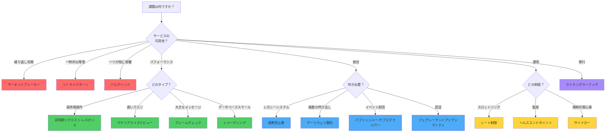
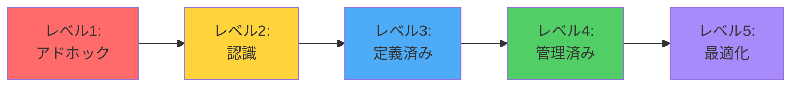

回復力があり、スケーラブルな分散システムを構築するには、特定の課題に適したアーキテクチャパターンを選択する必要があります。このガイドは、問題領域に基づいて最も適切なパターンを選択するのに役立つクイックリファレンスを提供し、各パターンの詳細な説明へのリンクを含んでいます。

## パターン選択クイックリファレンス

この表を使用して、特定の課題に対処するパターンを素早く特定できます：

| 課題 | 推奨パターン | 使用するタイミング |
|------|-------------|-------------------|
| サービス呼び出しがタイムアウトする | [非同期リクエスト-レスポンス](/ja/2020/04/Asynchronous-Request-Reply-Pattern/) | 操作がHTTPタイムアウト制限より長くかかる場合 |
| サービスが繰り返し失敗する | [サーキットブレーカー](/ja/2020/01/Circuit-Breaker-Pattern/) | 利用不可能なサービスからの連鎖的な障害を防ぐ |
| 一時的なネットワーク障害 | [リトライ](/ja/2019/03/Retry-Pattern/) | すぐに解決する一時的な障害を処理する |
| 一つのサービスが他に影響する | [バルクヘッド](/ja/2020/03/Bulkhead-Pattern/) | 障害を封じ込めるためにリソースを隔離する |
| APIスロットリングエラー | [レート制限](/ja/2019/01/Rate-Limiting-Pattern/) | スロットルされたサービスへのリクエスト率を制御する |
| レガシーシステム統合 | [腐敗防止層](/ja/2019/02/Anti-Corruption-Layer-Pattern/) | レガシーシステムからクリーンなアーキテクチャを保護する |
| 遅いクエリパフォーマンス | [マテリアライズドビュー](/ja/2019/05/Materialized-View-Pattern/) | より速い読み取りのために複雑なクエリを事前計算する |
| 大きなメッセージペイロード | [クレームチェック](/ja/2019/04/Claim-Check-Pattern/) | データを外部に保存してメッセージサイズを削減する |
| レガシーシステムの移行 | [ストラングラーフィグ](/ja/2019/06/Strangler-Fig-Pattern/) | レガシーを段階的にモダンなシステムに置き換える |
| 横断的関心事 | [サイドカー](/ja/2019/07/Sidecar-Pattern/) | アプリケーションを変更せずに機能を追加する |
| データベースのスケーラビリティ | [シャーディング](/ja/2019/08/Sharding-Pattern/) | 複数のデータベースにデータを分散する |
| 複数のAPI呼び出し | [ゲートウェイ集約](/ja/2019/09/Gateway-Aggregation-Pattern/) | 複数のバックエンド呼び出しを一つに結合する |
| イベント配信 | [パブリッシャー-サブスクライバー](/ja/2019/10/Publisher-Subscriber-Pattern/) | イベントプロデューサーとコンシューマーを切り離す |
| サービスヘルス監視 | [ヘルスエンドポイント監視](/ja/2019/11/Health-Endpoint-Monitoring-Pattern/) | サービス障害を積極的に検出する |
| サービス間の認証 | [フェデレーテッドアイデンティティ](/ja/2019/12/Federated-Identity-Pattern/) | 認証と認可を一元化する |

## パターンカテゴリ

アーキテクチャパターンは、解決する問題によってグループ化できます：

### 🛡️ 回復力パターン

システムが障害を適切に処理するのに役立つパターン：

**[サーキットブレーカー](/ja/2020/01/Circuit-Breaker-Pattern/)**：障害しているサービスへの呼び出しを一時的にブロックすることで、連鎖的な障害を防ぎます。電気回路ブレーカーのように、障害がしきい値を超えると「トリップ」し、システムが高速に失敗し、適切に回復できるようにします。

**[リトライ](/ja/2019/03/Retry-Pattern/)**：一時的な障害を処理するために失敗した操作を自動的に再試行します。指数バックオフなどの戦略を使用して、すでにストレスを受けているサービスを圧倒しないようにします。

**[バルクヘッド](/ja/2020/03/Bulkhead-Pattern/)**：リソースを別々のプールに隔離して、一つの障害コンポーネントがすべてのリソースを消費するのを防ぎます。浸水を封じ込める船の区画にちなんで名付けられました。

!!!tip "💡 回復力パターンの組み合わせ"
    これらのパターンは一緒に使用するのが最適です：リトライは一時的な障害を処理し、サーキットブレーカーは障害しているサービスを圧倒するのを防ぎ、バルクヘッドは障害の影響範囲を封じ込めます。

### ⚡ パフォーマンスパターン

システムのパフォーマンスとレスポンシブ性を最適化するパターン：

**[非同期リクエスト-レスポンス](/ja/2020/04/Asynchronous-Request-Reply-Pattern/)**：長時間実行される操作を即座のレスポンスから切り離し、タイムアウトを防ぎ、ユーザーエクスペリエンスを向上させます。

**[マテリアライズドビュー](/ja/2019/05/Materialized-View-Pattern/)**：読み取り時の高価な計算を避けるために、クエリ結果を事前計算して保存します。複雑な集約とレポートに最適です。

**[クレームチェック](/ja/2019/04/Claim-Check-Pattern/)**：大きなデータを外部に保存し、参照のみを渡すことで、メッセージペイロードサイズを削減します。メッセージングシステムのパフォーマンスを向上させ、コストを削減します。

**[シャーディング](/ja/2019/08/Sharding-Pattern/)**：スケーラビリティとパフォーマンスを向上させるために、複数のデータベースにデータを分散します。各シャードは総データのサブセットを処理します。

### 🔄 統合パターン

システム間の通信を促進するパターン：

**[腐敗防止層](/ja/2019/02/Anti-Corruption-Layer-Pattern/)**：異なるセマンティクスを持つシステム間の変換層を提供し、レガシーシステムの癖からクリーンなアーキテクチャを保護します。

**[ゲートウェイ集約](/ja/2019/09/Gateway-Aggregation-Pattern/)**：複数のバックエンドサービス呼び出しを単一のリクエストに結合し、クライアントの複雑さとネットワークオーバーヘッドを削減します。

**[パブリッシャー-サブスクライバー](/ja/2019/10/Publisher-Subscriber-Pattern/)**：パブリッシャーがサブスクライバーについて知る必要がない非同期イベント駆動通信を可能にします。

**[フェデレーテッドアイデンティティ](/ja/2019/12/Federated-Identity-Pattern/)**：認証を外部アイデンティティプロバイダーに委任し、複数のシステム間でシングルサインオンを可能にします。

### 🎯 運用パターン

システムの運用と管理を改善するパターン：

**[レート制限](/ja/2019/01/Rate-Limiting-Pattern/)**：スロットリングエラーを回避し、スループットを最適化するために、サービスに送信されるリクエストの率を制御します。

**[ヘルスエンドポイント監視](/ja/2019/11/Health-Endpoint-Monitoring-Pattern/)**：積極的な監視と自動回復のためにヘルスチェックエンドポイントを公開します。

**[サイドカー](/ja/2019/07/Sidecar-Pattern/)**：ログ記録、監視、設定などの横断的関心事を処理するために、アプリケーションと一緒にヘルパーコンポーネントをデプロイします。

### 🏗️ 移行パターン

システムのモダナイゼーションをサポートするパターン：

**[ストラングラーフィグ](/ja/2019/06/Strangler-Fig-Pattern/)**：機能を新しい実装に段階的に移行することで、レガシーシステムを徐々に置き換えます。宿主の周りに成長し、最終的に置き換えるイチジクの木にちなんで名付けられました。

## 決定フローチャート：適切なパターンの選択

このフローチャートを使用して、状況に最も適切なパターンに移動します：



## パターン比較マトリックス

主要な次元でパターンを比較します：


{
  "title": {
    "text": "パターンの複雑さと影響"
  },
  "tooltip": {
    "trigger": "item",
    "formatter": "{b}<br/>複雑さ: {c0}<br/>影響: {c1}"
  },
  "xAxis": {
    "type": "value",
    "name": "実装の複雑さ",
    "min": 0,
    "max": 10
  },
  "yAxis": {
    "type": "value",
    "name": "システムへの影響",
    "min": 0,
    "max": 10
  },
  "series": [{
    "type": "scatter",
    "symbolSize": 20,
    "data": [
      {"name": "リトライ", "value": [2, 7]},
      {"name": "サーキットブレーカー", "value": [4, 8]},
      {"name": "バルクヘッド", "value": [5, 8]},
      {"name": "レート制限", "value": [6, 7]},
      {"name": "腐敗防止層", "value": [7, 9]},
      {"name": "非同期リクエスト-レスポンス", "value": [6, 8]},
      {"name": "マテリアライズドビュー", "value": [5, 7]},
      {"name": "クレームチェック", "value": [3, 6]},
      {"name": "ストラングラーフィグ", "value": [8, 9]},
      {"name": "サイドカー", "value": [4, 6]},
      {"name": "シャーディング", "value": [9, 9]},
      {"name": "ゲートウェイ集約", "value": [5, 7]},
      {"name": "パブ-サブ", "value": [6, 8]},
      {"name": "ヘルスエンドポイント", "value": [2, 6]},
      {"name": "フェデレーテッドアイデンティティ", "value": [7, 8]}
    ],
    "label": {
      "show": true,
      "position": "top",
      "formatter": "{b}"
    }
  }]
}


## パターンの組み合わせ

多くの実世界のシステムは、包括的なソリューションのために複数のパターンを組み合わせます：

### 回復力のあるマイクロサービススタック

```
サーキットブレーカー + リトライ + バルクヘッド + ヘルスエンドポイント
```

- **サーキットブレーカー**：連鎖的な障害を防ぐ
- **リトライ**：一時的な障害を処理する
- **バルクヘッド**：リソースを隔離する
- **ヘルスエンドポイント**：監視を可能にする

### 高パフォーマンスAPIゲートウェイ

```
ゲートウェイ集約 + レート制限 + 非同期リクエスト-レスポンス
```

- **ゲートウェイ集約**：クライアント呼び出しを削減する
- **レート制限**：バックエンドを圧倒するのを防ぐ
- **非同期リクエスト-レスポンス**：長時間操作を処理する

### レガシーシステムのモダナイゼーション

```
ストラングラーフィグ + 腐敗防止層 + フェデレーテッドアイデンティティ
```

- **ストラングラーフィグ**：段階的な移行戦略
- **腐敗防止層**：レガシーから新しいコードを保護する
- **フェデレーテッドアイデンティティ**：統一された認証

## パターン選択基準

パターンを選択する際にこれらの要因を考慮してください：

### システム要件

!!!anote "📋 機能要件"
    - **可用性**：どれだけのダウンタイムが許容されますか？
    - **パフォーマンス**：レイテンシ要件は何ですか？
    - **スケーラビリティ**：どれだけの成長を予想していますか？
    - **一貫性**：どのような一貫性保証が必要ですか？

### 技術的制約

!!!anote "🔧 技術的要因"
    - **既存のインフラストラクチャ**：すでに配置されているシステムは何ですか？
    - **チームの専門知識**：チームはどのパターンを知っていますか？
    - **技術スタック**：どのフレームワークとライブラリが利用可能ですか？
    - **予算**：どのリソースを割り当てることができますか？

### 運用上の考慮事項

!!!anote "⚙️ 運用"
    - **監視**：パターンの動作を観察できますか？
    - **メンテナンス**：継続的なメンテナンスはどれくらい複雑ですか？
    - **テスト**：実装を効果的にテストできますか？
    - **ドキュメント**：パターンは十分に文書化されていますか？

## 一般的なアンチパターン

パターンを適用する際にこれらの一般的な間違いを避けてください：

!!!warning "⚠️ パターンの誤用"
    **過剰エンジニアリング**：シンプルな問題に複雑なパターンを適用しないでください。シンプルに始めて、必要に応じてパターンを追加してください。
    
    **パターンの積み重ね**：明確な正当化なしに多くのパターンを組み合わせないでください。各パターンは複雑さを追加します。
    
    **トレードオフの無視**：すべてのパターンにはコストがあります。パフォーマンスのオーバーヘッド、運用の複雑さ、メンテナンスの負担を考慮してください。
    
    **カーゴカルト実装**：なぜ機能するかを理解せずにパターンをコピーしないでください。特定のコンテキストにパターンを適応させてください。

Godオブジェクト、カーゴカルトプログラミング、コピー&ペーストプログラミングなどのコードレベルのアンチパターンに関する包括的なガイドについては、[ソフトウェア開発アンチパターン](/ja/2022/04/Software-Development-Anti-Patterns/)を参照してください。

## 始め方

パターンを実装する際にこのアプローチに従ってください：

### 1. 問題の特定

解決しようとしている課題を明確に定義します：
- どのような症状が発生していますか？
- 根本原因は何ですか？
- 成功基準は何ですか？

### 2. パターンの調査

このガイドを使用して候補パターンを特定します：
- クイックリファレンス表を確認する
- 決定フローチャートに従う
- 詳細なパターン記事を読む

### 3. オプションの評価

要件に対してパターンを比較します：
- 実装の複雑さ
- 運用のオーバーヘッド
- チームの専門知識
- 予算の制約

### 4. 小さく始める

パイロット実装から始めます：
- 重要でないコンポーネントを選択する
- パターンを実装する
- 結果を監視して測定する
- 学びに基づいて反復する

### 5. 段階的にスケールする

成功した実装を拡大します：
- 学んだ教訓を文書化する
- チームメンバーをトレーニングする
- 追加のコンポーネントに適用する
- 経験に基づいて改善する

## パターン成熟度モデル

組織のパターン採用成熟度を評価します：



**レベル1 - アドホック**：一貫したパターン使用なし、反応的な問題解決

**レベル2 - 認識**：チームはパターンが存在することを知っている、時折の使用

**レベル3 - 定義済み**：文書化されたパターンガイドライン、一貫した適用

**レベル4 - 管理済み**：メトリクス駆動のパターン選択、定期的なレビュー

**レベル5 - 最適化**：継続的な改善、パターンのイノベーション

## 完全なパターンインデックス

このシリーズでカバーされているパターンの完全なリストです：

1. **[レート制限パターン](/ja/2019/01/Rate-Limiting-Pattern/)** (1月) - スロットルされたサービスへのリクエスト率を制御
2. **[腐敗防止層パターン](/ja/2019/02/Anti-Corruption-Layer-Pattern/)** (2月) - レガシーシステムからアーキテクチャを保護
3. **[リトライパターン](/ja/2019/03/Retry-Pattern/)** (3月) - 一時的な障害を適切に処理
4. **[クレームチェックパターン](/ja/2019/04/Claim-Check-Pattern/)** (4月) - メッセージペイロードサイズを削減
5. **[マテリアライズドビューパターン](/ja/2019/05/Materialized-View-Pattern/)** (5月) - 複雑なクエリを事前計算
6. **[ストラングラーフィグパターン](/ja/2019/06/Strangler-Fig-Pattern/)** (6月) - レガシーシステムを段階的に移行
7. **[サイドカーパターン](/ja/2019/07/Sidecar-Pattern/)** (7月) - ヘルパーコンポーネントを介して機能を追加
8. **[シャーディングパターン](/ja/2019/08/Sharding-Pattern/)** (8月) - スケーラビリティのためにデータを分散
9. **[ゲートウェイ集約パターン](/ja/2019/09/Gateway-Aggregation-Pattern/)** (9月) - 複数のAPI呼び出しを結合
10. **[パブリッシャー-サブスクライバーパターン](/ja/2019/10/Publisher-Subscriber-Pattern/)** (10月) - イベント駆動通信
11. **[ヘルスエンドポイント監視パターン](/ja/2019/11/Health-Endpoint-Monitoring-Pattern/)** (11月) - 積極的なヘルスチェック
12. **[フェデレーテッドアイデンティティパターン](/ja/2019/12/Federated-Identity-Pattern/)** (12月) - 一元化された認証
13. **[サーキットブレーカーパターン](/ja/2020/01/Circuit-Breaker-Pattern/)** (1月) - 連鎖的な障害を防ぐ
14. **[バルクヘッドパターン](/ja/2020/03/Bulkhead-Pattern/)** (3月) - 障害を封じ込めるためにリソースを隔離
15. **[非同期リクエスト-レスポンスパターン](/ja/2020/04/Asynchronous-Request-Reply-Pattern/)** (4月) - 長時間実行される操作を処理

## 追加リソース

### 書籍

- **「Cloud Design Patterns」** by Microsoft - 包括的なパターンカタログ
- **「Release It!」** by Michael Nygard - 本番環境対応ソフトウェアパターン
- **「Building Microservices」** by Sam Newman - マイクロサービスアーキテクチャパターン
- **「Domain-Driven Design」** by Eric Evans - 戦略的設計パターン

### オンラインリソース

- [Microsoft Azure Architecture Patterns](https://learn.microsoft.com/en-us/azure/architecture/patterns/)
- [AWS Architecture Center](https://aws.amazon.com/architecture/)
- [Martin Fowler's Architecture Patterns](https://martinfowler.com/architecture/)

### 実践

!!!tip "💡 実践による学習"
    パターンを学ぶ最良の方法は実践です：
    - 各パターンを実装するサンプルアプリケーションを構築する
    - これらのパターンを使用するオープンソースプロジェクトに貢献する
    - チームとアーキテクチャレビューを実施する
    - ブログ投稿やプレゼンテーションを通じて知識を共有する

## まとめ

アーキテクチャパターンは、一般的な分散システムの課題を解決するための強力なツールです。このクイックリファレンスガイドは次のことに役立ちます：

- 問題に適したパターンを**素早く特定**する
- 複数の次元で**パターンを比較**する
- パターン間の**関係を理解**する
- パターン適用における**一般的な落とし穴を回避**する
- パターンカタログを通じて**学習の旅を計画**する

覚えておいてください：パターンはガイドラインであり、厳格なルールではありません。特定のコンテキストに適応させ、影響を測定し、結果に基づいて反復してください。リトライやヘルスエンドポイント監視などのシンプルなパターンから始めて、システムが進化するにつれて徐々により複雑なパターンを採用してください。
