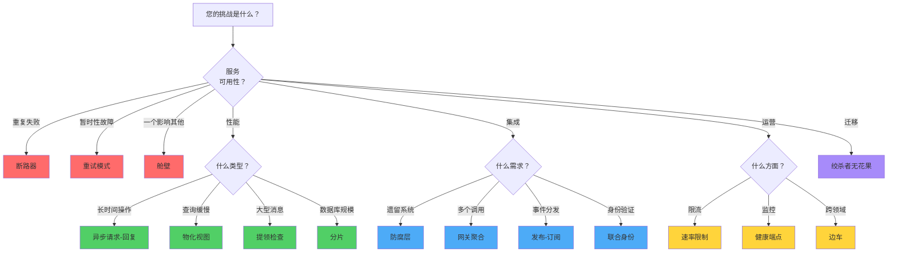
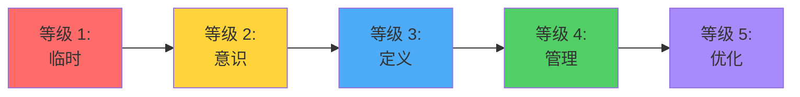

构建具有韧性、可扩展的分布式系统需要针对特定挑战选择正确的架构模式。本指南提供快速参考，帮助您根据问题领域选择最合适的模式，并附上每个模式的详细说明链接。

## 模式选择快速参考

使用此表格快速识别哪个模式能解决您的特定挑战：

| 您的挑战 | 建议模式 | 使用时机 |
|----------------|---------------------|-------------|
| 服务调用超时 | [异步请求-回复](/zh-CN/2020/04/Asynchronous-Request-Reply-Pattern/) | 操作时间超过 HTTP 超时限制 |
| 服务持续失败 | [断路器](/zh-CN/2020/01/Circuit-Breaker-Pattern/) | 防止不可用的服务造成连锁故障 |
| 暂时性网络故障 | [重试](/zh-CN/2019/03/Retry-Pattern/) | 处理快速恢复的暂时性故障 |
| 一个服务影响其他服务 | [舱壁](/zh-CN/2020/03/Bulkhead-Pattern/) | 隔离资源以控制故障范围 |
| API 限流错误 | [速率限制](/zh-CN/2019/01/Rate-Limiting-Pattern/) | 控制对限流服务的请求速率 |
| 遗留系统集成 | [防腐层](/zh-CN/2019/02/Anti-Corruption-Layer-Pattern/) | 保护干净架构免受遗留系统影响 |
| 查询性能缓慢 | [物化视图](/zh-CN/2019/05/Materialized-View-Pattern/) | 预先计算复杂查询以加快读取速度 |
| 大型消息负载 | [提领检查](/zh-CN/2019/04/Claim-Check-Pattern/) | 通过外部存储数据来减少消息大小 |
| 迁移遗留系统 | [绞杀者无花果](/zh-CN/2019/06/Strangler-Fig-Pattern/) | 逐步用现代系统替换遗留系统 |
| 跨领域关注点 | [边车](/zh-CN/2019/07/Sidecar-Pattern/) | 在不修改应用程序的情况下新增功能 |
| 数据库可扩展性 | [分片](/zh-CN/2019/08/Sharding-Pattern/) | 将数据分散到多个数据库 |
| 多个 API 调用 | [网关聚合](/zh-CN/2019/09/Gateway-Aggregation-Pattern/) | 将多个后端调用合并为一个 |
| 事件分发 | [发布-订阅](/zh-CN/2019/10/Publisher-Subscriber-Pattern/) | 解耦事件生产者与消费者 |
| 服务健康监控 | [健康端点监控](/zh-CN/2019/11/Health-Endpoint-Monitoring-Pattern/) | 主动检测服务故障 |
| 跨服务身份验证 | [联合身份](/zh-CN/2019/12/Federated-Identity-Pattern/) | 集中化身份验证和授权 |

## 模式分类

架构模式可以根据它们解决的问题进行分组：

### 🛡️ 韧性模式

帮助系统优雅处理故障的模式：

**[断路器](/zh-CN/2020/01/Circuit-Breaker-Pattern/)**：通过暂时阻止对失败服务的调用来防止连锁故障。就像电路断路器一样，当故障超过阈值时会"跳闸"，让系统快速失败并优雅恢复。

**[重试](/zh-CN/2019/03/Retry-Pattern/)**：自动重试失败的操作以处理暂时性故障。使用指数退避等策略来避免压垮已经承受压力的服务。

**[舱壁](/zh-CN/2020/03/Bulkhead-Pattern/)**：将资源隔离到独立的池中，防止一个失败的组件消耗所有资源。以船舱命名，用于控制进水。

!!!tip "💡 组合韧性模式"
    这些模式最好一起使用：重试处理暂时性故障，断路器防止压垮失败的服务，舱壁控制故障的爆炸半径。

### ⚡ 性能模式

优化系统性能和响应性的模式：

**[异步请求-回复](/zh-CN/2020/04/Asynchronous-Request-Reply-Pattern/)**：将长时间运行的操作与即时响应解耦，防止超时并改善用户体验。

**[物化视图](/zh-CN/2019/05/Materialized-View-Pattern/)**：预先计算并存储查询结果，避免在读取时进行昂贵的计算。适合复杂的聚合和报表。

**[提领检查](/zh-CN/2019/04/Claim-Check-Pattern/)**：通过将大型数据存储在外部并仅传递引用来减少消息负载大小。改善消息系统性能并降低成本。

**[分片](/zh-CN/2019/08/Sharding-Pattern/)**：将数据分散到多个数据库以提高可扩展性和性能。每个分片处理总数据的一个子集。

### 🔄 集成模式

促进系统间通信的模式：

**[防腐层](/zh-CN/2019/02/Anti-Corruption-Layer-Pattern/)**：在具有不同语义的系统之间提供转换层，保护您的干净架构免受遗留系统怪癖的影响。

**[网关聚合](/zh-CN/2019/09/Gateway-Aggregation-Pattern/)**：将多个后端服务调用合并为单一请求，减少客户端复杂性和网络开销。

**[发布-订阅](/zh-CN/2019/10/Publisher-Subscriber-Pattern/)**：启用异步事件驱动通信，发布者不需要知道订阅者。

**[联合身份](/zh-CN/2019/12/Federated-Identity-Pattern/)**：将身份验证委派给外部身份提供者，实现跨多个系统的单点登录。

### 🎯 运营模式

改善系统运营和管理的模式：

**[速率限制](/zh-CN/2019/01/Rate-Limiting-Pattern/)**：控制发送到服务的请求速率，避免限流错误并优化吞吐量。

**[健康端点监控](/zh-CN/2019/11/Health-Endpoint-Monitoring-Pattern/)**：公开健康检查端点以进行主动监控和自动恢复。

**[边车](/zh-CN/2019/07/Sidecar-Pattern/)**：在应用程序旁部署辅助组件，处理日志记录、监控和配置等跨领域关注点。

### 🏗️ 迁移模式

支持系统现代化的模式：

**[绞杀者无花果](/zh-CN/2019/06/Strangler-Fig-Pattern/)**：通过逐步将功能迁移到新实现来逐步替换遗留系统。以缠绕并最终替换宿主的无花果树命名。

## 决策流程图：选择正确的模式

使用此流程图导航到最适合您情况的模式：



## 模式比较矩阵

跨关键维度比较模式：


{
  "title": {
    "text": "模式复杂度 vs 影响"
  },
  "tooltip": {
    "trigger": "item",
    "formatter": "{b}<br/>复杂度: {c0}<br/>影响: {c1}"
  },
  "xAxis": {
    "type": "value",
    "name": "实现复杂度",
    "min": 0,
    "max": 10
  },
  "yAxis": {
    "type": "value",
    "name": "系统影响",
    "min": 0,
    "max": 10
  },
  "series": [{
    "type": "scatter",
    "symbolSize": 20,
    "data": [
      {"name": "重试", "value": [2, 7]},
      {"name": "断路器", "value": [4, 8]},
      {"name": "舱壁", "value": [5, 8]},
      {"name": "速率限制", "value": [6, 7]},
      {"name": "防腐层", "value": [7, 9]},
      {"name": "异步请求-回复", "value": [6, 8]},
      {"name": "物化视图", "value": [5, 7]},
      {"name": "提领检查", "value": [3, 6]},
      {"name": "绞杀者无花果", "value": [8, 9]},
      {"name": "边车", "value": [4, 6]},
      {"name": "分片", "value": [9, 9]},
      {"name": "网关聚合", "value": [5, 7]},
      {"name": "发布-订阅", "value": [6, 8]},
      {"name": "健康端点", "value": [2, 6]},
      {"name": "联合身份", "value": [7, 8]}
    ],
    "label": {
      "show": true,
      "position": "top",
      "formatter": "{b}"
    }
  }]
}


## 模式组合

许多实际系统结合多个模式以提供全面的解决方案：

### 韧性微服务堆栈

```
断路器 + 重试 + 舱壁 + 健康端点
```

- **断路器**：防止连锁故障
- **重试**：处理暂时性故障
- **舱壁**：隔离资源
- **健康端点**：启用监控

### 高性能 API 网关

```
网关聚合 + 速率限制 + 异步请求-回复
```

- **网关聚合**：减少客户端调用
- **速率限制**：防止压垮后端
- **异步请求-回复**：处理长时间操作

### 遗留系统现代化

```
绞杀者无花果 + 防腐层 + 联合身份
```

- **绞杀者无花果**：渐进式迁移策略
- **防腐层**：保护新代码免受遗留系统影响
- **联合身份**：统一身份验证

## 模式选择标准

选择模式时考虑这些因素：

### 系统需求

!!!anote "📋 功能需求"
    - **可用性**：可接受多少停机时间？
    - **性能**：您的延迟需求是什么？
    - **可扩展性**：您预期多少增长？
    - **一致性**：您需要什么一致性保证？

### 技术限制

!!!anote "🔧 技术因素"
    - **现有基础设施**：已经有哪些系统？
    - **团队专业知识**：您的团队了解哪些模式？
    - **技术栈**：有哪些框架和库可用？
    - **预算**：您可以分配哪些资源？

### 运营考量

!!!anote "⚙️ 运营"
    - **监控**：您能观察模式的行为吗？
    - **维护**：持续维护有多复杂？
    - **测试**：您能有效测试实现吗？
    - **文档**：模式是否有良好的文档？

## 常见反模式

应用模式时避免这些常见错误：

!!!warning "⚠️ 模式误用"
    **过度工程**：不要将复杂的模式应用于简单的问题。从简单开始，根据需要添加模式。
    
    **模式堆叠**：避免在没有明确理由的情况下组合太多模式。每个模式都会增加复杂性。
    
    **忽略权衡**：每个模式都有成本。考虑性能开销、运营复杂性和维护负担。
    
    **货物崇拜实现**：不要在不理解模式为何有效的情况下复制模式。根据您的特定情境调整模式。

有关代码级反模式(如上帝对象、货物崇拜编程和复制粘贴编程)的全面指南,请参阅[软件开发反模式](/zh-CN/2022/04/Software-Development-Anti-Patterns/)。

## 入门指南

实现模式时遵循此方法：

### 1. 识别问题

清楚定义您试图解决的挑战：
- 您遇到什么症状？
- 根本原因是什么？
- 您的成功标准是什么？

### 2. 研究模式

使用本指南识别候选模式：
- 查看快速参考表
- 遵循决策流程图
- 阅读详细的模式文章

### 3. 评估选项

根据您的需求比较模式：
- 实现复杂度
- 运营开销
- 团队专业知识
- 预算限制

### 4. 从小处开始

从试点实现开始：
- 选择非关键组件
- 实现模式
- 监控和测量结果
- 根据学习进行迭代

### 5. 逐步扩展

扩展成功的实现：
- 记录经验教训
- 培训团队成员
- 应用于其他组件
- 根据经验改进

## 模式成熟度模型

评估您组织的模式采用成熟度：



**等级 1 - 临时**：没有一致的模式使用，被动解决问题

**等级 2 - 意识**：团队知道模式存在，偶尔使用

**等级 3 - 定义**：有文档化的模式指南，一致应用

**等级 4 - 管理**：指标驱动的模式选择，定期审查

**等级 5 - 优化**：持续改进，模式创新

## 完整模式索引

以下是本系列涵盖的完整模式列表：

1. **[速率限制模式](/zh-CN/2019/01/Rate-Limiting-Pattern/)**（一月）- 控制对限流服务的请求速率
2. **[防腐层模式](/zh-CN/2019/02/Anti-Corruption-Layer-Pattern/)**（二月）- 保护架构免受遗留系统影响
3. **[重试模式](/zh-CN/2019/03/Retry-Pattern/)**（三月）- 优雅处理暂时性故障
4. **[提领检查模式](/zh-CN/2019/04/Claim-Check-Pattern/)**（四月）- 减少消息负载大小
5. **[物化视图模式](/zh-CN/2019/05/Materialized-View-Pattern/)**（五月）- 预先计算复杂查询
6. **[绞杀者无花果模式](/zh-CN/2019/06/Strangler-Fig-Pattern/)**（六月）- 逐步迁移遗留系统
7. **[边车模式](/zh-CN/2019/07/Sidecar-Pattern/)**（七月）- 通过辅助组件新增功能
8. **[分片模式](/zh-CN/2019/08/Sharding-Pattern/)**（八月）- 分散数据以提高可扩展性
9. **[网关聚合模式](/zh-CN/2019/09/Gateway-Aggregation-Pattern/)**（九月）- 合并多个 API 调用
10. **[发布-订阅模式](/zh-CN/2019/10/Publisher-Subscriber-Pattern/)**（十月）- 事件驱动通信
11. **[健康端点监控模式](/zh-CN/2019/11/Health-Endpoint-Monitoring-Pattern/)**（十一月）- 主动健康检查
12. **[联合身份模式](/zh-CN/2019/12/Federated-Identity-Pattern/)**（十二月）- 集中化身份验证
13. **[断路器模式](/zh-CN/2020/01/Circuit-Breaker-Pattern/)**（一月）- 防止连锁故障
14. **[舱壁模式](/zh-CN/2020/03/Bulkhead-Pattern/)**（三月）- 隔离资源以控制故障
15. **[异步请求-回复模式](/zh-CN/2020/04/Asynchronous-Request-Reply-Pattern/)**（四月）- 处理长时间运行的操作

## 其他资源

### 书籍

- **"Cloud Design Patterns"** by Microsoft - 全面的模式目录
- **"Release It!"** by Michael Nygard - 生产就绪软件模式
- **"Building Microservices"** by Sam Newman - 微服务架构模式
- **"Domain-Driven Design"** by Eric Evans - 战略设计模式

### 在线资源

- [Microsoft Azure 架构模式](https://learn.microsoft.com/en-us/azure/architecture/patterns/)
- [AWS 架构中心](https://aws.amazon.com/architecture/)
- [Martin Fowler 的架构模式](https://martinfowler.com/architecture/)

### 实践

!!!tip "💡 从实践中学习"
    学习模式的最佳方式是通过实践练习：
    - 构建实现每个模式的示例应用程序
    - 为使用这些模式的开源项目做出贡献
    - 与您的团队进行架构审查
    - 通过博客文章和演示分享知识

## 结论

架构模式是解决常见分布式系统挑战的强大工具。本快速参考指南帮助您：

- **快速识别**适合您问题的正确模式
- **比较模式**跨多个维度
- **理解关系**模式之间的关系
- **避免常见陷阱**在模式应用中
- **规划您的学习**通过模式目录的旅程

记住：模式是指南，不是僵化的规则。根据您的特定情境调整它们，测量它们的影响，并根据结果进行迭代。从简单的模式如重试和健康端点监控开始，然后随着系统的发展逐步采用更复杂的模式。
