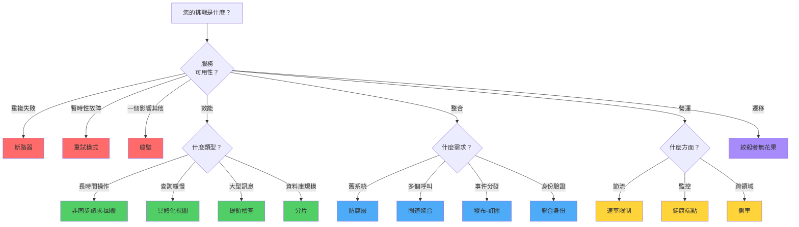
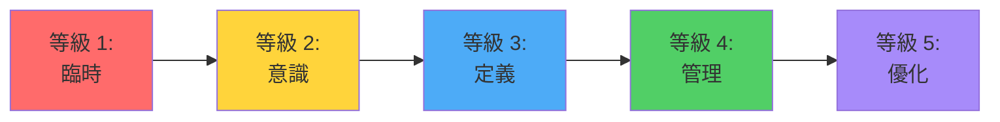

建構具有韌性、可擴展的分散式系統需要針對特定挑戰選擇正確的架構模式。本指南提供快速參考，幫助您根據問題領域選擇最合適的模式，並附上每個模式的詳細說明連結。

## 模式選擇快速參考

使用此表格快速識別哪個模式能解決您的特定挑戰：

| 您的挑戰 | 建議模式 | 使用時機 |
|----------------|---------------------|-------------|
| 服務呼叫逾時 | [非同步請求-回覆](/zh-TW/2020/04/Asynchronous-Request-Reply-Pattern/) | 操作時間超過 HTTP 逾時限制 |
| 服務持續失敗 | [斷路器](/zh-TW/2020/01/Circuit-Breaker-Pattern/) | 防止無法使用的服務造成連鎖故障 |
| 暫時性網路故障 | [重試](/zh-TW/2019/03/Retry-Pattern/) | 處理快速恢復的暫時性故障 |
| 一個服務影響其他服務 | [艙壁](/zh-TW/2020/03/Bulkhead-Pattern/) | 隔離資源以控制故障範圍 |
| API 節流錯誤 | [速率限制](/zh-TW/2019/01/Rate-Limiting-Pattern/) | 控制對節流服務的請求速率 |
| 舊系統整合 | [防腐層](/zh-TW/2019/02/Anti-Corruption-Layer-Pattern/) | 保護乾淨架構免受舊系統影響 |
| 查詢效能緩慢 | [具體化視圖](/zh-TW/2019/05/Materialized-View-Pattern/) | 預先計算複雜查詢以加快讀取速度 |
| 大型訊息負載 | [提領檢查](/zh-TW/2019/04/Claim-Check-Pattern/) | 透過外部儲存資料來減少訊息大小 |
| 遷移舊系統 | [絞殺者無花果](/zh-TW/2019/06/Strangler-Fig-Pattern/) | 逐步用現代系統取代舊系統 |
| 跨領域關注點 | [側車](/zh-TW/2019/07/Sidecar-Pattern/) | 在不修改應用程式的情況下新增功能 |
| 資料庫可擴展性 | [分片](/zh-TW/2019/08/Sharding-Pattern/) | 將資料分散到多個資料庫 |
| 多個 API 呼叫 | [閘道聚合](/zh-TW/2019/09/Gateway-Aggregation-Pattern/) | 將多個後端呼叫合併為一個 |
| 事件分發 | [發布-訂閱](/zh-TW/2019/10/Publisher-Subscriber-Pattern/) | 解耦事件生產者與消費者 |
| 服務健康監控 | [健康端點監控](/zh-TW/2019/11/Health-Endpoint-Monitoring-Pattern/) | 主動偵測服務故障 |
| 跨服務身份驗證 | [聯合身份](/zh-TW/2019/12/Federated-Identity-Pattern/) | 集中化身份驗證和授權 |

## 模式分類

架構模式可以根據它們解決的問題進行分組：

### 🛡️ 韌性模式

幫助系統優雅處理故障的模式：

**[斷路器](/zh-TW/2020/01/Circuit-Breaker-Pattern/)**：透過暫時阻止對失敗服務的呼叫來防止連鎖故障。就像電路斷路器一樣，當故障超過閾值時會「跳閘」，讓系統快速失敗並優雅恢復。

**[重試](/zh-TW/2019/03/Retry-Pattern/)**：自動重試失敗的操作以處理暫時性故障。使用指數退避等策略來避免壓垮已經承受壓力的服務。

**[艙壁](/zh-TW/2020/03/Bulkhead-Pattern/)**：將資源隔離到獨立的池中，防止一個失敗的元件消耗所有資源。以船艙命名，用於控制進水。

!!!tip "💡 組合韌性模式"
    這些模式最好一起使用：重試處理暫時性故障，斷路器防止壓垮失敗的服務，艙壁控制故障的爆炸半徑。

### ⚡ 效能模式

優化系統效能和回應性的模式：

**[非同步請求-回覆](/zh-TW/2020/04/Asynchronous-Request-Reply-Pattern/)**：將長時間執行的操作與即時回應解耦，防止逾時並改善使用者體驗。

**[具體化視圖](/zh-TW/2019/05/Materialized-View-Pattern/)**：預先計算並儲存查詢結果，避免在讀取時進行昂貴的計算。適合複雜的聚合和報表。

**[提領檢查](/zh-TW/2019/04/Claim-Check-Pattern/)**：透過將大型資料儲存在外部並僅傳遞參考來減少訊息負載大小。改善訊息系統效能並降低成本。

**[分片](/zh-TW/2019/08/Sharding-Pattern/)**：將資料分散到多個資料庫以提高可擴展性和效能。每個分片處理總資料的一個子集。

### 🔄 整合模式

促進系統間通訊的模式：

**[防腐層](/zh-TW/2019/02/Anti-Corruption-Layer-Pattern/)**：在具有不同語義的系統之間提供轉換層，保護您的乾淨架構免受舊系統怪癖的影響。

**[閘道聚合](/zh-TW/2019/09/Gateway-Aggregation-Pattern/)**：將多個後端服務呼叫合併為單一請求，減少客戶端複雜性和網路開銷。

**[發布-訂閱](/zh-TW/2019/10/Publisher-Subscriber-Pattern/)**：啟用非同步事件驅動通訊，發布者不需要知道訂閱者。

**[聯合身份](/zh-TW/2019/12/Federated-Identity-Pattern/)**：將身份驗證委派給外部身份提供者，實現跨多個系統的單一登入。

### 🎯 營運模式

改善系統營運和管理的模式：

**[速率限制](/zh-TW/2019/01/Rate-Limiting-Pattern/)**：控制發送到服務的請求速率，避免節流錯誤並優化吞吐量。

**[健康端點監控](/zh-TW/2019/11/Health-Endpoint-Monitoring-Pattern/)**：公開健康檢查端點以進行主動監控和自動恢復。

**[側車](/zh-TW/2019/07/Sidecar-Pattern/)**：在應用程式旁部署輔助元件，處理日誌記錄、監控和配置等跨領域關注點。

### 🏗️ 遷移模式

支援系統現代化的模式：

**[絞殺者無花果](/zh-TW/2019/06/Strangler-Fig-Pattern/)**：透過逐步將功能遷移到新實作來逐步取代舊系統。以纏繞並最終取代宿主的無花果樹命名。

## 決策流程圖：選擇正確的模式

使用此流程圖導航到最適合您情況的模式：



## 模式比較矩陣

跨關鍵維度比較模式：


{
  "title": {
    "text": "模式複雜度 vs 影響"
  },
  "tooltip": {
    "trigger": "item",
    "formatter": "{b}<br/>複雜度: {c0}<br/>影響: {c1}"
  },
  "xAxis": {
    "type": "value",
    "name": "實作複雜度",
    "min": 0,
    "max": 10
  },
  "yAxis": {
    "type": "value",
    "name": "系統影響",
    "min": 0,
    "max": 10
  },
  "series": [{
    "type": "scatter",
    "symbolSize": 20,
    "data": [
      {"name": "重試", "value": [2, 7]},
      {"name": "斷路器", "value": [4, 8]},
      {"name": "艙壁", "value": [5, 8]},
      {"name": "速率限制", "value": [6, 7]},
      {"name": "防腐層", "value": [7, 9]},
      {"name": "非同步請求-回覆", "value": [6, 8]},
      {"name": "具體化視圖", "value": [5, 7]},
      {"name": "提領檢查", "value": [3, 6]},
      {"name": "絞殺者無花果", "value": [8, 9]},
      {"name": "側車", "value": [4, 6]},
      {"name": "分片", "value": [9, 9]},
      {"name": "閘道聚合", "value": [5, 7]},
      {"name": "發布-訂閱", "value": [6, 8]},
      {"name": "健康端點", "value": [2, 6]},
      {"name": "聯合身份", "value": [7, 8]}
    ],
    "label": {
      "show": true,
      "position": "top",
      "formatter": "{b}"
    }
  }]
}


## 模式組合

許多實際系統結合多個模式以提供全面的解決方案：

### 韌性微服務堆疊

```
斷路器 + 重試 + 艙壁 + 健康端點
```

- **斷路器**：防止連鎖故障
- **重試**：處理暫時性故障
- **艙壁**：隔離資源
- **健康端點**：啟用監控

### 高效能 API 閘道

```
閘道聚合 + 速率限制 + 非同步請求-回覆
```

- **閘道聚合**：減少客戶端呼叫
- **速率限制**：防止壓垮後端
- **非同步請求-回覆**：處理長時間操作

### 舊系統現代化

```
絞殺者無花果 + 防腐層 + 聯合身份
```

- **絞殺者無花果**：漸進式遷移策略
- **防腐層**：保護新程式碼免受舊系統影響
- **聯合身份**：統一身份驗證

## 模式選擇標準

選擇模式時考慮這些因素：

### 系統需求

!!!anote "📋 功能需求"
    - **可用性**：可接受多少停機時間？
    - **效能**：您的延遲需求是什麼？
    - **可擴展性**：您預期多少成長？
    - **一致性**：您需要什麼一致性保證？

### 技術限制

!!!anote "🔧 技術因素"
    - **現有基礎設施**：已經有哪些系統？
    - **團隊專業知識**：您的團隊了解哪些模式？
    - **技術堆疊**：有哪些框架和函式庫可用？
    - **預算**：您可以分配哪些資源？

### 營運考量

!!!anote "⚙️ 營運"
    - **監控**：您能觀察模式的行為嗎？
    - **維護**：持續維護有多複雜？
    - **測試**：您能有效測試實作嗎？
    - **文件**：模式是否有良好的文件？

## 常見反模式

應用模式時避免這些常見錯誤：

!!!warning "⚠️ 模式誤用"
    **過度工程**：不要將複雜的模式應用於簡單的問題。從簡單開始，根據需要添加模式。
    
    **模式堆疊**：避免在沒有明確理由的情況下組合太多模式。每個模式都會增加複雜性。
    
    **忽略權衡**：每個模式都有成本。考慮效能開銷、營運複雜性和維護負擔。
    
    **貨物崇拜實作**：不要在不理解模式為何有效的情況下複製模式。根據您的特定情境調整模式。

有關程式碼層級反模式(如上帝物件、貨物崇拜程式設計和複製貼上程式設計)的全面指南,請參閱[軟體開發反模式](/zh-TW/2022/04/Software-Development-Anti-Patterns/)。

## 入門指南

實作模式時遵循此方法：

### 1. 識別問題

清楚定義您試圖解決的挑戰：
- 您遇到什麼症狀？
- 根本原因是什麼？
- 您的成功標準是什麼？

### 2. 研究模式

使用本指南識別候選模式：
- 查看快速參考表
- 遵循決策流程圖
- 閱讀詳細的模式文章

### 3. 評估選項

根據您的需求比較模式：
- 實作複雜度
- 營運開銷
- 團隊專業知識
- 預算限制

### 4. 從小處開始

從試點實作開始：
- 選擇非關鍵元件
- 實作模式
- 監控和測量結果
- 根據學習進行迭代

### 5. 逐步擴展

擴展成功的實作：
- 記錄經驗教訓
- 培訓團隊成員
- 應用於其他元件
- 根據經驗改進

## 模式成熟度模型

評估您組織的模式採用成熟度：



**等級 1 - 臨時**：沒有一致的模式使用，被動解決問題

**等級 2 - 意識**：團隊知道模式存在，偶爾使用

**等級 3 - 定義**：有文件化的模式指南，一致應用

**等級 4 - 管理**：指標驅動的模式選擇，定期審查

**等級 5 - 優化**：持續改進，模式創新

## 完整模式索引

以下是本系列涵蓋的完整模式列表：

1. **[速率限制模式](/zh-TW/2019/01/Rate-Limiting-Pattern/)**（一月）- 控制對節流服務的請求速率
2. **[防腐層模式](/zh-TW/2019/02/Anti-Corruption-Layer-Pattern/)**（二月）- 保護架構免受舊系統影響
3. **[重試模式](/zh-TW/2019/03/Retry-Pattern/)**（三月）- 優雅處理暫時性故障
4. **[提領檢查模式](/zh-TW/2019/04/Claim-Check-Pattern/)**（四月）- 減少訊息負載大小
5. **[具體化視圖模式](/zh-TW/2019/05/Materialized-View-Pattern/)**（五月）- 預先計算複雜查詢
6. **[絞殺者無花果模式](/zh-TW/2019/06/Strangler-Fig-Pattern/)**（六月）- 逐步遷移舊系統
7. **[側車模式](/zh-TW/2019/07/Sidecar-Pattern/)**（七月）- 透過輔助元件新增功能
8. **[分片模式](/zh-TW/2019/08/Sharding-Pattern/)**（八月）- 分散資料以提高可擴展性
9. **[閘道聚合模式](/zh-TW/2019/09/Gateway-Aggregation-Pattern/)**（九月）- 合併多個 API 呼叫
10. **[發布-訂閱模式](/zh-TW/2019/10/Publisher-Subscriber-Pattern/)**（十月）- 事件驅動通訊
11. **[健康端點監控模式](/zh-TW/2019/11/Health-Endpoint-Monitoring-Pattern/)**（十一月）- 主動健康檢查
12. **[聯合身份模式](/zh-TW/2019/12/Federated-Identity-Pattern/)**（十二月）- 集中化身份驗證
13. **[斷路器模式](/zh-TW/2020/01/Circuit-Breaker-Pattern/)**（一月）- 防止連鎖故障
14. **[艙壁模式](/zh-TW/2020/03/Bulkhead-Pattern/)**（三月）- 隔離資源以控制故障
15. **[非同步請求-回覆模式](/zh-TW/2020/04/Asynchronous-Request-Reply-Pattern/)**（四月）- 處理長時間執行的操作

## 其他資源

### 書籍

- **"Cloud Design Patterns"** by Microsoft - 全面的模式目錄
- **"Release It!"** by Michael Nygard - 生產就緒軟體模式
- **"Building Microservices"** by Sam Newman - 微服務架構模式
- **"Domain-Driven Design"** by Eric Evans - 策略設計模式

### 線上資源

- [Microsoft Azure 架構模式](https://learn.microsoft.com/en-us/azure/architecture/patterns/)
- [AWS 架構中心](https://aws.amazon.com/architecture/)
- [Martin Fowler 的架構模式](https://martinfowler.com/architecture/)

### 實踐

!!!tip "💡 從實作中學習"
    學習模式的最佳方式是透過實作練習：
    - 建構實作每個模式的範例應用程式
    - 為使用這些模式的開源專案做出貢獻
    - 與您的團隊進行架構審查
    - 透過部落格文章和簡報分享知識

## 結論

架構模式是解決常見分散式系統挑戰的強大工具。本快速參考指南幫助您：

- **快速識別**適合您問題的正確模式
- **比較模式**跨多個維度
- **理解關係**模式之間的關係
- **避免常見陷阱**在模式應用中
- **規劃您的學習**透過模式目錄的旅程

記住：模式是指南，不是僵化的規則。根據您的特定情境調整它們，測量它們的影響，並根據結果進行迭代。從簡單的模式如重試和健康端點監控開始，然後隨著系統的發展逐步採用更複雜的模式。
