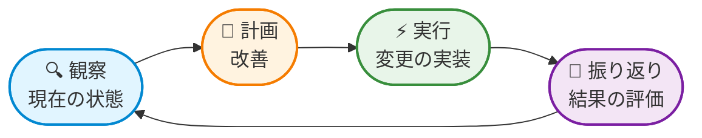
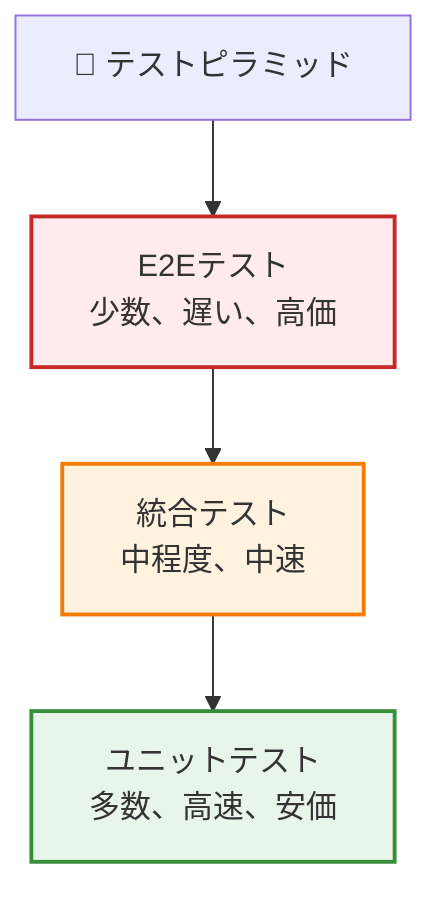

ソフトウェア開発には高コストな問題があります：バグを見つけるのが遅くなるほど、修正コストが高くなります。コードレビュー中に発見されたバグは数分で済みます。同じバグが本番環境で見つかると、デバッグ、緊急デプロイ、そして潜在的な収益損失や評判の損傷に数時間かかります。

この現実が、現代のDevOpsにおける最も重要な動きの一つを推進してきました：シフトレフトです。

「シフトレフト」という用語は、品質プラクティスをソフトウェア開発ライフサイクルの早期段階に移動することを指します - 文字通りタイムライン図の左側にシフトします。開発が完了した後にテストするのではなく、開発中にテストします。デプロイ前にセキュリティについて考えるのではなく、設計中に考えます。

これは単に早期にテストすることだけではありません。品質をいつ、どのように確保するか、そして誰がそれに責任を持つかを根本的に再考することです。

## 従来のアプローチ：ゲートとしての品質

何十年もの間、ソフトウェア開発は直線的な道をたどってきました：

開発者がコードを書きました。完了すると、QAチームに「壁越しに投げ」てテストしてもらいました。バグが見つかると、コードは開発者に戻されました。このサイクルは品質ゲートが通過するまで繰り返されました。

**このアプローチの問題点：**

**遅いフィードバック**：開発者がテスト結果を見るまでに数日または数週間かかる可能性があります。その頃には、コンテキストを忘れて他のプロジェクトに移っています。

**高価な修正**：サイクルの後半でコードを変更すると、ドキュメント、テスト、関連機能の再作業が必要になることがよくあります。

**サイロ化された責任**：開発者は機能に焦点を当て、QAは品質に焦点を当てました。どちらも完全な全体像を所有していませんでした。

**限定的なカバレッジ**：テストは本番環境の条件と一致しない人工的な環境で行われました。

**ボトルネック**：開発チームがテスト能力よりも速く成長するにつれて、QAチームがボトルネックになりました。

## シフトレフト革命

シフトレフトは、根本的な質問を「これをどうテストするか？」から「最初から品質をどう組み込むか？」に変えます。

品質プラクティスはすべてのフェーズに統合されます：

**要件フェーズ**：テストシナリオが機能と一緒に定義されます。受け入れ基準が自動テストになります。

**開発フェーズ**：開発者はコードの前または一緒にユニットテストを書きます。静的解析がコードを書いている間に問題を捕捉します。

**統合フェーズ**：自動テストがすべてのコミットで実行されます。セキュリティスキャンが継続的に行われます。

**デプロイフェーズ**：スモークテストがデプロイ直後に重要なパスを検証します。

**運用フェーズ**：監視が将来の開発に情報を提供するフィードバックを提供します。

!!!tip "💡 核心原則"
    シフトレフトはより多くの作業をすることではありません - 適切なタイミングで適切な作業をすることです。コードレビュー中にバグを捕捉するのは数分です。本番環境で捕捉するのは数時間または数日かかります。

## 観察-計画-実行-振り返りサイクル

効果的なシフトレフトプラクティスは、開発のあらゆるレベルで適用される継続的改善サイクルに従います：

**観察**：コード、テスト、品質メトリクスの現在の状態を理解します。何が機能していますか？何が失敗していますか？ボトルネックはどこですか？

**計画**：観察に基づいて、何を改善するかを決定します。ユニットテストを追加すべきですか？静的解析を実装すべきですか？テストカバレッジを改善すべきですか？

**実行**：計画された改善を実装します。テストを書き、ツールを設定し、プロセスを更新します。

**振り返り**：結果を評価します。テストカバレッジは改善しましたか？バグは早期に捕捉されていますか？チームはより速く動いていますか？

このサイクルは複数のレベルで継続的に繰り返されます：

**個々の開発者レベル**：コード品質を観察 → リファクタリングを計画 → 改善を実行 → 結果を振り返る

**チームレベル**：テストカバレッジを観察 → テスト戦略を計画 → 実装を実行 → 効果を振り返る

**組織レベル**：品質メトリクスを観察 → プロセス改善を計画 → 変更を実行 → 結果を振り返る

!!!example "🎬 実世界の例"
    開発チームは、統合バグがサイクルの後半で頻繁に見つかることを観察します。
    
    彼らはすべてのコミットで実行される統合テストを実装することを計画します。
    
    彼らはテストを書き、CI/CDパイプラインを設定することで実行します。
    
    彼らは2スプリント後に振り返ります：早期に捕捉された統合バグが60%増加し、後期段階のバグ修正が40%減少しました。
    
    サイクルは続きます：彼らは一部の統合テストが遅いことを観察し、それらを最適化することを計画し、改善を実行し、結果を振り返ります。

## 主要なシフトレフトプラクティス

シフトレフトを効果的にする具体的なプラクティスを探りましょう。

### 1. テスト駆動開発（TDD）

TDDは従来の開発プロセスを逆転させます：コードを書く前にテストを書きます。

**TDDサイクル：**

1. **失敗するテストを書く**：コードが何をすべきかを定義する
2. **最小限のコードを書く**：テストを通過させる
3. **リファクタリング**：テストをグリーンに保ちながらコード品質を改善する
4. **繰り返す**：次の機能に移る

**メリット：**

- **設計の明確さ**：最初にテストを書くことで、実装前にインターフェースと動作について考えることを強制される
- **完全なカバレッジ**：すべてのコード行に対応するテストがある
- **生きたドキュメント**：テストがコードの動作を文書化する
- **自信**：テストが回帰を捕捉するため、リファクタリングが安全

### 2. 継続的インテグレーション（CI）

CIはコード変更の統合とテストの実行プロセスを自動化します。すべてのコミットがビルドとテストサイクルをトリガーします。

**主要な原則：**

**頻繁にコミット**：小さく頻繁なコミットは、大きく頻度の低いコミットよりもデバッグが容易です。

**高速フィードバック**：テストは迅速に実行されるべきで、開発者が即座にフィードバックを得られるようにします。

**壊れたビルドを即座に修正**：壊れたビルドは最優先事項です - 修正されるまでさらにコードをコミットしないでください。

**すべてを自動化**：ビルド、テスト、デプロイは手動ステップを必要としないべきです。

### 3. 静的コード解析

静的解析はコードを実行せずに検査し、セキュリティ脆弱性、コードスメル、スタイル違反などの問題を捕捉します。

**静的解析が捕捉するもの：**

**セキュリティ問題：**
- SQLインジェクション脆弱性
- クロスサイトスクリプティング（XSS）リスク
- ハードコードされた認証情報
- 安全でない暗号化

**コード品質：**
- 未使用の変数
- デッドコード
- 複雑な関数
- 重複コード

**スタイル違反：**
- 一貫性のないフォーマット
- 命名規則違反
- ドキュメントの欠落

!!!warning "⚠️ 解析疲労を避ける"
    警告が多すぎると、開発者がすべての警告を無視する「アラート疲労」につながる可能性があります。ツールを次のように設定してください：
    
    - 最初に高重要度の問題に焦点を当てる
    - 徐々に厳格さを増す
    - チームのニーズに合わせてルールをカスタマイズする
    - 新しいルールを適用する前に既存の問題を修正する

### 4. セキュリティスキャン（シフトレフトセキュリティ）

セキュリティスキャンは、セキュリティテストをデプロイ前から開発時に移動します。

**セキュリティスキャンの種類：**

**静的アプリケーションセキュリティテスト（SAST）**：実行せずにソースコードの脆弱性を分析します。

**依存関係スキャン**：既知の脆弱性についてサードパーティライブラリをチェックします。

**シークレット検出**：誤ってコミットされた認証情報、APIキー、トークンを見つけます。

**コンテナスキャン**：セキュリティ問題についてDockerイメージを分析します。

### 5. Infrastructure as Code（IaC）

IaCはインフラストラクチャ設定をコードとして扱い、インフラストラクチャのテストとバージョン管理を可能にします。

**IaCのメリット：**

**バージョン管理**：インフラストラクチャの変更がコード変更のように追跡されます。

**テスト**：インフラストラクチャはデプロイ前にテストできます。

**一貫性**：同じ設定が開発、ステージング、本番環境で機能します。

**自動化**：インフラストラクチャのデプロイが自動化され、再現可能です。

### 6. 自動テストピラミッド

テストピラミッドは、異なるレベルでテスト作業をどのように分散するかをガイドします。

**ユニットテスト（ベース）：**
- 個々の関数やクラスをテスト
- 高速実行（ミリ秒）
- 高カバレッジ（テストの70-80%）
- すべてのコミットで実行

**統合テスト（中間）：**
- コンポーネント間の相互作用をテスト
- 中程度の実行時間（秒）
- 中程度のカバレッジ（テストの15-25%）
- すべてのコミットまたはマージで実行

**エンドツーエンドテスト（トップ）：**
- 完全なユーザーワークフローをテスト
- 遅い実行（分）
- 限定的なカバレッジ（テストの5-10%）
- デプロイ前に実行

!!!tip "💡 適切なバランス"
    **E2Eテストが多すぎる**：遅いフィードバック、脆弱なテスト、高いメンテナンス
    **ユニットテストが少なすぎる**：問題が遅く捕捉される、高価なデバッグ
    **ちょうど良い**：高速なユニットテストがほとんどの問題を捕捉し、統合テストが相互作用を検証し、E2Eテストが重要なパスを検証

## シフトレフトの実装：実践的なロードマップ

シフトレフトプラクティスを実装する準備はできましたか？ステップバイステップのアプローチを紹介します。

### フェーズ1：基盤（1-4週目）

**CI/CDパイプラインのセットアップ：**
- CIプラットフォームを選択（Jenkins、GitLab CI、GitHub Actions）
- すべてのコミットで自動ビルドを設定
- 基本的なテスト実行をセットアップ
- ビルドステータス通知を確立

**ユニットテストから始める：**
- 重要なビジネスロジックを特定
- 新しいコード用のユニットテストを書く
- 既存のコード用のテストを徐々に追加
- 最初は60%のカバレッジを目指す

**コードレビュープロセスの確立：**
- マージ前にピアレビューを要求
- レビューチェックリストを作成
- 可読性と保守性に焦点を当てる
- チーム全体で知識を共有

### フェーズ2：品質ゲート（5-8週目）

**静的解析の追加：**
- リンティングツールを設定
- エラーではなく警告から始める
- 徐々に厳格さを増す
- 最初に新しいコードの問題を修正

**セキュリティスキャンの実装：**
- 依存関係脆弱性スキャンを追加
- シークレット検出を設定
- 自動アラートをセットアップ
- 修復プロセスを作成

**テストカバレッジの拡大：**
- 重要なパス用の統合テストを追加
- ユニットテストカバレッジを70%に増やす
- テストデータ管理戦略を作成
- テスト標準を文書化

### フェーズ3：高度なプラクティス（9-12週目）

**TDDの採用：**
- TDDプラクティスについてチームをトレーニング
- 新機能から始める
- ペアプログラミングで知識を広める
- バグ率への影響を測定

**Infrastructure as Code：**
- インフラストラクチャをコードで定義
- すべての設定をバージョン管理
- インフラストラクチャの変更をテスト
- デプロイを自動化

**パフォーマンステスト：**
- CIにパフォーマンステストを追加
- パフォーマンスベースラインを確立
- パフォーマンストレンドを監視
- 回帰時にアラート

### フェーズ4：継続的改善（継続中）

**測定と最適化：**
- 主要メトリクスを追跡（テストカバレッジ、バグ率、ビルド時間）
- ボトルネックを特定
- 遅いテストを最適化
- データに基づいてプロセスを改善

**チーム文化：**
- 品質改善を祝う
- チーム間で学びを共有
- 実験を奨励
- 品質を全員の責任にする

!!!example "🎯 成功メトリクス"
    シフトレフトの効果を測定するためにこれらのメトリクスを追跡します：
    
    - **欠陥検出率**：本番環境前に捕捉されたバグの割合
    - **テストカバレッジ**：テストでカバーされるコードの割合
    - **ビルド時間**：コミットからテスト結果までの時間
    - **平均修正時間**：バグを解決する平均時間
    - **デプロイ頻度**：安全にデプロイできる頻度
    
    シフトレフトプラクティスは、時間の経過とともにこれらすべてを改善するはずです。

## 一般的な課題と解決策

シフトレフトの実装には課題がないわけではありません。一般的な障害に対処する方法を紹介します。

### 課題1：「テストを書く時間がない」

**現実**：テストを書かない時間はありません。本番環境の問題をデバッグするのは、テストを書くよりもはるかに時間がかかります。

**解決策：**
- 重要なパスから小さく始める
- 早期バグ検出から節約された時間を測定
- テストを「完了」の定義の一部にする
- テスト実行を自動化して時間を節約

### 課題2：「コードベースが大きすぎる」

**現実**：大規模なコードベースはシフトレフトプラクティスから最も恩恵を受けます。

**解決策：**
- 一度にすべてをテストしようとしない
- 新しいコードと重要なパスに焦点を当てる
- カバレッジを徐々に拡大
- コードカバレッジツールを使用してギャップを特定

### 課題3：「テストが遅すぎる」

**現実**：遅いテストは高速フィードバックの目的を損ないます。

**解決策：**
- 遅いテストを最適化
- すべてのコミットでユニットテスト、マージで統合テストを実行
- テスト実行を並列化
- テスト影響分析を使用して影響を受けるテストのみを実行

### 課題4：「開発者が変化に抵抗する」

**現実**：変化は困難です、特に新しいスキルが必要な場合。

**解決策：**
- トレーニングとサポートを提供
- ボランティアとアーリーアダプターから始める
- 成功事例を共有
- ツールを使いやすくする
- 改善を祝う

## 文化的シフト

シフトレフトは、ツールやプラクティスと同じくらい文化に関するものです。チームが品質について考える方法の根本的な変化が必要です。

**「QAの仕事」から「全員の仕事」へ：**

品質はもはや別のQAチームの責任ではありません。すべての開発者が自分のコードの品質に責任を持ちます。

**「テストフェーズ」から「継続的テスト」へ：**

テストは開発後に行われるフェーズではありません。すべてのステップに統合された継続的な活動です。

**「バグを見つける」から「バグを防ぐ」へ：**

目標はバグを効率的に見つけることではなく - そもそもバグが書かれるのを防ぐことです。

**「非難」から「学習」へ：**

バグが発生したとき、焦点は誰を非難するかではなく、学習とプロセスの改善にあります。

!!!success "✨ 成功したシフトレフト文化の兆候"
    - 開発者が求められなくてもテストを書く
    - コードレビューが機能だけでなく品質に焦点を当てる
    - チームが早期にバグを捕捉することを祝う
    - 壊れたビルドが即座に修正される
    - 品質メトリクスが時間とともに改善する
    - デプロイの自信が増す
    - 本番環境のインシデントが減少する

## まとめ：第一級市民としての品質

シフトレフトは、ソフトウェアの構築方法における根本的な変革を表しています。品質プラクティスを開発ライフサイクルの早期段階に移動することで、修正が最も安価なときに問題を捕捉し、リスクを削減し、配信を加速します。

観察-計画-実行-振り返りサイクルは、個々の開発者から組織全体まで、あらゆるレベルでの継続的改善のフレームワークを提供します。各反復がシステムをより良くし、品質改善の好循環を生み出します。

しかし、シフトレフトはツールやプロセスだけではありません。文化に関するものです。初日から品質を全員の責任にすることです。テストされるだけでなく、品質のために設計されたシステムを構築することです。

シフトレフトを受け入れる組織は、より速く出荷するだけでなく、より良く出荷します。本番環境の問題の消火に費やす時間が減り、新機能の構築に費やす時間が増えます。品質が組み込まれているため、デプロイに自信があります。

問題は、シフトレフトするかどうかではありません。どれだけ早く始められるかです。

!!!quote "💭 最後の考え"
    「品質は行為ではなく、習慣である。」 - アリストテレス
    
    シフトレフトは、品質を開発のすべてのステップに統合することで、品質を習慣にします。結果は、より良いソフトウェアだけでなく、より良いチーム、より良いプロセス、より良い結果です。
