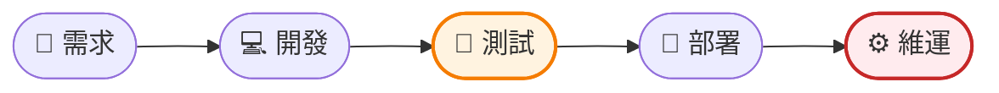
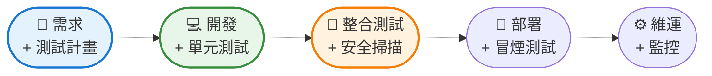
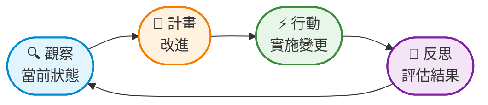
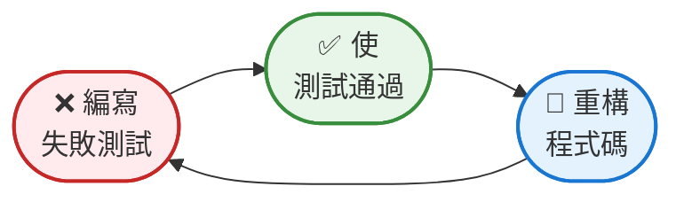
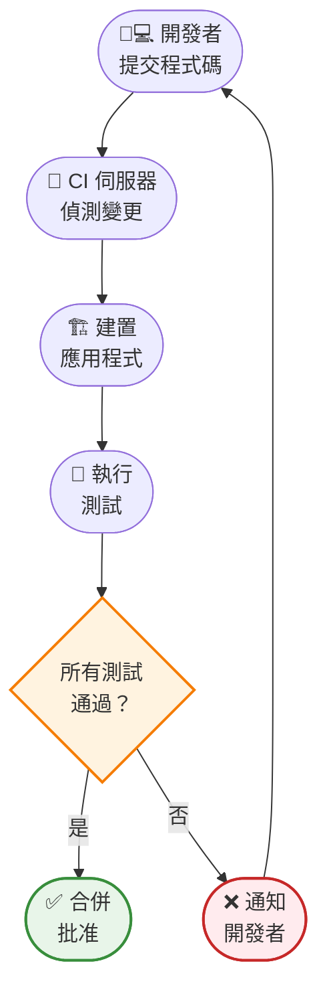
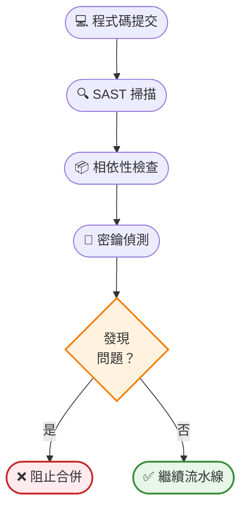
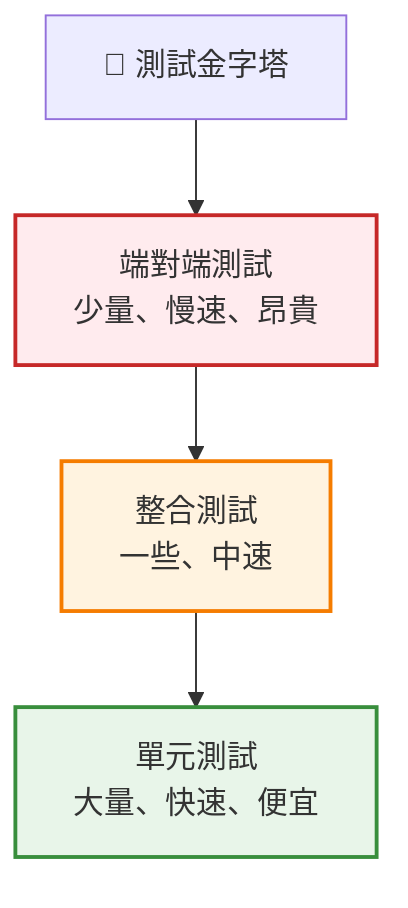

軟體開發有一個代價高昂的問題：發現 bug 的時間越晚，修復成本就越高。在程式碼審查期間發現的 bug 只需幾分鐘就能修復。而在生產環境中發現的同一個 bug 則需要數小時的除錯、緊急部署，並可能導致收入損失或聲譽受損。

這一現實推動了現代 DevOps 中最重要的運動之一：左移。

「左移」一詞指的是在軟體開發生命週期中更早地引入品質實踐——從字面上看，就是在時間線圖上將它們向左移動。我們不是在開發完成後進行測試，而是在開發過程中進行測試。我們不是在部署前才考慮安全性，而是在設計階段就考慮它。

這不僅僅是更早地進行測試。它從根本上重新思考我們何時以及如何確保品質，以及誰對此負責。

## 傳統方法：品質作為關卡

幾十年來，軟體開發遵循線性路徑：



開發人員編寫程式碼。完成後，他們將程式碼「扔過牆」給 QA 團隊進行測試。如果發現 bug，程式碼會返回給開發人員。這個循環不斷重複，直到通過品質關卡。

**這種方法的問題：**

**回饋緩慢**：開發人員可能需要數天或數週才能看到測試結果。到那時，他們已經忘記了上下文並轉向其他專案。

**修復成本高**：在週期後期更改程式碼通常需要重新編寫文件、測試和相關功能。

**責任孤立**：開發人員專注於功能，QA 專注於品質。雙方都沒有掌握完整的全局。

**覆蓋範圍有限**：測試發生在與生產條件不匹配的人工環境中。

**瓶頸**：隨著開發團隊的增長速度快於測試能力，QA 團隊成為瓶頸。

## 左移革命

左移改變了根本問題，從「我們如何測試這個？」變為「我們如何從一開始就建構品質？」



品質實踐被整合到每個階段：

**需求階段**：測試場景與功能一起定義。驗收標準成為自動化測試。

**開發階段**：開發人員在編寫程式碼之前或同時編寫單元測試。靜態分析在編寫程式碼時捕獲問題。

**整合階段**：自動化測試在每次提交時執行。安全掃描持續進行。

**部署階段**：冒煙測試在部署後立即驗證關鍵路徑。

**維運階段**：監控提供回饋，為未來的開發提供資訊。

!!!tip "💡 核心原則"
    左移不是做更多的工作——而是在正確的時間做正確的工作。在程式碼審查期間發現 bug 需要幾分鐘。在生產環境中發現它需要數小時或數天。

## 觀察-計畫-行動-反思循環

有效的左移實踐遵循一個持續改進循環，適用於開發的每個層面：



**觀察**：了解程式碼、測試和品質指標的當前狀態。什麼有效？什麼失敗了？瓶頸在哪裡？

**計畫**：根據觀察結果，決定要改進什麼。應該新增更多單元測試嗎？實施靜態分析？提高測試覆蓋率？

**行動**：實施計畫的改進。編寫測試、設定工具、更新流程。

**反思**：評估結果。測試覆蓋率提高了嗎？bug 是否更早被發現？團隊是否移動得更快？

這個循環在多個層面持續重複：

**個人開發者層面**：觀察程式碼品質 → 計畫重構 → 行動改進 → 反思結果

**團隊層面**：觀察測試覆蓋率 → 計畫測試策略 → 行動實施 → 反思有效性

**組織層面**：觀察品質指標 → 計畫流程改進 → 行動變更 → 反思結果

!!!example "🎬 真實案例"
    一個開發團隊觀察到整合 bug 經常在週期後期被發現。
    
    他們計畫實施在每次提交時執行的整合測試。
    
    他們透過編寫測試和設定 CI/CD 流水線來行動。
    
    他們在兩個衝刺後反思：早期發現的整合 bug 增加了 60%，後期 bug 修復減少了 40%。
    
    循環繼續：他們觀察到一些整合測試很慢，計畫最佳化它們，行動改進，並反思結果。

## 關鍵左移實踐

讓我們探討使左移有效的具體實踐。

### 1. 測試驅動開發（TDD）

TDD 顛覆了傳統的開發流程：在編寫程式碼之前先編寫測試。

**TDD 循環：**

1. **編寫失敗的測試**：定義程式碼應該做什麼
2. **編寫最少的程式碼**：使測試通過
3. **重構**：在保持測試通過的同時提高程式碼品質
4. **重複**：轉向下一個功能



**好處：**

- **設計清晰**：先編寫測試迫使你在實作之前思考介面和行為
- **完整覆蓋**：每一行程式碼都有相應的測試
- **活文件**：測試記錄了程式碼應該如何行為
- **信心**：重構是安全的，因為測試會捕獲回歸

**範例：**

```javascript
// 1. 先編寫測試
describe('calculateTotal', () => {
    it('should add tax to subtotal', () => {
        const result = calculateTotal(100, 0.1);
        expect(result).toBe(110);
    });
});

// 2. 編寫最少的程式碼使其通過
function calculateTotal(subtotal, taxRate) {
    return subtotal + (subtotal * taxRate);
}

// 3. 如果需要則重構
function calculateTotal(subtotal, taxRate) {
    if (subtotal < 0 || taxRate < 0) {
        throw new Error('Values must be positive');
    }
    return subtotal * (1 + taxRate);
}
```

### 2. 持續整合（CI）

CI 自動化了整合程式碼變更和執行測試的過程。每次提交都會觸發建置和測試循環。

**CI 如何運作：**



**關鍵原則：**

**頻繁提交**：小而頻繁的提交比大而不頻繁的提交更容易除錯。

**快速回饋**：測試應該快速執行，以便開發人員獲得即時回饋。

**立即修復損壞的建置**：損壞的建置是最高優先順序——在修復之前不要提交更多程式碼。

**自動化一切**：建置、測試和部署應該不需要手動步驟。

**好處：**

- **早期偵測**：整合問題在提交程式碼後幾分鐘內被發現
- **降低風險**：小的變更比大的合併更容易除錯
- **團隊信心**：每個人都知道程式碼庫的當前狀態
- **更快的開發**：自動化測試比手動測試更快

### 3. 靜態程式碼分析

靜態分析在不執行程式碼的情況下檢查程式碼，捕獲安全漏洞、程式碼異味和樣式違規等問題。

**靜態分析捕獲的內容：**

**安全問題：**
- SQL 注入漏洞
- 跨站腳本（XSS）風險
- 硬編碼憑證
- 不安全的加密

**程式碼品質：**
- 未使用的變數
- 死程式碼
- 複雜的函式
- 重複程式碼

**樣式違規：**
- 不一致的格式
- 命名慣例違規
- 缺少文件

**範例工具：**

- **SonarQube**：綜合程式碼品質平台
- **ESLint**：JavaScript 程式碼檢查
- **Pylint**：Python 程式碼分析
- **RuboCop**：Ruby 靜態分析
- **Checkmarx**：專注於安全的掃描

**整合到開發中：**

```yaml
# CI/CD 流水線範例
pipeline:
  - stage: analyze
    steps:
      - run: eslint src/
      - run: sonar-scanner
      - run: security-scan
  - stage: test
    steps:
      - run: npm test
  - stage: build
    steps:
      - run: npm run build
```

!!!warning "⚠️ 避免分析疲勞"
    過多的警告會導致「警報疲勞」，開發人員會忽略所有警告。設定工具以：
    
    - 首先關注高嚴重性問題
    - 逐步增加嚴格性
    - 為團隊需求自訂規則
    - 在強制執行新規則之前修復現有問題

### 4. 安全掃描（左移安全）

安全掃描將安全測試從部署前移至開發時。

**安全掃描類型：**

**靜態應用程式安全測試（SAST）**：在不執行程式碼的情況下分析原始碼中的漏洞。

**相依性掃描**：檢查第三方函式庫的已知漏洞。

**密鑰偵測**：尋找意外提交的憑證、API 金鑰和權杖。

**容器掃描**：分析 Docker 映像的安全問題。



**好處：**

- **早期偵測**：安全問題在開發期間被發現，而不是在部署前
- **降低成本**：早期修復安全問題比在生產環境中修復更便宜
- **開發者教育**：開發人員透過即時回饋學習安全編碼實踐
- **合規性**：自動化掃描有助於滿足監管要求

**範例：相依性掃描**

```json
// package.json
{
  "dependencies": {
    "express": "4.16.0"  // 已知漏洞！
  }
}
```

```bash
# CI 流水線執行相依性檢查
$ npm audit

found 1 high severity vulnerability
  express: <4.16.2 - Denial of Service

Run `npm audit fix` to fix them
```

### 5. 基礎設施即程式碼（IaC）

IaC 將基礎設施設定視為程式碼，實現基礎設施的測試和版本控制。

**IaC 的好處：**

**版本控制**：基礎設施變更像程式碼變更一樣被追蹤。

**測試**：基礎設施可以在部署前進行測試。

**一致性**：相同的設定在開發、預發布和生產環境中運作。

**自動化**：基礎設施部署是自動化和可重複的。

**範例：Terraform**

```hcl
# 定義基礎設施
resource "aws_instance" "web" {
  ami           = "ami-0c55b159cbfafe1f0"
  instance_type = "t2.micro"
  
  tags = {
    Name = "WebServer"
  }
}

# 測試基礎設施設定
resource "aws_security_group" "web" {
  ingress {
    from_port   = 80
    to_port     = 80
    protocol    = "tcp"
    cidr_blocks = ["0.0.0.0/0"]
  }
}
```

**測試 IaC：**

```bash
# 驗證語法
terraform validate

# 檢查安全問題
tfsec .

# 預覽變更
terraform plan

# 套用變更
terraform apply
```

### 6. 自動化測試金字塔

測試金字塔指導如何在不同層面分配測試工作。



**單元測試（基礎）：**
- 測試單個函式或類別
- 快速執行（毫秒）
- 高覆蓋率（70-80% 的測試）
- 在每次提交時執行

**整合測試（中間）：**
- 測試元件之間的互動
- 中等執行時間（秒）
- 中等覆蓋率（15-25% 的測試）
- 在每次提交或合併時執行

**端對端測試（頂部）：**
- 測試完整的使用者工作流程
- 慢速執行（分鐘）
- 有限覆蓋率（5-10% 的測試）
- 在部署前執行

!!!tip "💡 正確的平衡"
    **過多的端對端測試**：回饋慢、測試脆弱、維護成本高
    **過少的單元測試**：問題發現晚、除錯成本高
    **恰到好處**：快速的單元測試捕獲大多數問題，整合測試驗證互動，端對端測試驗證關鍵路徑

## 實施左移：實用路線圖

準備好實施左移實踐了嗎？這裡有一個循序漸進的方法。

### 第一階段：基礎（第 1-4 週）

**建立 CI/CD 流水線：**
- 選擇 CI 平台（Jenkins、GitLab CI、GitHub Actions）
- 設定每次提交時的自動建置
- 設定基本測試執行
- 建立建置狀態通知

**從單元測試開始：**
- 識別關鍵業務邏輯
- 為新程式碼編寫單元測試
- 逐步為現有程式碼新增測試
- 最初目標是 60% 的覆蓋率

**建立程式碼審查流程：**
- 合併前要求同儕審查
- 建立審查檢查清單
- 關注可讀性和可維護性
- 在團隊中分享知識

### 第二階段：品質關卡（第 5-8 週）

**新增靜態分析：**
- 設定程式碼檢查工具
- 從警告開始，而不是錯誤
- 逐步增加嚴格性
- 首先修復新程式碼中的問題

**實施安全掃描：**
- 新增相依性漏洞掃描
- 設定密鑰偵測
- 設定自動化警報
- 建立修復流程

**擴展測試覆蓋率：**
- 為關鍵路徑新增整合測試
- 將單元測試覆蓋率提高到 70%
- 建立測試資料管理策略
- 記錄測試標準

### 第三階段：進階實踐（第 9-12 週）

**採用 TDD：**
- 培訓團隊 TDD 實踐
- 從新功能開始
- 結對程式設計以傳播知識
- 衡量對 bug 率的影響

**基礎設施即程式碼：**
- 在程式碼中定義基礎設施
- 版本控制所有設定
- 測試基礎設施變更
- 自動化部署

**效能測試：**
- 將效能測試新增到 CI
- 建立效能基準
- 監控效能趨勢
- 對回歸發出警報

### 第四階段：持續改進（持續進行）

**測量和最佳化：**
- 追蹤關鍵指標（測試覆蓋率、bug 率、建置時間）
- 識別瓶頸
- 最佳化慢速測試
- 基於資料最佳化流程

**團隊文化：**
- 慶祝品質改進
- 跨團隊分享學習
- 鼓勵實驗
- 讓品質成為每個人的責任

!!!example "🎯 成功指標"
    追蹤這些指標以衡量左移的有效性：
    
    - **缺陷偵測率**：在生產環境前捕獲的 bug 百分比
    - **測試覆蓋率**：測試覆蓋的程式碼百分比
    - **建置時間**：從提交到測試結果的時間
    - **平均修復時間**：解決 bug 的平均時間
    - **部署頻率**：可以安全部署的頻率
    
    左移實踐應該隨著時間的推移改善所有這些指標。

## 常見挑戰和解決方案

實施左移並非沒有挑戰。以下是如何應對常見障礙。

### 挑戰 1：「我們沒有時間編寫測試」

**現實**：你沒有時間不編寫測試。除錯生產問題所需的時間遠遠超過編寫測試。

**解決方案：**
- 從關鍵路徑的小規模開始
- 衡量早期 bug 偵測節省的時間
- 將測試作為「完成」定義的一部分
- 自動化測試執行以節省時間

### 挑戰 2：「我們的程式碼庫太大了」

**現實**：大型程式碼庫最能從左移實踐中受益。

**解決方案：**
- 不要試圖一次測試所有內容
- 專注於新程式碼和關鍵路徑
- 逐步擴大覆蓋範圍
- 使用程式碼覆蓋率工具識別差距

### 挑戰 3：「測試太慢了」

**現實**：慢速測試違背了快速回饋的目的。

**解決方案：**
- 最佳化慢速測試
- 在每次提交時執行單元測試，在合併時執行整合測試
- 平行化測試執行
- 使用測試影響分析僅執行受影響的測試

### 挑戰 4：「開發人員抵制變革」

**現實**：變革是困難的，尤其是當它需要新技能時。

**解決方案：**
- 提供培訓和支援
- 從志願者和早期採用者開始
- 分享成功故事
- 使工具易於使用
- 慶祝改進

### 挑戰 5：「誤報太多」

**現實**：警報疲勞導致開發人員忽略所有警告。

**解決方案：**
- 調整工具以減少雜訊
- 僅從高嚴重性問題開始
- 逐步增加嚴格性
- 為你的情境自訂規則
- 及時修復問題以保持可信度

## 文化轉變

左移既關乎文化，也關乎工具和實踐。它需要團隊對品質的思考方式發生根本性變化。

**從「QA 的工作」到「每個人的工作」：**

品質不再是單獨 QA 團隊的責任。每個開發人員都對其程式碼的品質負責。

**從「測試階段」到「持續測試」：**

測試不是開發後發生的階段。它是整合到每個步驟的持續活動。

**從「發現 bug」到「預防 bug」：**

目標不是高效地發現 bug——而是從一開始就防止它們被編寫出來。

**從「責備」到「學習」：**

當 bug 發生時，重點是學習和改進流程，而不是找人責備。

!!!success "✨ 成功左移文化的標誌"
    - 開發人員無需被要求就編寫測試
    - 程式碼審查關注品質，而不僅僅是功能
    - 團隊慶祝早期發現 bug
    - 損壞的建置立即修復
    - 品質指標隨時間改善
    - 部署信心增加
    - 生產事故減少

## 結論：品質作為一等公民

左移代表了我們建構軟體方式的根本轉變。透過在開發生命週期中更早地引入品質實踐，我們在修復成本最低時捕獲問題，降低風險，並加速交付。

觀察-計畫-行動-反思循環為每個層面的持續改進提供了框架——從個人開發者到整個組織。每次迭代都使系統變得更好，創造了品質改進的良性循環。

但左移不僅僅是工具和流程。它關乎文化。它關乎從第一天起就讓品質成為每個人的責任。它關乎建構為品質而設計的系統，而不僅僅是為品質而測試的系統。

擁抱左移的組織不僅交付得更快——他們交付得更好。他們花更少的時間撲滅生產問題，花更多的時間建構新功能。他們對部署有信心，因為品質是內建的，而不是後加的。

問題不是是否要左移。而是你能多快開始。

!!!quote "💭 最後的思考"
    「品質不是一種行為，而是一種習慣。」—— 亞里斯多德
    
    左移透過將品質整合到開發的每個步驟中，使品質成為一種習慣。結果不僅僅是更好的軟體——而是更好的團隊、更好的流程和更好的結果。
