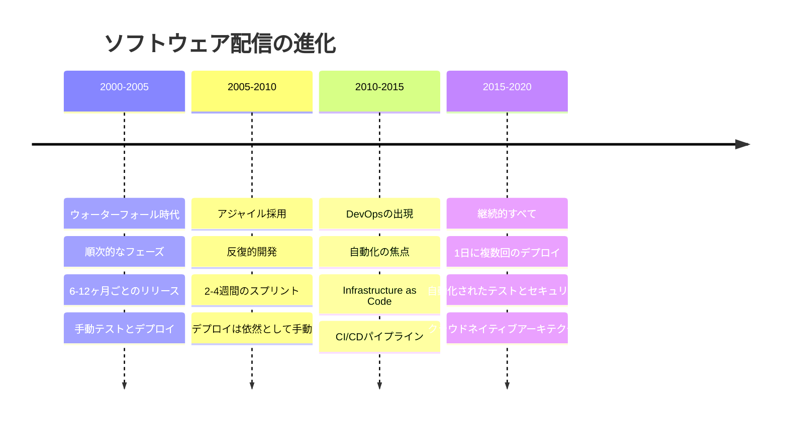

ソフトウェアのデプロイが午前2時のメンテナンスウィンドウをスケジュールし、チーム全体を電話会議に集め、何も壊れないことを祈ることを意味していた時代を覚えていますか？多くのエンタープライズにとって、これはわずか10年前の標準でした。デプロイは稀で、リスクの高いイベントで、誰もが恐れていました。

そして何かが変わりました。Amazon、Netflix、Googleのような企業は、年に数回ではなく、1日に数千回コードをデプロイし始めました。彼らは単に速く動いているだけでなく、より少ないインシデントでより高品質のソフトウェアを提供していました。彼らの秘密は？継続的インテグレーションと継続的デプロイメント（CI/CD）です。

シリコンバレーで急進的なアイデアとして始まったものが、現代のソフトウェア配信の基盤となりました。今日、CI/CDは単にスピードについてだけではありません - ビジネスの俊敏性が生存である世界で、エンタープライズがソフトウェアを構築、テスト、配信する方法を変革することです。

## ソフトウェア配信の進化

ソフトウェア配信は過去20年間で劇的な変革を遂げました。この旅を理解することで、CI/CDがエンタープライズの成功に不可欠になった理由を理解できます。

### ウォーターフォール時代：順次的で遅い

2000年代初頭、ほとんどのエンタープライズはウォーターフォールモデルに従っていました。要件は数ヶ月間収集され、開発は四半期かかり、テストは最後に行われ、デプロイは大きなイベントでした。数ヶ月または数年単位のリリースサイクルが一般的でした。このアプローチは、ソフトウェアがゆっくり変化し、顧客の期待が低かった時代には機能しました。

しかし、世界は変化していました。インターネットがビジネスサイクルを加速させました。モバイルアプリが新しい顧客期待を生み出しました。クラウドコンピューティングがインフラストラクチャをプログラマブルにしました。ウォーターフォールモデルはペースについていけませんでした。

### アジャイル革命：反復的開発

アジャイル方法論は、ウォーターフォールの限界への対応として登場しました。チームはスプリントで作業を始め、数ヶ月ごとではなく数週間ごとに動作するソフトウェアを提供しました。これは大きな改善でしたが、問題が残りました：チームが機能を迅速に構築できても、本番環境に届けることは依然として遅く苦痛でした。

「ラストマイル」問題が明らかになりました - チームは反復的にソフトウェアを開発できましたが、デプロイはボトルネックのままでした。コードは次のリリースウィンドウを待って積み上がりました。統合問題が遅く表面化しました。俊敏性の約束はデプロイの現実によって制約されました。

### DevOpsムーブメント：サイロの打破

DevOpsは、開発と運用の間の断絶に対処するために登場しました。核心的な洞察はシンプルですが深遠でした：デプロイがまだウォーターフォールであれば、アジャイル開発はできません。チームはコードから本番環境までのライフサイクル全体を所有する必要がありました。

この文化的シフトには新しいプラクティスとツールが必要でした。自動化が不可欠になりました。Infrastructure as Codeが環境を再現可能にしました。監視と可観測性が第一級の関心事になりました。そしてその中心にあったのがCI/CD - 継続的配信を可能にする技術的基盤でした。



## CI/CDの理解：単なる自動化以上のもの

CI/CDは単にデプロイを自動化することとしばしば誤解されます。自動化は重要ですが、CI/CDはソフトウェア配信について考える方法の根本的なシフトを表しています。

### 継続的インテグレーション：品質の組み込み

継続的インテグレーション（CI）は、コード変更を頻繁に - 多くの場合1日に複数回 - 共有リポジトリにマージするプラクティスです。各統合は、迅速なフィードバックを提供する自動ビルドとテストプロセスをトリガーします。

**核心原則**：早く頻繁に統合する。数週間孤立して作業してから統合地獄に直面するのではなく、開発者は継続的に変更を統合します。これにより、統合は危機ではなく非イベントになります。

**CIで何が起こるか**：
1. 開発者がバージョン管理にコードをコミット
2. CIサーバーが変更を検出してビルドをトリガー
3. コードがコンパイルされ、ユニットテストが実行される
4. 静的解析がコード品質とセキュリティをチェック
5. 結果が数分以内にチームに報告される

この迅速なフィードバックループは、問題が最も修正しやすいとき - 導入された直後に捕捉します。コミット直後に失敗するテストは、そのコミットが原因であることを明確に示します。3週間後に失敗するテストは、数百の変更のいずれかが原因である可能性があります。

### 継続的デプロイメント vs 継続的デリバリー

用語はしばしば混同されますが、区別は重要です：

**継続的デリバリー**は、コードが常にデプロイ可能な状態にあることを意味します。自動テストに合格したすべての変更は本番環境にデプロイできますが、実際のデプロイには人間の承認が必要です。これにより、チームはいつでもデプロイできるという自信を持ちながら、デプロイのタイミングを制御できます。

**継続的デプロイメント**はさらに一歩進みます - 自動テストに合格したすべての変更は、人間の介入なしに自動的に本番環境にデプロイされます。これには、自動テストと監視に対する並外れた自信が必要です。

ほとんどのエンタープライズは継続的デリバリーから始め、プラクティスが成熟し自信が高まるにつれて、徐々に継続的デプロイメントに移行します。

## エンタープライズCI/CDの主要プラクティス

エンタープライズコンテキストでCI/CDを実装するには、ツール以上のものが必要です - 規模での品質、セキュリティ、信頼性を確保するプラクティスを採用する必要があります。

### トランクベース開発

長期間存在するフィーチャーブランチは、継続的インテグレーションの敵です。コードがブランチに長く存在するほど、メインコードベースから乖離し、統合がより苦痛になります。

トランクベース開発は、開発者が短期間のブランチ（またはメインブランチに直接）で作業し、少なくとも毎日変更を統合することを意味します。これにより、コードベースが継続的に統合された状態に保たれます。

**フィーチャーフラグ**：不完全な機能を本番環境を壊さずにデプロイするにはどうすればよいですか？フィーチャーフラグを使用すると、機能の準備ができるまで非表示にしながら、コードをメインブランチにマージできます。これにより、デプロイとリリースが切り離され、柔軟性が得られ、リスクが軽減されます。

### 自動テスト戦略

自動テストはCI/CDの自信の基盤です。包括的な自動テストがなければ、頻繁に安全にデプロイすることはできません。

**テストピラミッド**：
- **ユニットテスト**（ベース）：個々のコンポーネントの高速で多数のテスト
- **統合テスト**（中間）：コンポーネント相互作用のテスト
- **エンドツーエンドテスト**（トップ）：ユーザー視点からの完全なシステムテスト

ピラミッド形状は意図的です - 多くの高速なユニットテスト、より少ない統合テスト、さらに少ないエンドツーエンドテストが必要です。このバランスは、テスト実行時間を合理的に保ちながら、良好なカバレッジを提供します。

### Infrastructure as Code

手動インフラストラクチャ設定はCI/CDと互換性がありません。自動的に作成および破棄できる、再現可能でバージョン管理されたインフラストラクチャが必要です。

Infrastructure as Code（IaC）は、インフラストラクチャ設定をソフトウェアとして扱います。Terraform、CloudFormation、Ansibleなどのツールを使用すると、インフラストラクチャをコードで定義し、アプリケーションコードと一緒にバージョン管理し、同じCI/CDパイプラインを通じてデプロイできます。

### 監視と可観測性

頻繁にデプロイすることは、何かがうまくいかないときに即座に知る必要があることを意味します。包括的な監視と可観測性が不可欠です。

**追跡すべき主要メトリクス**：
- **デプロイ頻度**：どのくらいの頻度でデプロイしていますか？
- **リードタイム**：コミットから本番環境までどのくらいかかりますか？
- **平均復旧時間（MTTR）**：問題をどれだけ早く修正できますか？
- **変更失敗率**：デプロイの何パーセントが問題を引き起こしますか？

「Accelerate」という本で普及したこれら4つのメトリクスは、ソフトウェア配信パフォーマンスの強力な指標です。

!!!success "✨ 高パフォーマンスチーム"
    研究によると、高パフォーマンスチームは1日に複数回デプロイし、リードタイムは1時間未満、インシデントからの回復は1時間未満、変更失敗率は15%未満です。これらは単なるスピードメトリクスではありません - ビジネス成果と強く相関しています。

## エンタープライズCI/CDパイプラインの構築

エンタープライズアプリケーション用の本番環境対応CI/CDパイプラインの構築を見ていきましょう。

### ステージ1：ソース管理とブランチ戦略

すべてはバージョン管理から始まります。エンタープライズの場合、これは通常、GitHub、GitLab、BitbucketなどのプラットフォームでGitを意味します。

**ブランチ戦略**：
- **メインブランチ**：常にデプロイ可能、直接コミットから保護
- **フィーチャーブランチ**：短期間（最大1-2日）、プルリクエスト経由でマージ
- **リリースブランチ**：オプション、複数バージョンをサポートする必要があるチーム向け

### ステージ2：継続的インテグレーション

コードがメインブランチにマージされると、CIパイプラインが自動的に開始されます。

**ビルドプロセス**：
```yaml
# CI設定例（GitHub Actions）
name: CIパイプライン

on:
  push:
    branches: [main]
  pull_request:
    branches: [main]

jobs:
  build:
    runs-on: ubuntu-latest
    steps:
      - uses: actions/checkout@v2
      
      - name: 環境のセットアップ
        uses: actions/setup-node@v2
        with:
          node-version: '14'
      
      - name: 依存関係のインストール
        run: npm ci
      
      - name: リンティングの実行
        run: npm run lint
      
      - name: ユニットテストの実行
        run: npm test
      
      - name: セキュリティスキャンの実行
        run: npm audit
      
      - name: アプリケーションのビルド
        run: npm run build
```

このパイプラインはすべてのコミットで実行され、開発者に迅速なフィードバックを提供します。

### ステージ3：自動テスト

ビルドが成功した後、包括的なテストが始まります。

**テストステージ**：
1. **ユニットテスト**：ビルド中に実行（5-10分）
2. **統合テスト**：コンポーネント相互作用をテスト（10-20分）
3. **セキュリティテスト**：脆弱性をスキャン（5-10分）
4. **パフォーマンステスト**：パフォーマンス要件を検証（15-30分）
5. **エンドツーエンドテスト**：完全なユーザーシナリオ（20-40分）

**並列実行**：独立したテストスイートを並列に実行して、合計パイプライン時間を短縮します。順次実行で90分かかるパイプラインは、並列化により30分で完了する可能性があります。

### ステージ4：ステージングへのデプロイ

すべてのテストに合格すると、アプリケーションは本番環境を模倣するステージング環境に自動的にデプロイされます。

**デプロイ戦略**：

**ブルーグリーンデプロイメント**：2つの同一の本番環境（ブルーとグリーン）を維持します。非アクティブな環境にデプロイし、テストしてから、トラフィックを切り替えます。問題が発生した場合は、即座に切り戻します。

**カナリアデプロイメント**：最初に本番サーバーの小さなサブセットにデプロイします。問題を監視します。新しいバージョンへのトラフィックを徐々に増やします。問題が検出された場合はロールバックします。

**ローリングデプロイメント**：サーバーを一度に1つずつ、または小さなバッチで更新します。これにより、ブルーグリーンデプロイメントのインフラストラクチャコストを回避しながら、リスクを最小限に抑えます。

## CI/CDパイプラインのセキュリティ

セキュリティはCI/CDの後付けであってはなりません - パイプライン全体に統合する必要があります。このアプローチはDevSecOpsと呼ばれます。

### シフトレフトセキュリティ

「シフトレフト」は、セキュリティを開発プロセスの早期段階に移動することを意味します。本番デプロイ前にセキュリティレビューが行われるのではなく、すべてのステージでセキュリティチェックが行われます。

**セキュリティチェックポイント**：

**開発中**：
- 入力時にセキュリティ問題を検出するIDEプラグイン
- シークレットのコミットを防ぐプレコミットフック
- 既知の脆弱性の依存関係スキャン

**CI中**：
- 静的アプリケーションセキュリティテスト（SAST）がソースコードをスキャン
- ソフトウェアコンポジション分析（SCA）が依存関係をチェック
- シークレットスキャンが認証情報のリポジトリへの侵入を防ぐ

**デプロイ中**：
- 動的アプリケーションセキュリティテスト（DAST）が実行中のアプリケーションをテスト
- インフラストラクチャスキャンがクラウド設定を検証
- コンテナスキャンが脆弱なベースイメージをチェック

### シークレット管理

シークレット（パスワード、APIキー、証明書）をソースコードや設定ファイルに保存しないでください。専用のシークレット管理ツールを使用してください。

**ベストプラクティス**：
- AWS Secrets Manager、HashiCorp Vault、または類似のツールにシークレットを保存
- ビルド時ではなく実行時にシークレットを注入
- シークレットを定期的かつ自動的にローテーション
- シークレットアクセスを監査
- 可能な場合は短期間の認証情報を使用

## CI/CD成功の測定

CI/CD実装が成功しているかどうかをどのように知りますか？重要なことを測定します。

### 4つの主要メトリクス

「Accelerate」という本の研究に基づいて、これら4つのメトリクスはソフトウェア配信パフォーマンスの最良の指標です：

**1. デプロイ頻度**
組織はどのくらいの頻度で本番環境にコードをデプロイしますか？
- エリート：1日に複数回
- 高：1日に1回から週に1回
- 中：週に1回から月に1回
- 低：月に1回未満

**2. 変更のリードタイム**
コミットが本番環境に到達するまでどのくらいかかりますか？
- エリート：1時間未満
- 高：1日から1週間
- 中：1週間から1ヶ月
- 低：1ヶ月以上

**3. 平均復旧時間（MTTR）**
インシデント後にサービスを復元するのにどのくらいかかりますか？
- エリート：1時間未満
- 高：1日未満
- 中：1日から1週間
- 低：1週間以上

**4. 変更失敗率**
デプロイの何パーセントが本番環境で障害を引き起こしますか？
- エリート：0-15%
- 高：16-30%
- 中：31-45%
- 低：46-60%

### ビジネスインパクトメトリクス

技術的メトリクスは重要ですが、最終的にCI/CDはビジネス成果を推進するべきです：

**市場投入時間**：新機能を顧客にどれだけ早く提供できますか？

**顧客満足度**：より速く、より高品質で価値を提供していますか？

**開発者の生産性**：開発者は価値ある作業に時間を費やしていますか、それともデプロイプロセスと戦っていますか？

**運用コスト**：手動作業とインフラストラクチャの無駄を削減していますか？

**イノベーション率**：迅速に実験して反復できますか？

!!!success "✨ 実世界への影響"
    CI/CDに優れた組織は次のことを報告しています：
    - 46倍頻繁なデプロイ
    - コミットからデプロイまでのリードタイムが440倍速い
    - 平均復旧時間が170倍速い
    - 変更失敗率が5倍低い
    
    これらは単なる技術的改善ではありません - 競争優位性に直接変換されます。

## 一般的な課題と解決策

エンタープライズでCI/CDを実装することには課題がないわけではありません。一般的な障害とそれを克服する方法を紹介します。

### 課題：レガシーシステム

**問題**：既存のアプリケーションは自動デプロイ用に設計されていませんでした。手動設定ステップ、手動で実行する必要があるデータベーススクリプト、特定のサーバー設定への依存関係があります。

**解決策**：
- 新しいアプリケーションから始めて、レガシーシステムを徐々にモダナイズ
- 手動ステップを自動化するラッパースクリプトを作成
- ストラングラーパターンを使用してレガシーコンポーネントを徐々に置き換える
- テストカバレッジのないシステム用の特性テストに投資

### 課題：組織的抵抗

**問題**：チームは既存のプロセスに慣れています。運用チームは安定性を心配します。マネージャーは制御を失うことを恐れます。開発者は新しいツールに懐疑的です。

**解決策**：
- パイロットプロジェクトから小さく始める
- メトリクスで成功を実証
- 懐疑的な人を早期に巻き込み、懸念に対処
- トレーニングとサポートを提供
- 勝利を祝い、学びを共有

### 課題：テスト自動化のギャップ

**問題**：自動テストカバレッジが不十分なため、チームは頻繁にデプロイすることを恐れています。手動テストがボトルネックになります。

**解決策**：
- テストピラミッドアプローチを採用
- 新しいコード用のテストを書く（問題を悪化させない）
- 既存のコードにテストを徐々に追加し、高リスク領域を優先
- テストインフラストラクチャとフレームワークに投資
- テストを完了の定義の一部にする

## 始め方：実践的なロードマップ

エンタープライズでCI/CDを実装する準備はできましたか？ステップバイステップのアプローチを紹介します。

### フェーズ1：基盤（1-4週目）

**目標**：基本的な自動化とバージョン管理プラクティスを確立

**アクション**：
1. すべてのコードがバージョン管理（Git）にあることを確認
2. CIサーバーをセットアップ（Jenkins、GitLab CI、GitHub Actions）
3. コードをコンパイルしてユニットテストを実行する基本的なビルドパイプラインを作成
4. ブランチ戦略を確立（トランクベースまたはGitフロー）
5. プルリクエスト経由でコードレビュープロセスを実装

**成功基準**：すべてのコミットが自動ビルドとテストをトリガー

### フェーズ2：自動テスト（5-12週目）

**目標**：包括的な自動テストを通じて自信を構築

**アクション**：
1. 既存のテストカバレッジを監査し、ギャップを特定
2. テストピラミッドを実装（ユニット、統合、エンドツーエンド）
3. CIパイプラインにテストを追加
4. 本番環境を模倣するテスト環境をセットアップ
5. 品質ゲートを確立（最小カバレッジ、失敗するテストなし）

**成功基準**：80%以上のテストカバレッジ、マージ前にすべてのテストが合格

### フェーズ3：継続的デリバリー（13-20週目）

**目標**：ステージング環境へのデプロイを自動化

**アクション**：
1. ステージング環境用のInfrastructure as Codeを実装
2. デプロイスクリプトと自動化を作成
3. パイプラインにデプロイステージを追加
4. データベース移行の自動化を実装
5. ステージング用の監視とアラートをセットアップ

**成功基準**：すべての成功したビルドが自動的にステージングにデプロイ

### フェーズ4：本番デプロイ（21-28週目）

**目標**：安全で頻繁な本番デプロイを可能にする

**アクション**：
1. 本番デプロイ自動化を実装
2. デプロイ戦略を選択して実装（ブルーグリーン、カナリア、ローリング）
3. 本番監視とアラートをセットアップ
4. ロールバック手順を作成
5. リスク軽減のためにフィーチャーフラグを実装

**成功基準**：本番デプロイが自動化され、低リスク

### フェーズ5：継続的改善（継続中）

**目標**：CI/CDプラクティスを最適化し成熟させる

**アクション**：
1. 4つの主要メトリクスを測定
2. ボトルネックを特定して対処
3. デプロイ頻度を徐々に増やす
4. リードタイムとMTTRを削減
5. チーム間で学びを共有

**成功基準**：メトリクスとチーム満足度の継続的改善

## まとめ：継続的な旅

CI/CDは目的地ではありません - 継続的改善の旅です。目標は完璧ではなく、進歩です。より多くの自動化、より速いフィードバック、より安全なデプロイへのすべてのステップが、組織をより俊敏で競争力のあるものにします。

今後10年間で繁栄するエンタープライズは、ソフトウェアを迅速、安全、継続的に配信できる企業です。彼らは数ヶ月ではなく数日で市場の変化に対応します。彼らは迅速に実験し、失敗から学びます。彼らはソフトウェア配信を単なるコストセンターではなく、競争優位性として扱います。

手動でリスクの高いデプロイから自動化された自信のある継続的配信への変革は困難です。技術的変更、文化的シフト、持続的なコミットメントが必要です。しかし、報酬 - より速い市場投入時間、より高い品質、より幸せな開発者、より良いビジネス成果 - は、エンタープライズが行うことができる最も価値のある投資の一つにします。

問題はCI/CDを採用するかどうかではありません。問題は：どれだけ早く旅を始められるかです。

!!!quote "💭 最後の考え"
    「痛いなら、もっと頻繁にやって、痛みを前に持ってきなさい。」 - Jez Humble
    
    この原則はCI/CDの本質を捉えています。デプロイの痛み？ルーチンになるまでより頻繁にデプロイします。統合問題？もはやイベントでなくなるまで継続的に統合します。卓越への道は、稀な巨大な飛躍ではなく、頻繁で小さなステップで舗装されています。
