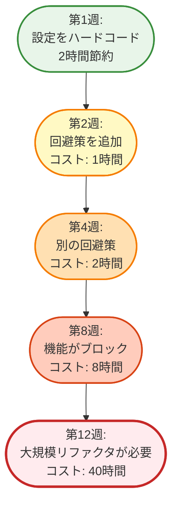
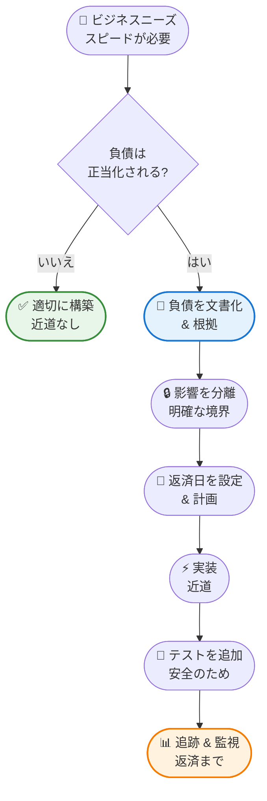
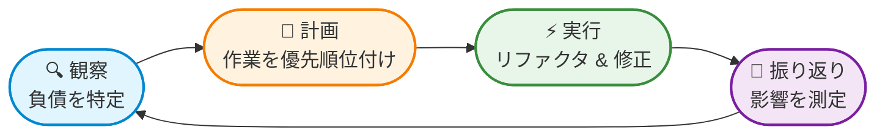
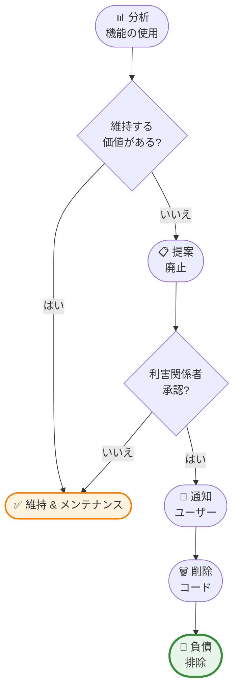
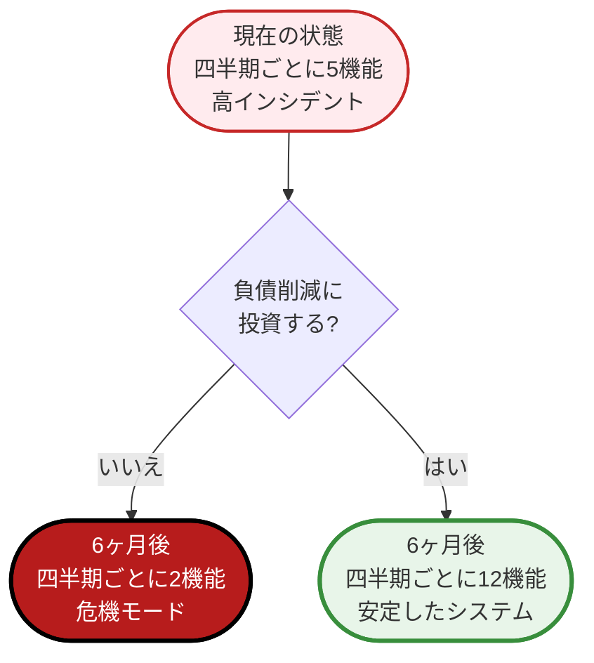
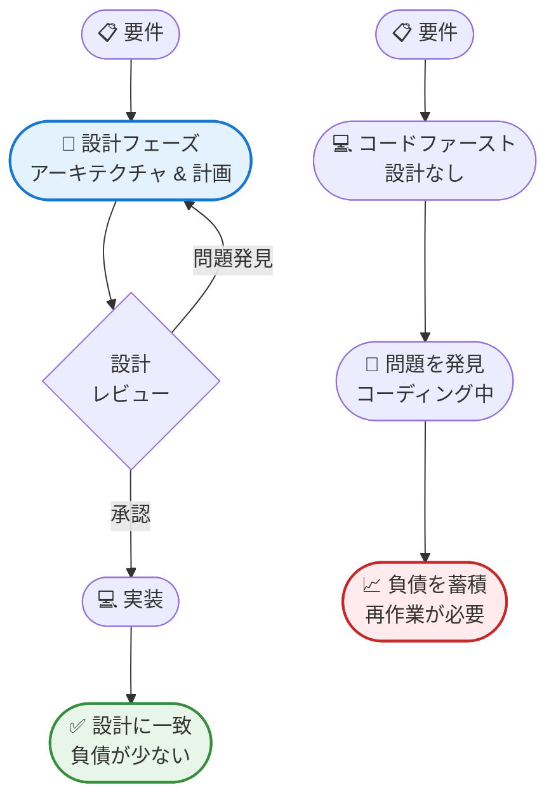

すべてのソフトウェアチームは同じ誘惑に直面します。今すぐ近道を取り、後で修正する。リファクタリングをスキップする。コードブロックをコピー＆ペーストする。設定値をハードコードする。今日機能を出荷し、明日クリーンアップする。

しかし、明日は決して来ません。

代わりに、それらの近道は蓄積されます。それぞれが次の機能の構築を難しくします。テストは不安定になります。デプロイはリスクが高くなります。新しい開発者はコードベースの理解に苦労します。いくつかの実用的な決定として始まったものが、すべてを遅くする圧倒的な負担に変わります。

これが技術的負債です - そして金融負債と同様に、利息が複利で増えていきます。

## 技術的負債とは何か？

Ward Cunninghamは1992年に「技術的負債」という用語を作り、完璧なコードと迅速な出荷の間のトレードオフを説明しました。金融負債が今すぐ何かを取得し後で支払うことを可能にするように、技術的負債はコード品質の作業を延期することで、より速く機能を出荷することを可能にします。

この比喩は本質的な真実を捉えているため強力です：負債は本質的に悪いものではありません。戦略的な負債は成長を加速できます。スタートアップは競合他社より先にプロダクトマーケットフィットを検証するために、意図的に技術的負債を蓄積するかもしれません。チームは重要な締め切りを守るために近道を取るかもしれません。

問題は負債そのものではありません - 管理されていない負債です。

## 技術的負債が金融負債のように複利で増える理由

技術的負債の「利息」は比喩ではありません - 時間とともに増大する実際のコストです。その理由は次のとおりです：

### 複利効果

金融負債では、元本に対して利息を支払います。技術的負債では、問題のあるコードと対話するたびに「利息」を支払います：

**初期負債**：2時間を節約するために設定値をハードコードします。

**最初の利息支払い**：次の開発者がステージング環境で設定が機能しない理由を理解するのに30分かかります。

**2回目の利息支払い**：別の開発者がハードコードされた値を簡単に変更できないため、回避策を追加するのに1時間かかります。

**3回目の利息支払い**：QAがCIでテストが失敗するがローカルでは成功する理由をデバッグするのに2時間かかります。

**4回目の利息支払い**：新しいチームメンバーがオンボーディング中に回避策を理解するのに3時間かかります。

その2時間の近道は現在6.5時間の「利息」を費やしています - そして負債はまだ支払われていません。残っている時間が長いほど、より多くの利息が蓄積されます。

### 負債が負債の上に積み重なる

新しいコードが古い負債の上に構築されるため、複利は加速します：



**第1週**：より速く出荷するために適切なエラー処理をスキップします。

**第2週**：別の開発者がエラーが処理されることを前提とした機能を追加し、脆弱なコードを作成します。

**第4週**：3番目の機能が2番目の機能の上に構築され、現在3層の前提条件があります。

**第8週**：バグが現れますが、3つの機能が壊れた動作に依存しているため、修正が困難です。

**第12週**：最終的にリファクタリングしますが、現在は元の近道だけでなく3つの機能を更新する必要があります。

第1週に2時間かかったはずの修正は、第12週には40時間かかります。これが複利です。

### 認知負荷が倍増する

各負債は精神的なオーバーヘッドを追加します：

- 開発者は「そのモジュールには触れないで、脆弱です」と覚えておく必要があります
- コードレビューは、レビュアーが回避策を理解する必要があるため、時間がかかります
- 新しい機能は負債を回避してナビゲートする必要があり、開発が遅くなります
- 動作が期待と一致しないため、デバッグが難しくなります

この認知負荷は、毎日継続的に支払われる利息です。

### 利率は変動する

すべての負債が同じ速度で複利になるわけではありません：

**高利率の負債**（急速に複利）：
- 頻繁に触れられるコアモジュール
- コードベース全体で使用される共有ユーティリティ
- 他のチームが依存するパブリックAPI
- 認証、認可、データアクセス層

**低利率の負債**（ゆっくり複利）：
- めったに変更されない分離された機能
- ユーザーが少ない内部ツール
- 一時的であることが明確にマークされた実験的なコード
- 最小限のユーザーに影響するエッジケース

!!!example "🎬 実際の複利"
    チームはより速く出荷するためにデータベースのインデックス作成をスキップしました（1日節約）。
    
    **1ヶ月目**：クエリは遅いが許容範囲（利息: 0時間）
    
    **3ヶ月目**：開発者がクエリの回避策を追加（利息: 4時間）
    
    **6ヶ月目**：パフォーマンスに関する顧客の苦情（利息: 調査に8時間）
    
    **9ヶ月目**：遅いデモのために営業チームが取引を失う（利息: 失われた収益）
    
    **12ヶ月目**：緊急パフォーマンススプリントが必要（利息: 80時間 + 顧客の離脱）
    
    1日の近道は最終的に92時間と失われた顧客を費やしました。負債が高トラフィックエリアにあったため、利率は壊滅的でした。

### 複利が加速する理由

**依存関係チェーン**：負債に依存する新しい機能ごとに、それを修正するコストが増加します。

**知識の減衰**：元の開発者が去り、コンテキストを持ち去ります。将来の開発者は決定をリバースエンジニアリングする必要があるため、より高い利息を支払います。

**リスク回避**：負債が古くなるにつれて、チームはそれを修正することを恐れるようになります。「何年も機能しているので、触れないでください。」この恐怖は失われた機会で支払われる利息です。

**機会費用**：負債を回避するために費やされた時間は、価値のある機能に費やされない時間です。この隠れた利息は静かに複利になります。

### 転換点

最終的に、負債は利息の支払いが開発能力を超える転換点に達します：

- 機能よりも回避策に多くの時間を費やす
- 新しいバグを作成するバグ修正
- アーキテクチャの制約により「不可能」な機能
- コードを書くよりもコードを理解することに多くの時間を費やす開発者

この時点で、あなたは破産しています - 大規模な再構築（書き直し）なしに進歩することができません。

!!!tip "💡 利息の支払い vs. 元本の支払い"
    負債を修正する代わりに回避するたびに、利息を支払っています。
    
    リファクタリングして負債を排除するたびに、元本を支払っています。
    
    目標はゼロ負債ではありません - 利息の支払いが価値を提供する能力を超えないようにすることです。


## 技術的負債の種類

すべての技術的負債が同じように作られているわけではありません。さまざまなタイプを理解することで、最初に対処すべきものを優先順位付けするのに役立ちます。

### 意図的な負債

これは意識的で戦略的な負債です。チームは近道を取っていることを知っており、後でそれに対処する計画を立てています。例には次のものが含まれます：

- 締め切りを守るために設定をハードコードする
- MVPのエッジケース処理をスキップする
- 最初はよりシンプルだがスケーラビリティの低いアーキテクチャを使用する

**特徴**：文書化され、追跡され、期限が設定され、明確な返済計画があります。

## 技術的負債を戦略的に引き受けるタイミング

技術的負債を引き受けることが正しいビジネス上の決定である場合があります。重要なのは、無謀にではなく、意図的に準備をして行うことです。

### 負債を引き受ける正当な理由

**市場タイミング**：先行者利益や競争圧力により、より速く出荷するための近道が正当化される場合があります。

**検証**：完璧なアーキテクチャに投資する前に、市場適合性をテストするためのMVPを構築します。

**重要な締め切り**：規制遵守、契約上の義務、または時間に敏感な機会。

**リソースの制約**：限られた予算またはチームの能力により、実用的なトレードオフが必要です。

**学習**：要件に関する不確実性は、最初にシンプルなものを構築し、実際の使用に基づいてリファクタリングすることを示唆しています。

!!!warning "⚠️ 負債を引き受ける悪い理由"
    - 「品質のための時間がない」（後でもっと支払うことになります）
    - 「最終的に修正します」（具体的な計画なし）
    - 「テストは遅くなる」（バグはもっと遅くなります）
    - 「誰も気づかない」（気づきます、そしてそれは痛いです）

### 負債を引き受ける前の準備

技術的負債を戦略的に引き受けることを決定した場合、返済できるように適切に準備してください：

**1. 負債を文書化する**

どのような負債を引き受けているか、そしてその理由を明確に記録します：

```markdown
## 技術的負債：ハードコードされたAPIエンドポイント

**発生日**：2020-07-15
**理由**：投資家デモのために月末までにMVPを出荷する必要がある
**場所**：src/api/client.js 45-67行
**影響**：dev/staging/prod環境間を簡単に切り替えることができない
**推定返済労力**：4時間
**返済期限**：スプリント12（ベータ版ローンチ前）
**所有者**：@alice
```

文書化がなければ、負債は見えなくなり、忘れられます。

**2. 負債を分離する**

近道を特定のモジュールまたはコンポーネントに含めます：

- 明確な境界を使用する（個別のファイル、モジュール、またはサービス）
- 負債の場所をマークするコメントを追加する：`// TODO: TECH DEBT - MVPのためにハードコード`
- 負債がコードベースの他の部分に広がらないようにする
- 広範な変更なしに将来の置き換えを可能にするインターフェースを作成する

**3. 返済日を設定する**

期限のない負債は決して支払われません：

- 返済のための特定のスプリントまたは時間ブロックをスケジュールする
- 返済をビジネスマイルストーンに結び付ける（「ベータ版ローンチ前」、「シリーズA後」）
- 負債項目を優先順位付きでバックログに追加する
- 負債ステータスを確認するためのカレンダーリマインダーを設定する

**4. 利息を見積もる**

負債が時間とともにどれだけのコストがかかるかを理解します：

- これは将来の機能をどれだけ遅くしますか？
- 返済しない場合のリスクは何ですか？
- 今修正するのと後で修正するのとでどれだけ難しくなりますか？
- 正しく行わないことの機会費用は何ですか？

**5. チームの合意を得る**

全員がトレードオフを理解し、受け入れることを確認します：

- チームミーティングまたは計画セッションで議論する
- 誰が決定を承認したかを文書化する
- 将来のメンテナがコンテキストを理解できるようにする
- 返済計画について合意する

**6. テストカバレッジを維持する**

近道を取る場合でも、自分自身を保護します：

- 近道の実装のためのテストを書く
- テストは後でリファクタリングをより安全にする
- テストは期待される動作を文書化する
- テストは負債を返済するときに回帰をキャッチする

**7. 返済計画を作成する**

近道コードを書く前に、それをどのように修正するかを計画します：

- 適切なソリューションは何ですか？
- それを実装するために何を変更する必要がありますか？
- どのような依存関係または前提条件が必要ですか？
- リファクタリングされたバージョンをどのようにテストしますか？



!!!example "🎬 正しく行われた戦略的負債"
    スタートアップは3週間で投資家に製品をデモする必要がありました。彼らは意図的な負債を引き受けることを決定しました：
    
    **彼らが行ったこと：**
    - 文書化：「MVPのためにデータベースの代わりにインメモリストレージを使用」
    - 分離：後で交換できるストレージインターフェースを作成
    - 期限を設定：「資金調達後に適切なデータベースを実装」
    - コストを見積もり：「データベース追加 + 移行に2週間」
    - テストを書いた：ストレージインターフェースの包括的なテスト
    - 計画を作成：データベース実装の詳細な設計ドキュメント
    
    **結果：**
    - 時間通りにデモを出荷し、資金を確保
    - 1.5週間で負債を返済（見積もりより速い）
    - テストはリファクタリング中に回帰がないことを保証
    - クリーンなインターフェースにより、交換が簡単になった
    
    これは正しく行われた戦略的負債です：意図的で、文書化され、返済されました。

### 危険信号：負債が危険になるとき

負債が制御不能になっていることを示すこれらの警告サインに注意してください：

- **文書化なし**：チームは存在する負債をリストできない
- **期限なし**：負債項目に計画された返済日がない
- **拡散**：1つのエリアの近道が他の場所で近道を強制する
- **忘れられた**：進捗のない6ヶ月以上の負債
- **蓄積**：古い負債を支払う前に新しい負債を引き受ける
- **ブロック**：負債が新しい機能や改善を妨げる

これらの兆候が見られる場合は、新しい負債を引き受けるのをやめ、返済に集中してください。

### 偶発的な負債

この負債は、知識の欠如や要件の変更から生じます。チームは利用可能な情報で最善を尽くしましたが、後でより良いアプローチが現れました。例には次のものが含まれます：

- 不十分であることが判明したフレームワークを選択する
- 実際の使用パターンと一致しないAPIを設計する
- 要件が完全に理解される前に機能を実装する

**特徴**：時間とともに発見され、理解が向上するにつれてリファクタリングが必要です。

### ビットロット負債

かつて良かったコードが、エコシステムの進化に伴って徐々に問題になります。例には次のものが含まれます：

- セキュリティ脆弱性のある依存関係
- 非推奨のAPIを使用するコード
- 5年前はベストプラクティスだったが今日はそうではないパターン

**特徴**：避けられない、継続的なメンテナンスと更新が必要です。

### 無謀な負債

これは、悪い慣行、規律の欠如、または既知のベストプラクティスを無視することによる負債です。例には次のものが含まれます：

- 「テストには時間がかかりすぎる」ためテストがない
- 再利用可能な関数を作成する代わりにコードをコピー＆ペーストする
- より速く出荷するためにコードレビューのフィードバックを無視する

**特徴**：回避可能、多くの場合、プロセスまたは文化の問題を示します。

!!!warning "⚠️ 無謀な負債の危険性"
    意図的な負債は戦略的である可能性がありますが、無謀な負債はほとんど常に有害です。それは、根本原因レベルで対処されるまで負債を生成し続ける開発慣行の体系的な問題を示しています。
    
    多くの形態の無謀な負債は、ゴッドオブジェクト、カーゴカルトプログラミング、コピー＆ペーストプログラミングなどの[一般的なアンチパターン](/ja/2022/04/Software-Development-Anti-Patterns/)から生じます。これらのパターンを認識して回避することで、無謀な負債の蓄積を防ぎます。

## 技術的負債の真のコスト

技術的負債のコストは、乱雑なコードだけではありません - ソフトウェア開発のあらゆる側面に影響を与えます。

### 開発速度の低下

負債が蓄積するにつれて、単純な変更に時間がかかります。数時間で済むはずの機能の追加には、開発者が複雑なコードをナビゲートし、制限を回避し、脆弱なシステムを壊さないようにする必要があるため、数日かかります。


{
  "title": {
    "text": "時間経過に伴う開発速度"
  },
  "tooltip": {
    "trigger": "axis"
  },
  "legend": {
    "data": ["負債管理あり", "負債管理なし"]
  },
  "xAxis": {
    "type": "category",
    "data": ["1ヶ月目", "3ヶ月目", "6ヶ月目", "9ヶ月目", "12ヶ月目"]
  },
  "yAxis": {
    "type": "value",
    "name": "提供された機能"
  },
  "series": [
    {
      "name": "負債管理あり",
      "type": "line",
      "data": [10, 12, 13, 14, 15],
      "itemStyle": {
        "color": "#388e3c"
      }
    },
    {
      "name": "負債管理なし",
      "type": "line",
      "data": [12, 11, 8, 5, 3],
      "itemStyle": {
        "color": "#c62828"
      }
    }
  ]
}


### バグ率の増加

構造が不十分なコードは理解しにくく、壊しやすいです。開発者は変更の完全な影響を見ることができないため、間違いを犯します。テストが不十分または完全に欠けているため、バグが本番環境に漏れます。

### オンボーディングコストの増加

コードベースが回避策と文書化されていない決定の迷路である場合、新しいチームメンバーは生産的になるのに苦労します。数週間で済むはずのものが、技術的負債の地雷をナビゲートするにつれて数ヶ月に延びます。

### チームの士気への影響

開発者は乱雑なコードベースで働くことを嫌います。技術的負債と戦う絶え間ない欲求不満は、モチベーションと創造性を消耗させます。優秀なエンジニアは、品質の高いコードを書くことができる機会を求めて去ります。

### ビジネスリスク

技術的負債は脆弱性を生み出します。システムは変更が難しくなり、市場機会や競争上の脅威に対応することが困難になります。極端な場合、負債はシステム全体を保守不可能にし、コストのかかる書き直しが必要になります。

!!!example "🎬 実世界の影響"
    フィンテックスタートアップは、ローンチを急ぐために大きな技術的負債を蓄積しました。最初は、彼らは機能を急速に出荷しました。しかし、6ヶ月目までに、開発速度は70％低下しました。単純な変更には数十のファイルに触れる必要がありました。テストは信頼できませんでした。デプロイは頻繁に本番環境を壊しました。
    
    チームは3ヶ月を負債の返済に費やしました - コアシステムのリファクタリング、テストの追加、アーキテクチャの文書化。開発速度は回復し、彼らは最終的に再び確実に機能を出荷できるようになりました。
    
    教訓：負債を無視しても消えません。最終的な清算をより痛みを伴うものにするだけです。

## 技術的負債の認識

技術的負債が問題になっているかどうかをどのように知ることができますか？これらの警告サインに注意してください：

### コードの臭い

- **重複したコード**：複数の場所で繰り返される同じロジック
- **長いメソッド**：多くのことを行う関数
- **大きなクラス**：責任が多すぎるクラス
- **長いパラメータリスト**：多くの引数を必要とする関数
- **発散的変更**：異なる理由で頻繁に変更される1つのクラス
- **散弾銃手術**：単一の変更が多くのクラスにわたる変更を必要とする

### プロセス指標

- **速度の低下**：以前は数日かかった機能が現在は数週間かかる
- **バグ率の増加**：本番環境に到達する欠陥が増える
- **デプロイの恐怖**：頻繁な破損のためにリリースに不安を感じるチーム
- **困難なオンボーディング**：新しい開発者が生産的になるのに数ヶ月かかる
- **リファクタリングの回避**：リスクのためにコードを改善することに消極的なチーム

### チームのシグナル

- **開発者の欲求不満**：コード品質に関する苦情
- **回避策文化**：チームが問題を修正する代わりに定期的に回避する
- **知識のサイロ**：特定の人だけがシステムの特定の部分で作業できる
- **離職**：より良いコードベースを求めて経験豊富な開発者が去る

!!!tip "💡 ボーイスカウトルール"
    「見つけたときよりもコードを良くして残す。」小さな改善でも時間とともに複利になります。コミットごとに1つのコードの臭いを修正します。1つのテストを追加します。1つの関数名を改善します。これらのマイクロリファクタリングは、専用のリファクタリングスプリントを必要とせずに負債が蓄積するのを防ぎます。

## 技術的負債の測定

測定できないものは管理できません。技術的負債は部分的に主観的ですが、いくつかのメトリクスは客観的な指標を提供します：

### コード品質メトリクス

**コードカバレッジ**：テストによって実行されるコードの割合。低いカバレッジはテスト負債を示します。

**循環的複雑度**：決定ポイントに基づいてコードの複雑さを測定します。高い複雑度は理解しにくくテストしにくいコードを示します。

**コードの重複**：重複したコードの割合。高い重複はメンテナンスの負担を示します。

**技術的負債比率**：負債を修正するための推定コストをゼロから再構築するコストで割ったもの。業界標準では、これを5％未満に保つことを提案しています。

### 時間ベースのメトリクス

**機能追加時間**：時間の経過とともに類似の機能にかかる時間を追跡します。期間の増加は負債の蓄積を示します。

**バグ修正時間**：欠陥を解決するための平均時間。時間の増加はコードが扱いにくくなっていることを示唆します。

**オンボーディング時間**：新しい開発者が生産的になるのにかかる時間。時間の増加は複雑さの増大を示します。

### 静的解析ツール

最新のツールは負債指標を自動的に検出できます：

- **SonarQube**：包括的なコード品質とセキュリティ分析
- **CodeClimate**：保守性とテストカバレッジの追跡
- **ESLint/Pylint**：一般的な問題をキャッチする言語固有のリンター
- **依存関係チェッカー**：古いまたは脆弱な依存関係を識別

!!!anote "📊 ベースラインの確立"
    メトリクスは時間の経過とともに追跡されるときに最も価値があります。主要なメトリクスのベースラインを確立し、トレンドを監視します。単一のスナップショットはほとんど教えてくれません。トレンドは負債が増加しているか減少しているかを明らかにします。

## 技術的負債の管理

効果的な負債管理には、戦略、規律、継続的な努力が必要です。アプローチ方法は次のとおりです：

### 観察-計画-実行-振り返りサイクル

技術的負債の管理は、継続的改善サイクルに従います：



**観察**：コードベースを定期的に評価します。静的解析ツールを使用し、メトリクスを確認し、開発者のフィードバックを聞きます。負債はどこに蓄積していますか？何が最も痛みを引き起こしていますか？

**計画**：影響と労力に基づいて負債を優先順位付けします。すべての負債が即座の注意に値するわけではありません。開発を積極的に遅くしているか、リスクを増加させている負債に焦点を当てます。

**実行**：リファクタリング、テストの追加、依存関係の更新、またはドキュメントの改善を通じて負債に対処します。負債作業を可視化し、それに時間を割り当てます。

**振り返り**：努力の影響を測定します。速度は改善しましたか？バグは減少していますか？これらの洞察を使用してアプローチを洗練します。

### 優先順位付けフレームワーク

このマトリックスを使用して技術的負債を優先順位付けします：

| 影響 | 低労力 | 高労力 |
|--------|-----------|-------------|
| **高影響** | すぐに実行 | すぐにスケジュール |
| **中影響** | 便利なときに実行 | 慎重に評価 |
| **低影響** | クイックウィンのみ | おそらく無視 |

**高影響、低労力**：これらはクイックウィンです。すぐに修正してください。

**高影響、高労力**：これらのために専用の時間をスケジュールします。投資する価値があります。

**低影響、高労力**：通常、他の作業をブロックしていない限り、対処する価値はありません。

### 割り当て戦略

**20％ルール**：各スプリントの20％を負債削減に捧げます。これにより、機能速度を維持しながら負債が蓄積するのを防ぎます。

**負債スプリント**：定期的に負債削減に焦点を当てたスプリント全体をスケジュールします。主要なリリース後または負債が重大なレベルに達したときにこれらを使用します。

**機会主義的リファクタリング**：機能に取り組んでいるときに、周囲のコードを改善します。これにより、すべての開発活動に負債作業が分散されます。

**ストラングラーパターン**：大規模なリファクタリングの場合、ビッグバン書き直しを試みるのではなく、古いシステムを新しい実装で徐々に置き換えます。

**要件の排除**：負債を排除する最良の方法は、それを作成した要件を排除することです。

!!!warning "⚠️ 書き直しの罠"
    負債が圧倒的になると、チームは完全な書き直しを検討することがよくあります。これは通常間違いです。書き直しは予想よりも時間がかかり、新しいバグを導入し、新しい負債を蓄積します。システムが本当に保守不可能でない限り、段階的なリファクタリングを好みます。

### 創造的なアプローチ：負債を返済する代わりに要件を排除する

技術的負債を管理するための最も見過ごされている戦略は、コードが存在する必要があるかどうかを疑問視することです。複雑なコードをリファクタリングする代わりに、「この機能はまだ必要ですか？」と尋ねます。

**核心的な洞察**：すべてのコード行は負債です。最良のコードはコードがないことです。要件を排除できれば、それに関連する負債を排除できます。

#### 要件が時代遅れになる理由

**市場の進化**：昨日の市場向けに構築された機能は、今日は無関係かもしれません。そのカスタムレポートモジュール？ユーザーは現在代わりにExcelにエクスポートしています。

**ユーザー行動の変化**：分析によると、コードベースの複雑さの20％を消費する機能に触れるユーザーは0.1％です。

**ビジネスのピボット**：会社は戦略を変更しましたが、古い戦略をサポートするコードは残っています。

**回避策が存在する**：ユーザーは目標を達成するためのより良い方法を見つけ、元の機能を冗長にしました。

**コンプライアンスの変更**：特定の機能を必要とした規制が更新または削除されました。

**より良い代替案**：サードパーティサービスが、カスタムソリューションを構築したものを処理するようになりました。

#### 要件排除プロセス

**1. 候補要件を特定する**

次を探します：
- 使用率の低い機能（ユーザーの5％未満）
- 保守にコストがかかるコード
- 他の場所で重複している機能
- アーキテクチャの改善をブロックする機能
- 会社を去った利害関係者からの要件

**2. 使用データを収集する**

排除を提案する前に、証拠を収集します：

```markdown
## 機能分析：高度な検索フィルター

**使用データ（過去90日間）：**
- 総ユーザー数：10,000
- 機能にアクセスしたユーザー：47（0.47％）
- ユーザーあたりの平均使用回数：1.2
- サポートチケット：12（すべて使い方に関する混乱）

**メンテナンスコスト：**
- コードの複雑さ：高（15ファイルに触れる）
- バグ率：四半期ごとに3つのバグ
- 変更にかかる時間：平均8時間
- 新しい検索エンジンへの移行をブロック

**ビジネス価値：**
- 収益への影響：$0（有料機能ではない）
- 顧客リクエスト：過去1年間で0
- 競争上の優位性：なし（競合他社も持っていない）
```

**3. 要件の廃止を提案する**

利害関係者に提示：

**オプションA：機能を維持**
- コスト：四半期ごとに40時間のメンテナンス
- 利益：47ユーザー（0.47％）が使用できる
- ブロック：新しい検索アーキテクチャへの移行

**オプションB：機能を削除**
- コスト：コードを削除するのに8時間
- 利益：15ファイルの複雑さを排除、検索移行のブロックを解除
- リスク：47ユーザーが機能を失う（代わりに基本検索を使用できる）
- 緩和策：削除の30日前に影響を受けるユーザーにメール

**4. 変更を伝える**

承認された場合、影響を受けるユーザーに通知します：

```
件名：高度な検索フィルターが8月1日に廃止されます

検索体験を簡素化しています。高度な検索フィルター機能は
2020年8月1日に廃止されます。

理由は？使用データによると、ユーザーの99.5％が標準検索に依存しており、
それを積極的に改善しています。

どうすればよいですか：標準検索には、高度な検索から最も使用される
フィルターが含まれるようになりました。複雑なクエリの場合は、結果を
エクスポートしてExcelでフィルタリングできます。

質問がありますか？このメールに返信してください。
```

**5. コードを削除する**

要件が廃止されたら：
- コードを削除する（コメントアウトしない）
- 関連するテストを削除する
- ドキュメントを更新する
- UI要素を削除する
- 安全であればデータベーステーブルをクリーンアップする
- 複雑さの削減を祝う



#### 挑戦すべき要件のタイプ

**非機能要件（NFR）：**

**パフォーマンス要件**：「システムは毎秒100万リクエストを処理する必要がある」 - しかし実際のピークは1万。これを緩和すると、複雑なキャッシング層が排除されます。

**可用性要件**：営業時間中に使用される内部ツールの「99.99％のアップタイム」。99.9％に下げると、高価な冗長性が排除されます。

**スケーラビリティ要件**：1万ユーザーがいるときに「1億ユーザーにスケールする必要がある」。時期尚早なスケーリングを削除すると、アーキテクチャの複雑さが排除されます。

**ブラウザサポート**：分析によるとIE11ユーザーが0.01％のときに「IE11をサポートする必要がある」。それを削除すると、ポリフィルと回避策が排除されます。

**機能要件（FR）：**

**未使用の機能**：重要に見えたがユーザーが無視する機能。

**冗長な機能**：同じことを行う複数の方法。

**レガシー統合**：もはや使用されていないシステムとの統合。

**過度に設計されたソリューション**：単純な問題に対する複雑な実装。

!!!example "🎬 実際の要件排除の成功"
    SaaS企業には、メンテナンスの悪夢であるカスタムPDF生成エンジンがありました。分析により明らかになりました：
    
    **使用**：月に200ユーザーがPDFを生成（ユーザーベースの2％）
    **コスト**：四半期ごとにエンジンのメンテナンスに120時間
    **負債**：新しいフレームワークへのアップグレードをブロック
    
    **ソリューション**：サードパーティのPDFサービスに置き換え（月額$50）
    
    **結果**：
    - 8,000行の複雑なコードを削除
    - セキュリティ問題のある3つの依存関係を排除
    - フレームワークのアップグレードのブロックを解除
    - 四半期ごとに120時間を節約
    - コスト：月額$50 vs. 開発者の時間で四半期ごとに$15,000
    
    要件は消えませんでした - しかし負債は消えました。

#### 要件変更の交渉

**プロダクトマネージャーと：**

「この機能は四半期ごとに40時間のメンテナンスコストがかかり、ユーザーの0.5％が使用しています。それを削除して、80％のユーザーが要求している機能Xにその40時間を投資したらどうでしょうか？」

**顧客と：**

「95％の顧客が毎日使用する機能に開発を集中しています。機能Yは廃止されますが、同じ問題をより良く解決する機能A、B、Cを追加しています。」

**経営陣と：**

「これらの5つの低使用機能を廃止することで、Q4ロードマップを30％速く提供できます。これにより、すべての変更を遅くする12,000行のコードが排除されます。」

#### 80/20ルールの適用

多くの場合、技術的負債の80％は機能の20％から来ています - 通常は最も使用されていないものです。その20％を排除すると、メンテナンス負担の80％を排除できます。

**監査演習：**

1. アプリケーションのすべての機能をリストする
2. それぞれに使用データを追加する（ユーザー、頻度、収益への影響）
3. それぞれにメンテナンスコストを追加する（バグ、複雑さ、変更にかかる時間）
4. コスト対価値比率でソートする
5. 下位20％に挑戦する

!!!tip "💡 削除する勇気"
    開発者は機能を構築するのが大好きです。それらを削除することは失敗のように感じます。しかし、削除するすべての機能は：
    - 認知負荷を減らす
    - 開発を高速化する
    - バグの表面積を減らす
    - テストを簡素化する
    - ユーザーエクスペリエンスを改善する（混乱するオプションが少ない）
    
    削除は失敗ではありません - 戦略的な焦点です。

#### 要件を排除すべきでないとき

**規制/コンプライアンス**：法律で必要な場合、削除できません（ただし、実装を簡素化できます）。

**契約上の義務**：顧客が機能を保証する契約を持っている場合、削除する前に交渉します。

**クリティカルパス**：使用率は低いが重要性が高い機能（例：めったに使用されないが不可欠なパスワードリセット）。

**戦略的差別化要因**：使用率が低くても、競争上の優位性を定義する機能。

**安全/セキュリティ**：直接的な使用に関係なく、ユーザーまたはデータを保護する機能。

#### アプローチの組み合わせ

最も効果的な戦略は、要件の排除と従来の負債返済を組み合わせます：

1. **排除**：機能の20％を削除（最低価値、最高コスト）
2. **簡素化**：機能の30％の要件を削減（「十分に良い」vs.「完璧」）
3. **リファクタリング**：残りの50％の高価値機能の負債を返済

このアプローチは、すべてをリファクタリングするよりも速い結果を提供します。

!!!success "✨ 究極の負債削減"
    技術的負債を排除する最速の方法は、コードを完全に排除することです。複雑なモジュールのリファクタリングに数週間を費やす前に、「これはまだ必要ですか？」と尋ねてください。答えは数ヶ月の作業を節約するかもしれません。

## 技術的負債返済のスポンサーシップを求める

技術的負債は非技術的な利害関係者には見えません。経営陣のスポンサーシップを得るには、技術的な問題をビジネスへの影響に翻訳する必要があります。

### スポンサーシップを求めるタイミング

**負債がビジネス目標をブロック**：技術的負債が顧客が必要とする機能や経営陣が約束した機能の提供を妨げる場合。

**速度危機**：開発速度が大幅に低下し、チームがコミットメントを満たせない場合。

**品質危機**：本番インシデント、顧客の苦情、またはセキュリティ脆弱性が増加している場合。

**人材リスク**：コードベースの欲求不満のために優秀な開発者が去っている場合、または評判のために採用が困難な場合。

**競争上の脅威**：負債によって遅くなっているため、競合他社がより速く動いている場合。

**大規模なイニシアチブの前**：既存の負債によって妨げられる大規模なプロジェクトを開始する前。

!!!anote "📊 タイミングが重要"
    証拠があるときにスポンサーシップを求めてください、苦情だけではありません。メトリクス、インシデント、または明確なビジネスへの影響を示すことができるまで待ってください。データなしの時期尚早なリクエストは「開発者の完璧主義」として却下されます。

### スポンサーシップを得るための戦略

**1. 技術的な専門用語ではなく、ビジネス言語を話す**

言わないでください：「認証モジュールは循環的複雑度が高く、適切な抽象化が欠けています。」

言ってください：「ログインシステムは脆弱です。先月、単純な変更により10,000ユーザーに影響を与える2時間の停止が発生しました。各修正には本来の3倍の時間がかかります。」

**翻訳ガイド：**

| 技術用語 | ビジネスへの影響 |
|----------------|----------------|
| 高い複雑さ | 機能提供の遅延、バグの増加 |
| テストカバレッジの不足 | 本番インシデント、顧客への影響 |
| 古い依存関係 | セキュリティ脆弱性、コンプライアンスリスク |
| 密結合 | 他を壊さずに機能を追加できない |
| コードの重複 | 同じバグが複数の場所に現れる |
| ドキュメントの欠如 | 新しい開発者がオンボードに数ヶ月かかる |

**2. コストを定量化する**

経営陣は数字を理解します。彼らが気にする用語で負債のコストを示します：

**開発速度への影響：**
- 「2週間かかった機能が現在6週間かかる」
- 「四半期ごとに40％少ない機能を提供している」
- 「単純な変更には20以上のファイルに触れる必要がある」

**財務的影響：**
- 「この負債によって引き起こされた本番インシデントの修正に残業代で$50Kを費やした」
- 「オンボーディングコストが開発者あたり$10Kから$30Kに増加した」
- 「時間内に機能を提供できなかったため、$200Kの取引を失った」

**顧客への影響：**
- 「顧客満足度が4.5から3.2星に低下した」
- 「バグによりサポートチケットが60％増加した」
- 「3つのエンタープライズ顧客が去ると脅した」

**3. トレンドを示す**

1つのデータポイントは逸話です。トレンドは危機です。


{
  "title": {
    "text": "機能提供速度の低下"
  },
  "tooltip": {
    "trigger": "axis"
  },
  "xAxis": {
    "type": "category",
    "data": ["2019年Q1", "2019年Q2", "2019年Q3", "2019年Q4", "2020年Q1", "2020年Q2"]
  },
  "yAxis": {
    "type": "value",
    "name": "提供された機能"
  },
  "series": [{
    "type": "line",
    "data": [15, 14, 12, 9, 7, 5],
    "itemStyle": {
      "color": "#c62828"
    },
    "markLine": {
      "data": [
        { "type": "average", "name": "平均" }
      ]
    }
  }]
}


速度の低下、インシデントの増加、またはコストの上昇を時間の経過とともに示します。トレンドは否定できません。

**4. トレードオフを伴うオプションを提示する**

ソリューションを要求しないでください。オプションを提示します：

**オプションA：何もしない**
- コスト：初期費用$0
- 影響：速度は四半期ごとに10％低下し続ける
- リスク：6ヶ月以内に大規模な停止の可能性が高い
- タイムライン：即座

**オプションB：段階的返済（推奨）**
- コスト：6ヶ月間スプリント容量の20％
- 影響：速度が安定し、その後30％改善
- リスク：最小限、機能と並行して作業が行われる
- タイムライン：大幅な改善まで6ヶ月

**オプションC：専用リファクタリングスプリント**
- コスト：新機能なしで2スプリント
- 影響：直後に速度が50％改善
- リスク：4週間機能提供が一時停止
- タイムライン：完了まで1ヶ月

**オプションD：完全な書き直し**
- コスト：6-12ヶ月、チーム全体
- 影響：最新のアーキテクチャ、しかし新しいバグ
- リスク：高 - 時間がかかる可能性があり、新しい負債を蓄積
- タイムライン：12ヶ月以上

経営陣にビジネスの優先順位に基づいて選択させます。

**5. 戦略的目標に接続する**

負債返済を会社の目標に合わせます：

- 「Q4の収益目標を達成するには、3つの主要機能を出荷する必要があります。現在の負債では1つしか提供できません。」
- 「取締役会は100万ユーザーにスケールすることを望んでいます。現在のアーキテクチャは10万で壊れます。」
- 「次の四半期に5人の開発者を雇っています。現在の負債では、オンボーディングに$50Kではなく$150Kかかります。」

**6. パイロットを提案する**

小さく始めることでリスクを減らします：

「1スプリントを認証モジュールの負債返済に費やさせてください。速度とバグ率への影響を測定します。うまくいけば、他のエリアに拡大します。」

パイロットは最小限のコミットメントで価値を証明します。

### ケースの提示方法

**1ページのエグゼクティブサマリーを準備：**

```markdown
# 技術的負債返済提案

## 問題
開発速度が18ヶ月で60％低下しました。2週間かかった機能が現在5週間かかります。コミットメントを逃し、競争上の優位性を失っています。

## 根本原因
コアモジュールに蓄積された技術的負債。コードは脆弱で、テストが不十分で、安全に変更することが困難です。

## ビジネスへの影響
- $300Kの取引を失った（時間内に機能を提供できなかった）
- 顧客満足度が4.5から3.2に低下
- コードベースの欲求不満を理由に3人のシニア開発者が去った
- 本番インシデントが前年比80％増加

## 提案されたソリューション
6ヶ月間、スプリント容量の20％を負債削減に捧げる。

## 期待される成果
- 6ヶ月以内に速度が40％改善
- 本番インシデントが50％減少
- 開発者満足度が向上
- オンボーディング時間が3ヶ月から6週間に短縮

## コスト
- 20％の容量 = 四半期ごとに2つ少ない機能
- 代替案：現在の軌道を続けると、12ヶ月で速度がゼロに低下

## リクエスト
月次進捗レビューを伴う、スプリント容量の20％を技術的負債削減に割り当てる承認。
```

**ビジュアルで提示：**



**異議を予測：**

**異議**：「時間がない、今すぐ機能が必要だ。」
**回答**：「遅い提供を通じてすでに時間コストを支払っています。この投資はその時間を回復します。」

**異議**：「開発者はより良いコードを書けないのか？」
**回答**：「負債はすでにそこにあります。それを修正するための専用の時間が必要です、悪化させないだけではありません。」

**異議**：「これがうまくいくとどうやってわかるのか？」
**回答**：「1つのモジュールで2週間のパイロットを実行し、結果を測定しましょう。低リスク、高学習。」

**異議**：「これは高価に聞こえる。」
**回答**：「何もしないことはもっと高価です。失われた取引とインシデントで月に$Xを失っています。これはYヶ月で元が取れます。」

### 継続的なスポンサーシップの構築

最初の承認を得たら、スポンサーシップを維持します：

**1. 定期的に進捗を報告**

月次更新で次を示します：
- 完了した負債項目
- 速度の改善
- インシデントの削減
- 開発者満足度スコア

**2. 勝利を祝う**

負債削減がビジネスの勝利を可能にしたとき、それを公表します：
- 「モジュールYをリファクタリングしたため、機能Xを6週間ではなく2週間で提供しました」
- 「ログインシステムをリファクタリングした後、今月は認証インシデントがゼロでした」

**3. 負債を可視化する**

経営陣がチェックできるダッシュボードを作成します：
- 技術的負債比率が下降傾向
- 速度が上昇傾向
- インシデント数が下降傾向
- テストカバレッジが上昇傾向

**4. ビジネス成果に接続**

常に技術的改善をビジネス結果に結び付けます：
- 「より速い提供」→「競合他社より先に市場に出る」
- 「バグの減少」→「顧客満足度の向上」
- 「より良いアーキテクチャ」→「10倍のユーザーにスケール可能」

!!!example "🎬 成功したスポンサーシップストーリー"
    開発チームの速度は2年間で70％低下しました。エンジニアリングマネージャーはプレゼンテーションを準備しました：
    
    **提示されたデータ：**
    - 速度の低下を示すチャート
    - 逃したコミットメントと失われた取引のリスト
    - 計算：負債は年間$500Kの生産性損失を費やしている
    - 提案：6ヶ月の負債削減プログラム
    
    **経営陣の反応：**
    「なぜもっと早く教えてくれなかったのですか？これは目標を逃している理由を説明しています。承認されました。」
    
    **6ヶ月後の結果：**
    - 速度が60％改善
    - 本番インシデントが75％減少
    - チームは以前は「不可能」だった3つの主要機能を提供
    - エンジニアリングマネージャーはチームを立て直したことで昇進
    
    鍵：ビジネス言語を話し、明確なROIを示すこと。

### 危険信号：スポンサーシップリクエストが失敗するとき

**曖昧な苦情**：「コードが乱雑」では予算が得られません。「インシデントで月に$50Kを失っている」は得られます。

**データなし**：メトリクスのない逸話は意見として却下されます。

**オール・オア・ナッシング**：機能なしで6ヶ月を要求すると拒否されます。20％の容量を提案すると承認されます。

**技術的な専門用語**：経営陣は「密結合」を気にしません。彼らは「他を壊さずに機能を追加できない」を気にします。

**ビジネスとの接続なし**：これが顧客や収益にとって重要である理由を説明できない場合、スポンサーシップは得られません。

!!!tip "💡 黄金律"
    経営陣は技術的な問題ではなく、ビジネス上の問題を解決するイニシアチブをスポンサーします。あなたの仕事は、技術的負債をビジネスへの影響に翻訳することです。この翻訳をマスターすれば、必要なスポンサーシップが得られます。

## 技術的負債の予防

予防は治療よりも簡単です。負債の蓄積を最小限に抑える慣行を構築します：

### デザインファーストアプローチ

技術的負債を防ぐ最も効果的な方法の1つは、コーディングする前に考えることです。デザインファーストとは、実装コードを書く前に問題を理解し、ソリューションを探索し、アーキテクチャの決定を行うことを意味します。

**デザインファーストが負債を防ぐ理由：**

**偶発的な負債を防ぐ**：最初に設計すると、コードに埋め込まれる前にアーキテクチャの不一致をキャッチします。初期のAPI設計が将来の要件をサポートしていないこと、またはデータベーススキーマがスケールしないことを発見します - これらがまだ修正しやすい間に。

**再作業を減らす**：設計ドキュメントの変更には数分かかります。実装されたコードのリファクタリングには数時間または数日かかります。デザインファーストは思考を前倒しし、コストのかかる実装変更を減らします。

**より良い決定を可能にする**：設計フェーズでは、トレードオフを意図的に評価できます。マイクロサービスまたはモノリスを使用すべきですか？SQLまたはNoSQL？これらの決定は、実装されると逆転が困難です。

**コミュニケーションを改善**：設計ドキュメントはチーム全体で共有理解を作成します。全員が何が構築されているか、そしてその理由を知っており、負債を作成する不整合な実装を減らします。

**要件のギャップをキャッチ**：設計することで、エッジケース、エラー処理、統合ポイントを考え抜くことを強制されます。再作業が必要なコードを書く前に、欠けている要件を発見します。



**実用的なデザインファーストプラクティス：**

**アーキテクチャ決定記録（ADR）**：重要な決定、検討された代替案、根拠を文書化します。これにより、将来の開発者が「なぜこのようにしたのか？」と疑問に思うのを防ぎます。

**API設計レビュー**：実装前にAPIを設計およびレビューします。それらをモックアップし、サンプルデータでテストし、実際のユースケースを満たすことを確認します。

**データベーススキーマ計画**：テーブルを作成する前にデータをモデル化します。アクセスパターン、関係、将来の成長を考慮します。

**概念実証**：不確実な技術的決定については、完全な実装にコミットする前にアプローチを検証するための小さなプロトタイプを構築します。

**設計レビュー**：コーディングが始まる前にチームメンバーに設計をレビューしてもらいます。新鮮な視点は見逃した問題をキャッチします。

!!!example "🎬 デザインファースト成功ストーリー"
    チームは通知システムを構築していました。コードに飛び込む代わりに、彼らは2日間設計に費やしました：
    - 通知がどのようにキューに入れられ配信されるか
    - 配信が失敗したときに何が起こるか
    - レート制限をどのように処理するか
    - 通知状態を追跡するためのデータベーススキーマ
    
    設計レビュー中に、彼らは初期アプローチが必要なスケールを処理できないことを発見しました。彼らはメッセージキューアーキテクチャを使用して再設計しました。
    
    この2日間の設計投資は、実装後にスケーラビリティの問題を発見した場合に必要だったであろう数週間のリファクタリングを防ぎました。

**デザインファーストをスキップするタイミング：**

デザインファーストが常に適切であるとは限りません：

**探索的作業**：問題を理解するために実験している場合、コードファーストの探索の方が速い場合があります。コードを使い捨てとして扱うだけです。

**よく理解されたパターン**：確立されたパターンを使用する日常的な機能の場合、広範な設計は過剰かもしれません。

**プロトタイプとMVP**：アイデアを迅速に検証する場合、意図的な技術的負債が許容される場合があります。

鍵は意図的であることです。設計をスキップする場合は、負債を引き受けていることを認め、それに対処する計画を立てます。

!!!tip "💡 軽量設計"
    デザインファーストは、数週間のUML図と正式な仕様を意味するわけではありません。ほとんどの機能では、次をカバーする簡単なドキュメント：
    - どのような問題を解決していますか？
    - どのようなアプローチを取りますか？
    - 主要なコンポーネントとその相互作用は何ですか？
    - 何が間違う可能性がありますか？
    
    これには30-60分かかり、数時間の再作業を防ぎます。

### コードレビュー

厳格なコードレビューは、負債がコードベースに入る前にキャッチします。レビュアーは次のことを尋ねるべきです：
- このコードは保守可能ですか？
- テストはありますか？
- これは私たちの基準に従っていますか？
- よりシンプルなアプローチはありますか？

### 自動化された品質ゲート

品質基準を強制するようにCI/CDパイプラインを構成します：
- 最小テストカバレッジしきい値
- 複雑さの制限
- セキュリティ脆弱性スキャン
- 依存関係の新鮮さチェック

### 完了の定義

完了の定義に品質基準を含めます：
- コードレビューされ承認された
- テストが書かれ合格
- ドキュメントが更新された
- 新しい静的解析警告なし

### 技術的負債レジスター

既知の負債の可視レジスターを維持します：
- 負債は何ですか？
- なぜ引き受けられましたか？
- 影響は何ですか？
- それに対処する計画は何ですか？

この透明性により、負債が忘れられるのを防ぎ、作業の優先順位付けに役立ちます。

### 継続的学習

偶発的な負債を防ぐためにチームのスキルに投資します：
- ベストプラクティスに関する定期的なトレーニング
- アーキテクチャレビュー
- 知識共有セッション
- ペアプログラミング

!!!success "✨ 品質文化の構築"
    最も効果的な負債予防は文化的です。チームがコード品質を重視し、仕事に誇りを持ち、非現実的な締め切りに押し戻す力を感じるとき、負債はよりゆっくりと蓄積します。品質はフェーズではありません - マインドセットです。

## 未来：AI支援負債管理

将来を見据えると、人工知能は技術的負債の管理方法を変革します。今日のツールは負債を識別して優先順位付けするために人間の判断を必要としますが、明日のAIエージェントは問題のあるコードを積極的に検出、優先順位付け、さらには自動的にリファクタリングします。

次のようなAIアシスタントを想像してください：
- 負債指標のためにコードベースを継続的にスキャンする
- 開発速度への実際の影響に基づいて負債を優先順位付けする
- 推定労力と利益を伴うリファクタリング戦略を提案する
- 営業時間外に低リスクの負債を自動的にリファクタリングする
- チームのコーディング基準を学習し、一貫して強制する

これはSFではありません - 基盤は今日存在します。AIコーディングツールが単純なコード補完からコードベース全体を理解できる自律エージェントに進化するにつれて、技術的負債との戦いにおいて強力な味方になります。

鍵は、自動化と人間の判断のバランスを取ることです。AIはパターンを識別してリファクタリングを実行できますが、人間は優先順位、許容可能なトレードオフ、アーキテクチャの方向性について戦略的決定を下す必要があります。

!!!tip "🔮 AI支援リファクタリングの準備"
    将来のAIツールから利益を得るために：
    - 包括的なテストを維持する（AIはリファクタリングの安全性を検証するためにこれらが必要）
    - アーキテクチャの決定を文書化する（AIは良い選択をするためにコンテキストが必要）
    - 明確なコーディング基準を確立する（AIは強制するルールが必要）
    - 継続的改善の文化を構築する（AIは既存の慣行を増幅する）

## 結論：負債は避けられない、管理は不可欠

技術的負債は失敗ではありません - ソフトウェア開発の避けられない部分です。すべてのコードベースは、要件が変化し、技術が進化し、チームがより良いアプローチを学ぶにつれて負債を蓄積します。

問題は技術的負債があるかどうかではありません。問題はそれを意図的に管理するか、それに管理されるかです。

負債を戦略的ツールとして扱うチーム - 有益なときに意識的に引き受け、継続的に返済し、無謀な蓄積を防ぐ - は、時間の経過とともに高い速度とコード品質を維持します。負債を無視するチームは、変化に抵抗し、開発者を欲求不満にさせ、最終的にコストのかかる書き直しを必要とするコードベースに閉じ込められます。

選択はあなた次第です。負債を管理しますか、それとも負債があなたを管理しますか？

!!!quote "💭 覚えておいてください"
    「技術的負債はクレジットカードのようなものです。賢く使用すれば、進歩を加速します。無謀に使用すれば、破産につながります。鍵は、いつ借りるかを知り、常にそれを返済する計画を持つことです。」

## 実用的な次のステップ

コードベースの技術的負債に取り組む準備はできましたか？ここから始めてください：

1. **現在の状態を評価**：静的解析ツールを実行し、主要なメトリクスを確認して負債レベルを理解する
2. **痛点を特定**：チームに最も欲求不満を引き起こし、遅くしているコードを尋ねる
3. **優先順位付け**：影響/労力マトリックスを使用して、最初に対処する高価値の負債を特定する
4. **時間を割り当てる**：各スプリントの20％を負債削減に費やすことをコミットする
5. **進捗を測定**：速度、バグ率、開発者満足度を追跡して改善を検証する
6. **新しい負債を防ぐ**：コードレビュー基準と自動化された品質ゲートを実装する
7. **可視化する**：負債レジスターを作成し、スプリント計画で議論する

技術的負債管理は1回限りのプロジェクトではありません - 継続的な実践です。小さく始め、勢いを構築し、コードベースを負担から資産に徐々に変換します。

技術的負債の管理を開始する最良の時期は昨日でした。2番目に良い時期は今日です。
