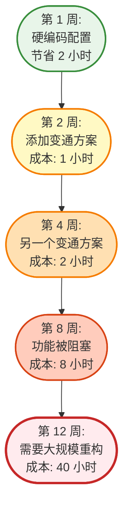
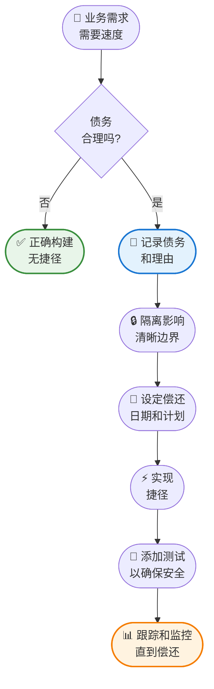
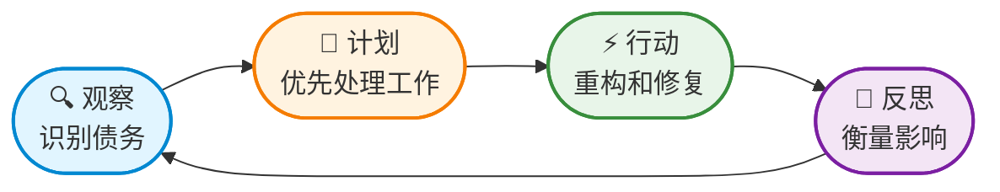
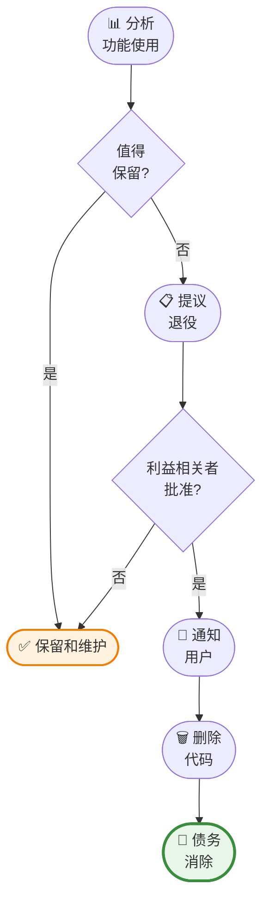
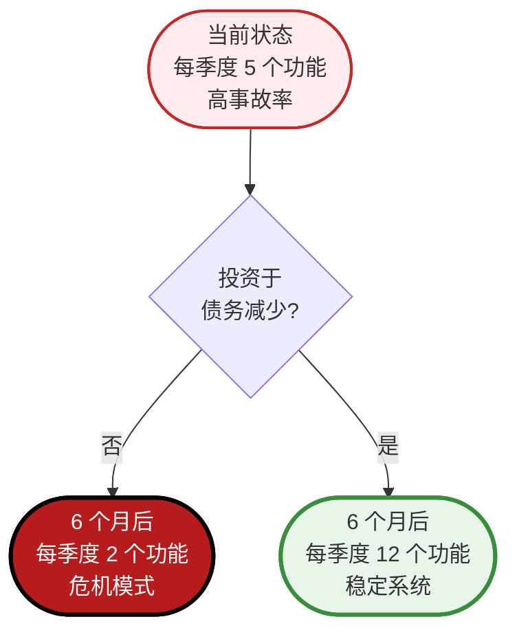
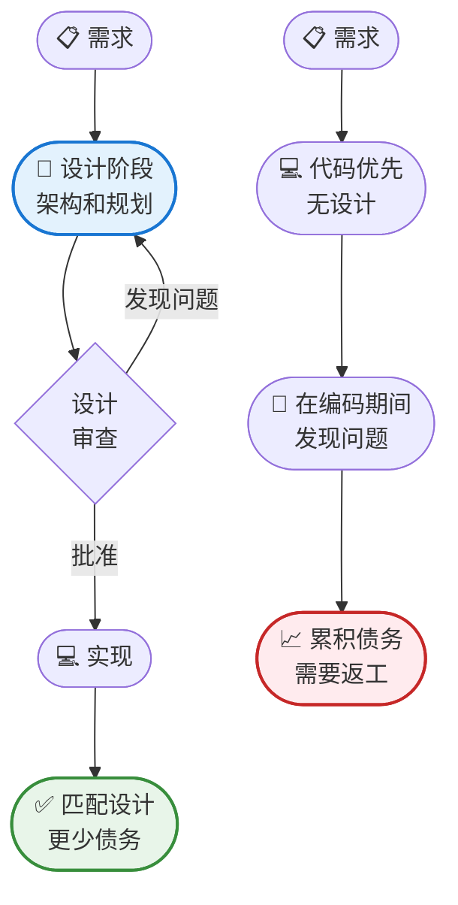

每个软件团队都面临同样的诱惑：现在走捷径，以后再修复。跳过重构。复制粘贴那段代码。硬编码那个配置值。今天发布功能，明天再清理。

但明天永远不会到来。

相反，这些捷径会不断累积。每一个都让下一个功能更难构建。测试变得不稳定。部署变得有风险。新开发人员难以理解代码库。最初的几个务实决策转变为压垮一切的负担，拖慢所有进度。

这就是技术债务——就像金融债务一样，它会产生复利。

## 什么是技术债务？

Ward Cunningham 在 1992 年创造了"技术债务"这个术语，用来描述完美代码与快速交付之间的权衡。就像金融债务让你现在获得某物、以后付款一样，技术债务让你通过推迟代码质量工作来更快地交付功能。

这个比喻很有力，因为它抓住了一个本质真理：债务本身并不坏。战略性债务可以加速增长。初创公司可能会故意累积技术债务，以便在竞争对手之前验证产品市场契合度。团队可能会走捷径来满足关键截止日期。

问题不在于债务本身——而在于未管理的债务。

## 为什么技术债务像金融债务一样产生复利

技术债务的"利息"不是比喻——它是随时间增长的真实成本。原因如下：

### 复利效应

对于金融债务，你为本金支付利息。对于技术债务，每次与有问题的代码交互时，你都要支付"利息"：

**初始债务**：你硬编码一个配置值，节省 2 小时。

**第一次利息支付**：下一个开发人员花 30 分钟弄清楚为什么配置在预发布环境中不起作用。

**第二次利息支付**：另一个开发人员花 1 小时添加变通方案，因为他们无法轻松更改硬编码值。

**第三次利息支付**：QA 花 2 小时调试为什么测试在 CI 中失败但在本地通过。

**第四次利息支付**：新团队成员在入职期间花 3 小时理解这些变通方案。

那个 2 小时的捷径现在已经花费了 6.5 小时的"利息"——而债务仍未偿还。它存在的时间越长，累积的利息就越多。

### 债务叠加债务

复利加速是因为新代码建立在旧债务之上：



**第 1 周**：你跳过适当的错误处理以更快交付。

**第 2 周**：另一个开发人员添加一个假设错误已处理的功能，创建了脆弱的代码。

**第 4 周**：第三个功能建立在第二个功能之上，现在有三层假设。

**第 8 周**：出现一个 bug，但很难修复，因为三个功能都依赖于这个错误的行为。

**第 12 周**：你终于重构，但现在必须更新三个功能，而不仅仅是最初的捷径。

在第 1 周需要 2 小时的修复，在第 12 周现在需要 40 小时。这就是复利。

### 认知负荷倍增

每一块债务都会增加心理开销：

- 开发人员必须记住"不要碰那个模块，它很脆弱"
- 代码审查需要更长时间，因为审查者必须理解变通方案
- 新功能需要绕过债务，减慢开发速度
- 调试变得更困难，因为行为与预期不符

这种认知负荷是每天持续支付的利息。

### 利率各不相同

并非所有债务的复利速度都相同：

**高利率债务**（快速复利）：
- 经常接触的核心模块
- 整个代码库使用的共享工具
- 其他团队依赖的公共 API
- 身份验证、授权、数据访问层

**低利率债务**（缓慢复利）：
- 很少修改的隔离功能
- 用户很少的内部工具
- 明确标记为临时的实验性代码
- 影响极少用户的边缘情况

!!!example "🎬 真实的复利"
    一个团队跳过数据库索引以更快交付（节省 1 天）。
    
    **第 1 个月**：查询缓慢但可接受（利息：0 小时）
    
    **第 3 个月**：开发人员添加查询变通方案（利息：4 小时）
    
    **第 6 个月**：客户投诉性能问题（利息：8 小时调查）
    
    **第 9 个月**：销售团队因演示缓慢而失去交易（利息：损失收入）
    
    **第 12 个月**：需要紧急性能冲刺（利息：80 小时 + 客户流失）
    
    1 天的捷径最终花费了 92 小时加上失去的客户。利率是毁灭性的，因为债务在高流量区域。

### 为什么复利会加速

**依赖链**：每个依赖于债务的新功能都会增加修复它的成本。

**知识衰减**：原始开发人员离开，带走了上下文。未来的开发人员支付更高的利息，因为他们必须逆向工程决策。

**风险规避**：随着债务老化，团队变得害怕修复它。"它已经工作多年了，不要碰它。"这种恐惧是在失去机会中支付的利息。

**机会成本**：花在绕过债务上的时间是没有花在有价值功能上的时间。这种隐藏的利息悄悄复利。

### 临界点

最终，债务达到一个临界点，利息支付超过你的开发能力：

- 花在变通方案上的时间多于功能
- 修复 bug 会产生新 bug
- 由于架构限制而"不可能"的功能
- 开发人员花更多时间理解代码而不是编写代码

在这一点上，你破产了——无法在不进行重大重组（重写）的情况下取得进展。

!!!tip "💡 支付利息 vs. 支付本金"
    每次你绕过债务而不是修复它时，你都在支付利息。
    
    每次你重构并消除债务时，你都在支付本金。
    
    目标不是零债务——而是确保利息支付不超过你交付价值的能力。


## 技术债务的类型

并非所有技术债务都是平等的。理解不同类型有助于你优先处理首先要解决的问题。

### 故意债务

这是有意识的、战略性的债务。团队知道他们在走捷径，并计划稍后解决。例如：

- 硬编码配置以满足截止日期
- 跳过 MVP 的边缘情况处理
- 最初使用更简单但可扩展性较差的架构

**特征**：有文档记录、被跟踪、有时间限制、有明确的偿还计划。

## 何时战略性地承担技术债务

有时承担技术债务是正确的商业决策。关键是有意识地、有准备地这样做，而不是鲁莽地。

### 产生债务的有效理由

**市场时机**：先发优势或竞争压力可能证明走捷径以更快交付是合理的。

**验证**：构建 MVP 以测试市场契合度，然后再投资于完美架构。

**关键截止日期**：监管合规、合同义务或时间敏感的机会。

**资源约束**：有限的预算或团队能力需要务实的权衡。

**学习**：对需求的不确定性建议先构建简单的东西，然后根据实际使用情况重构。

!!!warning "⚠️ 产生债务的糟糕理由"
    - "我们没有时间保证质量"（你以后会付出更多）
    - "我们最终会修复它"（没有具体计划）
    - "测试会拖慢我们"（bug 会让你更慢）
    - "没人会注意到"（他们会的，而且会很痛苦）

### 承担债务前的准备

如果你决定战略性地产生技术债务，请做好适当准备以确保你能偿还：

**1. 记录债务**

创建清晰的记录，说明你承担了什么债务以及为什么：

```markdown
## 技术债务：硬编码 API 端点

**产生日期**：2020-07-15
**原因**：需要在月底前交付 MVP 以进行投资者演示
**位置**：src/api/client.js 第 45-67 行
**影响**：无法轻松在开发/预发布/生产环境之间切换
**估计偿还工作量**：4 小时
**偿还截止日期**：第 12 个冲刺（测试版发布前）
**负责人**：@alice
```

没有文档，债务就会变得不可见并被遗忘。

**2. 隔离债务**

将捷径限制在特定模块或组件中：

- 使用清晰的边界（单独的文件、模块或服务）
- 添加标记债务位置的注释：`// TODO: 技术债务 - 为 MVP 硬编码`
- 避免让债务扩散到代码库的其他部分
- 创建允许未来替换而无需广泛更改的接口

**3. 设定偿还日期**

没有截止日期的债务永远不会被偿还：

- 安排特定的冲刺或时间块进行偿还
- 将偿还与业务里程碑联系起来（"测试版发布前"、"A 轮融资后"）
- 将债务项目添加到你的待办事项列表中并设置优先级
- 设置日历提醒以审查债务状态

**4. 估计利息**

了解债务随时间的成本：

- 这会在多大程度上减慢未来的功能？
- 如果我们不偿还它，风险是什么？
- 以后修复比现在修复难多少？
- 不正确做的机会成本是什么？

**5. 获得团队同意**

确保每个人都理解并接受权衡：

- 在团队会议或计划会议上讨论
- 记录谁批准了决定
- 确保未来的维护者能理解上下文
- 就偿还计划达成一致

**6. 保持测试覆盖率**

即使在走捷径时，也要保护自己：

- 为捷径实现编写测试
- 测试使以后重构更安全
- 测试记录预期行为
- 测试在你偿还债务时捕获回归

**7. 创建偿还计划**

在编写捷径代码之前，计划如何修复它：

- 正确的解决方案是什么？
- 需要更改什么才能实现它？
- 需要什么依赖项或先决条件？
- 你将如何测试重构版本？



!!!example "🎬 正确完成的战略债务"
    一家初创公司需要在 3 周内向投资者演示他们的产品。他们决定承担故意债务：
    
    **他们做了什么：**
    - 记录："为 MVP 使用内存存储而不是数据库"
    - 隔离：创建了一个可以稍后交换的存储接口
    - 设定截止日期："获得资金后实现适当的数据库"
    - 估计成本："添加数据库 + 迁移需要 2 周"
    - 编写测试：为存储接口编写全面测试
    - 创建计划：数据库实现的详细设计文档
    
    **结果：**
    - 按时交付演示，获得资金
    - 在 1.5 周内偿还债务（比估计快）
    - 测试确保重构期间没有回归
    - 干净的接口使交换变得简单
    
    这是正确完成的战略债务：有意识、有文档记录、已偿还。

### 危险信号：债务何时变得危险

注意这些警告信号，表明债务正在失控：

- **无文档**：团队无法列出存在哪些债务
- **无截止日期**：债务项目没有计划的偿还日期
- **扩散**：一个区域的捷径迫使其他地方也走捷径
- **被遗忘**：超过 6 个月的债务没有进展
- **累积**：在偿还旧债务之前承担新债务
- **阻塞**：债务阻止新功能或改进

如果你看到这些迹象，停止承担新债务并专注于偿还。

### 意外债务

这种债务源于缺乏知识或需求变化。团队根据可用信息尽力而为，但后来出现了更好的方法。例如：

- 选择一个被证明不足的框架
- 设计一个与实际使用模式不匹配的 API
- 在需求完全理解之前实现功能

**特征**：随时间发现，需要随着理解的提高而重构。

### 位腐烂债务

曾经良好的代码随着生态系统的发展逐渐变得有问题。例如：

- 具有安全漏洞的依赖项
- 使用已弃用 API 的代码
- 五年前是最佳实践但今天不是的模式

**特征**：不可避免，需要持续维护和更新。

### 鲁莽债务

这是来自糟糕实践、缺乏纪律或忽视已知最佳实践的债务。例如：

- 因为"测试太耗时"而没有测试
- 复制粘贴代码而不是创建可重用函数
- 忽略代码审查反馈以更快交付

**特征**：可避免，通常表明流程或文化问题。

!!!warning "⚠️ 鲁莽债务的危险"
    虽然故意债务可以是战略性的，但鲁莽债务几乎总是有害的。它表明开发实践中的系统性问题，这些问题将继续产生债务，直到在根本原因层面得到解决。
    
    许多形式的鲁莽债务源于[常见的反模式](/zh-CN/2022/04/Software-Development-Anti-Patterns/)，如上帝对象、货物崇拜编程和复制粘贴编程。识别并避免这些模式可以防止鲁莽债务的累积。

## 技术债务的真实成本

技术债务的成本不仅仅是混乱的代码——它影响软件开发的各个方面。

### 降低开发速度

随着债务累积，简单的更改需要更长时间。添加一个应该需要几小时的功能需要几天，因为开发人员必须导航复杂的代码、绕过限制并避免破坏脆弱的系统。


{
  "title": {
    "text": "随时间变化的开发速度"
  },
  "tooltip": {
    "trigger": "axis"
  },
  "legend": {
    "data": ["有债务管理", "无债务管理"]
  },
  "xAxis": {
    "type": "category",
    "data": ["第 1 个月", "第 3 个月", "第 6 个月", "第 9 个月", "第 12 个月"]
  },
  "yAxis": {
    "type": "value",
    "name": "交付的功能"
  },
  "series": [
    {
      "name": "有债务管理",
      "type": "line",
      "data": [10, 12, 13, 14, 15],
      "itemStyle": {
        "color": "#388e3c"
      }
    },
    {
      "name": "无债务管理",
      "type": "line",
      "data": [12, 11, 8, 5, 3],
      "itemStyle": {
        "color": "#c62828"
      }
    }
  ]
}


### 增加 Bug 率

结构不良的代码更难理解，更容易破坏。开发人员会犯错误，因为他们看不到更改的全部影响。测试不充分或完全缺失，因此 bug 会溜到生产环境。

### 更高的入职成本

当代码库是变通方案和未记录决策的迷宫时，新团队成员难以变得高效。本应需要几周的时间延长到几个月，因为他们要导航技术债务地雷。

### 团队士气影响

开发人员讨厌在混乱的代码库中工作。与技术债务作斗争的持续挫折会消耗动力和创造力。优秀的工程师会离开，寻找可以编写高质量代码的机会。

### 业务风险

技术债务造成脆弱性。系统变得更难更改，使得难以响应市场机会或竞争威胁。在极端情况下，债务可能使整个系统无法维护，需要昂贵的重写。

!!!example "🎬 真实世界的影响"
    一家金融科技初创公司在竞相推出时累积了大量技术债务。最初，他们快速交付功能。但到第六个月，开发速度下降了 70%。简单的更改需要触及数十个文件。测试不可靠。部署经常破坏生产环境。
    
    团队花了三个月偿还债务——重构核心系统、添加测试和记录架构。开发速度恢复了，他们终于可以再次可靠地交付功能。
    
    教训：忽视债务不会让它消失。它只会让最终的清算更加痛苦。

## 识别技术债务

你如何知道技术债务何时成为问题？注意这些警告信号：

### 代码异味

- **重复代码**：相同的逻辑在多个地方重复
- **长方法**：做太多事情的函数
- **大类**：具有太多职责的类
- **长参数列表**：需要许多参数的函数
- **发散式变化**：一个类因不同原因频繁修改
- **霰弹式修改**：单个更改需要跨多个类修改

### 流程指标

- **速度减慢**：过去需要几天的功能现在需要几周
- **Bug 率增加**：更多缺陷到达生产环境
- **部署恐惧**：团队因频繁破坏而对发布感到焦虑
- **入职困难**：新开发人员需要几个月才能变得高效
- **避免重构**：团队因风险而不愿改进代码

### 团队信号

- **开发人员挫折**：对代码质量的抱怨
- **变通方案文化**：团队经常绕过问题而不是修复它们
- **知识孤岛**：只有某些人可以在系统的某些部分工作
- **人员流失**：经验丰富的开发人员离开去更好的代码库

!!!tip "💡 童子军规则"
    "让代码比你发现时更好。"即使是小的改进也会随时间复利。每次提交修复一个代码异味。添加一个测试。改进一个函数名。这些微重构可以防止债务累积，而无需专门的重构冲刺。

## 衡量技术债务

你无法管理你无法衡量的东西。虽然技术债务部分是主观的，但几个指标提供了客观指标：

### 代码质量指标

**代码覆盖率**：测试执行的代码百分比。低覆盖率表示测试债务。

**圈复杂度**：基于决策点衡量代码复杂性。高复杂性表示难以理解和测试的代码。

**代码重复**：重复代码的百分比。高重复表示维护负担。

**技术债务比率**：修复债务的估计成本除以从头重建的成本。行业标准建议将其保持在 5% 以下。

### 基于时间的指标

**添加功能的时间**：跟踪类似功能随时间需要多长时间。持续时间增加表示债务累积。

**Bug 修复时间**：解决缺陷的平均时间。时间增加表明代码变得更难处理。

**入职时间**：新开发人员需要多长时间才能变得高效。时间增加表示复杂性增长。

### 静态分析工具

现代工具可以自动检测债务指标：

- **SonarQube**：全面的代码质量和安全分析
- **CodeClimate**：可维护性和测试覆盖率跟踪
- **ESLint/Pylint**：特定语言的 linter 捕获常见问题
- **依赖检查器**：识别过时或有漏洞的依赖项

!!!anote "📊 建立基线"
    指标在随时间跟踪时最有价值。为你的关键指标建立基线，然后监控趋势。单个快照告诉你很少；趋势揭示债务是在增长还是缩小。

## 管理技术债务

有效的债务管理需要策略、纪律和持续努力。以下是如何处理它：

### 观察-计划-行动-反思循环

管理技术债务遵循持续改进循环：



**观察**：定期评估你的代码库。使用静态分析工具、审查指标并听取开发人员的反馈。债务在哪里累积？什么造成了最大的痛苦？

**计划**：根据影响和工作量优先处理债务。并非所有债务都值得立即关注。专注于积极减慢开发或增加风险的债务。

**行动**：通过重构、添加测试、更新依赖项或改进文档来解决债务。使债务工作可见并为其分配时间。

**反思**：衡量你努力的影响。速度提高了吗？Bug 在减少吗？使用这些见解来改进你的方法。

### 优先级框架

使用此矩阵优先处理技术债务：

| 影响 | 低工作量 | 高工作量 |
|--------|-----------|----------------|
| **高影响** | 立即做 | 尽快安排 |
| **中等影响** | 方便时做 | 仔细评估 |
| **低影响** | 仅快速胜利 | 可能忽略 |

**高影响、低工作量**：这些是你的快速胜利。立即修复它们。

**高影响、高工作量**：为这些安排专门时间。它们值得投资。

**低影响、高工作量**：通常不值得解决，除非它们阻塞其他工作。

### 分配策略

**20% 规则**：将每个冲刺的 20% 用于债务减少。这可以防止债务累积，同时保持功能速度。

**债务冲刺**：定期安排整个冲刺专注于债务减少。在主要发布后或债务达到临界水平时使用这些。

**机会主义重构**：在处理功能时，改进周围的代码。这将债务工作分散到所有开发活动中。

**绞杀者模式**：对于大规模重构，逐步用新实现替换旧系统，而不是尝试大爆炸式重写。

**需求消除**：有时消除债务的最佳方法是消除创建它的需求。

!!!warning "⚠️ 重写陷阱"
    当债务变得压倒性时，团队经常考虑完全重写。这通常是一个错误。重写比预期需要更长时间，引入新 bug，并累积新债务。除非系统真正无法维护，否则更喜欢增量重构。

### 创造性方法：消除需求而不是偿还债务

管理技术债务最被忽视的策略是质疑代码是否需要存在。与其重构复杂代码，不如问："我们还需要这个功能吗？"

**核心见解**：每一行代码都是负债。最好的代码是没有代码。如果你可以消除需求，你就消除了与之相关的债务。

#### 为什么需求会过时

**市场演变**：为昨天的市场构建的功能今天可能无关紧要。那个自定义报告模块？用户现在导出到 Excel。

**用户行为改变**：分析显示 0.1% 的用户接触一个消耗 20% 代码库复杂性的功能。

**业务转向**：公司改变了战略，但支持旧战略的代码仍然存在。

**存在变通方案**：用户找到了更好的方法来完成他们的目标，使原始功能变得多余。

**合规性改变**：需要某些功能的法规被更新或删除。

**更好的替代方案**：第三方服务现在处理你为之构建自定义解决方案的内容。

#### 需求消除流程

**1. 识别候选需求**

寻找：
- 使用率低的功能（< 5% 的用户）
- 维护成本高的代码
- 在其他地方重复的功能
- 阻止架构改进的功能
- 来自离开公司的利益相关者的需求

**2. 收集使用数据**

在提议消除之前，收集证据：

```markdown
## 功能分析：高级搜索过滤器

**使用数据（过去 90 天）：**
- 总用户：10,000
- 访问功能的用户：47（0.47%）
- 每个用户的平均使用次数：1.2
- 支持工单：12（都是关于如何使用的困惑）

**维护成本：**
- 代码复杂性：高（涉及 15 个文件）
- Bug 率：每季度 3 个 bug
- 修改时间：平均 8 小时
- 阻止迁移到新搜索引擎

**业务价值：**
- 收入影响：$0（不是付费功能）
- 客户请求：过去一年 0 个
- 竞争优势：无（竞争对手也没有）
```

**3. 提议需求退役**

向利益相关者展示：

**选项 A：保留功能**
- 成本：每季度 40 小时维护
- 收益：47 个用户（0.47%）可以使用它
- 阻塞：迁移到新搜索架构

**选项 B：删除功能**
- 成本：8 小时删除代码
- 收益：消除 15 个文件的复杂性，解除搜索迁移阻塞
- 风险：47 个用户失去功能（可以使用基本搜索代替）
- 缓解：在删除前 30 天通过电子邮件通知受影响的用户

**4. 沟通变更**

如果获得批准，通知受影响的用户：

```
主题：高级搜索过滤器将于 8 月 1 日退役

我们正在简化我们的搜索体验。高级搜索过滤器功能将于 2020 年 8 月 1 日退役。

为什么？使用数据显示 99.5% 的用户依赖我们的标准搜索，我们正在积极改进它。

怎么办：标准搜索现在包括高级搜索中最常用的过滤器。对于复杂查询，你可以导出结果并在 Excel 中过滤。

有问题？回复此电子邮件。
```

**5. 删除代码**

一旦需求退役：
- 删除代码（不要只是注释掉）
- 删除相关测试
- 更新文档
- 删除 UI 元素
- 如果安全，清理数据库表
- 庆祝复杂性的减少



#### 要挑战的需求类型

**非功能需求（NFR）：**

**性能需求**："系统必须处理每秒 100 万个请求"——但实际峰值是 1 万。放宽这一点可以消除复杂的缓存层。

**可用性需求**："99.99% 的正常运行时间"用于仅在工作时间使用的内部工具。降至 99.9% 可以消除昂贵的冗余。

**可扩展性需求**："必须扩展到 1 亿用户"，而你有 1 万用户。删除过早扩展可以消除架构复杂性。

**浏览器支持**："必须支持 IE11"，而分析显示 0.01% 的 IE11 用户。放弃它可以消除 polyfill 和变通方案。

**功能需求（FR）：**

**未使用的功能**：看起来重要但用户忽略的功能。

**冗余功能**：做同一件事的多种方式。

**遗留集成**：与不再使用的系统的集成。

**过度工程的解决方案**：简单问题的复杂实现。

!!!example "🎬 真实需求消除成功"
    一家 SaaS 公司有一个自定义 PDF 生成引擎，这是一个维护噩梦。分析显示：
    
    **使用**：每月 200 个用户生成 PDF（用户群的 2%）
    **成本**：每季度 120 小时维护引擎
    **债务**：阻止升级到新框架
    
    **解决方案**：用第三方 PDF 服务替换（每月 $50）
    
    **结果：**
    - 删除了 8,000 行复杂代码
    - 消除了 3 个有安全问题的依赖项
    - 解除了框架升级的阻塞
    - 节省了每季度 120 小时
    - 成本：每月 $50 vs. 每季度 $15,000 的开发人员时间
    
    需求没有消失——但债务消失了。

#### 协商需求变更

**与产品经理：**

"这个功能每季度花费我们 40 小时维护，被 0.5% 的用户使用。如果我们删除它并将这 40 小时投资于 80% 用户请求的功能 X 怎么样？"

**与客户：**

"我们正在将开发重点放在 95% 客户每天使用的功能上。功能 Y 将被退役，但我们正在添加功能 A、B 和 C，它们更好地解决了同样的问题。"

**与高管：**

"通过退役这 5 个低使用率功能，我们可以将 Q4 路线图交付速度提高 30%。这消除了 12,000 行减慢我们每次更改的代码。"

#### 应用 80/20 规则

通常，80% 的技术债务来自 20% 的功能——通常是使用最少的功能。消除那 20% 可以消除 80% 的维护负担。

**审计练习：**

1. 列出应用程序中的所有功能
2. 为每个功能添加使用数据（用户、频率、收入影响）
3. 为每个功能添加维护成本（bug、复杂性、修改时间）
4. 按成本价值比排序
5. 挑战底部 20%

!!!tip "💡 删除的勇气"
    开发人员喜欢构建功能。删除它们感觉像失败。但你删除的每个功能：
    - 减少认知负荷
    - 加快开发速度
    - 减少 bug 表面积
    - 简化测试
    - 改善用户体验（更少令人困惑的选项）
    
    删除不是失败——而是战略重点。

#### 何时不消除需求

**监管/合规**：如果法律要求，你不能删除它（但你可以简化实现）。

**合同义务**：如果客户有保证功能的合同，在删除前协商。

**关键路径**：使用率低但重要性高的功能（例如，很少使用但必不可少的密码重置）。

**战略差异化因素**：定义你竞争优势的功能，即使使用率低。

**安全/安全性**：保护用户或数据的功能，无论直接使用情况如何。

#### 结合方法

最有效的策略结合需求消除与传统债务偿还：

1. **消除**：删除 20% 的功能（最低价值、最高成本）
2. **简化**：减少 30% 功能的需求（"足够好" vs. "完美"）
3. **重构**：偿还剩余 50% 高价值功能中的债务

这种方法比重构所有内容提供更快的结果。

!!!success "✨ 终极债务减少"
    消除技术债务的最快方法是完全消除代码。在花费数周重构复杂模块之前，问："我们还需要这个吗？"答案可能会为你节省数月的工作。

## 寻求技术债务偿还的赞助

技术债务对非技术利益相关者是不可见的。获得高管赞助需要将技术问题转化为业务影响。

### 何时寻求赞助

**债务阻塞业务目标**：当技术债务阻止交付客户需要或高管承诺的功能时。

**速度危机**：当开发速度显著下降且团队无法履行承诺时。

**质量危机**：当生产事故、客户投诉或安全漏洞增加时。

**人才风险**：当优秀开发人员因代码库挫折而离开，或因声誉而难以招聘时。

**竞争威胁**：当竞争对手因你被债务拖慢而行动更快时。

**重大计划在即**：在开始将受现有债务阻碍的大型项目之前。

!!!anote "📊 时机很重要"
    当你有证据而不仅仅是抱怨时寻求赞助。等到你可以显示指标、事故或明确的业务影响。没有数据的过早请求会被视为"开发人员完美主义"而被驳回。

### 获得赞助的策略

**1. 说业务语言，而不是技术术语**

不要说："我们的身份验证模块具有高圈复杂度并缺乏适当的抽象。"

要说："我们的登录系统很脆弱。上个月，一个简单的更改导致了 2 小时的停机，影响了 10,000 个用户。每次修复需要的时间是应该的 3 倍。"

**翻译指南：**

| 技术术语 | 业务影响 |
|----------------|-------------------|
| 高复杂性 | 功能交付更慢，更多 bug |
| 测试覆盖率差 | 生产事故，客户影响 |
| 过时的依赖项 | 安全漏洞，合规风险 |
| 紧耦合 | 无法在不破坏其他功能的情况下添加功能 |
| 代码重复 | 同一个 bug 出现在多个地方 |
| 缺少文档 | 新开发人员需要几个月才能入职 |

**2. 量化成本**

高管理解数字。以他们关心的术语显示债务的成本：

**开发速度影响：**
- "过去需要 2 周的功能现在需要 6 周"
- "我们每季度交付的功能减少了 40%"
- "简单的更改需要触及 20 多个文件"

**财务影响：**
- "我们花费了 $50K 的加班费修复由这笔债务引起的生产事故"
- "入职成本从每个开发人员 $10K 增加到 $30K"
- "我们失去了一笔 $200K 的交易，因为我们无法及时交付功能"

**客户影响：**
- "客户满意度从 4.5 星下降到 3.2 星"
- "由于 bug，支持工单增加了 60%"
- "三个企业客户威胁要离开"

**3. 显示趋势**

一个数据点是轶事。趋势是危机。


{
  "title": {
    "text": "功能交付速度下降"
  },
  "tooltip": {
    "trigger": "axis"
  },
  "xAxis": {
    "type": "category",
    "data": ["2019 Q1", "2019 Q2", "2019 Q3", "2019 Q4", "2020 Q1", "2020 Q2"]
  },
  "yAxis": {
    "type": "value",
    "name": "交付的功能"
  },
  "series": [{
    "type": "line",
    "data": [15, 14, 12, 9, 7, 5],
    "itemStyle": {
      "color": "#c62828"
    },
    "markLine": {
      "data": [
        { "type": "average", "name": "平均" }
      ]
    }
  }]
}


显示速度下降、事故增加或成本上升的趋势。趋势是不可否认的。

**4. 提供带权衡的选项**

不要要求解决方案。提供选项：

**选项 A：什么都不做**
- 成本：前期 $0
- 影响：速度继续每季度下降 10%
- 风险：6 个月内可能发生重大停机
- 时间表：立即

**选项 B：增量偿还（推荐）**
- 成本：6 个月内 20% 的冲刺能力
- 影响：速度稳定，然后提高 30%
- 风险：最小，工作与功能同时进行
- 时间表：6 个月显著改善

**选项 C：专门的重构冲刺**
- 成本：2 个冲刺，没有新功能
- 影响：之后速度立即提高 50%
- 风险：功能交付暂停 4 周
- 时间表：1 个月完成

**选项 D：完全重写**
- 成本：6-12 个月，整个团队
- 影响：现代架构，但有新 bug
- 风险：高——可能需要更长时间，累积新债务
- 时间表：12 个月以上

让高管根据业务优先级选择。

**5. 连接到战略目标**

将债务偿还与公司目标对齐：

- "为了达到我们的 Q4 收入目标，我们需要交付 3 个主要功能。当前债务意味着我们只能交付 1 个。"
- "董事会希望我们扩展到 100 万用户。我们当前的架构在 10 万用户时就会崩溃。"
- "我们下个季度要招聘 5 名开发人员。有了当前的债务，他们的入职将花费 $150K 而不是 $50K。"

**6. 提议试点**

通过从小处开始来降低风险：

"让我们花一个冲刺偿还身份验证模块中的债务。我们将衡量对速度和 bug 率的影响。如果有效，我们将扩展到其他领域。"

试点以最小的承诺证明价值。

### 如何呈现案例

**准备一页高管摘要：**

```markdown
# 技术债务偿还提案

## 问题
开发速度在 18 个月内下降了 60%。过去需要 2 周的功能现在需要 5 周。我们错过了承诺并失去了竞争优势。

## 根本原因
核心模块中累积的技术债务。代码脆弱、测试不足且难以安全修改。

## 业务影响
- 失去 $300K 交易（无法及时交付功能）
- 客户满意度从 4.5 下降到 3.2
- 3 名高级开发人员因代码库挫折而离开
- 生产事故同比增加 80%

## 提议的解决方案
将 6 个月内 20% 的冲刺能力用于债务减少。

## 预期结果
- 6 个月内速度提高 40%
- 生产事故减少 50%
- 开发人员满意度提高
- 入职时间从 3 个月减少到 6 周

## 成本
- 20% 能力 = 每季度少 2 个功能
- 替代方案：继续当前轨迹，12 个月内速度降至零

## 请求
批准将 20% 的冲刺能力分配给技术债务减少，每月进度审查。
```

**用视觉呈现：**



**预测反对意见：**

**反对意见**："我们没有时间，我们现在需要功能。"
**回应**："我们已经通过更慢的交付支付了时间成本。这项投资可以收回那段时间。"

**反对意见**："开发人员不能只是编写更好的代码吗？"
**回应**："债务已经存在。我们需要专门的时间来修复它，而不仅仅是避免使它变得更糟。"

**反对意见**："我们怎么知道这会有效？"
**回应**："让我们在一个模块上运行 2 周的试点并衡量结果。低风险，高学习。"

**反对意见**："这听起来很贵。"
**回应**："什么都不做更贵。我们每月在失去的交易和事故中损失 $X。这在 Y 个月内就能收回成本。"

### 建立持续赞助

一旦你获得初步批准，保持赞助：

**1. 定期报告进度**

每月更新显示：
- 完成的债务项目
- 速度改善
- 事故减少
- 开发人员满意度分数

**2. 庆祝胜利**

当债务减少实现业务胜利时，宣传它：
- "我们在 2 周而不是 6 周内交付了功能 X，因为我们重构了模块 Y"
- "重构登录系统后，本月零身份验证事故"

**3. 使债务可见**

创建高管可以检查的仪表板：
- 技术债务比率趋势下降
- 速度趋势上升
- 事故计数趋势下降
- 测试覆盖率趋势上升

**4. 连接到业务结果**

始终将技术改进与业务结果联系起来：
- "更快的交付" → "抢先竞争对手进入市场"
- "更少的 bug" → "更高的客户满意度"
- "更好的架构" → "可以扩展到 10 倍用户"

!!!example "🎬 成功的赞助故事"
    一个开发团队的速度在 2 年内下降了 70%。工程经理准备了一个演示：
    
    **呈现的数据：**
    - 显示速度下降的图表
    - 错过的承诺和失去的交易列表
    - 计算：债务每年花费 $500K 的生产力损失
    - 提案：6 个月债务减少计划
    
    **高管回应：**
    "你为什么不早点告诉我们？这解释了为什么我们错过目标。批准。"
    
    **6 个月后的结果：**
    - 速度提高 60%
    - 生产事故下降 75%
    - 团队交付了 3 个以前"不可能"的主要功能
    - 工程经理因扭转团队而获得晋升
    
    关键：说业务语言并显示明确的投资回报率。

### 危险信号：赞助请求何时失败

**模糊的抱怨**："代码很乱"得不到预算。"我们每月在事故中损失 $50K"可以。

**无数据**：没有指标的轶事被视为意见而被驳回。

**全有或全无**：要求 6 个月没有功能会被拒绝。提议 20% 能力会被批准。

**技术术语**：高管不关心"紧耦合"。他们关心"无法在不破坏其他功能的情况下添加功能"。

**无业务连接**：如果你无法解释为什么这对客户或收入很重要，你就不会获得赞助。

!!!tip "💡 黄金法则"
    高管赞助解决业务问题的计划，而不是技术问题。你的工作是将技术债务转化为业务影响。掌握这种转化，你就会获得所需的赞助。

## 预防技术债务

预防比治疗更容易。建立最小化债务累积的实践：

### 设计优先方法

预防技术债务最有效的方法之一是在编码前思考。设计优先意味着在编写实现代码之前理解问题、探索解决方案并做出架构决策。

**为什么设计优先预防债务：**

**防止意外债务**：当你先设计时，你会在架构不匹配嵌入代码之前捕获它们。你发现你的初始 API 设计不支持未来需求，或者你的数据库模式无法扩展——而这些仍然很容易修复。

**减少返工**：更改设计文档需要几分钟。重构已实现的代码需要几小时或几天。设计优先将思考前置，减少昂贵的实现更改。

**实现更好的决策**：设计阶段允许你有意识地评估权衡。你应该使用微服务还是单体？SQL 还是 NoSQL？这些决策一旦实现就很难逆转。

**改善沟通**：设计文档在团队中创建共同理解。每个人都知道正在构建什么以及为什么，减少创建债务的不一致实现。

**捕获需求差距**：设计迫使你思考边缘情况、错误处理和集成点。你在编写需要返工的代码之前发现缺失的需求。



**实用的设计优先实践：**

**架构决策记录（ADR）**：记录重要决策、考虑的替代方案和理由。这可以防止未来的开发人员想知道"他们为什么这样做？"

**API 设计审查**：在实现之前设计和审查 API。模拟它们，用样本数据测试，确保它们满足实际用例。

**数据库模式规划**：在创建表之前对数据建模。考虑访问模式、关系和未来增长。

**概念验证**：对于不确定的技术决策，在承诺完整实现之前构建小型原型来验证方法。

**设计审查**：在编码开始之前让团队成员审查设计。新鲜的视角会捕获你错过的问题。

!!!example "🎬 设计优先成功故事"
    一个团队正在构建通知系统。他们没有直接跳入代码，而是花了两天设计：
    - 通知如何排队和交付
    - 交付失败时会发生什么
    - 如何处理速率限制
    - 跟踪通知状态的数据库模式
    
    在设计审查期间，他们发现他们的初始方法无法处理所需的规模。他们使用消息队列架构重新设计。
    
    这两天的设计投资防止了数周的重构，如果他们在实现后发现可扩展性问题，就需要这些重构。

**何时跳过设计优先：**

设计优先并不总是合适的：

**探索性工作**：当你在实验以理解问题时，代码优先探索可能更快。只需将代码视为一次性的。

**充分理解的模式**：对于使用既定模式的常规功能，广泛的设计可能是过度的。

**原型和 MVP**：当快速验证想法时，故意的技术债务可能是可接受的。

关键是有意识。如果你跳过设计，承认你正在产生债务并计划解决它。

!!!tip "💡 轻量级设计"
    设计优先并不意味着数周的 UML 图和正式规范。对于大多数功能，一个简单的文档涵盖：
    - 我们正在解决什么问题？
    - 我们将采取什么方法？
    - 关键组件及其交互是什么？
    - 可能出什么问题？
    
    这需要 30-60 分钟，可以防止数小时的返工。

### 代码审查

严格的代码审查在债务进入代码库之前捕获它。审查者应该问：
- 这段代码可维护吗？
- 有测试吗？
- 这遵循我们的标准吗？
- 有更简单的方法吗？

### 自动化质量门

配置 CI/CD 管道以强制执行质量标准：
- 最低测试覆盖率阈值
- 复杂性限制
- 安全漏洞扫描
- 依赖项新鲜度检查

### 完成的定义

在你的完成定义中包括质量标准：
- 代码已审查并批准
- 测试已编写并通过
- 文档已更新
- 没有新的静态分析警告

### 技术债务登记册

维护已知债务的可见登记册：
- 债务是什么？
- 为什么产生？
- 影响是什么？
- 解决它的计划是什么？

这种透明度可以防止债务被遗忘并帮助优先处理工作。

### 持续学习

投资于团队技能以防止意外债务：
- 定期培训最佳实践
- 架构审查
- 知识分享会议
- 结对编程

!!!success "✨ 建立质量文化"
    最有效的债务预防是文化性的。当团队重视代码质量、为他们的工作感到自豪并有权推回不切实际的截止日期时，债务累积得更慢。质量不是一个阶段——而是一种心态。

## 未来：AI 辅助债务管理

展望未来，人工智能将改变我们管理技术债务的方式。虽然今天的工具需要人类判断来识别和优先处理债务，但明天的 AI 智能体将主动检测、优先处理甚至自动重构有问题的代码。

想象一个 AI 助手：
- 持续扫描你的代码库以查找债务指标
- 根据对开发速度的实际影响优先处理债务
- 提出重构策略，估计工作量和收益
- 在非工作时间自动重构低风险债务
- 学习你团队的编码标准并一致地执行它们

这不是科幻小说——基础今天就存在。随着 AI 编码工具从简单的代码补全发展到能够理解整个代码库的自主智能体，它们将成为对抗技术债务的强大盟友。

关键是平衡自动化与人类判断。AI 可以识别模式并执行重构，但人类必须做出关于优先级、可接受权衡和架构方向的战略决策。

!!!tip "🔮 为 AI 辅助重构做准备"
    要从未来的 AI 工具中受益：
    - 维护全面的测试（AI 需要这些来验证重构安全性）
    - 记录架构决策（AI 需要上下文来做出好的选择）
    - 建立明确的编码标准（AI 需要规则来执行）
    - 建立持续改进的文化（AI 放大现有实践）

## 结论：债务不可避免，管理至关重要

技术债务不是失败——它是软件开发不可避免的一部分。随着需求变化、技术发展和团队学习更好的方法，每个代码库都会累积债务。

问题不在于你是否会有技术债务。问题是你是否会有意识地管理它，还是让它管理你。

将债务视为战略工具的团队——在有益时有意识地产生它、持续偿还它并防止鲁莽累积——随着时间的推移保持高速度和代码质量。忽视债务的团队发现自己被困在抵制变化、让开发人员沮丧并最终需要昂贵重写的代码库中。

选择权在你手中。你会管理你的债务，还是让你的债务管理你？

!!!quote "💭 记住"
    "技术债务就像信用卡。明智使用，它会加速进步。鲁莽使用，它会导致破产。关键是知道何时借款并始终有偿还计划。"

## 实用的下一步

准备好解决代码库中的技术债务了吗？从这里开始：

1. **评估当前状态**：运行静态分析工具并审查关键指标以了解你的债务水平
2. **识别痛点**：询问你的团队什么代码造成最大挫折并拖慢他们
3. **优先处理**：使用影响/工作量矩阵识别首先要解决的高价值债务
4. **分配时间**：承诺将每个冲刺的 20% 用于债务减少
5. **衡量进度**：跟踪速度、bug 率和开发人员满意度以验证改进
6. **预防新债务**：实施代码审查标准和自动化质量门
7. **使其可见**：创建债务登记册并在冲刺计划中讨论它

技术债务管理不是一次性项目——而是持续的实践。从小处开始，建立动力，逐步将你的代码库从负担转变为资产。

开始管理技术债务的最佳时间是昨天。第二好的时间是今天。
