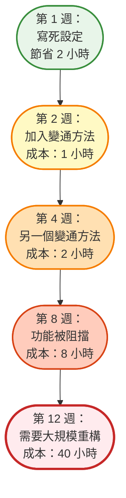

每個軟體團隊都面臨同樣的誘惑：現在走捷徑，之後再修正。跳過重構。複製貼上那段程式碼。寫死設定值。今天先發布功能，明天再清理。

但明天永遠不會到來。

相反地，這些捷徑不斷累積。每一個都讓下一個功能更難建構。測試變得不穩定。部署變得危險。新開發者難以理解程式碼庫。原本只是幾個務實的決定，最終轉變成拖慢一切的沉重負擔。

這就是技術債——就像金融債務一樣，它會複利累積。

## 什麼是技術債？

Ward Cunningham 在 1992 年創造了「技術債」這個詞，用來描述完美程式碼與快速交付之間的權衡。就像金融債務讓你現在取得某物、之後再付款一樣，技術債讓你透過延遲程式碼品質工作來更快交付功能。

這個比喻很有力量，因為它捕捉了一個本質真理：債務本身並不壞。策略性債務可以加速成長。新創公司可能會刻意累積技術債，以在競爭對手之前驗證產品市場契合度。團隊可能會為了達成關鍵期限而走捷徑。

問題不在於債務本身——而在於未管理的債務。

## 為什麼技術債會像金融債務一樣複利累積

技術債的「利息」不是比喻——它是隨時間增長的真實成本。原因如下：

### 複利效應

對於金融債務，你要為本金支付利息。對於技術債，每次與有問題的程式碼互動時，你都要支付「利息」：

**初始債務**：你寫死一個設定值，節省 2 小時。

**第一次利息支付**：下一位開發者花 30 分鐘搞清楚為什麼設定在測試環境不能運作。

**第二次利息支付**：另一位開發者花 1 小時加入變通方法，因為他們無法輕易改變寫死的值。

**第三次利息支付**：QA 花 2 小時除錯為什麼測試在 CI 失敗但在本地通過。

**第四次利息支付**：新團隊成員在入職期間花 3 小時理解這些變通方法。

那個 2 小時的捷徑現在已經花費了 6.5 小時的「利息」——而債務仍未償還。它存在的時間越長，累積的利息就越多。

### 債務疊加債務

複利加速是因為新程式碼建立在舊債務之上：



**第 1 週**：你跳過適當的錯誤處理以更快交付。

**第 2 週**：另一位開發者加入一個假設錯誤已被處理的功能，創造出脆弱的程式碼。

**第 4 週**：第三個功能建立在第二個之上，現在有三層深的假設。

**第 8 週**：出現一個錯誤，但很難修正，因為三個功能都依賴於這個錯誤的行為。

**第 12 週**：你終於重構，但現在必須更新三個功能，而不只是原始的捷徑。

在第 1 週需要 2 小時的修正，到第 12 週需要 40 小時。這就是複利。

### 認知負荷倍增

每一筆債務都增加心理負擔：

- 開發者必須記住「不要碰那個模組，它很脆弱」
- 程式碼審查需要更長時間，因為審查者必須理解變通方法
- 新功能需要繞過債務，減慢開發速度
- 除錯變得更困難，因為行為不符合預期

這種認知負荷是每天持續支付的利息。

### 利率各不相同

並非所有債務的複利速度都相同：

**高利率債務**（快速複利）：
- 經常被觸及的核心模組
- 整個程式碼庫使用的共享工具
- 其他團隊依賴的公開 API
- 身份驗證、授權、資料存取層

**低利率債務**（緩慢複利）：
- 很少修改的獨立功能
- 使用者很少的內部工具
- 明確標記為臨時的實驗性程式碼
- 影響極少使用者的邊緣案例

!!!example "🎬 真實的複利案例"
    一個團隊跳過資料庫索引以更快交付（節省 1 天）。
    
    **第 1 個月**：查詢緩慢但可接受（利息：0 小時）
    
    **第 3 個月**：開發者加入查詢變通方法（利息：4 小時）
    
    **第 6 個月**：客戶抱怨效能（利息：8 小時調查）
    
    **第 9 個月**：銷售團隊因為展示緩慢而失去交易（利息：損失收入）
    
    **第 12 個月**：需要緊急效能衝刺（利息：80 小時 + 客戶流失）
    
    這個 1 天的捷徑最終花費了 92 小時加上流失的客戶。利率是毀滅性的，因為債務在高流量區域。

### 為什麼複利會加速

**依賴鏈**：每個依賴於債務的新功能都會增加修正它的成本。

**知識衰減**：原始開發者離開，帶走了背景知識。未來的開發者支付更高的利息，因為他們必須逆向工程決策。

**風險規避**：隨著債務老化，團隊變得害怕修正它。「它已經運作多年了，不要碰它。」這種恐懼是以失去機會的形式支付的利息。

**機會成本**：花在繞過債務的時間就是沒有花在有價值功能上的時間。這種隱藏的利息默默複利。

### 臨界點

最終，債務達到一個臨界點，利息支付超過你的開發能力：

- 花在變通方法上的時間多於功能
- 修正錯誤會產生新錯誤
- 由於架構限制，功能變得「不可能」
- 開發者花更多時間理解程式碼而不是編寫程式碼

在這一點上，你破產了——無法在不進行重大重組（重寫）的情況下取得進展。

!!!tip "💡 支付利息 vs. 支付本金"
    每次你繞過債務而不是修正它，你就是在支付利息。
    
    每次你重構並消除債務，你就是在支付本金。
    
    目標不是零債務——而是確保利息支付不超過你交付價值的能力。


## 技術債的類型

並非所有技術債都是平等的。理解不同類型有助於你優先處理首先要解決的問題。

### 刻意債務

這是有意識的、策略性的債務。團隊知道他們正在走捷徑，並計劃稍後解決。例子包括：

- 為了達成期限而寫死設定
- 為 MVP 跳過邊緣案例處理
- 最初使用更簡單但擴展性較差的架構

**特徵**：有文件記錄、被追蹤、有時間限制，並有明確的償還計劃。

### 意外債務

這種債務源於缺乏知識或需求變化。團隊根據可用資訊盡力而為，但後來出現了更好的方法。例子包括：

- 選擇一個被證明不足的框架
- 設計一個與實際使用模式不匹配的 API
- 在需求完全理解之前實作功能

**特徵**：隨時間發現，需要隨著理解的提高而重構。

### 位元腐爛債務

曾經良好的程式碼隨著生態系統的演進逐漸變得有問題。例子包括：

- 具有安全漏洞的依賴項
- 使用已棄用 API 的程式碼
- 五年前是最佳實踐但今天不是的模式

**特徵**：不可避免，需要持續維護和更新。

### 魯莽債務

這是來自糟糕實踐、缺乏紀律或忽視已知最佳實踐的債務。例子包括：

- 因為「測試太耗時」而沒有測試
- 複製貼上程式碼而不是建立可重用函式
- 忽略程式碼審查回饋以更快交付

**特徵**：可避免，通常表明流程或文化問題。

!!!warning "⚠️ 魯莽債務的危險"
    雖然刻意債務可以是策略性的，但魯莽債務幾乎總是有害的。它表明開發實踐中的系統性問題，這些問題將繼續產生債務，直到在根本原因層面得到解決。
    
    許多形式的魯莽債務源於[常見的反模式](/zh-TW/2022/04/Software-Development-Anti-Patterns/)，如上帝物件、貨物崇拜程式設計和複製貼上程式設計。識別並避免這些模式可以防止魯莽債務的累積。

## 何時策略性地承擔技術債

有時承擔技術債是正確的商業決策。關鍵是刻意地、有準備地做，而不是魯莽地做。

### 產生債務的正當理由

**市場時機**：先行者優勢或競爭壓力可能證明走捷徑以更快交付是合理的。

**驗證**：建構 MVP 以在投資完美架構之前測試市場契合度。

**關鍵期限**：法規遵循、合約義務或時間敏感的機會。

**資源限制**：有限的預算或團隊能力需要務實的權衡。

**學習**：需求的不確定性建議先建構簡單的東西，然後根據實際使用情況重構。

!!!warning "⚠️ 產生債務的不良理由"
    - 「我們沒有時間追求品質」（你之後會付出更多）
    - 「我們最終會修正它」（沒有具體計劃）
    - 「測試會拖慢我們」（錯誤會拖慢你更多）
    - 「沒人會注意到」（他們會的，而且會很痛）

### 承擔債務前的準備

如果你決定策略性地產生技術債，請適當準備以確保你能償還它：

**1. 記錄債務**

建立清楚的記錄，說明你正在承擔什麼債務以及為什麼：

```markdown
## 技術債：寫死的 API 端點

**產生日期**：2020-07-15
**原因**：需要在月底前交付 MVP 以進行投資者展示
**位置**：src/api/client.js 第 45-67 行
**影響**：無法輕易在開發/測試/生產環境之間切換
**預估償還工作量**：4 小時
**償還期限**：Sprint 12（測試版發布前）
**負責人**：@alice
```

沒有文件記錄，債務就會變得不可見並被遺忘。

**2. 隔離債務**

將捷徑限制在特定模組或元件中：

- 使用清楚的邊界（獨立的檔案、模組或服務）
- 加入標記債務位置的註解：`// TODO: 技術債 - 為 MVP 寫死`
- 避免讓債務擴散到程式碼庫的其他部分
- 建立允許未來替換而不需要廣泛變更的介面

**3. 設定償還日期**

沒有期限的債務永遠不會被償還：

- 為償還安排特定的衝刺或時間區塊
- 將償還與商業里程碑綁定（「測試版發布前」、「A 輪融資後」）
- 將債務項目加入你的待辦清單並設定優先級
- 設定日曆提醒以審查債務狀態

**4. 估算利息**

了解債務隨時間的成本：

- 這會讓未來的功能慢多少？
- 如果我們不償還它，風險是什麼？
- 之後修正會比現在難多少？
- 不正確做的機會成本是什麼？

**5. 獲得團隊同意**

確保每個人都理解並接受權衡：

- 在團隊會議或規劃會議中討論
- 記錄誰批准了決策
- 確保未來的維護者能理解背景
- 對齊償還計劃

**6. 維持測試覆蓋率**

即使在走捷徑時，也要保護自己：

- 為捷徑實作編寫測試
- 測試讓之後重構更安全
- 測試記錄預期行為
- 測試在你償還債務時捕捉回歸

**7. 建立償還計劃**

在編寫捷徑程式碼之前，計劃如何修正它：

- 適當的解決方案是什麼？
- 需要改變什麼來實作它？
- 需要什麼依賴或先決條件？
- 你將如何測試重構後的版本？
