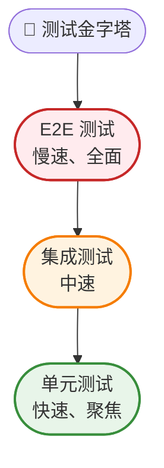
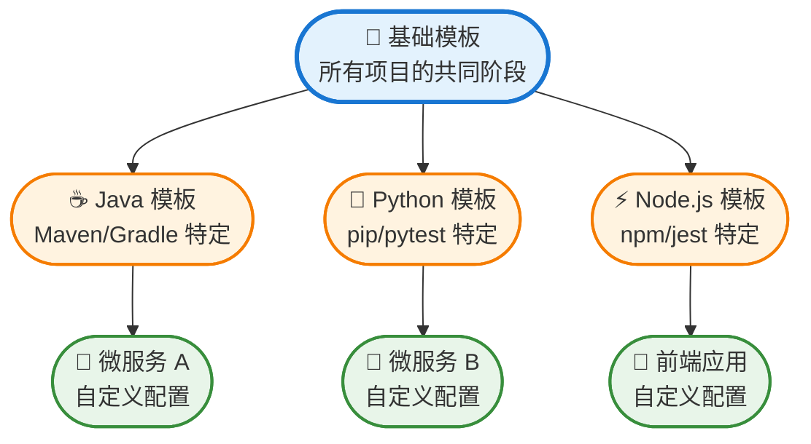
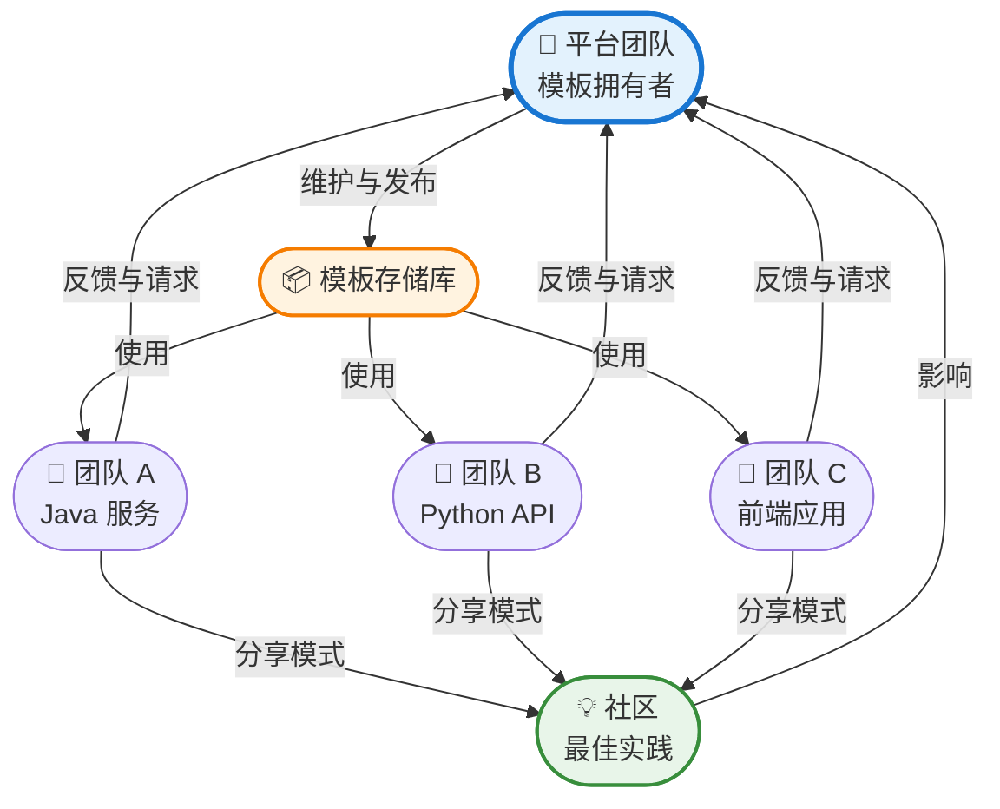
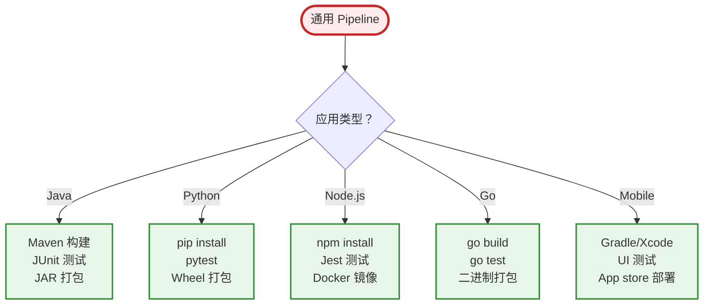

从手动部署转向自动化持续集成，已经彻底改变了企业交付软件的方式。然而，设计能在企业规模下可靠运作的 CI pipeline 面临独特挑战——从管理复杂的依赖关系到确保数百个微服务的安全合规性。

本指南探讨构建能够应对企业需求的 CI pipeline 的原则和实践，同时保持速度、可靠性和安全性。

## 理解企业级 CI 需求

企业级 CI pipeline 与初创公司或小团队的工作流程有根本性的差异。规模、复杂性和监管要求需要不同的方法。

**规模考量**：企业环境通常涉及数百个存储库、每天数千次构建，以及分散在不同时区的团队。你的 pipeline 必须处理这些量而不成为瓶颈。

**安全与合规**：金融服务、医疗保健和政府部门需要在每个阶段进行审计追踪、访问控制和合规验证。CI pipeline 必须自动执行这些要求。

**多团队协调**：不同团队在相互连接的服务上工作。你的 pipeline 需要检测破坏性变更、协调部署，并提供跨团队边界的可见性。

**遗留系统集成**：企业很少从零开始。你的 CI 系统必须与现有工具、数据库和部署流程集成，同时逐步现代化基础设施。

!!!anote "🎯 企业级 vs 初创公司 CI"
    **初创公司 CI**：快速迭代、最少流程、可接受破坏性变更
    
    **企业级 CI**：受控变更、广泛验证、对生产事故零容忍
    
    差异不仅在于规模——而是理念。企业级 CI 优先考虑稳定性和合规性，而非纯粹的速度。

## 核心 Pipeline 架构

设计良好的企业级 CI pipeline 遵循平衡速度与彻底性的结构化流程。


### 阶段 1：源代码控制集成

每个 pipeline 都从源代码控制开始。企业级 pipeline 必须支持：

- **分支保护**：强制执行代码审查要求，防止直接提交到主分支
- **Webhook 可靠性**：优雅地处理 webhook 失败并提供重试机制
- **Monorepo 支持**：检测哪些服务发生变更并仅触发相关构建

### 阶段 2：静态分析与 Linting

在编译前捕获问题：

- **代码质量门禁**：强制执行复杂度阈值、代码覆盖率最低标准
- **安全扫描**：检测硬编码的机密信息、有漏洞的依赖项
- **许可合规**：验证所有依赖项符合企业许可政策

### 阶段 3：构建与编译

构建阶段必须：

- **可重现**：相同的输入总是产生相同的输出
- **缓存**：重用先前构建的产物以减少时间
- **隔离**：每次构建在干净的环境中执行以防止污染

### 阶段 4：测试金字塔

实施全面的测试策略：

**单元测试**：快速、隔离的测试在每次提交时执行。这些应该在几分钟内完成并提供即时反馈。

**集成测试**：验证组件协同工作。针对具有真实数据的预发环境执行。

**端到端测试**：验证关键用户旅程。这些较慢但能捕获单元测试遗漏的问题。

**性能测试**：确保变更不会降低系统性能。在代表性工作负载上执行。



### 阶段 5：产物管理

打包和版本化你的构建：

- **语义化版本控制**：根据提交消息自动递增版本
- **产物存储库**：将构建存储在集中式存储库（Artifactory、Nexus）
- **不可变产物**：创建后永不修改产物；改为创建新版本

### 阶段 6：安全验证

安全不能是事后想法：

- **容器扫描**：检查 Docker 镜像是否有已知漏洞
- **依赖项分析**：验证第三方库是最新且安全的
- **合规检查**：确保构建符合监管要求（GDPR、HIPAA、SOC2）

### 阶段 7：部署阶段

渐进式部署降低风险：

**开发环境**：每次提交自动部署。开发人员可以立即测试变更。

**预发环境**：镜像生产环境配置。集成和 E2E 测试在此执行。

**生产环境**：需要人工审核。使用蓝绿或金丝雀策略部署。

## 企业级 CI 最佳实践

### 1. Pipeline 即代码

在版本控制文件中定义 pipeline（Jenkinsfile、.gitlab-ci.yml、GitHub Actions）。这提供：

- **版本历史**：跟踪 pipeline 变更与代码变更
- **代码审查**：pipeline 修改经过与代码相同的审查流程
- **可重用性**：跨团队共享 pipeline 模板

```yaml
# 示例：GitHub Actions 工作流程
name: Enterprise CI Pipeline

on:
  push:
    branches: [main, develop]
  pull_request:
    branches: [main]

jobs:
  build:
    runs-on: ubuntu-latest
    steps:
      - uses: actions/checkout@v2
      - name: Static Analysis
        run: npm run lint
      - name: Build
        run: npm run build
      - name: Unit Tests
        run: npm test
      - name: Security Scan
        run: npm audit
```

### 2. 模块化 Pipeline 模板

在拥有数十或数百个服务的企业环境中，维护单独 pipeline 变得不可持续。Pipeline 模板通过将常见模式提取到可重用模块来解决这个问题。

**模板层次结构**：



**基础模板示例**（GitHub Actions）：

```yaml
# .github/workflows/templates/base-pipeline.yml
name: Base CI Template

on:
  workflow_call:
    inputs:
      build_command:
        required: true
        type: string
      test_command:
        required: true
        type: string
      artifact_path:
        required: false
        type: string
        default: 'dist/'

jobs:
  ci:
    runs-on: ubuntu-latest
    steps:
      - uses: actions/checkout@v2
      
      - name: Static Analysis
        uses: ./.github/actions/static-analysis
      
      - name: Build
        run: ${{ inputs.build_command }}
      
      - name: Test
        run: ${{ inputs.test_command }}
      
      - name: Security Scan
        uses: ./.github/actions/security-scan
      
      - name: Upload Artifacts
        uses: actions/upload-artifact@v2
        with:
          path: ${{ inputs.artifact_path }}
```

**服务特定 Pipeline**（使用模板）：

```yaml
# microservice-a/.github/workflows/ci.yml
name: Microservice A CI

on: [push, pull_request]

jobs:
  build:
    uses: ./.github/workflows/templates/base-pipeline.yml
    with:
      build_command: 'mvn clean package'
      test_command: 'mvn test'
      artifact_path: 'target/*.jar'
```

**基于模板的 Pipeline 优势**：

- **一致性**：所有服务遵循相同的质量门禁和安全检查
- **可维护性**：通过变更一个模板更新 100 个 pipeline
- **入职**：新服务自动继承最佳实践
- **治理**：集中执行组织标准
- **减少重复**：通用逻辑写一次，到处重用

**模板组合模式**：

**1. 继承模式**：模板扩展基础模板，添加语言特定逻辑

```yaml
# Java 模板扩展基础模板
jobs:
  build:
    uses: ./.github/workflows/templates/base-pipeline.yml
    with:
      setup_command: 'setup-java@v2'
      build_command: 'mvn package'
```

**2. Mixin 模式**：组合多个可重用组件

```yaml
jobs:
  security:
    uses: ./.github/workflows/templates/security-mixin.yml
  
  compliance:
    uses: ./.github/workflows/templates/compliance-mixin.yml
  
  build:
    needs: [security, compliance]
    uses: ./.github/workflows/templates/build.yml
```

**3. 覆盖模式**：服务可以在需要时覆盖特定阶段

```yaml
jobs:
  build:
    uses: ./.github/workflows/templates/base-pipeline.yml
    with:
      build_command: 'mvn package'
      # 覆盖：此服务需要延长测试超时
      test_timeout: 30
```

!!!tip "📦 模板库组织"
    按范围组织模板以获得更好的可维护性和可发现性。

**模板目录结构：**

```
.github/workflows/templates/
├── base/
│   ├── ci-pipeline.yml          # 核心 CI 流程
│   └── cd-pipeline.yml          # 核心 CD 流程
├── languages/
│   ├── java-pipeline.yml
│   ├── python-pipeline.yml
│   └── nodejs-pipeline.yml
├── mixins/
│   ├── security-scan.yml
│   ├── compliance-check.yml
│   └── performance-test.yml
└── specialized/
    ├── microservice-pipeline.yml
    └── frontend-pipeline.yml
```

**模板版本控制策略**：

模板随时间演进。对它们进行版本控制以防止破坏性变更：

```yaml
# 使用特定模板版本
jobs:
  build:
    uses: ./.github/workflows/templates/base-pipeline@v2.1.0
```

**迁移路径**：
1. 发布新模板版本（v2.1.0）
2. 服务按自己的步调逐步迁移
3. 迁移期后弃用旧版本
4. 宽限期后移除已弃用的模板

### 多团队模板可重用性

当组织中的多个团队共享和重用 pipeline 模板时，模板的真正力量才会显现。这需要仔细设计协作、治理和定制。

**集中式模板存储库**：

为共享模板创建专用存储库：

```
ci-templates-repo/
├── README.md                    # 使用指南和目录
├── CHANGELOG.md                 # 版本历史
├── templates/
│   ├── base/
│   ├── languages/
│   ├── mixins/
│   └── specialized/
├── examples/
│   ├── java-service-example.yml
│   ├── python-api-example.yml
│   └── frontend-app-example.yml
├── tests/
│   └── template-validation/
└── docs/
    ├── getting-started.md
    ├── customization-guide.md
    └── migration-guide.md
```

**团队协作模型**：



**团队的定制层级**：

允许团队在不 fork 模板的情况下进行定制：

```yaml
# 团队 A 的定制（team-a-defaults.yml）
defaults:
  java_version: 11
  maven_opts: "-Xmx2048m"
  test_timeout: 20
  notification_channel: "#team-a-builds"

# 团队 A 的服务同时使用模板和团队默认值
jobs:
  build:
    uses: org/ci-templates/java-microservice@v2.0.0
    with:
      team_config: team-a-defaults.yml
      # 服务特定覆盖
      test_timeout: 30  # 此服务需要更多时间
```

**模板治理模型**：

**所有权结构**：
- **平台团队**：维护核心模板、审查变更、确保质量
- **模板推广者**：来自各团队提供反馈的代表
- **服务团队**：使用模板、报告问题、建议改进

**变更管理流程**：

1. **提案**：团队通过 issue/PR 提交模板变更请求
2. **审查**：平台团队和推广者审查影响
3. **测试**：针对多个团队的示例服务测试变更
4. **Beta 发布**：使用 `-beta` 标签发布新版本
5. **迁移期**：团队测试 beta 版本（2-4 周）
6. **稳定发布**：验证后升级为稳定版
7. **弃用**：旧版本弃用，设定 3 个月的日落期

**多团队使用的模板版本控制**：

```yaml
# 语义化版本控制与团队迁移跟踪
template: java-microservice
version: 2.1.0
released: 2020-08-01
breaking_changes: false
adoption:
  team-a: 15/20 services migrated
  team-b: 8/12 services migrated
  team-c: 20/20 services migrated
deprecated_versions:
  v1.x: sunset 2020-11-01
```

**自助式模板目录**：

为团队提供可搜索的目录：

```yaml
# 用于探索的模板元数据
name: java-microservice
category: backend
language: java
use_cases:
  - REST APIs
  - Microservices
  - Batch jobs
features:
  - Maven/Gradle support
  - JUnit testing
  - Docker packaging
  - Kubernetes deployment
teams_using: [team-a, team-b, team-d, team-f]
maturity: stable
maintainer: platform-team
support_channel: "#ci-templates-help"
```

**跨团队定制模式**：

**模式 1：团队特定 Mixin**

团队可以创建与基础模板配合使用的自己的 mixin：

```yaml
# 团队 A 的自定义安全 mixin
# team-a-security-mixin.yml
steps:
  - name: Team A Security Scan
    run: ./team-a-security-tool
  - name: Upload to Team A Dashboard
    run: ./upload-results

# 在服务 pipeline 中使用
jobs:
  build:
    uses: org/ci-templates/base@v2.0.0
  
  team-security:
    uses: team-a/team-a-security-mixin@v1.0.0
```

**模式 2：参数化团队策略**

模板接受团队特定的策略配置：

```yaml
# 模板支持团队策略
jobs:
  build:
    uses: org/ci-templates/java-microservice@v2.0.0
    with:
      team_policy: |
        code_coverage_min: 80%
        security_scan: mandatory
        performance_test: optional
        approval_required: production_only
```

**模式 3：联邦式模板扩展**

团队可以在不修改原始模板的情况下扩展模板：

```yaml
# 团队 B 用他们的新增内容扩展基础模板
# team-b-java-extended.yml
name: Team B Java Service

extends: org/ci-templates/java-microservice@v2.0.0

additional_stages:
  post_build:
    - name: Team B Metrics
      run: ./collect-team-metrics
    - name: Team B Notification
      run: ./notify-team-dashboard
```

**衡量多团队模板成功**：

跟踪采用率和有效性：

```yaml
metrics:
  adoption_rate: 85%  # 170/200 服务使用模板
  teams_using: 12/15
  average_customization: 15%  # 团队覆盖多少
  template_update_frequency: 2.3/month
  breaking_changes: 0.2/year
  support_tickets: 3.5/month
  time_to_onboard_new_service: 2 hours (was 2 weeks)
```

**沟通与支持**：

- **文档门户**：每个模板的可搜索文档与示例
- **Slack 频道**：`#ci-templates-help` 用于问题和讨论
- **办公时间**：每周平台团队协助团队的会议
- **电子报**：每月更新新模板和改进
- **模板展示**：每季成功模式的演示

!!!example "🌟 多团队成功故事"
    **拥有 15 个团队、250 个服务的电商公司**：
    
    **挑战**：每个团队以不同方式构建 pipeline，导致：
    - 不一致的安全实践
    - 跨团队协作困难
    - 高维护负担
    - 新工程师入职缓慢
    
    **解决方案**：实施共享模板库：
    - 6 个基础模板（Java、Python、Node.js、Go、Mobile、Data）
    - 团队特定定制层级
    - 联邦治理模型
    - 自助式目录
    
    **6 个月后的结果**：
    - 85% 模板采用率（213/250 服务）
    - pipeline 维护时间减少 90%
    - 100% 服务现在有安全扫描
    - 新服务入职：2 小时（原为 2 周）
    - 跨团队协作改善（共享模式）
    - 3 个团队贡献改进回模板
    
    **关键成功因素**：标准化与团队自主权之间的平衡

**模板治理**：

- **所有权**：平台团队维护模板，服务团队使用它们
- **变更流程**：模板变更需要审查和测试
- **文档**：每个模板包含使用示例和参数
- **指标**：跟踪模板采用率并识别改进机会

### 3. 快速失败原则

先执行快速检查。如果静态分析失败，不要浪费时间在构建和测试上。这节省计算资源并提供更快的反馈。

**最佳阶段顺序**：
1. Linting（秒）
2. 静态分析（1-2 分钟）
3. 构建（2-5 分钟）
4. 单元测试（5-10 分钟）
5. 集成测试（10-20 分钟）
6. E2E 测试（20-30 分钟）

### 4. 并行执行

同时执行独立任务：

- **测试并行化**：将测试套件分散到多个运行器
- **多平台构建**：同时为不同平台构建
- **独立服务**：并行构建微服务

这可以将 pipeline 时间从数小时减少到数分钟。

### 5. 缓存策略

实施积极的缓存：

- **依赖项缓存**：缓存 npm、Maven 或 pip 依赖项
- **构建缓存**：当源代码未变更时重用编译产物
- **Docker 层缓存**：利用 Docker 的层缓存加快镜像构建

!!!tip "💡 缓存失效"
    缓存失效是出了名的困难。使用基于内容的缓存键（依赖文件的哈希）而非基于时间的过期。这确保缓存仅在依赖项实际变更时失效。

### 6. 环境一致性

保持开发、预发和生产环境尽可能相似：

- **基础设施即代码**：使用 Terraform 或 CloudFormation 定义环境
- **配置管理**：在所有环境中使用相同的配置系统
- **数据一致性**：在预发环境中尽可能使用匿名化的生产数据

### 7. 监控与可观测性

为你的 pipeline 添加监测：

- **构建指标**：跟踪构建持续时间、成功率、失败原因
- **资源使用**：监控构建期间的 CPU、内存和磁盘使用
- **告警**：当 pipeline 失败或性能下降时通知团队

### 8. 安全强化

保护你的 CI 基础设施：

- **机密管理**：使用保管库系统（HashiCorp Vault、AWS Secrets Manager）管理凭证
- **最小权限**：为每个 pipeline 阶段授予所需的最小权限
- **审计日志**：记录所有 pipeline 执行和访问尝试
- **网络隔离**：在隔离网络中执行构建以防止横向移动

!!!warning "⚠️ 常见安全错误"
    **避免这些关键安全陷阱：**
    - 在环境变量中存储凭证
    - 以管理员权限执行构建
    - 允许在 pull request 中执行任意代码
    - 将内部服务暴露给构建运行器
    - 未能定期轮换凭证
    
    **影响：** 这些错误可能导致凭证盗用、权限提升和对生产系统的未授权访问。

## 单一 Pipeline 适用所有应用的辩论

企业级 CI 设计中反复出现的问题：你应该创建一个处理所有应用的通用 pipeline，还是为不同用例维护专门的 pipeline？答案，就像大多数架构决策一样，是微妙的。

### 通用 Pipeline 的吸引力

这个想法很诱人：一个 pipeline 统治所有。每个应用，无论语言或框架，都通过相同的阶段和相同的质量门禁。

**理论优势**：
- 整个组织的终极一致性
- 单一维护点
- 简化治理和合规
- 新团队更容易入职

**现实检验**：

真正的通用 pipeline 要么变得过于通用而无用，要么过于复杂而难以维护。考虑这些情境：



**复杂度爆炸**：

处理所有这些情况的通用 pipeline 需要：
- 每种语言和框架的条件逻辑
- 指定应用类型的配置文件
- 识别项目结构的检测机制
- 检测失败时的后备策略
- 跨所有支持情境的广泛测试

结果？一个 2000 行的 pipeline 配置，没人完全理解，每个人都害怕触碰。

### 解决方案的光谱

与其二元选择，不如考虑一个光谱：

**层级 1：完全专门化的 Pipeline**
- 每个应用都有独特的 pipeline
- 最大灵活性，零重用
- 大规模维护噩梦

**层级 2：语言特定模板** ⭐（推荐）
- Java、Python、Node.js 等的独立模板
- 每个模板针对其生态系统优化
- 服务继承并根据需要定制

**层级 3：混合通用 Pipeline**
- 具有语言特定插件的基础 pipeline
- 中等复杂度，良好重用
- 需要复杂的插件架构

**层级 4：完全通用 Pipeline**
- 一个 pipeline 处理所有事情
- 最大一致性，高复杂度
- 难以维护和扩展

!!!tip "🎯 最佳平衡点"
    **层级 2（语言特定模板）**为大多数企业提供最佳平衡：
    
    - **一致性**：所有 Java 服务使用相同的 Java 模板
    - **优化**：每个模板使用语言特定的最佳实践
    - **可维护性**：5-10 个模板而非 200 个独特 pipeline
    - **灵活性**：服务可以在需要时覆盖
    - **简单性**：每个模板都专注且易于理解

### 通用 Pipeline 何时有效

通用 pipeline 在特定情境下可以成功：

**同质环境**：
- 组织标准化为单一语言/框架
- 所有服务遵循相同的架构模式
- 示例：100% Go 服务的微服务公司

**容器优先组织**：
- 每个应用都构建 Docker 镜像
- Pipeline 专注于容器生命周期，而非语言特定
- 语言特定步骤发生在 Dockerfile 内

```yaml
# 通用容器 pipeline
stages:
  - lint
  - build-image    # Dockerfile 处理语言特定
  - test-image
  - scan-image
  - push-image
  - deploy
```

**高度抽象的平台**：
- 平台团队提供构建抽象
- 应用声明依赖项，平台处理构建
- 示例：具有通用规则的 Bazel 或 Buck 构建系统

### 基于模板的方法（推荐）

与其强制所有东西通过一个 pipeline，不如创建一系列专门的模板：

```
Templates/
├── base-template.yml           # 所有继承的共同阶段
├── java-microservice.yml       # 扩展基础，添加 Maven/Gradle
├── python-service.yml          # 扩展基础，添加 pip/pytest
├── nodejs-frontend.yml         # 扩展基础，添加 npm/webpack
├── mobile-ios.yml              # 扩展基础，添加 Xcode
├── mobile-android.yml          # 扩展基础，添加 Gradle
└── data-pipeline.yml           # 扩展基础，添加 Spark/Airflow
```

**每个模板针对其领域优化**：

```yaml
# java-microservice.yml
extends: base-template.yml

stages:
  - validate:
      - checkstyle
      - spotbugs
  - build:
      - maven: clean package
      - cache: ~/.m2/repository
  - test:
      - junit: test
      - jacoco: coverage > 80%
  - package:
      - docker: build
      - artifact: target/*.jar
```

```yaml
# nodejs-frontend.yml
extends: base-template.yml

stages:
  - validate:
      - eslint
      - prettier
  - build:
      - npm: ci
      - webpack: build --production
      - cache: node_modules/
  - test:
      - jest: --coverage
      - cypress: e2e
  - package:
      - s3: upload dist/
```

### 决策框架

使用此框架决定你的方法：

**选择通用 Pipeline 如果**：
- ✅ 所有应用使用相同语言/框架
- ✅ 组织有强大的平台工程团队
- ✅ 容器优先架构与语言抽象
- ✅ 愿意大量投资于 pipeline 复杂度

**选择基于模板的方法如果**：
- ✅ 使用多种语言和框架
- ✅ 不同应用类型（web、mobile、data、ML）
- ✅ 团队需要特殊需求的灵活性
- ✅ 想要一致性与可维护性之间的平衡

**选择专门化 Pipeline 如果**：
- ✅ 非常小的组织（<10 个服务）
- ✅ 高度多样化的技术栈
- ✅ 每个应用都有独特的部署需求
- ✅ 快速实验比一致性更重要

!!!warning "⚠️ 反模式：超大型 Pipeline"
    避免创建具有数百个条件分支的单一 pipeline：
    
    这变得难以维护且容易出错。改用模板。

**反模式示例：**

```yaml
# 不要这样做
if language == "java":
  if build_tool == "maven":
    if java_version == "8":
      run: mvn -Djava.version=8 package
    elif java_version == "11":
      run: mvn -Djava.version=11 package
  elif build_tool == "gradle":
    # ... 更多条件
elif language == "python":
  # ... 更多条件
```

### 结论：务实的灵活性

问题不是「一个 pipeline 能适用所有应用吗？」而是「应该吗？」对大多数企业来说答案是否定的。相反：

1. **创建基础模板**，包含共同阶段（安全、合规、部署）
2. **构建专门模板**，针对每个主要技术栈
3. **允许定制**，团队有合理的特殊需求时
4. **维护治理**，通过基础模板中的必需阶段
5. **衡量和迭代**，基于实际使用模式

这种方法在重要的地方提供一致性（安全、合规），同时在有帮助的地方允许优化（语言特定工具）。这是与你的组织一起扩展的务实中间地带。

## 处理常见企业挑战

### 挑战 1：构建时间过长

**问题**：构建耗时 30 分钟以上让开发人员沮丧并减缓交付。

**解决方案**：
- 实施增量构建（仅重建变更的组件）
- 使用分布式构建系统（Bazel、Buck）
- 投资更快的构建基础设施
- 并行化测试执行
- 积极缓存

### 挑战 2：不稳定的测试

**问题**：通过/失败不一致的测试侵蚀对 CI 的信心。

**解决方案**：
- 隔离不稳定的测试（单独执行，不阻塞 pipeline）
- 为依赖网络的测试添加重试逻辑
- 使用测试隔离技术
- 监控测试可靠性指标
- 分配时间进行测试维护

### 挑战 3：依赖项管理

**问题**：跨数百个服务管理依赖项变得混乱。

**解决方案**：
- 使用依赖项管理工具（Dependabot、Renovate）
- 实施自动化依赖项更新
- 维护已批准的依赖项清单
- 使用锁定文件确保可重现的构建
- 定期进行依赖项安全审计

### 挑战 4：多团队协调

**问题**：团队在部署期间互相干扰。

**解决方案**：
- 实施部署时间窗口
- 使用功能标志将部署与发布解耦
- 建立明确的所有权边界
- 创建共享 pipeline 模板
- 定期跨团队同步会议

### 挑战 5：合规与审计要求

**问题**：监管要求需要广泛的文档和控制。

**解决方案**：
- pipeline 中的自动化合规检查
- 不可变审计日志
- 生产部署的审批工作流程
- 自动化审计证据收集
- 定期合规审查

## 工具与技术

### CI/CD 平台

**Jenkins**：最灵活，需要大量维护。最适合具有现有 Jenkins 专业知识的复杂企业需求。

**GitLab CI**：与源代码控制集成，适合想要一体化解决方案的团队。

**GitHub Actions**：非常适合以 GitHub 为中心的工作流程，不断增长的 action 生态系统。

**CircleCI**：强大的性能，良好的缓存，扩展性好。

**AWS CodePipeline**：原生 AWS 集成，无服务器执行模型。

### 构建工具

**Maven/Gradle**：Java 生态系统标准
**npm/Yarn**：JavaScript 包管理
**Make**：通用构建自动化
**Bazel**：Google 的构建系统，非常适合 monorepo

### 测试框架

**JUnit/TestNG**：Java 测试
**Jest/Mocha**：JavaScript 测试
**pytest**：Python 测试
**Selenium**：浏览器自动化
**JMeter**：性能测试

### 安全工具

**SonarQube**：代码质量和安全分析
**Snyk**：依赖项漏洞扫描
**Trivy**：容器安全扫描
**OWASP Dependency-Check**：开源依赖项分析

## 衡量 Pipeline 成功

跟踪这些关键指标：

**构建成功率**：通过的构建百分比。目标：>95%

**平均反馈时间**：开发人员获得构建结果的速度。目标：<10 分钟

**部署频率**：部署到生产环境的频率。目标：每天多次

**变更失败率**：导致事故的部署百分比。目标：<5%

**平均恢复时间**：从失败中恢复的速度。目标：<1 小时


{
  "title": {
    "text": "CI Pipeline 性能指标"
  },
  "tooltip": {
    "trigger": "axis"
  },
  "legend": {
    "data": ["构建成功率", "部署频率"]
  },
  "xAxis": {
    "type": "category",
    "data": ["第 1 周", "第 2 周", "第 3 周", "第 4 周"]
  },
  "yAxis": {
    "type": "value",
    "name": "百分比"
  },
  "series": [
    {
      "name": "构建成功率",
      "type": "line",
      "data": [92, 94, 96, 97],
      "itemStyle": {
        "color": "#388e3c"
      }
    },
    {
      "name": "部署频率",
      "type": "line",
      "data": [85, 88, 91, 93],
      "itemStyle": {
        "color": "#1976d2"
      }
    }
  ]
}



## 结论

为企业环境设计 CI pipeline 需要平衡竞争需求：速度与彻底性、灵活性与标准化、创新与稳定性。这里概述的原则——快速失败、积极缓存、全面测试、默认安全——为构建与你的组织一起扩展的 pipeline 提供了基础。

记住，CI pipeline 设计永远不会完成。随着你的组织成长、技术演进和需求变化，你的 pipeline 必须适应。投资使它们可维护、可观测和持续改进。

目标不是完美——而是构建一个可靠地交付高质量软件的系统，同时使团队能够快速移动和创新。通过深思熟虑的设计和持续改进，你的 CI pipeline 成为竞争优势而非瓶颈。

!!!quote "💭 最后的想法"
    「最好的 CI pipeline 是你不会注意到的——它只是每次都能运作，让开发人员专注于构建优秀的软件，而不是与工具搏斗。」
