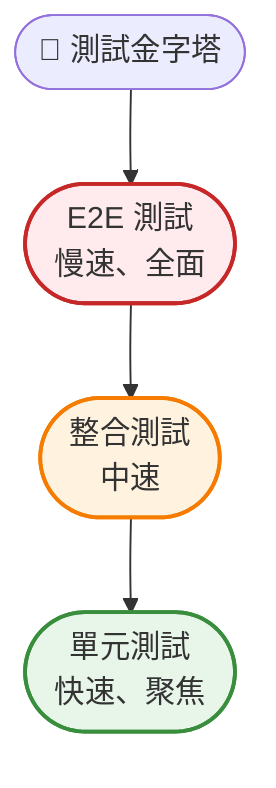
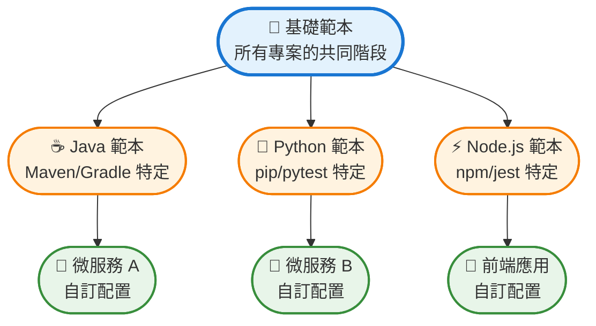
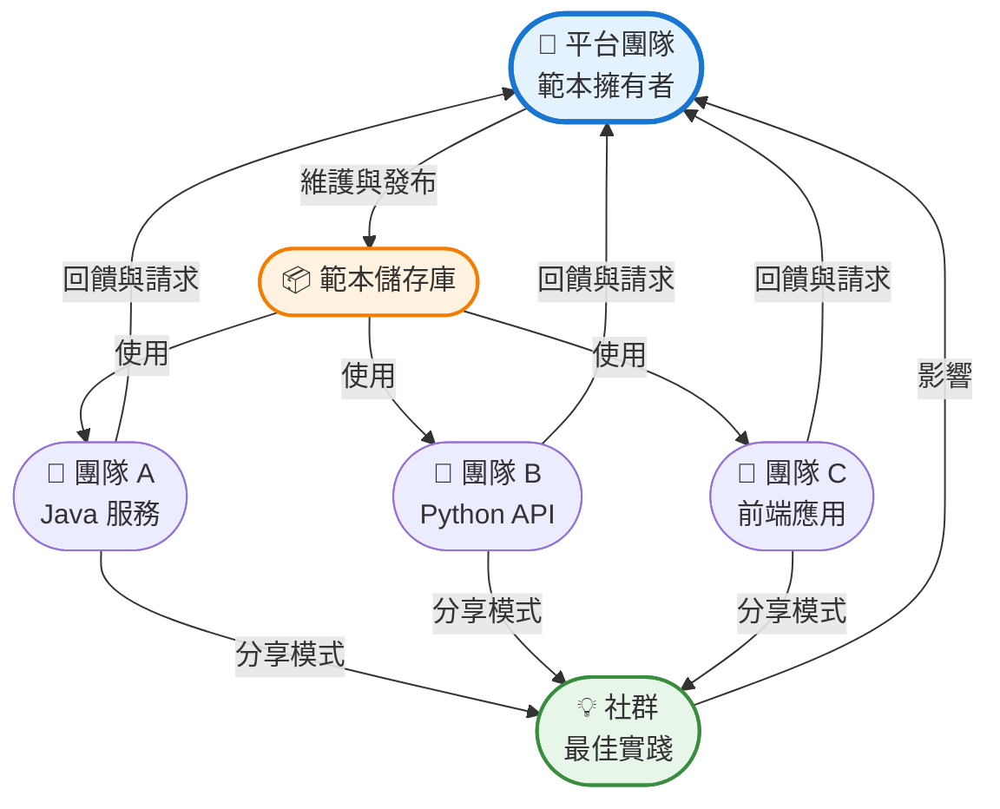
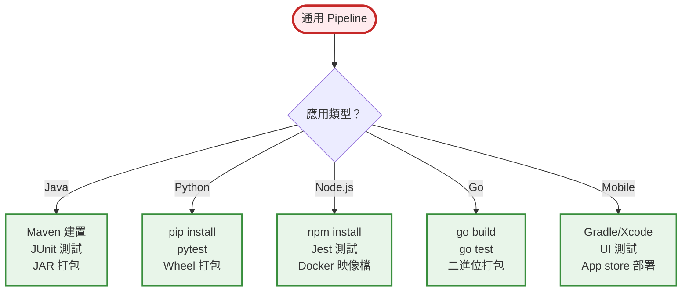

從手動部署轉向自動化持續整合，已經徹底改變了企業交付軟體的方式。然而，設計能在企業規模下可靠運作的 CI pipeline 面臨獨特挑戰——從管理複雜的依賴關係到確保數百個微服務的安全合規性。

本指南探討建構能夠應對企業需求的 CI pipeline 的原則和實踐，同時保持速度、可靠性和安全性。

## 理解企業級 CI 需求

企業級 CI pipeline 與新創公司或小團隊的工作流程有根本性的差異。規模、複雜性和監管要求需要不同的方法。

**規模考量**：企業環境通常涉及數百個儲存庫、每天數千次建置，以及分散在不同時區的團隊。你的 pipeline 必須處理這些量而不成為瓶頸。

**安全與合規**：金融服務、醫療保健和政府部門需要在每個階段進行稽核追蹤、存取控制和合規驗證。CI pipeline 必須自動執行這些要求。

**多團隊協調**：不同團隊在相互連接的服務上工作。你的 pipeline 需要偵測破壞性變更、協調部署，並提供跨團隊邊界的可見性。

**舊系統整合**：企業很少從零開始。你的 CI 系統必須與現有工具、資料庫和部署流程整合，同時逐步現代化基礎設施。

!!!anote "🎯 企業級 vs 新創公司 CI"
    **新創公司 CI**：快速迭代、最少流程、可接受破壞性變更
    
    **企業級 CI**：受控變更、廣泛驗證、對生產事故零容忍
    
    差異不僅在於規模——而是理念。企業級 CI 優先考慮穩定性和合規性，而非純粹的速度。

## 核心 Pipeline 架構

設計良好的企業級 CI pipeline 遵循平衡速度與徹底性的結構化流程。


### 階段 1：原始碼控制整合

每個 pipeline 都從原始碼控制開始。企業級 pipeline 必須支援：

- **分支保護**：強制執行程式碼審查要求，防止直接提交到主分支
- **Webhook 可靠性**：優雅地處理 webhook 失敗並提供重試機制
- **Monorepo 支援**：偵測哪些服務發生變更並僅觸發相關建置

### 階段 2：靜態分析與 Linting

在編譯前捕捉問題：

- **程式碼品質閘門**：強制執行複雜度閾值、程式碼覆蓋率最低標準
- **安全掃描**：偵測硬編碼的機密資訊、有漏洞的依賴項
- **授權合規**：驗證所有依賴項符合企業授權政策

### 階段 3：建置與編譯

建置階段必須：

- **可重現**：相同的輸入總是產生相同的輸出
- **快取**：重用先前建置的產物以減少時間
- **隔離**：每次建置在乾淨的環境中執行以防止污染

### 階段 4：測試金字塔

實施全面的測試策略：

**單元測試**：快速、隔離的測試在每次提交時執行。這些應該在幾分鐘內完成並提供即時回饋。

**整合測試**：驗證元件協同工作。針對具有真實資料的預備環境執行。

**端對端測試**：驗證關鍵使用者旅程。這些較慢但能捕捉單元測試遺漏的問題。

**效能測試**：確保變更不會降低系統效能。在代表性工作負載上執行。



### 階段 5：產物管理

打包和版本化你的建置：

- **語意化版本控制**：根據提交訊息自動遞增版本
- **產物儲存庫**：將建置儲存在集中式儲存庫（Artifactory、Nexus）
- **不可變產物**：建立後永不修改產物；改為建立新版本

### 階段 6：安全驗證

安全不能是事後想法：

- **容器掃描**：檢查 Docker 映像檔是否有已知漏洞
- **依賴項分析**：驗證第三方函式庫是最新且安全的
- **合規檢查**：確保建置符合監管要求（GDPR、HIPAA、SOC2）

### 階段 7：部署階段

漸進式部署降低風險：

**開發環境**：每次提交自動部署。開發人員可以立即測試變更。

**預備環境**：鏡像生產環境配置。整合和 E2E 測試在此執行。

**生產環境**：需要人工審核。使用藍綠或金絲雀策略部署。

## 企業級 CI 最佳實踐

### 1. Pipeline 即程式碼

在版本控制檔案中定義 pipeline（Jenkinsfile、.gitlab-ci.yml、GitHub Actions）。這提供：

- **版本歷史**：追蹤 pipeline 變更與程式碼變更
- **程式碼審查**：pipeline 修改經過與程式碼相同的審查流程
- **可重用性**：跨團隊共享 pipeline 範本

```yaml
# 範例：GitHub Actions 工作流程
name: Enterprise CI Pipeline

on:
  push:
    branches: [main, develop]
  pull_request:
    branches: [main]

jobs:
  build:
    runs-on: ubuntu-latest
    steps:
      - uses: actions/checkout@v2
      - name: Static Analysis
        run: npm run lint
      - name: Build
        run: npm run build
      - name: Unit Tests
        run: npm test
      - name: Security Scan
        run: npm audit
```

### 2. 模組化 Pipeline 範本

在擁有數十或數百個服務的企業環境中，維護個別 pipeline 變得不可持續。Pipeline 範本透過將常見模式提取到可重用模組來解決這個問題。

**範本階層**：



**基礎範本範例**（GitHub Actions）：

```yaml
# .github/workflows/templates/base-pipeline.yml
name: Base CI Template

on:
  workflow_call:
    inputs:
      build_command:
        required: true
        type: string
      test_command:
        required: true
        type: string
      artifact_path:
        required: false
        type: string
        default: 'dist/'

jobs:
  ci:
    runs-on: ubuntu-latest
    steps:
      - uses: actions/checkout@v2
      
      - name: Static Analysis
        uses: ./.github/actions/static-analysis
      
      - name: Build
        run: ${{ inputs.build_command }}
      
      - name: Test
        run: ${{ inputs.test_command }}
      
      - name: Security Scan
        uses: ./.github/actions/security-scan
      
      - name: Upload Artifacts
        uses: actions/upload-artifact@v2
        with:
          path: ${{ inputs.artifact_path }}
```

**服務特定 Pipeline**（使用範本）：

```yaml
# microservice-a/.github/workflows/ci.yml
name: Microservice A CI

on: [push, pull_request]

jobs:
  build:
    uses: ./.github/workflows/templates/base-pipeline.yml
    with:
      build_command: 'mvn clean package'
      test_command: 'mvn test'
      artifact_path: 'target/*.jar'
```

**基於範本的 Pipeline 優勢**：

- **一致性**：所有服務遵循相同的品質閘門和安全檢查
- **可維護性**：透過變更一個範本更新 100 個 pipeline
- **入職**：新服務自動繼承最佳實踐
- **治理**：集中執行組織標準
- **減少重複**：通用邏輯寫一次，到處重用

**範本組合模式**：

**1. 繼承模式**：範本擴展基礎範本，添加語言特定邏輯

```yaml
# Java 範本擴展基礎範本
jobs:
  build:
    uses: ./.github/workflows/templates/base-pipeline.yml
    with:
      setup_command: 'setup-java@v2'
      build_command: 'mvn package'
```

**2. Mixin 模式**：組合多個可重用元件

```yaml
jobs:
  security:
    uses: ./.github/workflows/templates/security-mixin.yml
  
  compliance:
    uses: ./.github/workflows/templates/compliance-mixin.yml
  
  build:
    needs: [security, compliance]
    uses: ./.github/workflows/templates/build.yml
```

**3. 覆寫模式**：服務可以在需要時覆寫特定階段

```yaml
jobs:
  build:
    uses: ./.github/workflows/templates/base-pipeline.yml
    with:
      build_command: 'mvn package'
      # 覆寫：此服務需要延長測試逾時
      test_timeout: 30
```

!!!tip "📦 範本函式庫組織"
    按範圍組織範本以獲得更好的可維護性和可發現性。

**範本目錄結構：**

```
.github/workflows/templates/
├── base/
│   ├── ci-pipeline.yml          # 核心 CI 流程
│   └── cd-pipeline.yml          # 核心 CD 流程
├── languages/
│   ├── java-pipeline.yml
│   ├── python-pipeline.yml
│   └── nodejs-pipeline.yml
├── mixins/
│   ├── security-scan.yml
│   ├── compliance-check.yml
│   └── performance-test.yml
└── specialized/
    ├── microservice-pipeline.yml
    └── frontend-pipeline.yml
```

**範本版本控制策略**：

範本隨時間演進。對它們進行版本控制以防止破壞性變更：

```yaml
# 使用特定範本版本
jobs:
  build:
    uses: ./.github/workflows/templates/base-pipeline@v2.1.0
```

**遷移路徑**：
1. 發布新範本版本（v2.1.0）
2. 服務按自己的步調逐步遷移
3. 遷移期後棄用舊版本
4. 寬限期後移除已棄用的範本

### 多團隊範本可重用性

當組織中的多個團隊共享和重用 pipeline 範本時，範本的真正力量才會顯現。這需要仔細設計協作、治理和客製化。

**集中式範本儲存庫**：

為共享範本建立專用儲存庫：

```
ci-templates-repo/
├── README.md                    # 使用指南和目錄
├── CHANGELOG.md                 # 版本歷史
├── templates/
│   ├── base/
│   ├── languages/
│   ├── mixins/
│   └── specialized/
├── examples/
│   ├── java-service-example.yml
│   ├── python-api-example.yml
│   └── frontend-app-example.yml
├── tests/
│   └── template-validation/
└── docs/
    ├── getting-started.md
    ├── customization-guide.md
    └── migration-guide.md
```

**團隊協作模型**：



**團隊的客製化層級**：

允許團隊在不 fork 範本的情況下進行客製化：

```yaml
# 團隊 A 的客製化（team-a-defaults.yml）
defaults:
  java_version: 11
  maven_opts: "-Xmx2048m"
  test_timeout: 20
  notification_channel: "#team-a-builds"

# 團隊 A 的服務同時使用範本和團隊預設值
jobs:
  build:
    uses: org/ci-templates/java-microservice@v2.0.0
    with:
      team_config: team-a-defaults.yml
      # 服務特定覆寫
      test_timeout: 30  # 此服務需要更多時間
```

**範本治理模型**：

**所有權結構**：
- **平台團隊**：維護核心範本、審查變更、確保品質
- **範本推廣者**：來自各團隊提供回饋的代表
- **服務團隊**：使用範本、回報問題、建議改進

**變更管理流程**：

1. **提案**：團隊透過 issue/PR 提交範本變更請求
2. **審查**：平台團隊和推廣者審查影響
3. **測試**：針對多個團隊的範例服務測試變更
4. **Beta 發布**：使用 `-beta` 標籤發布新版本
5. **遷移期**：團隊測試 beta 版本（2-4 週）
6. **穩定發布**：驗證後升級為穩定版
7. **棄用**：舊版本棄用，設定 3 個月的日落期

**多團隊使用的範本版本控制**：

```yaml
# 語意化版本控制與團隊遷移追蹤
template: java-microservice
version: 2.1.0
released: 2020-08-01
breaking_changes: false
adoption:
  team-a: 15/20 services migrated
  team-b: 8/12 services migrated
  team-c: 20/20 services migrated
deprecated_versions:
  v1.x: sunset 2020-11-01
```

**自助式範本目錄**：

為團隊提供可搜尋的目錄：

```yaml
# 用於探索的範本元資料
name: java-microservice
category: backend
language: java
use_cases:
  - REST APIs
  - Microservices
  - Batch jobs
features:
  - Maven/Gradle support
  - JUnit testing
  - Docker packaging
  - Kubernetes deployment
teams_using: [team-a, team-b, team-d, team-f]
maturity: stable
maintainer: platform-team
support_channel: "#ci-templates-help"
```

**跨團隊客製化模式**：

**模式 1：團隊特定 Mixin**

團隊可以建立與基礎範本配合使用的自己的 mixin：

```yaml
# 團隊 A 的自訂安全 mixin
# team-a-security-mixin.yml
steps:
  - name: Team A Security Scan
    run: ./team-a-security-tool
  - name: Upload to Team A Dashboard
    run: ./upload-results

# 在服務 pipeline 中使用
jobs:
  build:
    uses: org/ci-templates/base@v2.0.0
  
  team-security:
    uses: team-a/team-a-security-mixin@v1.0.0
```

**模式 2：參數化團隊政策**

範本接受團隊特定的政策配置：

```yaml
# 範本支援團隊政策
jobs:
  build:
    uses: org/ci-templates/java-microservice@v2.0.0
    with:
      team_policy: |
        code_coverage_min: 80%
        security_scan: mandatory
        performance_test: optional
        approval_required: production_only
```

**模式 3：聯邦式範本擴展**

團隊可以在不修改原始範本的情況下擴展範本：

```yaml
# 團隊 B 用他們的新增內容擴展基礎範本
# team-b-java-extended.yml
name: Team B Java Service

extends: org/ci-templates/java-microservice@v2.0.0

additional_stages:
  post_build:
    - name: Team B Metrics
      run: ./collect-team-metrics
    - name: Team B Notification
      run: ./notify-team-dashboard
```

**衡量多團隊範本成功**：

追蹤採用率和有效性：

```yaml
metrics:
  adoption_rate: 85%  # 170/200 服務使用範本
  teams_using: 12/15
  average_customization: 15%  # 團隊覆寫多少
  template_update_frequency: 2.3/month
  breaking_changes: 0.2/year
  support_tickets: 3.5/month
  time_to_onboard_new_service: 2 hours (was 2 weeks)
```

**溝通與支援**：

- **文件入口網站**：每個範本的可搜尋文件與範例
- **Slack 頻道**：`#ci-templates-help` 用於問題和討論
- **辦公時間**：每週平台團隊協助團隊的會議
- **電子報**：每月更新新範本和改進
- **範本展示**：每季成功模式的示範

!!!example "🌟 多團隊成功故事"
    **擁有 15 個團隊、250 個服務的電商公司**：
    
    **挑戰**：每個團隊以不同方式建置 pipeline，導致：
    - 不一致的安全實踐
    - 跨團隊協作困難
    - 高維護負擔
    - 新工程師入職緩慢
    
    **解決方案**：實施共享範本函式庫：
    - 6 個基礎範本（Java、Python、Node.js、Go、Mobile、Data）
    - 團隊特定客製化層級
    - 聯邦治理模型
    - 自助式目錄
    
    **6 個月後的結果**：
    - 85% 範本採用率（213/250 服務）
    - pipeline 維護時間減少 90%
    - 100% 服務現在有安全掃描
    - 新服務入職：2 小時（原為 2 週）
    - 跨團隊協作改善（共享模式）
    - 3 個團隊貢獻改進回範本
    
    **關鍵成功因素**：標準化與團隊自主權之間的平衡

**範本治理**：

- **所有權**：平台團隊維護範本，服務團隊使用它們
- **變更流程**：範本變更需要審查和測試
- **文件**：每個範本包含使用範例和參數
- **指標**：追蹤範本採用率並識別改進機會

### 3. 快速失敗原則

先執行快速檢查。如果靜態分析失敗，不要浪費時間在建置和測試上。這節省運算資源並提供更快的回饋。

**最佳階段順序**：
1. Linting（秒）
2. 靜態分析（1-2 分鐘）
3. 建置（2-5 分鐘）
4. 單元測試（5-10 分鐘）
5. 整合測試（10-20 分鐘）
6. E2E 測試（20-30 分鐘）

### 4. 平行執行

同時執行獨立任務：

- **測試平行化**：將測試套件分散到多個執行器
- **多平台建置**：同時為不同平台建置
- **獨立服務**：平行建置微服務

這可以將 pipeline 時間從數小時減少到數分鐘。

### 5. 快取策略

實施積極的快取：

- **依賴項快取**：快取 npm、Maven 或 pip 依賴項
- **建置快取**：當原始碼未變更時重用編譯產物
- **Docker 層快取**：利用 Docker 的層快取加快映像檔建置

!!!tip "💡 快取失效"
    快取失效是出了名的困難。使用基於內容的快取鍵（依賴檔案的雜湊）而非基於時間的過期。這確保快取僅在依賴項實際變更時失效。

### 6. 環境一致性

保持開發、預備和生產環境盡可能相似：

- **基礎設施即程式碼**：使用 Terraform 或 CloudFormation 定義環境
- **配置管理**：在所有環境中使用相同的配置系統
- **資料一致性**：在預備環境中盡可能使用匿名化的生產資料

### 7. 監控與可觀測性

為你的 pipeline 添加監測：

- **建置指標**：追蹤建置持續時間、成功率、失敗原因
- **資源使用**：監控建置期間的 CPU、記憶體和磁碟使用
- **告警**：當 pipeline 失敗或效能下降時通知團隊

### 8. 安全強化

保護你的 CI 基礎設施：

- **機密管理**：使用保管庫系統（HashiCorp Vault、AWS Secrets Manager）管理憑證
- **最小權限**：為每個 pipeline 階段授予所需的最小權限
- **稽核日誌**：記錄所有 pipeline 執行和存取嘗試
- **網路隔離**：在隔離網路中執行建置以防止橫向移動

!!!warning "⚠️ 常見安全錯誤"
    **避免這些關鍵安全陷阱：**
    - 在環境變數中儲存憑證
    - 以管理員權限執行建置
    - 允許在 pull request 中執行任意程式碼
    - 將內部服務暴露給建置執行器
    - 未能定期輪換憑證
    
    **影響：** 這些錯誤可能導致憑證盜用、權限提升和對生產系統的未授權存取。

## 單一 Pipeline 適用所有應用的辯論

企業級 CI 設計中反覆出現的問題：你應該建立一個處理所有應用的通用 pipeline，還是為不同用例維護專門的 pipeline？答案，就像大多數架構決策一樣，是微妙的。

### 通用 Pipeline 的吸引力

這個想法很誘人：一個 pipeline 統治所有。每個應用，無論語言或框架，都通過相同的階段和相同的品質閘門。

**理論優勢**：
- 整個組織的終極一致性
- 單一維護點
- 簡化治理和合規
- 新團隊更容易入職

**現實檢驗**：

真正的通用 pipeline 要麼變得過於通用而無用，要麼過於複雜而難以維護。考慮這些情境：



**複雜度爆炸**：

處理所有這些情況的通用 pipeline 需要：
- 每種語言和框架的條件邏輯
- 指定應用類型的配置檔案
- 識別專案結構的偵測機制
- 偵測失敗時的後備策略
- 跨所有支援情境的廣泛測試

結果？一個 2000 行的 pipeline 配置，沒人完全理解，每個人都害怕觸碰。

### 解決方案的光譜

與其二元選擇，不如考慮一個光譜：

**層級 1：完全專門化的 Pipeline**
- 每個應用都有獨特的 pipeline
- 最大靈活性，零重用
- 大規模維護噩夢

**層級 2：語言特定範本** ⭐（推薦）
- Java、Python、Node.js 等的獨立範本
- 每個範本針對其生態系統優化
- 服務繼承並根據需要客製化

**層級 3：混合通用 Pipeline**
- 具有語言特定外掛的基礎 pipeline
- 中等複雜度，良好重用
- 需要複雜的外掛架構

**層級 4：完全通用 Pipeline**
- 一個 pipeline 處理所有事情
- 最大一致性，高複雜度
- 難以維護和擴展

!!!tip "🎯 最佳平衡點"
    **層級 2（語言特定範本）**為大多數企業提供最佳平衡：
    
    - **一致性**：所有 Java 服務使用相同的 Java 範本
    - **優化**：每個範本使用語言特定的最佳實踐
    - **可維護性**：5-10 個範本而非 200 個獨特 pipeline
    - **靈活性**：服務可以在需要時覆寫
    - **簡單性**：每個範本都專注且易於理解

### 通用 Pipeline 何時有效

通用 pipeline 在特定情境下可以成功：

**同質環境**：
- 組織標準化為單一語言/框架
- 所有服務遵循相同的架構模式
- 範例：100% Go 服務的微服務公司

**容器優先組織**：
- 每個應用都建置 Docker 映像檔
- Pipeline 專注於容器生命週期，而非語言特定
- 語言特定步驟發生在 Dockerfile 內

```yaml
# 通用容器 pipeline
stages:
  - lint
  - build-image    # Dockerfile 處理語言特定
  - test-image
  - scan-image
  - push-image
  - deploy
```

**高度抽象的平台**：
- 平台團隊提供建置抽象
- 應用宣告依賴項，平台處理建置
- 範例：具有通用規則的 Bazel 或 Buck 建置系統

### 基於範本的方法（推薦）

與其強制所有東西通過一個 pipeline，不如建立一系列專門的範本：

```
Templates/
├── base-template.yml           # 所有繼承的共同階段
├── java-microservice.yml       # 擴展基礎，添加 Maven/Gradle
├── python-service.yml          # 擴展基礎，添加 pip/pytest
├── nodejs-frontend.yml         # 擴展基礎，添加 npm/webpack
├── mobile-ios.yml              # 擴展基礎，添加 Xcode
├── mobile-android.yml          # 擴展基礎，添加 Gradle
└── data-pipeline.yml           # 擴展基礎，添加 Spark/Airflow
```

**每個範本針對其領域優化**：

```yaml
# java-microservice.yml
extends: base-template.yml

stages:
  - validate:
      - checkstyle
      - spotbugs
  - build:
      - maven: clean package
      - cache: ~/.m2/repository
  - test:
      - junit: test
      - jacoco: coverage > 80%
  - package:
      - docker: build
      - artifact: target/*.jar
```

```yaml
# nodejs-frontend.yml
extends: base-template.yml

stages:
  - validate:
      - eslint
      - prettier
  - build:
      - npm: ci
      - webpack: build --production
      - cache: node_modules/
  - test:
      - jest: --coverage
      - cypress: e2e
  - package:
      - s3: upload dist/
```

### 決策框架

使用此框架決定你的方法：

**選擇通用 Pipeline 如果**：
- ✅ 所有應用使用相同語言/框架
- ✅ 組織有強大的平台工程團隊
- ✅ 容器優先架構與語言抽象
- ✅ 願意大量投資於 pipeline 複雜度

**選擇基於範本的方法如果**：
- ✅ 使用多種語言和框架
- ✅ 不同應用類型（web、mobile、data、ML）
- ✅ 團隊需要特殊需求的靈活性
- ✅ 想要一致性與可維護性之間的平衡

**選擇專門化 Pipeline 如果**：
- ✅ 非常小的組織（<10 個服務）
- ✅ 高度多樣化的技術堆疊
- ✅ 每個應用都有獨特的部署需求
- ✅ 快速實驗比一致性更重要

!!!warning "⚠️ 反模式：超大型 Pipeline"
    避免建立具有數百個條件分支的單一 pipeline：
    
    這變得難以維護且容易出錯。改用範本。

**反模式範例：**

```yaml
# 不要這樣做
if language == "java":
  if build_tool == "maven":
    if java_version == "8":
      run: mvn -Djava.version=8 package
    elif java_version == "11":
      run: mvn -Djava.version=11 package
  elif build_tool == "gradle":
    # ... 更多條件
elif language == "python":
  # ... 更多條件
```

### 結論：務實的靈活性

問題不是「一個 pipeline 能適用所有應用嗎？」而是「應該嗎？」對大多數企業來說答案是否定的。相反：

1. **建立基礎範本**，包含共同階段（安全、合規、部署）
2. **建置專門範本**，針對每個主要技術堆疊
3. **允許客製化**，團隊有合理的特殊需求時
4. **維護治理**，透過基礎範本中的必需階段
5. **衡量和迭代**，基於實際使用模式

這種方法在重要的地方提供一致性（安全、合規），同時在有幫助的地方允許優化（語言特定工具）。這是與你的組織一起擴展的務實中間地帶。

## 處理常見企業挑戰

### 挑戰 1：建置時間過長

**問題**：建置耗時 30 分鐘以上讓開發人員沮喪並減緩交付。

**解決方案**：
- 實施增量建置（僅重建變更的元件）
- 使用分散式建置系統（Bazel、Buck）
- 投資更快的建置基礎設施
- 平行化測試執行
- 積極快取

### 挑戰 2：不穩定的測試

**問題**：通過/失敗不一致的測試侵蝕對 CI 的信心。

**解決方案**：
- 隔離不穩定的測試（單獨執行，不阻塞 pipeline）
- 為依賴網路的測試添加重試邏輯
- 使用測試隔離技術
- 監控測試可靠性指標
- 分配時間進行測試維護

### 挑戰 3：依賴項管理

**問題**：跨數百個服務管理依賴項變得混亂。

**解決方案**：
- 使用依賴項管理工具（Dependabot、Renovate）
- 實施自動化依賴項更新
- 維護已批准的依賴項清單
- 使用鎖定檔案確保可重現的建置
- 定期進行依賴項安全稽核

### 挑戰 4：多團隊協調

**問題**：團隊在部署期間互相干擾。

**解決方案**：
- 實施部署時間窗口
- 使用功能旗標將部署與發布解耦
- 建立明確的所有權邊界
- 建立共享 pipeline 範本
- 定期跨團隊同步會議

### 挑戰 5：合規與稽核要求

**問題**：監管要求需要廣泛的文件和控制。

**解決方案**：
- pipeline 中的自動化合規檢查
- 不可變稽核日誌
- 生產部署的審批工作流程
- 自動化稽核證據收集
- 定期合規審查

## 工具與技術

### CI/CD 平台

**Jenkins**：最靈活，需要大量維護。最適合具有現有 Jenkins 專業知識的複雜企業需求。

**GitLab CI**：與原始碼控制整合，適合想要一體化解決方案的團隊。

**GitHub Actions**：非常適合以 GitHub 為中心的工作流程，不斷增長的 action 生態系統。

**CircleCI**：強大的效能，良好的快取，擴展性好。

**AWS CodePipeline**：原生 AWS 整合，無伺服器執行模型。

### 建置工具

**Maven/Gradle**：Java 生態系統標準
**npm/Yarn**：JavaScript 套件管理
**Make**：通用建置自動化
**Bazel**：Google 的建置系統，非常適合 monorepo

### 測試框架

**JUnit/TestNG**：Java 測試
**Jest/Mocha**：JavaScript 測試
**pytest**：Python 測試
**Selenium**：瀏覽器自動化
**JMeter**：效能測試

### 安全工具

**SonarQube**：程式碼品質和安全分析
**Snyk**：依賴項漏洞掃描
**Trivy**：容器安全掃描
**OWASP Dependency-Check**：開源依賴項分析

## 衡量 Pipeline 成功

追蹤這些關鍵指標：

**建置成功率**：通過的建置百分比。目標：>95%

**平均回饋時間**：開發人員獲得建置結果的速度。目標：<10 分鐘

**部署頻率**：部署到生產環境的頻率。目標：每天多次

**變更失敗率**：導致事故的部署百分比。目標：<5%

**平均恢復時間**：從失敗中恢復的速度。目標：<1 小時


{
  "title": {
    "text": "CI Pipeline 效能指標"
  },
  "tooltip": {
    "trigger": "axis"
  },
  "legend": {
    "data": ["建置成功率", "部署頻率"]
  },
  "xAxis": {
    "type": "category",
    "data": ["第 1 週", "第 2 週", "第 3 週", "第 4 週"]
  },
  "yAxis": {
    "type": "value",
    "name": "百分比"
  },
  "series": [
    {
      "name": "建置成功率",
      "type": "line",
      "data": [92, 94, 96, 97],
      "itemStyle": {
        "color": "#388e3c"
      }
    },
    {
      "name": "部署頻率",
      "type": "line",
      "data": [85, 88, 91, 93],
      "itemStyle": {
        "color": "#1976d2"
      }
    }
  ]
}



## 結論

為企業環境設計 CI pipeline 需要平衡競爭需求：速度與徹底性、靈活性與標準化、創新與穩定性。這裡概述的原則——快速失敗、積極快取、全面測試、預設安全——為建置與你的組織一起擴展的 pipeline 提供了基礎。

記住，CI pipeline 設計永遠不會完成。隨著你的組織成長、技術演進和需求變化，你的 pipeline 必須適應。投資使它們可維護、可觀測和持續改進。

目標不是完美——而是建置一個可靠地交付高品質軟體的系統，同時使團隊能夠快速移動和創新。透過深思熟慮的設計和持續改進，你的 CI pipeline 成為競爭優勢而非瓶頸。

!!!quote "💭 最後的想法"
    「最好的 CI pipeline 是你不會注意到的——它只是每次都能運作，讓開發人員專注於建置優秀的軟體，而不是與工具搏鬥。」
