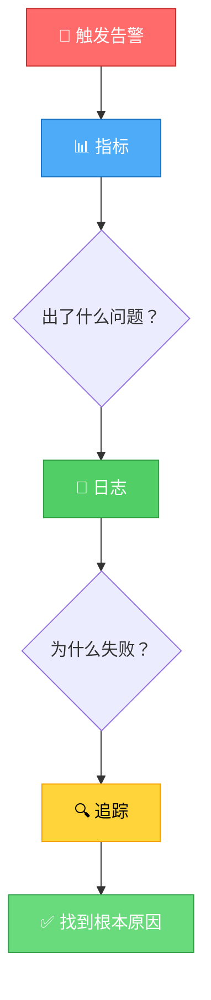
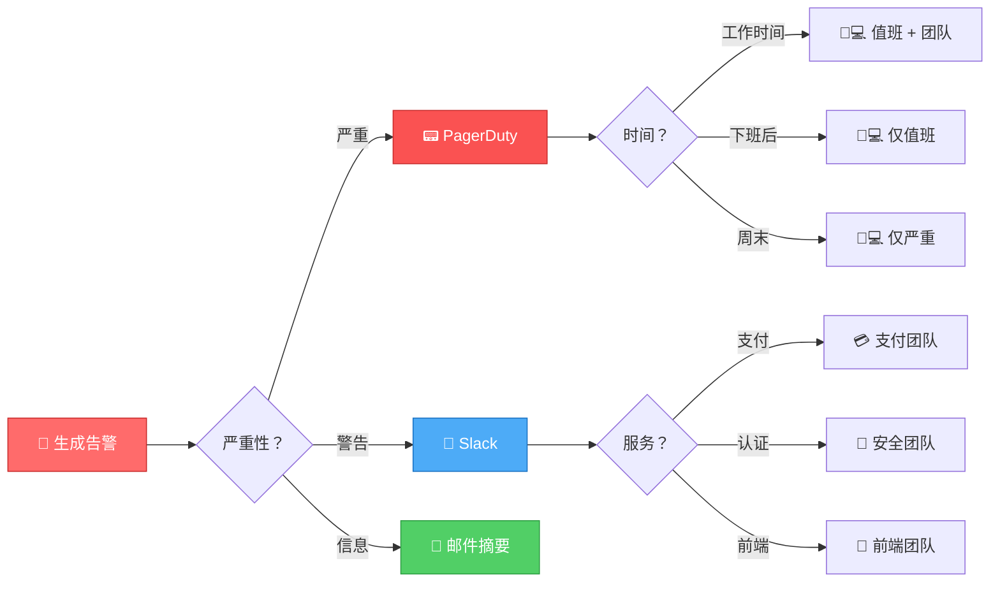

在软件运维领域，存在一个危险的假设：如果用户没有抱怨，一切就一定没问题。多年来，团队一直在黑暗中运作，只有在客户报告问题时才发现问题——或者更糟的是，当收入下降时才发现。但如果你能在问题变成灾难之前就看到它们呢？

监控是知道系统健康与希望系统健康之间的区别。是在几分钟内修复问题与几小时内修复问题的区别。是主动工程与被动救火的区别。然而，许多团队将监控视为事后考虑，认为是"有时间时"才添加的东西。

这不仅仅是收集指标——而是从第一天起就将可观测性构建到系统中。是将数据转化为洞察，将洞察转化为行动。

## 盲目飞行的代价

在没有适当监控的情况下运作就像闭着眼睛开车。你可能会幸运一段时间，但最终会撞车。后果是真实的：

**延迟的事件检测**：问题在任何人注意到之前已经恶化了几个小时。内存泄漏缓慢降低性能。故障磁盘在无人注意的情况下被填满。当用户抱怨时，损害已经造成。

**延长的停机时间**：没有监控，你不知道什么坏了。是数据库？应用服务器？网络？你浪费宝贵的时间调查而不是修复。

**收入损失**：每一分钟的停机都会损失金钱。对于电子商务网站，即使是短暂的中断也会直接转化为销售损失。对于 SaaS 平台，它会侵蚀客户信任。

**用户体验下降**：缓慢的响应时间会赶走用户。但没有监控，你不知道哪些页面慢，哪些 API 超时，或者哪些用户受到影响。

**被动文化**：团队花时间救火而不是构建。每天都有新的意外。倦怠不可避免地随之而来。

**错过优化机会**：你无法改进你无法衡量的东西。没有数据，你只能猜测哪些优化会有帮助。

!!!warning "⚠️ 隐藏成本"
    对于中型电子商务网站，一小时的停机可能会造成 10 万美元或更多的损失。在几秒钟而不是几小时内检测到问题的适当监控不是开支——而是保险。

## 监控的真正含义

监控不仅仅是收集数据——而是建立对系统健康状况的全面理解。现代监控涵盖多个层面：

**基础设施监控**：CPU 使用率、内存消耗、磁盘 I/O、网络吞吐量。系统健康的基础。

**应用监控**：请求速率、响应时间、错误率、吞吐量。你的代码在生产环境中的实际表现。

**日志聚合**：集中式日志记录，让你可以跨所有服务搜索。当出现问题时，日志告诉你原因。

**分布式追踪**：跟踪跨微服务的请求。了解在复杂架构中时间花在哪里。

**合成监控**：主动测试关键用户旅程。在真实用户遇到问题之前捕获问题。

**业务指标**：转化率、交易量、用户注册。将技术健康与业务结果联系起来。

目标不是收集每一个可能的指标——而是收集正确的指标，告诉你何时出现问题并帮助你诊断原因。

## 四个黄金信号

Google 的站点可靠性工程团队确定了监控面向用户系统最重要的四个指标：

**延迟**：服务一个请求需要多长时间？分别跟踪成功请求和失败请求——快速失败仍然是失败。

**流量**：你的系统处理多少需求？每秒请求数、每分钟交易数、并发用户数。

**错误**：你的错误率是多少？跟踪显式失败（500 错误）和隐式失败（错误内容、缓慢响应）。

**饱和度**：你的系统有多满？CPU 达到 90%、内存达到 95%、磁盘达到 80%——这些是即将失败的警告信号。


{
  "title": {
    "text": "黄金信号：系统健康概览",
    "left": "center"
  },
  "tooltip": {
    "trigger": "axis",
    "axisPointer": {
      "type": "shadow"
    }
  },
  "legend": {
    "data": ["健康", "警告", "严重"],
    "top": "10%"
  },
  "grid": {
    "left": "3%",
    "right": "4%",
    "bottom": "3%",
    "containLabel": true
  },
  "xAxis": {
    "type": "category",
    "data": ["延迟\n(ms)", "流量\n(req/s)", "错误\n(%)", "饱和度\n(%)"]
  },
  "yAxis": {
    "type": "value",
    "name": "阈值级别"
  },
  "series": [
    {
      "name": "健康",
      "type": "bar",
      "stack": "total",
      "data": [200, 1000, 0.1, 60],
      "itemStyle": {
        "color": "#51cf66"
      }
    },
    {
      "name": "警告",
      "type": "bar",
      "stack": "total",
      "data": [300, 500, 0.9, 20],
      "itemStyle": {
        "color": "#ffd43b"
      }
    },
    {
      "name": "严重",
      "type": "bar",
      "stack": "total",
      "data": [500, 200, 4, 20],
      "itemStyle": {
        "color": "#ff6b6b"
      }
    }
  ]
}


!!!tip "💡 从黄金信号开始"
    如果你从头开始构建监控，从这里开始。这四个指标以 20% 的努力提供 80% 的价值。随着需求的出现，添加更复杂的监控。

这些信号有效是因为它们以用户为中心。它们回答了这个问题："我的服务现在对用户运行良好吗？"

## 指标 vs 日志 vs 追踪

理解可观测性这三大支柱之间的区别至关重要：

**指标**是随时间变化的数值测量。它们收集和存储成本低，非常适合仪表板和告警。"CPU 使用率为 85%" 或 "响应时间为 250ms"。

**日志**是带有上下文的离散事件。它们存储成本高，但对调试非常宝贵。"用户 12345 认证失败，因为密码不正确"。

**追踪**显示请求通过系统的路径。它们对于理解分布式系统至关重要。"此结账请求在支付服务中花费了 2 秒"。

每个都有不同的目的：
- 指标告诉你出了什么问题
- 日志告诉你为什么出问题
- 追踪告诉你在哪里出问题



!!!info "ℹ️ 可观测性三角"
    指标、日志和追踪协同工作。指标提醒你问题，日志帮助诊断根本原因，追踪显示请求流。你需要全部三个才能实现完整的可观测性。

## 监控中的日志

日志通过在出现问题时提供详细上下文来补充指标。虽然指标告诉你有问题，但日志告诉你原因。

**日志对监控重要的时候**：

**调试上下文**：指标显示错误率激增。日志显示"数据库连接池耗尽"或"支付网关超时"——具体的失败。

**安全事件**：失败的登录尝试、未经授权的访问尝试、SQL 注入检测——需要立即告警的关键事件。

**业务异常**：高价值交易失败、库存不匹配、异常退款模式——影响收入的事件。

!!!info "📝 深入探讨：应用日志"
    应用日志策略、结构化日志、日志保留和日志监控模式值得单独讨论。请参阅[应用日志最佳实践](/zh-CN/2020/11/Application-Logging-Best-Practices-From-Design-to-Production/)，全面了解日志标准、设计时策略和日志管理。

**日志聚合工具**：CloudWatch Logs、ELK Stack、Splunk、Loki + Grafana 提供跨所有服务的集中式日志收集和搜索。

**对日志模式告警**：监控特定错误消息、安全事件或业务异常。将基于日志的告警与基于指标的告警结合起来，实现全面覆盖。

## 告警：信号 vs 噪音

如果没有人对指标采取行动，收集指标就毫无用处。告警将数据转化为行动——但前提是做得正确。

**告警疲劳问题**：太多告警，团队就会开始忽略它们。每个告警都应该是可操作的。如果你无法对它做任何事情，就不要对它告警。

**对症状告警，而不是原因**：当用户受到影响时告警，而不是当单个服务器的 CPU 很高时。如果你有十台服务器，一台服务器的 CPU 达到 100% 可能没问题。用户体验到缓慢的响应时间总是一个问题。

### 复合条件告警

单指标告警会产生噪音。单独的 CPU 峰值并不意味着麻烦——但 CPU 峰值加上高错误率加上缓慢的响应时间确实意味着麻烦。复合条件可以大幅减少误报。

**为什么复合条件重要**：

**糟糕的告警**：`CPU > 80%`
- 在正常流量峰值期间触发
- 在批处理作业期间触发
- 当一个进程行为异常但用户未受影响时触发

**更好的告警**：`CPU > 80% AND error_rate > 1% AND response_time > 500ms`
- 仅在用户实际受到影响时触发
- 结合基础设施和应用信号
- 将误报减少 90%

**实际示例**：

```
# 数据库过载
告警：database_connections > 90% AND query_time_p95 > 1s AND error_rate > 0.5%
含义：数据库饱和 AND 查询缓慢 AND 用户看到错误
```

```
# 内存泄漏检测
告警：memory_usage > 85% AND memory_growth_rate > 5%/hour AND uptime > 6h
含义：内存高 AND 正在增加 AND 不仅仅是启动行为
```

```
# 级联故障
告警：error_rate > 5% AND downstream_service_errors > 10% AND response_time_p99 > 2s
含义：错误率高 AND 由依赖项引起 AND 用户受到影响
```

**结合时间窗口**：

```
# 持续问题，而不是瞬时峰值
告警：avg(error_rate, 5m) > 2% AND avg(error_rate, 15m) > 1%
含义：问题是最近的但正在持续
```

!!!tip "💡 复合条件策略"
    从单个指标开始了解正常行为。一旦你知道"坏"是什么样子，就结合条件，仅在多个信号表明真正问题时告警。目标是 95% 以上可操作的告警。

**严重性级别很重要**：
- **严重**：叫醒某人。现在正在损失收入。
- **警告**：在工作时间调查。某些事情很快需要关注。
- **信息**：仅供了解。不需要立即采取行动。

**运行手册节省时间**：每个告警都应该链接到一个运行手册，解释它的含义以及如何修复它。在凌晨 3 点，清晰度很重要。

**对趋势告警，而不是峰值**：短暂的 CPU 峰值可能是正常的。CPU 持续 10 分钟以上超过 80% 是一个问题。

!!!warning "⚠️ 告警疲劳会扼杀监控"
    如果你的团队每周收到超过 5-10 个告警，你的告警太多了。调整阈值，减少噪音，专注于重要的事情。被忽略的告警比没有告警更糟——它会产生虚假的信心。

## 真正有用的仪表板

仪表板应该回答问题，而不仅仅是显示数据。一墙的图表令人印象深刻，但如果你无法快速了解系统健康状况，它就毫无用处。

**仪表板的层次结构**：

**高管仪表板**：高层业务指标。网站是否正常运行？用户是否满意？我们是否在赚钱？

**服务仪表板**：每个服务的健康状况。请求速率、错误率、延迟百分位数、资源使用情况。

**调试仪表板**：用于故障排除的详细指标。当出现问题时，这是你深入挖掘的地方。

**设计原则**：
- **最重要的指标在顶部**：不要让人们滚动才能看到网站是否宕机。
- **有意义地使用颜色**：绿色 = 良好，黄色 = 警告，红色 = 严重。不仅仅是装饰。
- **显示趋势，而不仅仅是当前值**：CPU 使用率是在增加还是稳定？上下文很重要。
- **包括 SLO 指标**：你是否达到服务级别目标？这才是真正重要的。

## 向正确的方交付

如果信息没有到达能够采取行动的人手中，最好的监控系统也毫无用处。不同的利益相关者需要不同的视图和不同的告警渠道。

### 按角色划分的仪表板访问

**高管和产品经理**：
- **他们需要什么**：业务指标、正常运行时间百分比、用户影响
- **仪表板重点**：高层 KPI、SLO 合规性、事件摘要
- **访问方式**：Web 仪表板、周报、移动应用
- **示例指标**：本月 99.9% 正常运行时间、5 万活跃用户、处理了 200 万美元交易

**工程团队**：
- **他们需要什么**：技术指标、服务健康、资源利用率
- **仪表板重点**：服务级别仪表板、错误率、延迟百分位数
- **访问方式**：Grafana、团队特定仪表板、Slack 集成
- **示例指标**：API 响应时间 p95、数据库连接池使用情况、部署成功率

**值班工程师**：
- **他们需要什么**：可操作的告警、调试上下文、运行手册链接
- **仪表板重点**：实时服务状态、最近部署、活动事件
- **访问方式**：PagerDuty、移动告警、事件响应仪表板
- **示例指标**：当前错误峰值、受影响的服务、类似的过去事件

**DevOps/SRE 团队**：
- **他们需要什么**：基础设施指标、容量规划数据、成本分析
- **仪表板重点**：资源利用率趋势、扩展指标、基础设施成本
- **访问方式**：CloudWatch、Datadog、自定义仪表板
- **示例指标**：30 天 CPU 趋势、存储增长率、每月 AWS 账单明细

### 告警路由策略



**按严重性路由**：

```
严重告警 → PagerDuty → 电话 + 短信
警告告警 → Slack #alerts 频道
信息告警 → 邮件摘要（每日汇总）
```

**按服务所有权路由**：

```
支付服务错误 → payments-team Slack 频道
认证服务错误 → security-team PagerDuty
前端错误 → frontend-team 邮件
```

**按时间路由**：

```
工作时间（上午 9 点 - 下午 6 点）→ Slack + 邮件
下班后 → PagerDuty（仅值班）
周末 → PagerDuty（仅严重）
```

**按影响路由**：

```
面向用户的问题 → 立即 PagerDuty
内部工具 → Slack 通知
批处理作业失败 → 邮件给团队负责人
```

!!!tip "📱 多渠道策略"
    使用多个渠道进行升级：Slack 通知 → 5 分钟后邮件 → 10 分钟后 PagerDuty → 15 分钟后电话。这确保关键告警不会被错过，同时减少非紧急问题的噪音。

### 通知最佳实践

**在告警中包含上下文**：

**糟糕**："服务器 123 上的 CPU 高"

**良好**："[严重] 200 个用户受影响 - 支付 API：CPU >90% 持续 10 分钟，错误率 5%。运行手册：hxxps[://]wiki/payment-cpu

**可操作的信息**：
- **影响级别优先**：[严重]、[警告]、[信息] - 一眼就能告诉接收者紧急程度
- **用户影响**：有多少用户受到影响（最重要的指标）
- **什么坏了**：服务名称和具体问题
- **上下文**：持续时间、错误率、相关指标
- **运行手册链接**：如何修复它
- **相关仪表板链接**：在哪里调查
- **最近的更改**：可能导致它的部署、配置更新

**避免告警风暴**：
- 分组相关告警（"5 台服务器宕机"而不是 5 个单独的告警）
- 在时间窗口内抑制重复告警
- 在维护窗口期间暂停告警

**升级策略**：

```
1. 告警主要值班工程师
2. 如果 15 分钟内没有响应，告警次要值班工程师
3. 如果 30 分钟内没有响应，告警团队负责人
4. 如果 45 分钟内没有响应，告警工程经理
```

### 仪表板共享

**公共状态页面**：向客户展示他们需要知道的内容——正常运行时间、正在进行的事件、计划维护。不要暴露内部指标。

**团队仪表板**：每个团队拥有他们的服务仪表板。在中央仪表板目录中使它们可被发现。

**事件作战室**：在事件期间，创建一个临时仪表板，在一个地方显示所有相关指标。在事件 Slack 频道中共享链接。

**高管摘要**：自动化的周报，包含关键指标、趋势和事件。每周一早上通过邮件发送。

!!!info "ℹ️ 访问控制很重要"
    不是每个人都应该看到所有内容。日志中的生产数据库凭据？限制访问。追踪中的客户 PII？屏蔽它。安全指标？限制给安全团队。在透明度和安全性之间取得平衡。

## RED 方法

对于每个服务，跟踪三个指标：

**速率（Rate）**：每秒请求数。这个服务有多忙？

**错误（Errors）**：每秒失败请求数。什么在出错？

**持续时间（Duration）**：请求需要多长时间。用户在等待吗？

这个简单的框架适用于任何请求驱动的服务——Web 服务器、API、消息队列、数据库。它是专注于服务健康的黄金信号的实际实现。

## 不同架构中的监控

监控策略因架构而异：

### 单体应用

**更简单的监控**：一个应用、一个数据库、更少的移动部件。专注于应用指标、数据库性能和服务器资源。

**挑战**：对内部组件的可见性较低。一个缓慢的端点可能是由代码库的任何部分引起的。

### 微服务

**复杂的监控**：许多服务、许多数据库、许多故障模式。分布式追踪变得至关重要。

**挑战**：理解级联故障。服务 A 调用 B 调用 C——请求在哪里变慢了？

**解决方案**：实施分布式追踪（OpenTelemetry、Jaeger、Zipkin）以跟踪跨服务边界的请求。

### 无服务器

**不同的指标**：冷启动时间、函数持续时间、并发执行、限流率。

**挑战**：对基础设施的控制较少。你监控的是函数行为，而不是服务器健康。

**解决方案**：专注于函数级别的指标和业务结果，而不是基础设施指标。

## 监控技术栈

构建监控系统需要为每一层选择工具：

**指标收集和存储**：
- **Prometheus**：开源、基于拉取、非常适合 Kubernetes
- **InfluxDB**：时间序列数据库，适合高基数数据
- **CloudWatch**：AWS 原生，与 AWS 服务无缝集成
- **Datadog**：商业 SaaS，全面但昂贵

**日志聚合**：
- **ELK Stack**（Elasticsearch、Logstash、Kibana）：强大但资源密集
- **Loki**：Elasticsearch 的轻量级替代品，专为 Kubernetes 设计
- **CloudWatch Logs**：AWS 原生，简单但搜索能力有限
- **Splunk**：企业级，昂贵，强大的分析

**分布式追踪**：
- **Jaeger**：开源，CNCF 项目，良好的 Kubernetes 集成
- **Zipkin**：成熟的开源选项
- **AWS X-Ray**：AWS 原生，AWS 服务的简单设置
- **Datadog APM**：商业，全面但昂贵

**可视化**：
- **Grafana**：开源，支持多个数据源，高度可定制
- **Kibana**：ELK 堆栈的一部分，适合日志可视化
- **CloudWatch Dashboards**：AWS 原生，基本但功能齐全

**告警**：
- **Prometheus Alertmanager**：灵活的路由、分组、静默
- **PagerDuty**：值班管理、升级策略
- **Opsgenie**：类似于 PagerDuty，良好的 Slack 集成

!!!tip "💡 从简单开始，逐步扩展"
    不要在第一天就构建完美的监控堆栈。从 CloudWatch 或 Prometheus + Grafana 开始。在需要时添加日志聚合。当微服务使调试变得困难时添加分布式追踪。让复杂性随着需求增长。

## 监控最佳实践

**尽早检测**：在编写代码时添加监控，而不是在生产环境中出现问题后。使其成为完成定义的一部分。

**监控用户体验**：内部指标很重要，但面向用户的指标更重要。从用户角度看的响应时间才是最重要的。

**设置有意义的阈值**：不要对任意数字告警。基于 SLO 和实际用户影响设置阈值。

**测试你的监控**：定期验证告警是否在应该触发时触发。混沌工程有助于验证监控覆盖范围。

**记录一切**：每个指标都应该有描述。每个告警都应该有运行手册。未来的你会感谢现在的你。

**审查和改进**：监控不是一劳永逸的。定期审查告警频率、仪表板有用性和指标相关性。

**监控监控器**：如果你的监控系统失败了会发生什么？有外部合成检查来验证你的应用和监控。

**将指标与部署关联**：在仪表板上叠加部署标记。当指标变化时，你会知道是否是部署导致的。

## 常见的监控错误

**监控一切**：更多指标并不意味着更好的监控。专注于重要的事情。高基数指标（唯一用户 ID、请求 ID）可能会压垮你的系统。

**忽略百分位数**：平均值会撒谎。100ms 的平均响应时间可能隐藏了 5% 的请求需要 10 秒的事实。监控 p95、p99 和 p99.9。

**对一切告警**：如果一切都是严重的，那么什么都不是严重的。为需要立即关注的可操作问题保留告警。

**告警中没有上下文**："CPU 高"没有帮助。"Web 服务器 CPU >90% 持续 10 分钟，用户体验到页面加载缓慢"是可操作的。

**忘记成本**：监控可能会变得昂贵。Datadog 账单很容易达到每月数千美元。在可观测性需求和预算约束之间取得平衡。

**不监控业务指标**：技术指标很重要，但业务指标更重要。用户在转化吗？交易在完成吗？收入在流动吗？

## 建立监控文化

仅靠技术无法创造良好的监控——文化才能：

**使指标可见**：在公共区域显示仪表板。让系统健康对每个人都透明。

**庆祝改进**：当有人添加有用的监控或改进告警时，认可它。使可观测性成为一项有价值的技能。

**从事件中学习**：每个事件都是一个监控缺口。什么指标可以更早地捕获这个？添加它。

**共同责任**：监控不仅仅是运维团队的事。开发人员应该检测他们的代码。产品经理应该关心业务指标。

**无责备的事后分析**：当监控未能捕获问题时，专注于改进系统，而不是责备人。

## 监控的投资回报率

监控在你需要它之前感觉像是开销。但投资回报率是明确的：

**减少停机时间**：在几秒钟而不是几小时内捕获问题意味着更少的收入损失和更快乐的用户。

**更快的调试**：当出现问题时，良好的监控会准确告诉你在哪里查找。几小时的调查变成几分钟。

**主动优化**：在瓶颈成为问题之前识别它们。在资源耗尽之前扩展资源。

**更好的容量规划**：历史指标显示增长趋势。基于数据而不是猜测来规划基础设施需求。

**改善睡眠**：值班工程师睡得更好，因为他们知道如果出现问题会收到告警——并且有工具可以快速修复它。

## 做出选择

问题不是是否实施监控——而是多少和何时。对于任何为真实用户提供服务的生产系统，监控都是不可协商的。唯一的问题是它需要多复杂。

从基础开始：四个黄金信号、基本告警、简单仪表板。随着系统的增长和变得更加关键，添加日志聚合、分布式追踪和高级分析。

记住：你无法修复你看不见的东西。你无法改进你无法衡量的东西。如果你不知道系统是否健康，你就无法睡个好觉。

监控不是开销——它是保险。它是对灾难做出反应和预防灾难之间的区别。它是可靠系统和可持续运维的基础。

从第一天起就将可观测性构建到你的系统中。你未来的自己——以及你的用户——会感谢你。
