In the world of software operations, there's a dangerous assumption: if users aren't complaining, everything must be fine. For years, teams have operated in the dark, only discovering problems when customers report them—or worse, when revenue drops. But what if you could see problems before they become disasters?

Monitoring is the difference between knowing your system is healthy and hoping it is. It's the difference between fixing issues in minutes versus hours. It's the difference between proactive engineering and reactive firefighting. Yet many teams treat monitoring as an afterthought, something to add "when we have time."

This isn't just about collecting metrics—it's about building observability into your systems from day one. It's about transforming data into insights, and insights into action.

## The Cost of Flying Blind

Operating without proper monitoring is like driving with your eyes closed. You might get lucky for a while, but eventually, you'll crash. The consequences are real:

**Delayed incident detection**: Problems fester for hours before anyone notices. A memory leak slowly degrades performance. A failing disk fills up unnoticed. By the time users complain, the damage is done.

**Extended downtime**: Without monitoring, you don't know what's broken. Is it the database? The application server? The network? You waste precious minutes investigating instead of fixing.

**Revenue loss**: Every minute of downtime costs money. For e-commerce sites, even brief outages translate directly to lost sales. For SaaS platforms, it erodes customer trust.

**Degraded user experience**: Slow response times drive users away. But without monitoring, you don't know which pages are slow, which APIs are timing out, or which users are affected.

**Reactive culture**: Teams spend their time firefighting instead of building. Every day brings new surprises. Burnout follows inevitably.

**Missed optimization opportunities**: You can't improve what you don't measure. Without data, you're guessing which optimizations will help.

!!!warning "⚠️ The Hidden Cost"
    A single hour of downtime for a mid-sized e-commerce site can cost $100,000 or more. Proper monitoring that detects issues in seconds instead of hours isn't an expense—it's insurance.

## What Monitoring Actually Means

Monitoring isn't just about collecting data—it's about building a comprehensive understanding of your system's health. Modern monitoring encompasses several layers:

**Infrastructure monitoring**: CPU usage, memory consumption, disk I/O, network throughput. The foundation of system health.

**Application monitoring**: Request rates, response times, error rates, throughput. How your code actually performs in production.

**Log aggregation**: Centralized logging that lets you search across all services. When something breaks, logs tell you why.

**Distributed tracing**: Following requests across microservices. Understanding where time is spent in complex architectures.

**Synthetic monitoring**: Proactively testing critical user journeys. Catching problems before real users encounter them.

**Business metrics**: Conversion rates, transaction volumes, user signups. Connecting technical health to business outcomes.

The goal isn't to collect every possible metric—it's to collect the right metrics that tell you when something is wrong and help you diagnose why.

## The Four Golden Signals

Google's Site Reliability Engineering team identified four metrics that matter most for monitoring user-facing systems:

**Latency**: How long does it take to serve a request? Track both successful requests and failed requests separately—a fast failure is still a failure.

**Traffic**: How much demand is your system handling? Requests per second, transactions per minute, concurrent users.

**Errors**: What's your error rate? Track both explicit failures (500 errors) and implicit failures (wrong content, slow responses).

**Saturation**: How full is your system? CPU at 90%, memory at 95%, disk at 80%—these are warning signs of impending failure.


{
  "title": {
    "text": "Golden Signals: System Health Overview",
    "left": "center"
  },
  "tooltip": {
    "trigger": "axis",
    "axisPointer": {
      "type": "shadow"
    }
  },
  "legend": {
    "data": ["Healthy", "Warning", "Critical"],
    "top": "10%"
  },
  "grid": {
    "left": "3%",
    "right": "4%",
    "bottom": "3%",
    "containLabel": true
  },
  "xAxis": {
    "type": "category",
    "data": ["Latency\n(ms)", "Traffic\n(req/s)", "Errors\n(%)", "Saturation\n(%)"]
  },
  "yAxis": {
    "type": "value",
    "name": "Threshold Levels"
  },
  "series": [
    {
      "name": "Healthy",
      "type": "bar",
      "stack": "total",
      "data": [200, 1000, 0.1, 60],
      "itemStyle": {
        "color": "#51cf66"
      }
    },
    {
      "name": "Warning",
      "type": "bar",
      "stack": "total",
      "data": [300, 500, 0.9, 20],
      "itemStyle": {
        "color": "#ffd43b"
      }
    },
    {
      "name": "Critical",
      "type": "bar",
      "stack": "total",
      "data": [500, 200, 4, 20],
      "itemStyle": {
        "color": "#ff6b6b"
      }
    }
  ]
}


!!!tip "💡 Start with the Golden Signals"
    If you're building monitoring from scratch, start here. These four metrics give you 80% of the value with 20% of the effort. Add more sophisticated monitoring as needs emerge.

These signals work because they're user-centric. They answer the question: "Is my service working well for users right now?"

## Metrics vs Logs vs Traces

Understanding the difference between these three pillars of observability is crucial:

**Metrics** are numerical measurements over time. They're cheap to collect and store, making them ideal for dashboards and alerts. "CPU usage is 85%" or "Response time is 250ms."

**Logs** are discrete events with context. They're expensive to store but invaluable for debugging. "User 12345 failed to authenticate because password was incorrect."

**Traces** show the path of a request through your system. They're essential for understanding distributed systems. "This checkout request spent 2 seconds in the payment service."

Each serves a different purpose:
- Metrics tell you something is wrong
- Logs tell you why it's wrong
- Traces tell you where it's wrong

```mermaid
graph TD
    A["🔔 Alert Triggered"] --> B["📊 Metrics"]
    B --> C{"What's Wrong?"}
    C --> D["📝 Logs"]
    D --> E{"Why It Failed?"}
    E --> F["🔍 Traces"]
    F --> G["✅ Root Cause Found"]
    
    style A fill:#ff6b6b,stroke:#c92a2a,color:#fff
    style B fill:#4dabf7,stroke:#1971c2,color:#fff
    style D fill:#51cf66,stroke:#2f9e44,color:#fff
    style F fill:#ffd43b,stroke:#f59f00,color:#000
    style G fill:#69db7c,stroke:#2f9e44,color:#fff
```



!!!info "ℹ️ The Observability Triangle"
    Metrics, logs, and traces work together. Metrics alert you to problems, logs help diagnose root causes, and traces show you the request flow. You need all three for complete observability.

## Logs in Monitoring

Logs complement metrics by providing detailed context when something goes wrong. While metrics tell you there's a problem, logs tell you why.

**When logs matter for monitoring**:

**Debugging context**: Metrics show error rate spiked. Logs show "Database connection pool exhausted" or "Payment gateway timeout"—the specific failure.

**Security events**: Failed login attempts, unauthorized access attempts, SQL injection detection—critical events that need immediate alerting.

**Business anomalies**: High-value transaction failures, inventory mismatches, unusual refund patterns—events that impact revenue.

!!!info "📝 Deep Dive: Application Logging"
    Application logging strategy, structured logging, log retention, and log monitoring patterns deserve their own discussion. See [Application Logging Best Practices](/2020/11/Application-Logging-Best-Practices-From-Design-to-Production/) for comprehensive coverage of logging standards, design-time strategies, and log management.

**Log aggregation tools**: CloudWatch Logs, ELK Stack, Splunk, Loki + Grafana provide centralized log collection and searching across all services.

**Alert on log patterns**: Monitor for specific error messages, security events, or business anomalies. Combine log-based alerts with metric-based alerts for comprehensive coverage.

## Alerting: Signal vs Noise

Collecting metrics is useless if no one acts on them. Alerting turns data into action—but only if done right.

**The alert fatigue problem**: Too many alerts and teams start ignoring them. Every alert should be actionable. If you can't do anything about it, don't alert on it.

**Alert on symptoms, not causes**: Alert when users are affected, not when a single server's CPU is high. One server at 100% CPU might be fine if you have ten servers. Users experiencing slow response times is always a problem.

### Compound Condition Alerts

Single-metric alerts create noise. A CPU spike alone doesn't mean trouble—but CPU spike plus high error rate plus slow response time does. Compound conditions reduce false positives dramatically.

**Why compound conditions matter**:

**Bad alert**: `CPU > 80%`
- Fires during normal traffic spikes
- Fires during batch jobs
- Fires when one process misbehaves but users are unaffected

**Better alert**: `CPU > 80% AND error_rate > 1% AND response_time > 500ms`
- Only fires when users are actually impacted
- Combines infrastructure and application signals
- Reduces false positives by 90%

**Real-world examples**:

```
# Database overload
ALERT: database_connections > 90% AND query_time_p95 > 1s AND error_rate > 0.5%
Meaning: Database is saturated AND queries are slow AND users are seeing errors
```

```
# Memory leak detection
ALERT: memory_usage > 85% AND memory_growth_rate > 5%/hour AND uptime > 6h
Meaning: Memory is high AND increasing AND not just startup behavior
```

```
# Cascading failure
ALERT: error_rate > 5% AND downstream_service_errors > 10% AND response_time_p99 > 2s
Meaning: Errors are high AND caused by dependency AND users are affected
```

**Combining time windows**:

```
# Sustained problem, not transient spike
ALERT: avg(error_rate, 5m) > 2% AND avg(error_rate, 15m) > 1%
Meaning: Problem is recent but persisting
```

!!!tip "💡 Compound Condition Strategy"
    Start with single metrics to understand normal behavior. Once you know what "bad" looks like, combine conditions to alert only when multiple signals indicate real problems. Aim for alerts that are 95%+ actionable.

**Severity levels matter**:
- **Critical**: Wake someone up. Revenue is being lost right now.
- **Warning**: Investigate during business hours. Something needs attention soon.
- **Info**: For awareness only. No immediate action required.

**Runbooks save time**: Every alert should link to a runbook explaining what it means and how to fix it. At 3 AM, clarity matters.

**Alert on trends, not spikes**: A brief CPU spike might be normal. CPU consistently above 80% for 10 minutes is a problem.

!!!warning "⚠️ Alert Fatigue Kills Monitoring"
    If your team receives more than 5-10 alerts per week, you have too many alerts. Tune thresholds, reduce noise, and focus on what matters. An ignored alert is worse than no alert—it creates false confidence.

## Dashboards That Actually Help

Dashboards should answer questions, not just display data. A wall of graphs is impressive but useless if you can't quickly understand system health.

**The hierarchy of dashboards**:

**Executive dashboard**: High-level business metrics. Is the site up? Are users happy? Are we making money?

**Service dashboard**: Per-service health. Request rates, error rates, latency percentiles, resource usage.

**Debugging dashboard**: Detailed metrics for troubleshooting. When something breaks, this is where you dig deep.

**Design principles**:
- **Most important metrics at the top**: Don't make people scroll to see if the site is down.
- **Use color meaningfully**: Green = good, yellow = warning, red = critical. Not just for decoration.
- **Show trends, not just current values**: Is CPU usage increasing or stable? Context matters.
- **Include SLO indicators**: Are you meeting your service level objectives? This is what actually matters.

## Delivering to the Right Party

The best monitoring system is useless if information doesn't reach the people who can act on it. Different stakeholders need different views and different alert channels.

### Dashboard Access by Role

**Executives and Product Managers**:
- **What they need**: Business metrics, uptime percentage, user impact
- **Dashboard focus**: High-level KPIs, SLO compliance, incident summaries
- **Access method**: Web dashboard, weekly reports, mobile app
- **Example metrics**: 99.9% uptime this month, 50K active users, $2M transactions processed

**Engineering Teams**:
- **What they need**: Technical metrics, service health, resource utilization
- **Dashboard focus**: Service-level dashboards, error rates, latency percentiles
- **Access method**: Grafana, team-specific dashboards, Slack integrations
- **Example metrics**: API response time p95, database connection pool usage, deployment success rate

**On-Call Engineers**:
- **What they need**: Actionable alerts, debugging context, runbook links
- **Dashboard focus**: Real-time service status, recent deployments, active incidents
- **Access method**: PagerDuty, mobile alerts, incident response dashboard
- **Example metrics**: Current error spike, affected services, similar past incidents

**DevOps/SRE Teams**:
- **What they need**: Infrastructure metrics, capacity planning data, cost analysis
- **Dashboard focus**: Resource utilization trends, scaling metrics, infrastructure costs
- **Access method**: CloudWatch, Datadog, custom dashboards
- **Example metrics**: CPU trends over 30 days, storage growth rate, monthly AWS bill breakdown

### Alert Routing Strategy


**Route by severity**:

```
Critical alerts → PagerDuty → Phone call + SMS
Warning alerts → Slack #alerts channel
Info alerts → Email digest (daily summary)
```

**Route by service ownership**:

```
Payment service errors → payments-team Slack channel
Auth service errors → security-team PagerDuty
Frontend errors → frontend-team email
```

**Route by time**:

```
Business hours (9am-6pm) → Slack + Email
After hours → PagerDuty (on-call only)
Weekends → PagerDuty (critical only)
```

**Route by impact**:

```
User-facing issues → Immediate PagerDuty
Internal tools → Slack notification
Batch job failures → Email to team lead
```

!!!tip "📱 Multi-Channel Strategy"
    Use multiple channels with escalation: Slack notification → Email after 5 min → PagerDuty after 10 min → Phone call after 15 min. This ensures critical alerts don't get missed while reducing noise for non-urgent issues.

### Notification Best Practices

**Include context in alerts**:

**Bad**: "High CPU on server-123"

**Good**: "[CRITICAL] 200 users affected - Payment API: CPU >90% for 10min, error rate 5%. Runbook: hxxps[://]wiki/payment-cpu

**Actionable information**:
- **Impact level first**: [CRITICAL], [WARNING], [INFO] - tells recipient urgency at a glance
- **User impact**: How many users are affected (most important metric)
- **What's broken**: Service name and specific problem
- **Context**: Duration, error rates, related metrics
- **Link to runbook**: How to fix it
- **Link to relevant dashboard**: Where to investigate
- **Recent changes**: Deployments, config updates that might have caused it

**Avoid alert storms**:
- Group related alerts ("5 servers down" not 5 separate alerts)
- Suppress duplicate alerts within time window
- Pause alerts during maintenance windows

**Escalation policies**:

```
1. Alert primary on-call engineer
2. If no response in 15 minutes, alert secondary
3. If no response in 30 minutes, alert team lead
4. If no response in 45 minutes, alert engineering manager
```

### Dashboard Sharing

**Public status page**: Show customers what they need to know—uptime, ongoing incidents, scheduled maintenance. Don't expose internal metrics.

**Team dashboards**: Each team owns their service dashboards. Make them discoverable in a central dashboard directory.

**Incident war room**: During incidents, create a temporary dashboard showing all relevant metrics in one place. Share the link in the incident Slack channel.

**Executive summaries**: Automated weekly reports with key metrics, trends, and incidents. Delivered via email every Monday morning.

!!!info "ℹ️ Access Control Matters"
    Not everyone should see everything. Production database credentials in logs? Restrict access. Customer PII in traces? Mask it. Security metrics? Limit to security team. Balance transparency with security.

## The RED Method

For every service, track three metrics:

**Rate**: Requests per second. How busy is this service?

**Errors**: Failed requests per second. What's breaking?

**Duration**: How long requests take. Are users waiting?

This simple framework works for any request-driven service—web servers, APIs, message queues, databases. It's a practical implementation of the golden signals focused on service health.

## Monitoring in Different Architectures

Monitoring strategies vary based on your architecture:

### Monolithic Applications

**Simpler monitoring**: One application, one database, fewer moving parts. Focus on application metrics, database performance, and server resources.

**Challenges**: Less visibility into internal components. A slow endpoint might be caused by any part of the codebase.

### Microservices

**Complex monitoring**: Many services, many databases, many failure modes. Distributed tracing becomes essential.

**Challenges**: Understanding cascading failures. Service A calls B calls C—where did the request slow down?

**Solution**: Implement distributed tracing (OpenTelemetry, Jaeger, Zipkin) to follow requests across service boundaries.

### Serverless

**Different metrics**: Cold start times, function duration, concurrent executions, throttling rates.

**Challenges**: Less control over infrastructure. You're monitoring function behavior, not server health.

**Solution**: Focus on function-level metrics and business outcomes rather than infrastructure metrics.

## The Monitoring Stack

Building a monitoring system requires choosing tools for each layer:

**Metrics collection and storage**:
- **Prometheus**: Open-source, pull-based, excellent for Kubernetes
- **InfluxDB**: Time-series database, good for high-cardinality data
- **CloudWatch**: AWS-native, integrates seamlessly with AWS services
- **Datadog**: Commercial SaaS, comprehensive but expensive

**Log aggregation**:
- **ELK Stack** (Elasticsearch, Logstash, Kibana): Powerful but resource-intensive
- **Loki**: Lightweight alternative to Elasticsearch, designed for Kubernetes
- **CloudWatch Logs**: AWS-native, simple but limited search capabilities
- **Splunk**: Enterprise-grade, expensive, powerful analytics

**Distributed tracing**:
- **Jaeger**: Open-source, CNCF project, good Kubernetes integration
- **Zipkin**: Mature open-source option
- **AWS X-Ray**: AWS-native, simple setup for AWS services
- **Datadog APM**: Commercial, comprehensive but costly

**Visualization**:
- **Grafana**: Open-source, supports multiple data sources, highly customizable
- **Kibana**: Part of ELK stack, good for log visualization
- **CloudWatch Dashboards**: AWS-native, basic but functional

**Alerting**:
- **Prometheus Alertmanager**: Flexible routing, grouping, silencing
- **PagerDuty**: On-call management, escalation policies
- **Opsgenie**: Similar to PagerDuty, good Slack integration

!!!tip "💡 Start Simple, Scale Up"
    Don't build the perfect monitoring stack on day one. Start with CloudWatch or Prometheus + Grafana. Add log aggregation when you need it. Add distributed tracing when microservices make debugging hard. Let complexity grow with needs.

## Monitoring Best Practices

**Instrument early**: Add monitoring when you write code, not after it breaks in production. Make it part of your definition of done.

**Monitor what users experience**: Internal metrics matter, but user-facing metrics matter more. Response time from the user's perspective is what counts.

**Set meaningful thresholds**: Don't alert on arbitrary numbers. Base thresholds on SLOs and actual user impact.

**Test your monitoring**: Regularly verify that alerts fire when they should. Chaos engineering helps validate monitoring coverage.

**Document everything**: Every metric should have a description. Every alert should have a runbook. Future you will thank present you.

**Review and refine**: Monitoring isn't set-and-forget. Regularly review alert frequency, dashboard usefulness, and metric relevance.

**Monitor the monitors**: What happens if your monitoring system fails? Have external synthetic checks that verify both your application and your monitoring.

**Correlate metrics with deployments**: Overlay deployment markers on your dashboards. When metrics change, you'll know if a deployment caused it.


## Common Monitoring Mistakes

**Monitoring everything**: More metrics don't mean better monitoring. Focus on what matters. High-cardinality metrics (unique user IDs, request IDs) can overwhelm your system.

**Ignoring percentiles**: Averages lie. A 100ms average response time might hide the fact that 5% of requests take 10 seconds. Monitor p95, p99, and p99.9.

**Alert on everything**: If everything is critical, nothing is critical. Reserve alerts for actionable problems that need immediate attention.

**No context in alerts**: "CPU high" isn't helpful. "Web server CPU >90% for 10 minutes, users experiencing slow page loads" is actionable.

**Forgetting about costs**: Monitoring can get expensive. Datadog bills can easily reach thousands per month. Balance observability needs with budget constraints.

**Not monitoring business metrics**: Technical metrics are important, but business metrics matter more. Are users converting? Are transactions completing? Is revenue flowing?

## Building a Monitoring Culture

Technology alone doesn't create good monitoring—culture does:

**Make metrics visible**: Display dashboards in common areas. Make system health transparent to everyone.

**Celebrate improvements**: When someone adds useful monitoring or improves an alert, recognize it. Make observability a valued skill.

**Learn from incidents**: Every incident is a monitoring gap. What metric would have caught this earlier? Add it.

**Shared responsibility**: Monitoring isn't just for ops teams. Developers should instrument their code. Product managers should care about business metrics.

**Blameless postmortems**: When monitoring fails to catch an issue, focus on improving the system, not blaming people.

## The ROI of Monitoring

Monitoring feels like overhead until you need it. But the return on investment is clear:

**Reduced downtime**: Catching issues in seconds instead of hours means less revenue loss and happier users.

**Faster debugging**: When something breaks, good monitoring tells you exactly where to look. Hours of investigation become minutes.

**Proactive optimization**: Identify bottlenecks before they become problems. Scale resources before you run out.

**Better capacity planning**: Historical metrics show growth trends. Plan infrastructure needs based on data, not guesses.

**Improved sleep**: On-call engineers sleep better knowing they'll be alerted if something breaks—and have the tools to fix it quickly.

## Making the Choice

The question isn't whether to implement monitoring—it's how much and when. For any production system serving real users, monitoring is non-negotiable. The only question is how sophisticated it needs to be.

Start with the basics: the four golden signals, basic alerting, simple dashboards. As your system grows and becomes more critical, add log aggregation, distributed tracing, and advanced analytics.

Remember: you can't fix what you can't see. You can't improve what you don't measure. And you can't sleep well if you don't know your system is healthy.

Monitoring isn't overhead—it's insurance. It's the difference between reacting to disasters and preventing them. It's the foundation of reliable systems and sustainable operations.

Build observability into your systems from day one. Your future self—and your users—will thank you.
