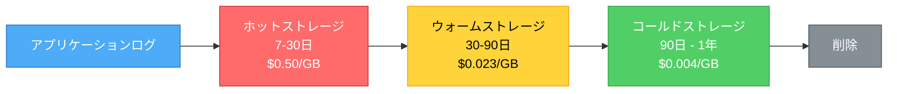

ほとんどのチームはログを後付けとして扱います。彼らはコード全体に`console.log()`と`print()`ステートメントを散りばめ、何かが壊れたときに十分な情報をキャプチャすることを期待しています。そして本番環境が午前3時に失敗し、ログが役に立たないことに気づきます - 一貫性のないフォーマット、欠けているコンテキスト、構造なし。

効果的なログはデプロイ時に始まりません。アプリケーション設計中に始まります。コードを書く前に行う決定が、ログが何時間ものデバッグを節約するか、ノイズで時間を無駄にするかを決定します。

これはログフレームワークやツールについてではありません - 戦略についてです。混乱を増やすのではなく、質問に答えるログを設計することです。

## ログ戦略が重要な理由

**午前3時のテスト**：アプリケーションが午前3時に壊れたとき、ログだけから問題を診断できますか？それとも、より多くのログを追加し、再デプロイし、問題が再び発生するのを待つ必要がありますか？

**悪いログのコスト**：
- **延長された停止**：ログが何が失敗したかを示さないため、デバッグに何時間も費やす
- **繰り返されるインシデント**：ログが根本原因をキャプチャしなかったため、同じ問題が再び発生
- **アラート疲労**：ノイズが多すぎて、シグナルが見つからない
- **ストレージコスト**：すべてをログすると、価値なしで月に数千ドルかかる

**良いログの価値**：
- **高速デバッグ**：何時間ではなく数分で根本原因を見つける
- **積極的な検出**：ユーザーが苦情を言う前に問題をキャッチ
- **監査証跡**：誰が何をいつ行ったかを知る
- **ビジネス洞察**：トランザクション、ユーザー行動、システムヘルスを追跡

!!!warning "⚠️ 事後にログを追加することはできません"
    本番環境がダウンしているとき、ログを追加して再デプロイすることはできません。持っているもので作業します。最初から正しくログを設計してください。

## 設計時のログ戦略

効果的なログには、コードを書く前に標準、構造、計画が必要です。

### ログ標準を早期に定義

**ログレベル標準**：組織全体で各レベルをいつ使用するかを文書化します。標準がなければ、ある開発者のERRORは別の開発者のWARNINGです。

```
DEBUG: 変数値、関数の入出力（開発のみ）
INFO: ユーザーアクション、ビジネスイベント（「ユーザー123がログイン」）
WARNING: 回復可能な問題（「API遅い、再試行中」、「キャッシュミス」）
ERROR: 操作は失敗したがアプリは継続（「支払い失敗」、「メール未送信」）
CRITICAL: サービスが劣化またはダウン（「データベース到達不能」、「メモリ不足」）
```

### エラー分類

監視とアラートのニーズに合わせたエラーカテゴリを定義します。

```
# インフラストラクチャエラー
ERROR [INFRA.DATABASE]: 接続プールが枯渇
ERROR [INFRA.NETWORK]: payment-serviceへの接続タイムアウト
ERROR [INFRA.STORAGE]: ディスク書き込み失敗

# アプリケーションエラー
ERROR [APP.VALIDATION]: 無効なメール形式
ERROR [APP.BUSINESS]: 注文の在庫不足
ERROR [APP.INTEGRATION]: サードパーティAPIが500を返した

# セキュリティイベント
WARNING [SECURITY.AUTH]: ログイン試行失敗
CRITICAL [SECURITY.ACCESS]: 不正な管理者アクセス試行
ALERT [SECURITY.INJECTION]: SQLインジェクション検出
```

**分類する理由**：
- **アラートをルーティング**：`[SECURITY.*]`はセキュリティチームへ、`[INFRA.DATABASE]`はデータベースチームへ
- **ログをフィルタ**：サービス全体のすべてのインフラストラクチャエラーを検索
- **メトリクスを集約**：カテゴリ別にエラーをカウント、トレンドを追跡
- **修正を優先順位付け**：エラー率が最も高いカテゴリに焦点を当てる

### 構造化ログスキーマ

すべてのログに必要なフィールドを定義します。一貫性により自動処理が可能になります。

```json
{
  "timestamp": "2020-11-01T10:30:00Z",
  "level": "ERROR",
  "category": "INFRA.DATABASE",
  "message": "接続プールが枯渇",
  "service": "payment-service",
  "request_id": "req-abc-123",
  "user_id": "user-456",
  "error_code": "DB_POOL_EXHAUSTED",
  "context": {
    "pool_size": 100,
    "active_connections": 100,
    "wait_time_ms": 5000
  }
}
```

**必須フィールド**：
- **timestamp**：一貫した解析のためのISO8601形式
- **level**：ERROR、WARNING、INFO、DEBUG、CRITICAL
- **category**：ルーティングとフィルタリングのためのエラーカテゴリ
- **message**：人間が読める説明
- **service**：このログを生成したサービス（マイクロサービスに重要）
- **request_id**：サービス全体でリクエストを追跡するトレースID
- **user_id**：ユーザーへの影響を理解（該当する場合）
- **error_code**：プログラム的処理のためのアプリケーション固有のコード

### セキュリティイベント標準

セキュリティイベントを構成するものとそのログ方法を定義します。

```
# 認証イベント
WARNING [SECURITY.AUTH]: ログイン失敗 | user={username} ip={ip} attempts={count}
INFO [SECURITY.AUTH]: ログイン成功 | user={username} ip={ip}
ALERT [SECURITY.AUTH]: アカウントロック | user={username} reason={too_many_attempts}

# 認可イベント
WARNING [SECURITY.AUTHZ]: 不正アクセス試行 | user={username} resource={path}
CRITICAL [SECURITY.AUTHZ]: 権限昇格試行 | user={username} action={attempted_action}

# データアクセスイベント
INFO [SECURITY.DATA]: 機密データアクセス | user={username} resource={customer_records}
ALERT [SECURITY.DATA]: 一括データエクスポート | user={username} records={count}
```

### ビジネスイベント標準

ログと監視が必要な重要なビジネスイベントを定義します。

```
# トランザクションイベント
INFO [BUSINESS.PAYMENT]: 支払い成功 | amount={amount} user={user_id}
ERROR [BUSINESS.PAYMENT]: 支払い失敗 | amount={amount} reason={reason}
ALERT [BUSINESS.PAYMENT]: 高額支払い | amount={amount} threshold={10000}

# 在庫イベント
WARNING [BUSINESS.INVENTORY]: 在庫少 | product={sku} quantity={count}
ERROR [BUSINESS.INVENTORY]: 在庫切れ | product={sku}
ALERT [BUSINESS.INVENTORY]: 在庫不一致 | expected={100} actual={95}

# 注文イベント
INFO [BUSINESS.ORDER]: 注文作成 | order_id={id} total={amount}
ERROR [BUSINESS.ORDER]: 注文失敗 | order_id={id} reason={reason}
ALERT [BUSINESS.ORDER]: 返金処理 | order_id={id} amount={amount}
```

!!!tip "📝 ログ標準ドキュメント"
    設計フェーズ中に「ログ標準」ドキュメントを作成します。含める：ログレベル、カテゴリ、必須フィールド、セキュリティイベント定義、ビジネスイベント定義、例。コードレビューチェックリストの一部にします。

## 何をログするか

すべてがログエントリに値するわけではありません。デバッグ、セキュリティ、ビジネス分析に役立つイベントに焦点を当てます。

### エラーパターン

```
ERROR: データベース接続失敗
ERROR: OutOfMemoryError
ERROR: PaymentServiceでNullPointerException
FATAL: アプリケーション起動失敗
```

**アラート時**：エラー数がしきい値を超える（>10エラー/分）または特定の重要なエラーが一度現れる。

### セキュリティイベント

```
WARNING: ユーザーadminのログイン試行失敗（1分間に5回試行）
ALERT: IP 192.168.1.100からの不正APIアクセス
CRITICAL: SQLインジェクション試行検出
```

**アラート時**：任意のセキュリティイベントが発生。セキュリティ問題に対するゼロトレランス。

### ビジネス異常

```
ERROR: 支払い拒否：資金不足
WARNING: 注文合計不一致：期待$100、取得$1
ALERT: 返金額が$10,000を超える
```

**アラート時**：高額トランザクションが失敗または異常なパターンが検出される。

## ログ監視パターン

ログ監視パターンは、ログデータから問題を検出する方法を定義する再利用可能なアラート戦略です。

### パターン1：エラー率しきい値

```
ALERT: count("ERROR") > 50 in last 5 minutes
Action: オンコールエンジニアにページ
Context: エラー率の急上昇はシステム的な問題を示す
```

### パターン2：特定のエラー検出

```
ALERT: any("OutOfMemoryError") in last 1 minute
Action: 即座にページ + サービス自動再起動
Context: OOMは差し迫ったクラッシュを意味する
```

### パターン3：エラー率変化

```
ALERT: count("ERROR", 5m) > 2x count("ERROR", 1h average)
Action: チームへのSlack通知
Context: エラー率がベースラインと比較して2倍
```

### パターン4：期待されるログの欠如

```
ALERT: count("Batch job completed") == 0 in last 24 hours
Action: 運用チームへメール
Context: 日次バッチジョブが実行されなかった
```

### パターン5：相関ログパターン

```
ALERT: count("Database timeout") > 10 AND count("Connection pool exhausted") > 5
Action: データベースチームにページ
Context: 複数のサービスに影響するデータベース接続問題
```

## 構造化 vs 非構造化ログ

構造化ログは、監視、検索、分析を劇的に容易にします。

### 非構造化（監視が困難）

```
ERROR: Payment failed for user john@neo01.com amount 99.99 reason card_declined
```

**非構造化が困難な理由**：

**正規表現解析が必要**：金額を抽出するには、`amount (\\d+\\.\\d+)`のような正規表現が必要。異なるログ形式には異なる正規表現パターンが必要。1つのタイプミスですべてが壊れます。

**一貫性のないフォーマット**：開発者Aは「amount 99.99」と書き、開発者Bは「$99.99」と書き、開発者Cは「amount: 99.99 USD」と書きます。監視が壊れます。

**効率的にクエリできない**：$1000を超えるすべての支払いが必要ですか？すべてのログ行をスキャンし、テキストを解析し、数値に変換してからフィルタリングする必要があります。遅くて高価です。

### 構造化（監視が容易）

```json
{
  "level": "ERROR",
  "message": "支払い失敗",
  "user_email": "john@neo01.com",
  "amount": 99.99,
  "reason": "card_declined",
  "timestamp": "2020-11-01T10:30:00Z"
}
```

**構造化が優れている理由**：

**直接フィールドアクセス**：`amount > 1000`を直接クエリ。解析なし、正規表現なし、壊れない。

**型安全性**：`amount`は数値であり、テキストではありません。データベースは比較、集約、計算方法を知っています。

**一貫したフォーマット**：すべてのログが同じフィールドを持ちます。監視ルールはすべてのサービスで確実に機能します。

**高速クエリ**：`amount`フィールドのデータベースインデックス。クエリは数分ではなくミリ秒で実行されます。

**簡単な集約**：`AVG(amount)`、`SUM(amount)`、`MAX(amount)`が即座に機能します。テキスト解析は不要です。

## ログ保持戦略

アプリケーションログをどのくらいの期間保持すべきですか？デバッグのニーズ、事後分析、ストレージコストのバランスを取ります。

### アプリケーションログの保持層

**ホットストレージ（7-30日）**：即座に検索可能、高価、アクティブなデバッグ用。

- **何**：完全な詳細のすべてのアプリケーションログ（DEBUG、INFO、WARNING、ERROR、CRITICAL）
- **なぜ**：ほとんどのバグはデプロイから数日以内に検出およびデバッグされる
- **コスト**：高（CloudWatchで$0.50/GB取り込み + $0.03/GB保存）
- **使用例**：アクティブなデバッグ、最近のデプロイ問題、パフォーマンストラブルシューティング

**ウォームストレージ（30-90日）**：アクセスが遅い、安い、事後分析用。

- **何**：完全な詳細のERRORとCRITICALログ、サンプリングされたINFO/WARNING（10％）
- **なぜ**：事後調査はインシデントから数週間後に行われることが多い
- **コスト**：中（S3 Standard：$0.023/GB/月）
- **使用例**：事後分析、パターン識別、時間経過の動作比較

**コールドストレージ（90日 - 1年）**：アーカイブのみ、最安、まれな調査用。

- **何**：ERRORとCRITICALログのみ、圧縮
- **なぜ**：まれなケースで繰り返される問題の履歴コンテキストが必要
- **コスト**：低（S3 Glacier：$0.004/GB/月）
- **使用例**：長期パターン分析、まれなバグ調査



### ログレベル別の保持

**DEBUGログ**：
- **保持**：7日ホット、その後削除
- **なぜ**：非常に冗長、初期デバッグ後はめったに必要ない
- **ボリューム**：総ログボリュームの40-50％
- **コスト影響**：DEBUGログを削除すると、ストレージコストの40-50％を節約

**INFOログ**：
- **保持**：30日ホット、その後削除（またはウォームストレージ用に10％サンプリング）
- **なぜ**：デバッグ中のアプリケーションフローの理解に役立つ
- **ボリューム**：総ログボリュームの30-40％

**WARNINGログ**：
- **保持**：30日ホット、60日ウォーム
- **なぜ**：警告はしばしばエラーに先行する。事後分析に役立つ
- **ボリューム**：総ログボリュームの5-10％

**ERRORログ**：
- **保持**：90日ホット、1年ウォーム
- **なぜ**：デバッグ、事後、繰り返される問題の識別に重要
- **ボリューム**：総ログボリュームの5-10％

**CRITICALログ**：
- **保持**：90日ホット、1年ウォーム、7年コールド（コンプライアンスが必要な場合）
- **なぜ**：サービスに影響を与えるイベントはパターン分析のために長期保持が必要
- **ボリューム**：総ログボリュームの<1％

### コスト最適化

**非重要ログをサンプリング**：ERRORログの100％、INFOログの10％、DEBUGログの1％を保持。

```
# サンプリング前：1TB/日 = $15,000/月
# サンプリング後：100GB/日 = $1,500/月
# 節約：$13,500/月 = $162,000/年
```


{
  "title": {
    "text": "レベル別ログストレージコスト（最適化前 vs 後）",
    "left": "center"
  },
  "tooltip": {
    "trigger": "axis",
    "axisPointer": {
      "type": "shadow"
    }
  },
  "legend": {
    "data": ["最適化前", "最適化後"],
    "top": "10%"
  },
  "grid": {
    "left": "3%",
    "right": "4%",
    "bottom": "3%",
    "containLabel": true
  },
  "xAxis": {
    "type": "category",
    "data": ["DEBUG", "INFO", "WARNING", "ERROR", "CRITICAL"]
  },
  "yAxis": {
    "type": "value",
    "name": "コスト（$1000/月）"
  },
  "series": [
    {
      "name": "最適化前",
      "type": "bar",
      "data": [7.5, 6.0, 1.0, 0.75, 0.25],
      "itemStyle": {
        "color": "#ff6b6b"
      }
    },
    {
      "name": "最適化後",
      "type": "bar",
      "data": [0.5, 0.6, 0.5, 0.75, 0.25],
      "itemStyle": {
        "color": "#51cf66"
      }
    }
  ]
}


**アーカイブ前に圧縮**：ログは5-10倍圧縮されます。1TBが100-200GBになります。

**DEBUGログを積極的に削除**：DEBUGログはボリュームの80％ですが、7日後はめったに必要ありません。

**ライフサイクルポリシーを使用**：ホット→ウォーム→コールド→削除の移行を自動化。

## ログのベストプラクティス

### ログレベルを正しく使用

- **DEBUG**：デバッグ用の詳細情報（本番環境では無効）
- **INFO**：一般的な情報メッセージ（「ユーザーがログイン」）
- **WARNING**：予期しないが処理された何か（「API遅い、再試行中」）
- **ERROR**：何かが失敗したがアプリケーションは継続（「支払い失敗」）
- **CRITICAL/FATAL**：アプリケーションは継続できない（「データベース到達不能」）

### コンテキストを含める

すべてのログは次に答える必要があります：誰が、何を、いつ、どこで、なぜ。

- **リクエストID**：サービス全体でリクエストを追跡
- **ユーザーID**：ユーザーへの影響を理解
- **サービス名**：マイクロサービスでソースを識別
- **タイムスタンプ**：イベントを相関
- **エラー詳細**：スタックトレース、エラーコード、関連変数

### ログスパムを避ける

- **タイトループでログしない**：数百万のアイテムを処理するループ内でのログはノイズを作成
- **繰り返しエラーをレート制限**：50個の個別ログではなく「データベースタイムアウトが50回発生」をログ
- **類似エラーを集約**：関連エラーをグループ化、同じメッセージを繰り返さない
- **適切なログレベルを使用**：DEBUGレベルでINFOメッセージをログしない

### 機密データを保護

- **パスワード、トークン、クレジットカードをログしない**：明白だが頻繁に違反される
- **PIIをマスク**：メールアドレス、電話番号、SSNを編集
- **機密フィールドを編集**：構造化ログで、機密値をマスク
- **規制に準拠**：GDPR、HIPAA、PCI-DSSには厳格なログ要件がある

## 選択をする

ログはオプションではありません - 不可欠です。質問は、最初から適切に設計するか、本番障害後に改修するかです。

標準から始めます：ログレベル、カテゴリ、構造化フォーマット。ユーザーストーリーでログを第一級の要件にします。規模と予算に合ったツールを選択します。コストとコンプライアンスのバランスをとる保持ポリシーを実装します。

覚えておいてください：ログはアプリケーションのブラックボックスレコーダーです。何かがうまくいかないとき - そしてそうなります - ログは何が起こったかを理解する唯一の方法であることがよくあります。

最初から正しくログを設計してください。午前3時にデバッグしている将来の自分があなたに感謝します。
