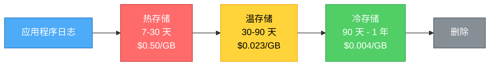

大多数团队将日志视为事后考虑的事情。他们在代码中到处添加 `console.log()` 和 `print()` 语句，希望在出现问题时能够捕获足够的信息。然后在凌晨 3 点生产环境崩溃时，他们才意识到日志毫无用处——格式不一致、缺少上下文、没有结构。

有效的日志记录不是从部署时开始的，而是从应用程序设计时开始的。在编写代码之前做出的决策决定了日志是能为你节省数小时的调试时间，还是用噪音浪费你的时间。

这不是关于日志框架或工具的讨论——而是关于策略。是关于设计能够回答问题而不是制造更多困惑的日志。

## 为什么日志策略很重要

**凌晨 3 点测试**：当你的应用程序在凌晨 3 点崩溃时，你能仅凭日志诊断问题吗？还是需要添加更多日志、重新部署，然后等待问题再次发生？

**糟糕日志的成本**：
- **延长的停机时间**：因为日志没有显示失败原因而花费数小时调试
- **重复的事故**：因为日志没有捕获根本原因，同样的问题再次发生
- **告警疲劳**：太多噪音，找不到信号
- **存储成本**：记录所有内容每月花费数千美元却没有价值

**良好日志的价值**：
- **快速调试**：在几分钟而不是几小时内找到根本原因
- **主动检测**：在用户投诉之前发现问题
- **审计跟踪**：知道谁在何时做了什么
- **业务洞察**：跟踪交易、用户行为、系统健康状况

!!!warning "⚠️ 事后无法添加日志"
    当生产环境宕机时，你无法添加日志并重新部署。你只能使用现有的日志。从一开始就正确设计日志。

## 设计时的日志策略

有效的日志记录需要在编写代码之前制定标准、结构和计划。

### 尽早定义日志标准

**日志级别标准**：记录整个组织何时使用每个级别。没有标准，一个开发人员的 ERROR 就是另一个开发人员的 WARNING。

```
DEBUG: 变量值、函数进入/退出（仅开发环境）
INFO: 用户操作、业务事件（"用户 123 登录"）
WARNING: 可恢复的问题（"API 慢，正在重试"、"缓存未命中"）
ERROR: 操作失败但应用程序继续运行（"支付失败"、"邮件未发送"）
CRITICAL: 服务降级或宕机（"数据库无法访问"、"内存不足"）
```

**何时使用每个级别**：

**DEBUG**：详细的诊断信息。在生产环境中禁用。用于开发期间的故障排除。

**INFO**：正常的应用程序行为。用户登录、订单创建、批处理作业启动。帮助理解应用程序流程。

**WARNING**：意外但已处理的情况。API 超时并重试、缓存未命中并使用备用方案、使用已弃用的功能。需要调查但不紧急。

**ERROR**：操作失败但应用程序继续运行。支付被拒绝、邮件发送失败、文件未找到。需要关注。

**CRITICAL**：应用程序无法继续运行。数据库无法访问、内存不足、配置缺失。需要立即采取行动。

### 错误分类

定义与监控和告警需求一致的错误类别。

```
# 基础设施错误
ERROR [INFRA.DATABASE]: 连接池耗尽
ERROR [INFRA.NETWORK]: 连接 payment-service 超时
ERROR [INFRA.STORAGE]: 磁盘写入失败

# 应用程序错误
ERROR [APP.VALIDATION]: 无效的邮箱格式
ERROR [APP.BUSINESS]: 订单库存不足
ERROR [APP.INTEGRATION]: 第三方 API 返回 500

# 安全事件
WARNING [SECURITY.AUTH]: 登录尝试失败
CRITICAL [SECURITY.ACCESS]: 未授权的管理员访问尝试
ALERT [SECURITY.INJECTION]: 检测到 SQL 注入
```

**为什么要分类**：
- **路由告警**：`[SECURITY.*]` 发送给安全团队，`[INFRA.DATABASE]` 发送给数据库团队
- **过滤日志**：搜索所有服务的基础设施错误
- **聚合指标**：按类别统计错误，跟踪趋势
- **优先修复**：关注错误率最高的类别

### 结构化日志模式

为所有日志定义必需字段。一致性使自动化处理成为可能。

```json
{
  "timestamp": "2020-11-01T10:30:00Z",
  "level": "ERROR",
  "category": "INFRA.DATABASE",
  "message": "连接池耗尽",
  "service": "payment-service",
  "request_id": "req-abc-123",
  "user_id": "user-456",
  "error_code": "DB_POOL_EXHAUSTED",
  "context": {
    "pool_size": 100,
    "active_connections": 100,
    "wait_time_ms": 5000
  }
}
```

**必需字段**：
- **timestamp**：ISO8601 格式，便于一致解析
- **level**：ERROR、WARNING、INFO、DEBUG、CRITICAL
- **category**：用于路由和过滤的错误类别
- **message**：人类可读的描述
- **service**：生成此日志的服务（对微服务至关重要）
- **request_id**：跟踪 ID，用于跟踪跨服务的请求
- **user_id**：了解用户影响（如果适用）
- **error_code**：应用程序特定的代码，用于程序化处理

**可选上下文**：特定于事件类型的附加字段。数据库错误包括连接池统计信息。支付错误包括金额和网关。


### 安全事件标准

定义什么构成安全事件以及如何记录它。

```
# 认证事件
WARNING [SECURITY.AUTH]: 登录失败 | user={username} ip={ip} attempts={count}
INFO [SECURITY.AUTH]: 登录成功 | user={username} ip={ip}
ALERT [SECURITY.AUTH]: 账户被锁定 | user={username} reason={too_many_attempts}

# 授权事件
WARNING [SECURITY.AUTHZ]: 未授权的访问尝试 | user={username} resource={path}
CRITICAL [SECURITY.AUTHZ]: 权限提升尝试 | user={username} action={attempted_action}

# 数据访问事件
INFO [SECURITY.DATA]: 访问敏感数据 | user={username} resource={customer_records}
ALERT [SECURITY.DATA]: 批量数据导出 | user={username} records={count}
```

**为什么安全日志很重要**：
- **合规性**：PCI-DSS、HIPAA、SOC2 要求记录安全事件
- **事件响应**：了解攻击模式，识别被入侵的账户
- **取证**：重建安全事件期间发生的事情
- **威慑**：知道操作被记录会阻止恶意行为

### 业务事件标准

定义需要记录和监控的关键业务事件。

```
# 交易事件
INFO [BUSINESS.PAYMENT]: 支付成功 | amount={amount} user={user_id}
ERROR [BUSINESS.PAYMENT]: 支付失败 | amount={amount} reason={reason}
ALERT [BUSINESS.PAYMENT]: 高额支付 | amount={amount} threshold={10000}

# 库存事件
WARNING [BUSINESS.INVENTORY]: 库存不足 | product={sku} quantity={count}
ERROR [BUSINESS.INVENTORY]: 缺货 | product={sku}
ALERT [BUSINESS.INVENTORY]: 库存不匹配 | expected={100} actual={95}

# 订单事件
INFO [BUSINESS.ORDER]: 订单创建 | order_id={id} total={amount}
ERROR [BUSINESS.ORDER]: 订单失败 | order_id={id} reason={reason}
ALERT [BUSINESS.ORDER]: 退款处理 | order_id={id} amount={amount}
```

**为什么要记录业务事件**：
- **收入跟踪**：监控交易成功率，识别收入损失
- **客户支持**：使用完整的交易历史调查客户投诉
- **商业智能**：分析模式，优化流程
- **欺诈检测**：识别交易中的可疑模式

!!!tip "📝 日志标准文档"
    在设计阶段创建"日志标准"文档。包括：日志级别、类别、必需字段、安全事件定义、业务事件定义和示例。将其作为代码审查检查清单的一部分。

### 设计便于监控的错误处理

构建错误处理以生成有用的日志。

```python
# 不好：通用错误，难以监控
try:
    process_payment()
except Exception as e:
    log.error(f"错误: {e}")

# 好：分类、结构化、可监控
try:
    process_payment()
except PaymentGatewayTimeout as e:
    log.error(
        "支付网关超时",
        extra={
            "category": "INFRA.INTEGRATION",
            "gateway": "stripe",
            "amount": payment.amount,
            "retry_count": payment.retries,
            "error_code": "PAYMENT_TIMEOUT"
        }
    )
except InsufficientFunds as e:
    log.warning(
        "支付被拒绝：余额不足",
        extra={
            "category": "BUSINESS.PAYMENT",
            "amount": payment.amount,
            "error_code": "INSUFFICIENT_FUNDS"
        }
    )
```

**为什么这很重要**：
- **特定告警**：对 `category=INFRA.INTEGRATION AND error_code=PAYMENT_TIMEOUT` 发出告警
- **上下文**：知道哪个网关、多少金额、重试了多少次
- **分类**：将基础设施错误路由到运维团队，业务错误路由到产品团队
- **可操作**：清晰的错误代码使自动响应成为可能

### 在用户故事中包含监控需求

将日志记录作为一等需求，而不是事后考虑。

```
用户故事：处理支付
验收标准：
- 通过 Stripe API 处理支付
- 用户收到确认邮件
- 监控：失败时记录 ERROR [BUSINESS.PAYMENT]，包含金额和原因
- 监控：如果 5 分钟内支付失败率 > 5%，发出告警
- 监控：如果任何 > $10,000 的支付失败，发出告警
```

**好处**：
- **日志被测试**：QA 验证日志是否正确生成
- **从第一天起就完整**：无需稍后添加日志
- **一致**：所有功能遵循相同的日志标准
- **被监控**：在部署之前配置告警

!!!warning "⚠️ 改造日志成本高昂"
    在部署后添加适当的日志意味着：分析现有代码、更新数百条日志语句、重新部署所有服务、更新监控规则。从一开始就正确设计。

## 记录什么

不是所有内容都值得记录。专注于有助于调试、安全和业务分析的事件。

### 错误模式

```
ERROR: 数据库连接失败
ERROR: OutOfMemoryError
ERROR: PaymentService 中的 NullPointerException
FATAL: 应用程序启动失败
```

**何时告警**：错误计数超过阈值（> 10 个错误/分钟）或特定关键错误出现一次。

### 安全事件

```
WARNING: 用户 admin 登录尝试失败（1 分钟内 5 次尝试）
ALERT: 来自 IP 192.168.1.100 的未授权 API 访问
CRITICAL: 检测到 SQL 注入尝试
```

**何时告警**：任何安全事件发生时。对安全问题零容忍。

### 业务异常

```
ERROR: 支付被拒绝：余额不足
WARNING: 订单总额不匹配：预期 $100，实际 $1
ALERT: 退款金额超过 $10,000
```

**何时告警**：高价值交易失败或检测到异常模式。

### 集成失败

```
ERROR: 第三方 API 超时：payment-gateway
WARNING: 邮件服务不可用，消息排队中
ERROR: S3 上传失败：访问被拒绝
```

**何时告警**：关键集成反复失败。


## 日志监控模式

日志监控模式是可重用的告警策略，定义如何从日志数据中检测问题。这些模式不是手动监视日志，而是在特定条件发生时自动触发告警。

每个模式回答三个问题：
1. **寻找什么**：哪些日志消息或条件表明存在问题
2. **何时告警**：触发告警的阈值或条件
3. **采取什么行动**：通知谁以及紧急程度如何

### 模式 1：错误率阈值

```
ALERT: count("ERROR") > 50 in last 5 minutes
操作：呼叫值班工程师
上下文：错误率激增表明系统性问题
```

**用例**：检测应用程序中错误的突然增加。

### 模式 2：特定错误检测

```
ALERT: any("OutOfMemoryError") in last 1 minute
操作：立即呼叫 + 自动重启服务
上下文：OOM 意味着即将崩溃
```

**用例**：需要立即采取行动的关键错误。

### 模式 3：错误率变化

```
ALERT: count("ERROR", 5m) > 2x count("ERROR", 1h average)
操作：向团队发送 Slack 通知
上下文：错误率比基线翻倍
```

**用例**：检测与历史基线相比的异常错误模式。

### 模式 4：预期日志缺失

```
ALERT: count("Batch job completed") == 0 in last 24 hours
操作：向运维团队发送邮件
上下文：每日批处理作业未运行
```

**用例**：检测预期事件未发生的静默失败。

### 模式 5：相关日志模式

```
ALERT: count("Database timeout") > 10 AND count("Connection pool exhausted") > 5
操作：呼叫数据库团队
上下文：数据库连接问题影响多个服务
```

**用例**：通过关联相关错误来检测级联故障。

## 结构化与非结构化日志

结构化日志使监控、搜索和分析变得更加容易。

### 非结构化（难以监控）

```
ERROR: Payment failed for user john@neo01.com amount 99.99 reason card_declined
```

**为什么非结构化难以处理**：

**需要正则表达式解析**：要提取金额，你需要像 `amount (\d+\.\d+)` 这样的正则表达式。不同的日志格式需要不同的正则表达式模式。一个拼写错误就会破坏一切。

**格式不一致**：开发人员 A 写 "amount 99.99"，开发人员 B 写 "$99.99"，开发人员 C 写 "amount: 99.99 USD"。你的监控就会失效。

**无法高效查询**：想要所有超过 $1000 的支付？你必须扫描每一行日志，解析文本，转换为数字，然后过滤。缓慢且昂贵。

**难以聚合**：计算平均支付金额需要解析数百万个文本字符串。结构化字段让数据库高效完成这项工作。

**脆弱的告警**：对 `amount > 1000` 的告警需要从文本中解析 "amount 99.99"。如果格式更改为 "total 99.99"，告警会静默失效。

### 结构化（易于监控）

```json
{
  "level": "ERROR",
  "message": "支付失败",
  "user_email": "john@neo01.com",
  "amount": 99.99,
  "reason": "card_declined",
  "timestamp": "2020-11-01T10:30:00Z"
}
```

**为什么结构化更好**：

**直接字段访问**：直接查询 `amount > 1000`。无需解析，无需正则表达式，不会失效。

**类型安全**：`amount` 是数字，不是文本。数据库知道如何比较、聚合和计算。

**一致的格式**：每个日志都有相同的字段。监控规则在所有服务中可靠工作。

**快速查询**：数据库在 `amount` 字段上建立索引。查询在毫秒内运行，而不是分钟。

**易于聚合**：`AVG(amount)`、`SUM(amount)`、`MAX(amount)` 立即工作。无需文本解析。

现在你可以告警：`level=ERROR AND reason=card_declined AND amount > 1000`

而且它可靠地工作，永远，无论谁写日志或何时写。

## 日志监控工具

选择适合你规模和预算的工具。

### CloudWatch Logs Insights

AWS 原生，与 AWS 服务无缝集成。使用类似 SQL 的语法查询日志。

```sql
fields @timestamp, @message
| filter @message like /ERROR/
| stats count() by bin(5m)
```

**优点**：易于 AWS 集成，无需管理基础设施
**缺点**：搜索能力有限，大规模时昂贵
**最适合**：AWS 重度环境，中小规模

### ELK Stack（Elasticsearch、Logstash、Kibana）

强大的搜索和可视化。日志聚合的行业标准。

**优点**：强大的搜索，丰富的可视化，庞大的生态系统
**缺点**：资源密集，操作复杂，大规模时昂贵
**最适合**：大型组织，复杂的搜索需求

### Splunk

企业级日志管理和分析。

**优点**：强大的分析，出色的支持，全面的功能
**缺点**：非常昂贵，复杂的许可
**最适合**：有预算的企业，合规要求

### Loki + Grafana

ELK 的轻量级替代方案。专为 Kubernetes 环境设计。

**优点**：轻量级，与 Prometheus 和 Grafana 集成，成本效益高
**缺点**：搜索能力不如 Elasticsearch 强大
**最适合**：Kubernetes 环境，注重成本的团队

!!!tip "💡 高容量日志采样"
    如果你每分钟记录数百万个事件，对非关键日志进行采样（保留 1%，丢弃 99%）。始终保留 ERROR 和 CRITICAL 日志。这降低了成本，同时保持对问题的可见性。

## 日志记录最佳实践

### 正确使用日志级别

- **DEBUG**：用于调试的详细信息（在生产环境中禁用）
- **INFO**：一般信息性消息（"用户登录"）
- **WARNING**：意外但已处理的情况（"API 慢，正在重试"）
- **ERROR**：某些操作失败但应用程序继续运行（"支付失败"）
- **CRITICAL/FATAL**：应用程序无法继续运行（"数据库无法访问"）

### 包含上下文

每个日志都应该回答：谁、什么、何时、何地、为什么。

- **请求 ID**：跨服务跟踪请求
- **用户 ID**：了解用户影响
- **服务名称**：在微服务中识别来源
- **时间戳**：关联事件
- **错误详情**：堆栈跟踪、错误代码、相关变量

### 避免日志垃圾

- **不要在紧密循环中记录**：在处理数百万项的循环内记录会产生噪音
- **限制重复错误的速率**：记录 "数据库超时发生 50 次" 而不是 50 条单独的日志
- **聚合类似错误**：分组相关错误，不要重复相同的消息
- **使用适当的日志级别**：不要在 DEBUG 级别记录 INFO 消息

### 保护敏感数据

- **永远不要记录密码、令牌、信用卡**：显而易见但经常被违反
- **掩码 PII**：编辑邮箱地址、电话号码、社会安全号码
- **编辑敏感字段**：在结构化日志中，掩码敏感值
- **遵守法规**：GDPR、HIPAA、PCI-DSS 有严格的日志记录要求

```python
# 不好：记录敏感数据
log.info(f"用户登录: {username} 密码: {password}")

# 好：掩码敏感数据
log.info(f"用户登录: {username} 密码: ****")

# 更好：根本不记录密码
log.info(f"用户登录: {username}")
```

!!!warning "⚠️ 日志量与成本"
    记录所有内容是昂贵的。一个中等规模的应用程序每月可以生成数 TB 的日志。CloudWatch Logs 成本为每 GB 摄取 $0.50 + 每 GB 存储 $0.03。在可见性和预算之间取得平衡。


## 应用程序日志保留策略

应用程序日志应该保留多长时间？在调试需求、事后分析和存储成本之间取得平衡。

### 应用程序日志的保留层级

**热存储（7-30 天）**：可立即搜索，昂贵，用于主动调试。

- **内容**：所有应用程序日志的完整详细信息（DEBUG、INFO、WARNING、ERROR、CRITICAL）
- **原因**：大多数错误在部署后几天内被检测和调试
- **成本**：高（CloudWatch 中每 GB 摄取 $0.50 + 每 GB 存储 $0.03）
- **用例**：主动调试、最近的部署问题、性能故障排除

**温存储（30-90 天）**：访问较慢，更便宜，用于事后分析。

- **内容**：完整详细信息的 ERROR 和 CRITICAL 日志，采样的 INFO/WARNING（10%）
- **原因**：事后调查通常在事件发生数周后进行
- **成本**：中等（S3 标准：每 GB 每月 $0.023）
- **用例**：事后分析、模式识别、比较一段时间内的行为

**冷存储（90 天 - 1 年）**：仅归档，最便宜，用于罕见的调查。

- **内容**：仅 ERROR 和 CRITICAL 日志，已压缩
- **原因**：罕见情况需要历史上下文来处理重复问题
- **成本**：低（S3 Glacier：每 GB 每月 $0.004）
- **用例**：长期模式分析、罕见的错误调查



### 按应用程序日志级别的保留

**DEBUG 日志**：
- **保留**：7 天热存储，然后删除
- **原因**：极其冗长，初始调试后很少需要
- **容量**：总日志量的 40-50%
- **成本影响**：删除 DEBUG 日志可节省 40-50% 的存储成本

**INFO 日志**：
- **保留**：30 天热存储，然后删除（或采样 10% 用于温存储）
- **原因**：在调试期间有助于理解应用程序流程
- **容量**：总日志量的 30-40%
- **采样**：如果需要，随机保留 10% 用于趋势分析

**WARNING 日志**：
- **保留**：30 天热存储，60 天温存储
- **原因**：警告通常先于错误；对事后分析有用
- **容量**：总日志量的 5-10%
- **模式分析**：审查警告以防止未来的错误

**ERROR 日志**：
- **保留**：90 天热存储，1 年温存储
- **原因**：对调试、事后分析和识别重复问题至关重要
- **容量**：总日志量的 5-10%
- **始终保留**：永远不要过早采样或删除 ERROR 日志

**CRITICAL 日志**：
- **保留**：90 天热存储，1 年温存储，7 年冷存储（如果需要合规）
- **原因**：影响服务的事件需要长期保留以进行模式分析
- **容量**：总日志量的 < 1%
- **不可变**：考虑对关键事件使用一次写入存储

### 成本优化

**采样非关键日志**：保留 100% 的 ERROR 日志，10% 的 INFO 日志，1% 的 DEBUG 日志。

```
# 采样前：1TB/天 = 每月 $15,000
# 采样后：100GB/天 = 每月 $1,500
# 节省：每月 $13,500 = 每年 $162,000
```


{
  "title": {
    "text": "按级别划分的日志存储成本（优化前后对比）",
    "left": "center"
  },
  "tooltip": {
    "trigger": "axis",
    "axisPointer": {
      "type": "shadow"
    }
  },
  "legend": {
    "data": ["优化前", "优化后"],
    "top": "10%"
  },
  "grid": {
    "left": "3%",
    "right": "4%",
    "bottom": "3%",
    "containLabel": true
  },
  "xAxis": {
    "type": "category",
    "data": ["DEBUG", "INFO", "WARNING", "ERROR", "CRITICAL"]
  },
  "yAxis": {
    "type": "value",
    "name": "成本（千美元/月）"
  },
  "series": [
    {
      "name": "优化前",
      "type": "bar",
      "data": [7.5, 6.0, 1.0, 0.75, 0.25],
      "itemStyle": {
        "color": "#ff6b6b"
      }
    },
    {
      "name": "优化后",
      "type": "bar",
      "data": [0.5, 0.6, 0.5, 0.75, 0.25],
      "itemStyle": {
        "color": "#51cf66"
      }
    }
  ]
}


**归档前压缩**：日志压缩 5-10 倍。1TB 变成 100-200GB。

**积极删除 DEBUG 日志**：DEBUG 日志占容量的 80%，但 7 天后很少需要。

**使用生命周期策略**：自动化从热存储 → 温存储 → 冷存储 → 删除的转换。

```yaml
# S3 生命周期策略示例
Rules:
  - Id: "LogRetention"
    Status: Enabled
    Transitions:
      - Days: 30
        StorageClass: STANDARD_IA  # 温存储
      - Days: 90
        StorageClass: GLACIER      # 冷存储
    Expiration:
      Days: 2555  # 7 年
```

### 合规要求

**PCI-DSS**：审计日志至少 1 年，系统日志 3 个月。

**HIPAA**：医疗数据访问日志至少 6 年。

**SOC 2**：至少 1 年，但审计员通常要求 2-3 年。

**GDPR**：没有具体的保留要求，但必须应请求删除。不要保留日志超过必要时间。

**金融服务**：交易记录通常为 7 年。

!!!warning "⚠️ 合规优先于成本"
    如果法规要求 7 年，你必须保留日志 7 年。不合规的罚款远远超过存储成本。单次 HIPAA 违规可能花费 $50,000 以上。

### 实用的应用程序日志保留策略

**初创公司/小型企业**：
```
DEBUG: 7 天
INFO: 14 天
WARNING: 30 天
ERROR/CRITICAL: 90 天
事后分析：根据需要延长至 90 天
成本：每月 $200-1,000
```

**中型公司**：
```
DEBUG: 7 天热存储
INFO: 30 天热存储
WARNING: 30 天热存储，60 天温存储
ERROR: 90 天热存储，1 年温存储
CRITICAL: 90 天热存储，1 年温存储
事后分析：自动延长 90 天
成本：每月 $2,000-10,000
```

**企业**：
```
DEBUG: 7 天热存储（生产环境采样 1%）
INFO: 30 天热存储，10% 采样 90 天温存储
WARNING: 90 天热存储，1 年温存储
ERROR: 90 天热存储，1 年温存储
CRITICAL: 1 年热存储，7 年冷存储
事后分析：带审批工作流的自动延长
成本：每月 $10,000-50,000
```

### 何时更长时间保留应用程序日志

**事后调查**：在进行详细的事后分析时延长保留期。

```
# 场景：10 月 15 日发生重大故障
# 正常保留：30 天
# 延长保留：将 10 月 1-31 日的所有日志保留 90 天
# 原因：事后分析可能需要数周；需要完整的上下文
```

**重复问题**：调试间歇性问题时保留日志更长时间。

```
# 场景：内存泄漏每 2-3 周出现一次
# 正常保留：30 天
# 延长保留：将 ERROR/WARNING 日志保留 90 天
# 原因：需要多次发生来识别模式
```

**模式分析**：为性能优化或容量规划保留日志更长时间。

```
# 场景：分析季节性流量模式
# 正常保留：30 天
# 延长保留：将采样的 INFO 日志（1%）保留 1 年
# 原因：比较跨季节的行为
```

**部署关联**：在重大部署前后保留日志。

```
# 场景：部署重大架构更改
# 正常保留：30 天
# 延长保留：将部署前后 7 天的所有日志保留 90 天
# 原因：比较更改前后的行为
```

!!!tip "🔍 事后保留"
    当发生重大事件时，立即延长受影响时间段的日志保留期。事后分析通常需要 2-4 周才能完成，你需要事件之前、期间和之后的日志。

### 何时更早删除应用程序日志

**GDPR 删除权**：应请求删除用户数据，包括包含 PII 的应用程序日志。

```python
# 实现特定用户的日志删除
def delete_user_logs(user_id):
    # 从热存储中删除
    delete_logs_where(user_id=user_id, storage="hot")
    # 从温存储中删除
    delete_logs_where(user_id=user_id, storage="warm")
    # 在冷存储中标记为删除
    mark_for_deletion(user_id=user_id, storage="cold")
```

**存储成本超过价值**：如果 DEBUG/INFO 日志从未被搜索，减少保留期。

```
# 分析：DEBUG 日志每月花费 $5,000，90 天内搜索 0 次
# 操作：将 DEBUG 保留期从 30 天减少到 7 天
# 节省：每月 $3,750 = 每年 $45,000
```

**开发/测试环境**：比生产环境短得多的保留期。

```
生产环境：30 天热存储，90 天温存储
测试环境：7 天热存储，然后删除
开发环境：3 天热存储，然后删除
```

!!!tip "💡 从保守开始，向下调整"
    从较长的保留期（90 天）开始，监控你访问旧日志的频率，如果你从未搜索超过 30 天的日志，则减少保留期。减少保留期比解释为什么删除了调查所需的日志更容易。


### 应用程序日志保留策略模板

记录你的应用程序日志保留策略：

```markdown
# 应用程序日志保留策略

## 标准保留

### 生产应用程序日志
- DEBUG: 7 天（热存储），然后删除
- INFO: 30 天（热存储），然后删除
- WARNING: 30 天（热存储），60 天（温存储）
- ERROR: 90 天（热存储），1 年（温存储）
- CRITICAL: 90 天（热存储），1 年（温存储）

### 非生产应用程序日志
- 测试环境：7 天（热存储），然后删除
- 开发环境：3 天（热存储），然后删除
- 测试：1 天（热存储），然后删除

## 延长保留触发器

### 事后调查
- 触发器：重大事件（P0/P1）
- 操作：将事件时间段 ± 7 天的保留期延长至 90 天
- 持续时间：直到事后分析完成 + 30 天
- 审批：工程经理

### 重复问题
- 触发器：30 天内同一错误发生 3 次以上
- 操作：将 ERROR/WARNING 保留期延长至 90 天
- 持续时间：直到识别并修复根本原因
- 审批：团队负责人

### 重大部署
- 触发器：架构更改、重大版本发布
- 操作：将部署前后 7 天的所有日志保留 90 天
- 持续时间：部署后 90 天
- 审批：自动

## 成本管理

### 月度审查
- 审查存储成本与搜索频率
- 识别未使用的日志级别或服务
- 如果日志从未被搜索，调整保留期

### 季度优化
- 分析 DEBUG/INFO 日志的价值
- 如果合适，实施采样
- 根据实际使用情况更新保留期

## GDPR 合规
- 用户数据删除：请求后 30 天内
- 自动删除：通过 user_id 字段实现
- 验证：每月审计删除请求

## 例外情况
- 事后调查：根据需要延长
- 重复错误：延长直到解决
- 性能分析：采样并延长
- GDPR 请求：立即删除
```

## 常见的日志记录错误

**记录太多**：生产环境中的 DEBUG 日志会产生噪音并花费金钱。使用适当的日志级别。

**记录太少**："发生错误" 而没有上下文是无用的。包含相关详细信息。

**格式不一致**：每个开发人员使用不同的日志格式使搜索变得不可能。使用结构化日志。

**记录敏感数据**：日志中的密码、令牌、信用卡会产生安全风险和合规违规。

**没有日志轮转**：日志填满磁盘空间会导致应用程序崩溃。实施日志轮转和保留策略。

**忽略日志量**：每分钟记录数百万个事件每月花费数千美元。对非关键日志进行采样。

## 建立日志文化

**将日志作为要求**：在验收标准、代码审查检查清单和完成定义中包含日志。

**定期审查日志**：不要等待事件。定期审查日志以识别模式并改进日志记录。

**从事件中学习**：每个事件都会揭示日志缺口。缺少什么信息？添加它。

**分享知识**：记录日志标准，分享示例，培训新团队成员。

**庆祝良好的日志记录**：当良好的日志记录节省了数小时的调试时间时，认可它。让日志记录成为一项有价值的技能。

## 做出选择

日志记录不是可选的——它是必不可少的。问题是你是从一开始就正确设计它，还是在生产故障后改造它。

从标准开始：日志级别、类别、结构化格式。将日志记录作为用户故事中的一等要求。选择适合你规模和预算的工具。实施平衡成本和合规性的保留策略。

记住：日志是应用程序的黑匣子记录器。当事情出错时——而且它们会出错——日志通常是你理解发生了什么的唯一方式。

从一开始就正确设计日志。你未来的自己——在凌晨 3 点调试时——会感谢你。
