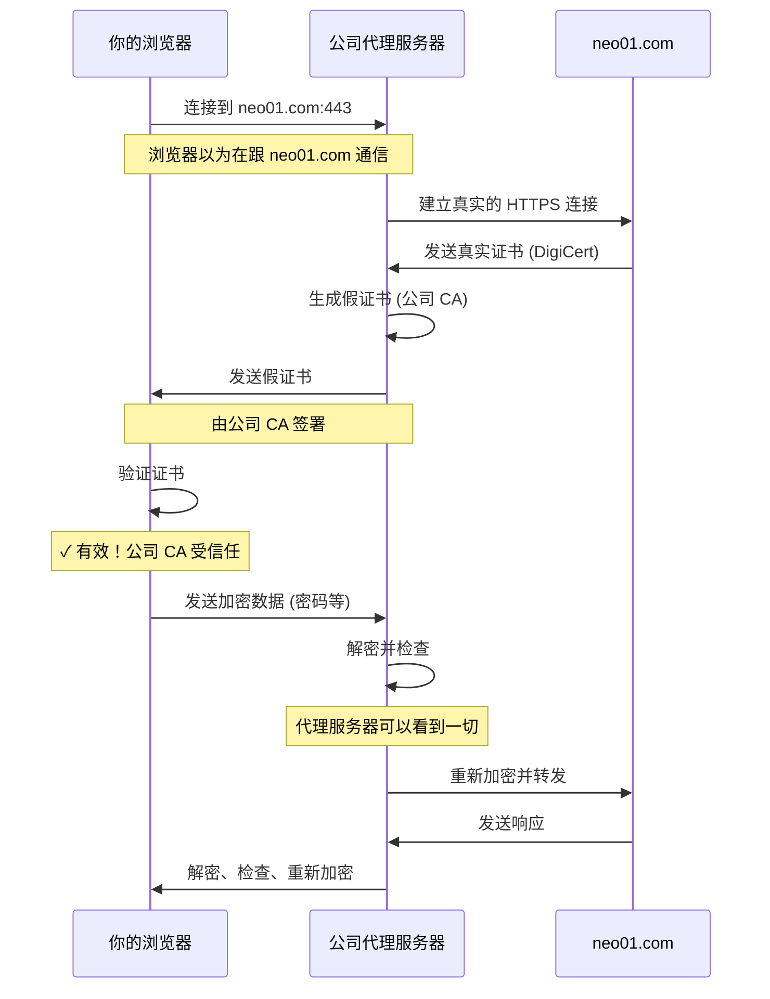

你在公司，午休时浏览银行账户。浏览器显示绿色锁头图标——HTTPS 正在运作，一切都已加密，对吧？不完全是。你公司的透明代理服务器正坐在中间，解密你的每一次按键、每一个密码、每一则私人消息。

大多数员工不知道公司网络可以解密 HTTPS 流量。他们看到锁头图标就认为连接是私密的。但那个锁头在说谎。你的浏览器信任的证书不是来自你的银行——而是来自你公司的代理服务器，伪装成你的银行。

这不是黑客攻击或安全漏洞。这是一个功能。全球数千家公司部署了具有 SSL 拦截功能的企业透明代理服务器，默默地解密和检查员工流量，用于安全监控、数据泄露防护和政策执行。

了解这如何运作不只是技术好奇心——而是关于了解你在公司网络上实际拥有什么隐私。

## 企业 SSL 拦截如何运作

当你在具有 SSL 拦截的公司网络上连接到 `https://neo01.com` 时，实际发生的情况如下：



**关键步骤**：

1. **拦截**：代理服务器在你的 HTTPS 连接到达互联网之前拦截它
2. **双重连接**：代理服务器建立两个独立的 HTTPS 连接：
   - 一个与你连接（使用假证书）
   - 一个与真实网站连接（使用真实证书）
3. **证书伪造**：代理服务器为 neo01.com 生成假证书，由公司 CA 签署
4. **解密**：代理服务器解密你的流量，检查它，然后在转发前重新加密
5. **完全可见**：代理服务器以明文看到一切：密码、信用卡、消息

## 为什么你的浏览器显示证书有效

这是让大多数人困惑的部分。你检查证书，它显示有效，但签发者是错的。为什么你的浏览器不警告你？

### 公司 CA 证书

当你加入公司并收到笔记本电脑时，IT 部门会在你系统的受信任根证书存储区中安装公司 CA（证书颁发机构）证书。

**Windows**：
```
位置：certmgr.msc → 受信任的根证书颁发机构
证书：「公司 IT 根 CA」或类似名称
目的：信任由公司 CA 签署的证书
```

**macOS**：
```
位置：钥匙串访问 → 系统 → 证书
证书：公司 CA
信任设置：始终信任
```

**这意味着什么**：你的操作系统现在信任任何由公司 CA 签署的证书——包括代理服务器生成的假证书。

### 证书验证流程

当你的浏览器通过代理服务器连接到 `https://neo01.com` 时：

```
1. 浏览器收到 neo01.com 的证书
2. 证书签发者：「公司 IT 根 CA」
3. 浏览器检查：「公司 IT 根 CA」受信任吗？
4. 系统说：是的，它在受信任的根证书存储区中
5. 浏览器显示：✓ 有效证书，绿色锁头
```

**欺骗**：证书在技术上是有效的——它由受信任的 CA 正确签署。但它不是来自 neo01.com 的真实证书。它是代理服务器生成的假证书。

### 检查真实证书签发者

以下是如何查看实际发生的情况：

**在 Chrome/Edge 中**：
```
1. 点击锁头图标 → 证书
2. 查看「签发者」字段
3. 预期：「DigiCert」、「Let's Encrypt」、「Sectigo」
4. 实际：「公司 IT 根 CA」、「Blue Coat」、「Zscaler」
```

**在 Firefox 中**：
```
1. 点击锁头 → 连接安全 → 更多信息
2. 查看证书 → 签发者
3. 与预期签发者比较
```

**命令行**：
```bash
# 检查证书签发者
echo | openssl s_client -connect neo01.com:443 2>/dev/null | openssl x509 -noout -issuer

# 预期输出：
issuer=C=US, O=DigiCert Inc, CN=DigiCert TLS RSA SHA256 2020 CA1

# 实际输出（有代理服务器）：
issuer=C=US, O=YourCompany, CN=Corporate IT Root CA
```

!!!danger "🚨 不同的签发者 = 中间人攻击"
    如果证书签发者与预期的 CA 不符，你就在 SSL 拦截代理服务器后面。你的流量正在被解密和检查。

## 你的公司能看到什么

启用 SSL 拦截后，公司代理服务器可以完全看到你的 HTTPS 流量。

### HTTPS 请求中的所有内容

```
✓ 完整的 URL，包括查询参数
✓ HTTP 头（cookies、用户代理、来源）
✓ POST 数据（表单提交、上传）
✓ 密码和凭证
✓ 信用卡号码
✓ 私人消息（电子邮件、聊天、社交媒体）
✓ 医疗信息
✓ 财务数据
```

**示例：银行会话**：
```
URL: https://neo01.com/login
POST 数据: username=john@email.com&password=MySecret123
Cookies: session_id=abc123xyz789
头: Authorization: Bearer eyJhbGc...

代理服务器以明文看到所有内容。
```

### 即使没有解密也有元数据

即使特定内容没有被解密，代理服务器也会收集元数据：

```
✓ 你访问哪些网站
✓ 你何时访问它们
✓ 你停留多久
✓ 你传输多少数据
✓ 你使用哪些设备
✓ 你的位置（IP 地址）
```

### 记录的内容

公司代理服务器通常会记录大量信息：

```json
{
  "timestamp": "2021-01-31T14:23:45Z",
  "user": "john.doe",
  "device": "LAPTOP-12345",
  "source_ip": "192.168.1.100",
  "destination": "neo01.com",
  "url": "https://neo01.com/account/transfer",
  "method": "POST",
  "bytes_sent": 2048,
  "bytes_received": 4096,
  "duration_ms": 342,
  "category": "Finance",
  "action": "allowed",
  "content_type": "application/json"
}
```

**保留期限**：记录通常保留 90 天到 1 年，有时为了合规性会更长。

**访问权限**：网络管理员、安全团队、管理层、人力资源、法务，以及可能的执法机关都可以访问记录。

!!!warning "⚠️ 没有隐私期望"
    公司可接受使用政策通常会声明：「员工在使用公司网络资源时没有隐私期望。」你做的一切都可以被监控和记录。

## 如何保护敏感信息

### 1. 使用移动数据进行个人活动

避免公司监控最可靠的方法是不使用公司网络。

```
个人银行业务：使用手机的移动数据
医疗信息：使用个人设备、移动数据
私人通信：使用个人手机
敏感浏览：切换到移动热点
```

**为什么有效**：

1. **绕过公司网络**：移动数据直接连到你的运营商，不经过公司基础设施
2. **没有安装公司 CA**：你的个人手机的信任存储区中没有公司 CA 证书
3. **SSL 拦截不可能**：没有公司 CA，代理服务器无法生成受信任的假证书
4. **没有记录**：公司无法记录从未接触其网络的流量

**关键差异**：即使你的个人手机通过移动数据以某种方式连接到公司代理服务器，SSL 拦截也会失败，因为你的手机会拒绝假证书——公司 CA 不受信任。

**限制**：
- 移动数据套餐的数据上限
- 速度比公司 WiFi 慢
- 不适合大型下载

### 2. 检查证书签发者

在输入敏感信息之前，验证证书签发者。

```bash
# 在浏览器中快速检查
1. 点击锁头图标
2. 查看证书
3. 检查「签发者」字段
4. 如果是公司 CA → 你正在被拦截
5. 在继续之前切换到移动数据
```

**警讯**：
- 签发者：「公司 IT」、「Blue Coat」、「Zscaler」、「Palo Alto Networks」
- 签发者组织与你的公司名称相符
- 证书对所有域有效（通配符代理证书）

### 3. 使用证书固定应用程序

某些应用程序实现证书固定——它们只接受特定证书并拒绝代理证书。

**具有证书固定的应用程序**：
- 银行应用程序（移动版）
- 密码管理器（1Password、LastPass）
- VPN 客户端
- 某些企业应用程序
- Apple 推送通知服务（APNS）

**运作方式**：
```python
# 应用程序有预期的证书指纹
expected_cert_hash = "sha256/AAAAAAAAAA..."

# 连接时，验证证书
if actual_cert_hash != expected_cert_hash:
    raise SecurityError("证书不符")
    # 连接失败，代理服务器无法拦截
```

**结果**：应用程序拒绝通过代理服务器连接。你会看到连接错误而不是成功的拦截。

### 4. 避免在公司设备上进行敏感活动

公司管理的设备已预先安装公司 CA 证书。没有管理员权限，你无法移除它。

```
公司笔记本电脑：假设一切都被监控
个人笔记本电脑：检查是否安装了公司 CA
个人手机：检查证书存储区
BYOD 设备：可能从 MDM 安装了公司 CA
```

**最佳实践**：在不同设备上完全分离个人和工作活动。

### 5. 使用端到端加密消息

某些消息应用程序提供端到端加密，即使有 SSL 拦截也保持安全。

**Signal、WhatsApp、iMessage**：
- 消息在你的设备上加密
- 代理服务器看到加密的消息数据，而不是内容
- 代理服务器看到元数据（你发消息给谁、何时、消息大小）
- 消息内容保持私密

**重要**：代理服务器仍然看到你正在使用这些应用程序并可以看到元数据。只有消息内容受到保护。

## 为什么 Apple 推送通知服务（APNS）阻挡代理服务器

Apple 推送通知服务设计为使用证书固定拒绝 SSL 拦截代理服务器。

### APNS 证书固定如何运作

```
1. iOS 设备连接到 APNS (17.0.0.0/8)
2. APNS 呈现证书
3. iOS 根据固定的 Apple 证书验证证书
4. 如果证书不符 → 连接失败
5. 通知停止运作
```

**SSL 拦截时会发生什么**：
```
1. iOS 设备尝试连接到 APNS
2. 公司代理服务器拦截连接
3. 代理服务器呈现假证书（由公司 CA 签署）
4. iOS 与固定的 Apple 证书比较
5. 检测到不符 → 连接被拒绝
6. 结果：推送通知失败
```

### Apple 为什么这样做

**安全性**：防止对推送通知的中间人攻击，推送通知可能包含敏感数据。

**隐私**：确保 Apple——而不是公司代理服务器——控制通知基础设施。

**完整性**：防止篡改通知传递。

### 企业解决方法

使用 SSL 拦截的公司必须将 APNS 加入白名单以允许直接连接：

```bash
# 代理服务器配置：绕过 APNS 的 SSL 拦截
bypass_ssl_interception:
  - 17.0.0.0/8          # APNS IP 范围
  - *.push.apple.com    # APNS 域
  - *.courier.push.apple.com
```

**结果**：APNS 流量完全绕过代理服务器，直接连接到 Apple。通知可以运作，但这些流量无法被检查。

### 其他阻挡拦截的服务

**Google Cloud Messaging (GCM/FCM)**：
- Android 推送通知
- 使用证书固定
- 需要代理服务器绕过

**Microsoft Teams/Office 365**：
- 某些端点使用证书固定
- 需要选择性绕过才能完整运作

**银行和金融应用程序**：
- 大多数实现证书固定
- 无法通过拦截代理服务器连接

**VPN 客户端**：
- 设计为检测中间人攻击
- 拒绝通过拦截代理服务器连接

!!!tip "💡 连接失败表示保护"
    如果应用程序在公司 WiFi 上无法连接但在移动数据上可以运作，它可能使用证书固定。这是保护你免受拦截的安全功能。

## 检测你网络上的 SSL 拦截

### 方法 1：证书签发者检查

```bash
# 检查多个热门网站
for site in google.com facebook.com bank.com github.com; do
  echo "=== $site ==="
  echo | openssl s_client -connect $site:443 2>/dev/null | \
    openssl x509 -noout -issuer -subject
  echo
done
```

**预期**：不同的签发者（Google Trust Services、DigiCert、Let's Encrypt）

**有拦截**：全部显示相同的公司 CA 签发者

### 方法 2：浏览器证书查看器

访问多个 HTTPS 网站并检查证书：

```
1. 访问 https://google.com → 检查签发者
2. 访问 https://github.com → 检查签发者
3. 访问 https://bank.com → 检查签发者

预期：不同的签发者
有拦截：全部由公司 CA 签发
```

### 方法 3：检查受信任的根证书

**Windows**：
```
1. 按 Win+R → certmgr.msc
2. 导航至：受信任的根证书颁发机构 → 证书
3. 寻找：公司名称、「Blue Coat」、「Zscaler」、「Palo Alto」
4. 如果找到：已配置 SSL 拦截
```

**macOS**：
```
1. 打开：钥匙串访问
2. 选择：系统 → 证书
3. 寻找：公司 CA 证书
4. 检查信任设置：「始终信任」= 已启用拦截
```

**Linux**：
```bash
# 检查受信任的证书
ls /etc/ssl/certs/ | grep -i "corporate\|company\|proxy"

# 或检查特定证书
openssl x509 -in /etc/ssl/certs/corporate-ca.pem -text -noout
```

### 方法 4：在线检测工具

**SSL Labs SSL 测试**：
```
访问：https://www.ssllabs.com/ssltest/viewMyClient.html
检查：「证书签发者」字段
预期：标准公共 CA
有拦截：公司 CA 名称
```

**HowsMySSL**：
```
访问：https://www.howsmyssl.com/
检查：证书信息
寻找：意外的签发者或警告
```

## 在公司网络上的隐私最佳实践

### 假设一切都被监控

```
✓ 所有网页浏览（HTTP 和 HTTPS）
✓ 所有电子邮件（公司和个人网络邮件）
✓ 所有文件传输
✓ 所有即时消息
✓ 所有视频通话（元数据，可能包括内容）
✓ 所有下载和上传
```

**心态**：如果它经过公司网络，假设它被记录并可能被检查。

### 分离个人和工作活动

```
工作活动：
- 使用公司笔记本电脑
- 使用公司网络
- 使用公司账号
- 假设完全监控

个人活动：
- 使用个人设备
- 使用移动数据或家用网络
- 使用个人账号
- 完全分离
```

### 绝不在公司网络上输入个人凭证

```
❌ 不要：在公司笔记本电脑上登录个人银行
❌ 不要：在公司 WiFi 上检查个人电子邮件
❌ 不要：使用公司网络在线购物
❌ 不要：在工作时访问医疗记录

✓ 要：使用个人手机的移动数据
✓ 要：等到回家
✓ 要：在个人设备上使用 VPN（如果允许）
```

### 阅读你公司的可接受使用政策

```
要审查的关键部分：
- 监控和监视政策
- 隐私期望（通常：没有）
- 禁止的活动
- 个人使用指南
- 数据保留政策
- 谁有权访问记录
```

**重要**：违反可接受使用政策可能导致解雇，即使该活动是合法的。

### 使用加密消息进行敏感通信

```
对于敏感的个人通信：
✓ Signal（端到端加密）
✓ WhatsApp（端到端加密）
✓ iMessage（端到端加密）

避免：
❌ SMS（未加密）
❌ 普通电子邮件（非端到端加密）
❌ Slack/Teams（公司可以访问）
```

**注意**：代理服务器仍然看到元数据（谁、何时、消息大小），但看不到内容。

## 法律和伦理考量

### 公司可以合法监控什么

在大多数司法管辖区，公司可以监控：

```
✓ 公司拥有的网络上的所有流量
✓ 公司拥有的设备上的所有活动
✓ 使用公司账号的所有通信
✓ 存储在公司系统上的所有数据
```

**法律依据**：公司拥有网络和设备，员工通过可接受使用政策同意。

### 员工权利

**有限的隐私权**：
- 通常对公司资源没有隐私期望
- 某些司法管辖区要求在监控前通知
- 个人设备可能有更多保护（BYOD）

**要检查的事项**：
```
- 政策是否要求在监控前通知？
- 监控个人设备是否有限制？
- 你可以选择退出 SSL 拦截吗？
- 保留什么数据以及保留多久？
- 谁有权访问监控数据？
```

### 伦理考量

**合法的商业目的**：
- 安全威胁检测
- 数据泄露防护
- 合规监控
- 带宽管理

**潜在的过度行为**：
- 在休息时间监控个人活动
- 访问敏感的个人信息
- 没有明确商业理由的监视
- 保留数据超过必要时间

!!!warning "⚠️ 了解你的权利"
    隐私法因国家和地区而异。欧盟 GDPR 提供比美国法律更强的保护。咨询你当地的法规和公司政策以了解你的权利。

## IT 管理员应该考虑的事项

### 透明度和信任

**对监控保持透明**：
```
✓ 清楚传达正在使用 SSL 拦截
✓ 解释监控什么以及为什么
✓ 在可接受使用政策中记录
✓ 为员工提供培训
✓ 为个人活动提供替代方案
```

**建立信任**：
- 将监控限制在商业目的
- 限制对监控数据的访问
- 实施明确的数据保留政策
- 尽可能尊重员工隐私

### 选择性 SSL 拦截

不要拦截所有内容。将不需要检查的类别加入白名单：

```yaml
# 绕过以下项目的 SSL 拦截：
bypass_categories:
  - Healthcare（HIPAA 合规）
  - Financial services（PCI-DSS 合规）
  - Personal email（隐私）
  - Password managers（安全性）
  - Government services（隐私）
  
# 只拦截：
intercept_categories:
  - File sharing（数据泄露防护）
  - Unknown/uncategorized（安全性）
  - High-risk categories（恶意软件防护）
```

**好处**：
- 减少隐私疑虑
- 提高性能（减少解密开销）
- 避免破坏证书固定的应用程序
- 维持员工信任

### 适当处理敏感数据

```
✓ 加密监控记录
✓ 仅限安全团队访问
✓ 实施审计记录（谁访问了什么）
✓ 自动编辑敏感数据（密码、信用卡）
✓ 明确的保留政策（90 天后删除）
✓ 事件响应程序（何时调查）
```

### 提供替代方案

```
✓ 个人设备使用的访客 WiFi，不进行 SSL 拦截
✓ 个人活动的移动数据补贴
✓ 明确的休息时间政策（允许个人使用）
✓ 特定使用案例的 VPN 绕过
```

## 做出选择

企业 SSL 拦截是一个强大的安全工具，但它带来重大的隐私影响。对公司来说，它能够进行威胁检测、数据泄露防护和合规监控。对员工来说，这意味着在公司网络上几乎没有隐私。

技术本身既不好也不坏——重要的是如何使用它。透明的部署、明确的政策和尊重员工隐私可以建立信任。在没有通知的情况下进行秘密监视会侵蚀信任，并可能违反法规。

如果你是员工，了解你公司网络上存在什么监控。检查证书签发者，阅读可接受使用政策，并在个人设备上使用移动数据进行个人活动。锁头图标不保证隐私——它只保证加密到第一个拦截点。

如果你是 IT 管理员，平衡安全需求与隐私疑虑。对监控保持透明，实施选择性拦截，并为个人活动提供替代方案。安全性和隐私并不互斥——它们都是必不可少的。

了解正在监控什么。理解权衡。对你在公司网络上做什么做出明智的决定。
