You're at work, browsing your bank account during lunch. The browser shows a green padlock—HTTPS is working, everything is encrypted, right? Not quite. Your company's transparent proxy is sitting in the middle, decrypting every keystroke, every password, every private message you send.

Most employees don't realize their corporate network can decrypt HTTPS traffic. They see the padlock icon and assume their connection is private. But that padlock is lying. The certificate your browser trusts isn't from your bank—it's from your company's proxy server, masquerading as your bank.

This isn't a hack or a security breach. It's a feature. Enterprise transparent proxies with SSL interception are deployed in thousands of companies worldwide, silently decrypting and inspecting employee traffic for security monitoring, data loss prevention, and policy enforcement.

Understanding how this works isn't just technical curiosity—it's about knowing what privacy you actually have on corporate networks.

## How Enterprise SSL Interception Works

When you connect to `https://neo01.com` on a corporate network with SSL interception, here's what actually happens:

```mermaid
sequenceDiagram
    participant C as Your Browser
    participant P as Corporate Proxy
    participant B as neo01.com
    
    C->>P: Connect to neo01.com:443
    Note over C,P: Browser thinks it's talking to neo01.com
    P->>B: Establish real HTTPS connection
    B->>P: Send real certificate (DigiCert)
    P->>P: Generate fake certificate (Corporate CA)
    P->>C: Send fake certificate
    Note over P,C: Signed by Corporate CA
    C->>C: Verify certificate
    Note over C: ✓ Valid! Corporate CA is trusted
    C->>P: Send encrypted data (password, etc.)
    P->>P: Decrypt and inspect
    Note over P: Proxy can see everything
    P->>B: Re-encrypt and forward
    B->>P: Send response
    P->>C: Decrypt, inspect, re-encrypt
```



**The critical steps**:

1. **Interception**: Proxy intercepts your HTTPS connection before it reaches the internet
2. **Dual connection**: Proxy establishes two separate HTTPS connections:
   - One with you (using fake certificate)
   - One with the real website (using real certificate)
3. **Certificate forgery**: Proxy generates a fake certificate for neo01.com, signed by the corporate CA
4. **Decryption**: Proxy decrypts your traffic, inspects it, then re-encrypts before forwarding
5. **Complete visibility**: Proxy sees everything in plaintext: passwords, credit cards, messages

## Why Your Browser Shows the Certificate is Valid

This is the part that confuses most people. You check the certificate, it shows valid, but the issuer is wrong. Why doesn't your browser warn you?

### The Corporate CA Certificate

When you join a company and receive your laptop, IT installs a corporate CA (Certificate Authority) certificate in your system's trusted root store.

**Windows**:
```
Location: certmgr.msc → Trusted Root Certification Authorities
Certificate: "Corporate IT Root CA" or similar
Purpose: Trust certificates signed by corporate CA
```

**macOS**:
```
Location: Keychain Access → System → Certificates
Certificate: Corporate CA
Trust Settings: Always Trust
```

**What this means**: Your operating system now trusts any certificate signed by the corporate CA—including fake certificates generated by the proxy.

### Certificate Validation Process

When your browser connects to `https://neo01.com` through the proxy:

```
1. Browser receives certificate for neo01.com
2. Certificate issuer: "Corporate IT Root CA"
3. Browser checks: Is "Corporate IT Root CA" trusted?
4. System says: Yes, it's in the trusted root store
5. Browser shows: ✓ Valid certificate, green padlock
```

**The deception**: The certificate is technically valid—it's properly signed by a trusted CA. But it's not the real certificate from neo01.com. It's a fake certificate generated by the proxy.

### Checking the Real Certificate Issuer

Here's how to see what's actually happening:

**In Chrome/Edge**:
```
1. Click padlock icon → Certificate
2. Look at "Issued by" field
3. Expected: "DigiCert", "Let's Encrypt", "Sectigo"
4. Actual: "Corporate IT Root CA", "Blue Coat", "Zscaler"
```

**In Firefox**:
```
1. Click padlock → Connection secure → More information
2. View Certificate → Issued By
3. Compare with expected issuer
```

**Command line**:
```bash
# Check certificate issuer
echo | openssl s_client -connect neo01.com:443 2>/dev/null | openssl x509 -noout -issuer

# Expected output:
issuer=C=US, O=DigiCert Inc, CN=DigiCert TLS RSA SHA256 2020 CA1

# Actual output (with proxy):
issuer=C=US, O=YourCompany, CN=Corporate IT Root CA
```

!!!danger "🚨 Different Issuer = Man-in-the-Middle"
    If the certificate issuer doesn't match the expected CA, you're behind an SSL interception proxy. Your traffic is being decrypted and inspected.

## What Your Company Can See

With SSL interception enabled, the corporate proxy has complete visibility into your HTTPS traffic.

### Everything in HTTPS Requests

```
✓ Full URLs including query parameters
✓ HTTP headers (cookies, user agent, referrer)
✓ POST data (form submissions, uploads)
✓ Passwords and credentials
✓ Credit card numbers
✓ Private messages (email, chat, social media)
✓ Medical information
✓ Financial data
```

**Example: Banking session**:
```
URL: https://neo01.com/login
POST data: username=john@email.com&password=MySecret123
Cookies: session_id=abc123xyz789
Headers: Authorization: Bearer eyJhbGc...

All visible to proxy in plaintext.
```

### Metadata Even Without Decryption

Even if specific content isn't decrypted, proxies collect metadata:

```
✓ Which websites you visit
✓ When you visit them
✓ How long you stay
✓ How much data you transfer
✓ Which devices you use
✓ Your location (IP address)
```

### What Gets Logged

Corporate proxies typically log extensive information:

```json
{
  "timestamp": "2021-01-31T14:23:45Z",
  "user": "john.doe",
  "device": "LAPTOP-12345",
  "source_ip": "192.168.1.100",
  "destination": "neo01.com",
  "url": "https://neo01.com/account/transfer",
  "method": "POST",
  "bytes_sent": 2048,
  "bytes_received": 4096,
  "duration_ms": 342,
  "category": "Finance",
  "action": "allowed",
  "content_type": "application/json"
}
```

**Retention**: Logs are typically kept for 90 days to 1 year, sometimes longer for compliance.

**Access**: Network administrators, security teams, management, HR, legal, and potentially law enforcement can access logs.

!!!warning "⚠️ No Expectation of Privacy"
    Corporate acceptable use policies typically state: "Employees have no expectation of privacy when using company network resources." Everything you do can be monitored and logged.

## How to Protect Sensitive Information

### 1. Use Cellular Data for Personal Activities

The most reliable way to avoid corporate monitoring is to not use the corporate network.

```
Personal banking: Use phone with cellular data
Medical information: Use personal device, cellular data
Private communications: Use personal phone
Sensitive browsing: Switch to cellular hotspot
```

**Why this works**: 

1. **Bypasses corporate network**: Cellular data goes directly to your carrier, not through company infrastructure
2. **No corporate CA installed**: Your personal phone doesn't have the corporate CA certificate in its trust store
3. **SSL interception impossible**: Without the corporate CA, the proxy cannot generate trusted fake certificates
4. **No logging**: Company cannot log traffic that never touches their network

**The critical difference**: Even if you somehow connected your personal phone to a corporate proxy via cellular, SSL interception would fail because your phone would reject the fake certificates—the corporate CA isn't trusted.

**Limitations**: 
- Data caps on cellular plans
- Slower speeds than corporate WiFi
- Not practical for large downloads

### 2. Check Certificate Issuers

Before entering sensitive information, verify the certificate issuer.

```bash
# Quick check in browser
1. Click padlock icon
2. View certificate
3. Check "Issued by" field
4. If it's corporate CA → you're being intercepted
5. Switch to cellular data before proceeding
```

**Red flags**:
- Issuer: "Corporate IT", "Blue Coat", "Zscaler", "Palo Alto Networks"
- Issuer organization matches your company name
- Certificate valid for all domains (wildcard proxy cert)

### 3. Use Certificate Pinning Applications

Some applications implement certificate pinning—they only accept specific certificates and reject proxy certificates.

**Applications with certificate pinning**:
- Banking apps (mobile)
- Password managers (1Password, LastPass)
- VPN clients
- Some enterprise applications
- Apple Push Notification Service (APNS)

**How it works**:
```python
# Application has expected certificate fingerprint
expected_cert_hash = "sha256/AAAAAAAAAA..."

# When connecting, verify certificate
if actual_cert_hash != expected_cert_hash:
    raise SecurityError("Certificate mismatch")
    # Connection fails, proxy cannot intercept
```

**Result**: Application refuses to connect through the proxy. You'll see connection errors instead of successful interception.

### 4. Avoid Sensitive Activities on Corporate Devices

Corporate-managed devices have the corporate CA certificate pre-installed. You cannot remove it without administrator privileges.

```
Corporate laptop: Assume everything is monitored
Personal laptop: Check if corporate CA installed
Personal phone: Check certificate store
BYOD devices: May have corporate CA from MDM
```

**Best practice**: Keep personal and work activities completely separated on different devices.

### 5. Use End-to-End Encrypted Messaging

Some messaging apps provide end-to-end encryption that remains secure even with SSL interception.

**Signal, WhatsApp, iMessage**:
- Messages encrypted on your device
- Proxy sees encrypted message data, not content
- Proxy sees metadata (who you message, when, message size)
- Message content remains private

**Important**: Proxy still sees you're using these apps and can see metadata. Only message content is protected.

## Why Apple Push Notification Service (APNS) Blocks Proxies

Apple Push Notification Service is designed to reject SSL interception proxies using certificate pinning.

### How APNS Certificate Pinning Works

```
1. iOS device connects to APNS (17.0.0.0/8)
2. APNS presents certificate
3. iOS verifies certificate against pinned Apple certificate
4. If certificate doesn't match → connection fails
5. Notifications stop working
```

**What happens with SSL interception**:
```
1. iOS device tries to connect to APNS
2. Corporate proxy intercepts connection
3. Proxy presents fake certificate (signed by corporate CA)
4. iOS compares with pinned Apple certificate
5. Mismatch detected → connection rejected
6. Result: Push notifications fail
```

### Why Apple Does This

**Security**: Prevents man-in-the-middle attacks on push notifications, which could contain sensitive data.

**Privacy**: Ensures Apple—not corporate proxies—controls the notification infrastructure.

**Integrity**: Prevents tampering with notification delivery.

### Enterprise Workarounds

Companies that use SSL interception must whitelist APNS to allow direct connections:

```bash
# Proxy configuration: Bypass SSL interception for APNS
bypass_ssl_interception:
  - 17.0.0.0/8          # APNS IP range
  - *.push.apple.com    # APNS domains
  - *.courier.push.apple.com
```

**Result**: APNS traffic bypasses the proxy entirely, connecting directly to Apple. Notifications work, but this traffic cannot be inspected.

### Other Services That Block Interception

**Google Cloud Messaging (GCM/FCM)**:
- Android push notifications
- Uses certificate pinning
- Requires proxy bypass

**Microsoft Teams/Office 365**:
- Some endpoints use certificate pinning
- Requires selective bypass for full functionality

**Banking and financial apps**:
- Most implement certificate pinning
- Will fail to connect through intercepting proxies

**VPN clients**:
- Designed to detect man-in-the-middle attacks
- Refuse to connect through intercepting proxies

!!!tip "💡 Connection Failures Indicate Protection"
    If an app fails to connect on corporate WiFi but works on cellular data, it likely uses certificate pinning. This is a security feature protecting you from interception.

## Detecting SSL Interception on Your Network

### Method 1: Certificate Issuer Check

```bash
# Check multiple popular sites
for site in google.com facebook.com neo01.com github.com; do
  echo "=== $site ==="
  echo | openssl s_client -connect $site:443 2>/dev/null | \
    openssl x509 -noout -issuer -subject
  echo
done
```

**Expected**: Different issuers (Google Trust Services, DigiCert, Let's Encrypt)

**With interception**: All show same corporate CA issuer

### Method 2: Browser Certificate Viewer

Visit multiple HTTPS sites and check certificates:

```
1. Visit https://google.com → Check issuer
2. Visit https://github.com → Check issuer
3. Visit https://neo01.com → Check issuer

Expected: Different issuers
With interception: All issued by corporate CA
```

### Method 3: Check Trusted Root Certificates

**Windows**:
```
1. Press Win+R → certmgr.msc
2. Navigate to: Trusted Root Certification Authorities → Certificates
3. Look for: Corporate names, "Blue Coat", "Zscaler", "Palo Alto"
4. If found: SSL interception is configured
```

**macOS**:
```
1. Open: Keychain Access
2. Select: System → Certificates
3. Look for: Corporate CA certificates
4. Check trust settings: "Always Trust" = interception enabled
```

**Linux**:
```bash
# Check trusted certificates
ls /etc/ssl/certs/ | grep -i "corporate\|company\|proxy"

# Or check specific certificate
openssl x509 -in /etc/ssl/certs/corporate-ca.pem -text -noout
```

### Method 4: Online Detection Tools

**SSL Labs SSL Test**:
```
Visit: https://www.ssllabs.com/ssltest/viewMyClient.html
Check: "Certificate issuer" field
Expected: Standard public CAs
With interception: Corporate CA name
```

**HowsMySSL**:
```
Visit: https://www.howsmyssl.com/
Check: Certificate information
Look for: Unexpected issuer or warnings
```

## Privacy Best Practices on Corporate Networks

### Assume Everything is Monitored

```
✓ All web browsing (HTTP and HTTPS)
✓ All email (corporate and personal webmail)
✓ All file transfers
✓ All instant messaging
✓ All video calls (metadata, possibly content)
✓ All downloads and uploads
```

**Mindset**: If it goes through the corporate network, assume it's logged and potentially inspected.

### Separate Personal and Work Activities

```
Work activities:
- Use corporate laptop
- Use corporate network
- Use corporate accounts
- Assume full monitoring

Personal activities:
- Use personal device
- Use cellular data or home network
- Use personal accounts
- Keep completely separate
```

### Never Enter Personal Credentials on Corporate Networks

```
❌ Don't: Log into personal bank on corporate laptop
❌ Don't: Check personal email on corporate WiFi
❌ Don't: Shop online using corporate network
❌ Don't: Access medical records at work

✓ Do: Use personal phone with cellular data
✓ Do: Wait until you're home
✓ Do: Use VPN on personal device (if allowed)
```

### Read Your Company's Acceptable Use Policy

```
Key sections to review:
- Monitoring and surveillance policies
- Privacy expectations (usually: none)
- Prohibited activities
- Personal use guidelines
- Data retention policies
- Who has access to logs
```

**Important**: Violating acceptable use policies can result in termination, even if the activity was legal.

### Use Encrypted Messaging for Sensitive Communications

```
For sensitive personal communications:
✓ Signal (end-to-end encrypted)
✓ WhatsApp (end-to-end encrypted)
✓ iMessage (end-to-end encrypted)

Avoid:
❌ SMS (not encrypted)
❌ Regular email (not end-to-end encrypted)
❌ Slack/Teams (company can access)
```

**Note**: Proxy still sees metadata (who, when, message size), but not content.

## Legal and Ethical Considerations

### What Companies Can Legally Monitor

In most jurisdictions, companies can monitor:

```
✓ All traffic on company-owned networks
✓ All activity on company-owned devices
✓ All communications using company accounts
✓ All data stored on company systems
```

**Legal basis**: Company owns the network and devices, employees consent via acceptable use policy.

### Employee Rights

**Limited privacy rights**:
- Generally no expectation of privacy on corporate resources
- Some jurisdictions require notification of monitoring
- Personal devices may have more protection (BYOD)

**What to check**:
```
- Does policy require notification before monitoring?
- Are there restrictions on monitoring personal devices?
- Can you opt out of SSL interception?
- What data is retained and for how long?
- Who has access to monitoring data?
```

### Ethical Concerns

**Legitimate business purposes**:
- Security threat detection
- Data loss prevention
- Compliance monitoring
- Bandwidth management

**Potential overreach**:
- Monitoring personal activities during breaks
- Accessing sensitive personal information
- Surveillance without clear business justification
- Retaining data longer than necessary

!!!warning "⚠️ Know Your Rights"
    Privacy laws vary by country and region. EU GDPR provides stronger protections than US law. Consult your local regulations and company policies to understand your rights.

## What IT Administrators Should Consider

### Transparency and Trust

**Be transparent about monitoring**:
```
✓ Clearly communicate SSL interception is in use
✓ Explain what is monitored and why
✓ Document in acceptable use policy
✓ Provide training to employees
✓ Offer alternatives for personal activities
```

**Build trust**:
- Limit monitoring to business purposes
- Restrict access to monitoring data
- Implement clear data retention policies
- Respect employee privacy where possible

### Selective SSL Interception

Don't intercept everything. Whitelist categories that don't need inspection:

```yaml
# Bypass SSL interception for:
bypass_categories:
  - Healthcare (HIPAA compliance)
  - Financial services (PCI-DSS compliance)
  - Personal email (privacy)
  - Password managers (security)
  - Government services (privacy)
  
# Intercept only:
intercept_categories:
  - File sharing (data loss prevention)
  - Unknown/uncategorized (security)
  - High-risk categories (malware prevention)
```

**Benefits**:
- Reduces privacy concerns
- Improves performance (less decryption overhead)
- Avoids breaking certificate-pinned applications
- Maintains employee trust

### Handle Sensitive Data Appropriately

```
✓ Encrypt monitoring logs
✓ Restrict access to security team only
✓ Implement audit logging (who accessed what)
✓ Automatic redaction of sensitive data (passwords, credit cards)
✓ Clear retention policies (delete after 90 days)
✓ Incident response procedures (when to investigate)
```

### Provide Alternatives

```
✓ Guest WiFi without SSL interception for personal devices
✓ Cellular reimbursement for personal activities
✓ Clear break time policies (personal use allowed)
✓ VPN bypass for specific use cases
```

## Making the Choice

Enterprise SSL interception is a powerful security tool, but it comes with significant privacy implications. For companies, it enables threat detection, data loss prevention, and compliance monitoring. For employees, it means virtually no privacy on corporate networks.

The technology itself is neither good nor bad—it's how it's used that matters. Transparent deployment with clear policies and respect for employee privacy builds trust. Covert surveillance without notification erodes trust and may violate regulations.

If you're an employee, understand what monitoring exists on your corporate network. Check certificate issuers, read acceptable use policies, and keep personal activities on personal devices with cellular data. The padlock icon doesn't guarantee privacy—it only guarantees encryption to the first interception point.

If you're an IT administrator, balance security needs with privacy concerns. Be transparent about monitoring, implement selective interception, and provide alternatives for personal activities. Security and privacy aren't mutually exclusive—they're both essential.

Know what's being monitored. Understand the trade-offs. Make informed decisions about what you do on corporate networks.
