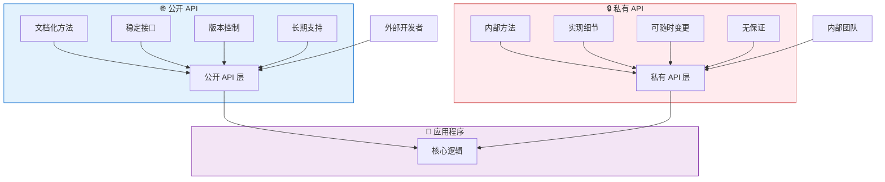
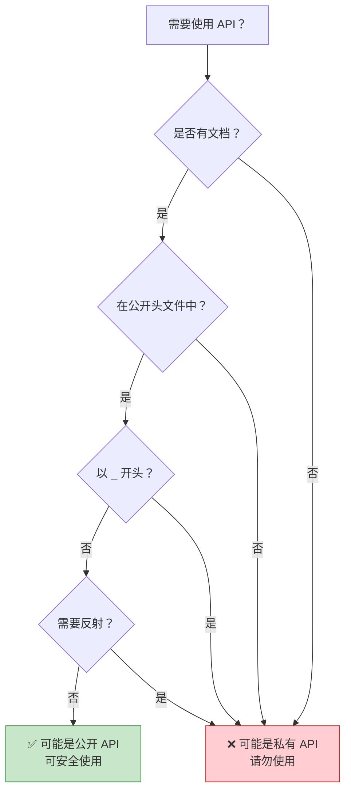
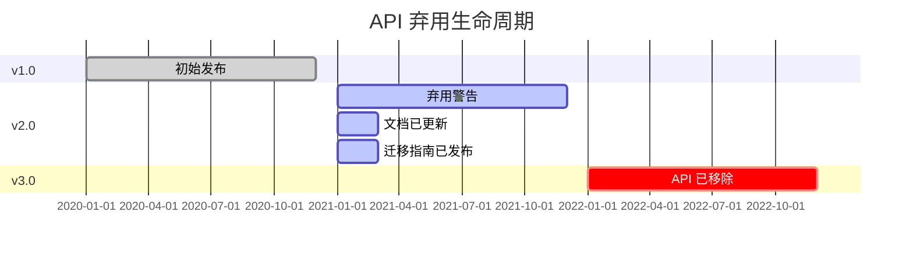
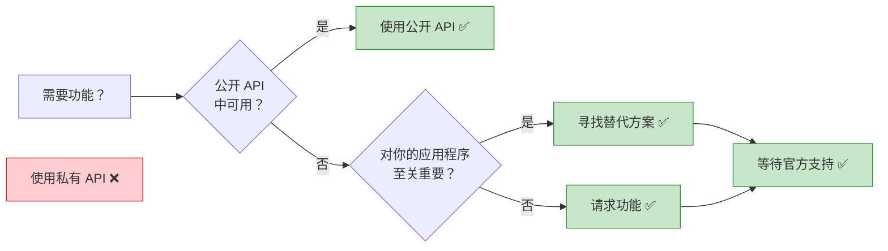

想象建造一栋房子。有些门是为访客准备的——前门配有门铃，标识清楚且欢迎使用。其他门则仅供内部使用——杂物间、电气面板和维护通道。同样地，在软件开发中，API 有两种类型：供外部开发者使用的公开 API，以及保留给内部实现的私有 API。

## API 的两面性

现代应用程序通过 API（应用程序接口）公开功能，但并非所有 API 都是平等的：

**公开 API**：为外部使用而设计
- 稳定且有版本控制
- 文档完善
- 向后兼容
- 长期支持

**私有 API**：内部实现细节
- 可能随时变更
- 文档极少或没有
- 不保证兼容性
- 可能被移除



## 公开 API：官方接口

公开 API 是开发者与平台或库互动的官方、文档化方式。

### iOS 公开 API

```swift
// 公开 API：UIKit 框架
import UIKit

class MyViewController: UIViewController {
    override func viewDidLoad() {
        super.viewDidLoad()
        
        // 公开 API：创建按钮
        let button = UIButton(type: .system)
        button.setTitle("点我", for: .normal)
        button.frame = CGRect(x: 100, y: 100, width: 200, height: 50)
        button.addTarget(self, action: #selector(buttonTapped), for: .touchUpInside)
        view.addSubview(button)
    }
    
    @objc func buttonTapped() {
        // 公开 API：显示警告
        let alert = UIAlertController(
            title: "你好",
            message: "你点击了按钮！",
            preferredStyle: .alert
        )
        alert.addAction(UIAlertAction(title: "确定", style: .default))
        present(alert, animated: true)
    }
}

// 公开 API：URLSession 用于网络请求
class NetworkService {
    func fetchData(from url: URL, completion: @escaping (Data?, Error?) -> Void) {
        let task = URLSession.shared.dataTask(with: url) { data, response, error in
            completion(data, error)
        }
        task.resume()
    }
}
```

### Android 公开 API

```kotlin
// 公开 API：Android SDK
import android.os.Bundle
import android.widget.Button
import android.widget.Toast
import androidx.appcompat.app.AppCompatActivity

class MainActivity : AppCompatActivity() {
    override fun onCreate(savedInstanceState: Bundle?) {
        super.onCreate(savedInstanceState)
        setContentView(R.layout.activity_main)
        
        // 公开 API：查找视图并设置监听器
        val button = findViewById<Button>(R.id.myButton)
        button.setOnClickListener {
            // 公开 API：显示提示消息
            Toast.makeText(this, "按钮已点击！", Toast.LENGTH_SHORT).show()
        }
    }
}

// 公开 API：Retrofit 用于网络请求
interface ApiService {
    @GET("users/{id}")
    suspend fun getUser(@Path("id") userId: String): User
}

class UserRepository {
    private val apiService: ApiService = RetrofitClient.create()
    
    suspend fun fetchUser(userId: String): User {
        return apiService.getUser(userId)
    }
}
```

### Web 公开 API

```javascript
// 公开 API：浏览器 API
class WebApp {
  constructor() {
    this.init();
  }
  
  init() {
    // 公开 API：DOM 操作
    const button = document.getElementById('myButton');
    button.addEventListener('click', () => this.handleClick());
    
    // 公开 API：Fetch 用于网络请求
    this.fetchData();
  }
  
  handleClick() {
    // 公开 API：控制台记录
    console.log('按钮已点击');
    
    // 公开 API：LocalStorage
    localStorage.setItem('lastClick', Date.now().toString());
  }
  
  async fetchData() {
    try {
      // 公开 API：Fetch API
      const response = await fetch('https://api.example.com/data');
      const data = await response.json();
      this.displayData(data);
    } catch (error) {
      console.error('获取数据失败：', error);
    }
  }
  
  displayData(data) {
    // 公开 API：DOM 操作
    const container = document.getElementById('dataContainer');
    container.innerHTML = `<p>${data.message}</p>`;
  }
}

// 公开 API：React 库
import React, { useState, useEffect } from 'react';

function UserProfile({ userId }) {
  const [user, setUser] = useState(null);
  
  useEffect(() => {
    // 公开 API：获取数据
    fetch(`https://api.example.com/users/${userId}`)
      .then(response => response.json())
      .then(data => setUser(data));
  }, [userId]);
  
  return (
    <div>
      {user && <h1>{user.name}</h1>}
    </div>
  );
}
```

!!!anote "💡 公开 API 特性"
    **稳定性**：保证跨版本运作
    
    **文档**：完整的指南和参考资料
    
    **支持**：提供官方支持渠道
    
    **版本控制**：清楚的版本号和弃用通知
    
    **测试**：经过彻底测试和验证

## 私有 API：隐藏的实现

私有 API 是不供外部使用的内部实现细节。使用它们可能导致应用程序被拒绝或损坏。

### iOS 私有 API

```swift
// ⚠️ 私有 API：访问内部 UIKit 方法
// 请勿使用 - 会导致 App Store 拒绝

// 不该做的示例：
class DangerousViewController: UIViewController {
    override func viewDidLoad() {
        super.viewDidLoad()
        
        // ❌ 尝试使用私有 API（假设示例）
        // 这会访问内部实现细节
        // if let privateMethod = self.perform(Selector("_privateLayoutMethod")) {
        //     // 这会让你的应用程序被拒绝
        // }
    }
}

// ⚠️ 私有 API：访问私有框架
// import PrivateFramework  // ❌ 不允许

// 实际后果：
// 使用私有 API 的应用程序会在 App Store 审查时被拒绝
```

### Android 私有 API

```kotlin
// ⚠️ 私有 API：访问隐藏的 Android API
// 这些标记为 @hide 注解

// 不该做的示例：
class DangerousActivity : AppCompatActivity() {
    override fun onCreate(savedInstanceState: Bundle?) {
        super.onCreate(savedInstanceState)
        
        // ❌ 尝试通过反射访问隐藏 API
        try {
            val clazz = Class.forName("android.app.ActivityThread")
            val method = clazz.getDeclaredMethod("currentActivityThread")
            method.isAccessible = true
            val activityThread = method.invoke(null)
            // 这可能现在有效，但在未来的 Android 版本中会损坏
        } catch (e: Exception) {
            // API 已变更或移除 - 你的应用程序崩溃
        }
    }
}

// Android 9+ 对私有 API 的限制：
// - 浅灰名单：记录警告
// - 深灰名单：条件性封锁
// - 黑名单：永远封锁
```

### Web 私有 API

```javascript
// ⚠️ 私有 API：访问内部实现
// 这些以 _ 为前缀或标记为内部

// 不该做的示例：
class DangerousLibraryUsage {
  constructor() {
    // ❌ 访问私有属性（惯例：下划线前缀）
    this._internalState = {};  // 不要从外部访问
    this._privateMethod();     // 不要从外部调用
  }
  
  _privateMethod() {
    // 这是内部实现
    // 可能随时变更
  }
}

// ❌ 访问 React 内部
import React from 'react';

class BadComponent extends React.Component {
  componentDidMount() {
    // ❌ 访问 React 内部属性
    // const internalInstance = this._reactInternalInstance;
    // const fiber = this._reactInternalFiber;
    // 这些可能在 React 版本之间变更
  }
}

// ❌ 猴子补丁浏览器 API
// 修改内置原型
Array.prototype._myPrivateMethod = function() {
  // 这会污染全局命名空间
  // 可能与未来的浏览器功能冲突
};
```

!!!warning "⚠️ 私有 API 的危险"
    **App Store 拒绝**：使用私有 API 的 iOS 应用程序会被拒绝
    
    **运行时崩溃**：API 可能在没有警告的情况下被移除
    
    **安全风险**：私有 API 可能绕过安全检查
    
    **维护噩梦**：代码会随着操作系统/库更新而损坏
    
    **无支持**：当出问题时无法获得帮助


## 并列比较

| 面向 | 公开 API | 私有 API |
|--------|-----------|-------------|
| **目的** | 外部使用 | 内部实现 |
| **文档** | 完整 | 极少或没有 |
| **稳定性** | 保证稳定 | 可随时变更 |
| **版本控制** | 语义化版本控制 | 无版本控制 |
| **支持** | 官方支持 | 无支持 |
| **向后兼容性** | 维护 | 不保证 |
| **App Store 审核** | 允许 | 拒绝（iOS） |
| **测试** | 彻底测试 | 仅内部测试 |
| **弃用** | 提前公告 | 无通知即移除 |
| **访问修饰符** | public、open | private、internal、@hide |
| **示例（iOS）** | UIKit、Foundation | _private 方法 |
| **示例（Android）** | Android SDK | @hide API |
| **示例（Web）** | fetch()、DOM API | _internal 属性 |


{
  "title": {
    "text": "API 稳定性随时间变化"
  },
  "tooltip": {
    "trigger": "axis"
  },
  "legend": {
    "data": ["公开 API", "私有 API"]
  },
  "xAxis": {
    "type": "category",
    "data": ["v1.0", "v1.5", "v2.0", "v2.5", "v3.0"]
  },
  "yAxis": {
    "type": "value",
    "name": "稳定性分数",
    "max": 100
  },
  "series": [
    {
      "name": "公开 API",
      "type": "line",
      "data": [100, 100, 100, 100, 100],
      "itemStyle": {
        "color": "#4caf50"
      },
      "lineStyle": {
        "width": 3
      }
    },
    {
      "name": "私有 API",
      "type": "line",
      "data": [80, 60, 40, 20, 0],
      "itemStyle": {
        "color": "#f44336"
      },
      "lineStyle": {
        "width": 3,
        "type": "dashed"
      }
    }
  ]
}


## 实际案例

### iOS：状态栏高度的故事

```swift
// ❌ 错误：使用私有 API
class BadViewController: UIViewController {
    func getStatusBarHeight() -> CGFloat {
        // 私有 API - 会损坏或被拒绝
        // return UIApplication.shared.statusBarFrame.height
        // 在 iOS 13 中弃用，在 iOS 14 中移除
        return 0
    }
}

// ✅ 正确：使用公开 API
class GoodViewController: UIViewController {
    func getSafeAreaTop() -> CGFloat {
        // 公开 API - 跨 iOS 版本运作
        if #available(iOS 11.0, *) {
            return view.safeAreaInsets.top
        } else {
            return topLayoutGuide.length
        }
    }
    
    override func viewDidLoad() {
        super.viewDidLoad()
        
        // 处理安全区域的正确方式
        let topInset = view.safeAreaInsets.top
        let contentView = UIView()
        contentView.frame = CGRect(
            x: 0,
            y: topInset,
            width: view.bounds.width,
            height: view.bounds.height - topInset
        )
        view.addSubview(contentView)
    }
}
```

### Android：隐藏 API 限制

```kotlin
// ❌ 错误：访问隐藏 API
class BadNetworkManager {
    fun getWifiInfo() {
        try {
            // 反射访问隐藏 API
            val wifiManager = context.getSystemService(Context.WIFI_SERVICE) as WifiManager
            val method = wifiManager.javaClass.getDeclaredMethod("getPrivateWifiInfo")
            method.isAccessible = true
            val info = method.invoke(wifiManager)
            // 这在 Android 9+ 上会因限制而失败
        } catch (e: Exception) {
            // 应用程序崩溃或功能损坏
        }
    }
}

// ✅ 正确：使用公开 API
class GoodNetworkManager(private val context: Context) {
    fun getWifiInfo(): WifiInfo? {
        // 公开 API 配合适当权限
        val wifiManager = context.applicationContext
            .getSystemService(Context.WIFI_SERVICE) as WifiManager
        
        // 先检查权限
        if (ContextCompat.checkSelfPermission(
                context,
                Manifest.permission.ACCESS_WIFI_STATE
            ) == PackageManager.PERMISSION_GRANTED
        ) {
            return wifiManager.connectionInfo
        }
        return null
    }
    
    fun getNetworkCapabilities(): NetworkCapabilities? {
        val connectivityManager = context.getSystemService(Context.CONNECTIVITY_SERVICE) 
            as ConnectivityManager
        val network = connectivityManager.activeNetwork
        return connectivityManager.getNetworkCapabilities(network)
    }
}
```

### Web：框架内部

```javascript
// ❌ 错误：访问 React 内部
class BadReactComponent extends React.Component {
  componentDidMount() {
    // 访问内部 React 属性
    // const fiber = this._reactInternalFiber;
    // const instance = this._reactInternalInstance;
    
    // 这些在 React 版本之间会损坏
    // React 16 -> React 17 -> React 18 都改变了内部
  }
  
  forceUpdateNow() {
    // 直接操作内部状态
    // this._reactInternalFiber.memoizedState = newState;
    // 这绕过了 React 的协调
  }
}

// ✅ 正确：使用公开 React API
class GoodReactComponent extends React.Component {
  constructor(props) {
    super(props);
    this.state = {
      count: 0
    };
  }
  
  componentDidMount() {
    // 使用公开生命周期方法
    this.fetchData();
  }
  
  async fetchData() {
    // 使用公开 setState API
    const data = await fetch('/api/data').then(r => r.json());
    this.setState({ data });
  }
  
  handleClick = () => {
    // 使用公开 setState API
    this.setState(prevState => ({
      count: prevState.count + 1
    }));
  }
  
  render() {
    return (
      <div>
        <p>计数：{this.state.count}</p>
        <button onClick={this.handleClick}>增加</button>
      </div>
    );
  }
}

// ✅ 正确：使用 Hooks 的现代 React
function GoodFunctionalComponent() {
  const [count, setCount] = useState(0);
  const [data, setData] = useState(null);
  
  useEffect(() => {
    // 公开 API 用于副作用
    fetch('/api/data')
      .then(r => r.json())
      .then(setData);
  }, []);
  
  return (
    <div>
      <p>计数：{count}</p>
      <button onClick={() => setCount(count + 1)}>增加</button>
    </div>
  );
}
```

## 如何识别私有 API

### iOS 检测

```swift
// iOS 中私有 API 的迹象：

// 1. 以下划线开头的方法
// _privateMethod()
// _internalProperty

// 2. 未在 Apple 官方文档中记录
// developer.apple.com 中没有条目

// 3. 需要导入私有头文件
// #import <UIKit/UIPrivateHeader.h>

// 4. 通过运行时操作访问
let selector = Selector("_privateMethod")
if responds(to: selector) {
    perform(selector)  // ❌ 使用私有 API
}

// 5. class-dump 显示但不在公开头文件中
// 使用 class-dump 工具查看私有方法

// ✅ 如何检查 API 是否公开：
// - 搜索 Apple Developer 文档
// - 检查是否在公开头文件中
// - 查找 @available 注解
// - 在 Xcode 自动完成中验证
```

### Android 检测

```kotlin
// Android 中私有 API 的迹象：

// 1. 在源代码中标记为 @hide 注解
// @hide
// public void privateMethod() { }

// 2. 未在官方 Android 文档中
// developer.android.com 中没有条目

// 3. 需要反射才能访问
val method = clazz.getDeclaredMethod("hiddenMethod")
method.isAccessible = true  // ❌ 访问隐藏 API

// 4. Lint 警告关于受限 API
// Android Studio 显示警告

// 5. 在内部包中
// com.android.internal.*  // ❌ 内部包

// ✅ 如何检查 API 是否公开：
fun isPublicApi(className: String): Boolean {
    return try {
        // 公开 API 可以直接访问
        Class.forName(className)
        true
    } catch (e: ClassNotFoundException) {
        false
    }
}

// 检查 Android API 级别
if (Build.VERSION.SDK_INT >= Build.VERSION_CODES.P) {
    // 使用 Android 9+ 中可用的公开 API
}
```

### Web 检测

```javascript
// Web 中私有 API 的迹象：

// 1. 以下划线开头的属性/方法
class Library {
  _privateMethod() { }  // ❌ 按惯例为私有
  publicMethod() { }    // ✅ 公开
}

// 2. 未在官方文档中
// 检查库的官方文档

// 3. 在 JSDoc 中标记为 @internal
/**
 * @internal
 * 这不是公开 API 的一部分
 */
function _internalFunction() { }

// 4. 在 TypeScript 中：标记为 private
class Component {
  private _state: any;      // ❌ 私有
  public props: any;        // ✅ 公开
}

// 5. 访问原型内部
// React.__SECRET_INTERNALS_DO_NOT_USE_OR_YOU_WILL_BE_FIRED
// ❌ 明确标记为内部

// ✅ 如何检查 API 是否公开：
// - 检查官方文档
// - 查找 TypeScript 类型定义
// - 检查是否从主模块导出
// - 阅读 CHANGELOG 以了解弃用通知
```




## 设计你自己的 API

### 创建公开 API

```swift
// iOS：设计公开框架 API
public class ImageLoader {
    // ✅ 公开初始化器
    public init() { }
    
    // ✅ 公开方法配合清楚的文档
    /// 从指定的 URL 加载图片
    /// - Parameters:
    ///   - url: 要加载的图片 URL
    ///   - completion: 加载完成时调用
    public func loadImage(
        from url: URL,
        completion: @escaping (UIImage?, Error?) -> Void
    ) {
        // 实现使用私有方法
        _performNetworkRequest(url: url, completion: completion)
    }
    
    // ❌ 私有实现细节
    private func _performNetworkRequest(
        url: URL,
        completion: @escaping (UIImage?, Error?) -> Void
    ) {
        // 内部实现
        // 可以在不影响公开 API 的情况下变更
    }
}
```

```kotlin
// Android：设计公开库 API
class DataRepository {
    // ✅ 公开方法
    /**
     * 从服务器获取用户数据
     * @param userId 要获取的用户 ID
     * @return User 对象，如果找不到则为 null
     */
    suspend fun getUser(userId: String): User? {
        return fetchFromNetwork(userId)
    }
    
    // ❌ 私有实现
    private suspend fun fetchFromNetwork(userId: String): User? {
        // 内部实现
        // 可以在不破坏公开 API 的情况下重构
        return apiService.getUser(userId)
    }
    
    // ❌ 仅供模块内部使用
    internal fun clearCache() {
        // 在模块内可用但不对外部用户开放
    }
}
```

```javascript
// Web：设计公开库 API
class DataService {
  // ✅ 公开方法
  /**
   * 从 API 获取数据
   * @param {string} endpoint - API 端点
   * @returns {Promise<Object>} 获取的数据
   * @public
   */
  async fetchData(endpoint) {
    const url = this._buildUrl(endpoint);
    return this._makeRequest(url);
  }
  
  // ❌ 私有方法（惯例：下划线前缀）
  /**
   * @private
   */
  _buildUrl(endpoint) {
    return `${this._baseUrl}/${endpoint}`;
  }
  
  /**
   * @private
   */
  async _makeRequest(url) {
    const response = await fetch(url);
    return response.json();
  }
}

// TypeScript：明确的访问修饰符
class TypedDataService {
  private baseUrl: string;
  
  constructor(baseUrl: string) {
    this.baseUrl = baseUrl;
  }
  
  // ✅ 公开方法
  public async fetchData(endpoint: string): Promise<any> {
    const url = this.buildUrl(endpoint);
    return this.makeRequest(url);
  }
  
  // ❌ 私有方法
  private buildUrl(endpoint: string): string {
    return `${this.baseUrl}/${endpoint}`;
  }
  
  private async makeRequest(url: string): Promise<any> {
    const response = await fetch(url);
    return response.json();
  }
}
```

### API 设计最佳实践

!!!anote "💡 公开 API 设计原则"
    **1. 保持简单**
    - 最小化表面积
    - 清楚的方法名称
    - 直观的参数
    
    **2. 彻底记录**
    - 目的和用法
    - 参数和返回值
    - 代码示例
    - 边界情况
    
    **3. 谨慎版本控制**
    - 语义化版本控制（主版本.次版本.修订版本）
    - 移除前的弃用警告
    - 迁移指南
    
    **4. 维护向后兼容性**
    - 不要破坏现有代码
    - 添加新方法而不是变更旧方法
    - 使用 @available/@Deprecated 注解
    
    **5. 隐藏实现细节**
    - 使用 private/internal 修饰符
    - 只公开必要的内容
    - 允许内部重构

## 版本控制与弃用

### iOS API 版本控制

```swift
// 标记 API 从特定 iOS 版本开始可用
@available(iOS 13.0, *)
public func newFeature() {
    // 仅在 iOS 13+ 上可用
}

// 弃用旧 API
@available(iOS, deprecated: 14.0, message: "请改用 newMethod()")
public func oldMethod() {
    // 仍然有效但显示警告
}

// 标记 API 为过时
@available(iOS, obsoleted: 15.0, renamed: "newMethod()")
public func legacyMethod() {
    // 在 iOS 15 中移除
}

// 使用版本检查
if #available(iOS 13.0, *) {
    newFeature()
} else {
    // 旧版 iOS 的备用方案
    oldMethod()
}

// 实际示例：UIApplication statusBar
class StatusBarExample {
    func getStatusBarHeight() -> CGFloat {
        if #available(iOS 13.0, *) {
            // 新方式：使用窗口场景
            let window = UIApplication.shared.windows.first
            return window?.windowScene?.statusBarManager?.statusBarFrame.height ?? 0
        } else {
            // 旧方式：直接访问（已弃用）
            return UIApplication.shared.statusBarFrame.height
        }
    }
}
```

### Android API 版本控制

```kotlin
// 标记 API 的最低 SDK 版本
@RequiresApi(Build.VERSION_CODES.O)
fun useOreoFeature() {
    // 仅在 Android 8.0+ 上可用
}

// 弃用旧 API
@Deprecated(
    message = "请改用 newMethod()",
    replaceWith = ReplaceWith("newMethod()"),
    level = DeprecationLevel.WARNING
)
fun oldMethod() {
    // 在 IDE 中显示警告
}

// 使用版本检查
fun handleNotification() {
    if (Build.VERSION.SDK_INT >= Build.VERSION_CODES.O) {
        // Android 8.0+：使用通知渠道
        createNotificationChannel()
    } else {
        // 8.0 之前：旧通知 API
        createLegacyNotification()
    }
}

@RequiresApi(Build.VERSION_CODES.O)
private fun createNotificationChannel() {
    val channel = NotificationChannel(
        "channel_id",
        "渠道名称",
        NotificationManager.IMPORTANCE_DEFAULT
    )
    val manager = getSystemService(NotificationManager::class.java)
    manager.createNotificationChannel(channel)
}

private fun createLegacyNotification() {
    val notification = Notification.Builder(this)
        .setContentTitle("标题")
        .setContentText("文字")
        .build()
}
```

### Web API 版本控制

```javascript
// package.json 中的语义化版本控制
{
  "name": "my-library",
  "version": "2.1.3",
  // 主版本.次版本.修订版本
  // 2 = 破坏性变更
  // 1 = 新功能（向后兼容）
  // 3 = 错误修复
}

// 使用警告弃用 API
class MyLibrary {
  /**
   * @deprecated 请改用 newMethod()。将在 v3.0.0 中移除
   */
  oldMethod() {
    console.warn('oldMethod() 已弃用。请改用 newMethod()。');
    return this.newMethod();
  }
  
  newMethod() {
    // 新实现
  }
}

// 功能检测而非版本检查
class BrowserFeatures {
  supportsWebGL() {
    try {
      const canvas = document.createElement('canvas');
      return !!(
        window.WebGLRenderingContext &&
        (canvas.getContext('webgl') || canvas.getContext('experimental-webgl'))
      );
    } catch (e) {
      return false;
    }
  }
  
  supportsLocalStorage() {
    try {
      const test = '__test__';
      localStorage.setItem(test, test);
      localStorage.removeItem(test);
      return true;
    } catch (e) {
      return false;
    }
  }
  
  useFeature() {
    if (this.supportsLocalStorage()) {
      // 使用 localStorage
      localStorage.setItem('key', 'value');
    } else {
      // 备用方案使用 cookies
      document.cookie = 'key=value';
    }
  }
}

// 缺少功能的 Polyfills
if (!Array.prototype.includes) {
  Array.prototype.includes = function(searchElement) {
    return this.indexOf(searchElement) !== -1;
  };
}
```

### 弃用时间表



!!!tip "💡 弃用最佳实践"
    **1. 提早公告**
    - 给开发者 6-12 个月的通知
    - 立即更新文档
    - 在代码中添加弃用警告
    
    **2. 提供迁移路径**
    - 记录替代 API
    - 提供代码示例
    - 如果可能，提供自动迁移工具
    
    **3. 遵循语义化版本控制**
    - 修订版本：仅错误修复
    - 次版本：新功能，向后兼容
    - 主版本：允许破坏性变更
    
    **4. 清楚沟通**
    - 变更日志条目
    - 重大变更的博客文章
    - 向用户发送电子邮件通知
    - 应用程序内警告


## 当私有 API 很诱人时

### 常见情境

```swift
// 情境 1：访问不可用的功能
// ❌ 错误：使用私有 API 自定义状态栏
class TemptingViewController: UIViewController {
    func customizeStatusBar() {
        // 私有 API 来变更状态栏颜色
        // UIApplication.shared.statusBar.backgroundColor = .red
        // 这会让你的应用程序被拒绝
    }
}

// ✅ 正确：使用可用的公开 API
class ProperViewController: UIViewController {
    override var preferredStatusBarStyle: UIStatusBarStyle {
        return .lightContent  // 公开 API
    }
    
    override func viewDidLoad() {
        super.viewDidLoad()
        setNeedsStatusBarAppearanceUpdate()
    }
}

// 情境 2：绕过限制
// ❌ 错误：访问私有属性
class TemptingTableView: UITableViewController {
    override func viewDidLoad() {
        super.viewDidLoad()
        
        // 尝试访问私有表格视图属性
        // tableView._privateProperty = value
    }
}

// ✅ 正确：使用组合或子类化
class ProperTableView: UITableViewController {
    override func viewDidLoad() {
        super.viewDidLoad()
        
        // 使用公开 API 和自定义视图
        let headerView = CustomHeaderView()
        tableView.tableHeaderView = headerView
    }
}
```

### 私有 API 的替代方案

```kotlin
// 情境：需要公开 API 中没有的功能

// ❌ 错误：反射访问隐藏方法
class TemptingApproach {
    fun getHiddenInfo(): String? {
        return try {
            val clazz = Class.forName("android.os.SystemProperties")
            val method = clazz.getMethod("get", String::class.java)
            method.invoke(null, "ro.build.version.sdk") as String
        } catch (e: Exception) {
            null
        }
    }
}

// ✅ 正确：使用公开 API
class ProperApproach {
    fun getBuildInfo(): String {
        // 公开 API
        return Build.VERSION.SDK_INT.toString()
    }
    
    fun getDeviceInfo(): String {
        // 公开 API
        return "${Build.MANUFACTURER} ${Build.MODEL}"
    }
}

// ✅ 正确：向平台请求功能
// 向 Google/Apple 提交功能请求
// 同时使用公开 API
// 等待官方支持

// ✅ 正确：使用第三方库
// 寻找使用公开 API 的维护良好的库
// 示例：使用 Glide/Picasso 而不是访问内部图片缓存
```

### 私有 API 的代价

```javascript
// 实际示例：React 内部使用

// ❌ 错误：访问 React 内部（2016）
class OldComponent extends React.Component {
  componentDidMount() {
    // 这在 React 15 中有效
    const internalInstance = this._reactInternalInstance;
    // 在 React 16（Fiber 重写）中损坏
  }
}

// 代价：
// 1. React 16 发布时应用程序损坏
// 2. 没有提供迁移路径
// 3. 必须从头重写组件
// 4. 失去开发时间
// 5. 因错误而导致用户不满

// ✅ 正确：使用公开 API
class ModernComponent extends React.Component {
  constructor(props) {
    super(props);
    this.ref = React.createRef();
  }
  
  componentDidMount() {
    // 公开 API - 跨 React 版本运作
    const element = this.ref.current;
    // 对 DOM 元素做些什么
  }
  
  render() {
    return <div ref={this.ref}>内容</div>;
  }
}

// 更好：使用 hooks（公开 API）
function ModernFunctionalComponent() {
  const ref = useRef(null);
  
  useEffect(() => {
    // 公开 API - 稳定且受支持
    const element = ref.current;
  }, []);
  
  return <div ref={ref}>内容</div>;
}
```

!!!warning "⚠️ 使用私有 API 的实际后果"
    **iOS App Store 拒绝**
    - 审查期间自动拒绝
    - 延迟应用程序发布数周
    - 需要完全重写
    
    **Android 运行时崩溃**
    - 应用程序在较新的 Android 版本上崩溃
    - 用户的负面评价
    - 需要紧急更新
    
    **Web 应用程序损坏**
    - 库更新破坏你的应用程序
    - 库维护者不提供支持
    - 技术债务累积
    
    **业务影响**
    - 停机期间的收入损失
    - 声誉受损
    - 维护成本增加
    - 浪费开发者时间

## 总结

理解公开 API 和私有 API 之间的区别对于构建可维护、稳定的应用程序至关重要：

**公开 API**：
- 供外部使用的官方、文档化接口
- 保证稳定性和向后兼容性
- 完整的文档和支持
- 适用于生产环境应用程序
- App Store 审核所需

**私有 API**：
- 内部实现细节
- 可能在没有通知的情况下变更或移除
- 没有文档或支持
- 导致应用程序被拒绝和运行时崩溃
- 绝不应在生产环境中使用

**关键要点**：



### 决策矩阵

| 情况 | 公开 API | 私有 API | 建议 |
|-----------|-----------|-------------|----------------|
| 功能公开可用 | ✅ | ❌ | 始终使用公开 API |
| 功能仅在私有 API 中 | ❌ | ❌ | 寻找替代方案或等待 |
| 需要快速交付 | ✅ | ❌ | 使用公开 API，即使有限制 |
| 构建内部工具 | ✅ | ⚠️ | 优先使用公开，如果内部则接受风险 |
| 构建 App Store 应用程序 | ✅ | ❌ | 绝不使用私有 API |
| 构建企业应用程序 | ✅ | ⚠️ | 优先使用公开，记录风险 |
| 构建开源库 | ✅ | ❌ | 仅使用公开 API |

!!!tip "💡 最佳实践"
    **始终优先使用公开 API**
    - 它们稳定且受支持
    - 它们不会破坏你的应用程序
    - 它们不会导致拒绝
    
    **当公开 API 不足时**
    - 向平台供应商提交功能请求
    - 使用维护良好的第三方库
    - 使用公开 API 实现变通方法
    - 等待官方支持
    
    **绝不使用私有 API 于**
    - 生产环境应用程序
    - App Store 提交
    - 客户项目
    - 开源库
    
    **谨慎设计你自己的 API**
    - 清楚的公开/私有分离
    - 完整的文档
    - 语义化版本控制
    - 弃用警告

## 参考资料

- [Apple Developer 文档](https://developer.apple.com/documentation/)
- [Android API 参考](https://developer.android.com/reference)
- [MDN Web API](https://developer.mozilla.org/zh-CN/docs/Web/API)
- [iOS App Store 审查指南](https://developer.apple.com/app-store/review/guidelines/)
- [Android 隐藏 API 限制](https://developer.android.com/guide/app-compatibility/restrictions-non-sdk-interfaces)
- [语义化版本控制](https://semver.org/)
