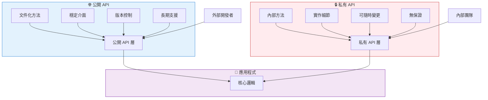
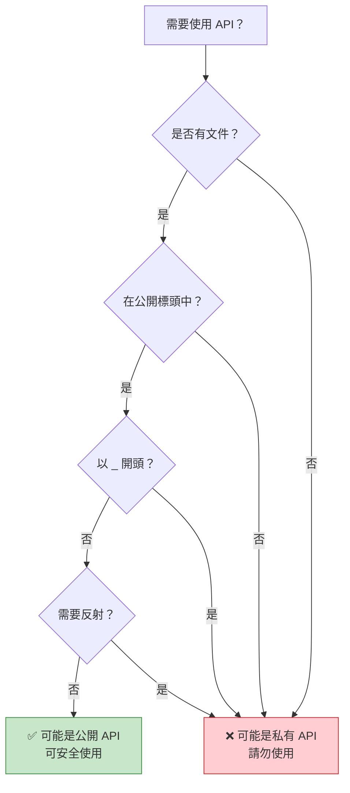
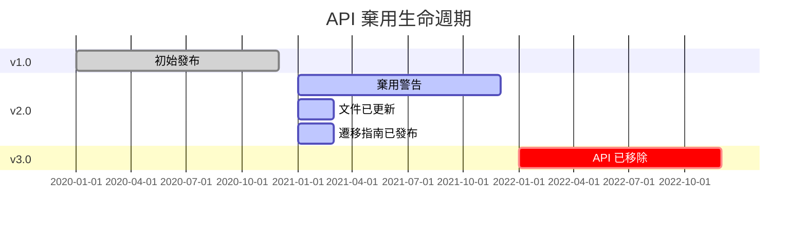
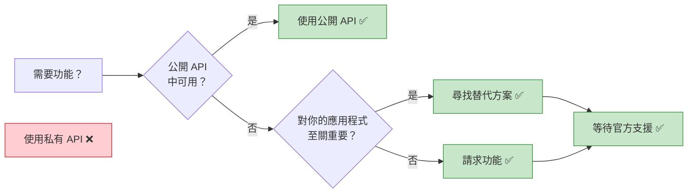

想像建造一棟房子。有些門是為訪客準備的——前門配有門鈴，標示清楚且歡迎使用。其他門則僅供內部使用——雜物間、電氣面板和維護通道。同樣地，在軟體開發中，API 有兩種類型：供外部開發者使用的公開 API，以及保留給內部實作的私有 API。

## API 的兩面性

現代應用程式透過 API（應用程式介面）公開功能，但並非所有 API 都是平等的：

**公開 API**：為外部使用而設計
- 穩定且有版本控制
- 文件完善
- 向後相容
- 長期支援

**私有 API**：內部實作細節
- 可能隨時變更
- 文件極少或沒有
- 不保證相容性
- 可能被移除




## 公開 API：官方介面

公開 API 是開發者與平台或函式庫互動的官方、文件化方式。

### iOS 公開 API

```swift
// 公開 API：UIKit 框架
import UIKit

class MyViewController: UIViewController {
    override func viewDidLoad() {
        super.viewDidLoad()
        
        // 公開 API：建立按鈕
        let button = UIButton(type: .system)
        button.setTitle("點我", for: .normal)
        button.frame = CGRect(x: 100, y: 100, width: 200, height: 50)
        button.addTarget(self, action: #selector(buttonTapped), for: .touchUpInside)
        view.addSubview(button)
    }
    
    @objc func buttonTapped() {
        // 公開 API：顯示警告
        let alert = UIAlertController(
            title: "你好",
            message: "你點擊了按鈕！",
            preferredStyle: .alert
        )
        alert.addAction(UIAlertAction(title: "確定", style: .default))
        present(alert, animated: true)
    }
}

// 公開 API：URLSession 用於網路請求
class NetworkService {
    func fetchData(from url: URL, completion: @escaping (Data?, Error?) -> Void) {
        let task = URLSession.shared.dataTask(with: url) { data, response, error in
            completion(data, error)
        }
        task.resume()
    }
}
```

### Android 公開 API

```kotlin
// 公開 API：Android SDK
import android.os.Bundle
import android.widget.Button
import android.widget.Toast
import androidx.appcompat.app.AppCompatActivity

class MainActivity : AppCompatActivity() {
    override fun onCreate(savedInstanceState: Bundle?) {
        super.onCreate(savedInstanceState)
        setContentView(R.layout.activity_main)
        
        // 公開 API：尋找視圖並設定監聽器
        val button = findViewById<Button>(R.id.myButton)
        button.setOnClickListener {
            // 公開 API：顯示提示訊息
            Toast.makeText(this, "按鈕已點擊！", Toast.LENGTH_SHORT).show()
        }
    }
}

// 公開 API：Retrofit 用於網路請求
interface ApiService {
    @GET("users/{id}")
    suspend fun getUser(@Path("id") userId: String): User
}

class UserRepository {
    private val apiService: ApiService = RetrofitClient.create()
    
    suspend fun fetchUser(userId: String): User {
        return apiService.getUser(userId)
    }
}
```

### Web 公開 API

```javascript
// 公開 API：瀏覽器 API
class WebApp {
  constructor() {
    this.init();
  }
  
  init() {
    // 公開 API：DOM 操作
    const button = document.getElementById('myButton');
    button.addEventListener('click', () => this.handleClick());
    
    // 公開 API：Fetch 用於網路請求
    this.fetchData();
  }
  
  handleClick() {
    // 公開 API：主控台記錄
    console.log('按鈕已點擊');
    
    // 公開 API：LocalStorage
    localStorage.setItem('lastClick', Date.now().toString());
  }
  
  async fetchData() {
    try {
      // 公開 API：Fetch API
      const response = await fetch('https://api.example.com/data');
      const data = await response.json();
      this.displayData(data);
    } catch (error) {
      console.error('取得資料失敗：', error);
    }
  }
  
  displayData(data) {
    // 公開 API：DOM 操作
    const container = document.getElementById('dataContainer');
    container.innerHTML = `<p>${data.message}</p>`;
  }
}

// 公開 API：React 函式庫
import React, { useState, useEffect } from 'react';

function UserProfile({ userId }) {
  const [user, setUser] = useState(null);
  
  useEffect(() => {
    // 公開 API：取得資料
    fetch(`https://api.example.com/users/${userId}`)
      .then(response => response.json())
      .then(data => setUser(data));
  }, [userId]);
  
  return (
    <div>
      {user && <h1>{user.name}</h1>}
    </div>
  );
}
```

!!!anote "💡 公開 API 特性"
    **穩定性**：保證跨版本運作
    
    **文件**：完整的指南和參考資料
    
    **支援**：提供官方支援管道
    
    **版本控制**：清楚的版本號和棄用通知
    
    **測試**：經過徹底測試和驗證


## 私有 API：隱藏的實作

私有 API 是不供外部使用的內部實作細節。使用它們可能導致應用程式被拒絕或損壞。

### iOS 私有 API

```swift
// ⚠️ 私有 API：存取內部 UIKit 方法
// 請勿使用 - 會導致 App Store 拒絕

// 不該做的範例：
class DangerousViewController: UIViewController {
    override func viewDidLoad() {
        super.viewDidLoad()
        
        // ❌ 嘗試使用私有 API（假設範例）
        // 這會存取內部實作細節
        // if let privateMethod = self.perform(Selector("_privateLayoutMethod")) {
        //     // 這會讓你的應用程式被拒絕
        // }
    }
}

// ⚠️ 私有 API：存取私有框架
// import PrivateFramework  // ❌ 不允許

// 實際後果：
// 使用私有 API 的應用程式會在 App Store 審查時被拒絕
```

### Android 私有 API

```kotlin
// ⚠️ 私有 API：存取隱藏的 Android API
// 這些標記為 @hide 註解

// 不該做的範例：
class DangerousActivity : AppCompatActivity() {
    override fun onCreate(savedInstanceState: Bundle?) {
        super.onCreate(savedInstanceState)
        
        // ❌ 嘗試透過反射存取隱藏 API
        try {
            val clazz = Class.forName("android.app.ActivityThread")
            val method = clazz.getDeclaredMethod("currentActivityThread")
            method.isAccessible = true
            val activityThread = method.invoke(null)
            // 這可能現在有效，但在未來的 Android 版本中會損壞
        } catch (e: Exception) {
            // API 已變更或移除 - 你的應用程式崩潰
        }
    }
}

// Android 9+ 對私有 API 的限制：
// - 淺灰名單：記錄警告
// - 深灰名單：條件性封鎖
// - 黑名單：永遠封鎖
```

### Web 私有 API

```javascript
// ⚠️ 私有 API：存取內部實作
// 這些以 _ 為前綴或標記為內部

// 不該做的範例：
class DangerousLibraryUsage {
  constructor() {
    // ❌ 存取私有屬性（慣例：底線前綴）
    this._internalState = {};  // 不要從外部存取
    this._privateMethod();     // 不要從外部呼叫
  }
  
  _privateMethod() {
    // 這是內部實作
    // 可能隨時變更
  }
}

// ❌ 存取 React 內部
import React from 'react';

class BadComponent extends React.Component {
  componentDidMount() {
    // ❌ 存取 React 內部屬性
    // const internalInstance = this._reactInternalInstance;
    // const fiber = this._reactInternalFiber;
    // 這些可能在 React 版本之間變更
  }
}

// ❌ 猴子補丁瀏覽器 API
// 修改內建原型
Array.prototype._myPrivateMethod = function() {
  // 這會污染全域命名空間
  // 可能與未來的瀏覽器功能衝突
};
```

!!!warning "⚠️ 私有 API 的危險"
    **App Store 拒絕**：使用私有 API 的 iOS 應用程式會被拒絕
    
    **執行時崩潰**：API 可能在沒有警告的情況下被移除
    
    **安全風險**：私有 API 可能繞過安全檢查
    
    **維護惡夢**：程式碼會隨著作業系統/函式庫更新而損壞
    
    **無支援**：當出問題時無法獲得協助


## 並列比較

| 面向 | 公開 API | 私有 API |
|--------|-----------|-------------|
| **目的** | 外部使用 | 內部實作 |
| **文件** | 完整 | 極少或沒有 |
| **穩定性** | 保證穩定 | 可隨時變更 |
| **版本控制** | 語意化版本控制 | 無版本控制 |
| **支援** | 官方支援 | 無支援 |
| **向後相容性** | 維護 | 不保證 |
| **App Store 審核** | 允許 | 拒絕（iOS） |
| **測試** | 徹底測試 | 僅內部測試 |
| **棄用** | 提前公告 | 無通知即移除 |
| **存取修飾符** | public、open | private、internal、@hide |
| **範例（iOS）** | UIKit、Foundation | _private 方法 |
| **範例（Android）** | Android SDK | @hide API |
| **範例（Web）** | fetch()、DOM API | _internal 屬性 |


{
  "title": {
    "text": "API 穩定性隨時間變化"
  },
  "tooltip": {
    "trigger": "axis"
  },
  "legend": {
    "data": ["公開 API", "私有 API"]
  },
  "xAxis": {
    "type": "category",
    "data": ["v1.0", "v1.5", "v2.0", "v2.5", "v3.0"]
  },
  "yAxis": {
    "type": "value",
    "name": "穩定性分數",
    "max": 100
  },
  "series": [
    {
      "name": "公開 API",
      "type": "line",
      "data": [100, 100, 100, 100, 100],
      "itemStyle": {
        "color": "#4caf50"
      },
      "lineStyle": {
        "width": 3
      }
    },
    {
      "name": "私有 API",
      "type": "line",
      "data": [80, 60, 40, 20, 0],
      "itemStyle": {
        "color": "#f44336"
      },
      "lineStyle": {
        "width": 3,
        "type": "dashed"
      }
    }
  ]
}



## 實際案例

### iOS：狀態列高度的故事

```swift
// ❌ 錯誤：使用私有 API
class BadViewController: UIViewController {
    func getStatusBarHeight() -> CGFloat {
        // 私有 API - 會損壞或被拒絕
        // return UIApplication.shared.statusBarFrame.height
        // 在 iOS 13 中棄用，在 iOS 14 中移除
        return 0
    }
}

// ✅ 正確：使用公開 API
class GoodViewController: UIViewController {
    func getSafeAreaTop() -> CGFloat {
        // 公開 API - 跨 iOS 版本運作
        if #available(iOS 11.0, *) {
            return view.safeAreaInsets.top
        } else {
            return topLayoutGuide.length
        }
    }
    
    override func viewDidLoad() {
        super.viewDidLoad()
        
        // 處理安全區域的正確方式
        let topInset = view.safeAreaInsets.top
        let contentView = UIView()
        contentView.frame = CGRect(
            x: 0,
            y: topInset,
            width: view.bounds.width,
            height: view.bounds.height - topInset
        )
        view.addSubview(contentView)
    }
}
```

### Android：隱藏 API 限制

```kotlin
// ❌ 錯誤：存取隱藏 API
class BadNetworkManager {
    fun getWifiInfo() {
        try {
            // 反射存取隱藏 API
            val wifiManager = context.getSystemService(Context.WIFI_SERVICE) as WifiManager
            val method = wifiManager.javaClass.getDeclaredMethod("getPrivateWifiInfo")
            method.isAccessible = true
            val info = method.invoke(wifiManager)
            // 這在 Android 9+ 上會因限制而失敗
        } catch (e: Exception) {
            // 應用程式崩潰或功能損壞
        }
    }
}

// ✅ 正確：使用公開 API
class GoodNetworkManager(private val context: Context) {
    fun getWifiInfo(): WifiInfo? {
        // 公開 API 配合適當權限
        val wifiManager = context.applicationContext
            .getSystemService(Context.WIFI_SERVICE) as WifiManager
        
        // 先檢查權限
        if (ContextCompat.checkSelfPermission(
                context,
                Manifest.permission.ACCESS_WIFI_STATE
            ) == PackageManager.PERMISSION_GRANTED
        ) {
            return wifiManager.connectionInfo
        }
        return null
    }
    
    fun getNetworkCapabilities(): NetworkCapabilities? {
        val connectivityManager = context.getSystemService(Context.CONNECTIVITY_SERVICE) 
            as ConnectivityManager
        val network = connectivityManager.activeNetwork
        return connectivityManager.getNetworkCapabilities(network)
    }
}
```

### Web：框架內部

```javascript
// ❌ 錯誤：存取 React 內部
class BadReactComponent extends React.Component {
  componentDidMount() {
    // 存取內部 React 屬性
    // const fiber = this._reactInternalFiber;
    // const instance = this._reactInternalInstance;
    
    // 這些在 React 版本之間會損壞
    // React 16 -> React 17 -> React 18 都改變了內部
  }
  
  forceUpdateNow() {
    // 直接操作內部狀態
    // this._reactInternalFiber.memoizedState = newState;
    // 這繞過了 React 的協調
  }
}

// ✅ 正確：使用公開 React API
class GoodReactComponent extends React.Component {
  constructor(props) {
    super(props);
    this.state = {
      count: 0
    };
  }
  
  componentDidMount() {
    // 使用公開生命週期方法
    this.fetchData();
  }
  
  async fetchData() {
    // 使用公開 setState API
    const data = await fetch('/api/data').then(r => r.json());
    this.setState({ data });
  }
  
  handleClick = () => {
    // 使用公開 setState API
    this.setState(prevState => ({
      count: prevState.count + 1
    }));
  }
  
  render() {
    return (
      <div>
        <p>計數：{this.state.count}</p>
        <button onClick={this.handleClick}>增加</button>
      </div>
    );
  }
}

// ✅ 正確：使用 Hooks 的現代 React
function GoodFunctionalComponent() {
  const [count, setCount] = useState(0);
  const [data, setData] = useState(null);
  
  useEffect(() => {
    // 公開 API 用於副作用
    fetch('/api/data')
      .then(r => r.json())
      .then(setData);
  }, []);
  
  return (
    <div>
      <p>計數：{count}</p>
      <button onClick={() => setCount(count + 1)}>增加</button>
    </div>
  );
}
```


## 如何識別私有 API

### iOS 偵測

```swift
// iOS 中私有 API 的跡象：

// 1. 以底線開頭的方法
// _privateMethod()
// _internalProperty

// 2. 未在 Apple 官方文件中記錄
// developer.apple.com 中沒有條目

// 3. 需要匯入私有標頭
// #import <UIKit/UIPrivateHeader.h>

// 4. 透過執行時操作存取
let selector = Selector("_privateMethod")
if responds(to: selector) {
    perform(selector)  // ❌ 使用私有 API
}

// 5. class-dump 顯示但不在公開標頭中
// 使用 class-dump 工具查看私有方法

// ✅ 如何檢查 API 是否公開：
// - 搜尋 Apple Developer 文件
// - 檢查是否在公開標頭中
// - 尋找 @available 註解
// - 在 Xcode 自動完成中驗證
```

### Android 偵測

```kotlin
// Android 中私有 API 的跡象：

// 1. 在原始碼中標記為 @hide 註解
// @hide
// public void privateMethod() { }

// 2. 未在官方 Android 文件中
// developer.android.com 中沒有條目

// 3. 需要反射才能存取
val method = clazz.getDeclaredMethod("hiddenMethod")
method.isAccessible = true  // ❌ 存取隱藏 API

// 4. Lint 警告關於受限 API
// Android Studio 顯示警告

// 5. 在內部套件中
// com.android.internal.*  // ❌ 內部套件

// ✅ 如何檢查 API 是否公開：
fun isPublicApi(className: String): Boolean {
    return try {
        // 公開 API 可以直接存取
        Class.forName(className)
        true
    } catch (e: ClassNotFoundException) {
        false
    }
}

// 檢查 Android API 級別
if (Build.VERSION.SDK_INT >= Build.VERSION_CODES.P) {
    // 使用 Android 9+ 中可用的公開 API
}
```

### Web 偵測

```javascript
// Web 中私有 API 的跡象：

// 1. 以底線開頭的屬性/方法
class Library {
  _privateMethod() { }  // ❌ 按慣例為私有
  publicMethod() { }    // ✅ 公開
}

// 2. 未在官方文件中
// 檢查函式庫的官方文件

// 3. 在 JSDoc 中標記為 @internal
/**
 * @internal
 * 這不是公開 API 的一部分
 */
function _internalFunction() { }

// 4. 在 TypeScript 中：標記為 private
class Component {
  private _state: any;      // ❌ 私有
  public props: any;        // ✅ 公開
}

// 5. 存取原型內部
// React.__SECRET_INTERNALS_DO_NOT_USE_OR_YOU_WILL_BE_FIRED
// ❌ 明確標記為內部

// ✅ 如何檢查 API 是否公開：
// - 檢查官方文件
// - 尋找 TypeScript 型別定義
// - 檢查是否從主模組匯出
// - 閱讀 CHANGELOG 以了解棄用通知
```




## 設計你自己的 API

### 建立公開 API

```swift
// iOS：設計公開框架 API
public class ImageLoader {
    // ✅ 公開初始化器
    public init() { }
    
    // ✅ 公開方法配合清楚的文件
    /// 從指定的 URL 載入圖片
    /// - Parameters:
    ///   - url: 要載入的圖片 URL
    ///   - completion: 載入完成時呼叫
    public func loadImage(
        from url: URL,
        completion: @escaping (UIImage?, Error?) -> Void
    ) {
        // 實作使用私有方法
        _performNetworkRequest(url: url, completion: completion)
    }
    
    // ❌ 私有實作細節
    private func _performNetworkRequest(
        url: URL,
        completion: @escaping (UIImage?, Error?) -> Void
    ) {
        // 內部實作
        // 可以在不影響公開 API 的情況下變更
    }
}
```

```kotlin
// Android：設計公開函式庫 API
class DataRepository {
    // ✅ 公開方法
    /**
     * 從伺服器取得使用者資料
     * @param userId 要取得的使用者 ID
     * @return User 物件，如果找不到則為 null
     */
    suspend fun getUser(userId: String): User? {
        return fetchFromNetwork(userId)
    }
    
    // ❌ 私有實作
    private suspend fun fetchFromNetwork(userId: String): User? {
        // 內部實作
        // 可以在不破壞公開 API 的情況下重構
        return apiService.getUser(userId)
    }
    
    // ❌ 僅供模組內部使用
    internal fun clearCache() {
        // 在模組內可用但不對外部使用者開放
    }
}
```

```javascript
// Web：設計公開函式庫 API
class DataService {
  // ✅ 公開方法
  /**
   * 從 API 取得資料
   * @param {string} endpoint - API 端點
   * @returns {Promise<Object>} 取得的資料
   * @public
   */
  async fetchData(endpoint) {
    const url = this._buildUrl(endpoint);
    return this._makeRequest(url);
  }
  
  // ❌ 私有方法（慣例：底線前綴）
  /**
   * @private
   */
  _buildUrl(endpoint) {
    return `${this._baseUrl}/${endpoint}`;
  }
  
  /**
   * @private
   */
  async _makeRequest(url) {
    const response = await fetch(url);
    return response.json();
  }
}

// TypeScript：明確的存取修飾符
class TypedDataService {
  private baseUrl: string;
  
  constructor(baseUrl: string) {
    this.baseUrl = baseUrl;
  }
  
  // ✅ 公開方法
  public async fetchData(endpoint: string): Promise<any> {
    const url = this.buildUrl(endpoint);
    return this.makeRequest(url);
  }
  
  // ❌ 私有方法
  private buildUrl(endpoint: string): string {
    return `${this.baseUrl}/${endpoint}`;
  }
  
  private async makeRequest(url: string): Promise<any> {
    const response = await fetch(url);
    return response.json();
  }
}
```

### API 設計最佳實踐

!!!anote "💡 公開 API 設計原則"
    **1. 保持簡單**
    - 最小化表面積
    - 清楚的方法名稱
    - 直觀的參數
    
    **2. 徹底記錄**
    - 目的和用法
    - 參數和回傳值
    - 程式碼範例
    - 邊界情況
    
    **3. 謹慎版本控制**
    - 語意化版本控制（主版本.次版本.修訂版本）
    - 移除前的棄用警告
    - 遷移指南
    
    **4. 維護向後相容性**
    - 不要破壞現有程式碼
    - 新增新方法而不是變更舊方法
    - 使用 @available/@Deprecated 註解
    
    **5. 隱藏實作細節**
    - 使用 private/internal 修飾符
    - 只公開必要的內容
    - 允許內部重構


## 版本控制與棄用

### iOS API 版本控制

```swift
// 標記 API 從特定 iOS 版本開始可用
@available(iOS 13.0, *)
public func newFeature() {
    // 僅在 iOS 13+ 上可用
}

// 棄用舊 API
@available(iOS, deprecated: 14.0, message: "請改用 newMethod()")
public func oldMethod() {
    // 仍然有效但顯示警告
}

// 標記 API 為過時
@available(iOS, obsoleted: 15.0, renamed: "newMethod()")
public func legacyMethod() {
    // 在 iOS 15 中移除
}

// 使用版本檢查
if #available(iOS 13.0, *) {
    newFeature()
} else {
    // 舊版 iOS 的備用方案
    oldMethod()
}

// 實際範例：UIApplication statusBar
class StatusBarExample {
    func getStatusBarHeight() -> CGFloat {
        if #available(iOS 13.0, *) {
            // 新方式：使用視窗場景
            let window = UIApplication.shared.windows.first
            return window?.windowScene?.statusBarManager?.statusBarFrame.height ?? 0
        } else {
            // 舊方式：直接存取（已棄用）
            return UIApplication.shared.statusBarFrame.height
        }
    }
}
```

### Android API 版本控制

```kotlin
// 標記 API 的最低 SDK 版本
@RequiresApi(Build.VERSION_CODES.O)
fun useOreoFeature() {
    // 僅在 Android 8.0+ 上可用
}

// 棄用舊 API
@Deprecated(
    message = "請改用 newMethod()",
    replaceWith = ReplaceWith("newMethod()"),
    level = DeprecationLevel.WARNING
)
fun oldMethod() {
    // 在 IDE 中顯示警告
}

// 使用版本檢查
fun handleNotification() {
    if (Build.VERSION.SDK_INT >= Build.VERSION_CODES.O) {
        // Android 8.0+：使用通知頻道
        createNotificationChannel()
    } else {
        // 8.0 之前：舊通知 API
        createLegacyNotification()
    }
}

@RequiresApi(Build.VERSION_CODES.O)
private fun createNotificationChannel() {
    val channel = NotificationChannel(
        "channel_id",
        "頻道名稱",
        NotificationManager.IMPORTANCE_DEFAULT
    )
    val manager = getSystemService(NotificationManager::class.java)
    manager.createNotificationChannel(channel)
}

private fun createLegacyNotification() {
    val notification = Notification.Builder(this)
        .setContentTitle("標題")
        .setContentText("文字")
        .build()
}
```

### Web API 版本控制

```javascript
// package.json 中的語意化版本控制
{
  "name": "my-library",
  "version": "2.1.3",
  // 主版本.次版本.修訂版本
  // 2 = 破壞性變更
  // 1 = 新功能（向後相容）
  // 3 = 錯誤修復
}

// 使用警告棄用 API
class MyLibrary {
  /**
   * @deprecated 請改用 newMethod()。將在 v3.0.0 中移除
   */
  oldMethod() {
    console.warn('oldMethod() 已棄用。請改用 newMethod()。');
    return this.newMethod();
  }
  
  newMethod() {
    // 新實作
  }
}

// 功能偵測而非版本檢查
class BrowserFeatures {
  supportsWebGL() {
    try {
      const canvas = document.createElement('canvas');
      return !!(
        window.WebGLRenderingContext &&
        (canvas.getContext('webgl') || canvas.getContext('experimental-webgl'))
      );
    } catch (e) {
      return false;
    }
  }
  
  supportsLocalStorage() {
    try {
      const test = '__test__';
      localStorage.setItem(test, test);
      localStorage.removeItem(test);
      return true;
    } catch (e) {
      return false;
    }
  }
  
  useFeature() {
    if (this.supportsLocalStorage()) {
      // 使用 localStorage
      localStorage.setItem('key', 'value');
    } else {
      // 備用方案使用 cookies
      document.cookie = 'key=value';
    }
  }
}

// 缺少功能的 Polyfills
if (!Array.prototype.includes) {
  Array.prototype.includes = function(searchElement) {
    return this.indexOf(searchElement) !== -1;
  };
}
```

### 棄用時間表



!!!tip "💡 棄用最佳實踐"
    **1. 提早公告**
    - 給開發者 6-12 個月的通知
    - 立即更新文件
    - 在程式碼中新增棄用警告
    
    **2. 提供遷移路徑**
    - 記錄替代 API
    - 提供程式碼範例
    - 如果可能，提供自動遷移工具
    
    **3. 遵循語意化版本控制**
    - 修訂版本：僅錯誤修復
    - 次版本：新功能，向後相容
    - 主版本：允許破壞性變更
    
    **4. 清楚溝通**
    - 變更日誌條目
    - 重大變更的部落格文章
    - 向使用者發送電子郵件通知
    - 應用程式內警告


## 當私有 API 很誘人時

### 常見情境

```swift
// 情境 1：存取不可用的功能
// ❌ 錯誤：使用私有 API 自訂狀態列
class TemptingViewController: UIViewController {
    func customizeStatusBar() {
        // 私有 API 來變更狀態列顏色
        // UIApplication.shared.statusBar.backgroundColor = .red
        // 這會讓你的應用程式被拒絕
    }
}

// ✅ 正確：使用可用的公開 API
class ProperViewController: UIViewController {
    override var preferredStatusBarStyle: UIStatusBarStyle {
        return .lightContent  // 公開 API
    }
    
    override func viewDidLoad() {
        super.viewDidLoad()
        setNeedsStatusBarAppearanceUpdate()
    }
}

// 情境 2：繞過限制
// ❌ 錯誤：存取私有屬性
class TemptingTableView: UITableViewController {
    override func viewDidLoad() {
        super.viewDidLoad()
        
        // 嘗試存取私有表格視圖屬性
        // tableView._privateProperty = value
    }
}

// ✅ 正確：使用組合或子類別化
class ProperTableView: UITableViewController {
    override func viewDidLoad() {
        super.viewDidLoad()
        
        // 使用公開 API 和自訂視圖
        let headerView = CustomHeaderView()
        tableView.tableHeaderView = headerView
    }
}
```

### 私有 API 的替代方案

```kotlin
// 情境：需要公開 API 中沒有的功能

// ❌ 錯誤：反射存取隱藏方法
class TemptingApproach {
    fun getHiddenInfo(): String? {
        return try {
            val clazz = Class.forName("android.os.SystemProperties")
            val method = clazz.getMethod("get", String::class.java)
            method.invoke(null, "ro.build.version.sdk") as String
        } catch (e: Exception) {
            null
        }
    }
}

// ✅ 正確：使用公開 API
class ProperApproach {
    fun getBuildInfo(): String {
        // 公開 API
        return Build.VERSION.SDK_INT.toString()
    }
    
    fun getDeviceInfo(): String {
        // 公開 API
        return "${Build.MANUFACTURER} ${Build.MODEL}"
    }
}

// ✅ 正確：向平台請求功能
// 向 Google/Apple 提交功能請求
// 同時使用公開 API
// 等待官方支援

// ✅ 正確：使用第三方函式庫
// 尋找使用公開 API 的維護良好的函式庫
// 範例：使用 Glide/Picasso 而不是存取內部圖片快取
```

### 私有 API 的代價

```javascript
// 實際範例：React 內部使用

// ❌ 錯誤：存取 React 內部（2016）
class OldComponent extends React.Component {
  componentDidMount() {
    // 這在 React 15 中有效
    const internalInstance = this._reactInternalInstance;
    // 在 React 16（Fiber 重寫）中損壞
  }
}

// 代價：
// 1. React 16 發布時應用程式損壞
// 2. 沒有提供遷移路徑
// 3. 必須從頭重寫元件
// 4. 失去開發時間
// 5. 因錯誤而導致使用者不滿

// ✅ 正確：使用公開 API
class ModernComponent extends React.Component {
  constructor(props) {
    super(props);
    this.ref = React.createRef();
  }
  
  componentDidMount() {
    // 公開 API - 跨 React 版本運作
    const element = this.ref.current;
    // 對 DOM 元素做些什麼
  }
  
  render() {
    return <div ref={this.ref}>內容</div>;
  }
}

// 更好：使用 hooks（公開 API）
function ModernFunctionalComponent() {
  const ref = useRef(null);
  
  useEffect(() => {
    // 公開 API - 穩定且受支援
    const element = ref.current;
  }, []);
  
  return <div ref={ref}>內容</div>;
}
```

!!!warning "⚠️ 使用私有 API 的實際後果"
    **iOS App Store 拒絕**
    - 審查期間自動拒絕
    - 延遲應用程式發布數週
    - 需要完全重寫
    
    **Android 執行時崩潰**
    - 應用程式在較新的 Android 版本上崩潰
    - 使用者的負面評價
    - 需要緊急更新
    
    **Web 應用程式損壞**
    - 函式庫更新破壞你的應用程式
    - 函式庫維護者不提供支援
    - 技術債務累積
    
    **業務影響**
    - 停機期間的收入損失
    - 聲譽受損
    - 維護成本增加
    - 浪費開發者時間


## 總結

理解公開 API 和私有 API 之間的區別對於建立可維護、穩定的應用程式至關重要：

**公開 API**：
- 供外部使用的官方、文件化介面
- 保證穩定性和向後相容性
- 完整的文件和支援
- 適用於正式環境應用程式
- App Store 審核所需

**私有 API**：
- 內部實作細節
- 可能在沒有通知的情況下變更或移除
- 沒有文件或支援
- 導致應用程式被拒絕和執行時崩潰
- 絕不應在正式環境中使用

**關鍵要點**：



### 決策矩陣

| 情況 | 公開 API | 私有 API | 建議 |
|-----------|-----------|-------------|----------------|
| 功能公開可用 | ✅ | ❌ | 始終使用公開 API |
| 功能僅在私有 API 中 | ❌ | ❌ | 尋找替代方案或等待 |
| 需要快速交付 | ✅ | ❌ | 使用公開 API，即使有限制 |
| 建立內部工具 | ✅ | ⚠️ | 優先使用公開，如果內部則接受風險 |
| 建立 App Store 應用程式 | ✅ | ❌ | 絕不使用私有 API |
| 建立企業應用程式 | ✅ | ⚠️ | 優先使用公開，記錄風險 |
| 建立開源函式庫 | ✅ | ❌ | 僅使用公開 API |

!!!tip "💡 最佳實踐"
    **始終優先使用公開 API**
    - 它們穩定且受支援
    - 它們不會破壞你的應用程式
    - 它們不會導致拒絕
    
    **當公開 API 不足時**
    - 向平台供應商提交功能請求
    - 使用維護良好的第三方函式庫
    - 使用公開 API 實作變通方法
    - 等待官方支援
    
    **絕不使用私有 API 於**
    - 正式環境應用程式
    - App Store 提交
    - 客戶專案
    - 開源函式庫
    
    **謹慎設計你自己的 API**
    - 清楚的公開/私有分離
    - 完整的文件
    - 語意化版本控制
    - 棄用警告

## 參考資料

- [Apple Developer 文件](https://developer.apple.com/documentation/)
- [Android API 參考](https://developer.android.com/reference)
- [MDN Web API](https://developer.mozilla.org/zh-TW/docs/Web/API)
- [iOS App Store 審查指南](https://developer.apple.com/app-store/review/guidelines/)
- [Android 隱藏 API 限制](https://developer.android.com/guide/app-compatibility/restrictions-non-sdk-interfaces)
- [語意化版本控制](https://semver.org/)
