Imagine building a house. Some doors are meant for guests—the front entrance with a doorbell, clearly marked and welcoming. Other doors are for internal use only—the utility room, electrical panel, and maintenance access. Similarly, in software development, APIs come in two flavors: public APIs that external developers can use, and private APIs reserved for internal implementation.

## The Two Faces of APIs

Modern applications expose functionality through APIs (Application Programming Interfaces), but not all APIs are created equal:

**Public API**: Designed for external consumption
- Stable and versioned
- Well-documented
- Backward compatible
- Supported long-term

**Private API**: Internal implementation details
- Can change without notice
- Minimal or no documentation
- No compatibility guarantees
- Subject to removal

```mermaid
graph TB
    subgraph Public["🌐 Public API"]
        P1[Documented Methods]
        P2[Stable Interface]
        P3[Version Control]
        P4[Long-term Support]
        
        P1 --> API1[Public API Layer]
        P2 --> API1
        P3 --> API1
        P4 --> API1
    end
    
    subgraph Private["🔒 Private API"]
        PR1[Internal Methods]
        PR2[Implementation Details]
        PR3[Can Change Anytime]
        PR4[No Guarantees]
        
        PR1 --> API2[Private API Layer]
        PR2 --> API2
        PR3 --> API2
        PR4 --> API2
    end
    
    subgraph App["📱 Application"]
        Core[Core Logic]
    end
    
    API1 --> Core
    API2 --> Core
    
    EXT[External Developers] --> API1
    INT[Internal Team] --> API2
    
    style Public fill:#e3f2fd,stroke:#1976d2
    style Private fill:#ffebee,stroke:#c62828
    style App fill:#f3e5f5,stroke:#7b1fa2
```




## Public APIs: The Official Interface

Public APIs are the official, documented ways for developers to interact with a platform or library.

### iOS Public APIs

```swift
// Public API: UIKit framework
import UIKit

class MyViewController: UIViewController {
    override func viewDidLoad() {
        super.viewDidLoad()
        
        // Public API: Creating a button
        let button = UIButton(type: .system)
        button.setTitle("Tap Me", for: .normal)
        button.frame = CGRect(x: 100, y: 100, width: 200, height: 50)
        button.addTarget(self, action: #selector(buttonTapped), for: .touchUpInside)
        view.addSubview(button)
    }
    
    @objc func buttonTapped() {
        // Public API: Showing an alert
        let alert = UIAlertController(
            title: "Hello",
            message: "You tapped the button!",
            preferredStyle: .alert
        )
        alert.addAction(UIAlertAction(title: "OK", style: .default))
        present(alert, animated: true)
    }
}

// Public API: URLSession for networking
class NetworkService {
    func fetchData(from url: URL, completion: @escaping (Data?, Error?) -> Void) {
        let task = URLSession.shared.dataTask(with: url) { data, response, error in
            completion(data, error)
        }
        task.resume()
    }
}
```

### Android Public APIs

```kotlin
// Public API: Android SDK
import android.os.Bundle
import android.widget.Button
import android.widget.Toast
import androidx.appcompat.app.AppCompatActivity

class MainActivity : AppCompatActivity() {
    override fun onCreate(savedInstanceState: Bundle?) {
        super.onCreate(savedInstanceState)
        setContentView(R.layout.activity_main)
        
        // Public API: Finding views and setting listeners
        val button = findViewById<Button>(R.id.myButton)
        button.setOnClickListener {
            // Public API: Showing a toast
            Toast.makeText(this, "Button clicked!", Toast.LENGTH_SHORT).show()
        }
    }
}

// Public API: Retrofit for networking
interface ApiService {
    @GET("users/{id}")
    suspend fun getUser(@Path("id") userId: String): User
}

class UserRepository {
    private val apiService: ApiService = RetrofitClient.create()
    
    suspend fun fetchUser(userId: String): User {
        return apiService.getUser(userId)
    }
}
```

### Web Public APIs

```javascript
// Public API: Browser APIs
class WebApp {
  constructor() {
    this.init();
  }
  
  init() {
    // Public API: DOM manipulation
    const button = document.getElementById('myButton');
    button.addEventListener('click', () => this.handleClick());
    
    // Public API: Fetch for networking
    this.fetchData();
  }
  
  handleClick() {
    // Public API: Console logging
    console.log('Button clicked');
    
    // Public API: LocalStorage
    localStorage.setItem('lastClick', Date.now().toString());
  }
  
  async fetchData() {
    try {
      // Public API: Fetch API
      const response = await fetch('https://api.example.com/data');
      const data = await response.json();
      this.displayData(data);
    } catch (error) {
      console.error('Fetch failed:', error);
    }
  }
  
  displayData(data) {
    // Public API: DOM manipulation
    const container = document.getElementById('dataContainer');
    container.innerHTML = `<p>${data.message}</p>`;
  }
}

// Public API: React library
import React, { useState, useEffect } from 'react';

function UserProfile({ userId }) {
  const [user, setUser] = useState(null);
  
  useEffect(() => {
    // Public API: Fetch data
    fetch(`https://api.example.com/users/${userId}`)
      .then(response => response.json())
      .then(data => setUser(data));
  }, [userId]);
  
  return (
    <div>
      {user && <h1>{user.name}</h1>}
    </div>
  );
}
```

!!!anote "💡 Public API Characteristics"
    **Stability**: Guaranteed to work across versions
    
    **Documentation**: Comprehensive guides and references
    
    **Support**: Official support channels available
    
    **Versioning**: Clear version numbers and deprecation notices
    
    **Testing**: Thoroughly tested and validated


## Private APIs: The Hidden Implementation

Private APIs are internal implementation details not intended for external use. Using them can lead to app rejection or breakage.

### iOS Private APIs

```swift
// ⚠️ PRIVATE API: Accessing internal UIKit methods
// DO NOT USE - Will cause App Store rejection

// Example of what NOT to do:
class DangerousViewController: UIViewController {
    override func viewDidLoad() {
        super.viewDidLoad()
        
        // ❌ Attempting to use private API (hypothetical example)
        // This would access internal implementation details
        // if let privateMethod = self.perform(Selector("_privateLayoutMethod")) {
        //     // This will get your app rejected
        // }
    }
}

// ⚠️ PRIVATE API: Accessing private frameworks
// import PrivateFramework  // ❌ Not allowed

// Real-world consequence:
// Apps using private APIs are rejected during App Store review
```

### Android Private APIs

```kotlin
// ⚠️ PRIVATE API: Accessing hidden Android APIs
// These are marked with @hide annotation

// Example of what NOT to do:
class DangerousActivity : AppCompatActivity() {
    override fun onCreate(savedInstanceState: Bundle?) {
        super.onCreate(savedInstanceState)
        
        // ❌ Attempting to access hidden APIs through reflection
        try {
            val clazz = Class.forName("android.app.ActivityThread")
            val method = clazz.getDeclaredMethod("currentActivityThread")
            method.isAccessible = true
            val activityThread = method.invoke(null)
            // This may work now but will break in future Android versions
        } catch (e: Exception) {
            // API changed or removed - your app crashes
        }
    }
}

// Android 9+ restrictions on private APIs:
// - Light grey list: Warning logged
// - Dark grey list: Conditional blocking
// - Black list: Always blocked
```

### Web Private APIs

```javascript
// ⚠️ PRIVATE API: Accessing internal implementation
// These are prefixed with _ or marked as internal

// Example of what NOT to do:
class DangerousLibraryUsage {
  constructor() {
    // ❌ Accessing private properties (convention: underscore prefix)
    this._internalState = {};  // Don't access from outside
    this._privateMethod();     // Don't call from outside
  }
  
  _privateMethod() {
    // This is internal implementation
    // Can change without notice
  }
}

// ❌ Accessing React internals
import React from 'react';

class BadComponent extends React.Component {
  componentDidMount() {
    // ❌ Accessing React internal properties
    // const internalInstance = this._reactInternalInstance;
    // const fiber = this._reactInternalFiber;
    // These can change between React versions
  }
}

// ❌ Monkey-patching browser APIs
// Modifying built-in prototypes
Array.prototype._myPrivateMethod = function() {
  // This pollutes global namespace
  // Can conflict with future browser features
};
```

!!!warning "⚠️ Dangers of Private APIs"
    **App Store Rejection**: iOS apps using private APIs are rejected
    
    **Runtime Crashes**: APIs can be removed without warning
    
    **Security Risks**: Private APIs may bypass security checks
    
    **Maintenance Nightmare**: Code breaks with OS/library updates
    
    **No Support**: No help available when things break


## Side-by-Side Comparison

| Aspect | Public API | Private API |
|--------|-----------|-------------|
| **Purpose** | External consumption | Internal implementation |
| **Documentation** | Comprehensive | Minimal or none |
| **Stability** | Guaranteed stable | Can change anytime |
| **Versioning** | Semantic versioning | No versioning |
| **Support** | Official support | No support |
| **Backward compatibility** | Maintained | Not guaranteed |
| **App Store approval** | Allowed | Rejected (iOS) |
| **Testing** | Thoroughly tested | Internal testing only |
| **Deprecation** | Announced in advance | Removed without notice |
| **Access modifiers** | public, open | private, internal, @hide |
| **Examples (iOS)** | UIKit, Foundation | _private methods |
| **Examples (Android)** | Android SDK | @hide APIs |
| **Examples (Web)** | fetch(), DOM APIs | _internal properties |


{
  "title": {
    "text": "API Stability Over Time"
  },
  "tooltip": {
    "trigger": "axis"
  },
  "legend": {
    "data": ["Public API", "Private API"]
  },
  "xAxis": {
    "type": "category",
    "data": ["v1.0", "v1.5", "v2.0", "v2.5", "v3.0"]
  },
  "yAxis": {
    "type": "value",
    "name": "Stability Score",
    "max": 100
  },
  "series": [
    {
      "name": "Public API",
      "type": "line",
      "data": [100, 100, 100, 100, 100],
      "itemStyle": {
        "color": "#4caf50"
      },
      "lineStyle": {
        "width": 3
      }
    },
    {
      "name": "Private API",
      "type": "line",
      "data": [80, 60, 40, 20, 0],
      "itemStyle": {
        "color": "#f44336"
      },
      "lineStyle": {
        "width": 3,
        "type": "dashed"
      }
    }
  ]
}



## Real-World Examples

### iOS: The StatusBar Height Saga

```swift
// ❌ WRONG: Using private API
class BadViewController: UIViewController {
    func getStatusBarHeight() -> CGFloat {
        // Private API - will break or get rejected
        // return UIApplication.shared.statusBarFrame.height
        // Deprecated in iOS 13, removed in iOS 14
        return 0
    }
}

// ✅ CORRECT: Using public API
class GoodViewController: UIViewController {
    func getSafeAreaTop() -> CGFloat {
        // Public API - works across iOS versions
        if #available(iOS 11.0, *) {
            return view.safeAreaInsets.top
        } else {
            return topLayoutGuide.length
        }
    }
    
    override func viewDidLoad() {
        super.viewDidLoad()
        
        // Proper way to handle safe areas
        let topInset = view.safeAreaInsets.top
        let contentView = UIView()
        contentView.frame = CGRect(
            x: 0,
            y: topInset,
            width: view.bounds.width,
            height: view.bounds.height - topInset
        )
        view.addSubview(contentView)
    }
}
```

### Android: Hidden API Restrictions

```kotlin
// ❌ WRONG: Accessing hidden APIs
class BadNetworkManager {
    fun getWifiInfo() {
        try {
            // Reflection to access hidden API
            val wifiManager = context.getSystemService(Context.WIFI_SERVICE) as WifiManager
            val method = wifiManager.javaClass.getDeclaredMethod("getPrivateWifiInfo")
            method.isAccessible = true
            val info = method.invoke(wifiManager)
            // This will fail on Android 9+ with restrictions
        } catch (e: Exception) {
            // App crashes or feature breaks
        }
    }
}

// ✅ CORRECT: Using public API
class GoodNetworkManager(private val context: Context) {
    fun getWifiInfo(): WifiInfo? {
        // Public API with proper permissions
        val wifiManager = context.applicationContext
            .getSystemService(Context.WIFI_SERVICE) as WifiManager
        
        // Check permission first
        if (ContextCompat.checkSelfPermission(
                context,
                Manifest.permission.ACCESS_WIFI_STATE
            ) == PackageManager.PERMISSION_GRANTED
        ) {
            return wifiManager.connectionInfo
        }
        return null
    }
    
    fun getNetworkCapabilities(): NetworkCapabilities? {
        val connectivityManager = context.getSystemService(Context.CONNECTIVITY_SERVICE) 
            as ConnectivityManager
        val network = connectivityManager.activeNetwork
        return connectivityManager.getNetworkCapabilities(network)
    }
}
```

### Web: Framework Internals

```javascript
// ❌ WRONG: Accessing React internals
class BadReactComponent extends React.Component {
  componentDidMount() {
    // Accessing internal React properties
    // const fiber = this._reactInternalFiber;
    // const instance = this._reactInternalInstance;
    
    // These break between React versions
    // React 16 -> React 17 -> React 18 all changed internals
  }
  
  forceUpdateNow() {
    // Directly manipulating internal state
    // this._reactInternalFiber.memoizedState = newState;
    // This bypasses React's reconciliation
  }
}

// ✅ CORRECT: Using public React API
class GoodReactComponent extends React.Component {
  constructor(props) {
    super(props);
    this.state = {
      count: 0
    };
  }
  
  componentDidMount() {
    // Use public lifecycle methods
    this.fetchData();
  }
  
  async fetchData() {
    // Use public setState API
    const data = await fetch('/api/data').then(r => r.json());
    this.setState({ data });
  }
  
  handleClick = () => {
    // Use public setState API
    this.setState(prevState => ({
      count: prevState.count + 1
    }));
  }
  
  render() {
    return (
      <div>
        <p>Count: {this.state.count}</p>
        <button onClick={this.handleClick}>Increment</button>
      </div>
    );
  }
}

// ✅ CORRECT: Modern React with Hooks
function GoodFunctionalComponent() {
  const [count, setCount] = useState(0);
  const [data, setData] = useState(null);
  
  useEffect(() => {
    // Public API for side effects
    fetch('/api/data')
      .then(r => r.json())
      .then(setData);
  }, []);
  
  return (
    <div>
      <p>Count: {count}</p>
      <button onClick={() => setCount(count + 1)}>Increment</button>
    </div>
  );
}
```


## How to Identify Private APIs

### iOS Detection

```swift
// Signs of private APIs in iOS:

// 1. Methods starting with underscore
// _privateMethod()
// _internalProperty

// 2. Undocumented in Apple's official documentation
// No entry in developer.apple.com

// 3. Requires importing private headers
// #import <UIKit/UIPrivateHeader.h>

// 4. Accessed through runtime manipulation
let selector = Selector("_privateMethod")
if responds(to: selector) {
    perform(selector)  // ❌ Private API usage
}

// 5. Class-dump reveals but not in public headers
// Use class-dump tool to see private methods

// ✅ How to check if API is public:
// - Search Apple Developer Documentation
// - Check if it's in public headers
// - Look for @available annotations
// - Verify in Xcode autocomplete
```

### Android Detection

```kotlin
// Signs of private APIs in Android:

// 1. Marked with @hide annotation in source
// @hide
// public void privateMethod() { }

// 2. Not in official Android documentation
// No entry in developer.android.com

// 3. Requires reflection to access
val method = clazz.getDeclaredMethod("hiddenMethod")
method.isAccessible = true  // ❌ Accessing hidden API

// 4. Lint warnings about restricted APIs
// Android Studio shows warnings

// 5. In internal packages
// com.android.internal.*  // ❌ Internal package

// ✅ How to check if API is public:
fun isPublicApi(className: String): Boolean {
    return try {
        // Public APIs can be accessed directly
        Class.forName(className)
        true
    } catch (e: ClassNotFoundException) {
        false
    }
}

// Check Android API level
if (Build.VERSION.SDK_INT >= Build.VERSION_CODES.P) {
    // Use public API available in Android 9+
}
```

### Web Detection

```javascript
// Signs of private APIs in web:

// 1. Properties/methods starting with underscore
class Library {
  _privateMethod() { }  // ❌ Private by convention
  publicMethod() { }    // ✅ Public
}

// 2. Not in official documentation
// Check library's official docs

// 3. Marked as @internal in JSDoc
/**
 * @internal
 * This is not part of the public API
 */
function _internalFunction() { }

// 4. In TypeScript: marked as private
class Component {
  private _state: any;      // ❌ Private
  public props: any;        // ✅ Public
}

// 5. Accessing prototype internals
// React.__SECRET_INTERNALS_DO_NOT_USE_OR_YOU_WILL_BE_FIRED
// ❌ Clearly marked as internal

// ✅ How to check if API is public:
// - Check official documentation
// - Look for TypeScript type definitions
// - Check if it's exported from main module
// - Read CHANGELOG for deprecation notices
```




```mermaid
graph TB
    A[Need to use an API?]
    
    B{Is it documented?}
    C{In public headers?}
    D{Starts with _?}
    E{Requires reflection?}
    
    F[✅ Likely Public API<br/>Safe to use]
    G[❌ Likely Private API<br/>Do not use]
    
    A --> B
    B -->|Yes| C
    B -->|No| G
    
    C -->|Yes| D
    C -->|No| G
    
    D -->|No| E
    D -->|Yes| G
    
    E -->|No| F
    E -->|Yes| G
    
    style F fill:#c8e6c9,stroke:#388e3c
    style G fill:#ffcdd2,stroke:#c62828
```

## Designing Your Own APIs

### Creating Public APIs

```swift
// iOS: Designing a public framework API
public class ImageLoader {
    // ✅ Public initializer
    public init() { }
    
    // ✅ Public method with clear documentation
    /// Loads an image from the specified URL
    /// - Parameters:
    ///   - url: The URL of the image to load
    ///   - completion: Called when loading completes
    public func loadImage(
        from url: URL,
        completion: @escaping (UIImage?, Error?) -> Void
    ) {
        // Implementation uses private methods
        _performNetworkRequest(url: url, completion: completion)
    }
    
    // ❌ Private implementation detail
    private func _performNetworkRequest(
        url: URL,
        completion: @escaping (UIImage?, Error?) -> Void
    ) {
        // Internal implementation
        // Can change without affecting public API
    }
}
```

```kotlin
// Android: Designing a public library API
class DataRepository {
    // ✅ Public method
    /**
     * Fetches user data from the server
     * @param userId The ID of the user to fetch
     * @return User object or null if not found
     */
    suspend fun getUser(userId: String): User? {
        return fetchFromNetwork(userId)
    }
    
    // ❌ Private implementation
    private suspend fun fetchFromNetwork(userId: String): User? {
        // Internal implementation
        // Can be refactored without breaking public API
        return apiService.getUser(userId)
    }
    
    // ❌ Internal for module use only
    internal fun clearCache() {
        // Available within module but not to external users
    }
}
```

```javascript
// Web: Designing a public library API
class DataService {
  // ✅ Public method
  /**
   * Fetches data from the API
   * @param {string} endpoint - The API endpoint
   * @returns {Promise<Object>} The fetched data
   * @public
   */
  async fetchData(endpoint) {
    const url = this._buildUrl(endpoint);
    return this._makeRequest(url);
  }
  
  // ❌ Private method (convention: underscore prefix)
  /**
   * @private
   */
  _buildUrl(endpoint) {
    return `${this._baseUrl}/${endpoint}`;
  }
  
  /**
   * @private
   */
  async _makeRequest(url) {
    const response = await fetch(url);
    return response.json();
  }
}

// TypeScript: Explicit access modifiers
class TypedDataService {
  private baseUrl: string;
  
  constructor(baseUrl: string) {
    this.baseUrl = baseUrl;
  }
  
  // ✅ Public method
  public async fetchData(endpoint: string): Promise<any> {
    const url = this.buildUrl(endpoint);
    return this.makeRequest(url);
  }
  
  // ❌ Private method
  private buildUrl(endpoint: string): string {
    return `${this.baseUrl}/${endpoint}`;
  }
  
  private async makeRequest(url: string): Promise<any> {
    const response = await fetch(url);
    return response.json();
  }
}
```

### API Design Best Practices

!!!anote "💡 Public API Design Principles"
    **1. Keep it simple**
    - Minimal surface area
    - Clear method names
    - Intuitive parameters
    
    **2. Document thoroughly**
    - Purpose and usage
    - Parameters and return values
    - Code examples
    - Edge cases
    
    **3. Version carefully**
    - Semantic versioning (major.minor.patch)
    - Deprecation warnings before removal
    - Migration guides
    
    **4. Maintain backward compatibility**
    - Don't break existing code
    - Add new methods instead of changing old ones
    - Use @available/@Deprecated annotations
    
    **5. Hide implementation details**
    - Use private/internal modifiers
    - Expose only what's necessary
    - Allow internal refactoring


## Versioning and Deprecation

### iOS API Versioning

```swift
// Marking APIs as available from specific iOS versions
@available(iOS 13.0, *)
public func newFeature() {
    // Only available on iOS 13+
}

// Deprecating old APIs
@available(iOS, deprecated: 14.0, message: "Use newMethod() instead")
public func oldMethod() {
    // Still works but shows warning
}

// Marking APIs as obsolete
@available(iOS, obsoleted: 15.0, renamed: "newMethod()")
public func legacyMethod() {
    // Removed in iOS 15
}

// Usage with version checking
if #available(iOS 13.0, *) {
    newFeature()
} else {
    // Fallback for older iOS versions
    oldMethod()
}

// Real example: UIApplication statusBar
class StatusBarExample {
    func getStatusBarHeight() -> CGFloat {
        if #available(iOS 13.0, *) {
            // New way: Use window scene
            let window = UIApplication.shared.windows.first
            return window?.windowScene?.statusBarManager?.statusBarFrame.height ?? 0
        } else {
            // Old way: Direct access (deprecated)
            return UIApplication.shared.statusBarFrame.height
        }
    }
}
```

### Android API Versioning

```kotlin
// Marking APIs with minimum SDK version
@RequiresApi(Build.VERSION_CODES.O)
fun useOreoFeature() {
    // Only available on Android 8.0+
}

// Deprecating old APIs
@Deprecated(
    message = "Use newMethod() instead",
    replaceWith = ReplaceWith("newMethod()"),
    level = DeprecationLevel.WARNING
)
fun oldMethod() {
    // Shows warning in IDE
}

// Usage with version checking
fun handleNotification() {
    if (Build.VERSION.SDK_INT >= Build.VERSION_CODES.O) {
        // Android 8.0+: Use notification channels
        createNotificationChannel()
    } else {
        // Pre-8.0: Old notification API
        createLegacyNotification()
    }
}

@RequiresApi(Build.VERSION_CODES.O)
private fun createNotificationChannel() {
    val channel = NotificationChannel(
        "channel_id",
        "Channel Name",
        NotificationManager.IMPORTANCE_DEFAULT
    )
    val manager = getSystemService(NotificationManager::class.java)
    manager.createNotificationChannel(channel)
}

private fun createLegacyNotification() {
    val notification = Notification.Builder(this)
        .setContentTitle("Title")
        .setContentText("Text")
        .build()
}
```

### Web API Versioning

```javascript
// Semantic versioning in package.json
{
  "name": "my-library",
  "version": "2.1.3",
  // Major.Minor.Patch
  // 2 = Breaking changes
  // 1 = New features (backward compatible)
  // 3 = Bug fixes
}

// Deprecating APIs with warnings
class MyLibrary {
  /**
   * @deprecated Use newMethod() instead. Will be removed in v3.0.0
   */
  oldMethod() {
    console.warn('oldMethod() is deprecated. Use newMethod() instead.');
    return this.newMethod();
  }
  
  newMethod() {
    // New implementation
  }
}

// Feature detection instead of version checking
class BrowserFeatures {
  supportsWebGL() {
    try {
      const canvas = document.createElement('canvas');
      return !!(
        window.WebGLRenderingContext &&
        (canvas.getContext('webgl') || canvas.getContext('experimental-webgl'))
      );
    } catch (e) {
      return false;
    }
  }
  
  supportsLocalStorage() {
    try {
      const test = '__test__';
      localStorage.setItem(test, test);
      localStorage.removeItem(test);
      return true;
    } catch (e) {
      return false;
    }
  }
  
  useFeature() {
    if (this.supportsLocalStorage()) {
      // Use localStorage
      localStorage.setItem('key', 'value');
    } else {
      // Fallback to cookies
      document.cookie = 'key=value';
    }
  }
}

// Polyfills for missing features
if (!Array.prototype.includes) {
  Array.prototype.includes = function(searchElement) {
    return this.indexOf(searchElement) !== -1;
  };
}
```

### Deprecation Timeline


!!!tip "💡 Deprecation Best Practices"
    **1. Announce early**
    - Give developers 6-12 months notice
    - Update documentation immediately
    - Add deprecation warnings in code
    
    **2. Provide migration path**
    - Document the replacement API
    - Provide code examples
    - Offer automated migration tools if possible
    
    **3. Follow semantic versioning**
    - Patch: Bug fixes only
    - Minor: New features, backward compatible
    - Major: Breaking changes allowed
    
    **4. Communicate clearly**
    - Changelog entries
    - Blog posts for major changes
    - Email notifications to users
    - In-app warnings


## When Private APIs Are Tempting

### Common Scenarios

```swift
// Scenario 1: Accessing unavailable features
// ❌ WRONG: Using private API to customize status bar
class TemptingViewController: UIViewController {
    func customizeStatusBar() {
        // Private API to change status bar color
        // UIApplication.shared.statusBar.backgroundColor = .red
        // This gets your app rejected
    }
}

// ✅ CORRECT: Use available public APIs
class ProperViewController: UIViewController {
    override var preferredStatusBarStyle: UIStatusBarStyle {
        return .lightContent  // Public API
    }
    
    override func viewDidLoad() {
        super.viewDidLoad()
        setNeedsStatusBarAppearanceUpdate()
    }
}

// Scenario 2: Working around limitations
// ❌ WRONG: Accessing private properties
class TemptingTableView: UITableViewController {
    override func viewDidLoad() {
        super.viewDidLoad()
        
        // Trying to access private table view properties
        // tableView._privateProperty = value
    }
}

// ✅ CORRECT: Use composition or subclassing
class ProperTableView: UITableViewController {
    override func viewDidLoad() {
        super.viewDidLoad()
        
        // Use public APIs and custom views
        let headerView = CustomHeaderView()
        tableView.tableHeaderView = headerView
    }
}
```

### Alternatives to Private APIs

```kotlin
// Scenario: Need functionality not in public API

// ❌ WRONG: Reflection to access hidden methods
class TemptingApproach {
    fun getHiddenInfo(): String? {
        return try {
            val clazz = Class.forName("android.os.SystemProperties")
            val method = clazz.getMethod("get", String::class.java)
            method.invoke(null, "ro.build.version.sdk") as String
        } catch (e: Exception) {
            null
        }
    }
}

// ✅ CORRECT: Use public APIs
class ProperApproach {
    fun getBuildInfo(): String {
        // Public API
        return Build.VERSION.SDK_INT.toString()
    }
    
    fun getDeviceInfo(): String {
        // Public API
        return "${Build.MANUFACTURER} ${Build.MODEL}"
    }
}

// ✅ CORRECT: Request feature from platform
// File a feature request with Google/Apple
// Use public APIs in the meantime
// Wait for official support

// ✅ CORRECT: Use third-party libraries
// Find well-maintained libraries that use public APIs
// Example: Use Glide/Picasso instead of accessing internal image cache
```

### The Cost of Private APIs

```javascript
// Real-world example: React internal usage

// ❌ WRONG: Accessing React internals (2016)
class OldComponent extends React.Component {
  componentDidMount() {
    // This worked in React 15
    const internalInstance = this._reactInternalInstance;
    // Broke in React 16 (Fiber rewrite)
  }
}

// The cost:
// 1. App broke when React 16 was released
// 2. No migration path provided
// 3. Had to rewrite component from scratch
// 4. Lost development time
// 5. Angry users due to bugs

// ✅ CORRECT: Using public APIs
class ModernComponent extends React.Component {
  constructor(props) {
    super(props);
    this.ref = React.createRef();
  }
  
  componentDidMount() {
    // Public API - works across React versions
    const element = this.ref.current;
    // Do something with the DOM element
  }
  
  render() {
    return <div ref={this.ref}>Content</div>;
  }
}

// Even better: Use hooks (public API)
function ModernFunctionalComponent() {
  const ref = useRef(null);
  
  useEffect(() => {
    // Public API - stable and supported
    const element = ref.current;
  }, []);
  
  return <div ref={ref}>Content</div>;
}
```

!!!warning "⚠️ Real Consequences of Private API Usage"
    **iOS App Store Rejection**
    - Automatic rejection during review
    - Delays app release by weeks
    - Requires complete rewrite
    
    **Android Runtime Crashes**
    - App crashes on newer Android versions
    - Negative reviews from users
    - Emergency updates required
    
    **Web Application Breakage**
    - Library updates break your app
    - No support from library maintainers
    - Technical debt accumulates
    
    **Business Impact**
    - Lost revenue during downtime
    - Damaged reputation
    - Increased maintenance costs
    - Developer time wasted


## Summary

Understanding the distinction between public and private APIs is crucial for building maintainable, stable applications:

**Public APIs**:
- Official, documented interfaces for external use
- Guaranteed stability and backward compatibility
- Comprehensive documentation and support
- Safe for production applications
- Required for App Store approval

**Private APIs**:
- Internal implementation details
- Can change or be removed without notice
- No documentation or support
- Cause app rejection and runtime crashes
- Should never be used in production

**Key Takeaways**:

```mermaid
graph LR
    A[Need Functionality?]
    B{Available in<br/>Public API?}
    C[Use Public API ✅]
    D{Critical for<br/>your app?}
    E[Find Alternative ✅]
    F[Request Feature ✅]
    G[Wait for Official Support ✅]
    H[Use Private API ❌]
    
    A --> B
    B -->|Yes| C
    B -->|No| D
    D -->|Yes| E
    D -->|No| F
    E --> G
    F --> G
    
    style C fill:#c8e6c9,stroke:#388e3c
    style E fill:#c8e6c9,stroke:#388e3c
    style F fill:#c8e6c9,stroke:#388e3c
    style G fill:#c8e6c9,stroke:#388e3c
    style H fill:#ffcdd2,stroke:#c62828
```



### Decision Matrix

| Situation | Public API | Private API | Recommendation |
|-----------|-----------|-------------|----------------|
| Feature available publicly | ✅ | ❌ | Always use public API |
| Feature only in private API | ❌ | ❌ | Find alternative or wait |
| Need to ship quickly | ✅ | ❌ | Use public API, even if limited |
| Building internal tool | ✅ | ⚠️ | Prefer public, accept risk if internal |
| Building App Store app | ✅ | ❌ | Never use private APIs |
| Building enterprise app | ✅ | ⚠️ | Prefer public, document risks |
| Building open source library | ✅ | ❌ | Only use public APIs |

!!!tip "💡 Best Practices"
    **Always prefer public APIs**
    - They're stable and supported
    - They won't break your app
    - They won't cause rejection
    
    **When public API is insufficient**
    - File feature requests with platform vendors
    - Use well-maintained third-party libraries
    - Implement workarounds with public APIs
    - Wait for official support
    
    **Never use private APIs for**
    - Production applications
    - App Store submissions
    - Client projects
    - Open source libraries
    
    **Design your own APIs carefully**
    - Clear public/private separation
    - Comprehensive documentation
    - Semantic versioning
    - Deprecation warnings

## References

- [Apple Developer Documentation](https://developer.apple.com/documentation/)
- [Android API Reference](https://developer.android.com/reference)
- [MDN Web APIs](https://developer.mozilla.org/en-US/docs/Web/API)
- [iOS App Store Review Guidelines](https://developer.apple.com/app-store/review/guidelines/)
- [Android Hidden API Restrictions](https://developer.android.com/guide/app-compatibility/restrictions-non-sdk-interfaces)
- [Semantic Versioning](https://semver.org/)
