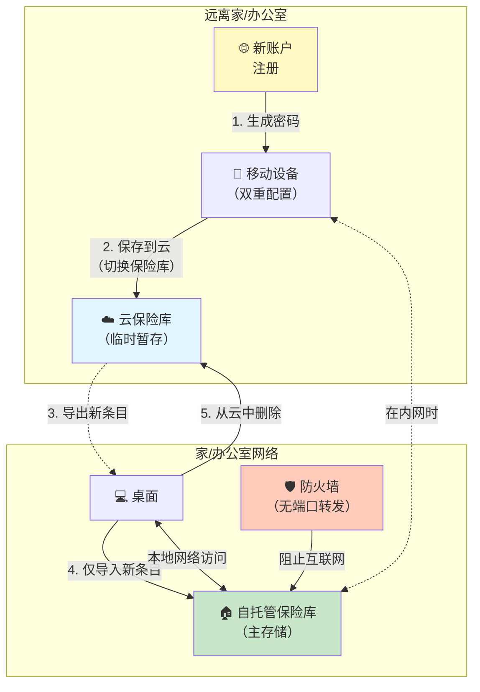

密码重用仍然是最危险的安全实践之一，但它持续存在，因为记住数百个账户的唯一密码是不可能的。现代凭据管理器通过为每个账户生成和存储强大、唯一的密码、通行密钥和TOTP代码来解决这个问题。在凭据管理器中，Bitwarden因其开源特性和自托管能力而脱颖而出，允许您完全控制身份验证凭据。

本文探讨了为什么凭据管理器是必不可少的、它们如何工作以及不同部署选项的考虑因素。我们将涵盖安全架构、部署策略以及从实际经验中得出的操作最佳实践。

## 密码问题

现代数字生活需要管理数百个账户，每个账户都需要身份验证。人类对这种复杂性的反应会产生可预测的安全失败。

### 为什么密码重用很危险

在多个网站上使用相同的密码会产生级联失败场景：

!!!error "🚫 密码重用风险"
    **单次泄露，多重妥协**
    - 一个被攻破的网站会暴露使用该密码的所有账户
    - 攻击者在热门服务上测试泄露的凭据
    - 银行、电子邮件和社交媒体账户像多米诺骨牌一样倒下
    - 无法知道哪些网站已被攻破
    
    **凭据填充攻击**
    - 自动化工具在数千个网站上测试泄露的凭据
    - 成功的登录被出售或利用
    - 攻击在泄露披露后几小时内发生
    - 规模使手动更改密码无效
    
    **Haveibeenpwned现实**
    - 泄露数据库中超过120亿个凭据
    - 您的密码可能已经被泄露
    - 问题不是"是否"而是"多少次"
    - 重用的密码会成倍增加损害

数学是残酷的：如果您在10个网站上重用密码，其中一个被泄露，攻击者现在可以访问所有10个账户。您最重要账户的安全性取决于您使用该密码的最弱网站的安全性。


### 为什么人类重用密码

密码重用不是懒惰——它是对不可能的认知需求的理性反应。人类工作记忆一次只能容纳4-7个项目，但普通人管理着100多个在线账户。人类大脑进化到记住面孔、位置和生存信息，而不是数百个随机字符串。面对这个不可能的任务，人们自然会优化最少的努力：他们重用密码，创建可预测的变体（Password1、Password2），或使用基于个人信息的弱模式。安全漏洞感觉遥远且不太可能——当密码被泄露时没有警告信号，"不会发生在我身上"的偏见强化了这种行为。密码重用完美地工作，直到它不工作，到那时，多个账户已经被攻破。

### 不可能的记忆挑战

当用户试图使密码易于记忆时，他们会陷入可预测的模式，现代破解工具可以在几秒钟内利用这些模式：带有网站特定后缀的基础密码（MyPassword123Facebook）、顺序变体（Password1、Password2、Password3）、键盘模式（qwerty123、asdf1234）或生日和姓名等个人信息。一些用户采用记忆技术，如北约音标字母替换（将"cat"转换为"Charlie-Alpha-Tango"）或单词到字符的映射来增加复杂性，但这些方法仍然需要大量的脑力劳动，并且无法扩展到少数账户之外。写下密码会产生物理安全风险，而将它们存储在电子表格或文本文件中会使它们未加密且易受攻击。即使是浏览器密码存储也缺乏适当的加密和可靠的跨设备同步。

安全要求和人类认知能力之间的这种根本冲突驱使用户采取不安全的做法。凭据管理器通过完全消除记忆负担来解决这种冲突，允许大脑专注于一个强大的主密码，而不是数百个。

## 凭据管理器如何工作

凭据管理器使用加密来安全地存储密码、通行密钥和TOTP代码，同时提供便捷的访问：

!!!anote "🔐 凭据管理器架构"
    **主密码**
    - 解锁保险库的单一密码
    - 您唯一需要记住的密码
    - 从不传输到服务器（在零知识系统中）
    - 用于派生加密密钥
    
    **加密保险库**
    - 密码、通行密钥和TOTP密钥使用从主密码派生的密钥加密
    - 本地和/或云端存储
    - 离开设备前加密
    - 服务器无法解密保险库内容
    
    **自动填充集成**
    - 浏览器扩展检测登录表单
    - 自动填充匹配网站的凭据
    - 为双因素身份验证生成TOTP代码
    - 支持通行密钥身份验证
    - 减少输入和网络钓鱼风险
    - 同步时跨设备工作

安全模型依赖于单个强大的主密码来保护所有凭据——密码、通行密钥和TOTP密钥。这将记忆负担从数百个密码减少到一个，使得在任何地方使用唯一、强大的密码成为可能，同时将所有身份验证方法整合在一个安全保险库中。

### 零知识架构

像Bitwarden这样的现代凭据管理器使用零知识架构：

!!!success "✅ 零知识安全"
    **服务器从不看到明文**
    - 加密在客户端设备上进行
    - 服务器仅存储加密数据
    - 服务器无法解密保险库内容
    - 即使服务器被攻破也不会暴露密码
    
    **密钥派生**
    - 主密码使用PBKDF2派生加密密钥
    - 密钥从不离开您的设备
    - 服务器从不接收主密码或加密密钥
    - 每次登录都从主密码重新派生密钥
    
    **无暴露同步**
    - 加密保险库跨设备同步
    - 每个设备使用主密码在本地解密
    - 服务器仅充当加密存储
    - 不需要信任服务器运营商

这种架构意味着即使服务提供商也无法访问您的密码、通行密钥或TOTP密钥。权衡是忘记主密码意味着永久数据丢失——没有可以恢复保险库的密码重置机制。


### 超越密码：通行密钥和TOTP

现代凭据管理器处理的不仅仅是密码：

!!!tip "🔑 多因素身份验证支持"
    **通行密钥（WebAuthn/FIDO2）**
    - 用于无密码身份验证的加密密钥对
    - 设计上抗网络钓鱼
    - 设备上的生物识别或PIN解锁
    - 同步的通行密钥跨设备工作
    - 身份验证的未来
    
    **TOTP（基于时间的一次性密码）**
    - 为双因素身份验证生成6位数代码
    - 替代单独的身份验证器应用
    - 代码自动复制或自动填充
    - 备份代码安全存储在保险库中
    - 将身份验证整合在一个地方
    
    **统一凭据存储**
    - 同一账户的密码+TOTP在一个条目中
    - 通行密钥与传统凭据一起存储
    - 所有身份验证方法的单一保险库
    - 减少应用切换和摩擦
    - 在提高可用性的同时保持安全性

在凭据管理器中存储TOTP代码存在争议——它将双因素身份验证减少为单因素（您拥有的东西：保险库）。然而，对于大多数用户来说，便利性通常超过这种担忧，保险库的加密提供了强大的保护。对于最高安全性账户，请考虑硬件安全密钥或单独的TOTP应用。

## 为什么选择Bitwarden（初学者友好部分）

在凭据管理器中，Bitwarden为所有用户提供了独特的优势：

!!!tip "🎯 Bitwarden优势"
    **开源**
    - 完整的源代码可供审计
    - 社区可以验证安全声明
    - 没有隐藏的后门或漏洞
    - 透明的开发过程
    
    **自托管选项**
    - 运行您自己的Bitwarden服务器
    - 完全控制数据
    - 不依赖第三方服务
    - 符合数据驻留要求
    
    **跨平台支持**
    - Windows、macOS、Linux桌面应用
    - iOS和Android移动应用
    - 所有主要浏览器的浏览器扩展
    - 用于自动化的命令行界面
    
    **免费和高级层级**
    - 个人核心功能免费
    - 高级功能：每年10美元（TOTP、通行密钥支持、文件附件）
    - 提供家庭计划
    - 自托管版本包含所有功能

开源和自托管能力的结合使Bitwarden成为注重安全的用户和具有严格数据控制要求的组织的理想选择。

### 生物识别集成

现代凭据管理器与平台生物识别集成，以实现便捷而安全的访问：

!!!success "✅ 生物识别身份验证优势"
    **平台集成**
    - Windows Hello：指纹、面部识别或PIN
    - Face ID：iOS/macOS上的安全面部识别
    - Touch ID：iOS/macOS上的指纹身份验证
    - Android生物识别API：指纹或面部解锁
    
    **安全模型**
    - 生物识别数据从不离开设备
    - 存储在安全硬件飞地中（TPM、安全飞地）
    - 解锁本地缓存的保险库加密密钥
    - 初始设置仍需要主密码
    - 生物识别提供便利，而不是主密码的替代品
    
    **可用性优势**
    - 无需输入主密码即可快速解锁保险库
    - 减少主密码暴露（更少的按键）
    - 防止肩窥
    - 跨设备的无缝体验
    - 鼓励使用更长、更强的主密码
    
    **最佳实践**
    - 设置强主密码后启用生物识别
    - 生物识别超时：长时间不活动后需要主密码
    - 在共享设备上禁用生物识别
    - 记住主密码以备后备
    - 生物识别用于便利，主密码用于安全

生物识别身份验证实现了理想的平衡：通过主密码加密的强大安全性，结合通过生物识别的便捷访问。这减少了摩擦，同时保持了零知识安全模型——生物识别解锁本地缓存的密钥，但服务器从不看到生物识别数据或主密码。


### 双因素身份验证的重要性

当我的主密码出现在凭据转储中时，双因素身份验证证明了它的价值：

!!!success "✅ 2FA保护故事"
    **事件**
    - 主密码被泄露（从旧账户重用）
    - 攻击者尝试登录Bitwarden
    - 2FA阻止了未经授权的访问
    - 收到登录尝试失败的通知
    
    **响应**
    - 立即更改主密码
    - 审查保险库中的所有条目是否被泄露
    - 轮换关键账户的密码
    - 调查主密码如何被泄露
    
    **教训**
    - 即使对于凭据管理器，2FA也是必不可少的
    - 主密码必须是唯一的
    - 登录通知提供早期警告
    - 纵深防御防止单点故障

即使是凭据管理器也需要双因素身份验证。主密码是单点故障，2FA提供了针对泄露的关键保护。

### 内置安全功能

现代凭据管理器包含改善安全态势的工具：

!!!success "🛡️ 安全审计功能"
    **密码健康报告**
    - 识别跨账户重用的密码
    - 检测弱密码（短、常见模式）
    - 标记来自泄露数据库的被泄露密码
    - 计算整体保险库安全分数
    
    **双因素身份验证检测**
    - 识别支持TOTP但您尚未启用的服务
    - 提示为支持的服务添加TOTP代码
    - 通过在任何可能的地方启用2FA来提高账户安全性
    - 跟踪哪些账户已启用2FA
    
    **泄露监控**
    - 与Have I Been Pwned数据库集成
    - 当您的凭据出现在泄露中时发出警报
    - 提示立即更改被泄露账户的密码
    - 主动安全而不是被动安全
    
    **密码生成器**
    - 生成强大、随机的密码（16-32+字符）
    - 可自定义：长度、字符类型、避免模糊字符
    - 用于可记忆但强大密码的密码短语生成器
    - 消除弱密码创建

这些功能将凭据管理器从被动存储转变为主动安全工具。定期安全审计识别凭据卫生中的弱点，而泄露监控提供泄露的早期警告。每月使用这些工具来保持强大的安全态势。

## 应该使用云、自托管还是混合？

现在您了解了凭据管理器的工作原理，确定哪种部署方法适合您的需求：

### 快速决策指南

!!!tip "🎯 选择您的路径"
    **使用云服务（推荐给90%的用户）**
    - ✅ 您想要零操作负担
    - ✅ 您信任零知识加密
    - ✅ 您需要从任何地方可靠的24/7访问
    - ✅ 您想要自动更新和备份
    - ✅ 您不是技术专家
    
    **自托管（适用于有特定需求的技术用户）**
    - ✅ 您具有技术专长（Docker、网络、安全）
    - ✅ 您需要数据驻留合规性
    - ✅ 您可以维护备份和更新
    - ✅ 您接受操作责任
    - ✅ 您拥有可靠的基础设施
    
    **混合方法（仅限高级用户）**
    - ✅ 您想要自托管安全而不暴露互联网
    - ✅ 您需要偶尔在网络外访问
    - ✅ 您可以管理双保险库工作流程
    - ✅ 您了解操作复杂性
    - ✅ 您对手动导出/导入感到满意

### 比较表

| 因素 | 云服务 | 自托管 | 混合 |
|--------|--------------|-------------|--------|
| **设置复杂性** | ⭐ 简单 | ⭐⭐⭐⭐ 复杂 | ⭐⭐⭐⭐⭐ 非常复杂 |
| **操作负担** | 无 | 高 | 非常高 |
| **互联网暴露** | 服务提供商 | 您的服务器 | 最小（自托管） |
| **可用性** | 99.9%+ SLA | 您的责任 | 取决于位置 |
| **数据控制** | 加密，提供商托管 | 完全控制 | 完全控制 |
| **成本** | 每年0-10美元 | 服务器成本+时间 | 服务器+订阅 |
| **更新** | 自动 | 手动 | 混合 |
| **备份** | 自动 | 您的责任 | 混合 |
| **恢复** | 提供商支持 | 您的责任 | 混合 |
| **随处访问** | ✅ 是 | ⚠️ 需要VPN | ✅ 是（通过云） |
| **最适合** | 大多数用户 | 技术专家 | 技术专家 |

---

**🛑 停止：初学者部分到此结束**

如果您决定使用云服务，您已经拥有所需的一切。以下部分涵盖仅适用于技术用户的高级自托管主题。

---


## 可能出什么问题：诚实的失败模式

在自托管之前，了解可能失败的情况和后果：

!!!error "⚠️ 常见的自托管失败"
    **忘记主密码**
    - 零知识意味着没有密码恢复
    - 丢失主密码=永久丢失所有凭据
    - 没有支持团队可以帮助您
    - 没有主密码，备份是无用的
    - **缓解措施**：将主密码写在安全的物理位置
    
    **没有备份的服务器故障**
    - 硬件故障、勒索软件或损坏
    - 立即失去对所有凭据的访问
    - 无法登录任何账户
    - 恢复需要工作备份
    - **缓解措施**：自动每日备份，每月测试
    
    **证书过期**
    - TLS证书过期，客户端拒绝连接
    - 在证书续订之前无法访问保险库
    - 需要手动干预
    - 可能在假期或紧急情况下发生
    - **缓解措施**：自动续订+过期监控
    
    **忘记更新**
    - 发现安全漏洞
    - 您的服务器仍然易受攻击
    - 潜在的保险库泄露
    - 没有像云服务那样的自动更新
    - **缓解措施**：订阅安全公告，每月更新
    
    **网络问题**
    - 互联网中断、路由器故障、ISP问题
    - 无法远程访问保险库
    - 旅行时没有密码而被困
    - 云服务具有冗余基础设施
    - **缓解措施**：混合方法或VPN备份
    
    **配置错误暴露**
    - 防火墙规则错误暴露服务器
    - 弱管理员密码
    - 具有已知漏洞的过时软件
    - 整个保险库可能被泄露
    - **缓解措施**：安全审计，最小暴露

**现实检查**：云服务拥有专家团队24/7处理这些问题。自托管意味着您就是那个团队。

## 自托管考虑因素（高级）

自托管Bitwarden提供最大控制，但引入了操作责任：

!!!anote "⚖️ 自托管权衡"
    **优势**
    - 完全的数据控制
    - 不依赖Bitwarden服务可用性
    - 符合数据驻留要求
    - 无订阅费用（但鼓励捐赠）
    - 免费包含高级功能（TOTP、文件附件、高级2FA）
    - 可以自定义和扩展功能
    
    **劣势**
    - 负责服务器安全和更新
    - 必须维护备份和灾难恢复
    - 需要技术专长
    - 如果服务器宕机，则为单点故障
    - 需要TLS证书管理

自托管的决定应基于您的风险偏好、威胁模型、技术能力和操作承诺。对于大多数用户，官方Bitwarden云服务提供了出色的安全性，操作负担为零。当您需要数据控制、有合规要求或拥有安全操作的技术技能时，自托管才有意义——但前提是您愿意接受上述操作风险和责任。

### 威胁模型分析

考虑自托管实际缓解了哪些威胁：

!!!warning "⚠️ 威胁模型现实"
    **自托管防护的内容**
    - 服务提供商泄露或关闭
    - 政府向服务提供商请求数据
    - 超出您控制的服务中断
    - 对云提供商安全的担忧
    - 数据驻留和合规要求
    
    **自托管不防护的内容**
    - 弱主密码
    - 被泄露的客户端设备
    - 网络钓鱼攻击
    - 键盘记录器和恶意软件
    - 物理设备盗窃
    
    **自托管带来的额外风险**
    - 服务器配置错误暴露数据
    - 未能应用安全更新
    - 备份不足导致数据丢失
    - TLS证书过期破坏访问
    - 没有冗余的单点故障
    - 互联网暴露增加攻击面

请记住，零知识架构意味着即使在云服务中，服务提供商也无法访问您的保险库。自托管主要解决可用性问题和数据驻留要求，而不是机密性威胁。


## 部署选项

Bitwarden提供两种自托管方法：

### 官方Bitwarden服务器

官方服务器是一个功能齐全但资源密集的选项：

!!!anote "🏢 官方Bitwarden服务器"
    **架构**
    - 多个Docker容器（MSSQL、Web保险库、API、身份）
    - 需要2GB+内存
    - 与云服务完全功能对等
    - 官方支持和文档
    
    **要求**
    - Docker和Docker Compose
    - 2GB+内存，10GB+存储
    - 带有TLS证书的域名
    - 端口80和443可访问
    
    **最适合**
    - 拥有多个用户的组织
    - 需要完整功能集的环境
    - 具有Docker专业知识的团队
    - 具有足够资源的服务器

官方服务器提供完整的Bitwarden体验，但对于本质上是个人凭据保险库的东西需要大量资源。

### Vaultwarden（非官方）

Vaultwarden（以前称为Bitwarden_RS）是一个轻量级替代方案：

!!!success "✅ Vaultwarden优势"
    **轻量级实现**
    - 单个Docker容器
    - 用Rust编写以提高效率
    - 在10MB内存上运行（相比官方的2GB+）
    - SQLite数据库（不需要MSSQL）
    
    **功能完整**
    - 实现Bitwarden API
    - 与所有官方客户端兼容
    - 免费包含高级功能
    - 活跃的开发和社区
    
    **部署选项**
    - 任何Linux服务器上的Docker
    - Home Assistant插件（简化安装）
    - Raspberry Pi或其他ARM设备
    - 支持Docker的NAS设备
    
    **理想用于**
    - 个人使用或小家庭
    - 资源受限的服务器（Raspberry Pi）
    - 家庭实验室环境
    - 想要高级功能而无需订阅的用户
    - 较低的风险偏好：Home Assistant插件提供更简单的管理

Vaultwarden是个人自托管的推荐选项。它提供与官方服务器相同的功能，但资源需求只是其一小部分。对于风险偏好较低或技术专长较少的用户，将Vaultwarden安装为Home Assistant插件可以简化部署和管理，同时仍保持自托管控制。

## 部署最佳实践

安全部署需要关注几个关键领域：

### 备份策略

您的凭据保险库是需要强大备份的关键数据：

!!!success "✅ 备份最佳实践"
    **要备份的内容**
    - Bitwarden数据库（SQLite文件或MSSQL转储）
    - 配置文件
    - TLS证书和密钥
    - 备份代码和恢复密钥
    
    **备份频率**
    - 最少自动每日备份
    - 在任何服务器维护或更新之前
    - 添加重要的新凭据后
    - 定期测试恢复
    
    **备份存储**
    - 加密备份（保险库已经加密，但纵深防御）
    - 异地存储（不同的物理位置）
    - 多个备份副本（3-2-1规则）
    - 单独安全地备份加密密钥
    
    **恢复测试**
    - 定期测试备份恢复
    - 记录恢复程序
    - 验证备份完整性
    - 练习灾难恢复场景
    
    **设备同步作为意外删除保护**
    - 同步的设备在本地缓存加密保险库
    - 意外删除的密码保留在未同步的设备上
    - **如何恢复**：打开移动应用，转到设置>同步，禁用"刷新时同步"
    - 移动设备现在具有带有已删除密码的旧保险库副本
    - 从移动设备的缓存保险库中检索已删除的条目
    - 通过桌面将密码重新添加到服务器保险库
    - 在移动设备上重新启用同步
    - 设备缓存充当无意的备份

3-2-1备份规则适用：3份数据副本，在2种不同的媒体类型上，其中1份副本在异地。您的凭据保险库太关键了，不能只信任单个备份。此外，同步的设备提供意外删除保护——如果您错误地删除了密码，它会保留在尚未同步的设备上，为您提供恢复窗口。


### 访问控制

限制谁和什么可以访问您的Bitwarden服务器：

!!!tip "🔒 访问控制措施"
    **网络安全**
    - 防火墙规则限制对端口80/443的访问
    - 考虑使用VPN进行额外的访问控制
    - Fail2ban阻止暴力破解尝试
    - 登录端点的速率限制
    
    **身份验证**
    - 强主密码（20+字符）
    - 双因素身份验证（TOTP、U2F或Duo）
    - 生物识别身份验证（Windows Hello、Face ID、Touch ID）
    - 管理面板的唯一密码
    - 共享账户的定期密码轮换
    
    **监控**
    - 记录所有登录尝试
    - 身份验证失败时发出警报
    - 监控异常访问模式
    - 定期审查日志

即使对于自托管部署，双因素身份验证也是必不可少的。它可以防止主密码泄露，并添加关键的第二层防御。

### 更新管理

必须及时应用安全更新：

!!!warning "⚠️ 更新责任"
    **需要更新的内容**
    - Bitwarden/Vaultwarden容器镜像
    - 主机操作系统
    - Docker和Docker Compose
    - TLS证书续订
    
    **更新频率**
    - 安全更新：发布后立即
    - 定期更新：每月维护窗口
    - 监控安全公告
    - 订阅项目公告
    
    **更新程序**
    - 更新前备份
    - 如果可能，在暂存环境中测试更新
    - 阅读发布说明以了解重大更改
    - 准备好回滚计划
    - 更新后验证功能

自动更新通知至关重要。订阅Bitwarden/Vaultwarden GitHub发布和安全邮件列表，以了解关键更新。

## 操作经验

运行自托管凭据管理器教会了关于操作安全的宝贵经验：

### 拯救一切的备份

我以艰难的方式学到了测试备份的重要性。在例行服务器更新期间，磁盘故障损坏了我的Bitwarden数据库。服务器无法启动，数据库文件无法读取。

!!!success "✅ 恢复成功"
    **做对的事情**
    - 自动每日备份到单独的存储
    - 每月测试备份以进行恢复
    - 恢复程序已记录并实践
    - 备份加密密钥安全存储
    
    **恢复过程**
    - 在几分钟内识别数据库损坏
    - 从异地存储中检索最新备份
    - 将数据库恢复到新服务器实例
    - 验证所有凭据可访问
    - 总停机时间：30分钟
    
    **学到的教训**
    - 测试备份不是可选的
    - 必须记录恢复程序
    - 定期测试在灾难发生前揭示差距
    - 异地备份防止硬件故障
    - 自动化防止备份疏忽

如果没有测试备份，我将失去对数百个账户的访问权限。每月花费30分钟测试恢复程序节省了数小时的账户恢复和潜在的永久数据丢失。

!!!tip "💡 设备同步恢复技巧"
    **意外删除恢复**
    - 意外从保险库中删除关键密码
    - 在所有设备同步之前意识到错误
    - 在手机上禁用同步（仍有旧保险库副本）
    - 从手机的缓存保险库中检索已删除的密码
    - 将密码重新添加到服务器保险库
    - 在手机上重新启用同步
    
    **为什么这有效**
    - 设备在本地缓存加密保险库
    - 同步定期发生，而不是立即发生
    - 未同步的设备保留旧保险库状态
    - 为错误提供短暂的恢复窗口
    - 不能替代适当的备份
    
    **逐步恢复**
    1. 意识到您错误地删除了密码
    2. **在移动设备上**：设置→同步→禁用"刷新时同步"
    3. 移动设备仍有带有已删除密码的旧保险库
    4. 在移动设备上查看已删除的密码，复制它
    5. **在桌面上**：将密码重新添加到保险库
    6. **在移动设备上**：重新启用同步以获取更新的保险库
    
    **最佳实践**
    - 保持至少一个不经常同步的设备（例如平板电脑）
    - 充当最近保险库状态的滚动备份
    - 用于从意外更改中恢复
    - 仍然保持适当的备份策略


## 迁移策略

迁移到凭据管理器需要规划：

!!!tip "🔄 迁移最佳实践"
    **阶段1：设置和测试**
    - 安装凭据管理器和浏览器扩展
    - 从浏览器导入现有密码
    - 在常用网站上测试自动填充
    - 验证跨设备同步
    
    **阶段2：关键账户**
    - 为银行、电子邮件生成强密码
    - 更新金融服务的密码
    - 为双因素身份验证添加TOTP代码
    - 在支持的地方启用通行密钥
    - 保护社交媒体账户
    - 记录恢复代码和备份方法
    - 运行安全审计以识别弱/重用的密码
    
    **阶段3：逐步推出**
    - 在使用网站时更新密码
    - 为新账户生成强密码
    - 逐步替换安全审计中识别的弱密码
    - 在凭据管理器建议可用时启用TOTP
    - 无需立即更新所有内容
    
    **阶段4：清理和维护**
    - 从浏览器存储中删除密码
    - 删除密码电子表格和文本文件
    - 单独安全地备份代码
    - 审查并删除未使用的账户
    - 运行每月安全审计
    - 监控泄露警报并及时响应

不要试图一次迁移所有内容。从关键账户开始，然后在使用网站时逐步更新密码并添加TOTP代码。这减少了压力，并允许您建立对凭据管理器的信心。

## 结论

凭据管理器是现代数字生活的必备安全工具。记住数百个账户的唯一、强大密码的不可能性驱使用户采取危险的做法，如密码重用。凭据管理器通过消除记忆负担来解决这种冲突，使得在任何地方使用强大、唯一的密码成为可能，同时将通行密钥和TOTP代码整合在一个安全保险库中。

Bitwarden因其开源特性和自托管能力而脱颖而出。零知识架构确保即使服务提供商也无法访问您的密码，提供强大的安全保证。自托管提供额外的控制和独立性，但引入了围绕安全更新、备份和可用性的操作责任。

自托管的决定应基于对威胁模型和技术能力的仔细考虑。对于大多数用户，官方Bitwarden云服务提供了出色的安全性，操作负担为零。当您需要数据控制、有合规要求或拥有安全操作的技术技能时，自托管才有意义。

Vaultwarden为个人使用提供了出色的自托管选项，以最小的资源需求提供完整的Bitwarden功能集。部署需要关注TLS证书管理、备份策略、访问控制和更新管理。操作经验强调了测试备份、证书监控和双因素身份验证的重要性。

迁移到凭据管理器应该是渐进的，从关键账户开始，随着时间的推移而扩展。设置和迁移的投资通过改善安全性和减少认知负担而获得回报。您的密码、通行密钥和TOTP代码太重要了，不能信任记忆或不安全的存储方法。

无论您选择云托管还是自托管Bitwarden，关键步骤是采用凭据管理器。唯一、强大的密码、抗网络钓鱼的通行密钥和整合的TOTP代码的安全优势远远超过学习曲线和操作考虑。今天就开始——当下一次重大泄露宣布时，您的未来自己会感谢您，您的账户仍然安全。

---

## 高级：混合方法（仅限专家用户）

**⚠️ 警告**：本节描述了专家用户的高级配置。大多数用户应使用云服务或纯自托管。

### 问题：没有互联网暴露的自托管

暴露在互联网上的自托管服务器面临持续的攻击尝试。但是将服务器保持在内部会产生一个问题：当您离开网络时，无法使用密码创建新账户。

### 混合解决方案

使用**云服务和自托管服务器**配置您的凭据管理器：

!!!tip "🔐 混合架构"
    **双保险库配置**
    - 移动设备配置了SaaS和自托管保险库
    - 自托管：主保险库，仅限内部网络
    - 云SaaS：用于远程访问的临时保险库
    - 在移动应用设置中切换保险库
    
    **在内网外时**
    - 移动设备无法访问自托管服务器
    - 在应用中切换到云保险库
    - 创建新账户，生成密码
    - 暂时保存到云保险库
    
    **回到内网时**
    - 仅从云保险库导出新条目
    - 将新条目导入自托管保险库
    - 从云中删除已迁移的条目
    - 云保险库保持大部分为空
    
    **关键见解：选择性迁移**
    - 仅导出/导入在外出时创建的新凭据
    - 不是每周整个保险库（那会很复杂）
    - 最小的操作开销
    - 自托管保持主要，云是暂存




### 工作流程详细信息

!!!success "✅ 混合工作流程"
    **设置阶段**
    1. 在内部网络上部署自托管服务器（无互联网暴露）
    2. 创建云服务账户（免费层级足够）
    3. 使用两个保险库配置移动应用
    4. 在内网时将自托管设置为默认
    
    **旅行时（内网外）**
    1. 移动应用无法访问自托管服务器
    2. 在应用设置中切换到云保险库
    3. 在网站上创建新账户
    4. 在云保险库中生成强密码
    5. 将凭据保存到云保险库
    6. 继续使用记忆/缓存保险库中的现有密码
    
    **回到内网**
    1. 在桌面上打开云保险库
    2. 识别旅行时创建的新条目（通常1-5个条目）
    3. 仅导出这些新条目
    4. 导入到自托管保险库
    5. 从云保险库中删除已迁移的条目
    6. 将移动应用切换回自托管保险库
    
    **操作现实**
    - 仅在您在外出时创建新账户时才进行迁移
    - 大多数周：无需迁移
    - 偶尔旅行：1-5个条目要迁移
    - 不复杂，因为数量很少
    - 云保险库保持大部分为空

### 为什么这在操作上并不复杂

**常见误解**："每周导出/导入整个保险库工作量太大"

**现实**：您只迁移在网络外创建的新凭据：

- **典型场景**：旅行3天，创建2个新账户
- **迁移工作**：导出2个条目，导入到自托管，从云中删除（5分钟）
- **频率**：仅在您旅行并创建新账户时
- **大多数周**：无需迁移

!!!anote "💡 关键优势"
    **安全优势**
    - 自托管服务器从不暴露在互联网上
    - 来自公共网络的零攻击面
    - 云中的最少数据（仅最近添加）
    - 主保险库保持受保护
    
    **可用性优势**
    - 可以随时随地创建账户
    - 创建新账户不需要VPN
    - 现有密码可通过缓存保险库访问
    - 解决"被困无法访问"的问题
    
    **操作现实**
    - 仅在需要时迁移（不是每周）
    - 要迁移的条目数量少
    - 每次迁移5-10分钟
    - 安全收益的可接受开销

### 配置示例

**移动应用配置**：

```
Bitwarden移动应用设置：

✅ 保险库1：自托管（主要）
   服务器URL：https://192.168.1.100
   使用时机：在家/办公室网络上
   包含：所有凭据

✅ 保险库2：云（临时）
   服务器URL：https://vault.bitwarden.com
   使用时机：旅行，网络外
   包含：仅在外出时创建的新凭据

切换保险库：设置→账户→切换账户
```

### 何时混合有意义

!!!warning "⚠️ 混合不适合所有人"
    **适合**
    - ✅ 您是对双重配置感到满意的技术专家
    - ✅ 您想要没有互联网暴露的自托管
    - ✅ 您偶尔旅行并需要远程访问
    - ✅ 您可以记住迁移新条目
    - ✅ 您了解安全权衡
    
    **不适合**
    - ❌ 您想要简单、零维护的解决方案
    - ❌ 您经常旅行（只需使用云）
    - ❌ 您对手动流程不满意
    - ❌ 您想要一切自动化
    - ❌ 您是凭据管理器的新手

**底线**：混合方法解决了一个特定问题（没有互联网暴露的自托管，同时保持远程访问），操作开销可接受。它不适合所有人，但对于合适的用户，它提供了两全其美的方案。
