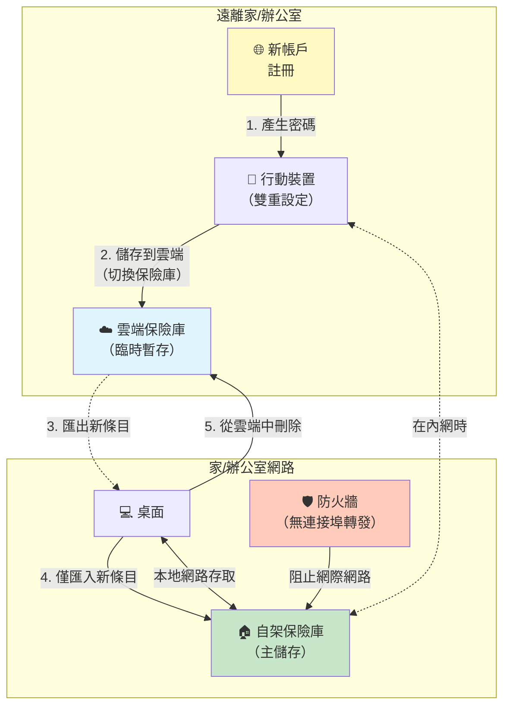

密碼重用仍然是最危險的安全實踐之一，但它持續存在，因為記住數百個帳戶的唯一密碼是不可能的。現代憑證管理器透過為每個帳戶產生和儲存強大、唯一的密碼、通行金鑰和TOTP代碼來解決這個問題。在憑證管理器中，Bitwarden因其開源特性和自架能力而脫穎而出，允許您完全控制身份驗證憑證。

本文探討了為什麼憑證管理器是必不可少的、它們如何運作以及不同部署選項的考量因素。我們將涵蓋安全架構、部署策略以及從實際經驗中得出的操作最佳實踐。

## 密碼問題

現代數位生活需要管理數百個帳戶，每個帳戶都需要身份驗證。人類對這種複雜性的反應會產生可預測的安全失敗。

### 為什麼密碼重用很危險

在多個網站上使用相同的密碼會產生級聯失敗場景：

!!!error "🚫 密碼重用風險"
    **單次洩露，多重妥協**
    - 一個被攻破的網站會暴露使用該密碼的所有帳戶
    - 攻擊者在熱門服務上測試洩露的憑證
    - 銀行、電子郵件和社群媒體帳戶像骨牌一樣倒下
    - 無法知道哪些網站已被攻破
    
    **憑證填充攻擊**
    - 自動化工具在數千個網站上測試洩露的憑證
    - 成功的登入被出售或利用
    - 攻擊在洩露披露後幾小時內發生
    - 規模使手動變更密碼無效
    
    **Haveibeenpwned現實**
    - 洩露資料庫中超過120億個憑證
    - 您的密碼可能已經被洩露
    - 問題不是「是否」而是「多少次」
    - 重用的密碼會成倍增加損害

數學是殘酷的：如果您在10個網站上重用密碼，其中一個被洩露，攻擊者現在可以存取所有10個帳戶。您最重要帳戶的安全性取決於您使用該密碼的最弱網站的安全性。

### 為什麼人類重用密碼

密碼重用不是懶惰——它是對不可能的認知需求的理性反應。人類工作記憶一次只能容納4-7個項目，但普通人管理著100多個線上帳戶。人類大腦進化到記住面孔、位置和生存資訊，而不是數百個隨機字元字串。面對這個不可能的任務，人們自然會優化最少的努力：他們重用密碼，建立可預測的變體（Password1、Password2），或使用基於個人資訊的弱模式。安全漏洞感覺遙遠且不太可能——當密碼被洩露時沒有警告訊號，「不會發生在我身上」的偏見強化了這種行為。密碼重用完美地運作，直到它不運作，到那時，多個帳戶已經被攻破。

### 不可能的記憶挑戰

當使用者試圖使密碼易於記憶時，他們會陷入可預測的模式，現代破解工具可以在幾秒鐘內利用這些模式：帶有網站特定後綴的基礎密碼（MyPassword123Facebook）、順序變體（Password1、Password2、Password3）、鍵盤模式（qwerty123、asdf1234）或生日和姓名等個人資訊。一些使用者採用記憶技術，如北約音標字母替換（將「cat」轉換為「Charlie-Alpha-Tango」）或單字到字元的映射來增加複雜性，但這些方法仍然需要大量的腦力勞動，並且無法擴展到少數帳戶之外。寫下密碼會產生實體安全風險，而將它們儲存在試算表或文字檔案中會使它們未加密且易受攻擊。即使是瀏覽器密碼儲存也缺乏適當的加密和可靠的跨裝置同步。

安全要求和人類認知能力之間的這種根本衝突驅使使用者採取不安全的做法。憑證管理器透過完全消除記憶負擔來解決這種衝突，允許大腦專注於一個強大的主密碼，而不是數百個。


## 憑證管理器如何運作

憑證管理器使用加密來安全地儲存密碼、通行金鑰和TOTP代碼，同時提供便捷的存取：

!!!anote "🔐 憑證管理器架構"
    **主密碼**
    - 解鎖保險庫的單一密碼
    - 您唯一需要記住的密碼
    - 從不傳輸到伺服器（在零知識系統中）
    - 用於衍生加密金鑰
    
    **加密保險庫**
    - 密碼、通行金鑰和TOTP金鑰使用從主密碼衍生的金鑰加密
    - 本地和/或雲端儲存
    - 離開裝置前加密
    - 伺服器無法解密保險庫內容
    
    **自動填入整合**
    - 瀏覽器擴充功能偵測登入表單
    - 自動填入符合網站的憑證
    - 為雙因素身份驗證產生TOTP代碼
    - 支援通行金鑰身份驗證
    - 減少輸入和網路釣魚風險
    - 同步時跨裝置運作

安全模型依賴於單個強大的主密碼來保護所有憑證——密碼、通行金鑰和TOTP金鑰。這將記憶負擔從數百個密碼減少到一個，使得在任何地方使用唯一、強大的密碼成為可能，同時將所有身份驗證方法整合在一個安全保險庫中。

### 零知識架構

像Bitwarden這樣的現代憑證管理器使用零知識架構：

!!!success "✅ 零知識安全"
    **伺服器從不看到明文**
    - 加密在客戶端裝置上進行
    - 伺服器僅儲存加密資料
    - 伺服器無法解密保險庫內容
    - 即使伺服器被攻破也不會暴露密碼
    
    **金鑰衍生**
    - 主密碼使用PBKDF2衍生加密金鑰
    - 金鑰從不離開您的裝置
    - 伺服器從不接收主密碼或加密金鑰
    - 每次登入都從主密碼重新衍生金鑰
    
    **無暴露同步**
    - 加密保險庫跨裝置同步
    - 每個裝置使用主密碼在本地解密
    - 伺服器僅充當加密儲存
    - 不需要信任伺服器營運商

這種架構意味著即使服務提供商也無法存取您的密碼、通行金鑰或TOTP金鑰。權衡是忘記主密碼意味著永久資料遺失——沒有可以恢復保險庫的密碼重設機制。

### 超越密碼：通行金鑰和TOTP

現代憑證管理器處理的不僅僅是密碼：

!!!tip "🔑 多因素身份驗證支援"
    **通行金鑰（WebAuthn/FIDO2）**
    - 用於無密碼身份驗證的加密金鑰對
    - 設計上抗網路釣魚
    - 裝置上的生物辨識或PIN解鎖
    - 同步的通行金鑰跨裝置運作
    - 身份驗證的未來
    
    **TOTP（基於時間的一次性密碼）**
    - 為雙因素身份驗證產生6位數代碼
    - 替代單獨的身份驗證器應用程式
    - 代碼自動複製或自動填入
    - 備份代碼安全儲存在保險庫中
    - 將身份驗證整合在一個地方
    
    **統一憑證儲存**
    - 同一帳戶的密碼+TOTP在一個條目中
    - 通行金鑰與傳統憑證一起儲存
    - 所有身份驗證方法的單一保險庫
    - 減少應用程式切換和摩擦
    - 在提高可用性的同時保持安全性

在憑證管理器中儲存TOTP代碼存在爭議——它將雙因素身份驗證減少為單因素（您擁有的東西：保險庫）。然而，對於大多數使用者來說，便利性通常超過這種擔憂，保險庫的加密提供了強大的保護。對於最高安全性帳戶，請考慮硬體安全金鑰或單獨的TOTP應用程式。

## 為什麼選擇Bitwarden（初學者友善部分）

在憑證管理器中，Bitwarden為所有使用者提供了獨特的優勢：

!!!tip "🎯 Bitwarden優勢"
    **開源**
    - 完整的原始碼可供稽核
    - 社群可以驗證安全聲明
    - 沒有隱藏的後門或漏洞
    - 透明的開發過程
    
    **自架選項**
    - 執行您自己的Bitwarden伺服器
    - 完全控制資料
    - 不依賴第三方服務
    - 符合資料駐留要求
    
    **跨平台支援**
    - Windows、macOS、Linux桌面應用程式
    - iOS和Android行動應用程式
    - 所有主要瀏覽器的瀏覽器擴充功能
    - 用於自動化的命令列介面
    
    **免費和進階層級**
    - 個人核心功能免費
    - 進階功能：每年10美元（TOTP、通行金鑰支援、檔案附件）
    - 提供家庭方案
    - 自架版本包含所有功能

開源和自架能力的結合使Bitwarden成為注重安全的使用者和具有嚴格資料控制要求的組織的理想選擇。


### 生物辨識整合

現代憑證管理器與平台生物辨識整合，以實現便捷而安全的存取：

!!!success "✅ 生物辨識身份驗證優勢"
    **平台整合**
    - Windows Hello：指紋、臉部辨識或PIN
    - Face ID：iOS/macOS上的安全臉部辨識
    - Touch ID：iOS/macOS上的指紋身份驗證
    - Android生物辨識API：指紋或臉部解鎖
    
    **安全模型**
    - 生物辨識資料從不離開裝置
    - 儲存在安全硬體飛地中（TPM、安全飛地）
    - 解鎖本地快取的保險庫加密金鑰
    - 初始設定仍需要主密碼
    - 生物辨識提供便利，而不是主密碼的替代品
    
    **可用性優勢**
    - 無需輸入主密碼即可快速解鎖保險庫
    - 減少主密碼暴露（更少的按鍵）
    - 防止肩窺
    - 跨裝置的無縫體驗
    - 鼓勵使用更長、更強的主密碼
    
    **最佳實踐**
    - 設定強主密碼後啟用生物辨識
    - 生物辨識逾時：長時間不活動後需要主密碼
    - 在共用裝置上停用生物辨識
    - 記住主密碼以備後備
    - 生物辨識用於便利，主密碼用於安全

生物辨識身份驗證實現了理想的平衡：透過主密碼加密的強大安全性，結合透過生物辨識的便捷存取。這減少了摩擦，同時保持了零知識安全模型——生物辨識解鎖本地快取的金鑰，但伺服器從不看到生物辨識資料或主密碼。

### 雙因素身份驗證的重要性

當我的主密碼出現在憑證轉儲中時，雙因素身份驗證證明了它的價值：

!!!success "✅ 2FA保護故事"
    **事件**
    - 主密碼被洩露（從舊帳戶重用）
    - 攻擊者嘗試登入Bitwarden
    - 2FA阻止了未經授權的存取
    - 收到登入嘗試失敗的通知
    
    **回應**
    - 立即變更主密碼
    - 審查保險庫中的所有條目是否被洩露
    - 輪換關鍵帳戶的密碼
    - 調查主密碼如何被洩露
    
    **教訓**
    - 即使對於憑證管理器，2FA也是必不可少的
    - 主密碼必須是唯一的
    - 登入通知提供早期警告
    - 縱深防禦防止單點故障

即使是憑證管理器也需要雙因素身份驗證。主密碼是單點故障，2FA提供了針對洩露的關鍵保護。

### 內建安全功能

現代憑證管理器包含改善安全態勢的工具：

!!!success "🛡️ 安全稽核功能"
    **密碼健康報告**
    - 識別跨帳戶重用的密碼
    - 偵測弱密碼（短、常見模式）
    - 標記來自洩露資料庫的被洩露密碼
    - 計算整體保險庫安全分數
    
    **雙因素身份驗證偵測**
    - 識別支援TOTP但您尚未啟用的服務
    - 提示為支援的服務新增TOTP代碼
    - 透過在任何可能的地方啟用2FA來提高帳戶安全性
    - 追蹤哪些帳戶已啟用2FA
    
    **洩露監控**
    - 與Have I Been Pwned資料庫整合
    - 當您的憑證出現在洩露中時發出警報
    - 提示立即變更被洩露帳戶的密碼
    - 主動安全而不是被動安全
    
    **密碼產生器**
    - 產生強大、隨機的密碼（16-32+字元）
    - 可自訂：長度、字元類型、避免模糊字元
    - 用於可記憶但強大密碼的密碼片語產生器
    - 消除弱密碼建立

這些功能將憑證管理器從被動儲存轉變為主動安全工具。定期安全稽核識別憑證衛生中的弱點，而洩露監控提供洩露的早期警告。每月使用這些工具來保持強大的安全態勢。

## 應該使用雲端、自架還是混合？

現在您了解了憑證管理器的運作原理，確定哪種部署方法適合您的需求：

### 快速決策指南

!!!tip "🎯 選擇您的路徑"
    **使用雲端服務（推薦給90%的使用者）**
    - ✅ 您想要零操作負擔
    - ✅ 您信任零知識加密
    - ✅ 您需要從任何地方可靠的24/7存取
    - ✅ 您想要自動更新和備份
    - ✅ 您不是技術專家
    
    **自架（適用於有特定需求的技術使用者）**
    - ✅ 您具有技術專長（Docker、網路、安全）
    - ✅ 您需要資料駐留合規性
    - ✅ 您可以維護備份和更新
    - ✅ 您接受操作責任
    - ✅ 您擁有可靠的基礎設施
    
    **混合方法（僅限進階使用者）**
    - ✅ 您想要自架安全而不暴露網際網路
    - ✅ 您需要偶爾在網路外存取
    - ✅ 您可以管理雙保險庫工作流程
    - ✅ 您了解操作複雜性
    - ✅ 您對手動匯出/匯入感到滿意

### 比較表

| 因素 | 雲端服務 | 自架 | 混合 |
|--------|--------------|-------------|--------|
| **設定複雜性** | ⭐ 簡單 | ⭐⭐⭐⭐ 複雜 | ⭐⭐⭐⭐⭐ 非常複雜 |
| **操作負擔** | 無 | 高 | 非常高 |
| **網際網路暴露** | 服務提供商 | 您的伺服器 | 最小（自架） |
| **可用性** | 99.9%+ SLA | 您的責任 | 取決於位置 |
| **資料控制** | 加密，提供商託管 | 完全控制 | 完全控制 |
| **成本** | 每年0-10美元 | 伺服器成本+時間 | 伺服器+訂閱 |
| **更新** | 自動 | 手動 | 混合 |
| **備份** | 自動 | 您的責任 | 混合 |
| **恢復** | 提供商支援 | 您的責任 | 混合 |
| **隨處存取** | ✅ 是 | ⚠️ 需要VPN | ✅ 是（透過雲端） |
| **最適合** | 大多數使用者 | 技術專家 | 技術專家 |

---

**🛑 停止：初學者部分到此結束**

如果您決定使用雲端服務，您已經擁有所需的一切。以下部分涵蓋僅適用於技術使用者的進階自架主題。

---


## 可能出什麼問題：誠實的失敗模式

在自架之前，了解可能失敗的情況和後果：

!!!error "⚠️ 常見的自架失敗"
    **忘記主密碼**
    - 零知識意味著沒有密碼恢復
    - 遺失主密碼=永久遺失所有憑證
    - 沒有支援團隊可以幫助您
    - 沒有主密碼，備份是無用的
    - **緩解措施**：將主密碼寫在安全的實體位置
    
    **沒有備份的伺服器故障**
    - 硬體故障、勒索軟體或損毀
    - 立即失去對所有憑證的存取
    - 無法登入任何帳戶
    - 恢復需要工作備份
    - **緩解措施**：自動每日備份，每月測試
    
    **憑證過期**
    - TLS憑證過期，客戶端拒絕連線
    - 在憑證續訂之前無法存取保險庫
    - 需要手動干預
    - 可能在假期或緊急情況下發生
    - **緩解措施**：自動續訂+過期監控
    
    **忘記更新**
    - 發現安全漏洞
    - 您的伺服器仍然易受攻擊
    - 潛在的保險庫洩露
    - 沒有像雲端服務那樣的自動更新
    - **緩解措施**：訂閱安全公告，每月更新
    
    **網路問題**
    - 網際網路中斷、路由器故障、ISP問題
    - 無法遠端存取保險庫
    - 旅行時沒有密碼而被困
    - 雲端服務具有冗餘基礎設施
    - **緩解措施**：混合方法或VPN備份
    
    **設定錯誤暴露**
    - 防火牆規則錯誤暴露伺服器
    - 弱管理員密碼
    - 具有已知漏洞的過時軟體
    - 整個保險庫可能被洩露
    - **緩解措施**：安全稽核，最小暴露

**現實檢查**：雲端服務擁有專家團隊24/7處理這些問題。自架意味著您就是那個團隊。

## 自架考量因素（進階）

自架Bitwarden提供最大控制，但引入了操作責任：

!!!anote "⚖️ 自架權衡"
    **優勢**
    - 完全的資料控制
    - 不依賴Bitwarden服務可用性
    - 符合資料駐留要求
    - 無訂閱費用（但鼓勵捐贈）
    - 免費包含進階功能（TOTP、檔案附件、進階2FA）
    - 可以自訂和擴充功能
    
    **劣勢**
    - 負責伺服器安全和更新
    - 必須維護備份和災難恢復
    - 需要技術專長
    - 如果伺服器當機，則為單點故障
    - 需要TLS憑證管理

自架的決定應基於您的風險偏好、威脅模型、技術能力和操作承諾。對於大多數使用者，官方Bitwarden雲端服務提供了出色的安全性，操作負擔為零。當您需要資料控制、有合規要求或擁有安全操作的技術技能時，自架才有意義——但前提是您願意接受上述操作風險和責任。

### 威脅模型分析

考慮自架實際緩解了哪些威脅：

!!!warning "⚠️ 威脅模型現實"
    **自架防護的內容**
    - 服務提供商洩露或關閉
    - 政府向服務提供商請求資料
    - 超出您控制的服務中斷
    - 對雲端提供商安全的擔憂
    - 資料駐留和合規要求
    
    **自架不防護的內容**
    - 弱主密碼
    - 被洩露的客戶端裝置
    - 網路釣魚攻擊
    - 鍵盤記錄器和惡意軟體
    - 實體裝置竊盜
    
    **自架帶來的額外風險**
    - 伺服器設定錯誤暴露資料
    - 未能套用安全更新
    - 備份不足導致資料遺失
    - TLS憑證過期破壞存取
    - 沒有冗餘的單點故障
    - 網際網路暴露增加攻擊面

請記住，零知識架構意味著即使在雲端服務中，服務提供商也無法存取您的保險庫。自架主要解決可用性問題和資料駐留要求，而不是機密性威脅。

## 部署選項

Bitwarden提供兩種自架方法：

### 官方Bitwarden伺服器

官方伺服器是一個功能齊全但資源密集的選項：

!!!anote "🏢 官方Bitwarden伺服器"
    **架構**
    - 多個Docker容器（MSSQL、Web保險庫、API、身份）
    - 需要2GB+記憶體
    - 與雲端服務完全功能對等
    - 官方支援和文件
    
    **要求**
    - Docker和Docker Compose
    - 2GB+記憶體，10GB+儲存
    - 帶有TLS憑證的網域名稱
    - 連接埠80和443可存取
    
    **最適合**
    - 擁有多個使用者的組織
    - 需要完整功能集的環境
    - 具有Docker專業知識的團隊
    - 具有足夠資源的伺服器

官方伺服器提供完整的Bitwarden體驗，但對於本質上是個人憑證保險庫的東西需要大量資源。

### Vaultwarden（非官方）

Vaultwarden（以前稱為Bitwarden_RS）是一個輕量級替代方案：

!!!success "✅ Vaultwarden優勢"
    **輕量級實作**
    - 單個Docker容器
    - 用Rust編寫以提高效率
    - 在10MB記憶體上執行（相比官方的2GB+）
    - SQLite資料庫（不需要MSSQL）
    
    **功能完整**
    - 實作Bitwarden API
    - 與所有官方客戶端相容
    - 免費包含進階功能
    - 活躍的開發和社群
    
    **部署選項**
    - 任何Linux伺服器上的Docker
    - Home Assistant附加元件（簡化安裝）
    - Raspberry Pi或其他ARM裝置
    - 支援Docker的NAS裝置
    
    **理想用於**
    - 個人使用或小家庭
    - 資源受限的伺服器（Raspberry Pi）
    - 家庭實驗室環境
    - 想要進階功能而無需訂閱的使用者
    - 較低的風險偏好：Home Assistant附加元件提供更簡單的管理

Vaultwarden是個人自架的推薦選項。它提供與官方伺服器相同的功能，但資源需求只是其一小部分。對於風險偏好較低或技術專長較少的使用者，將Vaultwarden安裝為Home Assistant附加元件可以簡化部署和管理，同時仍保持自架控制。


## 部署最佳實踐

安全部署需要關注幾個關鍵領域：

### 備份策略

您的憑證保險庫是需要強大備份的關鍵資料：

!!!success "✅ 備份最佳實踐"
    **要備份的內容**
    - Bitwarden資料庫（SQLite檔案或MSSQL轉儲）
    - 設定檔
    - TLS憑證和金鑰
    - 備份代碼和恢復金鑰
    
    **備份頻率**
    - 最少自動每日備份
    - 在任何伺服器維護或更新之前
    - 新增重要的新憑證後
    - 定期測試恢復
    
    **備份儲存**
    - 加密備份（保險庫已經加密，但縱深防禦）
    - 異地儲存（不同的實體位置）
    - 多個備份副本（3-2-1規則）
    - 單獨安全地備份加密金鑰
    
    **恢復測試**
    - 定期測試備份恢復
    - 記錄恢復程序
    - 驗證備份完整性
    - 練習災難恢復場景
    
    **裝置同步作為意外刪除保護**
    - 同步的裝置在本地快取加密保險庫
    - 意外刪除的密碼保留在未同步的裝置上
    - **如何恢復**：開啟行動應用程式，前往設定>同步，停用「重新整理時同步」
    - 行動裝置現在具有帶有已刪除密碼的舊保險庫副本
    - 從行動裝置的快取保險庫中擷取已刪除的條目
    - 透過桌面將密碼重新新增到伺服器保險庫
    - 在行動裝置上重新啟用同步
    - 裝置快取充當無意的備份

3-2-1備份規則適用：3份資料副本，在2種不同的媒體類型上，其中1份副本在異地。您的憑證保險庫太關鍵了，不能只信任單個備份。此外，同步的裝置提供意外刪除保護——如果您錯誤地刪除了密碼，它會保留在尚未同步的裝置上，為您提供恢復視窗。

### 存取控制

限制誰和什麼可以存取您的Bitwarden伺服器：

!!!tip "🔒 存取控制措施"
    **網路安全**
    - 防火牆規則限制對連接埠80/443的存取
    - 考慮使用VPN進行額外的存取控制
    - Fail2ban阻止暴力破解嘗試
    - 登入端點的速率限制
    
    **身份驗證**
    - 強主密碼（20+字元）
    - 雙因素身份驗證（TOTP、U2F或Duo）
    - 生物辨識身份驗證（Windows Hello、Face ID、Touch ID）
    - 管理面板的唯一密碼
    - 共用帳戶的定期密碼輪換
    
    **監控**
    - 記錄所有登入嘗試
    - 身份驗證失敗時發出警報
    - 監控異常存取模式
    - 定期審查日誌

即使對於自架部署，雙因素身份驗證也是必不可少的。它可以防止主密碼洩露，並新增關鍵的第二層防禦。

### 更新管理

必須及時套用安全更新：

!!!warning "⚠️ 更新責任"
    **需要更新的內容**
    - Bitwarden/Vaultwarden容器映像
    - 主機作業系統
    - Docker和Docker Compose
    - TLS憑證續訂
    
    **更新頻率**
    - 安全更新：發布後立即
    - 定期更新：每月維護視窗
    - 監控安全公告
    - 訂閱專案公告
    
    **更新程序**
    - 更新前備份
    - 如果可能，在暫存環境中測試更新
    - 閱讀發布說明以了解重大變更
    - 準備好回滾計畫
    - 更新後驗證功能

自動更新通知至關重要。訂閱Bitwarden/Vaultwarden GitHub發布和安全郵件清單，以了解關鍵更新。

## 操作經驗

執行自架憑證管理器教會了關於操作安全的寶貴經驗：

### 拯救一切的備份

我以艱難的方式學到了測試備份的重要性。在例行伺服器更新期間，磁碟故障損毀了我的Bitwarden資料庫。伺服器無法啟動，資料庫檔案無法讀取。

!!!success "✅ 恢復成功"
    **做對的事情**
    - 自動每日備份到單獨的儲存
    - 每月測試備份以進行恢復
    - 恢復程序已記錄並實踐
    - 備份加密金鑰安全儲存
    
    **恢復過程**
    - 在幾分鐘內識別資料庫損毀
    - 從異地儲存中擷取最新備份
    - 將資料庫恢復到新伺服器執行個體
    - 驗證所有憑證可存取
    - 總停機時間：30分鐘
    
    **學到的教訓**
    - 測試備份不是可選的
    - 必須記錄恢復程序
    - 定期測試在災難發生前揭示差距
    - 異地備份防止硬體故障
    - 自動化防止備份疏忽

如果沒有測試備份，我將失去對數百個帳戶的存取權限。每月花費30分鐘測試恢復程序節省了數小時的帳戶恢復和潛在的永久資料遺失。

!!!tip "💡 裝置同步恢復技巧"
    **意外刪除恢復**
    - 意外從保險庫中刪除關鍵密碼
    - 在所有裝置同步之前意識到錯誤
    - 在手機上停用同步（仍有舊保險庫副本）
    - 從手機的快取保險庫中擷取已刪除的密碼
    - 將密碼重新新增到伺服器保險庫
    - 在手機上重新啟用同步
    
    **為什麼這有效**
    - 裝置在本地快取加密保險庫
    - 同步定期發生，而不是立即發生
    - 未同步的裝置保留舊保險庫狀態
    - 為錯誤提供短暫的恢復視窗
    - 不能替代適當的備份
    
    **逐步恢復**
    1. 意識到您錯誤地刪除了密碼
    2. **在行動裝置上**：設定→同步→停用「重新整理時同步」
    3. 行動裝置仍有帶有已刪除密碼的舊保險庫
    4. 在行動裝置上檢視已刪除的密碼，複製它
    5. **在桌面上**：將密碼重新新增到保險庫
    6. **在行動裝置上**：重新啟用同步以取得更新的保險庫
    
    **最佳實踐**
    - 保持至少一個不經常同步的裝置（例如平板電腦）
    - 充當最近保險庫狀態的滾動備份
    - 用於從意外變更中恢復
    - 仍然保持適當的備份策略


## 遷移策略

遷移到憑證管理器需要規劃：

!!!tip "🔄 遷移最佳實踐"
    **階段1：設定和測試**
    - 安裝憑證管理器和瀏覽器擴充功能
    - 從瀏覽器匯入現有密碼
    - 在常用網站上測試自動填入
    - 驗證跨裝置同步
    
    **階段2：關鍵帳戶**
    - 為銀行、電子郵件產生強密碼
    - 更新金融服務的密碼
    - 為雙因素身份驗證新增TOTP代碼
    - 在支援的地方啟用通行金鑰
    - 保護社群媒體帳戶
    - 記錄恢復代碼和備份方法
    - 執行安全稽核以識別弱/重用的密碼
    
    **階段3：逐步推出**
    - 在使用網站時更新密碼
    - 為新帳戶產生強密碼
    - 逐步替換安全稽核中識別的弱密碼
    - 在憑證管理器建議可用時啟用TOTP
    - 無需立即更新所有內容
    
    **階段4：清理和維護**
    - 從瀏覽器儲存中刪除密碼
    - 刪除密碼試算表和文字檔案
    - 單獨安全地備份代碼
    - 審查並刪除未使用的帳戶
    - 執行每月安全稽核
    - 監控洩露警報並及時回應

不要試圖一次遷移所有內容。從關鍵帳戶開始，然後在使用網站時逐步更新密碼並新增TOTP代碼。這減少了壓力，並允許您建立對憑證管理器的信心。

## 結論

憑證管理器是現代數位生活的必備安全工具。記住數百個帳戶的唯一、強大密碼的不可能性驅使使用者採取危險的做法，如密碼重用。憑證管理器透過消除記憶負擔來解決這種衝突，使得在任何地方使用強大、唯一的密碼成為可能，同時將通行金鑰和TOTP代碼整合在一個安全保險庫中。

Bitwarden因其開源特性和自架能力而脫穎而出。零知識架構確保即使服務提供商也無法存取您的密碼，提供強大的安全保證。自架提供額外的控制和獨立性，但引入了圍繞安全更新、備份和可用性的操作責任。

自架的決定應基於對威脅模型和技術能力的仔細考量。對於大多數使用者，官方Bitwarden雲端服務提供了出色的安全性，操作負擔為零。當您需要資料控制、有合規要求或擁有安全操作的技術技能時，自架才有意義。

Vaultwarden為個人使用提供了出色的自架選項，以最小的資源需求提供完整的Bitwarden功能集。部署需要關注TLS憑證管理、備份策略、存取控制和更新管理。操作經驗強調了測試備份、憑證監控和雙因素身份驗證的重要性。

遷移到憑證管理器應該是漸進的，從關鍵帳戶開始，隨著時間的推移而擴展。設定和遷移的投資透過改善安全性和減少認知負擔而獲得回報。您的密碼、通行金鑰和TOTP代碼太重要了，不能信任記憶或不安全的儲存方法。

無論您選擇雲端託管還是自架Bitwarden，關鍵步驟是採用憑證管理器。唯一、強大的密碼、抗網路釣魚的通行金鑰和整合的TOTP代碼的安全優勢遠遠超過學習曲線和操作考量。今天就開始——當下一次重大洩露宣布時，您的未來自己會感謝您，您的帳戶仍然安全。

---

## 進階：混合方法（僅限專家使用者）

**⚠️ 警告**：本節描述了專家使用者的進階設定。大多數使用者應使用雲端服務或純自架。

### 問題：沒有網際網路暴露的自架

暴露在網際網路上的自架伺服器面臨持續的攻擊嘗試。但是將伺服器保持在內部會產生一個問題：當您離開網路時，無法使用密碼建立新帳戶。

### 混合解決方案

使用**雲端服務和自架伺服器**設定您的憑證管理器：

!!!tip "🔐 混合架構"
    **雙保險庫設定**
    - 行動裝置設定了SaaS和自架保險庫
    - 自架：主保險庫，僅限內部網路
    - 雲端SaaS：用於遠端存取的臨時保險庫
    - 在行動應用程式設定中切換保險庫
    
    **在內網外時**
    - 行動裝置無法存取自架伺服器
    - 在應用程式中切換到雲端保險庫
    - 建立新帳戶，產生密碼
    - 暫時儲存到雲端保險庫
    
    **回到內網時**
    - 僅從雲端保險庫匯出新條目
    - 將新條目匯入自架保險庫
    - 從雲端中刪除已遷移的條目
    - 雲端保險庫保持大部分為空
    
    **關鍵見解：選擇性遷移**
    - 僅匯出/匯入在外出時建立的新憑證
    - 不是每週整個保險庫（那會很複雜）
    - 最小的操作開銷
    - 自架保持主要，雲端是暫存




### 工作流程詳細資訊

!!!success "✅ 混合工作流程"
    **設定階段**
    1. 在內部網路上部署自架伺服器（無網際網路暴露）
    2. 建立雲端服務帳戶（免費層級足夠）
    3. 使用兩個保險庫設定行動應用程式
    4. 在內網時將自架設定為預設
    
    **旅行時（內網外）**
    1. 行動應用程式無法存取自架伺服器
    2. 在應用程式設定中切換到雲端保險庫
    3. 在網站上建立新帳戶
    4. 在雲端保險庫中產生強密碼
    5. 將憑證儲存到雲端保險庫
    6. 繼續使用記憶/快取保險庫中的現有密碼
    
    **回到內網**
    1. 在桌面上開啟雲端保險庫
    2. 識別旅行時建立的新條目（通常1-5個條目）
    3. 僅匯出這些新條目
    4. 匯入到自架保險庫
    5. 從雲端保險庫中刪除已遷移的條目
    6. 將行動應用程式切換回自架保險庫
    
    **操作現實**
    - 僅在您在外出時建立新帳戶時才進行遷移
    - 大多數週：無需遷移
    - 偶爾旅行：1-5個條目要遷移
    - 不複雜，因為數量很少
    - 雲端保險庫保持大部分為空

### 為什麼這在操作上並不複雜

**常見誤解**：「每週匯出/匯入整個保險庫工作量太大」

**現實**：您只遷移在網路外建立的新憑證：

- **典型場景**：旅行3天，建立2個新帳戶
- **遷移工作**：匯出2個條目，匯入到自架，從雲端中刪除（5分鐘）
- **頻率**：僅在您旅行並建立新帳戶時
- **大多數週**：無需遷移

!!!anote "💡 關鍵優勢"
    **安全優勢**
    - 自架伺服器從不暴露在網際網路上
    - 來自公共網路的零攻擊面
    - 雲端中的最少資料（僅最近新增）
    - 主保險庫保持受保護
    
    **可用性優勢**
    - 可以隨時隨地建立帳戶
    - 建立新帳戶不需要VPN
    - 現有密碼可透過快取保險庫存取
    - 解決「被困無法存取」的問題
    
    **操作現實**
    - 僅在需要時遷移（不是每週）
    - 要遷移的條目數量少
    - 每次遷移5-10分鐘
    - 安全收益的可接受開銷

### 設定範例

**行動應用程式設定**：

```
Bitwarden行動應用程式設定：

✅ 保險庫1：自架（主要）
   伺服器URL：https://192.168.1.100
   使用時機：在家/辦公室網路上
   包含：所有憑證

✅ 保險庫2：雲端（臨時）
   伺服器URL：https://vault.bitwarden.com
   使用時機：旅行，網路外
   包含：僅在外出時建立的新憑證

切換保險庫：設定→帳戶→切換帳戶
```

### 何時混合有意義

!!!warning "⚠️ 混合不適合所有人"
    **適合**
    - ✅ 您是對雙重設定感到滿意的技術專家
    - ✅ 您想要沒有網際網路暴露的自架
    - ✅ 您偶爾旅行並需要遠端存取
    - ✅ 您可以記住遷移新條目
    - ✅ 您了解安全權衡
    
    **不適合**
    - ❌ 您想要簡單、零維護的解決方案
    - ❌ 您經常旅行（只需使用雲端）
    - ❌ 您對手動流程不滿意
    - ❌ 您想要一切自動化
    - ❌ 您是憑證管理器的新手

**底線**：混合方法解決了一個特定問題（沒有網際網路暴露的自架，同時保持遠端存取），操作開銷可接受。它不適合所有人，但對於合適的使用者，它提供了兩全其美的方案。
