Password reuse remains one of the most dangerous security practices, yet it persists because remembering unique passwords for hundreds of accounts is impossible. Modern credential managers solve this problem by generating and storing strong, unique passwords, passkeys, and TOTP codes for every account. Among credential managers, Bitwarden stands out for its open-source nature and self-hosting capability, allowing you to maintain complete control over your authentication credentials.

This exploration examines why credential managers are essential, how they work, and the considerations for different deployment options. We'll cover security architecture, deployment strategies, and operational best practices drawn from real-world experience.

## The Password Problem

Modern digital life requires managing hundreds of accounts, each demanding authentication. The human response to this complexity creates predictable security failures.

### Why Password Reuse is Dangerous

Using the same password across multiple sites creates a cascading failure scenario:

!!!error "🚫 The Password Reuse Risk"
    **Single Breach, Multiple Compromises**
    - One compromised site exposes all accounts using that password
    - Attackers test leaked credentials across popular services
    - Banking, email, and social media accounts fall like dominoes
    - No way to know which sites have been compromised
    
    **Credential Stuffing Attacks**
    - Automated tools test leaked credentials across thousands of sites
    - Successful logins are sold or exploited
    - Attacks happen within hours of breach disclosure
    - Scale makes manual password changes ineffective
    
    **The Haveibeenpwned Reality**
    - Over 12 billion credentials in breach databases
    - Your passwords are likely already compromised
    - Question is not "if" but "how many times"
    - Reused passwords multiply the damage

The mathematics are brutal: if you reuse a password across 10 sites and one gets breached, attackers now have access to all 10 accounts. The security of your most important accounts becomes dependent on the security of the weakest site where you used that password.

### Why Humans Reuse Passwords

Password reuse is not laziness—it's a rational response to impossible cognitive demands. Human working memory can hold only 4-7 items simultaneously, yet the average person manages 100+ online accounts. The human brain evolved to remember faces, locations, and survival information, not hundreds of random character strings. When faced with this impossible task, people naturally optimize for least effort: they reuse passwords, create predictable variations (Password1, Password2), or use weak patterns based on personal information. Security breaches feel distant and improbable—there are no warning signs when passwords are compromised, and the "it won't happen to me" bias reinforces the behavior. Password reuse works perfectly until it doesn't, and by then, multiple accounts are already compromised.

### The Impossible Memory Challenge

When users try to make passwords memorable, they fall into predictable patterns that modern cracking tools exploit in seconds: base passwords with site-specific suffixes (MyPassword123Facebook), sequential variations (Password1, Password2, Password3), keyboard patterns (qwerty123, asdf1234), or personal information like birthdays and names. Some users employ mnemonic techniques like NATO phonetic alphabet substitution (converting "cat" to "Charlie-Alpha-Tango") or word-to-character mappings to increase complexity, but these methods still require significant mental effort and don't scale beyond a handful of accounts. Writing passwords down creates physical security risks, while storing them in spreadsheets or text files leaves them unencrypted and vulnerable. Even browser password storage lacks proper encryption and reliable cross-device sync.

This fundamental conflict between security requirements and human cognitive capabilities drives users toward insecure practices. Credential managers resolve this conflict by removing the memory burden entirely, allowing the brain to focus on one strong master password instead of hundreds.

## How Credential Managers Work

Credential managers use encryption to store passwords, passkeys, and TOTP codes securely while providing convenient access:

!!!anote "🔐 Credential Manager Architecture"
    **Master Password**
    - Single password that unlocks the vault
    - Only password you need to remember
    - Never transmitted to servers (in zero-knowledge systems)
    - Used to derive encryption keys
    
    **Encrypted Vault**
    - Passwords, passkeys, and TOTP secrets encrypted with keys derived from master password
    - Stored locally and/or in cloud
    - Encrypted before leaving your device
    - Server cannot decrypt vault contents
    
    **Auto-Fill Integration**
    - Browser extensions detect login forms
    - Automatically fill credentials for matching sites
    - Generate TOTP codes for two-factor authentication
    - Support passkey authentication
    - Reduces typing and phishing risk
    - Works across devices when synced

The security model relies on a single strong master password protecting all credentials—passwords, passkeys, and TOTP secrets. This reduces the memory burden from hundreds of passwords to one, making it feasible to use unique, strong passwords everywhere while consolidating all authentication methods in one secure vault.

### Zero-Knowledge Architecture

Modern credential managers like Bitwarden use zero-knowledge architecture:

!!!success "✅ Zero-Knowledge Security"
    **Server Never Sees Plaintext**
    - Encryption happens on client device
    - Server stores only encrypted data
    - Server cannot decrypt vault contents
    - Even server compromise doesn't expose passwords
    
    **Key Derivation**
    - Master password derives encryption key using PBKDF2
    - Key never leaves your device
    - Server never receives master password or encryption key
    - Each login re-derives key from master password
    
    **Sync Without Exposure**
    - Encrypted vault syncs across devices
    - Each device decrypts locally using master password
    - Server acts as encrypted storage only
    - No trust required in server operator

This architecture means even the service provider cannot access your passwords, passkeys, or TOTP secrets. The trade-off is that forgetting your master password means permanent data loss—there's no password reset mechanism that could recover your vault.

### Beyond Passwords: Passkeys and TOTP

Modern credential managers handle more than just passwords:

!!!tip "🔑 Multi-Factor Authentication Support"
    **Passkeys (WebAuthn/FIDO2)**
    - Cryptographic key pairs for passwordless authentication
    - Phishing-resistant by design
    - Biometric or PIN unlock on device
    - Synced passkeys work across devices
    - Future of authentication
    
    **TOTP (Time-Based One-Time Passwords)**
    - Generate 6-digit codes for two-factor authentication
    - Replaces separate authenticator apps
    - Codes automatically copied or auto-filled
    - Backup codes stored securely in vault
    - Consolidates authentication in one place
    
    **Unified Credential Storage**
    - Password + TOTP for same account in one entry
    - Passkeys stored alongside traditional credentials
    - Single vault for all authentication methods
    - Reduces app switching and friction
    - Maintains security while improving usability

Storing TOTP codes in your credential manager is debated—it reduces two-factor authentication to single-factor (something you have: the vault). However, the convenience often outweighs this concern for most users, and the vault's encryption provides strong protection. For highest security accounts, consider hardware security keys or separate TOTP apps.

## Why Bitwarden (Beginner-Friendly Section)

Among credential managers, Bitwarden offers unique advantages for all users:

!!!tip "🎯 Bitwarden Advantages"
    **Open Source**
    - Full source code available for audit
    - Community can verify security claims
    - No hidden backdoors or vulnerabilities
    - Transparent development process
    
    **Self-Hosting Option**
    - Run your own Bitwarden server
    - Complete control over data
    - No dependency on third-party service
    - Compliance with data residency requirements
    
    **Cross-Platform Support**
    - Windows, macOS, Linux desktop apps
    - iOS and Android mobile apps
    - Browser extensions for all major browsers
    - Command-line interface for automation
    
    **Free and Premium Tiers**
    - Core features free for individuals
    - Premium features: $10/year (TOTP, passkey support, file attachments)
    - Family plans available
    - Self-hosted version includes all features

The combination of open source and self-hosting capability makes Bitwarden ideal for security-conscious users and organizations with strict data control requirements.

### Biometric Integration

Modern credential managers integrate with platform biometrics for convenient yet secure access:

!!!success "✅ Biometric Authentication Benefits"
    **Platform Integration**
    - Windows Hello: Fingerprint, facial recognition, or PIN
    - Face ID: Secure facial recognition on iOS/macOS
    - Touch ID: Fingerprint authentication on iOS/macOS
    - Android Biometric API: Fingerprint or face unlock
    
    **Security Model**
    - Biometric data never leaves device
    - Stored in secure hardware enclaves (TPM, Secure Enclave)
    - Unlocks locally cached vault encryption key
    - Master password still required for initial setup
    - Biometrics provide convenience, not replacement for master password
    
    **Usability Advantages**
    - Quick vault unlock without typing master password
    - Reduces master password exposure (fewer keystrokes)
    - Protects against shoulder surfing
    - Seamless experience across devices
    - Encourages use of longer, stronger master passwords
    
    **Best Practices**
    - Enable biometrics after setting strong master password
    - Biometric timeout: Require master password after extended inactivity
    - Disable biometrics on shared devices
    - Keep master password memorized for fallback
    - Biometrics for convenience, master password for security

Biometric authentication strikes the ideal balance: strong security through encryption with the master password, combined with convenient access through biometrics. This reduces friction while maintaining the zero-knowledge security model—biometrics unlock the locally cached key, but the server never sees biometric data or the master password.

### The Importance of Two-Factor Authentication

Two-factor authentication proved its value when my master password appeared in a credential dump:

!!!success "✅ 2FA Protection Story"
    **The Incident**
    - Master password compromised (reused from old account)
    - Attacker attempted login to Bitwarden
    - 2FA blocked unauthorized access
    - Received notification of failed login attempt
    
    **Response**
    - Changed master password immediately
    - Reviewed all vault entries for compromise
    - Rotated passwords for critical accounts
    - Investigated how master password was compromised
    
    **Lessons**
    - 2FA is essential even for credential managers
    - Master password must be unique
    - Login notifications provide early warning
    - Defense in depth prevents single point of failure

Even credential managers need two-factor authentication. The master password is a single point of failure, and 2FA provides critical protection against compromise.

### Built-in Security Features

Modern credential managers include tools to improve your security posture:

!!!success "🛡️ Security Audit Features"
    **Password Health Reports**
    - Identify reused passwords across accounts
    - Detect weak passwords (short, common patterns)
    - Flag compromised passwords from breach databases
    - Calculate overall vault security score
    
    **Two-Factor Authentication Detection**
    - Identify services that support TOTP but you haven't enabled
    - Prompt to add TOTP codes for supported services
    - Improve account security by enabling 2FA everywhere possible
    - Track which accounts have 2FA enabled
    
    **Breach Monitoring**
    - Integration with Have I Been Pwned database
    - Alert when your credentials appear in breaches
    - Prompt immediate password changes for compromised accounts
    - Proactive security rather than reactive
    
    **Password Generator**
    - Generate strong, random passwords (16-32+ characters)
    - Customizable: length, character types, avoid ambiguous characters
    - Passphrase generator for memorable but strong passwords
    - Eliminates weak password creation

These features transform credential managers from passive storage into active security tools. Regular security audits identify weak spots in your credential hygiene, while breach monitoring provides early warning of compromises. Use these tools monthly to maintain strong security posture.

## Should You Use Cloud, Self-Host, or Hybrid?

Now that you understand how credential managers work, determine which deployment approach fits your needs:

### Quick Decision Guide

!!!tip "🎯 Choose Your Path"
    **Use Cloud Service (Recommended for 90% of users)**
    - ✅ You want zero operational burden
    - ✅ You trust zero-knowledge encryption
    - ✅ You need reliable 24/7 access from anywhere
    - ✅ You want automatic updates and backups
    - ✅ You're not a technical expert
    
    **Self-Host (For technical users with specific needs)**
    - ✅ You have technical expertise (Docker, networking, security)
    - ✅ You need data residency compliance
    - ✅ You can maintain backups and updates
    - ✅ You accept operational responsibility
    - ✅ You have reliable infrastructure
    
    **Hybrid Approach (Advanced users only)**
    - ✅ You want self-hosting security without internet exposure
    - ✅ You need occasional access outside your network
    - ✅ You can manage dual-vault workflow
    - ✅ You understand the operational complexity
    - ✅ You're comfortable with manual export/import

### Comparison Table

| Factor | Cloud Service | Self-Hosted | Hybrid |
|--------|--------------|-------------|--------|
| **Setup Complexity** | ⭐ Easy | ⭐⭐⭐⭐ Complex | ⭐⭐⭐⭐⭐ Very Complex |
| **Operational Burden** | None | High | Very High |
| **Internet Exposure** | Service provider | Your server | Minimal (self-hosted) |
| **Availability** | 99.9%+ SLA | Your responsibility | Depends on location |
| **Data Control** | Encrypted, provider-hosted | Complete control | Complete control |
| **Cost** | $0-10/year | Server costs + time | Server + subscription |
| **Updates** | Automatic | Manual | Hybrid |
| **Backups** | Automatic | Your responsibility | Hybrid |
| **Recovery** | Provider support | Your responsibility | Hybrid |
| **Access Anywhere** | ✅ Yes | ⚠️ VPN required | ✅ Yes (via cloud) |
| **Best For** | Most users | Technical experts | Technical experts |

---

**🛑 STOP: Beginner Section Ends Here**

If you've decided to use the cloud service, you have everything you need. The sections below cover advanced self-hosting topics for technical users only.

---

## What Could Go Wrong: Honest Failure Modes

Before self-hosting, understand what can fail and the consequences:

!!!error "⚠️ Common Self-Hosting Failures"
    **Forgotten Master Password**
    - Zero-knowledge means no password recovery
    - Lose master password = lose all credentials permanently
    - No support team can help you
    - Backups are useless without master password
    - **Mitigation**: Write master password in secure physical location
    
    **Server Failure Without Backups**
    - Hardware failure, ransomware, or corruption
    - Lose access to all credentials immediately
    - Cannot log into any accounts
    - Recovery requires working backup
    - **Mitigation**: Automated daily backups, tested monthly
    
    **Certificate Expiration**
    - TLS certificate expires, clients refuse connection
    - Cannot access vault until certificate renewed
    - Requires manual intervention
    - Can happen during vacation or emergency
    - **Mitigation**: Automated renewal + expiration monitoring
    
    **Forgotten to Update**
    - Security vulnerability discovered
    - Your server remains vulnerable
    - Potential vault compromise
    - No automatic updates like cloud service
    - **Mitigation**: Subscribe to security advisories, monthly updates
    
    **Network Issues**
    - Internet outage, router failure, ISP problems
    - Cannot access vault remotely
    - Stuck without passwords when traveling
    - Cloud service has redundant infrastructure
    - **Mitigation**: Hybrid approach or VPN backup
    
    **Misconfiguration Exposure**
    - Firewall rule mistake exposes server
    - Weak admin password
    - Outdated software with known vulnerabilities
    - Entire vault potentially compromised
    - **Mitigation**: Security audits, minimal exposure

**Reality Check**: Cloud services have teams of experts handling these issues 24/7. Self-hosting means you are that team.

## Self-Hosting Considerations (Advanced)

Self-hosting Bitwarden provides maximum control but introduces operational responsibilities:

!!!anote "⚖️ Self-Hosting Trade-offs"
    **Advantages**
    - Complete data control
    - No dependency on Bitwarden service availability
    - Compliance with data residency requirements
    - No subscription costs (though donations encouraged)
    - Premium features included free (TOTP, file attachments, advanced 2FA)
    - Can customize and extend functionality
    
    **Disadvantages**
    - Responsible for server security and updates
    - Must maintain backups and disaster recovery
    - Requires technical expertise
    - Single point of failure if server goes down
    - TLS certificate management required

The decision to self-host should be based on your risk appetite, threat model, technical capabilities, and operational commitment. For most users, the official Bitwarden cloud service provides excellent security with zero operational burden. Self-hosting makes sense when you need data control, have compliance requirements, or possess the technical skills to operate securely—but only if you're willing to accept the operational risks and responsibilities outlined above.

### Threat Model Analysis

Consider what threats self-hosting actually mitigates:

!!!warning "⚠️ Threat Model Reality"
    **What Self-Hosting Protects Against**
    - Service provider compromise or shutdown
    - Government requests to service provider for data
    - Service outages beyond your control
    - Concerns about cloud provider security
    - Data residency and compliance requirements
    
    **What Self-Hosting Doesn't Protect Against**
    - Weak master password
    - Compromised client devices
    - Phishing attacks
    - Keyloggers and malware
    - Physical device theft
    
    **Additional Risks from Self-Hosting**
    - Server misconfiguration exposing data
    - Failure to apply security updates
    - Inadequate backup leading to data loss
    - TLS certificate expiration breaking access
    - Single point of failure without redundancy
    - Internet exposure increases attack surface

Remember that zero-knowledge architecture means the service provider cannot access your vault even in cloud services. Self-hosting primarily addresses availability concerns and data residency requirements rather than confidentiality threats.


## Deployment Options

Bitwarden offers two self-hosting approaches:

### Official Bitwarden Server

The official server is a full-featured but resource-intensive option:

!!!anote "🏢 Official Bitwarden Server"
    **Architecture**
    - Multiple Docker containers (MSSQL, web vault, API, identity)
    - Requires 2GB+ RAM
    - Full feature parity with cloud service
    - Official support and documentation
    
    **Requirements**
    - Docker and Docker Compose
    - 2GB+ RAM, 10GB+ storage
    - Domain name with TLS certificate
    - Port 80 and 443 accessible
    
    **Best For**
    - Organizations with multiple users
    - Environments requiring full feature set
    - Teams with Docker expertise
    - Servers with adequate resources

The official server provides the complete Bitwarden experience but requires significant resources for what is essentially a personal credential vault.

### Vaultwarden (Unofficial)

Vaultwarden (formerly Bitwarden_RS) is a lightweight alternative:

!!!success "✅ Vaultwarden Benefits"
    **Lightweight Implementation**
    - Single Docker container
    - Written in Rust for efficiency
    - Runs on 10MB RAM (vs. 2GB+ for official)
    - SQLite database (no MSSQL required)
    
    **Feature Complete**
    - Implements Bitwarden API
    - Compatible with all official clients
    - Includes premium features for free
    - Active development and community
    
    **Deployment Options**
    - Docker on any Linux server
    - Home Assistant add-on (simplified installation)
    - Raspberry Pi or other ARM devices
    - NAS devices with Docker support
    
    **Ideal For**
    - Personal use or small families
    - Resource-constrained servers (Raspberry Pi)
    - Home lab environments
    - Users wanting premium features without subscription
    - Lower risk appetite: Home Assistant add-on provides easier management

Vaultwarden is the recommended option for personal self-hosting. It provides the same functionality as the official server with a fraction of the resource requirements. For users with lower risk appetite or less technical expertise, installing Vaultwarden as a Home Assistant add-on simplifies deployment and management while still maintaining self-hosted control.

## Deployment Best Practices

Secure deployment requires attention to several critical areas:

### Backup Strategy

Your credential vault is critical data requiring robust backup:

!!!success "✅ Backup Best Practices"
    **What to Back Up**
    - Bitwarden database (SQLite file or MSSQL dump)
    - Configuration files
    - TLS certificates and keys
    - Backup codes and recovery keys
    
    **Backup Frequency**
    - Automated daily backups minimum
    - Before any server maintenance or updates
    - After adding important new credentials
    - Test restoration regularly
    
    **Backup Storage**
    - Encrypted backups (vault is already encrypted, but defense in depth)
    - Off-site storage (different physical location)
    - Multiple backup copies (3-2-1 rule)
    - Secure backup encryption keys separately
    
    **Recovery Testing**
    - Regularly test backup restoration
    - Document recovery procedures
    - Verify backup integrity
    - Practice disaster recovery scenarios
    
    **Device Sync as Accidental Deletion Protection**
    - Synced devices cache encrypted vault locally
    - Accidentally deleted password remains on unsynced devices
    - **How to recover**: Open mobile app, go to Settings > Sync, disable "Sync on refresh"
    - Mobile device now has old vault copy with deleted password
    - Retrieve deleted entry from mobile device's cached vault
    - Re-add password to server vault via desktop
    - Re-enable sync on mobile device
    - Device caches act as unintentional backup

The 3-2-1 backup rule applies: 3 copies of data, on 2 different media types, with 1 copy off-site. Your credential vault is too critical to trust to a single backup. Additionally, synced devices provide accidental deletion protection—if you delete a password by mistake, it remains cached on devices that haven't synced yet, giving you a recovery window.

### Access Control

Limit who and what can access your Bitwarden server:

!!!tip "🔒 Access Control Measures"
    **Network Security**
    - Firewall rules limiting access to ports 80/443
    - Consider VPN for additional access control
    - Fail2ban to block brute force attempts
    - Rate limiting on login endpoints
    
    **Authentication**
    - Strong master password (20+ characters)
    - Two-factor authentication (TOTP, U2F, or Duo)
    - Biometric authentication (Windows Hello, Face ID, Touch ID)
    - Unique passwords for admin panel
    - Regular password rotation for shared accounts
    
    **Monitoring**
    - Log all login attempts
    - Alert on failed authentication
    - Monitor for unusual access patterns
    - Review logs regularly

Two-factor authentication is essential even for self-hosted deployments. It protects against master password compromise and adds a critical second layer of defense.

### Update Management

Security updates must be applied promptly:

!!!warning "⚠️ Update Responsibilities"
    **What Needs Updates**
    - Bitwarden/Vaultwarden container images
    - Host operating system
    - Docker and Docker Compose
    - TLS certificate renewal
    
    **Update Frequency**
    - Security updates: Immediately upon release
    - Regular updates: Monthly maintenance window
    - Monitor security advisories
    - Subscribe to project announcements
    
    **Update Procedure**
    - Back up before updating
    - Test updates in staging if possible
    - Read release notes for breaking changes
    - Have rollback plan ready
    - Verify functionality after update

Automated update notifications are essential. Subscribe to Bitwarden/Vaultwarden GitHub releases and security mailing lists to stay informed of critical updates.

## Operational Lessons

Running a self-hosted credential manager teaches valuable lessons about operational security:

### The Backup That Saved Everything

I learned the importance of tested backups the hard way. During a routine server update, a disk failure corrupted my Bitwarden database. The server wouldn't start, and the database file was unreadable.

!!!success "✅ Recovery Success"
    **What Went Right**
    - Automated daily backups to separate storage
    - Backups tested monthly for restoration
    - Recovery procedure documented and practiced
    - Backup encryption keys stored securely
    
    **Recovery Process**
    - Identified database corruption within minutes
    - Retrieved latest backup from off-site storage
    - Restored database to new server instance
    - Verified all credentials accessible
    - Total downtime: 30 minutes
    
    **Lessons Learned**
    - Tested backups are not optional
    - Recovery procedures must be documented
    - Regular testing reveals gaps before disasters
    - Off-site backups protect against hardware failure
    - Automation prevents backup neglect

Without tested backups, I would have lost access to hundreds of accounts. The 30 minutes spent monthly testing restoration procedures saved hours of account recovery and potential permanent data loss.

!!!tip "💡 The Device Sync Recovery Trick"
    **Accidental Deletion Recovery**
    - Accidentally deleted critical password from vault
    - Realized mistake before all devices synced
    - Disabled sync on phone (still had old vault copy)
    - Retrieved deleted password from phone's cached vault
    - Re-added password to server vault
    - Re-enabled sync on phone
    
    **Why This Works**
    - Devices cache encrypted vault locally
    - Sync happens periodically, not instantly
    - Unsynced devices retain old vault state
    - Provides short recovery window for mistakes
    - Not a replacement for proper backups
    
    **Step-by-Step Recovery**
    1. Realize you deleted password by mistake
    2. **On mobile**: Settings → Sync → Disable "Sync on refresh"
    3. Mobile device still has old vault with deleted password
    4. View deleted password on mobile, copy it
    5. **On desktop**: Re-add password to vault
    6. **On mobile**: Re-enable sync to get updated vault
    
    **Best Practice**
    - Keep at least one device with infrequent sync (e.g., tablet)
    - Acts as rolling backup of recent vault state
    - Useful for recovering from accidental changes
    - Still maintain proper backup strategy


## Migration Strategy

Moving to a credential manager requires planning:

!!!tip "🔄 Migration Best Practices"
    **Phase 1: Setup and Testing**
    - Install credential manager and browser extensions
    - Import existing passwords from browser
    - Test auto-fill on frequently used sites
    - Verify sync across devices
    
    **Phase 2: Critical Accounts**
    - Generate strong passwords for banking, email
    - Update passwords for financial services
    - Add TOTP codes for two-factor authentication
    - Enable passkeys where supported
    - Secure social media accounts
    - Document recovery codes and backup methods
    - Run security audit to identify weak/reused passwords
    
    **Phase 3: Gradual Rollout**
    - Update passwords as you use sites
    - Generate strong passwords for new accounts
    - Gradually replace weak passwords identified in security audit
    - Enable TOTP where credential manager suggests it's available
    - No need to update everything immediately
    
    **Phase 4: Cleanup and Maintenance**
    - Remove passwords from browser storage
    - Delete password spreadsheets and text files
    - Secure backup codes separately
    - Review and remove unused accounts
    - Run monthly security audits
    - Monitor breach alerts and respond promptly

Don't try to migrate everything at once. Start with critical accounts, then gradually update passwords and add TOTP codes as you use sites. This reduces overwhelm and allows you to build confidence with the credential manager.

## Conclusion

Credential managers are essential security tools for modern digital life. The impossibility of remembering unique, strong passwords for hundreds of accounts drives users toward dangerous practices like password reuse. Credential managers resolve this conflict by removing the memory burden, making it feasible to use strong, unique passwords everywhere while consolidating passkeys and TOTP codes in one secure vault.

Bitwarden stands out for its open-source nature and self-hosting capability. The zero-knowledge architecture ensures that even the service provider cannot access your passwords, providing strong security guarantees. Self-hosting offers additional control and independence but introduces operational responsibilities around security updates, backups, and availability.

The decision to self-host should be based on careful consideration of your threat model and technical capabilities. For most users, the official Bitwarden cloud service provides excellent security with zero operational burden. Self-hosting makes sense when you need data control, have compliance requirements, or possess the technical skills to operate securely.

Vaultwarden provides an excellent self-hosting option for personal use, offering the full Bitwarden feature set with minimal resource requirements. Deployment requires attention to TLS certificate management, backup strategy, access control, and update management. Operational lessons emphasize the importance of tested backups, certificate monitoring, and two-factor authentication.

Migration to a credential manager should be gradual, starting with critical accounts and expanding over time. The investment in setup and migration pays dividends through improved security and reduced cognitive burden. Your passwords, passkeys, and TOTP codes are too important to trust to memory or insecure storage methods.

Whether you choose cloud-hosted or self-hosted Bitwarden, the critical step is adopting a credential manager. The security benefits of unique, strong passwords, phishing-resistant passkeys, and consolidated TOTP codes far outweigh the learning curve and operational considerations. Start today—your future self will thank you when the next major breach is announced and your accounts remain secure.

---

## Advanced: Hybrid Approach (Expert Users Only)

**⚠️ Warning**: This section describes an advanced configuration for expert users. Most users should use cloud service or pure self-hosting.

### The Problem: Self-Hosting Without Internet Exposure

Self-hosted servers exposed to the internet face constant attack attempts. But keeping your server internal-only creates a problem: you cannot create new accounts with passwords when away from your network.

### The Hybrid Solution

Configure your credential manager with **both** cloud service and self-hosted server:

!!!tip "🔐 Hybrid Architecture"
    **Dual Vault Configuration**
    - Mobile device configured with both SaaS and self-hosted vaults
    - Self-hosted: Primary vault, internal network only
    - Cloud SaaS: Temporary vault for remote access
    - Switch between vaults in mobile app settings
    
    **When Outside Intranet**
    - Mobile cannot reach self-hosted server
    - Switch to cloud vault in app
    - Create new accounts, generate passwords
    - Save to cloud vault temporarily
    
    **When Back on Intranet**
    - Export only new entries from cloud vault
    - Import new entries to self-hosted vault
    - Delete migrated entries from cloud
    - Cloud vault remains mostly empty
    
    **Key Insight: Selective Migration**
    - Only export/import NEW credentials created while away
    - Not entire vault weekly (that would be complex)
    - Minimal operational overhead
    - Self-hosted remains primary, cloud is staging

```mermaid
graph TB
    subgraph "Away from Home/Office"
        Mobile["📱 Mobile Device<br/>(Dual Configuration)"]
        Cloud["☁️ Cloud Vault<br/>(Temporary Staging)"]
        NewSite["🌐 New Account<br/>Registration"]
    end
    
    subgraph "Home/Office Network"
        Desktop["💻 Desktop"]
        SelfHosted["🏠 Self-Hosted Vault<br/>(Primary Storage)"]
        Firewall["🛡️ Firewall<br/>(No Port Forwarding)"]
    end
    
    NewSite -->|"1. Generate Password"| Mobile
    Mobile -->|"2. Save to Cloud<br/>(Switched Vault)"| Cloud
    Cloud -.->|"3. Export New Entries"| Desktop
    Desktop -->|"4. Import New Only"| SelfHosted
    Desktop -->|"5. Delete from Cloud"| Cloud
    Firewall -->|"Blocks Internet"| SelfHosted
    Desktop <-->|"Local Network Access"| SelfHosted
    Mobile <-.->|"When on Intranet"| SelfHosted
    
    style Cloud fill:#e1f5ff
    style SelfHosted fill:#c8e6c9
    style Firewall fill:#ffccbc
    style NewSite fill:#fff9c4
```



### Workflow Details

!!!success "✅ Hybrid Workflow"
    **Setup Phase**
    1. Deploy self-hosted server on internal network (no internet exposure)
    2. Create cloud service account (free tier sufficient)
    3. Configure mobile app with both vaults
    4. Set self-hosted as default when on intranet
    
    **While Traveling (Outside Intranet)**
    1. Mobile app cannot reach self-hosted server
    2. Switch to cloud vault in app settings
    3. Create new account on website
    4. Generate strong password in cloud vault
    5. Save credential to cloud vault
    6. Continue using existing passwords from memory/cached vault
    
    **Back on Intranet**
    1. Open cloud vault on desktop
    2. Identify new entries created while traveling (usually 1-5 entries)
    3. Export only those new entries
    4. Import to self-hosted vault
    5. Delete migrated entries from cloud vault
    6. Switch mobile app back to self-hosted vault
    
    **Operational Reality**
    - Migration happens only when you created new accounts while away
    - Most weeks: zero migration needed
    - Occasional travel: 1-5 entries to migrate
    - Not complex because volume is minimal
    - Cloud vault stays mostly empty

### Why This Isn't Operationally Complex

**Common Misconception**: "Weekly export/import of entire vault is too much work"

**Reality**: You only migrate NEW credentials created while outside your network:

- **Typical scenario**: Travel for 3 days, create 2 new accounts
- **Migration effort**: Export 2 entries, import to self-hosted, delete from cloud (5 minutes)
- **Frequency**: Only when you travel AND create new accounts
- **Most weeks**: Zero migration needed

!!!anote "💡 Key Advantages"
    **Security Benefits**
    - Self-hosted server never exposed to internet
    - Zero attack surface from public networks
    - Minimal data in cloud (only recent additions)
    - Primary vault remains protected
    
    **Usability Benefits**
    - Can create accounts anywhere, anytime
    - No VPN required for new account creation
    - Existing passwords accessible via cached vault
    - Solves the "stuck without access" problem
    
    **Operational Reality**
    - Migration only when needed (not weekly)
    - Small number of entries to migrate
    - 5-10 minutes per migration
    - Acceptable overhead for security gain

### Configuration Example

**Mobile App Configuration**:

```
Bitwarden Mobile App Settings:

✅ Vault 1: Self-Hosted (Primary)
   Server URL: https://192.168.1.100
   Use when: On home/office network
   Contains: All credentials

✅ Vault 2: Cloud (Temporary)
   Server URL: https://vault.bitwarden.com
   Use when: Traveling, outside network
   Contains: Only new credentials created while away

Switch vaults: Settings → Account → Switch Account
```

### When Hybrid Makes Sense

!!!warning "⚠️ Hybrid is NOT for Everyone"
    **Good Fit**
    - ✅ You're a technical expert comfortable with dual configuration
    - ✅ You want self-hosting without internet exposure
    - ✅ You travel occasionally and need remote access
    - ✅ You can remember to migrate new entries
    - ✅ You understand the security trade-offs
    
    **Poor Fit**
    - ❌ You want simple, zero-maintenance solution
    - ❌ You travel constantly (just use cloud)
    - ❌ You're not comfortable with manual processes
    - ❌ You want everything automated
    - ❌ You're new to credential managers

**Bottom Line**: Hybrid approach solves a specific problem (self-hosting without internet exposure while maintaining remote access) with acceptable operational overhead. It's not for everyone, but for the right user, it provides the best of both worlds.
