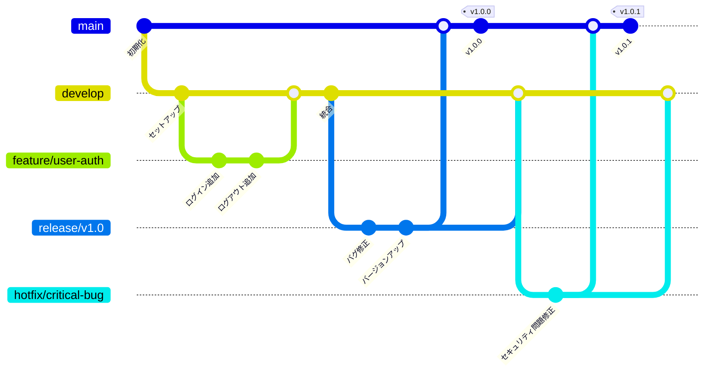
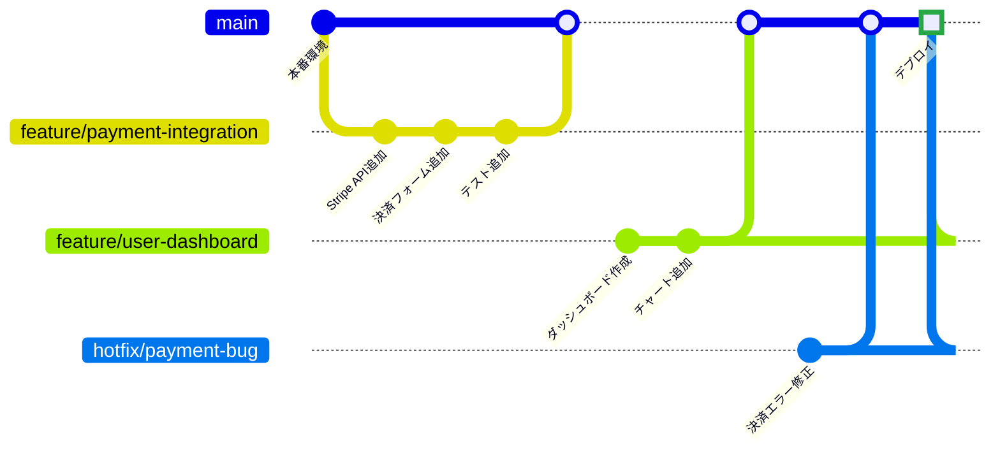
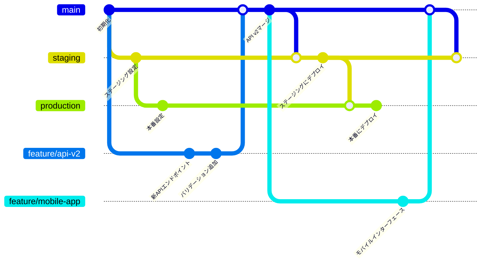
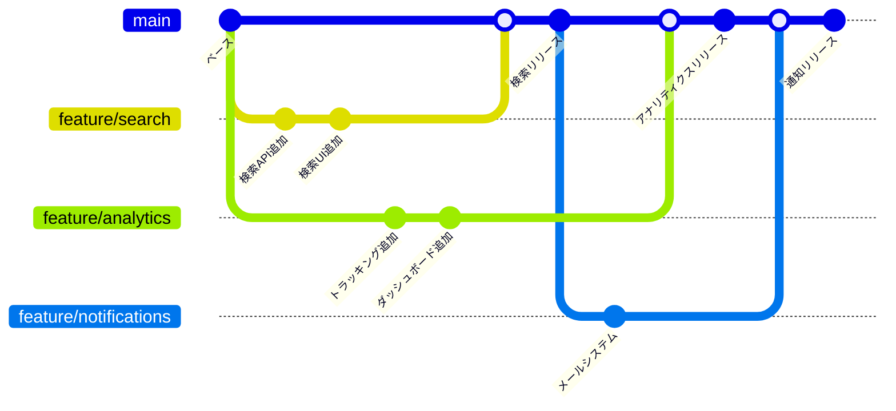

Gitブランチ戦略は現代のソフトウェア開発ワークフローの基盤です。適切なブランチ戦略は、スムーズで協調的な開発プロセスと、マージコンフリクトやデプロイメントの問題に満ちた混沌とした状況の違いを生み出します。

2022年において、チームはこれまで以上に多くのブランチ戦略の選択肢を持っています。従来のGit Flowから合理化されたGitHub Flowまで、それぞれのアプローチは異なるチームサイズ、リリースサイクル、デプロイメントパターンに適しています。各戦略をいつ、どのように使用するかを理解することは、コード品質とチーム生産性を維持するために不可欠です。

## Gitブランチの基礎を理解する

具体的な戦略に入る前に、すべてのブランチアプローチを支える核となる概念を確立しましょう。

**主要なブランチタイプ**：
- **Main/Master**：本番環境対応コード
- **Develop**：機能統合ブランチ
- **Feature**：個別機能開発
- **Release**：本番リリース準備
- **Hotfix**：重要な本番修正

**ブランチライフサイクルの原則**：
- **短期間ブランチ**：マージコンフリクトを最小化
- **明確な命名規則**：識別を容易にする
- **定期的な統合**：分岐を防ぐ
- **自動化テスト**：ブランチ品質を確保

## Git Flow：従来のアプローチ

Vincent Driessenによって導入されたGit Flowは、スケジュールされたリリースと複雑なデプロイメントプロセスを持つチームに今でも人気があります。

### Git Flow構造



### Git Flow実装

**ブランチ作成コマンド**：
```bash
# Git Flowを初期化
git flow init

# 新機能を開始
git flow feature start user-authentication

# 機能を完了（developにマージ）
git flow feature finish user-authentication

# リリースを開始
git flow release start v1.0.0

# リリースを完了（mainとdevelopにマージ）
git flow release finish v1.0.0

# ホットフィックスを開始
git flow hotfix start critical-security-fix

# ホットフィックスを完了（mainとdevelopにマージ）
git flow hotfix finish critical-security-fix
```

**Git Flowを使用するタイミング**：
- スケジュールされたリリース（月次、四半期）
- 本番環境での複数バージョン
- 複雑な機能を持つ大規模チーム
- リリース候補とテストフェーズが必要

!!!info "📋 Git Flowの利点"
    **構造化されたワークフロー**：ブランチ作成の明確なルールとタイミング
    **並行開発**：複数の機能を同時に開発可能
    **リリース管理**：安定化のための専用リリースブランチ
    **ホットフィックスサポート**：進行中の開発を妨げることなく迅速な修正

## GitHub Flow：シンプルさと継続的デプロイメント

GitHub Flowはシンプルさと継続的デプロイメントを重視し、WebアプリケーションやSaaS製品に理想的です。

### GitHub Flow構造



### GitHub Flowプロセス

**ワークフローステップ**：
1. **mainから各機能/修正用のブランチを作成**
2. **ブランチで変更を開発・コミット**
3. **コードレビューのためプルリクエストを開く**
4. **ステージング環境でデプロイ・テスト**
5. **承認後mainにマージ**
6. **本番環境に即座にデプロイ**

**実装例**：
```bash
# 機能ブランチを作成・切り替え
git checkout -b feature/user-notifications

# 変更を行いコミット
git add .
git commit -m "メール通知システムを追加"

# ブランチをプッシュしプルリクエストを作成
git push origin feature/user-notifications

# レビュー・承認後、GitHub UIでマージ
# CI/CDパイプラインで自動デプロイ
```

**GitHub Flowを使用するタイミング**：
- 継続的デプロイメント環境
- 頻繁にリリースするWebアプリケーション
- 中小規模チーム
- シンプルなデプロイメントプロセス

## GitLab Flow：Git FlowとGitHub Flowの橋渡し

GitLab FlowはGitHub FlowのシンプルさとGit Flowのリリース管理機能を組み合わせています。

### 環境ブランチを持つGitLab Flow



### GitLab Flow実装

**環境ベースのワークフロー**：
```bash
# 機能開発
git checkout -b feature/mobile-support
git commit -m "レスポンシブデザインを追加"
git push origin feature/mobile-support

# レビュー後mainにマージ
git checkout main
git merge feature/mobile-support

# ステージングにデプロイ
git checkout staging
git merge main
git push origin staging

# 本番にデプロイ（テスト後）
git checkout production
git merge staging
git push origin production
```

**GitLab Flowを使用するタイミング**：
- 複数のデプロイメント環境
- 環境固有のテストが必要
- 承認プロセスが必要な規制業界
- Git Flowの利点とGitHub Flowのシンプルさを求めるチーム

## 機能ブランチワークフロー：柔軟性とスケーラビリティ

機能ブランチワークフローは、リリース管理の柔軟性を保ちながら機能開発の分離に焦点を当てています。

### 機能ブランチ構造



### 高度なブランチパターン

**リリーストレインモデル**：
```bash
# mainからリリースブランチを作成
git checkout -b release/2022-10-sprint main

# 完成した機能をチェリーピック
git cherry-pick feature/user-auth
git cherry-pick feature/payment-system

# リリースブランチをデプロイ
git tag v2022.10.1 release/2022-10-sprint
```

## ブランチ戦略のアンチパターン

!!!warning "🚫 長期間の機能ブランチ"
    **問題**：数週間または数ヶ月間存在する機能ブランチはマージが困難になり、統合の悪夢を作り出します。
    
    **解決策**：大きな機能をより小さなマージ可能な部分に分割します。不完全な機能を隠すために機能フラグを使用します。

!!!error "⚡ Mainへの直接コミット"
    **問題**：メインブランチへの直接コミットにより、コードレビューやCI/CDプロセスをバイパスしてしまいます。
    
    **解決策**：ブランチ保護ルールを使用し、マージ前にプルリクエストとステータスチェックを必須にします。

!!!failure "🔧 一貫性のない命名規則"
    **問題**：ランダムに名前を付けたブランチ（fix1、temp、john-stuff）は、その目的を理解することを不可能にします。
    
    **解決策**：`feature/description`、`bugfix/issue-number`、`hotfix/critical-fix`のような明確な命名規則を確立します。

## 正しい戦略の選択

### 意思決定マトリックス

| 要因 | Git Flow | GitHub Flow | GitLab Flow | 機能ブランチ |
|--------|----------|-------------|-------------|----------------|
| **チームサイズ** | 大規模 (10+) | 中小規模 | 中大規模 | 任意 |
| **リリースサイクル** | スケジュール型 | 継続型 | 柔軟 | 柔軟 |
| **デプロイメント** | 複雑 | シンプル | マルチ環境 | 可変 |
| **コードレビュー** | オプション | 必須 | 必須 | 推奨 |
| **学習コスト** | 高 | 低 | 中 | 低 |

### 実装チェックリスト

**戦略選択前**：
- [ ] チームサイズと経験レベルを評価
- [ ] リリースとデプロイメント要件を定義
- [ ] CI/CDパイプラインの能力を評価
- [ ] 規制やコンプライアンスニーズを考慮
- [ ] コードレビュープロセスを計画

**実装後**：
- [ ] ワークフロー手順を文書化
- [ ] 選択した戦略でチームメンバーをトレーニング
- [ ] ブランチ保護ルールを設定
- [ ] 自動テストとデプロイメントを設定
- [ ] チームのフィードバックに基づいて監視・調整

## 現代のブランチベストプラクティス

### 自動化とツール

**ブランチ保護設定**：
```yaml
# GitHubブランチ保護の例
branch_protection:
  main:
    required_status_checks:
      - ci/tests
      - ci/security-scan
    required_pull_request_reviews:
      required_approving_review_count: 2
      dismiss_stale_reviews: true
    restrictions:
      users: []
      teams: ["senior-developers"]
```

**自動ブランチクリーンアップ**：
```bash
#!/bin/bash
# マージ済み機能ブランチをクリーンアップ
git branch --merged main | grep -v "main\|develop" | xargs -n 1 git branch -d

# リモートトラッキングブランチをクリーンアップ
git remote prune origin
```

### CI/CDとの統合

**パイプライン設定例**：
```yaml
# GitLab CI機能ブランチパイプライン
stages:
  - test
  - security
  - deploy-staging
  - deploy-production

test:
  stage: test
  script:
    - npm test
    - npm run lint
  only:
    - merge_requests
    - main

deploy-staging:
  stage: deploy-staging
  script:
    - deploy-to-staging.sh
  only:
    - main

deploy-production:
  stage: deploy-production
  script:
    - deploy-to-production.sh
  only:
    - production
  when: manual
```

## 結論：チームとともに進化する

最適なブランチ戦略は、チームの現在のニーズに適合し、将来の成長を可能にするものです。継続的デプロイメントを行う小規模チームであればGitHub Flowから始め、構造化されたリリース管理が必要であればGit Flowを実装しましょう。

ブランチ戦略はチームや製品とともに進化すべきであることを忘れないでください。3人の開発者を持つスタートアップに適しているものが、50人の開発者を持つ企業チームにも適しているとは限りません。以下の要因に基づいて、定期的にアプローチを見直し、調整してください：

- **チームのフィードバック**：開発者は現在のプロセスに不満を感じていませんか？
- **デプロイメント頻度**：リリースサイクルは変化しましたか？
- **コード品質指標**：より多くのバグやマージコンフリクトが発生していませんか？
- **ビジネス要件**：新しいコンプライアンスやセキュリティニーズがワークフローに影響していませんか？

重要なのは、組織の成長や変化に合わせて適応できる柔軟性を保ちながら、チームが高品質のソフトウェアを効率的に提供できる戦略を選択することです。