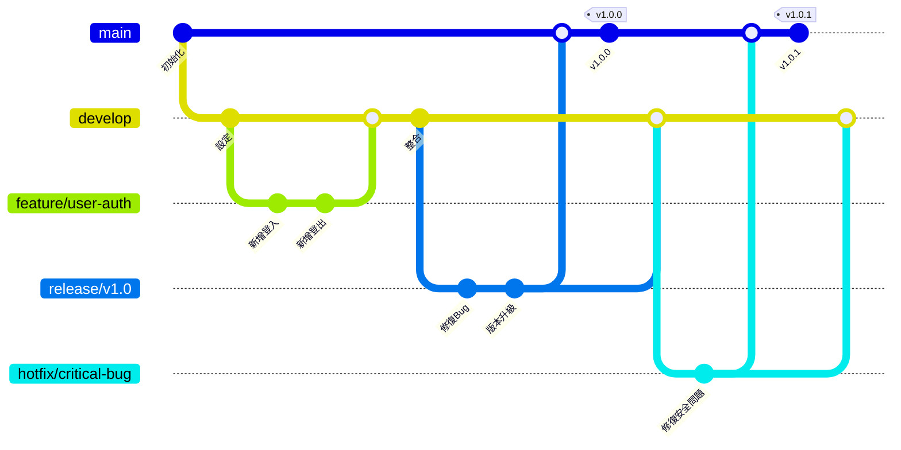
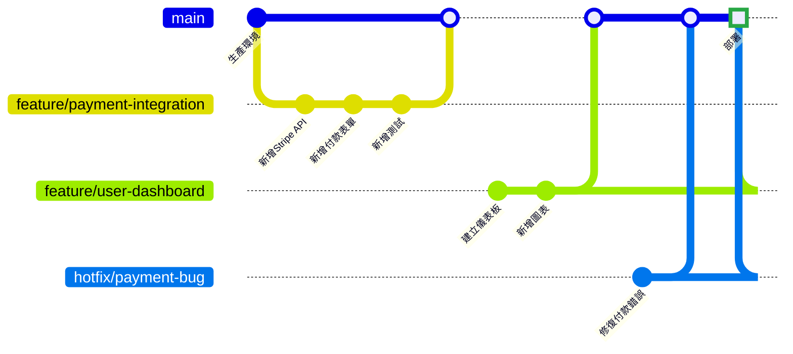
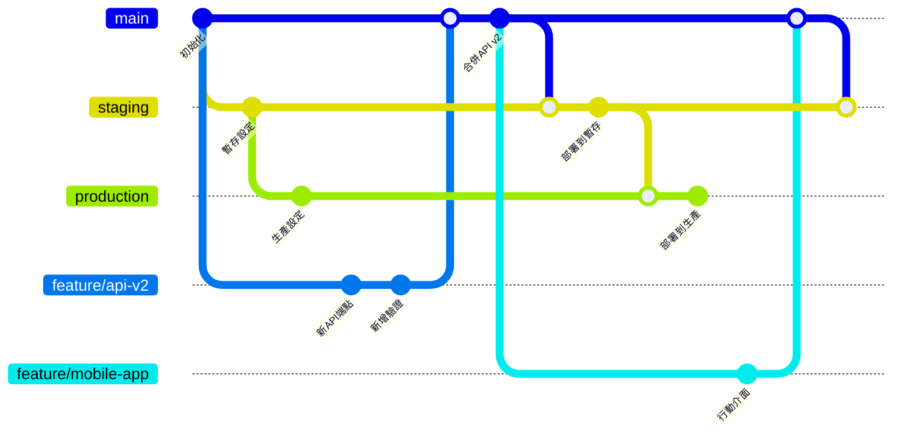
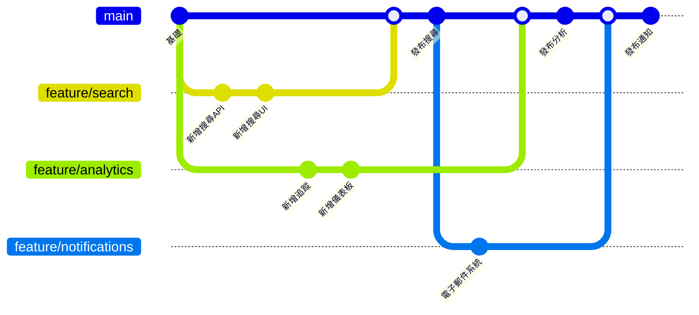

Git分支策略是現代軟體開發工作流的基礎。正確的分支策略可以決定開發過程是順暢協作還是充滿合併衝突和部署問題的混亂局面。

在2022年，團隊擁有比以往更多的分支策略選擇。從傳統的Git Flow到簡化的GitHub Flow，每種方法都適用於不同的團隊規模、發布週期和部署模式。了解何時以及如何使用每種策略對於維護程式碼品質和團隊生產力至關重要。

## 理解Git分支基礎

在深入具體策略之前，讓我們先建立支撐所有分支方法的核心概念。

**關鍵分支類型**：
- **Main/Master**：生產就緒程式碼
- **Develop**：功能整合分支
- **Feature**：單個功能開發
- **Release**：生產發布準備
- **Hotfix**：關鍵生產修復

**分支生命週期原則**：
- **短期分支**：最小化合併衝突
- **清晰命名約定**：便於識別
- **定期整合**：防止分歧
- **自動化測試**：確保分支品質

## Git Flow：傳統方法

由Vincent Driessen引入的Git Flow，對於有計劃發布和複雜部署流程的團隊仍然很受歡迎。

### Git Flow結構



### Git Flow實施

**分支建立指令**：
```bash
# 初始化Git Flow
git flow init

# 開始新功能
git flow feature start user-authentication

# 完成功能（合併到develop）
git flow feature finish user-authentication

# 開始發布
git flow release start v1.0.0

# 完成發布（合併到main和develop）
git flow release finish v1.0.0

# 開始熱修復
git flow hotfix start critical-security-fix

# 完成熱修復（合併到main和develop）
git flow hotfix finish critical-security-fix
```

**何時使用Git Flow**：
- 計劃發布（月度、季度）
- 生產環境中的多個版本
- 具有複雜功能的大型團隊
- 需要候選版本和測試階段

!!!info "📋 Git Flow優勢"
    **結構化工作流**：明確的分支建立規則和時機
    **並行開發**：多個功能可以同時開發
    **發布管理**：專用發布分支用於穩定化
    **熱修復支援**：快速修復而不干擾正在進行的開發

## GitHub Flow：簡單性和持續部署

GitHub Flow強調簡單性和持續部署，使其成為Web應用程式和SaaS產品的理想選擇。

### GitHub Flow結構



### GitHub Flow流程

**工作流步驟**：
1. **從main建立分支**用於每個功能/修復
2. **開發並提交**變更到分支
3. **開啟拉取請求**進行程式碼審查
4. **在暫存環境中部署和測試**
5. **批准後合併到main**
6. **立即部署到生產環境**

**實施範例**：
```bash
# 建立並切換到功能分支
git checkout -b feature/user-notifications

# 進行變更並提交
git add .
git commit -m "新增電子郵件通知系統"

# 推送分支並建立拉取請求
git push origin feature/user-notifications

# 審查和批准後，透過GitHub UI合併
# 透過CI/CD管道自動部署
```

**何時使用GitHub Flow**：
- 持續部署環境
- 頻繁發布的Web應用程式
- 中小型團隊
- 簡單的部署流程

## GitLab Flow：連接Git Flow和GitHub Flow

GitLab Flow結合了GitHub Flow的簡單性和Git Flow的發布管理能力。

### 帶環境分支的GitLab Flow



### GitLab Flow實施

**基於環境的工作流**：
```bash
# 功能開發
git checkout -b feature/mobile-support
git commit -m "新增響應式設計"
git push origin feature/mobile-support

# 審查後合併到main
git checkout main
git merge feature/mobile-support

# 部署到暫存
git checkout staging
git merge main
git push origin staging

# 部署到生產（測試後）
git checkout production
git merge staging
git push origin production
```

**何時使用GitLab Flow**：
- 多個部署環境
- 需要環境特定測試
- 需要審批流程的受監管行業
- 希望獲得Git Flow優勢但保持GitHub Flow簡單性的團隊

## 功能分支工作流：靈活且可擴展

功能分支工作流專注於隔離功能開發，同時在發布管理方面保持靈活性。

### 功能分支結構



### 進階分支模式

**發布列車模型**：
```bash
# 從main建立發布分支
git checkout -b release/2022-10-sprint main

# 挑選已完成的功能
git cherry-pick feature/user-auth
git cherry-pick feature/payment-system

# 部署發布分支
git tag v2022.10.1 release/2022-10-sprint
```

## 分支策略反模式

!!!warning "🚫 長期功能分支"
    **問題**：存在數週或數月的功能分支變得難以合併，並造成整合噩夢。
    
    **解決方案**：將大型功能分解為更小的可合併部分。使用功能標誌隱藏不完整的功能。

!!!error "⚡ 直接提交到Main"
    **問題**：透過直接提交到主分支繞過程式碼審查和CI/CD流程。
    
    **解決方案**：使用分支保護規則，要求在合併前進行拉取請求和狀態檢查。

!!!failure "🔧 不一致的命名約定"
    **問題**：隨意命名的分支（fix1、temp、john-stuff）使人無法理解其目的。
    
    **解決方案**：建立清晰的命名約定，如`feature/description`、`bugfix/issue-number`、`hotfix/critical-fix`。

## 選擇正確的策略

### 決策矩陣

| 因素 | Git Flow | GitHub Flow | GitLab Flow | 功能分支 |
|--------|----------|-------------|-------------|----------------|
| **團隊規模** | 大型 (10+) | 中小型 | 中大型 | 任意 |
| **發布週期** | 計劃式 | 持續式 | 靈活 | 靈活 |
| **部署** | 複雜 | 簡單 | 多環境 | 可變 |
| **程式碼審查** | 可選 | 必需 | 必需 | 推薦 |
| **學習曲線** | 高 | 低 | 中等 | 低 |

### 實施清單

**選擇策略前**：
- [ ] 評估團隊規模和經驗水平
- [ ] 定義發布和部署需求
- [ ] 評估CI/CD管道能力
- [ ] 考慮監管和合規需求
- [ ] 規劃程式碼審查流程

**實施後**：
- [ ] 記錄工作流程序
- [ ] 培訓團隊成員使用所選策略
- [ ] 設定分支保護規則
- [ ] 配置自動化測試和部署
- [ ] 根據團隊回饋監控和調整

## 現代分支最佳實務

### 自動化和工具

**分支保護配置**：
```yaml
# GitHub分支保護範例
branch_protection:
  main:
    required_status_checks:
      - ci/tests
      - ci/security-scan
    required_pull_request_reviews:
      required_approving_review_count: 2
      dismiss_stale_reviews: true
    restrictions:
      users: []
      teams: ["senior-developers"]
```

**自動化分支清理**：
```bash
#!/bin/bash
# 清理已合併的功能分支
git branch --merged main | grep -v "main\|develop" | xargs -n 1 git branch -d

# 清理遠端追蹤分支
git remote prune origin
```

### 與CI/CD整合

**管道配置範例**：
```yaml
# GitLab CI功能分支管道
stages:
  - test
  - security
  - deploy-staging
  - deploy-production

test:
  stage: test
  script:
    - npm test
    - npm run lint
  only:
    - merge_requests
    - main

deploy-staging:
  stage: deploy-staging
  script:
    - deploy-to-staging.sh
  only:
    - main

deploy-production:
  stage: deploy-production
  script:
    - deploy-to-production.sh
  only:
    - production
  when: manual
```

## 結論：與團隊共同成長

最佳的分支策略是適合團隊當前需求同時允許未來成長的策略。如果您是進行持續部署的小團隊，可以從GitHub Flow開始；如果需要結構化的發布管理，則實施Git Flow。

記住，分支策略應該與團隊和產品一起演進。適合三個開發人員新創公司的方法不一定適合五十個開發人員的企業團隊。應根據以下因素定期審查和調整您的方法：

- **團隊回饋**：開發人員是否對當前流程感到沮喪？
- **部署頻率**：發布週期是否發生了變化？
- **程式碼品質指標**：是否出現更多錯誤或合併衝突？
- **業務需求**：新的合規或安全需求是否影響您的工作流？

關鍵是選擇一個能夠讓團隊高效交付高品質軟體的策略，同時保持靈活性，以便隨著組織的成長和變化進行適應。