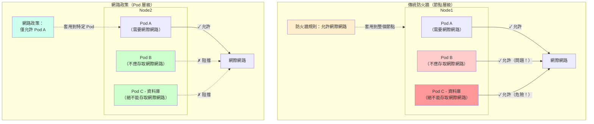

在 Kubernetes 的世界中，有一個許多企業忽視的危險預設設定：每個 Pod 都可以與其他 Pod 通訊，跨越所有命名空間，沒有任何限制。這就像建造一棟辦公室，每扇門都沒上鎖，每個檔案櫃都是開放的，每位員工都可以進入每個房間。方便嗎？是的。安全嗎？絕對不是。

對於處理敏感資料、法規遵循或多租戶環境的企業來說，這種扁平網路模型是一顆定時炸彈。一個被入侵的 Pod 可以成為橫向移動攻擊整個叢集的跳板。這就是為什麼 Kubernetes 網路政策不僅重要，而且是必不可少的。

## 扁平網路問題

Kubernetes 的設計理念是簡單性。預設情況下，網路模型是扁平的——任何 Pod 都可以使用 IP 位址連接到任何其他 Pod。這使得開發變得容易，消除了網路複雜性，但也造成了巨大的安全漏洞。

考慮一個典型的企業應用程式：

- 前端 Pod 處理使用者請求
- 後端 API Pod 處理業務邏輯
- 資料庫 Pod 儲存敏感的客戶資料
- 管理 Pod 用於叢集管理
- 第三方整合 Pod 連接到外部服務

在預設的 Kubernetes 設定中，被入侵的前端 Pod 可以直接存取您的資料庫 Pod。被利用的第三方整合可以連接到您的管理工具。沒有障礙，沒有檢查點，沒有隔離。

!!!danger "🚨 資料外洩情境"
    攻擊者利用您面向公眾的 Web 應用程式中的漏洞。他們獲得了前端 Pod 的 shell 存取權限。如果沒有網路政策，他們現在可以掃描整個叢集，發現資料庫 Pod，並竊取客戶資料——這一切都是因為沒有任何東西阻止他們建立這些連線。

這不是理論上的。[2020 年 Tesla Kubernetes 資料外洩](https://redlock.io/blog/cryptojacking-tesla)就是因為暴露的 Kubernetes 儀表板導致被入侵的 Pod 可以存取儲存在叢集其他地方的 AWS 憑證。網路隔離本可以限制爆炸半徑。

## 網路政策登場：Kubernetes 的零信任

Kubernetes 網路政策是一個規範，定義了 Pod 如何相互通訊以及如何與外部端點通訊。它是您叢集的防火牆，但不是使用 IP 位址和連接埠，而是根據 Pod 標籤、命名空間和 CIDR 區塊定義規則。

核心原則很簡單：**預設拒絕，明確允許**。這就是零信任網路——在證明必要之前，什麼都不信任。

基本的網路政策如下所示：

```yaml
apiVersion: networking.k8s.io/v1
kind: NetworkPolicy
metadata:
  name: backend-policy
  namespace: production
spec:
  podSelector:
    matchLabels:
      app: backend
  policyTypes:
  - Ingress
  - Egress
  ingress:
  - from:
    - podSelector:
        matchLabels:
          app: frontend
    ports:
    - protocol: TCP
      port: 8080
  egress:
  - to:
    - podSelector:
        matchLabels:
          app: database
    ports:
    - protocol: TCP
      port: 5432
```

這個政策說：「後端 Pod 只能在連接埠 8080 上接收來自前端 Pod 的流量，並且只能在連接埠 5432 上向資料庫 Pod 發送流量。」其他一切都被阻擋。

!!!success "✅ 深度防禦"
    網路政策不能取代應用程式層級的安全性、身份驗證或加密。它們是深度防禦策略中的一層。即使攻擊者入侵了一個 Pod，網路政策也會限制他們可以連接的範圍。

## 為何企業不能忽視這一點

對於企業來說，網路政策不是可選的——它們是合規性和安全性的必需品：

**法規遵循**：PCI-DSS、HIPAA 和 SOC 2 等標準要求網路隔離。您必須證明敏感資料與較不受信任的元件隔離。網路政策提供可稽核的、宣告式的隔離證明。

**多租戶**：如果您在同一個叢集上執行多個團隊或客戶，網路政策可以防止一個租戶存取另一個租戶的資源。沒有它們，命名空間隔離純粹是邏輯上的，而不是強制執行的。

**爆炸半徑限制**：當（不是如果）發生安全事件時，網路政策可以控制損害。開發命名空間中被入侵的 Pod 無法連接到生產環境。被攻破的前端無法直接存取資料庫。

**稽核和可見性**：網路政策是宣告式的並且受版本控制。您可以稽核誰在何時更改了什麼以及為什麼。將此與埋藏在網路設備中的傳統防火牆規則進行比較。

**成本效益**：無需為每個安全區域部署單獨的叢集（昂貴且操作複雜），您可以使用網路政策在單個叢集內建立安全邊界。

!!!info "📊 合規要求"
    PCI-DSS 要求 1.2.1 明確規定限制入站和出站流量，僅限於持卡人資料環境所需的流量。網路政策是滿足此要求的 Kubernetes 原生方式。

## 替代方案：屬性型防火牆與服務網格

網路政策並不是唯一的選擇。企業還有其他選項來保護 Kubernetes 網路：

### 傳統防火牆：節點層級陷阱

您可以使用傳統網路防火牆或雲端安全群組來控制 Kubernetes 節點之間的流量。但這種方法有一個致命缺陷，許多企業發現得太晚了。

**問題所在**：傳統防火牆在節點層級運作，而不是在 Pod 層級。這就是為什麼這很危險：

想像您有一個 Kubernetes 節點執行三個 Pod：
- Pod A：前端應用程式（需要網際網路存取 CDN）
- Pod B：後端 API（永遠不應該存取網際網路）
- Pod C：資料庫（絕對不能存取網際網路）

使用傳統防火牆，您配置節點的安全群組以允許出站網際網路存取，因為 Pod A 需要它。但問題來了：**所有三個 Pod 現在都有網際網路存取權限**。防火牆無法區分 Pod——它只看到節點的 IP 位址。

這意味著：
- 您的資料庫 Pod 可以將資料外洩到外部伺服器
- 您的後端 API 可以被用作出站攻擊的代理
- 被入侵的 Pod 可以下載惡意軟體或與命令控制伺服器通訊

!!!danger "🔓 節點層級安全漏洞"
    如果防火牆規則允許節點存取網際網路（即使只是為了一個 Pod），該節點上的每個 Pod 都會繼承該存取權限。您無法使用傳統防火牆強制執行 Pod 特定的出站政策。這就是為什麼節點層級安全性對 Kubernetes 來說是不夠的。



**其他限制**：

- **基於 IP，而非基於 Pod**：Pod 是短暫的，具有動態 IP。基於 IP 位址的防火牆規則在 Pod 建立和銷毀時變得無法管理。
- **沒有 Kubernetes 感知能力**：防火牆不理解命名空間、標籤或 Pod 選擇器。您失去了宣告式的 Kubernetes 原生方法。
- **粗粒度控制**：您只能在節點層級控制流量，而不是在實際安全邊界所在的工作負載層級。

### 屬性型存取控制（ABAC）防火牆

一些新一代防火牆支援屬性型政策，其中規則使用中繼資料屬性而不是 IP 位址定義。這在理念上更接近 Kubernetes 網路政策：

- **中繼資料驅動**：基於應用程式身份、使用者上下文或工作負載屬性的規則
- **動態**：政策隨著工作負載變化而調整，無需手動更新 IP
- **集中式**：整個基礎設施的單一政策引擎

然而，ABAC 防火牆通常是 Kubernetes 外部的，需要整合且通常成本高昂。它們對於混合環境（Kubernetes + VM + 雲端服務）很強大，但增加了複雜性。

### 服務網格（Istio、Linkerd、Consul）

服務網格提供第 7 層（應用程式層級）流量管理和安全性：

- **雙向 TLS**：服務之間的自動加密和身份驗證
- **細粒度政策**：基於 HTTP 方法、標頭、路徑的控制
- **可觀察性**：詳細的流量指標和追蹤
- **進階路由**：金絲雀部署、流量分割、重試

服務網格非常強大，但也有權衡：

**複雜性**：顯著的學習曲線和操作開銷。您要為每個 Pod 添加 sidecar，管理控制平面，並除錯新的基礎設施層。

**效能開銷**：Sidecar 代理增加延遲（通常每跳 1-5 毫秒）和資源消耗。

**成本**：更多資源、更多複雜性、更多操作負擔。

!!!tip "💡 何時使用什麼"
    **網路政策**：從這裡開始。它們內建於 Kubernetes，易於實作，涵蓋 80% 的企業安全需求。無需額外基礎設施。
    
    **服務網格**：當您需要第 7 層功能（如雙向 TLS、進階路由或詳細可觀察性）時添加。最適合具有複雜服務間通訊的微服務架構。
    
    **ABAC 防火牆**：考慮用於混合環境，您需要跨 Kubernetes、VM 和雲端服務的一致政策。通常是企業級決策，而不僅僅是針對 Kubernetes。

## 比較：網路政策 vs 服務網格 vs ABAC 防火牆

| 功能 | 網路政策 | 服務網格 | ABAC 防火牆 |
|---------|---------------|--------------|---------------|
| **層級** | 第 3/4 層（IP/連接埠） | 第 7 層（HTTP/gRPC） | 第 3-7 層 |
| **複雜性** | 低 | 高 | 中 |
| **效能影響** | 最小 | 1-5 毫秒延遲 | 不一定 |
| **成本** | 免費（內建） | 資源開銷 | 授權成本 |
| **加密** | 否（需要單獨解決方案） | 包含雙向 TLS | 取決於產品 |
| **可觀察性** | 基本（取決於 CNI） | 優秀 | 良好 |
| **Kubernetes 原生** | 是 | 是 | 否 |
| **學習曲線** | 平緩 | 陡峭 | 中等 |
| **最適合** | 基本隔離 | 微服務安全 | 混合環境 |

## 實際實作

讓我們透過一個實際範例：保護三層應用程式。

**架構**：
- 前端 Pod（面向公眾）
- 後端 API Pod（內部）
- 資料庫 Pod（敏感資料）

**安全要求**：
- 前端只能與後端 API 通訊
- 後端 API 只能與資料庫通訊
- 資料庫僅接受來自後端的連線
- 除了前端（用於 CDN 資產）外，沒有 Pod 可以存取網際網路

**實作**：

```yaml
# 預設拒絕所有流量
apiVersion: networking.k8s.io/v1
kind: NetworkPolicy
metadata:
  name: default-deny-all
  namespace: production
spec:
  podSelector: {}
  policyTypes:
  - Ingress
  - Egress

---
# 允許前端接收外部流量
apiVersion: networking.k8s.io/v1
kind: NetworkPolicy
metadata:
  name: frontend-policy
  namespace: production
spec:
  podSelector:
    matchLabels:
      tier: frontend
  policyTypes:
  - Ingress
  - Egress
  ingress:
  - from:
    - namespaceSelector: {}
    ports:
    - protocol: TCP
      port: 80
  egress:
  - to:
    - podSelector:
        matchLabels:
          tier: backend
    ports:
    - protocol: TCP
      port: 8080
  - to:
    - namespaceSelector: {}
      podSelector: {}
    ports:
    - protocol: TCP
      port: 443  # 允許 HTTPS 用於 CDN

---
# 允許後端僅與資料庫通訊
apiVersion: networking.k8s.io/v1
kind: NetworkPolicy
metadata:
  name: backend-policy
  namespace: production
spec:
  podSelector:
    matchLabels:
      tier: backend
  policyTypes:
  - Ingress
  - Egress
  ingress:
  - from:
    - podSelector:
        matchLabels:
          tier: frontend
    ports:
    - protocol: TCP
      port: 8080
  egress:
  - to:
    - podSelector:
        matchLabels:
          tier: database
    ports:
    - protocol: TCP
      port: 5432
  - to:
    - namespaceSelector:
        matchLabels:
          name: kube-system
      podSelector:
        matchLabels:
          k8s-app: kube-dns
    ports:
    - protocol: UDP
      port: 53  # 允許 DNS

---
# 資料庫僅接受來自後端的連線
apiVersion: networking.k8s.io/v1
kind: NetworkPolicy
metadata:
  name: database-policy
  namespace: production
spec:
  podSelector:
    matchLabels:
      tier: database
  policyTypes:
  - Ingress
  ingress:
  - from:
    - podSelector:
        matchLabels:
          tier: backend
    ports:
    - protocol: TCP
      port: 5432
```

這種設定建立了清晰的邊界。即使攻擊者入侵了前端，他們也無法直接存取資料庫。他們需要同時入侵前端和後端才能接觸到敏感資料——顯著提高了門檻。

!!!warning "⚠️ 別忘了 DNS"
    一個常見的錯誤是忘記允許 DNS 流量。Pod 需要將服務名稱解析為 IP 位址。始終包含 kube-dns 或 CoreDNS 的出站規則，通常在 UDP 連接埠 53 上。

## 入門指南

實作網路政策不必是全有或全無。以下是務實的方法：

**1. 驗證 CNI 支援**：並非所有容器網路介面（CNI）外掛都支援網路政策。Calico、Cilium 和 Weave Net 支援。AWS VPC CNI 和 Azure CNI 需要額外配置。檢查您的 CNI 文件。

**2. 從監控開始**：在強制執行政策之前，以稽核模式部署它們（如果您的 CNI 支援），或使用 [Cilium Hubble](https://github.com/cilium/hubble) 等工具視覺化現有流量模式。

**3. 從全部拒絕開始**：在非關鍵命名空間中建立預設的全部拒絕政策。這會強制您明確允許必要的流量，揭示您的實際通訊模式。

**4. 逐步加入白名單**：一次添加一個允許規則，每次更改後進行測試。從明顯的流程（前端 → 後端）開始，然後處理邊緣情況。

**5. 自動化測試**：使用 [netassert](https://github.com/controlplaneio/netassert) 等工具為您的網路政策編寫測試。這可以防止政策更改時的回歸。

**6. 文件化和版本控制**：將政策與應用程式清單一起儲存在 Git 中。記錄每個規則存在的原因。未來的您（或您的團隊成員）會感謝您。

!!!tip "🛠️ 有用的工具"
    - **[Cilium Editor](https://editor.cilium.io/)**：視覺化網路政策編輯器
    - **[Network Policy Viewer](https://github.com/runoncloud/kubectl-np-viewer)**：將政策視覺化為圖形
    - **[Inspektor Gadget](https://github.com/inspektor-gadget/inspektor-gadget)**：即時除錯網路流量
    - **[Calico Enterprise](https://www.tigera.io/tigera-products/calico-enterprise/)**：進階政策管理（商業版）

## 結論

Kubernetes 網路政策對企業來說不是可選的。它是叢集安全的基礎，是防止橫向移動的第一道防線，也是受監管行業的合規要求。

是的，有替代方案——服務網格提供更多功能，ABAC 防火牆提供更廣泛的覆蓋範圍——但網路政策內建於 Kubernetes，不需要額外的基礎設施，並解決了最關鍵的問題：防止不受限制的 Pod 間通訊。

從簡單開始。部署預設拒絕政策。將必要的流量加入白名單。徹底測試。您的安全團隊、合規稽核員和未來的事件回應人員會感謝您。

在 Kubernetes 中，預設是信任。對於企業來說，標準必須是零信任。網路政策就是您實現這一目標的方式。
