In the world of Kubernetes, there's a dangerous default that many enterprises overlook: every pod can communicate with every other pod, across all namespaces, without restriction. It's like building an office where every door is unlocked, every file cabinet is open, and every employee has access to every room. Convenient? Yes. Secure? Absolutely not.

For enterprises handling sensitive data, regulatory compliance, or multi-tenant environments, this flat network model is a ticking time bomb. One compromised pod can become a launchpad for lateral movement across your entire cluster. This is where Kubernetes Network Policy becomes not just important, but essential.

## The Flat Network Problem

Kubernetes was designed with simplicity in mind. By default, the network model is flat—any pod can reach any other pod using its IP address. This makes development easy and removes networking complexity, but it creates a massive security gap.

Consider a typical enterprise application:

- Frontend pods serving user requests
- Backend API pods processing business logic  
- Database pods storing sensitive customer data
- Admin pods for cluster management
- Third-party integration pods connecting to external services

In a default Kubernetes setup, a compromised frontend pod can directly access your database pods. An exploited third-party integration can reach your admin tools. There are no barriers, no checkpoints, no segmentation.

!!!danger "🚨 The Breach Scenario"
    An attacker exploits a vulnerability in your public-facing web application. They gain shell access to a frontend pod. Without network policies, they can now scan the entire cluster, discover database pods, and exfiltrate customer data—all because nothing stopped them from making those connections.

This isn't theoretical. The [2020 Tesla Kubernetes breach](https://redlock.io/blog/cryptojacking-tesla) happened because an exposed Kubernetes dashboard led to compromised pods that could access AWS credentials stored elsewhere in the cluster. Network segmentation could have limited the blast radius.

## Enter Network Policy: Zero Trust for Kubernetes

Kubernetes Network Policy is a specification that defines how pods can communicate with each other and with external endpoints. It's the firewall for your cluster, but instead of IP addresses and ports, you define rules based on pod labels, namespaces, and CIDR blocks.

The core principle is simple: **deny by default, allow explicitly**. This is zero trust networking—nothing is trusted until proven necessary.

A basic network policy looks like this:

```yaml
apiVersion: networking.k8s.io/v1
kind: NetworkPolicy
metadata:
  name: backend-policy
  namespace: production
spec:
  podSelector:
    matchLabels:
      app: backend
  policyTypes:
  - Ingress
  - Egress
  ingress:
  - from:
    - podSelector:
        matchLabels:
          app: frontend
    ports:
    - protocol: TCP
      port: 8080
  egress:
  - to:
    - podSelector:
        matchLabels:
          app: database
    ports:
    - protocol: TCP
      port: 5432
```

This policy says: "Backend pods can only receive traffic from frontend pods on port 8080, and can only send traffic to database pods on port 5432." Everything else is blocked.

!!!success "✅ Defense in Depth"
    Network policies don't replace application-level security, authentication, or encryption. They're one layer in a defense-in-depth strategy. Even if an attacker compromises a pod, network policies limit what they can reach.

## Why Enterprises Can't Ignore This

For enterprises, network policies aren't optional—they're a compliance and security necessity:

**Regulatory compliance**: Standards like PCI-DSS, HIPAA, and SOC 2 require network segmentation. You must demonstrate that sensitive data is isolated from less-trusted components. Network policies provide auditable, declarative proof of segmentation.

**Multi-tenancy**: If you're running multiple teams or customers on the same cluster, network policies prevent one tenant from accessing another's resources. Without them, namespace isolation is purely logical, not enforced.

**Blast radius limitation**: When (not if) a security incident occurs, network policies contain the damage. A compromised pod in the development namespace can't reach production. A breached frontend can't access the database directly.

**Audit and visibility**: Network policies are declarative and version-controlled. You can audit who changed what, when, and why. Compare this to traditional firewall rules buried in network appliances.

**Cost efficiency**: Instead of deploying separate clusters for each security zone (expensive and operationally complex), you can use network policies to create secure boundaries within a single cluster.

!!!info "📊 Compliance Requirements"
    PCI-DSS Requirement 1.2.1 explicitly mandates restricting inbound and outbound traffic to that which is necessary for the cardholder data environment. Network policies are the Kubernetes-native way to meet this requirement.

## The Alternatives: Attribute-Based Firewalls and Service Mesh

Network policies aren't the only game in town. Enterprises have other options for securing Kubernetes networking:

### Traditional Firewalls: The Node-Level Trap

You could use traditional network firewalls or cloud security groups to control traffic between Kubernetes nodes. But this approach has a fatal flaw that many enterprises discover too late.

**The problem**: Traditional firewalls operate at the node level, not the pod level. Here's why that's dangerous:

Imagine you have a Kubernetes node running three pods:
- Pod A: Frontend application (needs internet access for CDN)
- Pod B: Backend API (should never access internet)
- Pod C: Database (absolutely must not access internet)

With a traditional firewall, you configure the node's security group to allow outbound internet access because Pod A needs it. But here's the catch: **all three pods now have internet access**. The firewall can't distinguish between pods—it only sees the node's IP address.

This means:
- Your database pod can exfiltrate data to external servers
- Your backend API can be used as a proxy for outbound attacks
- A compromised pod can download malware or communicate with command-and-control servers

!!!danger "🔓 The Node-Level Security Gap"
    If a firewall rule allows a node to access the internet (even for just one pod), every pod on that node inherits that access. You cannot enforce pod-specific egress policies with traditional firewalls. This is why node-level security is insufficient for Kubernetes.

```mermaid
graph TB
    subgraph "Traditional Firewall (Node-Level)"
        FW1["Firewall Rule: Allow Internet"]
        Node1["Kubernetes Node"]
        FW1 -.->|"Applies to entire node"| Node1
        
        subgraph Node1
            PodA1["Pod A<br/>(needs internet)"]
            PodB1["Pod B<br/>(shouldn't access internet)"]
            PodC1["Pod C - Database<br/>(must not access internet)"]
        end
        
        PodA1 -->|"✓ Allowed"| Internet1["Internet"]
        PodB1 -->|"✓ Allowed (PROBLEM!)"| Internet1
        PodC1 -->|"✓ Allowed (DANGER!)"| Internet1
    end
    
    subgraph "Network Policy (Pod-Level)"
        Node2["Kubernetes Node"]
        
        subgraph Node2
            PodA2["Pod A<br/>(needs internet)"]
            PodB2["Pod B<br/>(shouldn't access internet)"]
            PodC2["Pod C - Database<br/>(must not access internet)"]
        end
        
        NP1["Network Policy:<br/>Allow Pod A only"]
        NP1 -.->|"Applies to specific pod"| PodA2
        
        PodA2 -->|"✓ Allowed"| Internet2["Internet"]
        PodB2 -.->|"✗ Blocked"| Internet2
        PodC2 -.->|"✗ Blocked"| Internet2
    end
    
    style PodB1 fill:#ffcccc
    style PodC1 fill:#ff9999
    style PodB2 fill:#ccffcc
    style PodC2 fill:#ccffcc
    style FW1 fill:#ffeecc
    style NP1 fill:#ccffee
```



**Other limitations**:

- **IP-based, not pod-based**: Pods are ephemeral with dynamic IPs. Firewall rules based on IP addresses become unmanageable as pods are created and destroyed.
- **No Kubernetes awareness**: Firewalls don't understand namespaces, labels, or pod selectors. You lose the declarative, Kubernetes-native approach.
- **Coarse-grained control**: You can only control traffic at the node level, not the workload level where your actual security boundaries exist.

### Attribute-Based Access Control (ABAC) Firewalls

Some next-generation firewalls support attribute-based policies, where rules are defined using metadata attributes rather than IP addresses. This is closer to Kubernetes Network Policy in philosophy:

- **Metadata-driven**: Rules based on application identity, user context, or workload attributes
- **Dynamic**: Policies adapt as workloads change without manual IP updates
- **Centralized**: Single policy engine for the entire infrastructure

However, ABAC firewalls are typically external to Kubernetes, requiring integration and often significant cost. They're powerful for hybrid environments (Kubernetes + VMs + cloud services) but add complexity.

### Service Mesh (Istio, Linkerd, Consul)

Service meshes provide Layer 7 (application-level) traffic management and security:

- **Mutual TLS**: Automatic encryption and authentication between services
- **Fine-grained policies**: Control based on HTTP methods, headers, paths
- **Observability**: Detailed traffic metrics and tracing
- **Advanced routing**: Canary deployments, traffic splitting, retries

Service meshes are incredibly powerful but come with trade-offs:

**Complexity**: Significant learning curve and operational overhead. You're adding sidecars to every pod, managing control planes, and debugging a new layer of infrastructure.

**Performance overhead**: Sidecar proxies add latency (typically 1-5ms per hop) and resource consumption.

**Cost**: More resources, more complexity, more operational burden.

!!!tip "💡 When to Use What"
    **Network Policies**: Start here. They're built into Kubernetes, simple to implement, and cover 80% of enterprise security needs. Zero additional infrastructure required.
    
    **Service Mesh**: Add when you need Layer 7 features like mutual TLS, advanced routing, or detailed observability. Best for microservices architectures with complex service-to-service communication.
    
    **ABAC Firewalls**: Consider for hybrid environments where you need consistent policy across Kubernetes, VMs, and cloud services. Typically an enterprise-wide decision, not just for Kubernetes.

## Comparison: Network Policy vs Service Mesh vs ABAC Firewalls

| Feature | Network Policy | Service Mesh | ABAC Firewall |
|---------|---------------|--------------|---------------|
| **Layer** | Layer 3/4 (IP/Port) | Layer 7 (HTTP/gRPC) | Layer 3-7 |
| **Complexity** | Low | High | Medium |
| **Performance Impact** | Minimal | 1-5ms latency | Varies |
| **Cost** | Free (built-in) | Resource overhead | License costs |
| **Encryption** | No (needs separate solution) | Mutual TLS included | Depends on product |
| **Observability** | Basic (CNI-dependent) | Excellent | Good |
| **Kubernetes-Native** | Yes | Yes | No |
| **Learning Curve** | Gentle | Steep | Medium |
| **Best For** | Basic segmentation | Microservices security | Hybrid environments |

## Real-World Implementation

Let's walk through a practical example: securing a three-tier application.

**Architecture**:
- Frontend pods (public-facing)
- Backend API pods (internal)
- Database pods (sensitive data)

**Security requirements**:
- Frontend can only talk to backend API
- Backend API can only talk to database
- Database accepts connections only from backend
- No pod can access the internet except frontend (for CDN assets)

**Implementation**:

```yaml
# Deny all traffic by default
apiVersion: networking.k8s.io/v1
kind: NetworkPolicy
metadata:
  name: default-deny-all
  namespace: production
spec:
  podSelector: {}
  policyTypes:
  - Ingress
  - Egress

---
# Allow frontend to receive external traffic
apiVersion: networking.k8s.io/v1
kind: NetworkPolicy
metadata:
  name: frontend-policy
  namespace: production
spec:
  podSelector:
    matchLabels:
      tier: frontend
  policyTypes:
  - Ingress
  - Egress
  ingress:
  - from:
    - namespaceSelector: {}
    ports:
    - protocol: TCP
      port: 80
  egress:
  - to:
    - podSelector:
        matchLabels:
          tier: backend
    ports:
    - protocol: TCP
      port: 8080
  - to:
    - namespaceSelector: {}
      podSelector: {}
    ports:
    - protocol: TCP
      port: 443  # Allow HTTPS for CDN

---
# Allow backend to talk to database only
apiVersion: networking.k8s.io/v1
kind: NetworkPolicy
metadata:
  name: backend-policy
  namespace: production
spec:
  podSelector:
    matchLabels:
      tier: backend
  policyTypes:
  - Ingress
  - Egress
  ingress:
  - from:
    - podSelector:
        matchLabels:
          tier: frontend
    ports:
    - protocol: TCP
      port: 8080
  egress:
  - to:
    - podSelector:
        matchLabels:
          tier: database
    ports:
    - protocol: TCP
      port: 5432
  - to:
    - namespaceSelector:
        matchLabels:
          name: kube-system
      podSelector:
        matchLabels:
          k8s-app: kube-dns
    ports:
    - protocol: UDP
      port: 53  # Allow DNS

---
# Database accepts connections only from backend
apiVersion: networking.k8s.io/v1
kind: NetworkPolicy
metadata:
  name: database-policy
  namespace: production
spec:
  podSelector:
    matchLabels:
      tier: database
  policyTypes:
  - Ingress
  ingress:
  - from:
    - podSelector:
        matchLabels:
          tier: backend
    ports:
    - protocol: TCP
      port: 5432
```

This setup creates clear boundaries. Even if an attacker compromises the frontend, they can't directly access the database. They'd need to compromise both the frontend and backend to reach sensitive data—significantly raising the bar.

!!!warning "⚠️ Don't Forget DNS"
    A common mistake is forgetting to allow DNS traffic. Pods need to resolve service names to IP addresses. Always include egress rules for kube-dns or CoreDNS, typically on UDP port 53.

## Getting Started

Implementing network policies doesn't have to be all-or-nothing. Here's a pragmatic approach:

**1. Verify CNI support**: Not all Container Network Interface (CNI) plugins support network policies. Calico, Cilium, and Weave Net do. AWS VPC CNI and Azure CNI require additional configuration. Check your CNI documentation.

**2. Start with monitoring**: Before enforcing policies, deploy them in audit mode (if your CNI supports it) or use tools like [Cilium Hubble](https://github.com/cilium/hubble) to visualize existing traffic patterns.

**3. Begin with deny-all**: Create a default deny-all policy in a non-critical namespace. This forces you to explicitly allow necessary traffic, revealing your actual communication patterns.

**4. Whitelist incrementally**: Add allow rules one at a time, testing after each change. Start with obvious flows (frontend → backend) and work toward edge cases.

**5. Automate testing**: Use tools like [netassert](https://github.com/controlplaneio/netassert) to write tests for your network policies. This prevents regressions when policies change.

**6. Document and version control**: Store policies in Git alongside your application manifests. Document why each rule exists. Future you (or your teammates) will thank you.

!!!tip "🛠️ Tools to Help"
    - **[Cilium Editor](https://editor.cilium.io/)**: Visual network policy editor
    - **[Network Policy Viewer](https://github.com/runoncloud/kubectl-np-viewer)**: Visualize policies as graphs
    - **[Inspektor Gadget](https://github.com/inspektor-gadget/inspektor-gadget)**: Debug network traffic in real-time
    - **[Calico Enterprise](https://www.tigera.io/tigera-products/calico-enterprise/)**: Advanced policy management (commercial)

## The Bottom Line

Kubernetes Network Policy is not optional for enterprises. It's the foundation of cluster security, the first line of defense against lateral movement, and a compliance requirement for regulated industries.

Yes, there are alternatives—service meshes offer more features, ABAC firewalls provide broader coverage—but network policies are built into Kubernetes, require no additional infrastructure, and solve the most critical problem: preventing unrestricted pod-to-pod communication.

Start simple. Deploy a default-deny policy. Whitelist necessary traffic. Test thoroughly. Your security team, compliance auditors, and future incident responders will thank you.

In Kubernetes, the default is trust. For enterprises, the standard must be zero trust. Network policies are how you get there.
