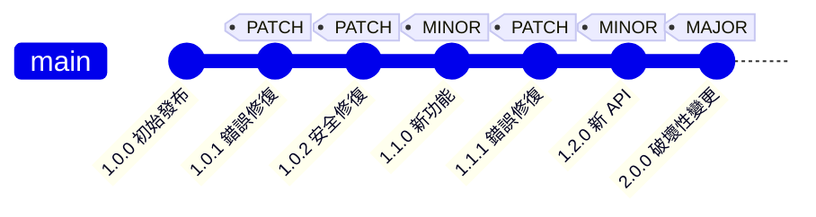
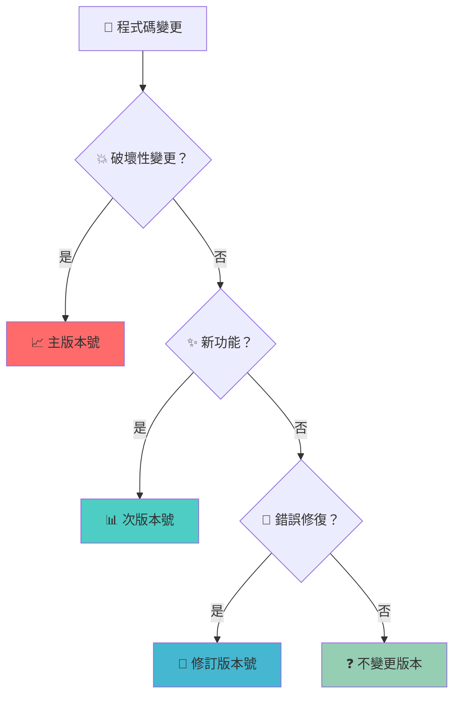
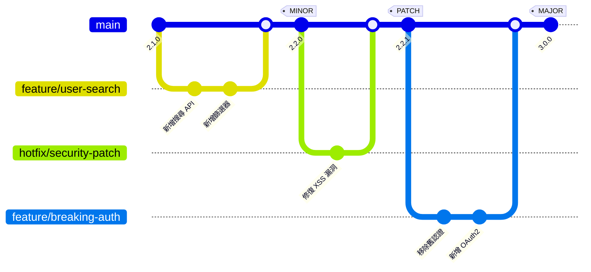
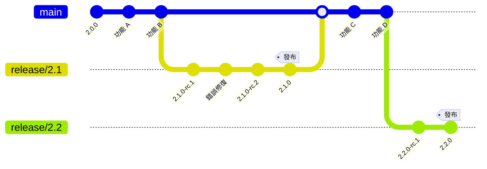
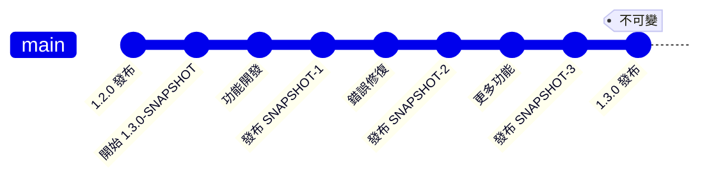

你的應用程式在正式環境中當機了。罪魁禍首？一個引入了破壞性變更的相依套件「小版本」更新。函式庫維護者將其標記為版本 2.3.0，暗示這只是一個簡單的功能新增。但在發布說明中，你發現他們刪除了你的程式碼所依賴的關鍵 API 方法。

這種情況每天都在全球軟體團隊中上演。不能傳達變更性質的版本號導致建置失敗、正式環境故障和開發者挫折。當版本 1.4.7 破壞了在 1.4.6 中正常運作的所有功能時，對相依生態系統的信任就會受到侵蝕。

解決方案不是避免更新——而是採用一個能夠清晰傳達變更影響的版本控制系統。語意化版本控制（SemVer）提供了一種標準化的版本號方法，告訴你每個發布版本的確切預期。

這不僅僅是關於編號方案。這是關於在軟體維護者和使用者之間建立契約，實現自動化相依性管理，並建構可靠的軟體生態系統，讓更新增強而不是破壞現有功能。

## 理解語意化版本控制

**語意化版本控制（SemVer）**是一種使用三部分數字格式的版本控制方案：`MAJOR.MINOR.PATCH`。每個組件對該版本中變更的性質都有特定含義。

### SemVer 格式：MAJOR.MINOR.PATCH

**主版本號**（X.0.0）：不相容的 API 變更時遞增
- 需要程式碼修改的破壞性變更
- 刪除或顯著改變的公共 API
- 破壞向後相容性的變更

**次版本號**（0.X.0）：向後相容的功能新增時遞增
- 不破壞現有程式碼的新功能
- 新的公共 API 或方法
- 保持相容性的增強功能

**修訂版本號**（0.0.X）：向後相容的錯誤修復時遞增
- 不改變功能的錯誤修復
- 安全性修補程式
- 不改變 API 的效能改進

### 版本演進範例

讓我們追蹤一個函式庫如何透過不同類型的變更進行演進：



**版本 1.0.0 → 1.0.1**：修復使用者驗證中的空指標例外
**版本 1.0.1 → 1.0.2**：修補 SQL 注入漏洞
**版本 1.0.2 → 1.1.0**：新增使用者頭像支援
**版本 1.1.0 → 1.1.1**：修復頭像上傳錯誤
**版本 1.1.1 → 1.2.0**：新增使用者角色管理 API
**版本 1.2.0 → 2.0.0**：移除已棄用的身份驗證方法



## 預發布版本和建置中繼資料

SemVer 支援預發布版本和建置中繼資料的附加識別符。

### 預發布識別符

格式：`MAJOR.MINOR.PATCH-prerelease`

常見的預發布識別符：
- **alpha**：早期開發，不穩定
- **beta**：功能完整，測試階段
- **rc**（候選版本）：發布前的最終測試

```
1.0.0-alpha.1    # 第一個 alpha 版本
1.0.0-alpha.2    # 第二個 alpha 版本
1.0.0-beta.1     # 第一個 beta 版本
1.0.0-rc.1       # 第一個候選版本
1.0.0            # 最終版本
```

### 建置中繼資料

格式：`MAJOR.MINOR.PATCH+build`

建置中繼資料提供附加資訊，但不影響版本優先順序：

```
1.0.0+20221022.1234     # 建置時間戳記
1.0.0+git.abc123        # Git 提交雜湊
1.0.0-beta.1+exp.sha.5114f85  # 組合預發布和建置
```

### 版本優先順序規則

SemVer 定義了嚴格的版本比較優先順序規則：

1. **主版本號、次版本號、修訂版本號**按數字比較
2. **預發布版本**的優先順序低於正常版本
3. **預發布識別符**按字典序和數字順序比較
4. **建置中繼資料**在優先順序中被忽略

```
1.0.0-alpha < 1.0.0-alpha.1 < 1.0.0-alpha.beta < 1.0.0-beta
< 1.0.0-beta.2 < 1.0.0-beta.11 < 1.0.0-rc.1 < 1.0.0
```

## 開發工作流程中的 SemVer

### 使用 SemVer 的功能開發

以下是語意化版本控制如何與 Git 分支策略整合：



### 發布分支策略

對於複雜專案，使用發布分支來穩定版本：



## 在專案中實施 SemVer

### 自動化版本管理

使用工具根據提交訊息自動化版本遞增：

```bash
# 使用約定式提交和 semantic-release
git commit -m "feat: add user search functionality"     # 次版本號遞增
git commit -m "fix: resolve null pointer exception"     # 修訂版本號遞增
git commit -m "feat!: remove deprecated auth methods"   # 主版本號遞增

# 自動發布
npx semantic-release
```

### Package.json SemVer 設定

使用 SemVer 設定相依性範圍：

```json
{
  "dependencies": {
    "express": "^4.18.0",      // 相容 4.x.x，< 5.0.0
    "lodash": "~4.17.21",      // 相容 4.17.x
    "react": "18.2.0"          // 精確版本
  }
}
```

**範圍運算子**：
- `^1.2.3`：相容 1.x.x（>= 1.2.3，< 2.0.0）
- `~1.2.3`：相容 1.2.x（>= 1.2.3，< 1.3.0）
- `1.2.3`：精確版本匹配

### 版本驗證腳本

```bash
#!/bin/bash
# validate-version.sh - 確保正確的 SemVer 格式

VERSION=$1

if [[ ! $VERSION =~ ^[0-9]+\.[0-9]+\.[0-9]+(-[a-zA-Z0-9.-]+)?(\+[a-zA-Z0-9.-]+)?$ ]]; then
    echo "錯誤：無效的 SemVer 格式：$VERSION"
    echo "期望格式：MAJOR.MINOR.PATCH[-prerelease][+build]"
    exit 1
fi

echo "有效的 SemVer：$VERSION"
```

## 常見的 SemVer 誤解

!!!warning "🚫 版本 0.x.x 不遵循 SemVer 規則"
    **誤解**：「版本 0.x.x 發布應該遵循正常的 SemVer 規則。」
    
    **現實**：在 SemVer 中，初始開發期間（0.x.x）任何內容都可能隨時更改。公共 API 不應被視為穩定的。版本 1.0.0 定義了第一個穩定的公共 API。

!!!warning "🚫 行銷版本 vs 技術版本"
    **誤解**：「我們可以出於行銷原因跳過版本號。」
    
    **現實**：SemVer 是關於技術溝通，而不是行銷。出於行銷原因從 1.9.0 跳到 2.1.0 會破壞語意契約並混淆相依性管理工具。

!!!warning "🚫 修訂版本可以包含新功能"
    **誤解**：「小的新功能可以放在修訂版本中。」
    
    **現實**：任何新功能，無論大小，都需要遞增次版本號。修訂版本嚴格用於錯誤修復和安全性修補程式。

!!!tip "💡 SemVer 最佳實務"
    - **清晰記錄破壞性變更**在發布說明中
    - **使用約定式提交**自動化版本遞增
    - **發布前測試向後相容性**
    - **在移除功能前考慮棄用警告**
    - **維護變更日誌**遵循 Keep a Changelog 格式

## 軟體開發中的版本控制類型

語意化版本控制在軟體開發的各個方面有不同的應用。理解這些區別有助於為不同的上下文實施適當的版本控制策略。

### 產品版本控制

**產品版本控制**向最終使用者和利益相關者傳達面向使用者的變更和商業價值。

**特徵**：
- **行銷對齊**：通常與商業里程碑和功能發布對齊
- **使用者溝通**：專注於使用者將體驗到的內容
- **發布節奏**：可能遵循商業周期而不是技術變更
- **品牌考量**：版本號可能具有行銷意義

**範例**：
```
MyApp 2023.1    # 基於年份的版本控制
MyApp 5.0       # 主要功能發布
MyApp 5.1       # 功能更新
MyApp 5.1.2     # 錯誤修復發布
```

### API 版本控制

**API 版本控制**管理程式介面的向後相容性和演進。

**策略**：
- **URL 版本控制**：`/api/v1/users`、`/api/v2/users`
- **標頭版本控制**：`Accept: application/vnd.api+json;version=2`
- **參數版本控制**：`/api/users?version=1`

```javascript
// 使用 SemVer 原則的 API 演進
// v1.0.0 - 初始 API
GET /api/v1/users

// v1.1.0 - 新增篩選（向後相容）
GET /api/v1/users?role=admin

// v2.0.0 - 更改回應格式（破壞性變更）
GET /api/v2/users  // 返回不同的 JSON 結構
```

### 制品版本控制

**制品版本控制**管理儲存庫中的編譯二進位檔、函式庫和可部署套件。

**關鍵概念**：
- **不可變性**：一旦發布，制品永遠不應更改
- **可追蹤性**：每個版本映射到特定的原始碼
- **相依性解析**：啟用自動化相依性管理
- **建置可重現性**：相同版本始終產生相同制品

**制品類型**：
```
# 函式庫制品
mylib-1.2.3.jar
mylib-1.2.3-sources.jar
mylib-1.2.3-javadoc.jar

# 容器鏡像
myapp:1.2.3
myapp:1.2.3-alpine
myapp:latest

# 套件制品
mypackage-1.2.3.tar.gz
mypackage_1.2.3_amd64.deb
```

## 制品儲存庫策略

制品儲存庫使用不同的可變性策略存储和管理版本化制品。

### 快照儲存庫

**快照儲存庫**允許在開發階段覆寫制品。

**特徵**：
- **可變制品**：相同版本可以重新發布
- **開發焦點**：用於持續開發建置
- **自動清理**：舊快照可能被自動清除
- **整合測試**：啟用持續整合工作流程

**命名約定**：
```
# Maven 快照版本控制
mylib-1.3.0-SNAPSHOT.jar
mylib-1.3.0-20221022.143052-1.jar  # 帶時間戳記的快照

# npm 預發布版本控制
mypackage@1.3.0-alpha.1
mypackage@1.3.0-beta.20221022
```

**工作流程範例**：


### 不可變儲存庫

**不可變儲存庫**對已發布的制品執行一次寫入策略。

**特徵**：
- **不可變制品**：一旦發布，版本不能更改
- **發布焦點**：用於穩定的、正式環境就緒的發布
- **稽核追蹤**：所有已發布版本的完整歷史
- **相依性穩定性**：保證隨時間建置的一致性

**優勢**：
- **可重現建置**：相同版本始終產生相同結果
- **安全性**：防止已發布制品被篡改
- **合規性**：滿足軟體可追蹤性的監管要求
- **信任**：使用者可以依賴版本一致性

!!!anote "📋 為什麼發布儲存庫必須是不可變的"
    一旦版本被發布並被使用者使用，更改它會破壞語意化版本控制的基本契約。如果版本 1.2.3 今天的行為與昨天不同，相依性管理就會變得不可靠，建置變得不可重現，對軟體供應鏈的信任就會受到侵蝕。在企業 SDLC 中，UAT 測試必須驗證將部署到正式環境的完全相同的制品——測試後的任何更改都會使整個品質保證過程失效。不可變性確保今天下載的 `mylib@1.2.3` 與六個月後下載的 `mylib@1.2.3` 完全相同。