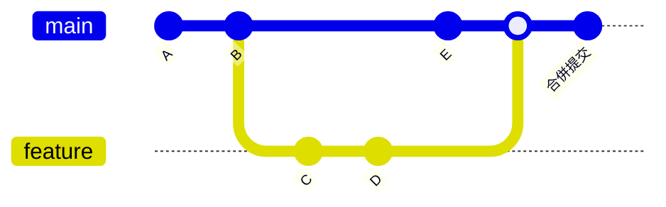
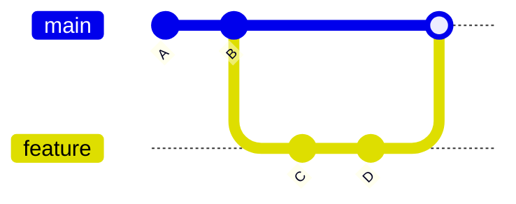
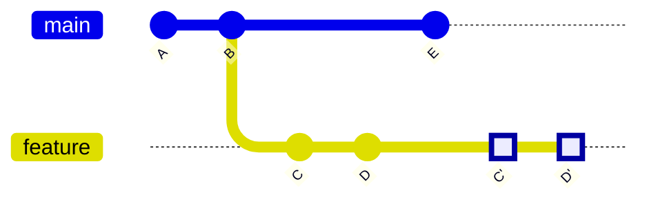
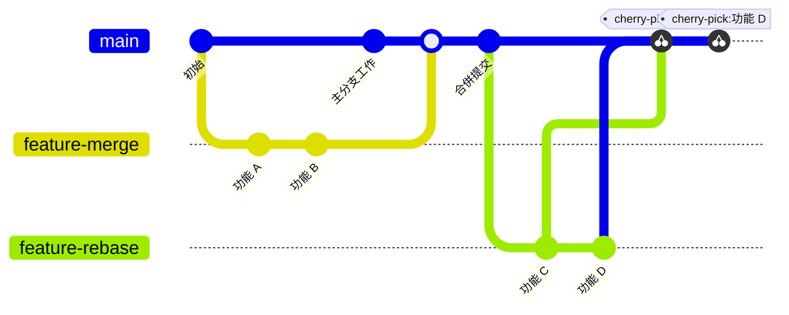
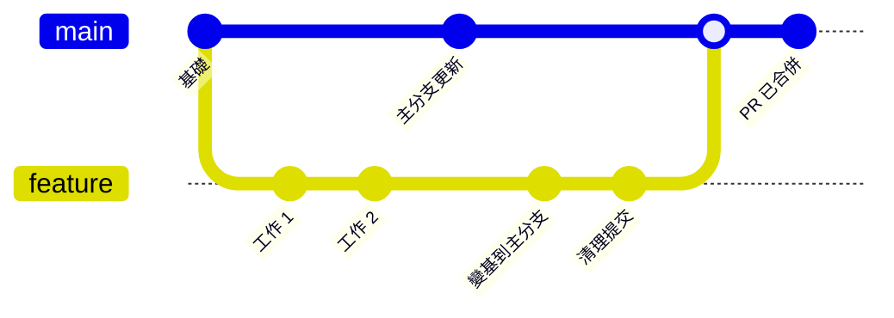
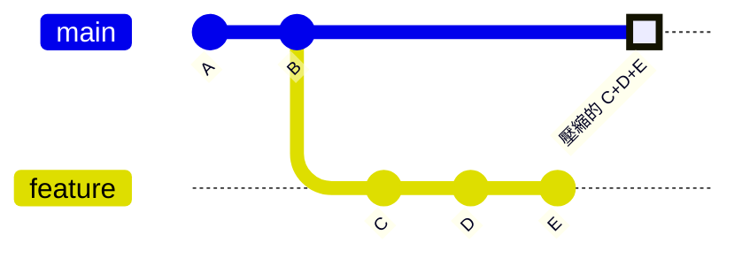
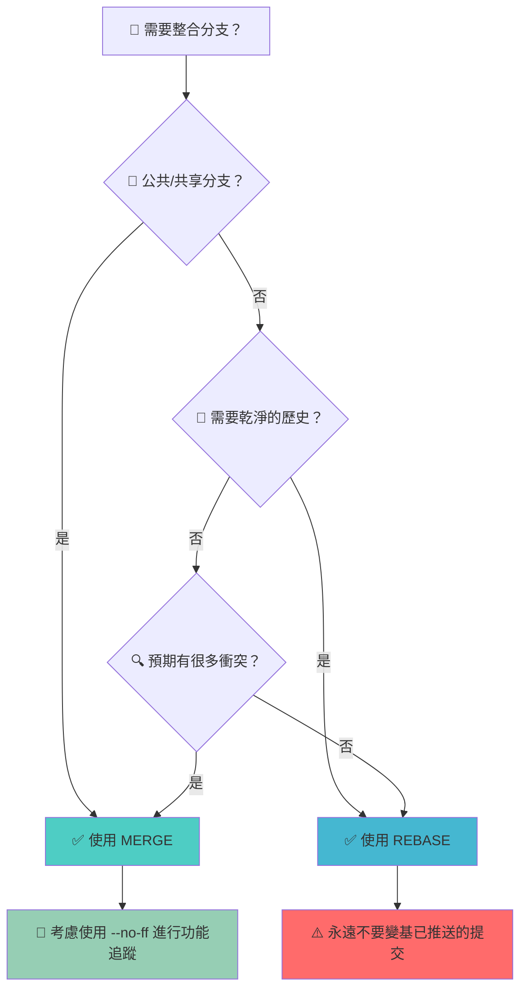

你即將把功能分支整合到主分支。你的手指懸停在鍵盤上。應該輸入 `git merge` 還是 `git rebase`？這個看似簡單的決定會影響專案的歷史記錄、團隊的工作流程，以及幾個月後除錯問題的能力。

merge 與 rebase 的爭論已經讓開發團隊分裂多年。有些人堅信 rebase 提供的乾淨線性歷史。其他人則更喜歡 merge 的完整歷史記錄，保留開發的每一個轉折。真相？兩種方法都有其用武之地，理解何時使用每種方法對於有效的 Git 工作流程至關重要。

這不是要找到「正確」的答案——而是要理解權衡。Merge 保留上下文但建立複雜的歷史。Rebase 建立乾淨的時間線但重寫歷史。你的選擇取決於團隊的工作流程、專案的需求以及你面臨的具體情況。

## 理解 Git Merge

Git merge 透過建立一個新提交來組合兩個分支，該提交將它們的歷史記錄聯繫在一起。這是預設的整合方法，保留了變更如何開發的完整上下文。

### Merge 的運作原理



**Merge 過程**：
```bash
# 切換到主分支
git checkout main

# 合併功能分支
git merge feature

# 結果：建立合併提交 M
# 歷史：A -> B -> E -> M
#              \-> C -> D /
```

### Merge 的類型

**快進合併（Fast-Forward Merge）**：
當不存在分歧的變更時，Git 只是將分支指標向前移動。



```bash
# 快進合併（無合併提交）
git merge feature
# 輸出：Fast-forward
```

**三方合併（Three-Way Merge）**：
當分支已經分歧時，Git 建立一個具有兩個父提交的合併提交。

```bash
# 三方合併（建立合併提交）
git merge feature
# 輸出：Merge made by the 'recursive' strategy
```

**非快進合併（No-Fast-Forward Merge）**：
即使可以快進合併，也強制建立合併提交。

```bash
# 始終建立合併提交
git merge --no-ff feature
```

### Merge 的優勢

!!!tip "✅ 何時使用 Merge"
    **保留完整歷史**：每個提交和分支都保持可見
    **團隊協作**：多個開發人員可以看到並行開發
    **功能追蹤**：功能之間有清晰的邊界
    **安全操作**：永遠不會重寫現有提交
    **公共分支**：適合共享分支

## 理解 Git Rebase

Git rebase 將提交從一個分支移動或重放到另一個分支，建立線性歷史。它重寫提交歷史，使其看起來好像所有工作都是按順序發生的。

### Rebase 的運作原理



**Rebase 過程**：
```bash
# 切換到功能分支
git checkout feature

# 變基到主分支
git rebase main

# 結果：在 E 之上重放 C 和 D
# 歷史：A -> B -> E -> C' -> D'
```

### 互動式 Rebase

互動式 rebase 提供強大的歷史編輯功能：

```bash
# 啟動互動式 rebase
git rebase -i HEAD~3

# 互動選項：
# pick   = 使用提交
# reword = 使用提交，但編輯訊息
# edit   = 使用提交，但停止以進行修改
# squash = 與前一個提交合併
# fixup  = 類似 squash，但捨棄訊息
# drop   = 刪除提交
```

**互動式 Rebase 範例**：
```bash
pick abc123 新增使用者認證
squash def456 修復認證中的拼寫錯誤
reword ghi789 新增密碼驗證
drop jkl012 除錯日誌

# 結果：3 個提交變成 2 個乾淨的提交
```

### Rebase 的優勢

!!!tip "✅ 何時使用 Rebase"
    **乾淨的線性歷史**：易於追蹤和理解
    **合併前**：在整合前清理功能分支
    **本地分支**：對尚未推送的提交安全
    **便於二分搜尋**：線性歷史簡化除錯
    **專業提交**：向團隊展示精心打磨的工作

## Merge vs Rebase：直接比較

### 歷史結構

**Merge 歷史**：
```
*   Merge branch 'feature'
|\  
| * 新增功能 C
| * 新增功能 B
* | 修復主分支中的 bug
* | 更新文件
|/  
* 初始提交
```

**Rebase 歷史**：
```
* 新增功能 C
* 新增功能 B
* 修復主分支中的 bug
* 更新文件
* 初始提交
```

### 視覺化比較



### 決策矩陣

| 方面 | Merge | Rebase |
|--------|-------|--------|
| **歷史** | 保留所有提交 | 建立線性歷史 |
| **複雜性** | 可能變得混亂 | 乾淨簡單 |
| **安全性** | 永不重寫歷史 | 重寫提交歷史 |
| **協作** | 對公共分支安全 | 對共享分支有風險 |
| **除錯** | 顯示並行開發 | 更容易二分搜尋 |
| **上下文** | 保留分支上下文 | 遺失分支資訊 |

## 常見工作流程和最佳實踐

### 使用 Rebase 的功能分支工作流

**功能開發的推薦方法**：

```bash
# 1. 建立功能分支
git checkout -b feature/user-profile

# 2. 在功能上工作
git commit -m "新增個人資料模型"
git commit -m "新增個人資料 API"

# 3. 保持功能與主分支同步
git checkout main
git pull
git checkout feature/user-profile
git rebase main

# 4. 合併前清理提交
git rebase -i main

# 5. 合併到主分支（建立合併提交）
git checkout main
git merge --no-ff feature/user-profile
```

### Pull Request 工作流



**Pull Request 的最佳實踐**：
```bash
# 建立 PR 前：變基並清理
git fetch origin
git rebase origin/main
git rebase -i origin/main  # 壓縮/清理提交

# 推送到遠端（變基後強制推送）
git push --force-with-lease origin feature/user-profile

# PR 批准後：使用合併提交合併
# （透過 GitHub/GitLab UI 使用 --no-ff 完成）
```

### 團隊協作規則

!!!warning "⚠️ Rebase 的黃金法則"
    **永遠不要變基已推送到公共/共享分支的提交**
    
    變基會重寫歷史。如果其他人基於你的提交進行了工作，變基會建立分歧的歷史和合併衝突。
    
    **安全**：在推送前變基本地提交
    **危險**：變基其他人已拉取的提交

## 處理衝突

### Merge 衝突

```bash
# 合併期間
git merge feature
# CONFLICT (content): Merge conflict in file.js

# 在檔案中解決衝突
# 然後完成合併
git add file.js
git commit -m "合併功能分支"
```

### Rebase 衝突

```bash
# 變基期間
git rebase main
# CONFLICT (content): Merge conflict in file.js

# 為每個提交解決衝突
git add file.js
git rebase --continue

# 或者如果需要可以中止
git rebase --abort
```

!!!anote "📋 衝突解決技巧"
    **Merge 衝突**：在合併提交時解決一次
    **Rebase 衝突**：可能需要為每個變基的提交解決
    **策略**：對於許多衝突，merge 可能更快
    **工具**：使用 `git mergetool` 或 IDE 衝突解決

## 進階技術

### 壓縮合併（Squash Merge）

將所有功能提交合併為主分支上的單一提交：

```bash
# 壓縮合併
git merge --squash feature
git commit -m "新增完整的使用者個人資料功能"

# 結果：主分支上的單一提交包含所有變更
```



**何時使用壓縮合併**：
- 功能有許多小提交
- 希望主分支歷史乾淨
- 單一提交對歷史不重要

### 使用 Autosquash 的 Rebase

```bash
# 開發期間建立 fixup 提交
git commit -m "新增功能"
git commit --fixup HEAD  # 標記為 fixup

# 稍後，在 rebase 期間自動壓縮
git rebase -i --autosquash main
# 自動排列並壓縮 fixup 提交
```

### 選擇性整合的 Cherry-Pick

```bash
# 從功能分支挑選特定提交
git cherry-pick abc123
git cherry-pick def456

# 適用於：
# - 從功能分支的熱修復
# - 選擇性功能整合
# - 將修復回移到發布分支
```

## 真實場景

### 場景 1：長期存在的功能分支

**問題**：功能分支與主分支嚴重分歧。

**解決方案**：
```bash
# 定期變基以保持更新
git checkout feature/major-refactor
git fetch origin
git rebase origin/main

# 準備合併時，最終變基和合併
git rebase -i origin/main  # 清理提交
git checkout main
git merge --no-ff feature/major-refactor
```

### 場景 2：生產環境熱修復

**問題**：關鍵 bug 需要立即修復。

**解決方案**：
```bash
# 從生產環境建立熱修復
git checkout -b hotfix/security-patch production
git commit -m "修復安全漏洞"

# 合併到生產環境（快進）
git checkout production
git merge hotfix/security-patch

# 合併到主分支（保留上下文）
git checkout main
git merge --no-ff hotfix/security-patch
```

### 場景 3：混亂的功能開發

**問題**：功能分支有許多「WIP」和「修復拼寫錯誤」提交。

**解決方案**：
```bash
# 互動式變基以清理歷史
git rebase -i main

# 壓縮相關提交
pick abc123 新增使用者服務
squash def456 修復拼寫錯誤
squash ghi789 WIP
pick jkl012 新增使用者測試
squash mno345 修復測試

# 結果：2 個乾淨的提交而不是 5 個
```

## 選擇你的策略

### 決策流程圖



### 團隊指南範本

```markdown
## 我們的 Git 整合策略

### 預設方法
- 功能分支：本地變基，使用 --no-ff 合併
- 熱修復：直接合併
- 發布分支：僅合併

### Rebase 規則
✅ 應該變基：
- 尚未推送的本地提交
- 功能分支到更新的主分支
- 在 PR 前清理提交歷史

❌ 不應該變基：
- 已推送到共享分支的提交
- 主分支/生產分支
- 其他人已拉取你的分支後

### Merge 規則
- 功能合併始終使用 --no-ff
- 熱修復使用快進
- 實驗性功能使用壓縮合併
```

## 常見問題故障排除

### 從錯誤的 Rebase 中恢復

```bash
# 查找變基前的提交
git reflog
# 輸出顯示：abc123 HEAD@{1}: rebase: checkout main

# 重設到變基前
git reset --hard HEAD@{1}

# 或重設到特定提交
git reset --hard abc123
```

### 修復強制推送問題

!!!error "🚨 強制推送出錯"
    **問題**：強制推送了變基，隊友有衝突
    
    **解決方案**：
    ```bash
    # 隊友應該重設他們的分支
    git fetch origin
    git reset --hard origin/feature-branch
    
    # 或將他們的工作變基到新歷史
    git rebase origin/feature-branch
    ```

### Merge vs Rebase 衝突

```bash
# 如果變基衝突太複雜
git rebase --abort

# 回退到合併
git merge main
```

## 結論：找到你的平衡

merge 與 rebase 的爭論不是要選邊站——而是要為工作使用正確的工具。Merge 保留歷史和上下文，使其成為協作和公共分支的理想選擇。Rebase 建立乾淨的線性歷史，非常適合本地開發和準備整合功能。

**大多數團隊的推薦方法**：
- **本地變基**：保持功能分支更新和乾淨
- **公開合併**：使用合併提交整合功能
- **清晰溝通**：確保團隊理解何時使用每種方法
- **保持一致**：記錄並遵循團隊約定

最好的 Git 工作流程是你的團隊理解並始終遵循的工作流程。從簡單的規則開始，根據需要調整，記住：目標不是完美的歷史——而是有效的協作和可維護的程式碼。

無論你選擇 merge、rebase 還是兩者的組合，理解權衡使你能夠做出明智的決定，為你的專案和團隊服務。
