You're about to integrate your feature branch into main. Your fingers hover over the keyboard. Should you type `git merge` or `git rebase`? This seemingly simple decision affects your project's history, your team's workflow, and your ability to debug issues months from now.

The merge vs rebase debate has divided development teams for years. Some swear by the clean, linear history that rebase provides. Others prefer merge's complete historical record, preserving every twist and turn of development. The truth? Both approaches have their place, and understanding when to use each is crucial for effective Git workflows.

This isn't about finding the "right" answer—it's about understanding the trade-offs. Merge preserves context but creates complex histories. Rebase creates clean timelines but rewrites history. Your choice depends on your team's workflow, your project's needs, and the specific situation you're facing.

## Understanding Git Merge

Git merge combines two branches by creating a new commit that ties together their histories. It's the default integration method and preserves the complete context of how changes were developed.

### How Merge Works


**Merge Process**:
```bash
# Start on main branch
git checkout main

# Merge feature branch
git merge feature

# Result: Creates merge commit M
# History: A -> B -> E -> M
#              \-> C -> D /
```

### Types of Merges

**Fast-Forward Merge**:
When no divergent changes exist, Git simply moves the branch pointer forward.


```bash
# Fast-forward merge (no merge commit)
git merge feature
# Output: Fast-forward
```

**Three-Way Merge**:
When branches have diverged, Git creates a merge commit with two parents.

```bash
# Three-way merge (creates merge commit)
git merge feature
# Output: Merge made by the 'recursive' strategy
```

**No-Fast-Forward Merge**:
Forces creation of a merge commit even when fast-forward is possible.

```bash
# Always create merge commit
git merge --no-ff feature
```

### Merge Advantages

!!!tip "✅ When to Use Merge"
    **Preserve complete history**: Every commit and branch remains visible
    **Team collaboration**: Multiple developers can see parallel development
    **Feature tracking**: Clear boundaries between features
    **Safe operation**: Never rewrites existing commits
    **Public branches**: Ideal for shared branches

## Understanding Git Rebase

Git rebase moves or replays commits from one branch onto another, creating a linear history. It rewrites commit history to make it appear as if all work happened sequentially.

### How Rebase Works


**Rebase Process**:
```bash
# Start on feature branch
git checkout feature

# Rebase onto main
git rebase main

# Result: Replays C and D on top of E
# History: A -> B -> E -> C' -> D'
```

### Interactive Rebase

Interactive rebase provides powerful history editing capabilities:

```bash
# Start interactive rebase
git rebase -i HEAD~3

# Interactive options:
# pick   = use commit
# reword = use commit, but edit message
# edit   = use commit, but stop for amending
# squash = combine with previous commit
# fixup  = like squash, but discard message
# drop   = remove commit
```

**Example Interactive Rebase**:
```bash
pick abc123 Add user authentication
squash def456 Fix typo in auth
reword ghi789 Add password validation
drop jkl012 Debug logging

# Result: 3 commits become 2 clean commits
```

### Rebase Advantages

!!!tip "✅ When to Use Rebase"
    **Clean linear history**: Easy to follow and understand
    **Before merging**: Clean up feature branch before integration
    **Local branches**: Safe for commits not yet pushed
    **Bisect-friendly**: Linear history simplifies debugging
    **Professional commits**: Present polished work to team

## Merge vs Rebase: Direct Comparison

### History Structure

**Merge History**:
```
*   Merge branch 'feature'
|\  
| * Add feature C
| * Add feature B
* | Fix bug in main
* | Update documentation
|/  
* Initial commit
```

**Rebase History**:
```
* Add feature C
* Add feature B
* Fix bug in main
* Update documentation
* Initial commit
```

### Visual Comparison


### Decision Matrix

| Aspect | Merge | Rebase |
|--------|-------|--------|
| **History** | Preserves all commits | Creates linear history |
| **Complexity** | Can become cluttered | Clean and simple |
| **Safety** | Never rewrites history | Rewrites commit history |
| **Collaboration** | Safe for public branches | Risky for shared branches |
| **Debugging** | Shows parallel development | Easier to bisect |
| **Context** | Preserves branch context | Loses branch information |

## Common Workflows and Best Practices

### Feature Branch Workflow with Rebase

**Recommended approach for feature development**:

```bash
# 1. Create feature branch
git checkout -b feature/user-profile

# 2. Work on feature
git commit -m "Add profile model"
git commit -m "Add profile API"

# 3. Keep feature updated with main
git checkout main
git pull
git checkout feature/user-profile
git rebase main

# 4. Clean up commits before merging
git rebase -i main

# 5. Merge into main (creates merge commit)
git checkout main
git merge --no-ff feature/user-profile
```

### Pull Request Workflow


**Best practice for pull requests**:
```bash
# Before creating PR: rebase and clean up
git fetch origin
git rebase origin/main
git rebase -i origin/main  # Squash/clean commits

# Push to remote (force push after rebase)
git push --force-with-lease origin feature/user-profile

# After PR approval: merge with merge commit
# (Done via GitHub/GitLab UI with --no-ff)
```

### Team Collaboration Rules

!!!warning "⚠️ The Golden Rule of Rebase"
    **Never rebase commits that have been pushed to public/shared branches**
    
    Rebasing rewrites history. If others have based work on your commits, rebase creates divergent histories and merge conflicts.
    
    **Safe**: Rebase local commits before pushing
    **Dangerous**: Rebase commits others have pulled

## Handling Conflicts

### Merge Conflicts

```bash
# During merge
git merge feature
# CONFLICT (content): Merge conflict in file.js

# Resolve conflicts in files
# Then complete merge
git add file.js
git commit -m "Merge feature branch"
```

### Rebase Conflicts

```bash
# During rebase
git rebase main
# CONFLICT (content): Merge conflict in file.js

# Resolve conflicts for each commit
git add file.js
git rebase --continue

# Or abort if needed
git rebase --abort
```

!!!anote "📋 Conflict Resolution Tips"
    **Merge conflicts**: Resolve once at merge commit
    **Rebase conflicts**: May need to resolve for each rebased commit
    **Strategy**: For many conflicts, merge might be faster
    **Tools**: Use `git mergetool` or IDE conflict resolution

## Advanced Techniques

### Squash Merging

Combines all feature commits into a single commit on main:

```bash
# Squash merge
git merge --squash feature
git commit -m "Add complete user profile feature"

# Result: Single commit on main with all changes
```


**When to use squash merge**:
- Feature has many small commits
- Want clean main branch history
- Individual commits not important for history

### Rebase with Autosquash

```bash
# Create fixup commits during development
git commit -m "Add feature"
git commit --fixup HEAD  # Marks as fixup

# Later, autosquash during rebase
git rebase -i --autosquash main
# Automatically arranges and squashes fixup commits
```

### Cherry-Pick for Selective Integration

```bash
# Pick specific commits from feature branch
git cherry-pick abc123
git cherry-pick def456

# Useful for:
# - Hotfixes from feature branches
# - Selective feature integration
# - Backporting fixes to release branches
```

## Real-World Scenarios

### Scenario 1: Long-Lived Feature Branch

**Problem**: Feature branch has diverged significantly from main.

**Solution**:
```bash
# Regularly rebase to stay updated
git checkout feature/major-refactor
git fetch origin
git rebase origin/main

# When ready to merge, final rebase and merge
git rebase -i origin/main  # Clean up commits
git checkout main
git merge --no-ff feature/major-refactor
```

### Scenario 2: Hotfix on Production

**Problem**: Critical bug needs immediate fix.

**Solution**:
```bash
# Create hotfix from production
git checkout -b hotfix/security-patch production
git commit -m "Fix security vulnerability"

# Merge to production (fast-forward)
git checkout production
git merge hotfix/security-patch

# Merge to main (preserve context)
git checkout main
git merge --no-ff hotfix/security-patch
```

### Scenario 3: Messy Feature Development

**Problem**: Feature branch has many "WIP" and "fix typo" commits.

**Solution**:
```bash
# Interactive rebase to clean history
git rebase -i main

# Squash related commits
pick abc123 Add user service
squash def456 Fix typo
squash ghi789 WIP
pick jkl012 Add user tests
squash mno345 Fix test

# Result: 2 clean commits instead of 5
```

## Choosing Your Strategy

### Decision Flowchart

```mermaid
flowchart TD
    A["🔀 Need to integrate branches?"] --> B{"📍 Public/shared branch?"}
    B -->|Yes| C["✅ Use MERGE"]
    B -->|No| D{"🧹 Need clean history?"}
    D -->|Yes| E["✅ Use REBASE"]
    D -->|No| F{"🔍 Many conflicts expected?"}
    F -->|Yes| C
    F -->|No| E
    
    C --> G["📝 Consider --no-ff for feature tracking"]
    E --> H["⚠️ Never rebase pushed commits"]
    
    style C fill:#4ecdc4
    style E fill:#45b7d1
    style G fill:#96ceb4
    style H fill:#ff6b6b
```



### Team Guidelines Template

```markdown
## Our Git Integration Strategy

### Default Approach
- Feature branches: Rebase locally, merge with --no-ff
- Hotfixes: Merge directly
- Release branches: Merge only

### Rebase Rules
✅ DO rebase:
- Local commits not yet pushed
- Feature branch onto updated main
- To clean up commit history before PR

❌ DON'T rebase:
- Commits pushed to shared branches
- Main/production branches
- After others have pulled your branch

### Merge Rules
- Always use --no-ff for feature merges
- Fast-forward for hotfixes
- Squash merge for experimental features
```

## Troubleshooting Common Issues

### Recovering from Bad Rebase

```bash
# Find commit before rebase
git reflog
# Output shows: abc123 HEAD@{1}: rebase: checkout main

# Reset to before rebase
git reset --hard HEAD@{1}

# Or reset to specific commit
git reset --hard abc123
```

### Fixing Force Push Issues

!!!error "🚨 Force Push Gone Wrong"
    **Problem**: Force pushed rebase, teammates have conflicts
    
    **Solution**: Teammates should reset their branches using `git fetch origin` followed by `git reset --hard origin/feature-branch`, or rebase their work onto new history with `git rebase origin/feature-branch`

### Merge vs Rebase Conflicts

```bash
# If rebase conflicts are too complex
git rebase --abort

# Fall back to merge
git merge main
```

## Conclusion: Finding Your Balance

The merge vs rebase debate isn't about choosing sides—it's about using the right tool for the job. Merge preserves history and context, making it ideal for collaboration and public branches. Rebase creates clean, linear histories perfect for local development and preparing features for integration.

**Recommended approach for most teams**:
- **Rebase locally**: Keep feature branches updated and clean
- **Merge publicly**: Integrate features with merge commits
- **Communicate clearly**: Ensure team understands when each is used
- **Stay consistent**: Document and follow team conventions

The best Git workflow is one that your team understands and follows consistently. Start with simple rules, adjust based on your needs, and remember: the goal isn't perfect history—it's effective collaboration and maintainable code.

Whether you choose merge, rebase, or a combination of both, understanding the trade-offs empowers you to make informed decisions that serve your project and team.
