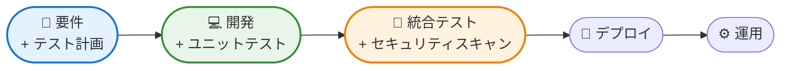
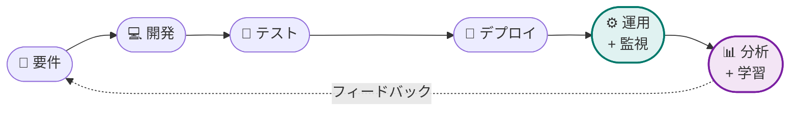
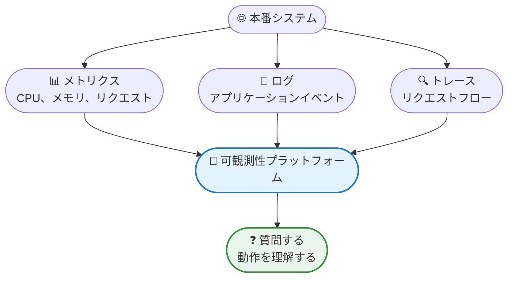
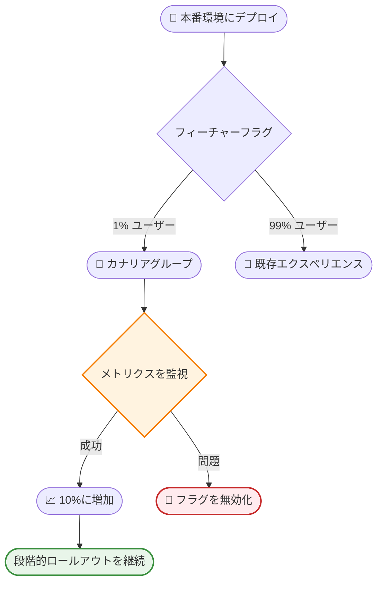
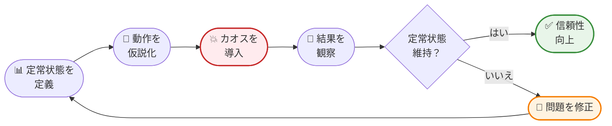
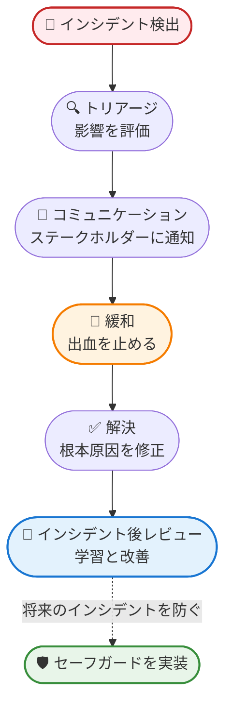
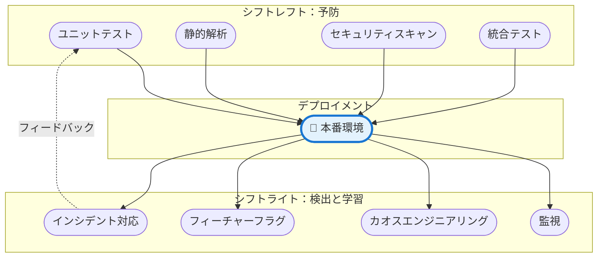

DevOpsの世界は何年も「シフトレフト」について話題にしてきました。テスト、セキュリティ、品質チェックを開発サイクルの早い段階に移行することです。ユニットテストを自動化し、CI/CDパイプラインにセキュリティスキャンを統合し、本番環境に到達する前にバグを捕捉してきました。これは革命的でした。

しかし、ここに問題があります：シフトレフトは物語の半分に過ぎません。

本番前のプロセスを完璧にすることに忙しくしている間に、本番環境はますます複雑になってきました。マイクロサービス、分散システム、クラウドネイティブアーキテクチャは、開発環境では予測不可能な障害モードを生み出します。どれだけ本番前テストを行っても、実際のユーザー、実際のデータ、実際のインフラストラクチャの規模での混沌をシミュレートすることはできません。

ここで「シフトライト」が登場します。DevOpsプラクティスを本番環境とその先に拡張することです。これはシフトレフトの原則を放棄することではありません。本番環境を学習環境として受け入れるプラクティスでサイクルを完成させることです。

## シフトレフトの理解：簡単な振り返り

シフトライトを探求する前に、シフトレフトが達成したことを明確にしましょう。従来のソフトウェア開発ライフサイクルは次のようなものでした：


テストは開発が「完了」した後の遅い段階で行われました。この段階でバグを見つけることは高コストでした。コードは既に他のプロジェクトに移っている開発者に送り返す必要がありました。フィードバックループは遅く、コストがかかりました。

シフトレフトは品質プラクティスを早い段階に移行しました：



**主要なシフトレフトプラクティス：**
- **テスト駆動開発（TDD）**：コードの前にテストを書く
- **継続的インテグレーション**：すべてのコミットで自動テスト
- **静的コード解析**：コードを実行せずに問題を捕捉
- **セキュリティスキャン**：脆弱性を早期に発見
- **Infrastructure as Code**：インフラストラクチャ構成のテスト

これらのプラクティスはソフトウェア品質を劇的に改善し、コストを削減しました。しかし、共通の制限があります：すべて本番環境の前に行われます。

## シフトライトの哲学

シフトライトは基本的な真実を認識しています：本番環境は異なります。開発環境でどれだけ徹底的にテストしても、本番環境は驚きをもたらします。ユーザーは予測不可能に行動します。インフラストラクチャは予期しない方法で失敗します。負荷パターンは予想しなかったボトルネックを生み出します。

本番環境を「ただ動作すべき」ブラックボックスとして扱う代わりに、シフトライトは本番環境を学習環境として受け入れます。デプロイを超えてDevOpsプラクティスを拡張します：



**コアシフトライト原則：**

**本番環境はテスト環境**：一部の問題は本番環境でのみ現れることを受け入れます。それらを優雅に検出して処理するようにシステムを設計します。

**監視よりも可観測性**：メトリクスを収集するだけでなく、システムの動作を理解します。システムが答えられる質問をします。

**早く失敗し、より早く学ぶ**：制御された障害を受け入れて回復力を構築します。本番インシデントから学んでシステム全体を改善します。

**継続的フィードバック**：本番データを使用して開発の意思決定に情報を提供します。運用と開発の間のループを閉じます。

!!!tip "💡 シフトレフト vs シフトライト"
    **シフトレフト**：本番環境の前に問題を防ぐ
    **シフトライト**：本番環境での問題を検出、対応、学習する
    
    両方が不可欠です。シフトレフトは本番環境に到達する問題の数を減らします。シフトライトは、到達する避けられない問題を確実に処理します。

## 主要なシフトライトプラクティス

シフトライトを効果的にするプラクティスを探求しましょう。これらは理論的な概念ではありません。大規模なシステムを運用する組織で実証済みのアプローチです。

### 1. 本番監視と可観測性

従来の監視は「システムは稼働していますか？」と尋ねます。可観測性は「システムはなぜこのように動作しているのですか？」と尋ねます。

**監視**は事前定義されたメトリクスを追跡します：CPU使用率、メモリ消費、リクエスト率、エラー数。以前にこれらの問題を見たことがあるため、何を測定するかがわかります。

**可観測性**は、システムの動作について任意の質問をすることができます：「なぜこの特定のユーザーのリクエストは5秒かかったのか？」「午後2時から3時の間に何が変わってレイテンシが急上昇したのか？」事前に質問を予測する必要はありません。



**可観測性の3つの柱：**

**メトリクス**：時間経過に伴う数値測定（リクエスト率、エラー率、レイテンシパーセンタイル）。これらは高レベルの健全性指標を提供します。

**ログ**：コンテキストを持つ個別のイベント（ユーザーがログインした、支払いが処理された、エラーが発生した）。これらは特定のイベントに関する詳細情報を提供します。

**トレース**：分散システムを通るリクエストフロー（単一のユーザーリクエストがマイクロサービスを通ってどのように移動するか）。これらは依存関係とボトルネックを明らかにします。

!!!example "🎬 実世界のシナリオ"
    監視は午後2時15分にエラー率が増加したことを示しています。それが監視です。
    
    可観測性があれば、次のことができます：
    1. 午後2時15分以降に失敗したリクエストにトレースをフィルタリング
    2. すべてが特定のマイクロサービスを呼び出していることを発見
    3. そのサービスからのログを確認し、午後2時14分にデプロイが発生したことを発見
    4. バグを導入した正確なコード変更を特定
    
    これらすべてが数時間ではなく数分で発生します。

**可観測性の実装：**

- **構造化ログ**：検索可能なフィールドを持つ一貫したログ形式を使用
- **分散トレーシング**：サービス間でリクエストを追跡するためにコードを計装
- **カスタムメトリクス**：インフラストラクチャだけでなく、ビジネス固有の指標を追跡
- **相関ID**：システム間で関連イベントをリンク
- **ダッシュボード**：リアルタイムでシステムの動作を視覚化

### 2. フィーチャーフラグとプログレッシブデリバリー

フィーチャーフラグはデプロイとリリースを分離します。ユーザーに公開せずに本番環境にコードをデプロイし、特定のオーディエンスに対して段階的に機能を有効にできます。

**フィーチャーフラグの仕組み：**

```javascript
if (featureFlags.isEnabled('new-checkout-flow', user)) {
    // 新しいコードパス
    return newCheckoutExperience(user);
} else {
    // 既存のコードパス
    return currentCheckoutExperience(user);
}
```

このシンプルなパターンは強力なデプロイ戦略を可能にします：

**カナリアリリース**：1%のユーザーに対して機能を有効にし、問題を監視し、徐々に100%に増やします。

**A/Bテスト**：異なるユーザーグループに異なるバージョンを表示し、どちらがより良いパフォーマンスを発揮するかを測定します。

**リングデプロイメント**：最初に内部ユーザーにロールアウトし、次にベータユーザー、次に一般提供。

**キルスイッチ**：再デプロイせずに問題のある機能を即座に無効化します。



**メリット：**

- **リスク削減**：問題は少数のユーザーにのみ影響
- **高速ロールバック**：再デプロイせずに機能を即座に無効化
- **データ駆動の意思決定**：完全なロールアウト前に実際のユーザー行動を測定
- **分離されたリリース**：準備ができたらデプロイし、自信があるときにリリース

!!!warning "⚠️ フィーチャーフラグの衛生管理"
    フィーチャーフラグは強力ですが、技術的負債になる可能性があります。プラクティスを確立します：
    
    - 完全なロールアウト後にフラグを削除（死んだフラグを蓄積しない）
    - フラグの目的と所有者を文書化
    - 一時的なフラグに有効期限を設定
    - フラグの使用状況を監視し、未使用のフラグを定期的にクリーンアップ

### 3. カオスエンジニアリング

カオスエンジニアリングは、本番システムに意図的に障害を導入して、乱流状態に耐えられることを検証します。直感に反するように聞こえますが、シンプルな前提に基づいています：障害が発生する場合（そして発生します）、自分の条件で発生する方が良いです。

**カオスエンジニアリングプロセス：**

1. **定常状態を定義**：通常のシステム動作を示すメトリクスを確立（例：リクエストの99.9%が200ms以内に成功）

2. **仮説を立てる**：何かが失敗したときにシステムがどのように動作すべきかを予測（例：「支払いサービスがダウンした場合、ユーザーはフレンドリーなエラーメッセージを見て、注文は再試行のためにキューに入るべき」）

3. **カオスを導入**：本番環境で意図的に障害を引き起こす（例：支払いサービスインスタンスを終了）

4. **観察**：システムが定常状態を維持するかどうかを監視

5. **学習と改善**：システムが期待通りに動作しない場合、問題を修正して繰り返す



**一般的なカオス実験：**

**ネットワーク障害：**
- サービス間にレイテンシを導入
- パケットをランダムにドロップ
- ネットワークパーティションをシミュレート

**リソース枯渇：**
- ディスクスペースを埋める
- 利用可能なすべてのメモリを消費
- CPU使用率を最大化

**サービス障害：**
- ランダムなインスタンスを終了
- 特定のサービスをクラッシュ
- 依存関係の障害をシミュレート

**時間ベースの問題：**
- クロックスキューを導入
- タイムゾーンの問題をシミュレート
- うるう秒の処理をテスト

!!!anote "🎯 小さく始める"
    本番サーバーをランダムに終了することでカオスエンジニアリングを始めないでください。次のことから始めます：
    
    1. **非本番環境**：最初にステージングで練習
    2. **小さな影響範囲**：トラフィックのサブセットのみに影響
    3. **営業時間**：チームが利用可能なときに実験を実行
    4. **段階的エスカレーション**：軽微な問題から始め、時間をかけて深刻度を増やす
    
    信頼性が高まるにつれて、範囲を拡大し、実験を自動化します。

**カオスエンジニアリングのツール：**

- **Chaos Monkey**：インスタンスをランダムに終了（Netflixのオリジナルツール）
- **Gremlin**：包括的な障害注入を備えた商用プラットフォーム
- **Chaos Mesh**：Kubernetesネイティブのカオスエンジニアリングプラットフォーム
- **AWS Fault Injection Simulator**：AWS向けのマネージドカオスエンジニアリング

### 4. 本番テスト

一部のテストは本番環境でのみ意味があります。これらはバグを見つけることではなく、実際のシステムが実際の条件下で正しく動作することを検証することです。

**合成監視**：ユーザージャーニーをシミュレートして本番環境に対して継続的に実行される自動テスト：

```javascript
// 5分ごとに実行される合成テスト
async function checkoutFlow() {
    // 1. 製品を閲覧
    await navigateTo('/products');
    
    // 2. カートにアイテムを追加
    await addToCart('product-123');
    
    // 3. チェックアウトに進む
    await checkout();
    
    // 4. 注文確認を検証
    assert(orderConfirmed());
}
```

これらのテストは、実際のユーザーが遭遇する前に問題を警告します。

**スモークテスト**：デプロイ後の重要なパスが機能することの迅速な検証：
- ユーザーはログインできますか？
- ダッシュボードを表示できますか？
- コアアクションを実行できますか？

**本番カナリア**：実際のトラフィックを受信するが、より綿密に監視される専用インスタンス。カナリアが問題を示す場合、すべてのユーザーに影響を与える前にトラフィックがリダイレクトされます。

!!!example "🎬 本番テストの実践"
    eコマースサイトは毎分合成テストを実行します：
    - 製品を閲覧
    - カートに追加
    - チェックアウトを完了
    
    午前3時47分、チェックアウトテストが失敗します。支払いゲートウェイがダウンしています。
    
    チームはすぐに警告を受け、バックアップ支払いプロバイダーに切り替えます。最初の実際の顧客が午前6時15分にチェックアウトしようとすると、すべてが完璧に機能します。
    
    本番テストがなければ、顧客が苦情を言うまで問題は発見されなかったでしょう。

### 5. インシデント対応と学習

インシデントは避けられません。重要なのは、どのように対応し、何を学ぶかです。

**効果的なインシデント対応：**

**検出**：可観測性データに基づく自動アラートが問題を迅速に捕捉します。

**トリアージ**：オンコールエンジニアが深刻度と影響を評価し、エスカレーションするかどうかを決定します。

**コミュニケーション**：ステータスページと内部チャネルがステークホルダーに情報を提供し続けます。

**緩和**：即座の問題を修正（ロールバック、フェイルオーバー、スケールアップ）。

**解決**：根本原因に永続的に対処します。

**インシデント後レビュー**：非難なしに何が起こったかから学びます。



**非難のないポストモーテム：**

目標はインシデントを引き起こした人を見つけることではなく、システムがそれを許可した理由を理解することです。尋ねるべき質問：

- 何が起こったか？（イベントのタイムライン）
- なぜ起こったか？（症状だけでなく根本原因）
- どのように検出したか？（より速く検出できたか？）
- どのように対応したか？（何がうまくいったか？何がうまくいかなかったか？）
- どのように防ぐか？（具体的なアクションアイテム）

!!!tip "📚 インシデントから学ぶ"
    すべてのインシデントは学習の機会です：
    
    - **徹底的に文書化**：将来のあなたは詳細を忘れます
    - **広く共有**：他のチームはあなたの経験から学べます
    - **アクションアイテムを追跡**：改善が実際に行われることを確認
    - **MTTRを測定**：平均復旧時間を主要メトリクスとして追跡
    - **学習を祝う**：インシデントをうまく処理するチームを認識

## シフトレフトとシフトライトのバランス

最も効果的なDevOps組織は、シフトレフトとシフトライトのどちらかを選択するのではなく、両方を受け入れます。それぞれがソフトウェア品質の異なる側面に対処します：



**シフトレフトを強調すべき場合：**

- **既知のリスク**：以前に見たことがあり、テストできる問題
- **コンプライアンス要件**：デプロイ前に合格する必要があるセキュリティと規制チェック
- **コスト効果的な予防**：早期に捕捉するのは安価だが、本番環境で修正するのは高価な問題
- **決定論的動作**：予測可能に動作し、完全にテストできる機能

**シフトライトを強調すべき場合：**

- **未知の未知**：事前に予測またはテストできない問題
- **スケール依存の問題**：本番負荷下でのみ現れる動作
- **ユーザー行動**：実際のユーザーがシステムと実際にどのように対話するか
- **インフラストラクチャの複雑さ**：創発的な障害モードを持つ分散システム
- **迅速なイノベーション**：市場投入速度が完璧な本番前テストを上回る場合

!!!success "✨ 理想的なバランス"
    **シフトレフト**で本番環境の前に捕捉できるものを捕捉します。
    **シフトライト**で捕捉できないものを処理します。
    
    一緒に、完全な品質戦略を作成します：
    - 予測可能な問題を防ぐ（シフトレフト）
    - 予測不可能な問題を迅速に検出（シフトライト）
    - 本番環境から学んで予防を改善（フィードバックループ）

## シフトライトの始め方

シフトライトプラクティスを実装する準備はできましたか？実用的なロードマップは次のとおりです：

### フェーズ1：基盤（1〜4週目）

**可観測性の改善：**
- サービス全体で構造化ログを実装
- 重要なパスに分散トレーシングを追加
- 主要なビジネスメトリクスのダッシュボードを作成
- 異常に対するアラートを設定

**小さく始める：**
- 1つのサービスまたはコンポーネントから始める
- 何かを変更する前に現在の動作を理解することに焦点を当てる
- 学んだことを文書化

### フェーズ2：プログレッシブデリバリー（5〜8週目）

**フィーチャーフラグの実装：**
- フィーチャーフラグプラットフォームを選択（LaunchDarkly、Split、またはオープンソースの代替）
- フラグの背後にある1つの新機能から始める
- 段階的ロールアウトでカナリアリリースを練習
- フラグの衛生管理プラクティスを確立

**合成監視：**
- 重要なユーザージャーニーを特定
- 本番環境に対して実行される自動テストを作成
- テスト失敗のアラートを設定
- カバレッジを徐々に拡大

### フェーズ3：回復力テスト（9〜12週目）

**カオスエンジニアリング：**
- 非本番環境で開始
- チームが立ち会う営業時間中に最初の実験を実行
- シンプルな障害から始める（1つのインスタンスを終了）
- 学習を文書化し、発見された問題を修正
- 実験の複雑さを徐々に増やす

**インシデント対応：**
- 現在のインシデント対応プロセスを文書化
- オンコールローテーションを確立
- 一般的な問題のランブックを作成
- ゲームデイでインシデント対応を練習

### フェーズ4：継続的改善（継続中）

**フィードバックループ：**
- インシデント後に非難のないポストモーテムを実施
- アクションアイテムを完了まで追跡
- チーム間で学習を共有
- 主要メトリクスを測定して改善（MTTR、デプロイ頻度、変更失敗率）

**文化：**
- 失敗から学ぶことを祝う
- 回復力を改善するチームに報酬を与える
- 本番インサイトを開発チームと共有
- 可観測性データを全員がアクセスできるようにする

!!!tip "🎯 成功メトリクス"
    シフトライトの効果を測定するために、これらのメトリクスを追跡します：
    
    - **平均検出時間（MTTD）**：問題を発見する速さ
    - **平均復旧時間（MTTR）**：問題を解決する速さ
    - **変更失敗率**：インシデントを引き起こすデプロイの割合
    - **デプロイ頻度**：安全にデプロイできる頻度
    - **顧客への影響**：インシデントの影響を受けるユーザーの割合
    
    シフトライトプラクティスは、時間の経過とともにこれらすべてを改善するはずです。

## 結論：DevOpsサイクルの完成

シフトレフトは、問題を早期に捕捉することでソフトウェア開発を変革しました。バグを削減し、セキュリティを改善し、配信を加速しました。これらの成果は現実的で価値があります。

しかし、シフトレフトだけでは不完全です。本番環境は複雑すぎ、ユーザーの行動は予測不可能すぎ、インフラストラクチャは分散しすぎて、本番前テストですべてを捕捉することはできません。本番環境を学習環境として受け入れるプラクティスが必要です。

シフトライトはDevOpsサイクルを完成させます。可観測性、プログレッシブデリバリー、カオスエンジニアリング、本番テスト、継続的学習により、デプロイを超えて品質プラクティスを拡張します。シフトレフトと一緒に、ソフトウェア品質への包括的なアプローチを作成します：

- 本番環境の前にできることを**防ぐ**（シフトレフト）
- 防げないことを迅速に**検出**（シフトライト）
- 本番環境から**学んで**予防を改善（フィードバックループ）

DevOpsの未来は、シフトレフトとシフトライトのどちらかを選択することではなく、両方をマスターすることです。そうする組織は、より回復力のあるシステムを構築し、インシデントに迅速に対応し、ユーザーにより良いエクスペリエンスを提供します。

問題は、シフトライトするかどうかではありません。どれだけ早く始められるかです。

!!!quote "💭 最後の考え"
    「希望は戦略ではありませんが、恐怖も戦略ではありません。シフトレフトは予防を通じてリスクを削減します。シフトライトは回復力を通じて信頼性を構築します。一緒に、ソフトウェアの構築と運用方法を変革します。」
