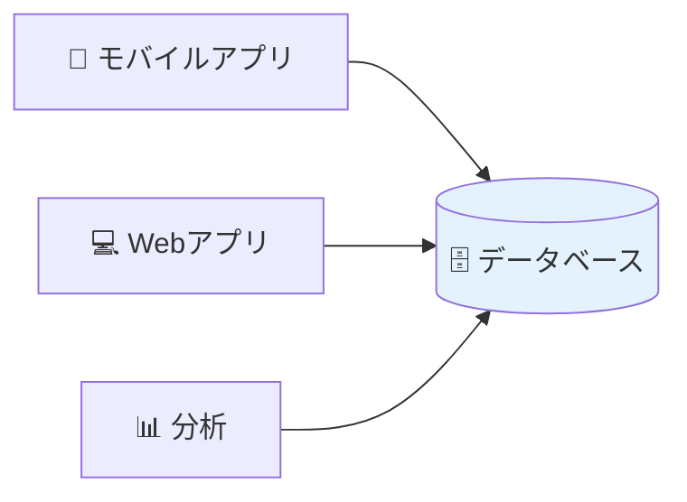
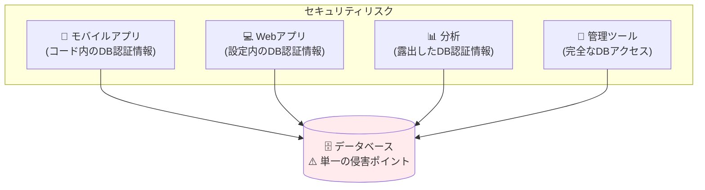
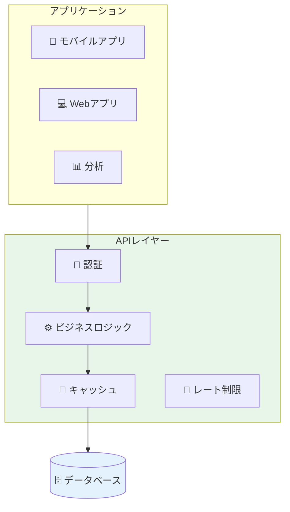
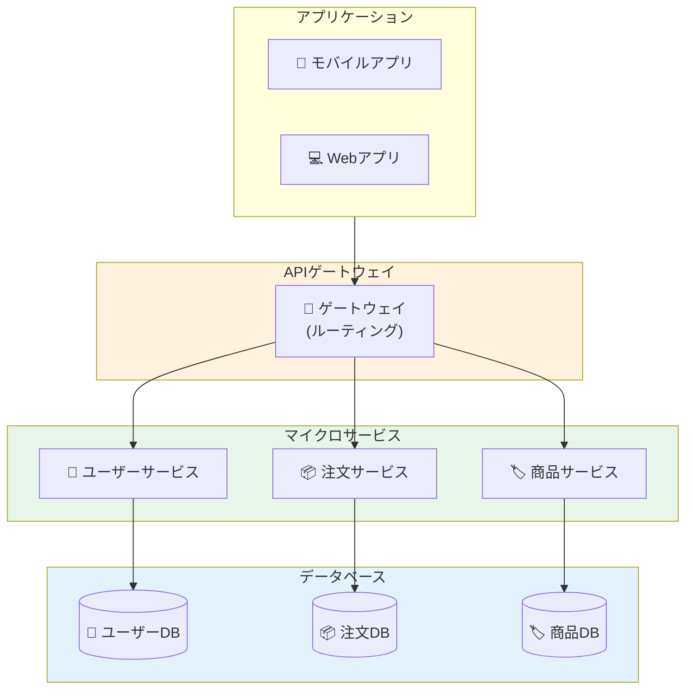
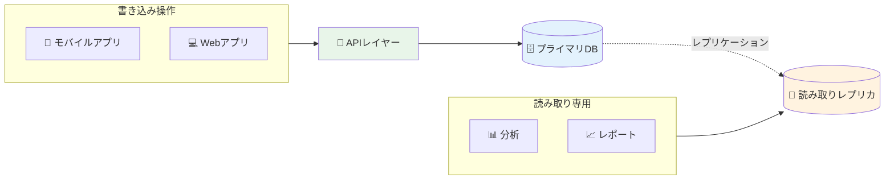
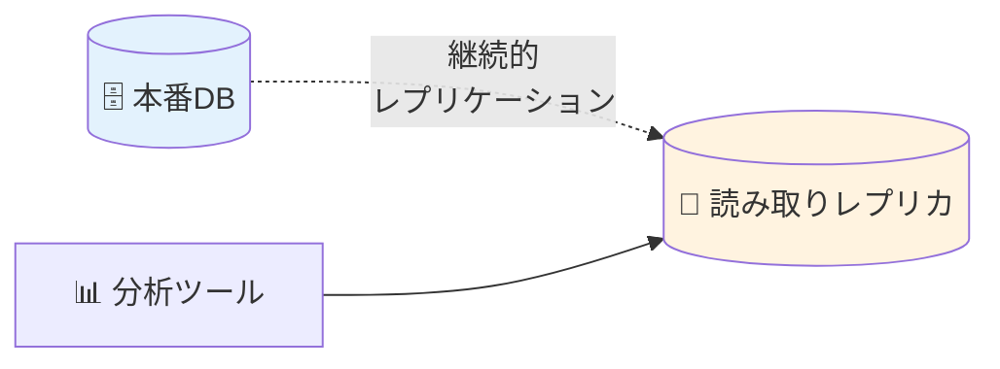
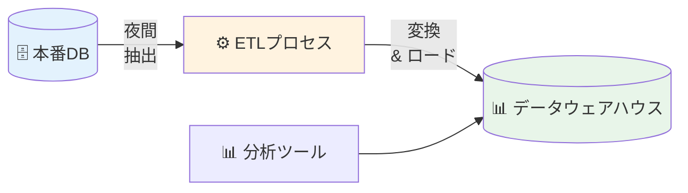
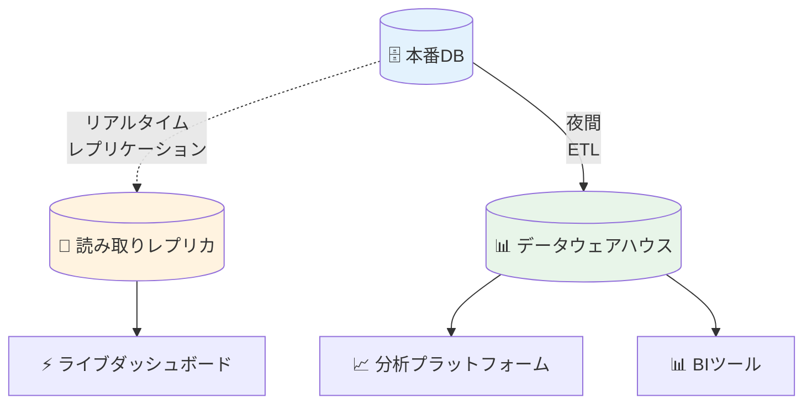

CRMシステムは顧客データを必要としています。分析ダッシュボードも同じデータを必要としています。モバイルアプリも必要です。データベースにはすべてがあります。なぜすべてを直接接続させないのでしょうか？

論理的に思えます。しかし、エンタープライズアーキテクチャでは、この単純な決定がシステムのスケーラビリティ、セキュリティ、保守性を左右する可能性があります。

## 問題

**エンタープライズ環境で複数のアプリケーションがデータベースに直接接続すべきでしょうか？**

短い答え：**状況によりますが、通常はノーです。**

長い答え：両面を探ってみましょう。

## データベース直接アクセスの利点

### メリット

**1. シンプルさ**



- 可動部分が少ない
- 保守するミドルウェアがない
- 開発が簡単
- 迅速なプロトタイピング

**2. パフォーマンス**

直接接続は中間層を排除します：

```
直接: アプリ → データベース (1ホップ)
APIレイヤー: アプリ → API → データベース (2ホップ)
```

- 低レイテンシ
- ネットワーク呼び出しが少ない
- シリアライゼーションのオーバーヘッドがない

**3. リアルタイムデータ**

アプリケーションは常に最新のデータを参照します：
- キャッシュ無効化の問題がない
- 同期遅延がない
- 即座の一貫性

**4. 開発速度**

開発者は以下が可能：
- 必要なものを正確にクエリ
- 迅速な反復
- データベース機能を直接使用（ストアドプロシージャ、トリガー）

### 適している場合

**小規模組織：**
- 2〜3のアプリケーション
- 単一の開発チーム
- 低トラフィック量
- 限られた予算

**内部ツール：**
- 管理ダッシュボード
- レポートツール
- データ分析スクリプト
- 一回限りのユーティリティ

**プロトタイプ：**
- MVP開発
- 概念実証
- 迅速な実験

## データベース直接アクセスに反対する理由

### 問題点

#### 1. セキュリティの悪夢

**問題：** すべてのアプリケーションがデータベース認証情報を必要とします。



**リスク：**

- **認証情報の拡散：** 複数のコードベースにパスワード
- **モバイルアプリ：** APK/IPAから認証情報を抽出可能
- **サードパーティアクセス：** 特定のアプリアクセスの取り消しが困難
- **監査の悪夢：** どのアプリがどのクエリを実行したか追跡できない

**実例：**

```
モバイルアプリが逆コンパイルされる → データベースパスワードが抽出される
→ 攻撃者が完全なデータベースアクセスを取得
→ すべての顧客データが侵害される
```

#### 2. 密結合

**問題：** アプリケーションがデータベーススキーマに直接依存します。

**スキーマ変更の影響：**

```sql
-- カラム名変更
ALTER TABLE users RENAME COLUMN email TO email_address;
```

**結果：**
- ❌ モバイルアプリが壊れる
- ❌ Webアプリが壊れる
- ❌ 分析が壊れる
- ❌ 管理ツールが壊れる
- ❌ すべて同時更新が必要

**デプロイの悪夢：**

```
データベース移行 → すべてのアプリを同時にデプロイする必要
→ 調整されたダウンタイムが必要
→ 失敗のリスクが高い
```

#### 3. ビジネスロジック層がない

**問題：** ビジネスルールがアプリケーション全体に散在します。

**例：割引計算**

```
モバイルアプリ: 10%割引ロジック
Webアプリ: 15%割引ロジック（古い）
分析: 割引ロジックなし（間違ったレポート）
```

**結果：**
- 一貫性のない動作
- 重複コード
- 保守が困難
- 監査が困難

**ストアドプロシージャはどうでしょうか？**

「ビジネスロジックをストアドプロシージャに入れれば問題解決！」と主張する人もいます。

**ストアドプロシージャアプローチ：**

```sql
-- データベース内の集中化された割引ロジック
CREATE PROCEDURE calculate_order_total(
  IN user_id INT,
  IN order_id INT,
  OUT final_total DECIMAL(10,2)
)
BEGIN
  DECLARE base_total DECIMAL(10,2);
  DECLARE discount DECIMAL(10,2);
  DECLARE is_premium BOOLEAN;
  
  SELECT total INTO base_total FROM orders WHERE id = order_id;
  SELECT premium INTO is_premium FROM users WHERE id = user_id;
  
  IF is_premium THEN
    SET discount = base_total * 0.15;
  ELSEIF base_total > 100 THEN
    SET discount = base_total * 0.10;
  ELSE
    SET discount = 0;
  END IF;
  
  SET final_total = base_total - discount;
END;
```

**利点：**
- ✅ ロジックが一箇所に集中
- ✅ すべてのアプリが同じ計算を使用
- ✅ 一貫した動作が保証される
- ✅ パフォーマンス（データに近い場所で実行）

**しかし重大な欠点：**

**1. 限られた言語機能：**

```sql
-- SQL/PL-SQLは複雑なロジック用に設計されていない
-- モダンな言語機能がない：
-- - 依存性注入なし
-- - 限られたエラーハンドリング
-- - ユニットテストフレームワークなし
-- - IDEサポートなし（Java/Python/Node.jsと比較して）
```

**2. テストが困難：**

```javascript
// アプリケーションコード - テストが簡単
function calculateDiscount(user, order) {
  if (user.isPremium) return order.total * 0.15;
  return order.total > 100 ? order.total * 0.10 : 0;
}

// ユニットテスト
test('premium user gets 15% discount', () => {
  const user = { isPremium: true };
  const order = { total: 100 };
  expect(calculateDiscount(user, order)).toBe(15);
});
```

```sql
-- ストアドプロシージャ - テストが困難
-- データベース接続が必要
-- テストデータのセットアップが必要
-- テスト実行が遅い
-- モック/スタブがない
```

**3. ベンダーロックイン：**

```
Oracle PL/SQL ≠ SQL Server T-SQL ≠ PostgreSQL PL/pgSQL

-- データベース移行はすべてのプロシージャの書き直しを意味する
-- 異なる構文、機能、制限
```

**4. デプロイの複雑さ：**

```
アプリケーションデプロイ：
- Gitコミット → CI/CD → デプロイ → ロールバックが簡単

ストアドプロシージャデプロイ：
- 手動SQLスクリプト
- バージョン管理が困難
- ロールバックがリスキー
- アプリコードとのアトミックデプロイができない
```

**5. 限られた可観測性：**

```javascript
// アプリケーションコード - 完全な可観測性
function processOrder(order) {
  logger.info('Processing order', { orderId: order.id });
  const discount = calculateDiscount(order);
  logger.debug('Discount calculated', { discount });
  metrics.increment('orders.processed');
  return applyDiscount(order, discount);
}
```

```sql
-- ストアドプロシージャ - 限られた可観測性
-- ログ追加が困難
-- メトリクス追加が困難
-- 実行トレースが困難
-- 本番環境でのデバッグが困難
```

**6. チームスキル：**

```
ほとんどの開発者が知っている: JavaScript, Python, Java, Go
より少ない開発者が知っている: PL/SQL, T-SQL, PL/pgSQL

→ 採用が困難
→ 保守が困難
→ 知識のサイロ化
```

**ストアドプロシージャが適している場合：**

✅ **データ集約的な操作：**
```sql
-- 一括データ処理
CREATE PROCEDURE archive_old_orders()
BEGIN
  INSERT INTO orders_archive 
  SELECT * FROM orders WHERE created_at < DATE_SUB(NOW(), INTERVAL 1 YEAR);
  
  DELETE FROM orders WHERE created_at < DATE_SUB(NOW(), INTERVAL 1 YEAR);
END;
```

✅ **パフォーマンスクリティカルなクエリ：**
```sql
-- 複雑な集計はデータベース内の方が良い
CREATE PROCEDURE get_sales_report(IN start_date DATE, IN end_date DATE)
BEGIN
  SELECT 
    DATE(created_at) as date,
    COUNT(*) as order_count,
    SUM(total) as revenue,
    AVG(total) as avg_order_value
  FROM orders
  WHERE created_at BETWEEN start_date AND end_date
  GROUP BY DATE(created_at);
END;
```

✅ **レガシーシステム：**
- すでにストアドプロシージャに大きく投資している
- 移行コストが高すぎる
- データベースプログラミングのチーム専門知識

**モダンな代替案：薄いストアドプロシージャ**

```sql
-- データアクセスのみのストアドプロシージャ
CREATE PROCEDURE get_user_orders(IN user_id INT)
BEGIN
  SELECT * FROM orders WHERE user_id = user_id;
END;
```

```javascript
// アプリケーション内のビジネスロジック
class OrderService {
  async calculateTotal(userId, orderId) {
    const orders = await db.call('get_user_orders', [userId]);
    const user = await db.call('get_user', [userId]);
    
    // ビジネスロジックはここ - テスト可能、保守可能
    const discount = this.calculateDiscount(user, orders);
    return this.applyDiscount(orders, discount);
  }
}
```

**ストアドプロシージャの評決：**

ストアドプロシージャはロジックを集中化できますが：
- ❌ 直接アクセスの問題を解決しない
- ❌ 新しい保守の課題を生む
- ❌ 技術選択を制限する
- ⚠️ データ集約的な操作には控えめに使用すべき
- ✅ より良い方法：ビジネスロジックをアプリケーション層に保持

#### 4. パフォーマンスボトルネック

**問題：** データベースが圧倒されます。

**接続制限：**

```
PostgreSQLデフォルト: 100接続
MySQLデフォルト: 151接続

10アプリ × 各20接続 = 200接続
→ データベースが新しい接続を拒否
→ アプリケーションがクラッシュ
```

**クエリの混乱：**

```
アプリ1: SELECT * FROM orders (フルテーブルスキャン)
アプリ2: 5テーブルにわたる複雑なJOIN
アプリ3: 最適化されていないクエリ（インデックスなし）
→ データベースCPUが100%
→ すべてのアプリが遅くなる
```

#### 5. アクセス制御がない

**問題：** アプリケーションが過剰なアクセス権を持ちます。

**典型的なセットアップ：**

```sql
-- すべてのアプリが同じユーザーを使用
GRANT ALL PRIVILEGES ON database.* TO 'app_user'@'%';
```

**リスク：**
- 分析ツールがデータをDELETEできる
- モバイルアプリがテーブルをDROPできる
- 最小権限の原則がない
- 偶発的なデータ損失

#### 6. 監視が困難

**問題：** アプリケーションの動作を追跡できません。

**答えられない質問：**
- どのアプリが遅いクエリを引き起こしているか？
- どのアプリが最も多くのリクエストを行っているか？
- どのアプリが機密データにアクセスしたか？
- どのアプリが障害を引き起こしたか？

## エンタープライズソリューション：APIレイヤー

### アーキテクチャパターン

データベースの前にAPIレイヤーを配置する主な2つのパターンがあります：

#### パターン1：モノリシックAPIレイヤー



**特徴：**
- 単一のAPIサービス
- 1つのデータベース（または共有データベース）
- 集中化されたビジネスロジック
- 開始が簡単

#### パターン2：マイクロサービス（サービスごとのデータベース）



**特徴：**
- 複数の独立したサービス
- 各サービスが独自のデータベースを所有
- 分散化されたビジネスロジック
- 複雑だがスケーラブル

### マイクロサービスパターン：詳細

**コア原則：サービスごとのデータベース**

```
❌ アンチパターン：共有データベース
ユーザーサービス ──┐
                   ├──> 共有データベース
注文サービス ───────┘

問題：
- スキーマを通じた密結合
- 独立したデプロイができない
- スキーマ変更が複数のサービスを壊す

✅ パターン：サービスごとのデータベース
ユーザーサービス ──> ユーザーデータベース
注文サービス ──> 注文データベース

利点：
- 疎結合
- 独立したデプロイ
- 技術の多様性
```

**実装例：**

**ユーザーサービス：**
```javascript
// user-service/api.js
const express = require('express');
const app = express();

// ユーザーサービスがユーザーデータベースを所有
const userDB = require('./db/user-db');

app.get('/api/users/:id', async (req, res) => {
  const user = await userDB.findById(req.params.id);
  res.json(user);
});

app.post('/api/users', async (req, res) => {
  const user = await userDB.create(req.body);
  res.json(user);
});

app.listen(3001);
```

**注文サービス：**
```javascript
// order-service/api.js
const express = require('express');
const app = express();

// 注文サービスが注文データベースを所有
const orderDB = require('./db/order-db');

app.get('/api/orders/:id', async (req, res) => {
  const order = await orderDB.findById(req.params.id);
  
  // ユーザーデータが必要？ユーザーサービスAPIを呼び出す
  const user = await fetch(`http://user-service:3001/api/users/${order.userId}`);
  
  res.json({
    ...order,
    user: await user.json()
  });
});

app.post('/api/orders', async (req, res) => {
  const order = await orderDB.create(req.body);
  res.json(order);
});

app.listen(3002);
```

**APIゲートウェイ：**
```javascript
// api-gateway/gateway.js
const express = require('express');
const { createProxyMiddleware } = require('http-proxy-middleware');
const app = express();

// 適切なサービスにルーティング
app.use('/api/users', createProxyMiddleware({ 
  target: 'http://user-service:3001',
  changeOrigin: true 
}));

app.use('/api/orders', createProxyMiddleware({ 
  target: 'http://order-service:3002',
  changeOrigin: true 
}));

app.use('/api/products', createProxyMiddleware({ 
  target: 'http://product-service:3003',
  changeOrigin: true 
}));

app.listen(8080);
```

**マイクロサービスパターンの利点：**

**1. 独立したスケーリング：**
```
ユーザーサービス: 2インスタンス（低トラフィック）
注文サービス: 10インスタンス（高トラフィック）
商品サービス: 3インスタンス（中トラフィック）

各サービスが独自のニーズに基づいてスケール
```

**2. 技術の多様性：**
```javascript
// ユーザーサービス - Node.js + PostgreSQL
const { Pool } = require('pg');
const pool = new Pool({ database: 'users' });
```

```python
# 注文サービス - Python + MongoDB
from pymongo import MongoClient
client = MongoClient('mongodb://localhost:27017/')
db = client['orders']
```

```java
// 商品サービス - Java + MySQL
DataSource ds = new MysqlDataSource();
ds.setURL("jdbc:mysql://localhost:3306/products");
```

**3. 独立したデプロイ：**
```
ユーザーサービス v2.0をデプロイ
→ ユーザーサービスのみ再起動
→ 注文サービスは稼働し続ける
→ 商品サービスは稼働し続ける
→ 調整されたデプロイ不要
```

**4. 障害の分離：**
```
注文サービスがクラッシュ
→ ユーザーはログインできる（ユーザーサービス）
→ ユーザーは商品を閲覧できる（商品サービス）
→ 注文のみがダウン
→ 部分的なシステム可用性
```

**マイクロサービスパターンの課題：**

**1. データ一貫性：**

**問題：** 分散トランザクションがない

```javascript
// ❌ サービス間でこれはできない
BEGIN TRANSACTION;
  INSERT INTO users (id, name) VALUES (1, 'Alice');
  INSERT INTO orders (user_id, total) VALUES (1, 100);
COMMIT;

// ユーザーサービスと注文サービスは別々のデータベースを持つ
```

**解決策：Sagaパターン**

```javascript
// コレオグラフィベースのsaga
class OrderService {
  async createOrder(userId, items) {
    // ステップ1: 注文作成
    const order = await orderDB.create({ userId, items, status: 'pending' });
    
    // ステップ2: イベント発行
    await eventBus.publish('OrderCreated', { orderId: order.id, userId, items });
    
    return order;
  }
  
  // 他のサービスからのイベントをリッスン
  async onPaymentFailed(event) {
    // 補償トランザクション
    await orderDB.update(event.orderId, { status: 'cancelled' });
  }
}

class PaymentService {
  async onOrderCreated(event) {
    try {
      await this.chargeCustomer(event.userId, event.total);
      await eventBus.publish('PaymentSucceeded', { orderId: event.orderId });
    } catch (error) {
      await eventBus.publish('PaymentFailed', { orderId: event.orderId });
    }
  }
}
```

**2. データの重複：**

**問題：** サービスが他のサービスのデータを必要とする

```javascript
// 注文サービスは通知用にユーザーメールが必要
// しかしユーザーサービスがユーザーデータを所有

// ❌ 悪い：注文ごとにユーザーサービスをクエリ
const order = await orderDB.findById(orderId);
const user = await fetch(`http://user-service/api/users/${order.userId}`);
await sendEmail(user.email, order);
// 遅い、結合を生む

// ✅ 良い：注文サービスでユーザーデータをキャッシュ
const order = await orderDB.findById(orderId);
const userCache = await orderDB.getUserCache(order.userId);
await sendEmail(userCache.email, order);
// 速い、しかしデータが古い可能性
```

**解決策：イベント駆動データレプリケーション**

```javascript
// ユーザーサービスがイベントを発行
class UserService {
  async updateUser(userId, data) {
    await userDB.update(userId, data);
    
    // イベント発行
    await eventBus.publish('UserUpdated', {
      userId,
      email: data.email,
      name: data.name
    });
  }
}

// 注文サービスがリッスンしてキャッシュ
class OrderService {
  async onUserUpdated(event) {
    // ローカルキャッシュを更新
    await orderDB.updateUserCache(event.userId, {
      email: event.email,
      name: event.name
    });
  }
}
```

**3. 分散クエリ：**

**問題：** サービス間でJOINできない

```sql
-- ❌ マイクロサービスではこれはできない
SELECT 
  u.name,
  o.total,
  p.name as product_name
FROM users u
JOIN orders o ON u.id = o.user_id
JOIN products p ON o.product_id = p.id;
```

**解決策：API CompositionまたはCQRS**

```javascript
// API Composition: APIゲートウェイで集約
app.get('/api/order-details/:orderId', async (req, res) => {
  // 複数のサービスを呼び出す
  const [order, user, product] = await Promise.all([
    fetch(`http://order-service/api/orders/${req.params.orderId}`),
    fetch(`http://user-service/api/users/${order.userId}`),
    fetch(`http://product-service/api/products/${order.productId}`)
  ]);
  
  // 結果を結合
  res.json({
    order: await order.json(),
    user: await user.json(),
    product: await product.json()
  });
});
```

```javascript
// CQRS: 読み取りモデルを分離
class OrderReadModel {
  // クエリ用の非正規化ビュー
  async getOrderDetails(orderId) {
    // 読み取りデータベース内の事前結合データ
    return await readDB.query(`
      SELECT * FROM order_details_view
      WHERE order_id = ?
    `, [orderId]);
  }
  
  // すべてのサービスからのイベントで更新
  async onOrderCreated(event) { /* ビューを更新 */ }
  async onUserUpdated(event) { /* ビューを更新 */ }
  async onProductUpdated(event) { /* ビューを更新 */ }
}
```

**マイクロサービスパターンを使用する場合：**

✅ **大規模組織：**
- 複数のチーム（5チーム以上）
- 各チームがサービスを所有
- 独立したリリースサイクル

✅ **異なるスケーリングニーズ：**
- 一部の機能は高トラフィック
- 一部の機能は低トラフィック
- 独立してスケールする必要

✅ **技術の多様性：**
- 異なる言語/フレームワーク
- 異なるデータベースタイプ
- レガシーシステム統合

✅ **ドメインの複雑さ：**
- 明確な境界付けられたコンテキスト
- 明確に定義されたサービス境界
- 成熟したドメイン理解

**マイクロサービスを使用すべきでない場合：**

❌ **小規模チーム：**
- 5人未満の開発者
- オーバーヘッドが高すぎる
- モノリスの方がシンプル

❌ **不明確な境界：**
- ドメインが十分に理解されていない
- サービスが頻繁に変更される
- サービス間呼び出しが多い

❌ **シンプルなアプリケーション：**
- CRUD操作
- 複雑なワークフローがない
- モノリスで十分

❌ **スタートアップ/MVP：**
- 迅速に動く必要がある
- 要件が頻繁に変わる
- 時期尚早な最適化

**移行パス：モノリスからマイクロサービスへ**

**フェーズ1：モジュール付きモノリス**
```
モノリシックAPI
├── ユーザーモジュール
├── 注文モジュール
└── 商品モジュール
     ↓
  単一データベース
```

**フェーズ2：最初のサービスを抽出**
```
モノリシックAPI ──> 共有データベース
     ↓
ユーザーサービス ──> ユーザーデータベース（新規）
```

**フェーズ3：さらにサービスを抽出**
```
商品サービス ──> 商品データベース
注文サービス ──> 注文データベース
ユーザーサービス ──> ユーザーデータベース
```

**フェーズ4：モノリスを廃止**
```
APIゲートウェイ
├── 商品サービス ──> 商品データベース
├── 注文サービス ──> 注文データベース
└── ユーザーサービス ──> ユーザーデータベース
```

**ベストプラクティス：**

1. **モノリスから始める**
2. **痛点が現れたらサービスを抽出**
3. **ルーティングにAPIゲートウェイを使用**
4. **サービスディスカバリーを実装**
5. **イベント駆動通信を使用**
6. **すべてを監視**
7. **デプロイを自動化**
8. **障害を想定した設計**

### モノリシックAPIレイヤーの利点

#### 1. セキュリティ

**集中化された認証：**

```
モバイルアプリ → API（JWTトークン）
Webアプリ → API（OAuth）
分析 → API（APIキー）

API → データベース（単一の安全な接続）
```

**利点：**
- アプリにデータベース認証情報がない
- アプリケーションごとにアクセスを取り消せる
- すべてのデータアクセスを監査
- レート制限を実装

**例：**

```javascript
// モバイルアプリ - DB認証情報なし
const response = await fetch('https://api.neo01.com/users', {
  headers: { 'Authorization': 'Bearer ' + token }
});
```

#### 2. 疎結合

**スキーマの独立性：**

```sql
-- データベース変更
ALTER TABLE users RENAME COLUMN email TO email_address;
```

**APIは同じまま：**

```json
GET /api/users/123
{
  "email": "user@neo01.com"  // APIコントラクトは変更なし
}
```

**結果：**
- ✅ モバイルアプリは動作
- ✅ Webアプリは動作
- ✅ 分析は動作
- ✅ APIコードのみ更新

#### 3. ビジネスロジックの集中化

**単一の真実の源：**

```javascript
// APIレイヤー - 割引ロジックが一箇所に
function calculateDiscount(user, order) {
  if (user.isPremium) return order.total * 0.15;
  if (order.total > 100) return order.total * 0.10;
  return 0;
}
```

**利点：**
- すべてのアプリで一貫した動作
- ルールの更新が簡単
- テストする場所が一箇所
- 監査証跡

#### 4. パフォーマンス最適化

**コネクションプーリング：**

```
10アプリ → API（10接続）
API → データベース（5プール接続）

代わりに: 10アプリ × 20 = 200接続
```

**キャッシング：**

```javascript
// 頻繁なクエリをキャッシュ
app.get('/api/products', async (req, res) => {
  const cached = await redis.get('products');
  if (cached) return res.json(cached);
  
  const products = await db.query('SELECT * FROM products');
  await redis.set('products', products, 'EX', 300);
  return res.json(products);
});
```

**利点：**
- データベース負荷の削減
- より速い応答時間
- より良いリソース利用

#### 5. きめ細かいアクセス制御

**アプリケーションごとの権限：**

```javascript
// モバイルアプリ - 読み取り専用
if (app === 'mobile') {
  allowedOperations = ['READ'];
}

// 管理ツール - 完全アクセス
if (app === 'admin' && user.isAdmin) {
  allowedOperations = ['READ', 'WRITE', 'DELETE'];
}

// 分析 - 特定のテーブルのみ
if (app === 'analytics') {
  allowedTables = ['orders', 'products'];
}
```

#### 6. 包括的な監視

**すべてを追跡：**

```javascript
// すべてのAPIリクエストをログ
app.use((req, res, next) => {
  logger.info({
    app: req.headers['x-app-name'],
    user: req.user.id,
    endpoint: req.path,
    method: req.method,
    duration: Date.now() - req.startTime
  });
});
```

**インサイト：**
- どのアプリが最も遅いか？
- どのエンドポイントが最も使用されているか？
- どのアプリがエラーを引き起こしているか？
- アプリケーションごとの使用パターン

## ハイブリッドアプローチ：混在させる場合

### 読み取り専用の直接アクセス

**シナリオ：** 分析とレポートツールが複雑なクエリを必要とします。



**セットアップ：**

```sql
-- 分析用の読み取り専用ユーザー
CREATE USER 'analytics'@'%' IDENTIFIED BY 'secure_password';
GRANT SELECT ON database.* TO 'analytics'@'%';

-- 読み取りレプリカに接続
-- 本番データベースへの影響なし
```

**利点：**
- 分析が本番を遅くしない
- 複雑なクエリが許可される
- 書き込みアクセスのリスクがない
- 個別の監視

#### 読み取りレプリカ vs ETL：どちらを選ぶか？

分析ワークロードには2つの主なオプションがあります：

**オプション1：読み取りレプリカ（リアルタイム）**



```sql
-- レプリカで分析クエリを実行
SELECT 
  DATE(created_at) as date,
  COUNT(*) as orders,
  SUM(total) as revenue
FROM orders
WHERE created_at >= DATE_SUB(NOW(), INTERVAL 30 DAY)
GROUP BY DATE(created_at);
```

**特徴：**
- ⚡ リアルタイムまたはほぼリアルタイムのデータ（数秒の遅延）
- 🔄 継続的なレプリケーション
- 📊 本番と同じスキーマ
- 🎯 直接SQLクエリ

!!!warning "⚠️ 「ほぼリアルタイム」の現実\""
    **読み取りレプリカは真のリアルタイムではありません。** 常にレプリケーション遅延があります。
    
    **典型的なレプリケーション遅延：**
    - **最良の場合：** 100ms - 1秒
    - **通常：** 1-5秒
    - **負荷時：** 10-60秒
    - **ネットワーク問題：** 数分以上
    
    **これが意味すること：**
    ```
    12:00:00.000 - 顧客が本番で注文
    12:00:00.500 - レプリケーション遅延（500ms）
    12:00:00.500 - 注文が読み取りレプリカに表示
    12:00:00.600 - 分析ダッシュボードがレプリカをクエリ
    
    結果：ダッシュボードは注文発生から600ms後に表示
    ```
    
    **実際のシナリオ：**
    ```sql
    -- 本番：注文が作成されたばかり
    INSERT INTO orders (id, status) VALUES (12345, 'pending');
    
    -- 読み取りレプリカ：2秒後
    SELECT * FROM orders WHERE id = 12345;
    -- 結果：結果なし（レプリケーション遅延）
    
    -- レプリカで2秒後
    SELECT * FROM orders WHERE id = 12345;
    -- 結果：注文が見つかった
    ```
    
    **レプリケーション遅延が問題を引き起こす場合：**
    
    1. **顧客が古いデータを見る：**
    ```
    ユーザー：「注文したばかりです！」
    ダッシュボード：「注文が見つかりません」
    ユーザー：「システムが壊れています！」
    ```
    
    2. **一貫性のないビュー：**
    ```
    モバイルアプリ（本番）：100件の注文
    ダッシュボード（レプリカ）：98件の注文（2秒遅れ）
    ```
    
    3. **古いデータでのビジネス決定：**
    ```
    マネージャー：「在庫は5個しかない」
    現実：0個（過去3秒で5個売れた）
    マネージャー：「プロモーションを実施しよう！」
    結果：過剰販売
    ```
    
    **レプリケーション遅延の監視：**
    
    ```sql
    -- PostgreSQL
    SELECT 
      client_addr,
      state,
      sync_state,
      replay_lag,
      write_lag,
      flush_lag
    FROM pg_stat_replication;
    
    -- MySQL
    SHOW SLAVE STATUS\G
    -- 確認：Seconds_Behind_Master
    ```
    
    **高遅延時のアラート：**
    ```yaml
    # Prometheusアラート
    - alert: HighReplicationLag
      expr: mysql_slave_lag_seconds > 10
      for: 2m
      annotations:
        summary: "レプリケーション遅延は{{ $value }}秒です"
    ```
    
    **遅延があっても許容できる使用例：**
    - ✅ 履歴レポート（昨日の売上）
    - ✅ トレンド分析（過去30日間）
    - ✅ 「X秒前のデータ」という免責事項付きダッシュボード
    - ✅ 重要でないメトリクス
    
    **許容できない使用例：**
    - ❌ リアルタイム在庫チェック
    - ❌ 不正検出
    - ❌ 顧客向け「あなたの注文」ページ
    - ❌ 重要なビジネス決定
    
    **真のリアルタイムが必要な場合：**
    - 本番データベースに直接クエリ（注意して）
    - ストリーミングでChange Data Capture（CDC）を使用
    - イベント駆動アーキテクチャを実装
    - 遅延を受け入れてそれに合わせて設計

**オプション2：データウェアハウスへのETL（バッチ）**



```python
# ETLジョブが夜間実行
def etl_orders():
    # 本番から抽出
    orders = prod_db.query("""
        SELECT * FROM orders 
        WHERE updated_at >= CURRENT_DATE - INTERVAL '1 day'
    """)
    
    # 変換
    for order in orders:
        order['revenue'] = order['total'] - order['discount']
        order['profit_margin'] = calculate_margin(order)
    
    # ウェアハウスにロード
    warehouse.bulk_insert('fact_orders', orders)
```

**特徴：**
- 🕐 スケジュールされた更新（時間単位/日単位）
- 🔄 バッチ処理
- 🏗️ 変換されたスキーマ（分析用に最適化）
- 📈 事前集計されたデータ

!!!anote "📅 バッチ処理：予測可能な古さ"
    **ETLデータは意図的に古い—そしてそれで問題ありません。**
    
    **典型的なETLスケジュール：**
    - **時間単位：** データは0-60分古い
    - **日単位：** データは0-24時間古い
    - **週単位：** データは0-7日古い
    
    **タイムラインの例：**
    ```
    月曜日 9:00 AM - 顧客が注文
    月曜日 11:59 PM - ETLジョブ開始
    火曜日 12:30 AM - ETLジョブ完了
    火曜日 8:00 AM - アナリストがレポート閲覧
    
    データの古さ：約23時間
    ```
    
    **バッチが分析に適している理由：**
    
    1. **一貫したスナップショット：**
    ```python
    # ETLは特定時点のスナップショットをキャプチャ
    # すべてのデータが同じ瞬間から
    snapshot_time = '2024-01-15 23:59:59'
    
    orders = extract_orders(snapshot_time)
    customers = extract_customers(snapshot_time)
    products = extract_products(snapshot_time)
    
    # すべてのデータが一貫している
    # クエリ途中の変更なし
    ```
    
    2. **クエリ途中の更新がない：**
    ```
    読み取りレプリカ（ライブ）：
    クエリ開始：100件の注文
    クエリ途中：5件の新規注文が到着
    クエリ終了：一貫性のない結果
    
    データウェアハウス（バッチ）：
    クエリ開始：100件の注文
    クエリ途中：変更なし（静的スナップショット）
    クエリ終了：一貫した結果
    ```
    
    3. **集計用に最適化：**
    ```sql
    -- ウェアハウスで事前集計
    SELECT date, SUM(revenue) 
    FROM daily_sales_summary  -- すでに合計済み
    WHERE date >= '2024-01-01';
    -- 10msで返る
    
    -- vs 読み取りレプリカ
    SELECT DATE(created_at), SUM(total)
    FROM orders  -- 数百万行をスキャンする必要
    WHERE created_at >= '2024-01-01'
    GROUP BY DATE(created_at);
    -- 30秒で返る
    ```
    
    **古さが許容できる場合：**
    - ✅ 月次/四半期レポート
    - ✅ 前年比比較
    - ✅ トレンド分析
    - ✅ 経営ダッシュボード
    - ✅ コンプライアンスレポート
    
    **古さが許容できない場合：**
    - ❌ ライブ運用ダッシュボード
    - ❌ リアルタイムアラート
    - ❌ 顧客向けデータ
    - ❌ 不正検出
    
    **ハイブリッドソリューション：ラムダアーキテクチャ**
    ```
    リアルタイム層（読み取りレプリカ）：
    - 過去24時間のデータ
    - 最近のデータへの高速クエリ
    - 許容遅延：秒
    
    バッチ層（データウェアハウス）：
    - 履歴データ（24時間以上）
    - 複雑な分析
    - 許容遅延：時間/日
    
    サービング層：
    - 両方のビューをマージ
    - 最近 + 履歴
    ```
    
    **実装例：**
    ```python
    def get_sales_report(start_date, end_date):
        today = datetime.now().date()
        
        # ウェアハウスから履歴データ
        if end_date < today:
            return warehouse.query(
                "SELECT * FROM sales_summary WHERE date BETWEEN ? AND ?",
                start_date, end_date
            )
        
        # レプリカから最近のデータ
        historical = warehouse.query(
            "SELECT * FROM sales_summary WHERE date BETWEEN ? AND ?",
            start_date, today - timedelta(days=1)
        )
        
        recent = replica.query(
            "SELECT * FROM orders WHERE date >= ?",
            today
        )
        
        return merge(historical, recent)
    ```

**比較：**

| 要素 | 読み取りレプリカ | ETLからデータウェアハウス |
|------|------------------|------------------------|
| **データの鮮度** | リアルタイム（秒） | バッチ（時間/日） |
| **クエリパフォーマンス** | 本番スキーマに依存 | 分析用に最適化 |
| **スキーマ** | 本番と同じ | 変換済み（スター/スノーフレーク） |
| **本番への影響** | 最小限（別サーバー） | 最小限（オフピーク時にスケジュール） |
| **複雑さ** | 低 | 高 |
| **コスト** | 低い | 高い |
| **データ変換** | なし | 広範囲 |
| **履歴データ** | 保持期間により制限 | 無制限 |
| **複数ソース** | 単一データベース | 複数データベース/API |

**読み取りレプリカを使用する場合：**

✅ **リアルタイムダッシュボード：**
```javascript
// ライブ注文監視
SELECT COUNT(*) as active_orders
FROM orders
WHERE status = 'processing'
AND created_at >= NOW() - INTERVAL 1 HOUR;
```

✅ **運用レポート：**
- 現在の在庫レベル
- アクティブユーザーセッション
- 今日の売上数値
- システムヘルスメトリクス

✅ **シンプルな分析：**
- 単一データソース
- 複雑な変換なし
- 本番スキーマで問題なし

✅ **予算制約：**
- 小規模チーム
- 限られたリソース
- 迅速なセットアップが必要

**ETL/データウェアハウスを使用する場合：**

✅ **複雑な分析：**
```sql
-- 多次元分析
SELECT 
  d.year, d.quarter, d.month,
  p.category, p.brand,
  c.country, c.region,
  SUM(f.revenue) as total_revenue,
  SUM(f.profit) as total_profit
FROM fact_sales f
JOIN dim_date d ON f.date_key = d.date_key
JOIN dim_product p ON f.product_key = p.product_key
JOIN dim_customer c ON f.customer_key = c.customer_key
GROUP BY d.year, d.quarter, d.month, p.category, p.brand, c.country, c.region;
```

✅ **複数のデータソース：**
```python
# 複数システムからデータを結合
def build_customer_360():
    # 本番DBから
    orders = extract_from_postgres()
    
    # CRM APIから
    interactions = extract_from_salesforce()
    
    # サポートシステムから
    tickets = extract_from_zendesk()
    
    # 結合してロード
    customer_360 = merge_data(orders, interactions, tickets)
    warehouse.load('customer_360', customer_360)
```

✅ **履歴分析：**
- 長期トレンド（数年のデータ）
- 前年比比較
- 季節パターン
- リテンションコホート

✅ **データ変換ニーズ：**
- パフォーマンスのための非正規化
- ビジネスロジック計算
- データ品質修正
- 集計とロールアップ

✅ **コンプライアンス/監査：**
- 不変の履歴記録
- 特定時点のスナップショット
- 監査証跡
- 規制レポート

**ハイブリッドアプローチ：**

多くの企業は両方を使用します：

```
リアルタイムニーズ → 読み取りレプリカ
  - ライブダッシュボード
  - 運用レポート
  - 現在のメトリクス

分析ニーズ → データウェアハウス
  - 履歴分析
  - 複雑なクエリ
  - 複数ソースレポート
```

**アーキテクチャ例：**



**移行パス：**

**フェーズ1：読み取りレプリカから始める**
```
本番DB → 読み取りレプリカ → 分析

- セットアップが迅速
- 即座の価値
- 低複雑性
```

**フェーズ2：ニーズの成長に応じてETLを追加**
```
本番DB → 読み取りレプリカ → リアルタイムダッシュボード
        ↓
       ETL → データウェアハウス → 複雑な分析

- 運用ニーズにはリアルタイムを維持
- 分析ニーズにはウェアハウスを追加
- 両方の長所
```

**コスト比較：**

**読み取りレプリカ：**
```
データベースレプリカ：月額$200
セットアップ時間：1日
保守：低

初年度合計：約$2,400
```

**データウェアハウス + ETL：**
```
ウェアハウス：月額$500
ETLツール：月額$300
セットアップ時間：2-4週間
保守：中〜高

初年度合計：約$9,600 + セットアップコスト
```

**決定フレームワーク：**

```
読み取りレプリカから始める場合：
- リアルタイムデータが必要
- 単一データソース
- シンプルなクエリ
- 小予算
- 迅速な成果が必要

データウェアハウスに移行する場合：
- 履歴分析が必要（1年以上）
- 複数のデータソース
- 複雑な変換
- レプリカでのクエリが遅い
- コンプライアンス要件
```

### スキーマ抽象化のためのデータベースビュー

**シナリオ：** 直接アクセスが必要だがスキーマの複雑さを隠したい。

```sql
-- 簡略化されたビューを作成
CREATE VIEW customer_summary AS
SELECT 
  c.id,
  c.name,
  c.email_address AS email,  -- カラム名変更を隠す
  COUNT(o.id) AS order_count,
  SUM(o.total) AS total_spent
FROM customers c
LEFT JOIN orders o ON c.id = o.customer_id
GROUP BY c.id;

-- ビューのみへのアクセスを許可
GRANT SELECT ON customer_summary TO 'reporting_app'@'%';
```

**利点：**
- スキーマ変更が隠される
- 簡略化されたデータモデル
- 事前結合されたデータ
- アクセス制御

## 決定フレームワーク

### 直接アクセスを選択する場合：

✅ **小規模：**
- 5未満のアプリケーション
- 1000未満のユーザー
- 低トラフィック

✅ **内部のみ：**
- 外部アクセスなし
- 信頼できる環境
- 単一チーム

✅ **読み取り専用：**
- 分析ツール
- レポートダッシュボード
- データサイエンス

✅ **プロトタイピング：**
- MVPフェーズ
- 概念実証
- 時間が重要なデモ

### APIレイヤーを選択する場合：

✅ **エンタープライズ規模：**
- 5以上のアプリケーション
- 1000以上のユーザー
- 高トラフィック

✅ **外部アクセス：**
- モバイルアプリ
- サードパーティ統合
- パブリックAPI

✅ **セキュリティクリティカル：**
- 顧客データ
- 財務情報
- 医療記録

✅ **長期製品：**
- 本番システム
- 複数チーム
- 頻繁な変更

## ベストプラクティス

### 直接アクセスを使用する必要がある場合

**1. 読み取りレプリカを使用：**

```
書き込みアプリ → API → プライマリDB
読み取りアプリ → 読み取りレプリカ
```

**2. アプリごとにデータベースユーザーを作成：**

```sql
CREATE USER 'mobile_app'@'%' IDENTIFIED BY 'password1';
CREATE USER 'web_app'@'%' IDENTIFIED BY 'password2';
CREATE USER 'analytics'@'%' IDENTIFIED BY 'password3';
```

**3. 最小限の権限を付与：**

```sql
-- モバイルアプリ - usersとordersのみ必要
GRANT SELECT ON database.users TO 'mobile_app'@'%';
GRANT SELECT ON database.orders TO 'mobile_app'@'%';

-- 分析 - すべて読み取り専用
GRANT SELECT ON database.* TO 'analytics'@'%';
```

**4. コネクションプーリングを使用：**

```javascript
// アプリごとに接続を制限
const pool = mysql.createPool({
  host: 'database.neo01.com',
  user: 'mobile_app',
  password: process.env.DB_PASSWORD,
  database: 'production',
  connectionLimit: 5  // アプリごとの制限
});
```

**5. すべてを監視：**

```sql
-- クエリログを有効化
SET GLOBAL general_log = 'ON';
SET GLOBAL log_output = 'TABLE';

-- 遅いクエリをレビュー
SELECT * FROM mysql.slow_log 
WHERE user_host LIKE '%mobile_app%';
```

## 結論

データベース直接アクセスは魅力的です—シンプルで高速です。しかし、エンタープライズ環境では、リスクが通常利点を上回ります。

**重要なポイント：**

- **直接アクセスは小規模、内部、読み取り専用のシナリオで機能します**
- **APIレイヤーはセキュリティ、柔軟性、制御を提供します**
- **密結合が最大の長期コストです**
- **本番システムにはAPIレイヤーから始めましょう**
- **レガシーの直接アクセスがある場合は段階的に移行しましょう**

**本当の質問：**

「直接接続できるか？」ではなく「すべきか？」です。

ほとんどの企業にとって、答えは：**APIレイヤーを構築しましょう。** 以下が必要になったとき、将来の自分が感謝するでしょう：
- データベーススキーマを変更する
- 新しいアプリケーションを追加する
- 侵害されたアプリのアクセスを取り消す
- より多くのトラフィックを処理するためにスケールする
- 本番の問題をデバッグする

APIレイヤーへの初期投資は、セキュリティ、保守性、スケーラビリティで配当を支払います。🏗️

## リソース

- **[The Twelve-Factor App](https://12factor.net/)：** モダンアプリアーキテクチャの原則
- **[API Security Best Practices](https://owasp.org/www-project-api-security/)：** OWASP APIセキュリティ
- **[Database Connection Pooling](https://en.wikipedia.org/wiki/Connection_pool)：** パフォーマンス最適化
- **[Microservices Patterns](https://microservices.io/patterns/data/database-per-service.html)：** サービスごとのデータベースパターン
