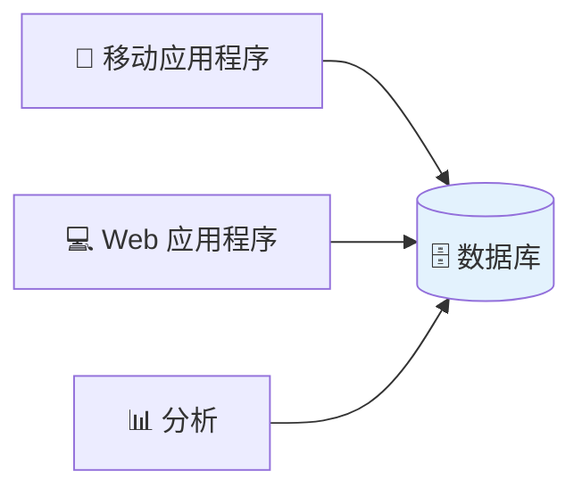
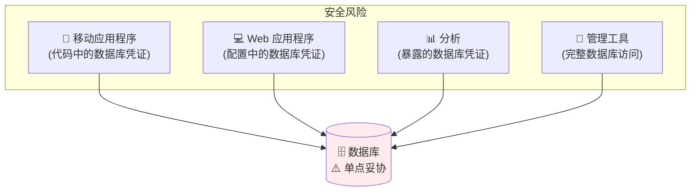
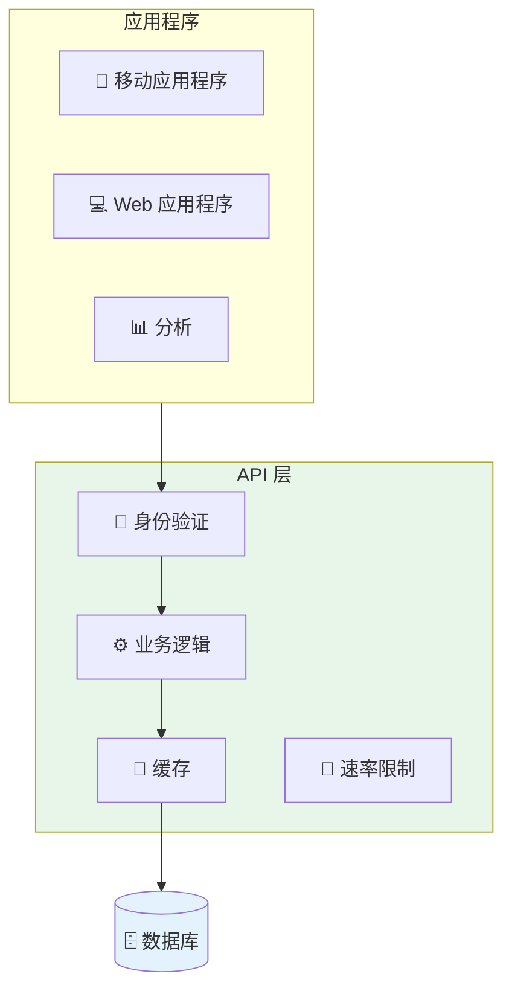
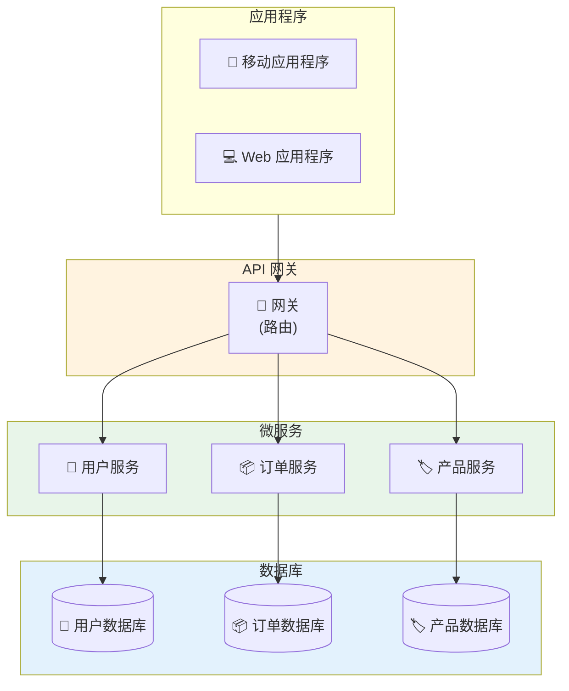
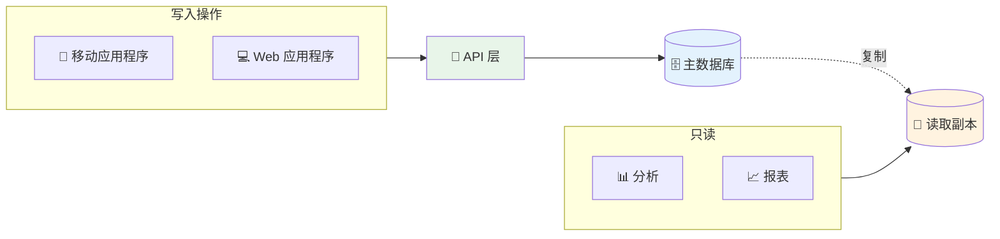
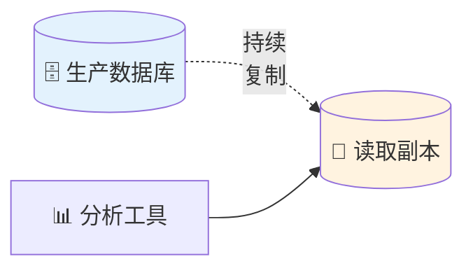
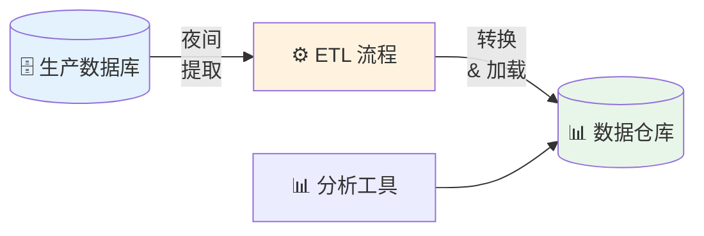
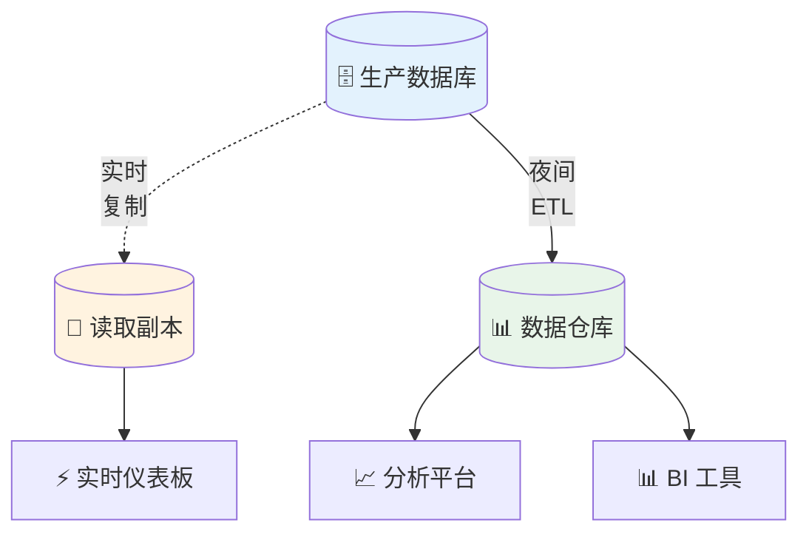

你的 CRM 需要客户数据。你的分析仪表板需要相同的数据。你的移动应用程序也需要它。数据库拥有一切。为什么不让它们全部直接连接？

这似乎合乎逻辑。但在企业架构中，这个简单的决定可能会成就或破坏你系统的可扩展性、安全性和可维护性。

## 问题

**在企业环境中，多个应用程序是否应该直接连接到数据库？**

简短回答：**视情况而定——但通常不应该。**

详细回答：让我们探讨两方面。

## 支持直接数据库访问的理由

### 优势

**1. 简单性**



- 更少的移动部件
- 无需维护中间件
- 直接的开发
- 快速原型制作

**2. 性能**

直接连接消除了中间层：

```
直接：应用程序 → 数据库（1 跳）
API 层：应用程序 → API → 数据库（2 跳）
```

- 更低的延迟
- 更少的网络调用
- 无序列化开销

**3. 实时数据**

应用程序总是看到最新的数据：
- 无缓存失效问题
- 无同步延迟
- 立即一致性

**4. 开发速度**

开发人员可以：
- 查询他们需要的确切内容
- 快速迭代
- 直接使用数据库功能（存储过程、触发器）

### 何时有意义

**小型组织：**
- 2-3 个应用程序
- 单一开发团队
- 低流量
- 预算紧张

**内部工具：**
- 管理仪表板
- 报表工具
- 数据分析脚本
- 一次性工具

**原型：**
- MVP 开发
- 概念验证
- 快速实验

## 反对直接数据库访问的理由

### 问题

#### 1. 安全噩梦

**问题：**每个应用程序都需要数据库凭证。



**风险：**

- **凭证扩散：**多个代码库中的密码
- **移动应用程序：**可以从 APK/IPA 提取凭证
- **第三方访问：**难以撤销特定应用程序访问
- **审计噩梦：**无法追踪哪个应用程序进行了哪个查询

**真实世界示例：**

```
移动应用程序反编译 → 提取数据库密码
→ 攻击者拥有完整数据库访问权限
→ 所有客户数据被泄露
```

#### 2. 紧密耦合

**问题：**应用程序直接依赖数据库架构。

**架构变更影响：**

```sql
-- 重新命名列
ALTER TABLE users RENAME COLUMN email TO email_address;
```

**结果：**
- ❌ 移动应用程序中断
- ❌ Web 应用程序中断
- ❌ 分析中断
- ❌ 管理工具中断
- ❌ 所有都需要同时更新

**部署噩梦：**

```
数据库迁移 → 必须同时部署所有应用程序
→ 需要协调停机时间
→ 失败风险高
```

#### 3. 无业务逻辑层

**问题：**业务规则分散在各个应用程序中。

**示例：折扣计算**

```
移动应用程序：10% 折扣逻辑
Web 应用程序：15% 折扣逻辑（过时）
分析：无折扣逻辑（错误报表）
```

**后果：**
- 不一致的行为
- 重复的代码
- 难以维护
- 难以审计

**存储过程如何？**

有些人认为：「将业务逻辑放在存储过程中——问题解决！」

**存储过程方法：**

```sql
-- 数据库中的集中式折扣逻辑
CREATE PROCEDURE calculate_order_total(
  IN user_id INT,
  IN order_id INT,
  OUT final_total DECIMAL(10,2)
)
BEGIN
  DECLARE base_total DECIMAL(10,2);
  DECLARE discount DECIMAL(10,2);
  DECLARE is_premium BOOLEAN;
  
  SELECT total INTO base_total FROM orders WHERE id = order_id;
  SELECT premium INTO is_premium FROM users WHERE id = user_id;
  
  IF is_premium THEN
    SET discount = base_total * 0.15;
  ELSEIF base_total > 100 THEN
    SET discount = base_total * 0.10;
  ELSE
    SET discount = 0;
  END IF;
  
  SET final_total = base_total - discount;
END;
```

**优势：**
- ✅ 逻辑集中在一个地方
- ✅ 所有应用程序使用相同的计算
- ✅ 保证一致的行为
- ✅ 性能（在数据附近执行）

**但严重的缺点：**

**1. 有限的语言功能：**

```sql
-- SQL/PL-SQL 不是为复杂逻辑设计的
-- 没有现代语言功能：
-- - 无依赖注入
-- - 有限的错误处理
-- - 无单元测试框架
-- - 无 IDE 支持（与 Java/Python/Node.js 相比）
```

**2. 难以测试：**

```javascript
// 应用程序代码 - 易于测试
function calculateDiscount(user, order) {
  if (user.isPremium) return order.total * 0.15;
  return order.total > 100 ? order.total * 0.10 : 0;
}

// 单元测试
test('premium user gets 15% discount', () => {
  const user = { isPremium: true };
  const order = { total: 100 };
  expect(calculateDiscount(user, order)).toBe(15);
});
```

```sql
-- 存储过程 - 难以测试
-- 需要数据库连接
-- 需要测试数据设置
-- 测试执行缓慢
-- 无模拟/存根
```

**3. 供应商锁定：**

```
Oracle PL/SQL ≠ SQL Server T-SQL ≠ PostgreSQL PL/pgSQL

-- 迁移数据库意味着重写所有过程
-- 不同的语法、功能、限制
```

**4. 部署复杂性：**

```
应用程序部署：
- Git 提交 → CI/CD → 部署 → 回滚容易

存储过程部署：
- 手动 SQL 脚本
- 版本控制困难
- 回滚有风险
- 无法与应用程序代码原子部署
```

**5. 有限的可观察性：**

```javascript
// 应用程序代码 - 完整的可观察性
function processOrder(order) {
  logger.info('Processing order', { orderId: order.id });
  const discount = calculateDiscount(order);
  logger.debug('Discount calculated', { discount });
  metrics.increment('orders.processed');
  return applyDiscount(order, discount);
}
```

```sql
-- 存储过程 - 有限的可观察性
-- 难以添加日志
-- 难以添加指标
-- 难以追踪执行
-- 难以在生产环境中调试
```

**6. 团队技能：**

```
大多数开发人员知道：JavaScript、Python、Java、Go
较少开发人员知道：PL/SQL、T-SQL、PL/pgSQL

→ 更难招聘
→ 更难维护
→ 知识孤岛
```

**何时存储过程有意义：**

✅ **数据密集型操作：**
```sql
-- 批量数据处理
CREATE PROCEDURE archive_old_orders()
BEGIN
  INSERT INTO orders_archive 
  SELECT * FROM orders WHERE created_at < DATE_SUB(NOW(), INTERVAL 1 YEAR);
  
  DELETE FROM orders WHERE created_at < DATE_SUB(NOW(), INTERVAL 1 YEAR);
END;
```

✅ **性能关键查询：**
```sql
-- 复杂聚合在数据库中更好
CREATE PROCEDURE get_sales_report(IN start_date DATE, IN end_date DATE)
BEGIN
  SELECT 
    DATE(created_at) as date,
    COUNT(*) as order_count,
    SUM(total) as revenue,
    AVG(total) as avg_order_value
  FROM orders
  WHERE created_at BETWEEN start_date AND end_date
  GROUP BY DATE(created_at);
END;
```

✅ **遗留系统：**
- 已经大量投资于存储过程
- 迁移成本太高
- 团队在数据库编程方面的专业知识

**现代替代方案：精简存储过程**

```sql
-- 存储过程仅用于数据访问
CREATE PROCEDURE get_user_orders(IN user_id INT)
BEGIN
  SELECT * FROM orders WHERE user_id = user_id;
END;
```

```javascript
// 应用程序中的业务逻辑
class OrderService {
  async calculateTotal(userId, orderId) {
    const orders = await db.call('get_user_orders', [userId]);
    const user = await db.call('get_user', [userId]);
    
    // 业务逻辑在这里 - 可测试、可维护
    const discount = this.calculateDiscount(user, orders);
    return this.applyDiscount(orders, discount);
  }
}
```

**存储过程的结论：**

存储过程可以集中逻辑，但它们：
- ❌ 不能解决直接访问问题
- ❌ 创造新的维护挑战
- ❌ 限制技术选择
- ⚠️ 应谨慎用于数据密集型操作
- ✅ 更好：将业务逻辑保留在应用程序层

#### 4. 性能瓶颈

**问题：**数据库变得不堪重负。

**连接限制：**

```
PostgreSQL 默认：100 个连接
MySQL 默认：151 个连接

10 个应用程序 × 每个 20 个连接 = 200 个连接
→ 数据库拒绝新连接
→ 应用程序崩溃
```

**查询混乱：**

```
应用程序 1：SELECT * FROM orders（全表扫描）
应用程序 2：跨 5 个表的复杂 JOIN
应用程序 3：未优化的查询（缺少索引）
→ 数据库 CPU 达到 100%
→ 所有应用程序变慢
```

#### 5. 无访问控制

**问题：**应用程序拥有太多访问权限。

**典型设置：**

```sql
-- 所有应用程序使用相同的用户
GRANT ALL PRIVILEGES ON database.* TO 'app_user'@'%';
```

**风险：**
- 分析工具可以删除数据
- 移动应用程序可以删除表
- 无最小权限原则
- 意外数据丢失

#### 6. 难以监控

**问题：**无法追踪应用程序行为。

**你无法回答的问题：**
- 哪个应用程序导致慢查询？
- 哪个应用程序发出最多请求？
- 哪个应用程序访问了敏感数据？
- 哪个应用程序导致了中断？


## 企业解决方案：API 层

### 架构模式

在数据库前放置 API 层有两种主要模式：

#### 模式 1：单体 API 层



**特征：**
- 单一 API 服务
- 一个数据库（或共享数据库）
- 集中式业务逻辑
- 简单开始

#### 模式 2：微服务（每服务一个数据库）



**特征：**
- 多个独立服务
- 每个服务拥有自己的数据库
- 分散式业务逻辑
- 复杂但可扩展

### 微服务模式：深入探讨

**核心原则：每服务一个数据库**

```
❌ 反模式：共享数据库
用户服务 ──┐
           ├──> 共享数据库
订单服务 ──┘

问题：
- 通过架构紧密耦合
- 无法独立部署
- 架构变更破坏多个服务

✅ 模式：每服务一个数据库
用户服务 ──> 用户数据库
订单服务 ──> 订单数据库

优势：
- 松散耦合
- 独立部署
- 技术多样性
```

**示例实现：**

**用户服务：**
```javascript
// user-service/api.js
const express = require('express');
const app = express();

// 用户服务拥有用户数据库
const userDB = require('./db/user-db');

app.get('/api/users/:id', async (req, res) => {
  const user = await userDB.findById(req.params.id);
  res.json(user);
});

app.post('/api/users', async (req, res) => {
  const user = await userDB.create(req.body);
  res.json(user);
});

app.listen(3001);
```

**订单服务：**
```javascript
// order-service/api.js
const express = require('express');
const app = express();

// 订单服务拥有订单数据库
const orderDB = require('./db/order-db');

app.get('/api/orders/:id', async (req, res) => {
  const order = await orderDB.findById(req.params.id);
  
  // 需要用户数据？调用用户服务 API
  const user = await fetch(`http://user-service:3001/api/users/${order.userId}`);
  
  res.json({
    ...order,
    user: await user.json()
  });
});

app.post('/api/orders', async (req, res) => {
  const order = await orderDB.create(req.body);
  res.json(order);
});

app.listen(3002);
```

**API 网关：**
```javascript
// api-gateway/gateway.js
const express = require('express');
const { createProxyMiddleware } = require('http-proxy-middleware');
const app = express();

// 路由到适当的服务
app.use('/api/users', createProxyMiddleware({ 
  target: 'http://user-service:3001',
  changeOrigin: true 
}));

app.use('/api/orders', createProxyMiddleware({ 
  target: 'http://order-service:3002',
  changeOrigin: true 
}));

app.use('/api/products', createProxyMiddleware({ 
  target: 'http://product-service:3003',
  changeOrigin: true 
}));

app.listen(8080);
```

**微服务模式的优势：**

**1. 独立扩展：**
```
用户服务：2 个实例（低流量）
订单服务：10 个实例（高流量）
产品服务：3 个实例（中等流量）

每个根据自己的需求扩展
```

**2. 技术多样性：**
```javascript
// 用户服务 - Node.js + PostgreSQL
const { Pool } = require('pg');
const pool = new Pool({ database: 'users' });
```

```python
# 订单服务 - Python + MongoDB
from pymongo import MongoClient
client = MongoClient('mongodb://localhost:27017/')
db = client['orders']
```

```java
// 产品服务 - Java + MySQL
DataSource ds = new MysqlDataSource();
ds.setURL("jdbc:mysql://localhost:3306/products");
```

**3. 独立部署：**
```
部署用户服务 v2.0
→ 只有用户服务重启
→ 订单服务继续运行
→ 产品服务继续运行
→ 无需协调部署
```

**4. 故障隔离：**
```
订单服务崩溃
→ 用户仍可登录（用户服务）
→ 用户可浏览产品（产品服务）
→ 只有订购功能中断
→ 部分系统可用性
```

**微服务模式的挑战：**

**1. 数据一致性：**

**问题：**无分布式事务

```javascript
// ❌ 无法跨服务执行此操作
BEGIN TRANSACTION;
  INSERT INTO users (id, name) VALUES (1, 'Alice');
  INSERT INTO orders (user_id, total) VALUES (1, 100);
COMMIT;

// 用户服务和订单服务有独立的数据库
```

**解决方案：Saga 模式**

```javascript
// 基于编排的 saga
class OrderService {
  async createOrder(userId, items) {
    // 步骤 1：创建订单
    const order = await orderDB.create({ userId, items, status: 'pending' });
    
    // 步骤 2：发布事件
    await eventBus.publish('OrderCreated', { orderId: order.id, userId, items });
    
    return order;
  }
  
  // 监听来自其他服务的事件
  async onPaymentFailed(event) {
    // 补偿事务
    await orderDB.update(event.orderId, { status: 'cancelled' });
  }
}

class PaymentService {
  async onOrderCreated(event) {
    try {
      await this.chargeCustomer(event.userId, event.total);
      await eventBus.publish('PaymentSucceeded', { orderId: event.orderId });
    } catch (error) {
      await eventBus.publish('PaymentFailed', { orderId: event.orderId });
    }
  }
}
```

**2. 数据重复：**

**问题：**服务需要来自其他服务的数据

```javascript
// 订单服务需要用户电子邮件进行通知
// 但用户服务拥有用户数据

// ❌ 不好：每次订单都查询用户服务
const order = await orderDB.findById(orderId);
const user = await fetch(`http://user-service/api/users/${order.userId}`);
await sendEmail(user.email, order);
// 慢，创造耦合

// ✅ 好：在订单服务中缓存用户数据
const order = await orderDB.findById(orderId);
const userCache = await orderDB.getUserCache(order.userId);
await sendEmail(userCache.email, order);
// 快，但数据可能过时
```

**解决方案：事件驱动的数据复制**

```javascript
// 用户服务发布事件
class UserService {
  async updateUser(userId, data) {
    await userDB.update(userId, data);
    
    // 发布事件
    await eventBus.publish('UserUpdated', {
      userId,
      email: data.email,
      name: data.name
    });
  }
}

// 订单服务监听并缓存
class OrderService {
  async onUserUpdated(event) {
    // 更新本地缓存
    await orderDB.updateUserCache(event.userId, {
      email: event.email,
      name: event.name
    });
  }
}
```

**3. 分布式查询：**

**问题：**无法跨服务 JOIN

```sql
-- ❌ 无法使用微服务执行此操作
SELECT 
  u.name,
  o.total,
  p.name as product_name
FROM users u
JOIN orders o ON u.id = o.user_id
JOIN products p ON o.product_id = p.id;
```

**解决方案：API 组合或 CQRS**

```javascript
// API 组合：在 API 网关中聚合
app.get('/api/order-details/:orderId', async (req, res) => {
  // 调用多个服务
  const [order, user, product] = await Promise.all([
    fetch(`http://order-service/api/orders/${req.params.orderId}`),
    fetch(`http://user-service/api/users/${order.userId}`),
    fetch(`http://product-service/api/products/${order.productId}`)
  ]);
  
  // 组合结果
  res.json({
    order: await order.json(),
    user: await user.json(),
    product: await product.json()
  });
});
```

```javascript
// CQRS：独立的读取模型
class OrderReadModel {
  // 查询的非规范化视图
  async getOrderDetails(orderId) {
    // 读取数据库中的预先连接数据
    return await readDB.query(`
      SELECT * FROM order_details_view
      WHERE order_id = ?
    `, [orderId]);
  }
  
  // 由所有服务的事件更新
  async onOrderCreated(event) { /* 更新视图 */ }
  async onUserUpdated(event) { /* 更新视图 */ }
  async onProductUpdated(event) { /* 更新视图 */ }
}
```

**何时使用微服务模式：**

✅ **大型组织：**
- 多个团队（5+ 团队）
- 每个团队拥有一个服务
- 独立发布周期

✅ **不同的扩展需求：**
- 某些功能高流量
- 某些功能低流量
- 需要独立扩展

✅ **技术多样性：**
- 不同的语言/框架
- 不同的数据库类型
- 遗留系统集成

✅ **领域复杂性：**
- 清晰的界限上下文
- 明确定义的服务边界
- 成熟的领域理解

**何时不使用微服务：**

❌ **小团队：**
- < 5 个开发人员
- 开销太高
- 单体更简单

❌ **不清楚的边界：**
- 领域理解不足
- 服务经常变更
- 大量跨服务调用

❌ **简单应用程序：**
- CRUD 操作
- 无复杂工作流程
- 单体就足够

❌ **初创公司/MVP：**
- 需要快速行动
- 需求经常变更
- 过早优化

**迁移路径：单体到微服务**

**阶段 1：带模块的单体**
```
单体 API
├── 用户模块
├── 订单模块
└── 产品模块
     ↓
  单一数据库
```

**阶段 2：提取第一个服务**
```
单体 API ──> 共享数据库
     ↓
用户服务 ──> 用户数据库（新）
```

**阶段 3：提取更多服务**
```
产品服务 ──> 产品数据库
订单服务 ──> 订单数据库
用户服务 ──> 用户数据库
```

**阶段 4：淘汰单体**
```
API 网关
├── 产品服务 ──> 产品数据库
├── 订单服务 ──> 订单数据库
└── 用户服务 ──> 用户数据库
```

**最佳实践：**

1. **从单体开始**
2. **当痛点出现时提取服务**
3. **使用 API 网关进行路由**
4. **实现服务发现**
5. **使用事件驱动通信**
6. **监控一切**
7. **自动化部署**
8. **为故障设计**

### 单体 API 层的优势

#### 1. 安全性

**集中式身份验证：**

```
移动应用程序 → API（JWT 令牌）
Web 应用程序 → API（OAuth）
分析 → API（API 密钥）

API → 数据库（单一安全连接）
```

**优势：**
- 应用程序中无数据库凭证
- 撤销每个应用程序的访问
- 审计所有数据访问
- 实现速率限制

**示例：**

```javascript
// 移动应用程序 - 无数据库凭证
const response = await fetch('https://api.neo01.com/users', {
  headers: { 'Authorization': 'Bearer ' + token }
});
```

#### 2. 松散耦合

**架构独立性：**

```sql
-- 数据库变更
ALTER TABLE users RENAME COLUMN email TO email_address;
```

**API 保持不变：**

```json
GET /api/users/123
{
  "email": "user@neo01.com"  // API 契约不变
}
```

**结果：**
- ✅ 移动应用程序运作
- ✅ Web 应用程序运作
- ✅ 分析运作
- ✅ 只有 API 代码更新

#### 3. 业务逻辑集中化

**单一真相来源：**

```javascript
// API 层 - 折扣逻辑在一个地方
function calculateDiscount(user, order) {
  if (user.isPremium) return order.total * 0.15;
  if (order.total > 100) return order.total * 0.10;
  return 0;
}
```

**优势：**
- 所有应用程序的一致行为
- 易于更新规则
- 单一测试位置
- 审计轨迹

#### 4. 性能优化

**连接池：**

```
10 个应用程序 → API（10 个连接）
API → 数据库（5 个池化连接）

而不是：10 个应用程序 × 20 = 200 个连接
```

**缓存：**

```javascript
// 缓存频繁查询
app.get('/api/products', async (req, res) => {
  const cached = await redis.get('products');
  if (cached) return res.json(cached);
  
  const products = await db.query('SELECT * FROM products');
  await redis.set('products', products, 'EX', 300);
  return res.json(products);
});
```

**优势：**
- 减少数据库负载
- 更快的响应时间
- 更好的资源利用

#### 5. 细粒度访问控制

**每个应用程序的权限：**

```javascript
// 移动应用程序 - 只读
if (app === 'mobile') {
  allowedOperations = ['READ'];
}

// 管理工具 - 完整访问
if (app === 'admin' && user.isAdmin) {
  allowedOperations = ['READ', 'WRITE', 'DELETE'];
}

// 分析 - 仅特定表
if (app === 'analytics') {
  allowedTables = ['orders', 'products'];
}
```

#### 6. 全面监控

**追踪一切：**

```javascript
// 记录所有 API 请求
app.use((req, res, next) => {
  logger.info({
    app: req.headers['x-app-name'],
    user: req.user.id,
    endpoint: req.path,
    method: req.method,
    duration: Date.now() - req.startTime
  });
});
```

**洞察：**
- 哪个应用程序最慢？
- 哪些端点最常使用？
- 哪个应用程序导致错误？
- 每个应用程序的使用模式


## 混合方法：何时混合使用

### 只读直接访问

**情境：**分析和报表工具需要复杂查询。



**设置：**

```sql
-- 分析的只读用户
CREATE USER 'analytics'@'%' IDENTIFIED BY 'secure_password';
GRANT SELECT ON database.* TO 'analytics'@'%';

-- 连接到读取副本
-- 对生产数据库无影响
```

**优势：**
- 分析不会拖慢生产环境
- 允许复杂查询
- 无写入访问风险
- 独立监控

#### 读取副本 vs ETL：如何选择？

对于分析工作负载，你有两个主要选项：

**选项 1：读取副本（实时）**



```sql
-- 分析查询在副本上执行
SELECT 
  DATE(created_at) as date,
  COUNT(*) as orders,
  SUM(total) as revenue
FROM orders
WHERE created_at >= DATE_SUB(NOW(), INTERVAL 30 DAY)
GROUP BY DATE(created_at);
```

**特征：**
- ⚡ 实时或近实时数据（秒级延迟）
- 🔄 持续复制
- 📊 与生产环境相同的架构
- 🎯 直接 SQL 查询

!!!warning "⚠️「近实时」现实检查"
    **读取副本并非真正实时。**总是存在复制延迟。
    
    **典型复制延迟：**
    - **最佳情况：**100ms - 1 秒
    - **正常：**1-5 秒
    - **负载下：**10-60 秒
    - **网络问题：**数分钟或更长
    
    **这意味着什么：**
    ```
    12:00:00.000 - 客户在生产环境下订单
    12:00:00.500 - 复制延迟（500ms）
    12:00:00.500 - 订单出现在读取副本
    12:00:00.600 - 分析仪表板查询副本
    
    结果：仪表板在订单发生后 600ms 显示
    ```
    
    **真实世界情境：**
    ```sql
    -- 生产环境：刚创建订单
    INSERT INTO orders (id, status) VALUES (12345, 'pending');
    
    -- 读取副本：2 秒后
    SELECT * FROM orders WHERE id = 12345;
    -- 返回：无结果（复制延迟）
    
    -- 副本上 2 秒后
    SELECT * FROM orders WHERE id = 12345;
    -- 返回：找到订单
    ```
    
    **复制延迟何时造成问题：**
    
    1. **客户看到过时数据：**
    ```
    用户：「我刚下了订单！」
    仪表板：「找不到订单」
    用户：「你的系统坏了！」
    ```
    
    2. **不一致的视图：**
    ```
    移动应用程序（生产）：100 个订单
    仪表板（副本）：98 个订单（落后 2 秒）
    ```
    
    3. **基于旧数据的业务决策：**
    ```
    经理：「我们只有 5 件库存」
    现实：0 件（最后 3 秒卖出 5 件）
    经理：「来做促销！」
    结果：超卖
    ```
    
    **监控复制延迟：**
    
    ```sql
    -- PostgreSQL
    SELECT 
      client_addr,
      state,
      sync_state,
      replay_lag,
      write_lag,
      flush_lag
    FROM pg_stat_replication;
    
    -- MySQL
    SHOW SLAVE STATUS\G
    -- 查看：Seconds_Behind_Master
    ```
    
    **高延迟警报：**
    ```yaml
    # Prometheus 警报
    - alert: HighReplicationLag
      expr: mysql_slave_lag_seconds > 10
      for: 2m
      annotations:
        summary: "复制延迟为 {{ $value }} 秒"
    ```
    
    **尽管有延迟仍可接受的使用案例：**
    - ✅ 历史报表（昨天的销售）
    - ✅ 趋势分析（最近 30 天）
    - ✅ 带有「数据截至 X 秒前」免责声明的仪表板
    - ✅ 非关键指标
    
    **不可接受的使用案例：**
    - ❌ 实时库存检查
    - ❌ 欺诈检测
    - ❌ 面向客户的「你的订单」页面
    - ❌ 关键业务决策
    
    **如果你需要真正的实时：**
    - 直接查询生产数据库（谨慎）
    - 使用变更数据捕获（CDC）与流式处理
    - 实现事件驱动架构
    - 接受延迟并围绕它设计

**选项 2：ETL 到数据仓库（批处理）**



```python
# ETL 作业每晚执行
def etl_orders():
    # 从生产环境提取
    orders = prod_db.query("""
        SELECT * FROM orders 
        WHERE updated_at >= CURRENT_DATE - INTERVAL '1 day'
    """)
    
    # 转换
    for order in orders:
        order['revenue'] = order['total'] - order['discount']
        order['profit_margin'] = calculate_margin(order)
    
    # 加载到仓库
    warehouse.bulk_insert('fact_orders', orders)
```

**特征：**
- 🕐 计划更新（每小时/每天）
- 🔄 批处理
- 🏗️ 转换的架构（为分析优化）
- 📈 预先聚合的数据

!!!anote "📅 批处理：可预测的过时性"
    **ETL 数据是故意过时的——这没关系。**
    
    **典型 ETL 计划：**
    - **每小时：**数据是 0-60 分钟旧
    - **每天：**数据是 0-24 小时旧
    - **每周：**数据是 0-7 天旧
    
    **示例时间线：**
    ```
    周一 9:00 AM - 客户下订单
    周一 11:59 PM - ETL 作业开始
    周二 12:30 AM - ETL 作业完成
    周二 8:00 AM - 分析师查看报表
    
    数据年龄：约 23 小时旧
    ```
    
    **为什么批处理对分析更好：**
    
    1. **一致的快照：**
    ```python
    # ETL 捕获时间点快照
    # 所有数据来自同一时刻
    snapshot_time = '2024-01-15 23:59:59'
    
    orders = extract_orders(snapshot_time)
    customers = extract_customers(snapshot_time)
    products = extract_products(snapshot_time)
    
    # 所有数据都是一致的
    # 无查询中途变更
    ```
    
    2. **无查询中途更新：**
    ```
    读取副本（实时）：
    开始查询：100 个订单
    查询中途：5 个新订单到达
    结束查询：不一致的结果
    
    数据仓库（批处理）：
    开始查询：100 个订单
    查询中途：无变更（静态快照）
    结束查询：一致的结果
    ```
    
    3. **为聚合优化：**
    ```sql
    -- 仓库中预先聚合
    SELECT date, SUM(revenue) 
    FROM daily_sales_summary  -- 已经求和
    WHERE date >= '2024-01-01';
    -- 10ms 返回
    
    -- vs 读取副本
    SELECT DATE(created_at), SUM(total)
    FROM orders  -- 必须扫描数百万行
    WHERE created_at >= '2024-01-01'
    GROUP BY DATE(created_at);
    -- 30 秒返回
    ```
    
    **过时性可接受的情况：**
    - ✅ 月度/季度报表
    - ✅ 年度比较
    - ✅ 趋势分析
    - ✅ 高管仪表板
    - ✅ 合规报表
    
    **过时性不可接受的情况：**
    - ❌ 实时操作仪表板
    - ❌ 实时警报
    - ❌ 面向客户的数据
    - ❌ 欺诈检测
    
    **混合解决方案：Lambda 架构**
    ```
    实时层（读取副本）：
    - 最近 24 小时的数据
    - 对最近数据的快速查询
    - 可接受延迟：秒
    
    批处理层（数据仓库）：
    - 历史数据（>24 小时）
    - 复杂分析
    - 可接受延迟：小时/天
    
    服务层：
    - 合并两个视图
    - 最近 + 历史
    ```
    
    **示例实现：**
    ```python
    def get_sales_report(start_date, end_date):
        today = datetime.now().date()
        
        # 从仓库获取历史数据
        if end_date < today:
            return warehouse.query(
                "SELECT * FROM sales_summary WHERE date BETWEEN ? AND ?",
                start_date, end_date
            )
        
        # 从副本获取最近数据
        historical = warehouse.query(
            "SELECT * FROM sales_summary WHERE date BETWEEN ? AND ?",
            start_date, today - timedelta(days=1)
        )
        
        recent = replica.query(
            "SELECT * FROM orders WHERE date >= ?",
            today
        )
        
        return merge(historical, recent)
    ```

**比较：**

| 因素 | 读取副本 | ETL 到数据仓库 |
|------|---------|---------------|
| **数据新鲜度** | 实时（秒） | 批处理（小时/天） |
| **查询性能** | 取决于生产架构 | 为分析优化 |
| **架构** | 与生产相同 | 转换（星型/雪花型） |
| **对生产的影响** | 最小（独立服务器） | 最小（计划离峰） |
| **复杂度** | 低 | 高 |
| **成本** | 较低 | 较高 |
| **数据转换** | 无 | 广泛 |
| **历史数据** | 受保留限制 | 无限 |
| **多个来源** | 单一数据库 | 多个数据库/API |

**何时使用读取副本：**

✅ **实时仪表板：**
```javascript
// 实时订单监控
SELECT COUNT(*) as active_orders
FROM orders
WHERE status = 'processing'
AND created_at >= NOW() - INTERVAL 1 HOUR;
```

✅ **操作报表：**
- 当前库存水平
- 活跃用户会话
- 今天的销售数字
- 系统健康指标

✅ **简单分析：**
- 单一数据来源
- 无复杂转换
- 生产架构运作良好

✅ **预算限制：**
- 小团队
- 有限资源
- 需要快速设置

**何时使用 ETL/数据仓库：**

✅ **复杂分析：**
```sql
-- 多维分析
SELECT 
  d.year, d.quarter, d.month,
  p.category, p.brand,
  c.country, c.region,
  SUM(f.revenue) as total_revenue,
  SUM(f.profit) as total_profit
FROM fact_sales f
JOIN dim_date d ON f.date_key = d.date_key
JOIN dim_product p ON f.product_key = p.product_key
JOIN dim_customer c ON f.customer_key = c.customer_key
GROUP BY d.year, d.quarter, d.month, p.category, p.brand, c.country, c.region;
```

✅ **多个数据来源：**
```python
# 组合来自多个系统的数据
def build_customer_360():
    # 从生产数据库
    orders = extract_from_postgres()
    
    # 从 CRM API
    interactions = extract_from_salesforce()
    
    # 从支持系统
    tickets = extract_from_zendesk()
    
    # 组合并加载
    customer_360 = merge_data(orders, interactions, tickets)
    warehouse.load('customer_360', customer_360)
```

✅ **历史分析：**
- 长期趋势（数年数据）
- 年度比较
- 季节性模式
- 留存群组

✅ **数据转换需求：**
- 为性能进行非规范化
- 业务逻辑计算
- 数据质量修正
- 聚合和汇总

✅ **合规/审计：**
- 不可变的历史记录
- 时间点快照
- 审计轨迹
- 监管报告

**混合方法：**

许多企业同时使用两者：

```
实时需求 → 读取副本
  - 实时仪表板
  - 操作报表
  - 当前指标

分析需求 → 数据仓库
  - 历史分析
  - 复杂查询
  - 多来源报表
```

**示例架构：**



**迁移路径：**

**阶段 1：从读取副本开始**
```
生产数据库 → 读取副本 → 分析

- 快速设置
- 立即价值
- 低复杂度
```

**阶段 2：随着需求增长添加 ETL**
```
生产数据库 → 读取副本 → 实时仪表板
            ↓
           ETL → 数据仓库 → 复杂分析

- 保留实时用于操作需求
- 添加仓库用于分析需求
- 两全其美
```

**成本比较：**

**读取副本：**
```
数据库副本：$200/月
设置时间：1 天
维护：低

第一年总计：约 $2,400
```

**数据仓库 + ETL：**
```
仓库：$500/月
ETL 工具：$300/月
设置时间：2-4 周
维护：中高

第一年总计：约 $9,600 + 设置成本
```

**决策框架：**

```
从读取副本开始，如果：
- 需要实时数据
- 单一数据来源
- 简单查询
- 小预算
- 需要快速成功

迁移到数据仓库，当：
- 需要历史分析（>1 年）
- 多个数据来源
- 复杂转换
- 副本上的慢查询
- 合规要求
```

### 架构抽象的数据库视图

**情境：**需要直接访问但想隐藏架构复杂性。

```sql
-- 创建简化视图
CREATE VIEW customer_summary AS
SELECT 
  c.id,
  c.name,
  c.email_address AS email,  -- 隐藏列重新命名
  COUNT(o.id) AS order_count,
  SUM(o.total) AS total_spent
FROM customers c
LEFT JOIN orders o ON c.id = o.customer_id
GROUP BY c.id;

-- 仅授予视图访问权限
GRANT SELECT ON customer_summary TO 'reporting_app'@'%';
```

**优势：**
- 隐藏架构变更
- 简化的数据模型
- 预先连接的数据
- 访问控制

## 决策框架

### 选择直接访问的情况：

✅ **小规模：**
- < 5 个应用程序
- < 1000 个用户
- 低流量

✅ **仅内部：**
- 无外部访问
- 可信任环境
- 单一团队

✅ **只读：**
- 分析工具
- 报表仪表板
- 数据科学

✅ **原型制作：**
- MVP 阶段
- 概念验证
- 时间紧迫的演示

### 选择 API 层的情况：

✅ **企业规模：**
- 5+ 个应用程序
- 1000+ 个用户
- 高流量

✅ **外部访问：**
- 移动应用程序
- 第三方集成
- 公共 API

✅ **安全关键：**
- 客户数据
- 财务信息
- 医疗记录

✅ **长期产品：**
- 生产系统
- 多个团队
- 频繁变更

## 最佳实践

### 如果你必须使用直接访问

**1. 使用读取副本：**

```
写入应用程序 → API → 主数据库
读取应用程序 → 读取副本
```

**2. 为每个应用程序创建数据库用户：**

```sql
CREATE USER 'mobile_app'@'%' IDENTIFIED BY 'password1';
CREATE USER 'web_app'@'%' IDENTIFIED BY 'password2';
CREATE USER 'analytics'@'%' IDENTIFIED BY 'password3';
```

**3. 授予最小权限：**

```sql
-- 移动应用程序 - 只需要用户和订单
GRANT SELECT ON database.users TO 'mobile_app'@'%';
GRANT SELECT ON database.orders TO 'mobile_app'@'%';

-- 分析 - 所有内容只读
GRANT SELECT ON database.* TO 'analytics'@'%';
```

**4. 使用连接池：**

```javascript
// 限制每个应用程序的连接
const pool = mysql.createPool({
  host: 'database.neo01.com',
  user: 'mobile_app',
  password: process.env.DB_PASSWORD,
  database: 'production',
  connectionLimit: 5  // 每个应用程序的限制
});
```

**5. 监控一切：**

```sql
-- 启用查询日志
SET GLOBAL general_log = 'ON';
SET GLOBAL log_output = 'TABLE';

-- 查看慢查询
SELECT * FROM mysql.slow_log 
WHERE user_host LIKE '%mobile_app%';
```

## 结论

直接数据库访问很诱人——它简单且快速。但在企业环境中，风险通常超过好处。

**关键要点：**

- **直接访问适用于小型、内部、只读情境**
- **API 层提供安全性、灵活性和控制**
- **紧密耦合是最大的长期成本**
- **为生产系统从 API 层开始**
- **如果有遗留直接访问，逐步迁移**

**真正的问题：**

不是「我们能直接连接吗？」而是「我们应该吗？」

对于大多数企业，答案是：**建立 API 层。**当你需要时，未来的你会感谢你：
- 变更数据库架构
- 添加新应用程序
- 撤销被泄露应用程序的访问
- 扩展以处理更多流量
- 调试生产问题

在 API 层的前期投资在安全性、可维护性和可扩展性方面带来回报。🏗️

## 资源

- **[The Twelve-Factor App](https://12factor.net/)：**现代应用程序架构原则
- **[API Security Best Practices](https://owasp.org/www-project-api-security/)：**OWASP API 安全
- **[Database Connection Pooling](https://en.wikipedia.org/wiki/Connection_pool)：**性能优化
- **[Microservices Patterns](https://microservices.io/patterns/data/database-per-service.html)：**每服务一个数据库模式
