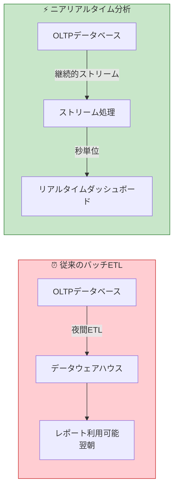
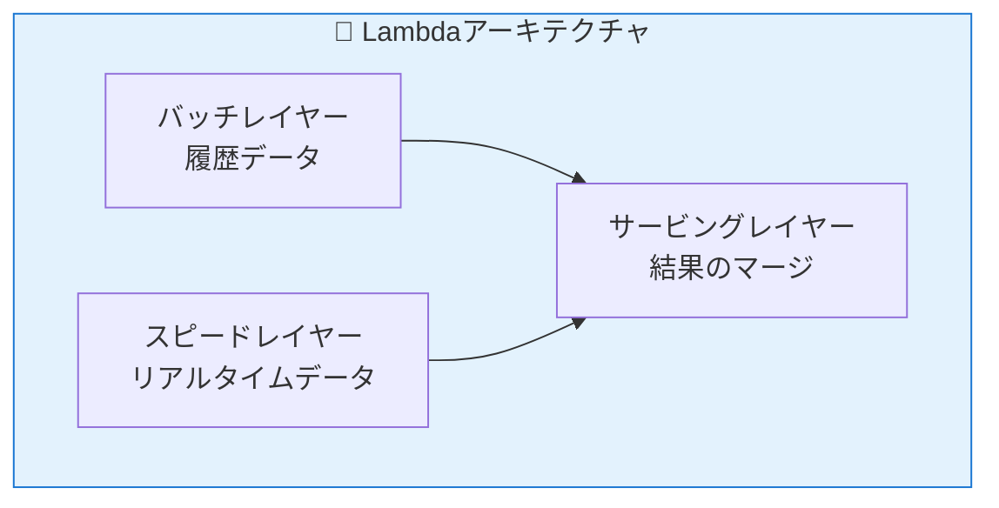
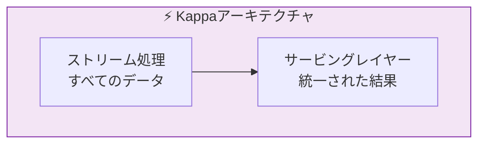
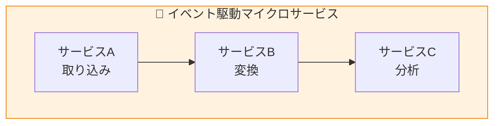
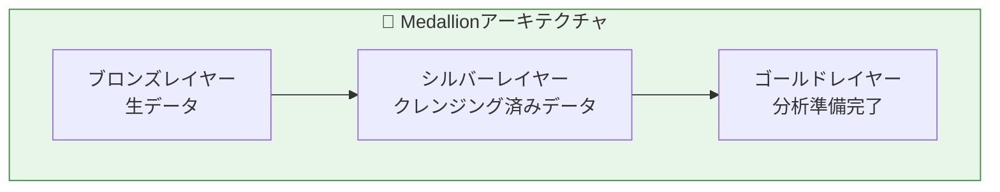
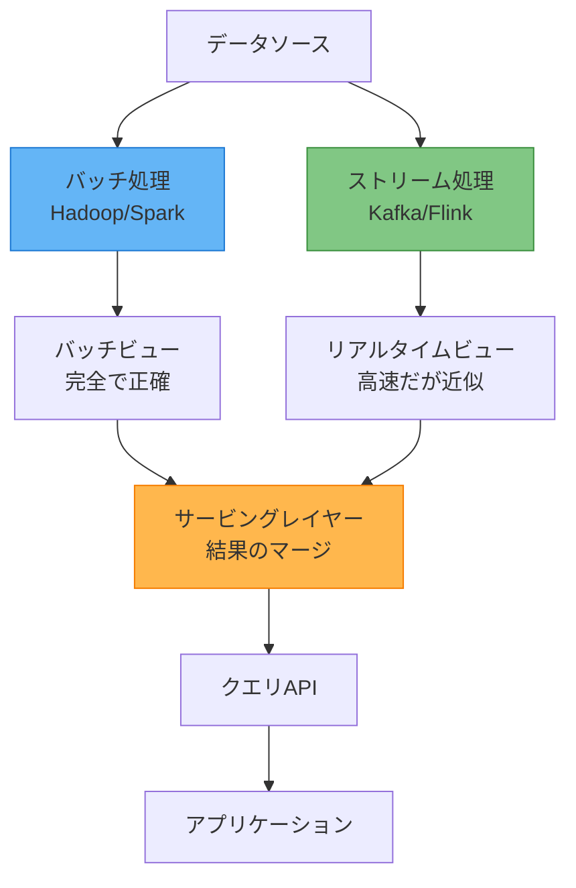
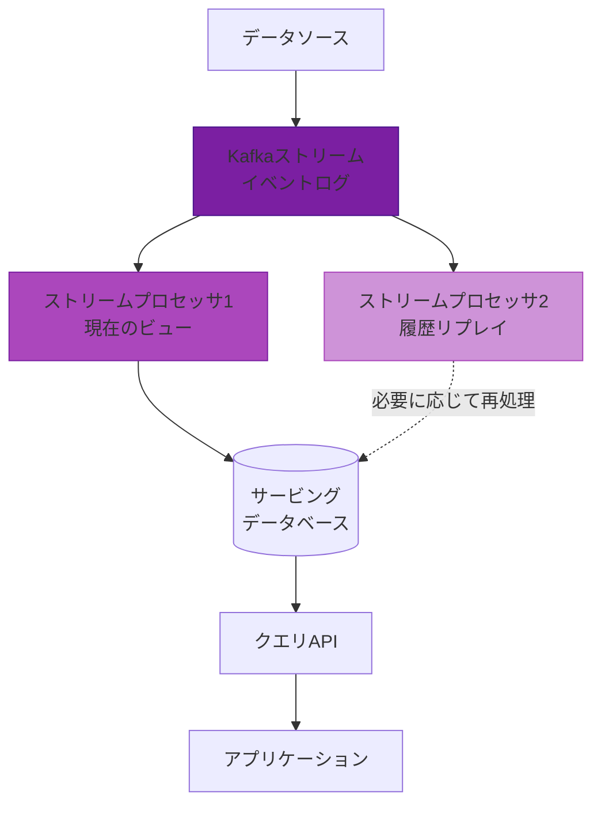
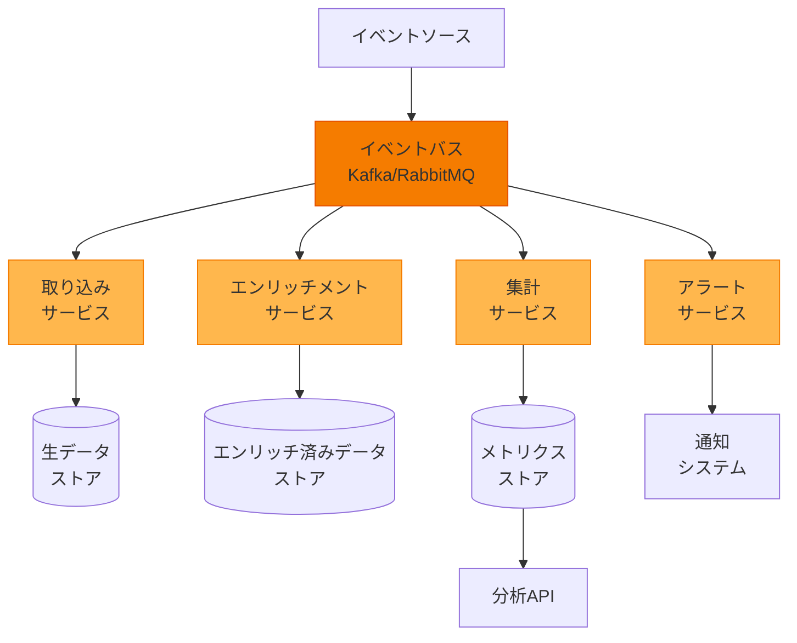
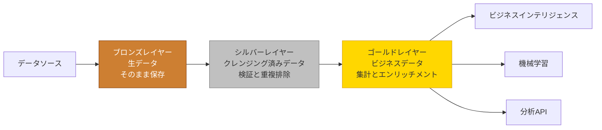
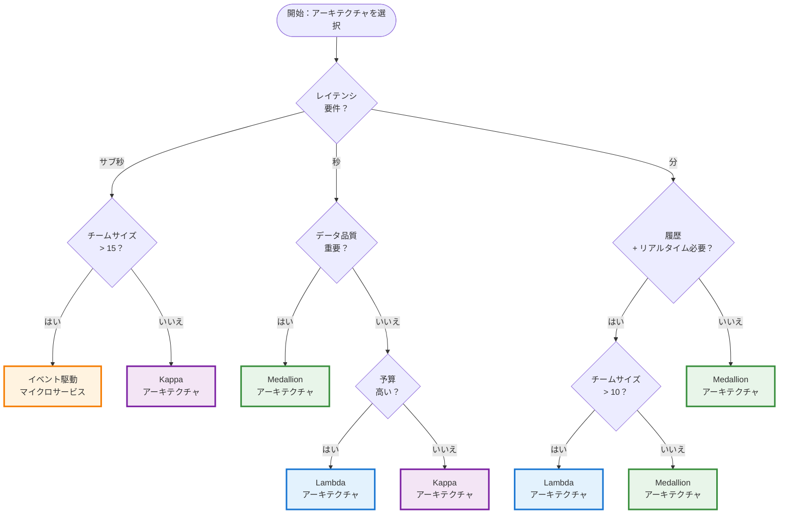

あなたがEコマースプラットフォームでフラッシュセールを実施していると想像してください。注文が殺到し、在庫が急速に減少しており、今すぐ知る必要があります——どの製品が最も速く売れているか、どの地域が最も活発か、価格調整が必要かどうか。翌朝更新される従来のバッチ分析では不十分です。数時間ではなく、数秒でインサイトが必要です。

これがニアリアルタイム分析の課題です：トランザクションを処理する運用データベース（OLTP）とインサイトを提供する分析システム（OLAP）の間に橋を架けること。OLTPシステムは個々のトランザクション処理に優れ、OLAPシステムは複雑な分析に最適化されていますが、どちらも単独では現代のビジネスが求める即座のインサイトを提供できません。

## リアルタイム分析の課題

従来のデータアーキテクチャは、定期的に実行されるバッチETL（抽出、変換、ロード）プロセスに依存しています——多くの場合、夜間に実行されます。ビジネス上の意思決定が朝まで待てる時代にはこのアプローチは機能していましたが、今日の競争環境ではより迅速なインサイトが求められます。

**バッチ処理の制限：**

- **レイテンシ**：データ生成とインサイトの間に数時間または数日の遅延
- **機会損失**：リアルタイムイベントに反応できない
- **リソース集約的**：大規模なバッチジョブがシステムに負荷をかける
- **複雑性**：バッチとリアルタイムのニーズに別々のコードベースが必要

**ニアリアルタイム分析の利点：**

- **即座のインサイト**：秒から分単位のレイテンシ
- **プロアクティブな意思決定**：イベント発生時に対応
- **より良い顧客体験**：現在の行動に基づくパーソナライゼーション
- **競争優位性**：競合他社より速く行動

## アーキテクチャパターンの概要

ニアリアルタイム分析の課題に対応するため、4つのアーキテクチャパターンが登場しました。各パターンは、複雑性、レイテンシ、機能の間で異なるトレードオフを提供します：

**クイック比較：**

| パターン | 最適な用途 | 複雑性 | レイテンシ |
|---------|----------|--------|----------|
| **Lambda** | 履歴 + リアルタイムインサイト | 高 | 混合 |
| **Kappa** | 純粋なストリーム処理 | 中 | サブ秒 |
| **イベント駆動マイクロサービス** | 大規模自動化 | 非常に高 | ミリ秒 |
| **Medallion** | データガバナンスと品質 | 中 | 秒から分 |

各パターンを詳しく見ていきましょう。

## Lambdaアーキテクチャ：二重処理パス

Lambdaアーキテクチャは、2011年にNathan Marzによって提唱され、バッチ処理の履歴精度とストリーム処理のリアルタイムインサイトを組み合わせます。サービングレイヤーで収束する2つの並列処理パスを維持します。

### 核心概念

Lambdaアーキテクチャの基本的な考え方は、ワークロードを2つの補完的なシステムに分割することで、履歴データとリアルタイムデータの両方を処理することです：

**バッチレイヤー**：完全なデータセットを処理して、正確で包括的なビューを生成します。定期的に（毎時、毎日）実行され、ゼロから結果を再計算するため、スピードレイヤーにエラーがあっても正確性が保証されます。

**スピードレイヤー**：最新のデータのみをリアルタイムで処理し、低レイテンシの更新を提供します。バッチレイヤーが追いつくまで近似結果を提供することで、バッチレイヤーの高レイテンシを補います。

**サービングレイヤー**：両方のレイヤーの結果をマージし、アプリケーションに統一されたビューを提示します。バッチビュー（正確だが古い）とリアルタイムデルタ（現在だが近似）を組み合わせる複雑さを処理します。

### データフロー

1. **取り込み**：生データがバッチレイヤーとスピードレイヤーの両方に同時に流れる
2. **バッチ処理**：完全な履歴データが大きなバッチで処理される（例：毎日）
3. **ストリーム処理**：最新のデータが到着時にリアルタイムで処理される
4. **ビュー生成**：両方のレイヤーがそれぞれデータのビューを生成
5. **クエリ時**：サービングレイヤーが両方のビューをマージしてクエリに応答
6. **ビュー置換**：バッチ処理が完了すると、古いバッチビューを置き換え、スピードレイヤーは対応するリアルタイムデータを破棄

### アーキテクチャコンポーネント

!!!warning "⚠️ Lambdaアーキテクチャの課題"
    **二重コードベース**：別々のバッチ処理とストリーム処理ロジックの維持は複雑性を増し、不整合につながる可能性があります。
    
    **リソース集約的**：2つの並列システムの実行には、大量のインフラストラクチャと運用オーバーヘッドが必要です。
    
    **結果整合性**：バッチビューとリアルタイムビューが一時的に乖離する可能性があり、サービングレイヤーでの慎重な処理が必要です。

!!!tip "💡 Lambdaを使用すべき場合"
    - 履歴の正確性とリアルタイムインサイトの両方が必要
    - 運用の複雑性に対応できる
    - バッチ処理とストリーム処理の両方に専門知識を持つチーム
    - 監査証跡と再処理機能が必要

## Kappaアーキテクチャ：純粋なストリーム処理

Kappaアーキテクチャは、2014年にJay Kreps（Apache Kafkaの作成者）によって提案され、バッチレイヤーを完全に排除することでLambdaを簡素化します。すべてのデータ——履歴データとリアルタイムデータ——が単一のストリーム処理パイプラインを流れます。

### 核心概念

Kappaアーキテクチャは、別々のバッチ処理とストリーム処理システムの必要性に疑問を投げかけます。代わりに、すべてのデータをストリームとして扱います——履歴データは、不変のイベントログから再生できる古いイベントに過ぎません。

**主要原則**：

**すべてがストリーム**：リアルタイムデータと履歴データの両方が同じ処理パイプラインを流れます。昨日のデータを処理することと5分前のデータを処理することの間に概念的な違いはありません。

**不変イベントログ**：すべてのイベントは、設定可能な保持期間を持つ追加専用ログ（通常はKafka）に保存されます。このログは真実の源として機能し、再処理を可能にします。

**リプレイによる再処理**：バグを修正したり新機能を追加したりするには、更新されたバージョンのストリームプロセッサを通じてログからイベントを再生するだけです。別のバッチジョブは不要です。

**単一コードベース**：1つの処理ロジックがすべてのデータを処理し、二重システムの維持に伴う複雑性と不整合を排除します。

### データフロー

1. **イベント取り込み**：すべてのイベントが不変ログ（Kafkaトピック）に書き込まれる
2. **ストリーム処理**：プロセッサがイベントを消費し、状態を維持し、結果を生成
3. **状態管理**：プロセッサが集計のためにローカル状態ストア（RocksDB）を使用
4. **出力生成**：結果がサービングデータベースまたは下流トピックに書き込まれる
5. **再処理**：必要に応じて、新しいプロセッサバージョンを起動し、ログの任意の時点から再生
6. **切り替え**：再処理が追いついたら、新しいプロセッサにトラフィックを切り替え

### アーキテクチャコンポーネント

!!!anote "💡 Kappaアーキテクチャの利点"
    **単一コードベース**：すべてのデータを処理する1つの処理ロジックが複雑性を軽減し、一貫性を保証します。
    
    **運用の簡素化**：別々のバッチシステムとストリームシステムを維持する必要がありません。
    
    **再処理**：バグを修正したり新機能を追加したりするために、同じパイプラインを通じて履歴データを再生できます。
    
    **強い一貫性**：すべてのデータが同じ処理パスに従います。

!!!warning "⚠️ Kappaアーキテクチャの制限"
    **ストリーム処理の専門知識**：ストリーム処理フレームワークの深い理解が必要です。
    
    **状態管理**：ストリームプロセッサで大きな状態を処理することは困難な場合があります。
    
    **複雑なクエリ**：一部の分析クエリはストリーミングパラダイムで表現するのが難しい場合があります。

## イベント駆動マイクロサービス：モジュール化された分析

イベント駆動マイクロサービスアーキテクチャは、分析をイベントを通じて非同期に通信する独立したサービスに分解します。各サービスは特定の責任を処理し、独立してスケールできます。

### 核心概念

このパターンは、マイクロサービスの原則を分析に適用し、モノリシックなデータパイプラインをイベントに反応する疎結合サービスに分解します。各サービスは自律的で、独自のデータを所有し、イベントバスを通じて通信します。

**主要原則**：

**サービスの自律性**：各マイクロサービスは独立してデプロイ、スケール、保守できます。チームは調整なしで異なるサービスで作業できます。

**イベント駆動通信**：サービスは互いに直接呼び出しません。代わりに、メッセージバス（Kafka、RabbitMQ）にイベントを公開し、関心のあるイベントをサブスクライブします。

**単一責任**：各サービスには1つの明確な目的があります——取り込み、エンリッチメント、集計、アラートなど。これによりサービスが理解しやすく、保守しやすくなります。

**ポリグロットアーキテクチャ**：異なるサービスで異なる技術を使用できます。MLサービスにはPython、高性能取り込みにはGo、複雑なストリーム処理にはJavaを使用します。

**独立したスケーリング**：特定の負荷に基づいて各サービスをスケールします。エンリッチメントがボトルネックの場合、他のサービスに触れることなくそのサービスのみをスケールします。

### データフロー

1. **イベント生成**：ソースシステムがイベントバスにイベントを公開
2. **サービス消費**：各サービスが関連するイベントトピックをサブスクライブ
3. **処理**：サービスが独立して非同期にイベントを処理
4. **イベント公開**：サービスが結果を新しいイベントとして公開
5. **カスケード処理**：下流サービスがこれらのイベントを消費してパイプラインを継続
6. **並列処理**：複数のサービスが異なる目的で同じイベントを同時に処理可能

### 実世界の例：Eコマース分析

**取り込みサービス**：Web、モバイル、APIからの生イベントを検証および正規化
**エンリッチメントサービス**：ユーザープロファイル、製品メタデータ、地理データを追加
**集計サービス**：リアルタイムメトリクス（カテゴリ、地域、時間別の売上）を計算
**レコメンデーションサービス**：パーソナライズされた製品推奨を生成
**アラートサービス**：異常を検出して通知を送信
**レポートサービス**：ビジネスレポートとダッシュボードを生成

### アーキテクチャコンポーネント

!!!anote "💡 マイクロサービスの利点"
    **独立したスケーリング**：特定の負荷に基づいて各サービスをスケールします。
    
    **技術の柔軟性**：異なるサービスに異なる言語/フレームワークを使用します。
    
    **障害の分離**：1つのサービスの障害がシステム全体をダウンさせません。
    
    **チームの自律性**：異なるチームが異なるサービスを所有できます。

!!!warning "⚠️ マイクロサービスの課題"
    **運用の複雑性**：多数のサービスの管理には洗練されたオーケストレーションが必要です。
    
    **分散デバッグ**：サービス間で問題を追跡することは困難です。
    
    **ネットワークオーバーヘッド**：サービス間通信がレイテンシを追加します。
    
    **データ整合性**：サービス間で整合性を維持するには慎重な設計が必要です。

## Medallionアーキテクチャ：階層化されたデータ品質

Medallionアーキテクチャは、Databricksによって普及され、データを3つの段階的なレイヤー——ブロンズ（生）、シルバー（クレンジング済み）、ゴールド（分析準備完了）——に編成し、完全なトレーサビリティを維持しながら各段階でデータ品質が向上することを保証します。

### 核心概念

Medallionアーキテクチャは、各レイヤーが特定の目的と品質レベルを持つ、構造化された階層的アプローチをデータ処理に適用します。データはこれらのレイヤーを流れ、ますます洗練され価値あるものになります。

**主要原則**：

**段階的な精製**：データ品質はレイヤー間を移動するにつれて向上します。ブロンズレイヤーはすべてをそのまま保存し、シルバーレイヤーはクレンジングと検証を行い、ゴールドレイヤーはビジネス用に集計します。

**データリネージ**：生データからビジネスメトリクスまでの完全なトレーサビリティ。ゴールドレイヤーのメトリクスを常にシルバーレイヤーを経由して元のブロンズレイヤーデータまで追跡できます。

**関心の分離**：各レイヤーには明確な責任があります。ブロンズレイヤーは取り込みを処理し、シルバーレイヤーは品質を処理し、ゴールドレイヤーはビジネスロジックを処理します。

**再処理機能**：ブロンズレイヤーが生データを保持しているため、ビジネスルールが変更されたりバグが修正されたりした場合、常にシルバーレイヤーとゴールドレイヤーを再処理できます。

**段階的な複雑性**：バッチ処理でシンプルに始め、ニーズが進化するにつれてレイヤーごとにストリーミング機能を追加します。

### データフロー

1. **ブロンズレイヤー取り込み**：生データが受信したままの状態で着地、変換なし
2. **ブロンズレイヤーストレージ**：メタデータ（取り込み時間、ソースファイル）を含む追加専用ストレージ
3. **シルバーレイヤー処理**：ブロンズレイヤーから読み取り、品質チェック、重複排除、標準化を適用
4. **シルバーレイヤーストレージ**：品質スコアと検証フラグを含むクレンジング済みデータ
5. **ゴールドレイヤー集計**：シルバーレイヤーから読み取り、ビジネスロジックを適用し、メトリクスを作成
6. **ゴールドレイヤーストレージ**：クエリとダッシュボード用に最適化されたビジネス対応テーブル

### レイヤーの詳細

**ブロンズレイヤー（生ゾーン）**：
- **目的**：監査と再処理のために元のデータを保持
- **形式**：ソースと同じ（JSON、CSV、Parquet）
- **操作**：追加専用、変換なし
- **保持**：長期または無期限（コンプライアンス要件）
- **ユースケース**：データ復旧、再処理、監査証跡

**シルバーレイヤー（クレンジングゾーン）**：
- **目的**：分析用にクレンジングされ検証されたデータを提供
- **形式**：構造化（Parquet、Delta Lake）
- **操作**：重複排除、検証、標準化、エンリッチメント
- **保持**：中期から長期
- **ユースケース**：探索的分析、特徴エンジニアリング、ML訓練

**ゴールドレイヤー（キュレーションゾーン）**：
- **目的**：ビジネス対応のメトリクスと集計を提供
- **形式**：クエリ用に最適化（スタースキーマ、集計テーブル）
- **操作**：集計、ビジネスロジック、非正規化
- **保持**：ビジネスニーズに基づく
- **ユースケース**：ダッシュボード、レポート、ビジネスインテリジェンス、API

### アーキテクチャコンポーネント

!!!anote "💡 Medallionアーキテクチャの利点"
    **データリネージ**：生データからビジネスメトリクスまでの明確なトレーサビリティ。
    
    **品質保証**：段階的な精製により高品質な分析が保証されます。
    
    **柔軟性**：他のレイヤーに影響を与えることなく任意のレイヤーを再処理できます。
    
    **ガバナンス**：各レイヤーでの監査証跡とデータ品質チェック。

!!!tip "💡 ベストプラクティス"
    **ブロンズレイヤー**：コンプライアンスと再処理のために生データを無期限に保持します。
    
    **シルバーレイヤー**：包括的なデータ品質チェックと検証ルールを実装します。
    
    **ゴールドレイヤー**：適切なパーティショニングとインデックス作成でクエリパフォーマンスを最適化します。
    
    **監視**：各レイヤーでデータ品質メトリクスと処理レイテンシを追跡します。

## アーキテクチャパターンの比較

適切なパターンの選択は、特定の要件、チームの能力、組織の制約によって異なります。

### 包括的比較表

| 側面 | Lambda | Kappa | イベント駆動マイクロサービス | Medallion |
|------|--------|-------|---------------------------|-----------|
| **レイテンシ** | 混合（バッチ：時間、ストリーム：秒） | サブ秒からミリ秒 | ミリ秒から秒 | 秒から分 |
| **スケーラビリティ** | 高（二重パス） | 非常に高（ストリーム中心） | 非常に高（水平） | 高（レイヤーベース） |
| **複雑性** | 高（二重コードベース） | 中（単一モデル） | 非常に高（分散） | 中（構造化） |
| **保守性** | 複雑（2つのシステム） | 中（統一） | 高（多数のサービス） | 低（明確なフロー） |
| **コスト** | 高（重複インフラ） | 中（単一インフラ） | 可変（サービスごと） | 中（階層化ストレージ） |
| **整合性** | 結果整合性 | 強い整合性 | 結果整合性 | レイヤー内で強い整合性 |
| **学習曲線** | 急（複数技術） | 中（ストリーミング） | 非常に急（マイクロサービス） | 低（直感的） |
| **再処理** | バッチレイヤーが処理 | ログから再生 | サービス固有 | レイヤーごと |
| **データ品質** | レイヤーによって異なる | ストリーム検証 | サービスレベルチェック | 段階的精製 |
| **チームサイズ** | 大（10+エンジニア） | 中（5-10） | 大（15+エンジニア） | 小から中（3-8） |

### パフォーマンス特性

!!!anote "📊 例示的データ"
    以下のチャートは、アーキテクチャ間の一般的なパターンを示すための相対的なパフォーマンス比較を示しています。実際のレイテンシ値は、実装の詳細、インフラストラクチャ、データ量、クエリの複雑さによって大きく異なります。これらを絶対的なベンチマークではなく、方向性のガイダンスとして使用してください。


{
  "title": {
    "text": "アーキテクチャパターン別レイテンシ比較"
  },
  "tooltip": {
    "trigger": "axis",
    "axisPointer": {
      "type": "shadow"
    }
  },
  "legend": {
    "data": ["Lambda", "Kappa", "マイクロサービス", "Medallion"]
  },
  "xAxis": {
    "type": "category",
    "data": ["シンプルクエリ", "集計", "複雑な結合", "履歴分析"]
  },
  "yAxis": {
    "type": "value",
    "name": "レイテンシ (ms)",
    "axisLabel": {
      "formatter": "{value}"
    }
  },
  "series": [
    {
      "name": "Lambda",
      "type": "bar",
      "data": [100, 500, 2000, 5000],
      "itemStyle": { "color": "#1976d2" }
    },
    {
      "name": "Kappa",
      "type": "bar",
      "data": [50, 200, 800, 3000],
      "itemStyle": { "color": "#7b1fa2" }
    },
    {
      "name": "マイクロサービス",
      "type": "bar",
      "data": [30, 150, 600, 2500],
      "itemStyle": { "color": "#f57c00" }
    },
    {
      "name": "Medallion",
      "type": "bar",
      "data": [200, 800, 3000, 8000],
      "itemStyle": { "color": "#388e3c" }
    }
  ]
}


### ユースケースの適合性

| ユースケース | 最適なパターン | 理由 |
|------------|-------------|------|
| **リアルタイムパーソナライゼーション** | Kappa | サブ秒レイテンシ、一貫した処理 |
| **不正検出** | イベント駆動マイクロサービス | 異なる不正パターン用の独立したサービス |
| **コンプライアンスレポート** | Medallion | データリネージ、監査証跡、品質保証 |
| **A/Bテスト** | Kappa | 高速な実験評価、簡単な再処理 |
| **顧客360ビュー** | Lambda | 履歴データとリアルタイムデータの組み合わせ |
| **キャンペーン自動化** | イベント駆動マイクロサービス | 柔軟、スケーラブル、独立したサービス |
| **金融分析** | Medallion | データ品質、ガバナンス、規制コンプライアンス |
| **IoTセンサー分析** | Kappa | 大量ストリーム、低レイテンシ |
| **ビジネスインテリジェンス** | LambdaまたはMedallion | 履歴分析といくつかのリアルタイムニーズ |

## 適切なパターンの選択

適切なアーキテクチャパターンの選択は、ニアリアルタイム分析イニシアチブの成功に不可欠です。決定は、要件、制約、組織の能力を慎重に評価することに基づくべきです。

### 主要な決定要因

**レイテンシ要件**

データからどれだけ速くインサイトが必要ですか？

- **サブ秒（< 100ms）**：リアルタイムパーソナライゼーション、不正検出、アルゴリズム取引
  - 最適：**Kappa** または **イベント駆動マイクロサービス**
  - 理由：最小限のオーバーヘッドでのストリーム処理

- **ニアリアルタイム（100ms - 1s）**：ライブダッシュボード、A/Bテスト、レコメンデーションエンジン
  - 最適：**Kappa**
  - 理由：単一のストリーム処理パイプライン、一貫したパフォーマンス

- **秒から分**：ビジネスインテリジェンス、運用レポート
  - 最適：**Medallion** または **Lambda**
  - 理由：効率のためにバッチ処理を活用できる

**チームサイズと専門知識**

利用可能なリソースは何ですか？

- **小規模チーム（< 5人のエンジニア）**：限られたリソース、シンプルさが必要
  - 最適：**Medallion**
  - 理由：明確な構造、低い運用オーバーヘッド、学習が容易

- **中規模チーム（5-10人のエンジニア）**：ある程度のストリーミング専門知識
  - 最適：**Kappa**
  - 理由：単一コードベース、管理可能な複雑性

- **大規模チーム（10人以上のエンジニア）**：複数の専門チーム
  - 最適：**Lambda** または **イベント駆動マイクロサービス**
  - 理由：運用の複雑性に対応可能、チームの自律性

**データ品質とガバナンス**

データ品質とコンプライアンスはどれほど重要ですか？

- **重要**：金融サービス、ヘルスケア、規制産業
  - 最適：**Medallion**
  - 理由：段階的精製、完全なリネージ、監査証跡

- **重要**：Eコマース、SaaSプラットフォーム
  - 最適：**Lambda** または **Medallion**
  - 理由：バッチレイヤーが正確性を保証、各段階での品質チェック

- **中程度**：内部分析、実験
  - 最適：**Kappa**
  - 理由：ストリーム検証で十分、より速い反復

**予算制約**

インフラストラクチャ予算はいくらですか？

- **限定的**：スタートアップ、中小企業
  - 最適：**Kappa** または **Medallion**
  - 理由：単一インフラストラクチャ、効率的なリソース使用

- **中程度**：成長企業
  - 最適：**Medallion** または **Kappa**
  - 理由：コストと機能のバランス

- **高い**：大企業
  - 最適：**Lambda** または **イベント駆動マイクロサービス**
  - 理由：二重システム、専門サービスを負担できる

**ユースケースの複雑性**

分析要件はどれほど複雑ですか？

- **シンプル**：単一目的の分析、直接的なメトリクス
  - 最適：**Kappa** または **Medallion**
  - 理由：不要な複雑性を避ける

- **中程度**：複数のユースケース、いくつかの統合ニーズ
  - 最適：**Lambda** または **Medallion**
  - 理由：多様なニーズに対応できる柔軟性

- **複雑**：多くの専門要件、複数のドメイン
  - 最適：**イベント駆動マイクロサービス**
  - 理由：サービスの自律性、技術の柔軟性

### 決定フローチャート

### 避けるべき一般的なアンチパターン

!!!warning "⚠️ 誇大広告に基づいて選択しない"
    **アンチパターン**：流行しているからという理由でイベント駆動マイクロサービスを選択
    
    **問題**：運用の複雑性が小規模チームを圧倒
    
    **解決策**：Medallionから始め、複雑性が正当化される場合にのみマイクロサービスに進化

!!!warning "⚠️ 早期に過度に設計しない"
    **アンチパターン**：シンプルなユースケースのためにLambdaアーキテクチャを構築
    
    **問題**：二重システムがコストと保守負担を増加
    
    **解決策**：KappaまたはMedallionを使用し、必要な場合にのみ複雑性を追加

!!!warning "⚠️ チームの能力を無視しない"
    **アンチパターン**：ストリーム処理の専門知識なしにKappaを選択
    
    **問題**：チームが状態管理とデバッグに苦労
    
    **解決策**：まずトレーニングに投資するか、Medallionから始めて専門知識を構築

!!!warning "⚠️ 速度のためにデータ品質を犠牲にしない"
    **アンチパターン**：適切な検証なしにKappaを使用
    
    **問題**：不良データがシステムを通じて急速に伝播
    
    **解決策**：ストリーム処理でも包括的な検証を実装

### 移行パス：アーキテクチャの進化

**なぜシンプルに始めて進化させるのか？**

多くの組織は、初日から目標アーキテクチャを構築するという間違いを犯します。このアプローチは、いくつかの重要な理由でしばしば失敗します：

**1. 学習曲線が急峻**

Lambdaやイベント駆動マイクロサービスのような複雑なアーキテクチャには、チームが最初はほとんど持っていない専門知識が必要です。シンプルに始めることで、チームは段階的に専門知識を構築でき、複雑な課題に取り組む前に小さな間違いから学ぶことができます。

**2. 要件は変化する**

要件の初期理解は多くの場合不完全です。シンプルなアーキテクチャは要件が変化したときに修正が容易で、間違いのコストを削減します。

**3. 早期の最適化はコストがかかる**

まだ必要のない規模のために構築することはリソースを浪費します。今日必要なものから始め、必要であるという証拠がある場合にスケールします。

**4. 早期に価値を証明することが重要**

シンプルなアーキテクチャはより速く価値を提供します。数ヶ月ではなく数週間で動作する分析を提供することで、勢いと組織の賛同を生み出します。

**5. データ品質の基盤が重要**

目標アーキテクチャに関係なく、データ品質の実践を最初に確立する必要があります。Medallionから始めることで、すべての将来の作業に利益をもたらす品質基盤を確立します。

**6. リスク軽減**

進化的アプローチはリスクを軽減します。各フェーズは独立して価値があり、任意のフェーズで停止または方向転換でき、失敗はより小さく回復可能です。

**進化の利点**

最も成功した実装は、最終的なアーキテクチャから始まりません。変化するニーズと成長する能力に基づいて進化します。このアプローチは：

- **リスクを軽減**：各フェーズが独立して価値を提供
- **専門知識を構築**：チームが段階的に学習
- **仮定を検証**：大規模な投資前に要件を証明
- **機敏性を維持**：必要に応じて方向転換が容易
- **投資を最適化**：必要なときに必要なものに支出

!!!tip "💡 進化のガイドライン"
    **急がない**：次のフェーズに進む前に各フェーズを安定させる
    
    **すべてを測定**：レイテンシ、品質、コスト、チーム速度を追跡
    
    **シンプルに保つ**：ビジネス価値が正当化する場合にのみ複雑性を追加
    
    **品質を維持**：データ品質の実践はすべてのフェーズを通じて継続すべき

## 結論

ニアリアルタイム分析は、運用データベースと分析システムの間に橋を架け、企業が数時間ではなく数秒でデータ駆動型の意思決定を行えるようにします。4つのアーキテクチャパターン——Lambda、Kappa、イベント駆動マイクロサービス、Medallion——は、それぞれこの課題に対する独自のアプローチを提供します。

### パターン選択の要約

**Lambdaアーキテクチャを選択**：包括的な履歴分析とリアルタイムインサイトの両方が必要で、大規模なチームがあり、二重処理パスの複雑性を管理できる場合。

**Kappaアーキテクチャを選択**：リアルタイム処理が主な焦点で、よりシンプルな単一コードベースアプローチを望み、チームがストリーム処理の専門知識を持っている場合。

**イベント駆動マイクロサービスを選択**：極端なスケーラビリティと柔軟性が必要で、異なるドメインに専門的な要件があり、分散システムの運用の複雑性に対処できる場合。

**Medallionアーキテクチャを選択**：データ品質とガバナンスが最重要で、ゼロから分析機能を構築している場合、またはシンプルさと明確な構造を重視する小規模チームがある場合。

### 重要なポイント

**要件から始める**：誇大広告に基づいてパターンを選択しないでください。レイテンシのニーズ、チームの能力、予算の制約、データ品質の要件を評価してください。

**総コストを考慮**：インフラストラクチャコストに加えて、開発時間、運用オーバーヘッド、チームの学習曲線を考慮してください。

**進化を計画**：アーキテクチャはニーズとともに成長すべきです。Medallionから始めてKappaまたはマイクロサービスに進化することは、複雑なシステムを事前に構築するよりも実用的です。

**データ品質を優先**：選択したパターンに関係なく、すべての段階で堅牢なデータ検証、監視、品質チェックを実装してください。

**可観測性に投資**：ニアリアルタイムシステムには、信頼性を維持するための包括的な監視、アラート、デバッグ機能が必要です。

!!!anote "💡 最終推奨事項"
    ニアリアルタイム分析の旅を始めるほとんどのチームにとって、**Medallionアーキテクチャ**は、シンプルさ、データ品質、成長の余地の最良のバランスを提供します。ニーズが進化し、チームが専門知識を獲得するにつれて、ストリーミング機能を段階的に採用し、必要に応じて最終的にKappaまたはマイクロサービスパターンに移行できます。
    
    目標は最も洗練されたアーキテクチャを構築することではなく、ビジネス価値を推進する信頼性の高いタイムリーなインサイトを提供することです。

## 参考文献

- [The Lambda Architecture](http://lambda-architecture.net/) - Nathan Marz
- [Questioning the Lambda Architecture](https://www.oreilly.com/radar/questioning-the-lambda-architecture/) - Jay Kreps（Kafkaの作成者）
- [Delta Lake: High-Performance ACID Table Storage](https://databricks.com/product/delta-lake-on-databricks)
- [Apache Kafka Documentation](https://kafka.apache.org/documentation/)
- [Apache Flink: Stateful Computations over Data Streams](https://flink.apache.org/)
- [Designing Data-Intensive Applications](https://dataintensive.net/) - Martin Kleppmann
- [Streaming Systems](https://www.oreilly.com/library/view/streaming-systems/9781491983867/) - Tyler Akidau, Slava Chernyak, Reuven Lax
