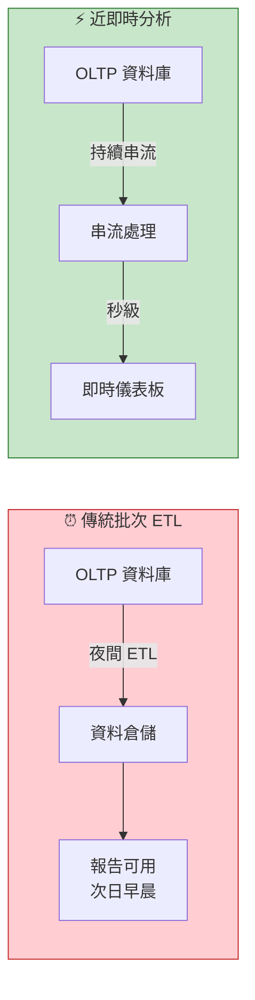
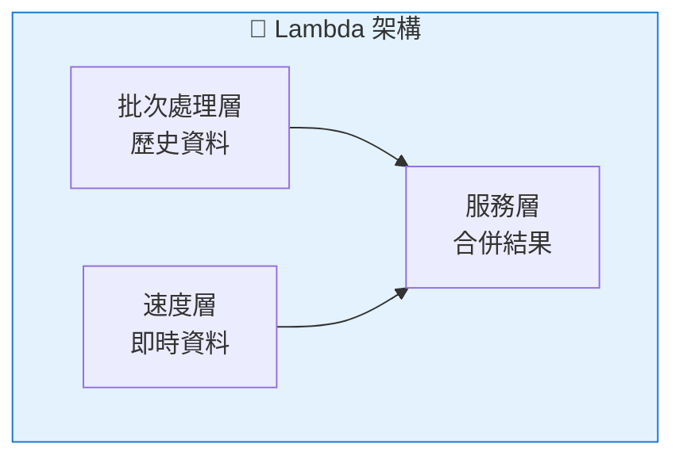
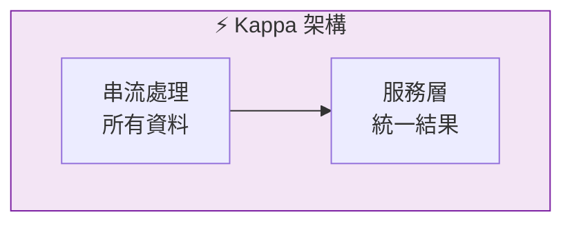
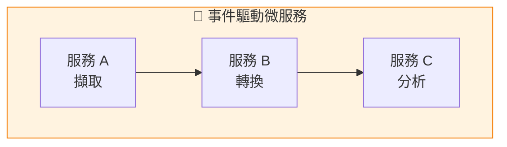
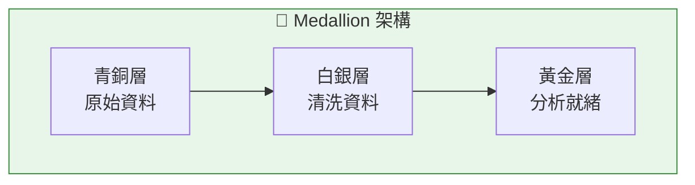
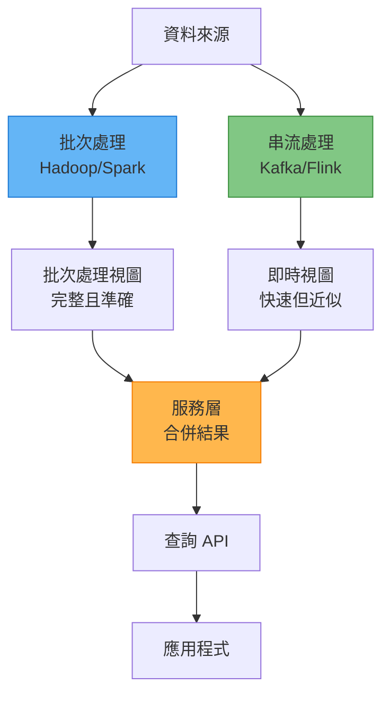
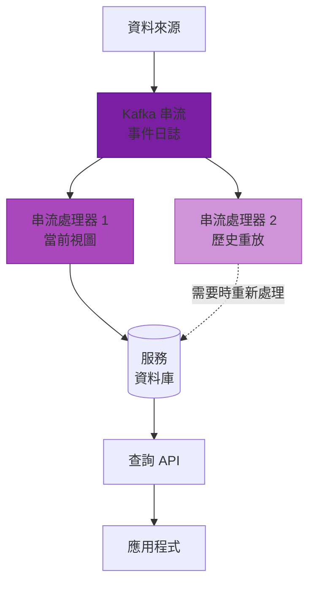
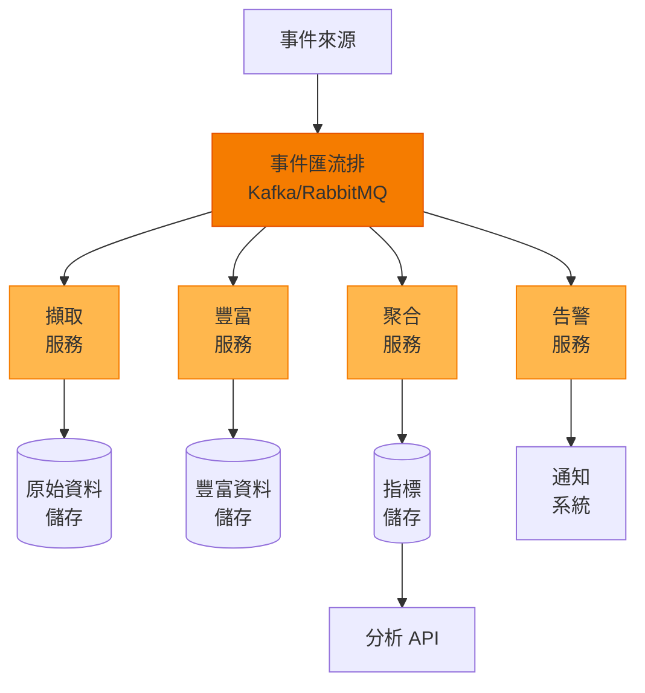
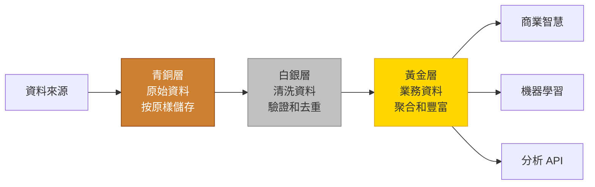
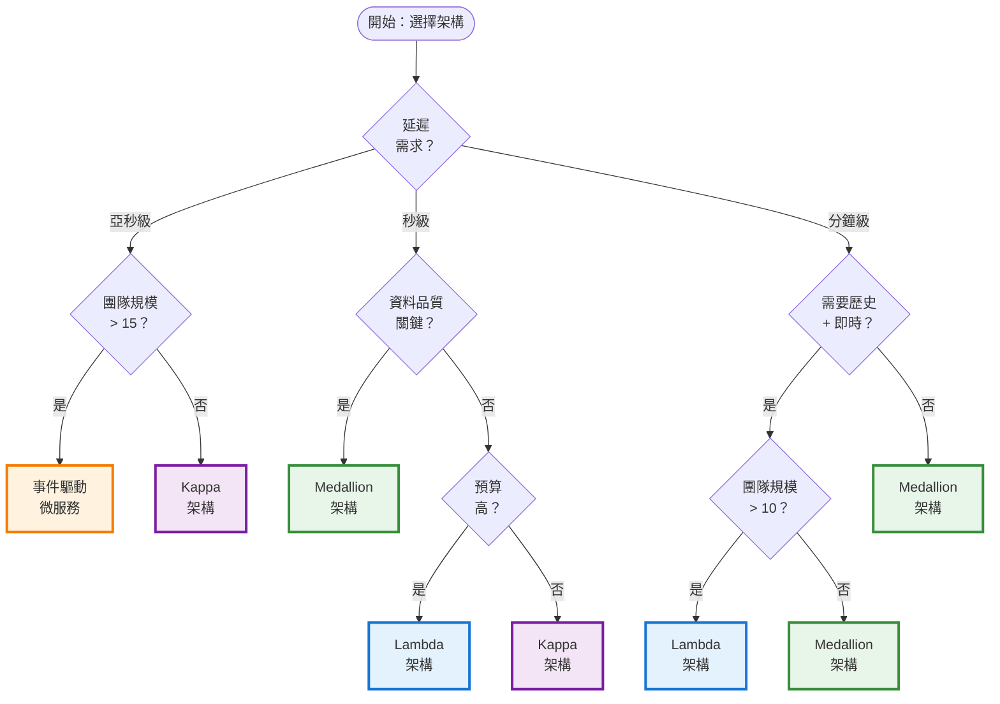

想像一下，你正在電商平台上進行限時搶購活動。訂單如潮水般湧入，庫存快速減少，你需要立即知道——哪些產品賣得最快，哪些地區最活躍，是否需要調整價格。傳統的隔夜更新批次處理分析已經無法滿足需求。你需要在幾秒鐘內獲得洞察，而不是幾小時。

這就是近即時分析的挑戰：在處理交易的操作資料庫（OLTP）和提供洞察的分析系統（OLAP）之間架起橋樑。雖然 OLTP 系統擅長處理單一交易，OLAP 系統針對複雜分析進行了最佳化，但兩者都無法單獨提供現代企業所需的即時洞察。

## 即時分析的挑戰

傳統資料架構依賴於定期執行的批次 ETL（提取、轉換、載入）流程——通常是在夜間執行。當業務決策可以等到早上時，這種方法運作良好，但今天的競爭環境需要更快的洞察。

**批次處理的限制：**

- **延遲**：資料產生和洞察之間相隔數小時或數天
- **錯失機會**：無法對即時事件做出反應
- **資源密集**：大型批次作業給系統帶來壓力
- **複雜性**：批次處理和即時需求需要獨立的程式碼庫

**近即時分析的優勢：**

- **即時洞察**：秒到分鐘級延遲
- **主動決策**：在事件發生時做出回應
- **更好的客戶體驗**：基於當前行為的個人化
- **競爭優勢**：比競爭對手行動更快

## 架構模式概述

四種架構模式應運而生，以應對近即時分析的挑戰。每種模式在複雜性、延遲和能力之間提供不同的權衡：

**快速比較：**

| 模式 | 最適合 | 複雜度 | 延遲 |
|------|--------|--------|------|
| **Lambda** | 歷史 + 即時洞察 | 高 | 混合 |
| **Kappa** | 純串流處理 | 中等 | 亞秒級 |
| **事件驅動微服務** | 大規模自動化 | 非常高 | 毫秒級 |
| **Medallion** | 資料治理與品質 | 中等 | 秒到分鐘 |

讓我們詳細探討每種模式。

## Lambda 架構：雙重處理路徑

Lambda 架構由 Nathan Marz 於 2011 年提出，將批次處理的歷史準確性與串流處理的即時洞察相結合。它維護兩條並行處理路徑，在服務層匯聚。

### 核心概念

Lambda 架構背後的基本思想是透過將工作負載分成兩個互補系統來處理歷史資料和即時資料：

**批次處理層**：處理完整資料集以產生準確、全面的視圖。定期執行（每小時、每天），從頭開始重新計算結果，即使速度層出現錯誤也能確保正確性。

**速度層**：僅處理最近的即時資料，提供低延遲更新。透過提供近似結果來補償批次處理層的高延遲，直到批次處理層趕上。

**服務層**：合併兩層的結果，向應用程式呈現統一視圖。處理將批次處理視圖（準確但陳舊）與即時增量（當前但近似）相結合的複雜性。

### 資料流

1. **擷取**：原始資料同時流向批次處理層和速度層
2. **批次處理**：完整的歷史資料以大批次處理（例如每天）
3. **串流處理**：最近的資料在到達時即時處理
4. **視圖產生**：兩層各自產生資料視圖
5. **查詢時間**：服務層合併兩個視圖來回答查詢
6. **視圖替換**：批次處理完成後，替換舊的批次處理視圖，速度層丟棄相應的即時資料

### 架構元件

!!!warning "⚠️ Lambda 架構的挑戰"
    **雙重程式碼庫**：維護獨立的批次處理和串流處理邏輯增加了複雜性，可能導致不一致。
    
    **資源密集**：執行兩個並行系統需要大量基礎設施和營運開銷。
    
    **最終一致性**：批次處理和即時視圖可能暫時分歧，需要在服務層仔細處理。

!!!tip "💡 何時使用 Lambda"
    - 需要歷史準確性和即時洞察
    - 能夠承擔營運複雜性
    - 團隊在批次處理和串流處理方面都有專業知識
    - 需要稽核追蹤和重新處理能力

## Kappa 架構：純串流處理

Kappa 架構由 Jay Kreps（Apache Kafka 的創建者）於 2014 年提出，透過完全消除批次處理層來簡化 Lambda。所有資料——歷史資料和即時資料——都透過單一串流處理管道流動。

### 核心概念

Kappa 架構挑戰了對獨立批次處理和串流處理系統的需求。相反，它將所有資料視為串流——歷史資料只是可以從不可變事件日誌中重放的舊事件。

**關鍵原則**：

**一切皆串流**：即時資料和歷史資料都透過相同的處理管道流動。處理昨天的資料和處理五分鐘前的資料在概念上沒有區別。

**不可變事件日誌**：所有事件都儲存在具有可設定保留期的僅附加日誌（通常是 Kafka）中。此日誌作為真實來源並支援重新處理。

**透過重放重新處理**：要修復錯誤或新增新功能，只需透過更新版本的串流處理器重放日誌中的事件。無需獨立的批次處理作業。

**單一程式碼庫**：一組處理邏輯處理所有資料，消除了維護雙重系統的複雜性和不一致性。

### 資料流

1. **事件擷取**：所有事件都寫入不可變日誌（Kafka 主題）
2. **串流處理**：處理器消費事件、維護狀態並產生結果
3. **狀態管理**：處理器使用本地狀態儲存（RocksDB）進行聚合
4. **輸出產生**：結果寫入服務資料庫或下游主題
5. **重新處理**：需要時，啟動新的處理器版本並從日誌中的任何點重放
6. **切換**：重新處理趕上後，將流量切換到新處理器

### 架構元件

!!!anote "💡 Kappa 架構的優勢"
    **單一程式碼庫**：一套處理邏輯處理所有資料，降低複雜性並確保一致性。
    
    **簡化營運**：無需維護獨立的批次處理和串流系統。
    
    **重新處理**：可以透過相同管道重放歷史資料以修復錯誤或新增新功能。
    
    **強一致性**：所有資料遵循相同的處理路徑。

!!!warning "⚠️ Kappa 架構的限制"
    **串流處理專業知識**：需要深入理解串流處理框架。
    
    **狀態管理**：在串流處理器中處理大狀態可能具有挑戰性。
    
    **複雜查詢**：某些分析查詢在串流範式中更難表達。

## 事件驅動微服務：模組化分析

事件驅動微服務架構將分析分解為透過事件非同步通訊的獨立服務。每個服務處理特定職責並可以獨立擴展。

### 核心概念

此模式將微服務原則應用於分析，將單體資料管道分解為對事件做出反應的鬆耦合服務。每個服務都是自治的，擁有自己的資料，並透過事件匯流排進行通訊。

**關鍵原則**：

**服務自治**：每個微服務都可以獨立部署、擴展和維護。團隊可以在不同服務上工作而無需協調。

**事件驅動通訊**：服務不直接相互呼叫。相反，它們將事件發布到訊息匯流排（Kafka、RabbitMQ）並訂閱感興趣的事件。

**單一職責**：每個服務都有一個明確的目的——擷取、豐富、聚合、告警等。這使服務更易於理解和維護。

**多語言架構**：不同的服務可以使用不同的技術。為 ML 服務使用 Python，為高效能擷取使用 Go，為複雜串流處理使用 Java。

**獨立擴展**：根據特定負載擴展每個服務。如果豐富是瓶頸，只擴展該服務而不觸及其他服務。

### 資料流

1. **事件產生**：來源系統將事件發布到事件匯流排
2. **服務消費**：每個服務訂閱相關事件主題
3. **處理**：服務獨立非同步處理事件
4. **事件發布**：服務將其結果作為新事件發布
5. **級聯處理**：下游服務消費這些事件並繼續管道
6. **並行處理**：多個服務可以同時處理相同事件用於不同目的

### 真實世界範例：電商分析

**擷取服務**：驗證和規範化來自 Web、行動和 API 的原始事件
**豐富服務**：新增使用者設定檔、產品中繼資料和地理資料
**聚合服務**：計算即時指標（按類別、地區、時間的銷售額）
**推薦服務**：產生個人化產品推薦
**告警服務**：偵測異常並傳送通知
**報告服務**：產生業務報告和儀表板

### 架構元件

!!!anote "💡 微服務的優勢"
    **獨立擴展**：根據特定負載擴展每個服務。
    
    **技術靈活性**：為不同服務使用不同的語言/框架。
    
    **故障隔離**：一個服務的故障不會導致整個系統崩潰。
    
    **團隊自治**：不同團隊可以擁有不同的服務。

!!!warning "⚠️ 微服務的挑戰"
    **營運複雜性**：管理多個服務需要複雜的編排。
    
    **分散式除錯**：跨服務追蹤問題具有挑戰性。
    
    **網路開銷**：服務間通訊增加延遲。
    
    **資料一致性**：跨服務維護一致性需要仔細設計。

## Medallion 架構：分層資料品質

Medallion 架構由 Databricks 推廣，將資料組織成三個漸進層——青銅層（原始）、白銀層（清洗）和黃金層（分析就緒）——確保資料品質在每個階段都得到提高，同時保持完全可追溯性。

### 核心概念

Medallion 架構採用結構化的分層方法進行資料處理，每層都有特定的目的和品質級別。資料流經這些層，變得越來越精煉和有價值。

**關鍵原則**：

**漸進式精煉**：資料品質隨著在層間移動而提高。青銅層按原樣儲存所有內容，白銀層清洗和驗證，黃金層聚合供業務使用。

**資料血緣**：從原始資料到業務指標的完全可追溯性。你始終可以將黃金層指標追溯到白銀層，再追溯到原始青銅層資料。

**關注點分離**：每層都有明確的職責。青銅層處理擷取，白銀層處理品質，黃金層處理業務邏輯。

**重新處理能力**：因為青銅層保留原始資料，如果業務規則變更或修復錯誤，你始終可以重新處理白銀層和黃金層。

**增量複雜性**：從批次處理開始簡單，然後隨著需求演變逐層新增串流處理能力。

### 資料流

1. **青銅層擷取**：原始資料完全按接收時的樣子落地，無轉換
2. **青銅層儲存**：僅附加儲存，帶有中繼資料（擷取時間、來源檔案）
3. **白銀層處理**：從青銅層讀取，應用品質檢查、去重、標準化
4. **白銀層儲存**：清洗後的資料，帶有品質分數和驗證標誌
5. **黃金層聚合**：從白銀層讀取，應用業務邏輯，建立指標
6. **黃金層儲存**：業務就緒的表，針對查詢和儀表板進行最佳化

### 層詳情

**青銅層（原始區）**：
- **目的**：保留原始資料用於稽核和重新處理
- **格式**：與來源相同（JSON、CSV、Parquet）
- **操作**：僅附加，無轉換
- **保留**：長期或無限期（合規要求）
- **用例**：資料復原、重新處理、稽核追蹤

**白銀層（清洗區）**：
- **目的**：為分析提供清洗、驗證的資料
- **格式**：結構化（Parquet、Delta Lake）
- **操作**：去重、驗證、標準化、豐富
- **保留**：中期到長期
- **用例**：探索性分析、特徵工程、ML 訓練

**黃金層（策展區）**：
- **目的**：提供業務就緒的指標和聚合
- **格式**：針對查詢最佳化（星型架構、聚合表）
- **操作**：聚合、業務邏輯、反正規化
- **保留**：基於業務需求
- **用例**：儀表板、報告、商業智慧、API

### 架構元件

!!!anote "💡 Medallion 架構的優勢"
    **資料血緣**：從原始資料到業務指標的清晰可追溯性。
    
    **品質保證**：漸進式精煉確保高品質分析。
    
    **靈活性**：可以重新處理任何層而不影響其他層。
    
    **治理**：每層的稽核追蹤和資料品質檢查。

!!!tip "💡 最佳實務"
    **青銅層**：無限期保留原始資料以滿足合規和重新處理需求。
    
    **白銀層**：實作全面的資料品質檢查和驗證規則。
    
    **黃金層**：透過適當的分割和索引最佳化查詢效能。
    
    **監控**：追蹤每層的資料品質指標和處理延遲。

## 架構模式比較

選擇正確的模式取決於你的具體需求、團隊能力和組織約束。

### 綜合比較表

| 方面 | Lambda | Kappa | 事件驅動微服務 | Medallion |
|------|--------|-------|---------------|-----------|
| **延遲** | 混合（批次：小時，串流：秒） | 亞秒到毫秒 | 毫秒到秒 | 秒到分鐘 |
| **可擴展性** | 高（雙路徑） | 非常高（串流中心） | 非常高（水平） | 高（基於層） |
| **複雜度** | 高（雙程式碼庫） | 中等（單一模型） | 非常高（分散式） | 中等（結構化） |
| **維護** | 複雜（兩個系統） | 中等（統一） | 高（多服務） | 低（清晰流程） |
| **成本** | 高（重複基礎設施） | 中等（單一基礎設施） | 可變（按服務） | 中等（分層儲存） |
| **一致性** | 最終一致 | 強一致性 | 最終一致 | 層內強一致 |
| **學習曲線** | 陡峭（多技術） | 中等（串流） | 非常陡峭（微服務） | 低（直觀） |
| **重新處理** | 批次處理層處理 | 從日誌重放 | 特定於服務 | 逐層 |
| **資料品質** | 按層變化 | 串流驗證 | 服務級檢查 | 漸進式精煉 |
| **團隊規模** | 大型（10+ 工程師） | 中型（5-10） | 大型（15+ 工程師） | 小到中型（3-8） |

### 效能特徵

!!!anote "📊 示意性資料"
    以下圖表呈現相對效能比較，以說明架構間的一般模式。實際延遲值因實作細節、基礎設施、資料量和查詢複雜性而有很大差異。將這些用作方向性指導而非絕對基準。


{
  "title": {
    "text": "按架構模式的延遲比較"
  },
  "tooltip": {
    "trigger": "axis",
    "axisPointer": {
      "type": "shadow"
    }
  },
  "legend": {
    "data": ["Lambda", "Kappa", "微服務", "Medallion"]
  },
  "xAxis": {
    "type": "category",
    "data": ["簡單查詢", "聚合", "複雜連接", "歷史分析"]
  },
  "yAxis": {
    "type": "value",
    "name": "延遲 (ms)",
    "axisLabel": {
      "formatter": "{value}"
    }
  },
  "series": [
    {
      "name": "Lambda",
      "type": "bar",
      "data": [100, 500, 2000, 5000],
      "itemStyle": { "color": "#1976d2" }
    },
    {
      "name": "Kappa",
      "type": "bar",
      "data": [50, 200, 800, 3000],
      "itemStyle": { "color": "#7b1fa2" }
    },
    {
      "name": "微服務",
      "type": "bar",
      "data": [30, 150, 600, 2500],
      "itemStyle": { "color": "#f57c00" }
    },
    {
      "name": "Medallion",
      "type": "bar",
      "data": [200, 800, 3000, 8000],
      "itemStyle": { "color": "#388e3c" }
    }
  ]
}


### 用例適用性

| 用例 | 最佳模式 | 原因 |
|------|---------|------|
| **即時個人化** | Kappa | 亞秒級延遲，一致處理 |
| **詐欺偵測** | 事件驅動微服務 | 針對不同詐欺模式的獨立服務 |
| **合規報告** | Medallion | 資料血緣、稽核追蹤、品質保證 |
| **A/B 測試** | Kappa | 快速實驗評估，易於重新處理 |
| **客戶 360 視圖** | Lambda | 結合歷史和即時資料 |
| **行銷活動自動化** | 事件驅動微服務 | 靈活、可擴展、獨立服務 |
| **金融分析** | Medallion | 資料品質、治理、監管合規 |
| **物聯網感測器分析** | Kappa | 高容量串流、低延遲 |
| **商業智慧** | Lambda 或 Medallion | 歷史分析加一些即時需求 |

## 選擇正確的模式

選擇適當的架構模式對於近即時分析計畫的成功至關重要。決策應基於對需求、約束和組織能力的仔細評估。

### 關鍵決策因素

**延遲需求**

你需要多快從資料中獲得洞察？

- **亞秒級（< 100ms）**：即時個人化、詐欺偵測、演算法交易
  - 最適合：**Kappa** 或 **事件驅動微服務**
  - 原因：串流處理開銷最小

- **近即時（100ms - 1s）**：即時儀表板、A/B 測試、推薦引擎
  - 最適合：**Kappa**
  - 原因：單一串流處理管道，效能一致

- **秒到分鐘**：商業智慧、營運報告
  - 最適合：**Medallion** 或 **Lambda**
  - 原因：可以利用批次處理提高效率

**團隊規模和專業知識**

你有哪些可用資源？

- **小團隊（< 5 名工程師）**：資源有限，需要簡單性
  - 最適合：**Medallion**
  - 原因：結構清晰，營運開銷低，更易學習

- **中型團隊（5-10 名工程師）**：有一些串流處理專業知識
  - 最適合：**Kappa**
  - 原因：單一程式碼庫，可管理的複雜性

- **大型團隊（10+ 名工程師）**：多個專業團隊
  - 最適合：**Lambda** 或 **事件驅動微服務**
  - 原因：可以處理營運複雜性，團隊自治

**資料品質和治理**

資料品質和合規性有多重要？

- **關鍵**：金融服務、醫療保健、受監管產業
  - 最適合：**Medallion**
  - 原因：漸進式精煉、完整血緣、稽核追蹤

- **重要**：電商、SaaS 平台
  - 最適合：**Lambda** 或 **Medallion**
  - 原因：批次處理層確保準確性，每個階段的品質檢查

- **中等**：內部分析、實驗
  - 最適合：**Kappa**
  - 原因：串流驗證足夠，迭代更快

**預算約束**

你的基礎設施預算是多少？

- **有限**：新創公司、小企業
  - 最適合：**Kappa** 或 **Medallion**
  - 原因：單一基礎設施，高效資源使用

- **中等**：成長型公司
  - 最適合：**Medallion** 或 **Kappa**
  - 原因：成本和能力平衡

- **高**：大型企業
  - 最適合：**Lambda** 或 **事件驅動微服務**
  - 原因：能夠承擔雙系統、專業服務

**用例複雜性**

你的分析需求有多複雜？

- **簡單**：單一目的分析、直接指標
  - 最適合：**Kappa** 或 **Medallion**
  - 原因：避免不必要的複雜性

- **中等**：多個用例、一些整合需求
  - 最適合：**Lambda** 或 **Medallion**
  - 原因：足夠靈活以滿足多樣化需求

- **複雜**：許多專業需求、多個領域
  - 最適合：**事件驅動微服務**
  - 原因：服務自治、技術靈活性

### 決策流程圖

### 按場景的模式推薦

**場景 1：新創公司建構首個分析平台**
- **團隊**：3-5 名工程師，串流處理經驗有限
- **需求**：每日報告，一些近即時儀表板
- **預算**：有限
- **推薦**：**Medallion 架構**
- **理由**：從簡單開始，建立資料品質實務，易於學習和維護。隨著需求增長，稍後可以向白銀層新增串流處理。

**場景 2：具有個人化功能的電商平台**
- **團隊**：8 名工程師，有一些 Kafka 經驗
- **需求**：即時產品推薦，亞秒級延遲
- **預算**：中等
- **推薦**：**Kappa 架構**
- **理由**：單一程式碼庫降低複雜性，串流處理滿足延遲需求，可以重放進行實驗。

**場景 3：有合規需求的金融服務**
- **團隊**：12 名工程師，混合專業知識
- **需求**：監管報告、稽核追蹤、資料血緣
- **預算**：高
- **推薦**：**Medallion 架構**
- **理由**：漸進式精煉確保品質，完整血緣滿足合規，清晰的關注點分離便於稽核。

**場景 4：具有多個分析用例的大型企業**
- **團隊**：20+ 名工程師分布在多個團隊
- **需求**：詐欺偵測、推薦、報告、告警
- **預算**：高
- **推薦**：**事件驅動微服務**
- **理由**：服務自治實現團隊獨立，技術靈活性滿足專業需求，水平擴展。

**場景 5：需要歷史和即時的 SaaS 平台**
- **團隊**：15 名工程師，強大的技術能力
- **需求**：客戶 360 視圖、歷史趨勢、即時告警
- **預算**：高
- **推薦**：**Lambda 架構**
- **理由**：批次處理層用於準確的歷史分析，速度層用於即時告警，大規模驗證。

### 要避免的常見反模式

!!!warning "⚠️ 不要基於炒作選擇"
    **反模式**：因為流行而選擇事件驅動微服務
    
    **問題**：營運複雜性壓垮小團隊
    
    **解決方案**：從 Medallion 開始，只有在複雜性合理時才演進到微服務

!!!warning "⚠️ 不要過早過度工程"
    **反模式**：為簡單用例建構 Lambda 架構
    
    **問題**：雙系統增加成本和維護負擔
    
    **解決方案**：使用 Kappa 或 Medallion，只在需要時新增複雜性

!!!warning "⚠️ 不要忽視團隊能力"
    **反模式**：在沒有串流處理專業知識的情況下選擇 Kappa
    
    **問題**：團隊在狀態管理和除錯方面掙扎
    
    **解決方案**：先投資培訓，或從 Medallion 開始並建立專業知識

!!!warning "⚠️ 不要為速度犧牲資料品質"
    **反模式**：使用 Kappa 而沒有適當的驗證
    
    **問題**：壞資料快速傳播通過系統
    
    **解決方案**：即使在串流處理中也要實作全面驗證

### 遷移路徑：演進你的架構

**為什麼從簡單開始並演進？**

許多組織犯了從第一天就建構目標架構的錯誤。這種方法經常失敗，原因有幾個關鍵因素：

**1. 學習曲線陡峭**

像 Lambda 或事件驅動微服務這樣的複雜架構需要團隊最初很少具備的專業知識：
- 串流處理框架（Kafka、Flink）具有微妙的行為
- 分散式系統引入細微的故障模式
- 營運複雜性隨著架構複雜度成倍增加
- 除錯分散式系統需要專業技能

從簡單開始允許你的團隊逐步建立專業知識，在應對複雜挑戰之前從較小的錯誤中學習。

**2. 需求會變化**

你對需求的初始理解通常是不完整的：
- 業務優先順序隨著你交付價值而轉移
- 效能瓶頸出現在意想不到的地方
- 使用者需求隨著他們看到可能性而演變
- 技術格局變化（新工具、更好的實務）

更簡單的架構在需求變化時更容易修改，降低了出錯的成本。

**3. 過早最佳化代價高昂**

為你還不需要的規模建構會浪費資源：
- 基礎設施成本更高（雙系統、多服務）
- 開發時間增加（更多元件要建構）
- 營運開銷增長（更多系統要監控和維護）
- 團隊速度減慢（複雜性產生摩擦）

從今天需要的開始，在有證據表明必要時再擴展。

**4. 早期證明價值很重要**

更簡單的架構更快交付價值：
- 更短的首次洞察時間
- 更容易展示投資報酬率
- 建立利害關係人信心
- 為未來階段獲得資金

在幾週而不是幾個月內交付可工作的分析創造動力和組織認同。

**5. 資料品質基礎至關重要**

無論你的目標架構如何，資料品質實務必須首先建立：
- 垃圾進垃圾出適用於所有模式
- 品質問題在複雜系統中更難修復
- Medallion 的分層方法教授品質紀律
- 這些實務延續到任何未來架構

從 Medallion 開始建立品質基礎，使所有未來工作受益。

**6. 風險緩解**

演進方法降低風險：
- 每個階段都是獨立有價值的
- 可以在任何階段停止或轉向
- 失敗更小且可復原
- 學習在各階段複合

如果第 1 階段失敗，你損失的投資比建構完整複雜系統要少。

**演進優勢**

大多數成功的實作不是從最終架構開始的。它們基於不斷變化的需求和不斷增長的能力而演進。這種方法：

- **降低風險**：每個階段獨立交付價值
- **建立專業知識**：團隊逐步學習
- **驗證假設**：在大量投資之前證明需求
- **保持敏捷性**：需要時更容易轉向
- **最佳化投資**：在需要時花費在需要的東西上

**第 1 階段：基礎（第 1-3 個月）**

從 **Medallion 架構**開始：
- 建立青銅層用於原始資料擷取
- 實作帶有基本品質檢查的白銀層
- 建立帶有關鍵業務指標的黃金層
- 建立團隊在資料品質實務方面的專業知識
- 透過批次處理證明價值

**成功標準**：
- 建立並監控資料品質指標
- 團隊熟悉分層方法
- 業務利害關係人從黃金層看到價值
- 記錄清晰的資料血緣

**第 2 階段：近即時能力（第 4-6 個月）**

向**白銀層**新增串流處理：
- 為青銅層 → 白銀層引入串流處理
- 最初保持青銅層和黃金層為批次處理
- 將延遲從小時減少到分鐘
- 監控串流處理效能

**成功標準**：
- 白銀層在幾分鐘內更新
- 串流處理穩定且受監控
- 團隊熟悉串流概念
- 延遲改進可衡量

**第 3 階段：完全串流或專業化（第 7-12 個月）**

根據需求演進：

**選項 A：遷移到 Kappa 架構**
- 將串流擴展到黃金層
- 實作事件重放能力
- 整合到單一處理模型
- 實現亞秒級延遲

**選項 B：採用微服務**
- 分解為專業服務
- 實作特定於服務的最佳化
- 實現團隊自治
- 獨立擴展服務

**選項 C：保持增強的 Medallion**
- 在需要的地方新增串流處理
- 為複雜聚合保留批次處理
- 保持資料品質焦點
- 針對你的特定用例最佳化

**成功標準**：
- 滿足延遲目標
- 系統可靠性 > 99.9%
- 團隊高效且自治
- 成本在預算內

!!!tip "💡 演進指南"
    **不要急於求成**：每個階段在進入下一個階段之前應該穩定
    
    **衡量一切**：追蹤延遲、品質、成本和團隊速度
    
    **保持簡單**：只有在業務價值合理時才新增複雜性
    
    **保持品質**：資料品質實務應貫穿所有階段

## 結論

近即時分析在操作資料庫和分析系統之間架起橋樑，使企業能夠在幾秒鐘而不是幾小時內做出資料驅動的決策。四種架構模式——Lambda、Kappa、事件驅動微服務和 Medallion——各自為這一挑戰提供了獨特的方法。

### 模式選擇總結

**選擇 Lambda 架構**，當你需要全面的歷史分析和即時洞察，擁有大型團隊，並且可以管理雙重處理路徑的複雜性時。

**選擇 Kappa 架構**，當即時處理是你的主要焦點，你想要更簡單的單一程式碼庫方法，並且你的團隊具有串流處理專業知識時。

**選擇事件驅動微服務**，當你需要極端的可擴展性和靈活性，在不同領域有專業需求，並且可以處理分散式系統的營運複雜性時。

**選擇 Medallion 架構**，當資料品質和治理至關重要，你正在從頭開始建構分析能力，或者你有一個重視簡單性和清晰結構的小團隊時。

### 關鍵要點

**從你的需求開始**：不要基於炒作選擇模式。評估你的延遲需求、團隊能力、預算約束和資料品質要求。

**考慮總成本**：除了基礎設施成本，還要考慮開發時間、營運開銷和團隊的學習曲線。

**規劃演進**：你的架構應該隨著你的需求增長。從 Medallion 開始並演進到 Kappa 或微服務通常比預先建構複雜系統更實用。

**優先考慮資料品質**：無論你選擇哪種模式，在每個階段都要實作強大的資料驗證、監控和品質檢查。

**投資可觀測性**：近即時系統需要全面的監控、告警和除錯能力來維持可靠性。

### 真實世界的成功模式

許多成功的實作遵循混合方法：

- **青銅層**（Medallion）用於原始資料擷取和稽核追蹤
- **Kappa 風格串流處理**用於即時轉換
- **黃金層**（Medallion）用於業務就緒指標
- **微服務**用於專業處理需求

這種組合提供了 Medallion 的資料品質優勢、Kappa 的即時能力和微服務的靈活性——而沒有任何單一模式的全部複雜性。

### 下一步

1. **評估你的當前狀態**：記錄你現有的資料架構、團隊能力和痛點
2. **定義成功指標**：建立清晰的延遲、品質和成本目標
3. **從小處開始**：在承諾全面部署之前，用一種模式實作試點專案
4. **衡量和迭代**：監控效能，收集回饋，並調整你的方法
5. **建立專業知識**：投資培訓並為你選擇的模式聘請專家

!!!anote "💡 最終建議"
    對於大多數開始近即時分析之旅的團隊，**Medallion 架構**提供了簡單性、資料品質和增長空間的最佳平衡。隨著你的需求演變和團隊獲得專業知識，你可以逐步採用串流處理能力，並在需要時最終過渡到 Kappa 或微服務模式。
    
    目標不是建構最複雜的架構——而是提供可靠、及時的洞察，推動業務價值。

## 參考資料

- [The Lambda Architecture](http://lambda-architecture.net/) - Nathan Marz
- [Questioning the Lambda Architecture](https://www.oreilly.com/radar/questioning-the-lambda-architecture/) - Jay Kreps（Kafka 創建者）
- [Delta Lake: High-Performance ACID Table Storage](https://databricks.com/product/delta-lake-on-databricks)
- [Apache Kafka Documentation](https://kafka.apache.org/documentation/)
- [Apache Flink: Stateful Computations over Data Streams](https://flink.apache.org/)
- [Designing Data-Intensive Applications](https://dataintensive.net/) - Martin Kleppmann
- [Streaming Systems](https://www.oreilly.com/library/view/streaming-systems/9781491983867/) - Tyler Akidau, Slava Chernyak, Reuven Lax
