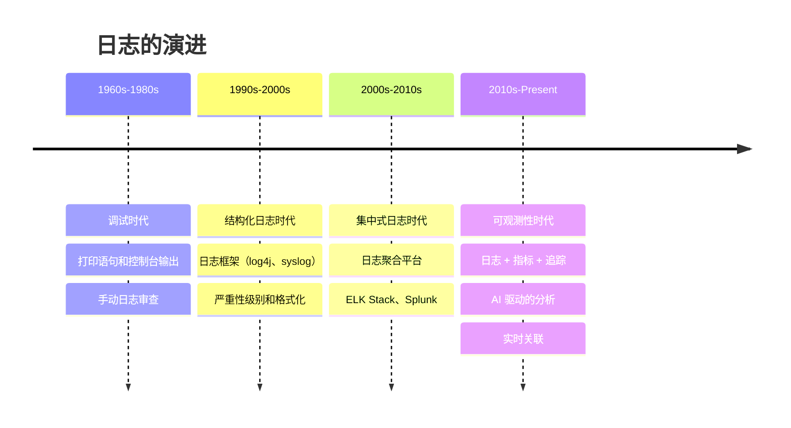
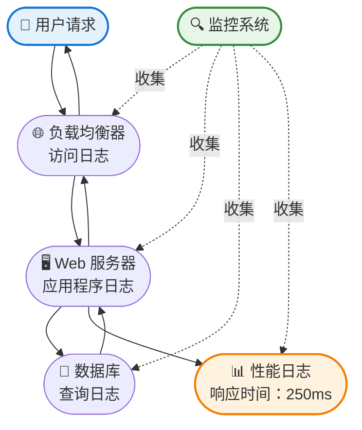
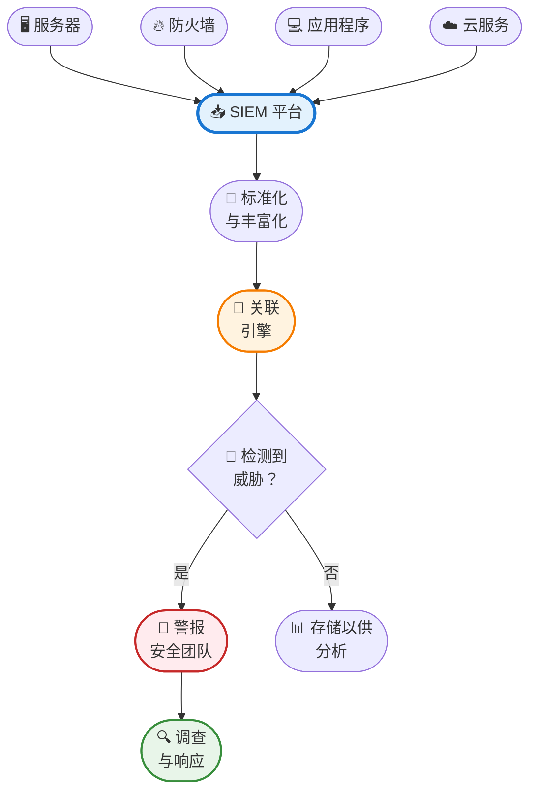

还记得上次应用程序在生产环境崩溃吗？你可能做了每个开发者都会做的事：疯狂地搜索日志文件，试图拼凑出问题所在。也许你在数千条 INFO 消息中找到了一个神秘的错误消息，或者更糟——发现关键错误根本没有被记录。

日志是我们系统的沉默守护者，持续记录着幕后发生的一切。但并非所有日志都是平等的。从追踪代码执行的简单应用程序日志，到检测网络威胁的复杂安全信息与事件管理（SIEM）系统，日志的领域广阔且常被误解。

从简单的调试打印语句开始，已经演变成一个复杂的专业日志系统生态系统，各自服务于不同的目的。现今的现代基础设施每秒产生数百万条日志记录，理解该收集哪些日志、如何存储它们，以及何时分析它们，可能意味着在几分钟内捕捉到安全漏洞，或是几个月后才发现的差异。

!!!tip "💡 什么是日志？"
    日志是系统、应用程序或网络中发生事件的时间戳记录。它们捕获从例行操作到关键错误的所有内容，为故障排除、安全分析、合规性和性能优化提供审计轨迹。

## 日志的演进：从打印语句到可观测性

日志的开始很简单。在早期的计算时代，开发者使用打印语句来理解代码在做什么。如果出了问题，你会加入更多打印语句、重新编译，然后再次运行。这是**调试时代**——粗糙但对小型程序有效。

随着系统变得更复杂，结构化日志出现了。开发者不再使用随机的打印语句，而是采用提供严重性级别（DEBUG、INFO、WARN、ERROR）、时间戳和一致格式的日志框架。这标志着**结构化日志时代**，日志变得可解析和可搜索，而不仅仅是人类可读的文本。

然后出现了分布式系统和微服务。单一用户请求可能会触及数十个服务，每个服务都产生自己的日志。关联这些日志变得至关重要，导致了**集中式日志时代**。像 ELK Stack（Elasticsearch、Logstash、Kibana）和 Splunk 这样的工具出现，用于聚合、搜索和可视化来自多个来源的日志。

今天，我们处于**可观测性时代**。日志只是可观测性的一个支柱，与指标和追踪一起工作，提供完整的系统可见性。现代平台将日志与性能指标、分布式追踪和安全事件关联起来，为团队提供前所未有的系统行为洞察。



## 日志类型：全面的分类

理解不同类型的日志及其目的，对于构建强健的系统至关重要。让我们探索主要类别以及何时使用每一种。

### 应用程序日志

应用程序日志记录软件代码中的事件——函数调用、变量值、业务逻辑执行和错误。这些是开发者最常交互的日志。

**它们捕获什么：**
- 函数进入和退出点
- 关键时刻的变量值
- 业务逻辑决策（例如，"用户符合折扣资格"）
- 异常和错误堆栈跟踪
- 操作的性能计时

**常见严重性级别：**
- **TRACE**：极其详细的信息，通常仅在开发期间启用
- **DEBUG**：对诊断问题有用的详细信息
- **INFO**：关于应用程序流程的一般信息消息
- **WARN**：可能有害但尚未成为错误的情况
- **ERROR**：可能仍允许应用程序继续的错误事件
- **FATAL**：导致应用程序终止的严重错误

**最佳实践：**
- 使用结构化日志格式（JSON）以便更容易解析
- 包含关联 ID 以追踪跨服务的请求
- 避免记录敏感数据（密码、信用卡、个人识别信息）
- 为不同环境设置适当的日志级别（开发环境用 DEBUG，生产环境用 INFO）
- 实施日志轮转以防止磁盘空间耗尽

!!!example "🎬 真实世界的应用程序日志"
    ```json
    {
      "timestamp": "2020-06-15T14:32:18.123Z",
      "level": "ERROR",
      "service": "payment-service",
      "correlationId": "abc-123-def-456",
      "message": "Payment processing failed",
      "error": "Gateway timeout",
      "userId": "user_789",
      "amount": 99.99,
      "stackTrace": "..."
    }
    ```
    
    这种结构化格式使得搜索与特定用户、关联 ID 或错误类型相关的所有错误变得容易。

### 系统日志

系统日志捕获操作系统和基础设施事件——服务器启动、硬件故障、内核消息和系统服务状态变更。

**它们捕获什么：**
- 开机和关机事件
- 硬件错误（磁盘故障、内存问题）
- 内核消息和驱动程序事件
- 系统服务状态（已启动、已停止、失败）
- 资源耗尽警告

**常见系统日志类型：**
- **syslog**：Unix/Linux 标准日志协议
- **Windows 事件日志**：Windows 系统事件记录
- **journald**：现代 Linux 日志系统（systemd）
- **dmesg**：内核环形缓冲区消息

**为什么它们重要：**
系统日志通常提供硬件故障、安全漏洞或配置问题的早期警告信号。磁盘错误的突然激增可能预测即将发生的磁盘驱动器故障，而异常的身份验证尝试可能表示暴力攻击。

### 安全日志

安全日志追踪身份验证、授权和安全相关事件。这些对于检测漏洞、调查事件和满足合规要求至关重要。

**它们捕获什么：**
- 登录尝试（成功和失败）
- 权限变更和权限提升
- 防火墙允许/拒绝决策
- 入侵检测系统（IDS）警报
- 数据访问和修改事件
- 安全策略违规

**关键安全日志来源：**
- **身份验证日志**：谁登录、何时以及从哪里
- **防火墙日志**：允许或阻止的网络流量
- **IDS/IPS 日志**：检测到的入侵尝试
- **防病毒日志**：恶意软件检测和隔离事件
- **VPN 日志**：远程访问连接
- **数据库审计日志**：敏感数据访问

**合规要求：**
许多法规要求保留安全日志：
- **PCI DSS**：90 天在线，1 年归档（支付卡数据）
- **HIPAA**：6 年（医疗保健数据）
- **SOX**：7 年（财务记录）
- **GDPR**：依目的和法律依据而异

!!!warning "⚠️ 安全日志最佳实践"
    - **保护日志完整性**：将日志存储在独立系统上，以防止攻击者掩盖其踪迹
    - **实时监控**：不要等到每月审查才检测漏洞
    - **关联事件**：单次登录失败是正常的；一分钟内 1000 次就是攻击
    - **加密敏感日志**：日志可能包含敏感信息
    - **实施篡改检测**：使用加密哈希来检测日志修改

### 审计日志

审计日志提供详细、不可变的记录，记载谁做了什么、何时以及在哪里。与一般应用程序日志不同，审计日志专门设计用于合规性、取证和问责制。

**它们捕获什么：**
- 用户操作（创建、读取、更新、删除）
- 管理变更（配置、权限）
- 数据访问和修改
- 系统配置变更
- 策略违规

**关键特征：**
- **不可变**：一旦写入，审计日志永远不应被修改或删除
- **全面**：捕获所有相关上下文（谁、什么、何时、哪里、为什么）
- **防篡改**：使用加密技术检测修改
- **长期保留**：通常保留数年以满足合规要求

**审计日志 vs 应用程序日志：**

| 方面 | 应用程序日志 | 审计日志 |
|--------|----------------|-----------|
| **目的** | 调试、故障排除 | 合规性、问责制 |
| **受众** | 开发者、运维人员 | 审计员、法务、安全 |
| **保留期** | 数天到数周 | 数月到数年 |
| **可变性** | 可以轮转/删除 | 不可变 |
| **详细程度** | 技术细节 | 业务操作 |

!!!example "🎯 审计日志示例"
    ```json
    {
      "timestamp": "2020-06-15T14:32:18.123Z",
      "actor": {
        "userId": "admin_123",
        "ipAddress": "192.168.1.100",
        "userAgent": "Mozilla/5.0..."
      },
      "action": "DELETE",
      "resource": {
        "type": "customer_record",
        "id": "cust_456",
        "name": "John Doe"
      },
      "result": "SUCCESS",
      "reason": "Customer requested data deletion (GDPR)",
      "signature": "a3f5b8c9d2e1..."
    }
    ```

### 访问日志

访问日志记录对 Web 服务器、API 和其他网络服务的请求。它们对于理解流量模式、检测攻击和故障排除连接问题至关重要。

**它们捕获什么：**
- HTTP 请求（方法、URL、状态码）
- 客户端信息（IP 地址、用户代理）
- 响应大小和计时
- 引用来源和身份验证详细信息

**常见格式：**
- **Apache Combined Log Format**：标准 Web 服务器格式
- **NGINX 访问日志**：类似 Apache，具有自定义选项
- **AWS CloudFront 日志**：CDN 访问日志
- **API Gateway 日志**：API 请求/响应详细信息

**使用案例：**
- **流量分析**：理解用户行为和热门内容
- **性能监控**：识别缓慢的端点
- **安全检测**：发现 SQL 注入、XSS 尝试、机器人流量
- **容量规划**：根据流量趋势预测基础设施需求

### 性能日志

性能日志追踪系统和应用程序性能指标——响应时间、资源利用率、吞吐量和瓶颈。

**它们捕获什么：**
- 请求/响应延迟
- 数据库查询执行时间
- CPU、内存、磁盘、网络利用率
- 线程池和连接池指标
- 缓存命中/未命中率
- 垃圾回收事件

**为什么它们重要：**
性能日志有助于在影响用户之前识别瓶颈。数据库查询时间的逐渐增加可能表示缺少索引或数据量增长需要优化。



### 事务日志

事务日志记录数据库操作，确保数据完整性并在故障后启用恢复。这些对于维护数据库的 ACID 属性至关重要。

**它们捕获什么：**
- 数据库事务（BEGIN、COMMIT、ROLLBACK）
- 数据修改（INSERT、UPDATE、DELETE）
- 模式变更（CREATE、ALTER、DROP）
- 检查点和恢复信息

**关键功能：**
- **崩溃恢复**：在系统故障后重放已提交的事务
- **时间点恢复**：将数据库还原到特定时刻
- **复制**：将变更传播到副本数据库
- **审计轨迹**：追踪所有数据修改

**特定数据库示例：**
- **MySQL Binary Log**：复制和时间点恢复
- **PostgreSQL WAL**：预写式日志以确保持久性
- **Oracle Redo Log**：事务恢复和复制
- **MongoDB Oplog**：副本集的操作日志

## SIEM：安全的中枢神经系统

安全信息与事件管理（SIEM）系统代表日志分析的巅峰，关联来自多个来源的数据以检测威胁、调查事件并确保合规性。

### 什么是 SIEM？

SIEM 平台聚合来自整个基础设施的日志——防火墙、服务器、应用程序、数据库、云服务——并应用高级分析来实时检测安全威胁。

**核心能力：**

**日志聚合**：从不同格式的多样来源收集日志，并将它们标准化为通用模式以进行分析。

**实时关联**：应用规则来检测多个日志来源的模式。例如，关联访问日志中的失败登录尝试与防火墙阻止和 IDS 警报，以识别协同攻击。

**威胁检测**：使用签名、行为分析和机器学习来识别已知和未知的威胁。

**事件调查**：提供搜索和可视化工具来调查安全事件、追踪攻击路径并理解影响。

**合规报告**：生成报告，证明符合 PCI DSS、HIPAA、SOX 和 GDPR 等法规。

**警报和响应**：在检测到威胁时触发警报，并与安全编排工具集成以进行自动响应。

### SIEM 如何运作



### SIEM 使用案例

**检测暴力攻击**：关联来自同一 IP 的多次失败登录尝试跨不同系统，当超过阈值时触发警报。

**识别内部威胁**：检测异常的数据访问模式，例如员工在正常工作时间外下载大量客户数据。

**合规监控**：持续监控策略违规，并生成审计报告证明符合法规要求。

**事件响应**：当发生漏洞时，快速搜索所有日志以理解攻击时间线、受影响的系统和数据暴露。

**威胁狩猎**：主动搜索历史日志中的入侵指标（IOC），以识别先前未检测到的漏洞。

### 热门 SIEM 平台

**Splunk**：市场领导者，具有强大的搜索能力和广泛的集成。以灵活性著称，但大规模使用可能昂贵。

**IBM QRadar**：强大的关联引擎和威胁情报集成。在企业环境中很受欢迎。

**ArcSight**：长期建立的平台，具有强健的合规功能。对大型组织来说复杂但强大。

**Elastic Security（ELK Stack）**：开源选项，结合 Elasticsearch、Logstash 和 Kibana 与安全分析。对具有技术专业知识的组织来说具成本效益。

**Azure Sentinel**：云原生 SIEM，具有 AI 驱动的威胁检测。与 Microsoft 生态系统无缝集成。

**AWS Security Hub**：聚合来自 AWS 服务和第三方工具的安全发现。最适合以 AWS 为中心的环境。

!!!anote "📝 SIEM vs 日志管理"
    **日志管理**专注于收集、存储和搜索日志以进行故障排除和分析。
    
    **SIEM** 增加了安全特定能力：威胁检测、关联、合规报告和事件响应。
    
    将日志管理视为基础，SIEM 视为建立在其上的安全情报层。

## 构建全面的日志策略

有效的日志记录不是收集所有东西——而是收集正确的东西并知道如何使用它们。以下是如何构建平衡可见性、成本和合规性的日志策略。

### 定义您的日志需求

**识别利益相关者**：不同团队需要不同的日志：
- **开发者**：用于调试的应用程序日志
- **运维人员**：用于故障排除的系统和性能日志
- **安全人员**：用于威胁检测的安全和审计日志
- **合规人员**：用于法规要求的审计日志
- **业务人员**：用于分析的事务日志

**确定保留期限**：平衡存储成本与合规和运营需求：
- **热存储**（快速、昂贵）：用于主动故障排除的最近日志（7-30 天）
- **温存储**（中等）：用于调查的历史日志（30-90 天）
- **冷存储**（慢速、便宜）：用于合规的归档日志（1-7 年）

### 实施结构化日志

在所有系统中使用一致、可解析的格式：

**JSON 格式**：机器可读且人类友好
```json
{
  "timestamp": "2020-06-15T14:32:18.123Z",
  "level": "ERROR",
  "service": "payment-service",
  "message": "Payment failed",
  "context": {
    "userId": "user_789",
    "orderId": "order_456",
    "amount": 99.99
  }
}
```

**包含必要字段**：
- **时间戳**：ISO 8601 格式含时区
- **严重性**：跨服务的一致级别
- **服务/组件**：哪个系统生成了日志
- **关联 ID**：追踪跨服务的请求
- **上下文**：相关的业务和技术细节

### 集中日志收集

不要让日志散落在各个服务器上：

**日志传送**：使用代理（Filebeat、Fluentd、Logstash）将日志转发到中央存储。

**直接集成**：配置应用程序通过 API 直接将日志发送到集中式平台。

**云原生选项**：对云工作负载使用云提供商的日志服务（CloudWatch、Stackdriver、Azure Monitor）。

### 实施日志分析

**实时监控**：为关键事件设置仪表板和警报：
- 错误率激增
- 安全异常
- 性能下降
- 系统故障

**定期审查**：安排定期日志审查以识别趋势和问题：
- 每周：审查错误模式和性能趋势
- 每月：分析安全事件和合规状态
- 每季：评估日志策略有效性

**自动化分析**：使用机器学习来检测人类可能错过的异常和模式。

### 保护您的日志

**加密**：加密传输中和静态的日志以保护敏感信息。

**访问控制**：根据角色和需知原则限制日志访问。

**完整性保护**：使用加密哈希或区块链技术来检测篡改。

**独立存储**：将安全日志存储在独立系统上，以防止攻击者掩盖其踪迹。

!!!warning "⚠️ 常见日志错误"
    - **记录太多**：过度日志记录会产生噪音并增加成本
    - **记录太少**：遗漏关键事件使故障排除变得不可能
    - **记录敏感数据**：个人识别信息、密码和机密永远不应被记录
    - **忽略日志轮转**：未轮转的日志可能填满磁盘并使系统崩溃
    - **没有集中化**：分散的日志使关联和分析变得困难
    - **忘记合规性**：不充分的保留可能导致法规处罚

## 日志分析技术

收集日志只是战斗的一半——提取洞察需要有效的分析技术。

### 搜索和过滤

**基本搜索**：使用关键字、错误代码或标识符查找特定事件。

**高级查询**：使用查询语言（Lucene、KQL、SPL）进行复杂搜索：
- 查找过去一小时内来自特定服务的所有错误
- 识别响应时间超过 5 秒的请求
- 定位来自特定 IP 范围的所有失败登录尝试

### 聚合和统计

**计数和分组**：聚合日志以识别模式：
- 按类型计算错误
- 按端点分组请求
- 计算平均响应时间

**时间序列分析**：追踪随时间变化的指标以识别趋势：
- 过去一周错误率增加
- 按一天中的小时划分的流量模式
- 系统负载的季节性变化

### 关联

**跨来源关联**：连接不同日志来源的事件：
- 将应用程序错误链接到基础设施问题
- 关联多个系统的安全事件
- 追踪跨微服务的用户旅程

**时间关联**：识别在时间上一起发生的事件：
- 失败登录后成功登录（凭证填充）
- 数据库减速与批处理作业执行同时发生
- 部署期间的网络延迟激增

### 可视化

**仪表板**：创建系统健康和关键指标的实时视图。

**图表和图形**：可视化趋势、分布和异常：
- 时间序列数据的折线图
- 比较的柱状图
- 模式检测的热图
- 分布分析的饼图

**警报**：根据阈值、异常或特定模式配置警报。


## 日志的未来：AI 与自动化

日志领域持续演进，人工智能和自动化正在改变我们收集、分析和处理日志数据的方式。

### AI 驱动的日志分析

**异常检测**：机器学习模型在没有预定义规则的情况下识别异常模式：
- 检测没有已知签名的零日攻击
- 在影响用户之前识别性能下降
- 根据行为变化发现内部威胁

**自动化根本原因分析**：AI 关联日志、指标和追踪以自动识别问题的根本原因，将平均解决时间（MTTR）从数小时缩短到数分钟。

**预测分析**：分析历史模式以预测未来问题：
- 根据流量趋势预测容量需求
- 在硬件故障发生前预测
- 根据新兴模式预测安全威胁

### 可观测性平台

现代可观测性平台将日志与指标和分布式追踪集成，提供完整的系统可见性：

**统一视图**：在单一界面中查看日志、指标和追踪，使理解系统行为变得更容易。

**自动关联**：平台自动链接相关的日志、指标和追踪，消除手动关联工作。

**上下文感知分析**：AI 理解服务之间的关系，自动识别依赖关系和影响。

### 自动化响应

**自我修复系统**：自动响应检测到的问题：
- 重新启动失败的服务
- 根据负载扩展资源
- 阻止恶意 IP 地址
- 回滚有问题的部署

**安全编排**：将 SIEM 与安全编排、自动化和响应（SOAR）平台集成，以自动遏制威胁。

!!!tip "🔮 新兴趋势"
    - **基于 eBPF 的日志记录**：内核级别的可观测性，开销最小
    - **OpenTelemetry**：日志、指标和追踪的供应商中立标准
    - **边缘日志记录**：在边缘处理日志以减少带宽和延迟
    - **隐私保护日志记录**：在保护用户隐私的同时记录有用信息的技术
    - **基于区块链的审计日志**：不可变、防篡改的审计轨迹

## 入门：实用步骤

准备好改善您的日志策略了吗？这里有一个实用的路线图：

### 步骤 1：审计您当前的日志记录

**清点**：列出所有生成日志的系统、应用程序和服务。

**评估覆盖范围**：识别未记录关键事件的缺口。

**审查保留期**：确保保留期限符合合规和运营需求。

**评估成本**：理解当前的日志成本并识别优化机会。

### 步骤 2：实施结构化日志

**选择格式**：标准化使用 JSON 或其他结构化格式。

**定义模式**：在服务之间创建一致的字段名称和数据类型。

**添加上下文**：包含关联 ID、用户 ID 和其他上下文信息。

**更新应用程序**：逐步从非结构化迁移到结构化日志。

### 步骤 3：集中日志收集

**选择平台**：根据您的需求和预算选择日志管理或 SIEM 平台。

**部署代理**：在所有系统上安装日志传送代理。

**配置转发**：从应用程序和服务配置日志转发。

**测试和验证**：确保日志正确流动并被正确解析。

### 步骤 4：创建仪表板和警报

**识别关键指标**：确定哪些指标对您的系统最重要。

**构建仪表板**：创建系统健康和性能的实时视图。

**配置警报**：为关键事件和异常设置通知。

**建立操作手册**：记录常见警报的响应程序。

### 步骤 5：培训您的团队

**开发者培训**：教导开发者有效记录什么和如何记录。

**运维培训**：培训运维团队进行日志分析和故障排除。

**安全培训**：确保安全团队能够使用 SIEM 进行威胁检测和调查。

**定期审查**：安排定期审查以评估日志有效性并识别改进。

!!!example "🎯 快速成功：从小处着手"
    不要试图一次实施所有东西。从以下开始：
    
    1. **第 1 周**：在一个关键服务中实施结构化日志
    2. **第 2 周**：为该服务设置集中收集
    3. **第 3 周**：创建基本仪表板和一个关键警报
    4. **第 4 周**：审查有效性并扩展到另一个服务
    
    这种渐进式方法建立动力并快速展示价值。

## 结论：日志作为战略资产

日志不仅仅是调试工具——它们是提供可见性、安全性、合规性和业务洞察的战略资产。从帮助开发者排除问题的简单应用程序日志，到检测网络威胁的复杂 SIEM 系统，日志构成了现代系统可观测性的基础。

有效日志记录的关键不是收集所有东西——而是收集正确的东西、适当地存储它们，并智能地分析它们。随着系统变得更复杂，威胁变得更复杂，从日志中提取洞察的能力变得越来越关键。

日志的未来在于自动化和智能。AI 驱动的分析将检测人类会错过的异常，自动化响应系统将在几秒钟内遏制威胁，可观测性平台将提供前所未有的系统行为可见性。今天投资于强健日志策略的组织，将更有能力在明天安全、高效且合规地运作。

您的日志已经在告诉您关于系统的故事——您在聆听吗？

!!!quote "💭 最后的想法"
    「我们信任上帝。其他所有人都必须带来数据。」—— W. Edwards Deming
    
    日志就是您的数据。它们告诉您系统中真正发生的事情，穿透假设和猜测以揭示现实。问题不是是否要投资于日志记录——而是您能多快将日志转化为可行的洞察。

## 其他资源

**日志框架：**
- [Log4j](https://logging.apache.org/log4j/) - Java 日志框架
- [Winston](https://github.com/winstonjs/winston) - Node.js 日志库
- [Python logging](https://docs.python.org/3/library/logging.html) - 内置 Python 日志
- [Serilog](https://serilog.net/) - .NET 结构化日志

**日志管理平台：**
- [ELK Stack](https://www.elastic.co/elastic-stack) - Elasticsearch、Logstash、Kibana
- [Splunk](https://www.splunk.com/) - 企业日志管理和 SIEM
- [Datadog](https://www.datadoghq.com/) - 云监控和日志管理
- [Graylog](https://www.graylog.org/) - 开源日志管理

**SIEM 解决方案：**
- [IBM QRadar](https://www.ibm.com/security/security-intelligence/qradar) - 企业 SIEM
- [Azure Sentinel](https://azure.microsoft.com/en-us/services/azure-sentinel/) - 云原生 SIEM
- [AWS Security Hub](https://aws.amazon.com/security-hub/) - AWS 安全发现聚合

**标准和最佳实践：**
- [RFC 5424](https://tools.ietf.org/html/rfc5424) - Syslog 协议
- [OpenTelemetry](https://opentelemetry.io/) - 可观测性框架
- [OWASP Logging Cheat Sheet](https://cheatsheetseries.owasp.org/cheatsheets/Logging_Cheat_Sheet.html) - 安全日志指南
